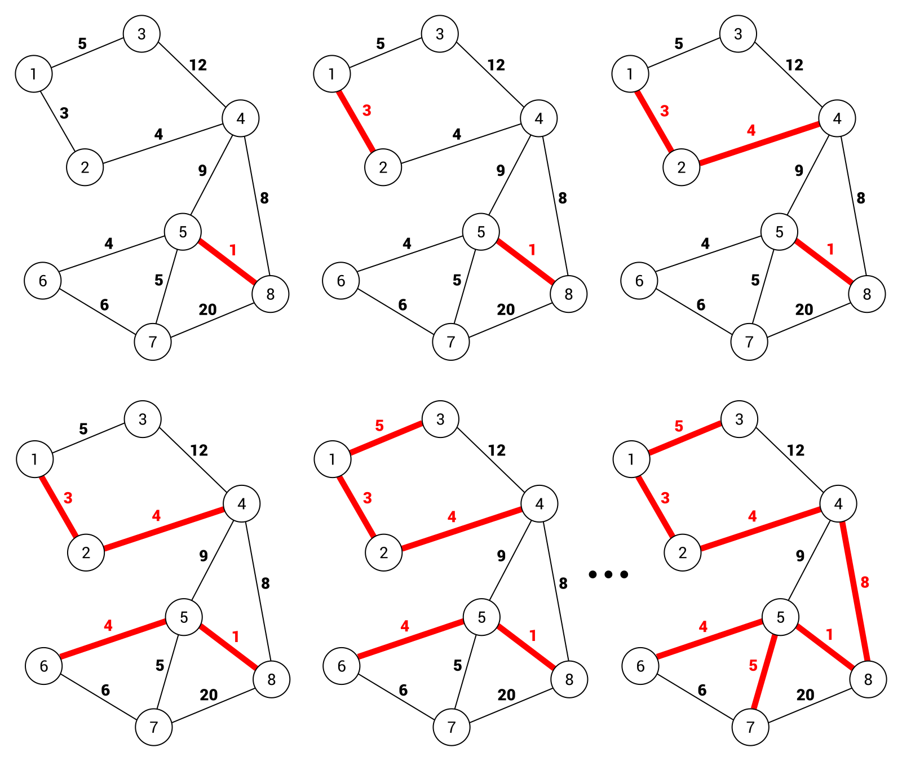

# 10 그래프 Graph 2 

## 출처

- C언어로 쉽게 풀어쓴 자료구조(천인국, 공용해, 하상호 저)

<br/>

<hr/>

## 목차

1. [최소 비용 신장 트리](#1-1-신장-트리란) <br/>
   &nbsp; 1-1. [신장 트리란](#1-1-신장-트리란) <br/>
   &nbsp; 1-2. [Kruskal의 MST 알고리즘](#1-2-kruskal의-mst-알고리즘) <br/>
   &nbsp; 1-3. [Prim의 MST 알고리즘](#1-3-prim의-mst-알고리즘) <br/>

<br/>

2. [최단 경로](#2-최단-경로) <br/>
   &nbsp; 2-1. [Dijkstra 알고리즘](#2-1-dijkstra-알고리즘) <br/>
   &nbsp; 2-2. [Floyd-Warshall 알고리즘](#2-2-floyd-warshall-알고리즘) <br/>

<br/>

3. [위상 정렬](#3-위상-정렬) <br/>

<br/><br/>

<hr/>

## 1. 최소 비용 신장 트리

<br/>

<hr/>

### 1-1. 신장 트리란?

<br/>

신장 트리(spanning tree)란 그래프 내의 모든 정점을 포함하는 트리를 의미한다. 절대 사이클이 있어서는 안 된다. n개의 정점을 가지는 그래프의 신장 트리는 n-1개의 간선을 가진다.


이미지 출처: https://imgur.com/xYkNNxl

<br/>

위의 그림을 살펴보면 신장트리는 그래프의 최소 연결 **부분 그래프**가 된다. 신장트리는 통신 네트워크를 구축할 때 많이 사용된다.

<br/>

최소 비용 신장 트리는 가중치가 부여된 네트워크를 가장 적은 수의 간선과 비용으로 연결된 트리를 의미한다. 최소 비용 신장 트리를 구하는 방법으로는 Kruskal 알고리즘과 Prim 알고리즘이 있고, 이 알고리즘들은  사이클을 포함하지 않고 반드시 n-1개의 간선만을 사용한다.


<br/>

<hr/>

### 1-2. Kruskal의 MST 알고리즘

<br/>

Kruskal 알고리즘은 탐욕법(Greedy Method: 그리디 알고리즘)를 사용한다. 여기서 **그리디 알고리즘**이란 선택의 순간마다 당장 눈앞에 보이는 최적의 상황만을 쫓아 최종적인 해답에 도달하는 방법이다. 선택의 순간에는 그 해가 최적이지만 최종적인 해답이 반드시 최적이라는 보장은 없다. 그러므로 탐욕법은 항상 최적으 해답을 주는지 검증이 필요한데, Kruskal 알고리즘은 최적의 해답을 주는 것이 증명되었다. 아래는 이 알고리즘의 pseudo-code이다.


이미지 출처: https://imgur.com/uJl8xg8

<br/>

아래 그림은 위 알고리즘을 적용해 그래프를 최소 비용 신장 트리를 만드는 과정을 보여준다.



이미지 출처: https://www.oreilly.com/library/view/c-data-structures/9781788833738/a2714e77-af8c-494a-a485-df5521ced3f0.xhtml

<br/>

그런데 여기서 간선을 추가할 때 사이클이 생기지 않도록 방지해야하는데 이것을 도와주는 것이 Kruskal의 union-find 알고리즘이다. union-find는 원소가 어떤 집합에 속하는지 알아냄으로써 Kruskal 알고리즘에서 사이클 검사에 사용된다. 아래는 union-find의 pseudo-code이다.

```
UNION(a, b):
    root1 = FIND(a); // 노드 a의 루트를 찾는다. 
    root2 = FIND(b); // 노드 b의 루트를 찾는다. 
    if root1 ≠ root2 // 합한다. 
        parent[root1] = root2;

FIND(curr): // curr의 루트를 찾는다. 
    if (parent[curr] == -1) 
        return curr; // 루트
    while (parent[curr] != -1) curr = parent[curr];
    return curr;
```

<br/>

아래 그림은 연결이 전혀 없는 정점에서 위 알고리즘의 union함수를 사용한 것으로, **union(A, B)**와 **union(C, H)**를 실행했을 때의 그림이다.


<br/>

아래 코드는 최소 비용 신장 트리를 만드는 과정을 그린 그림을 코드로 구현한 것이다.

- 코드 링크: [크루스칼 알고리즘](https://github.com/pythonstrup/TIL/tree/main/Data-Structure/graph/kruskal.c)

<br/>

Kruskal 알고리즘은 대부분 간선들을 정렬하는 시간에 좌우되고 사이클 테스트 등의 작업은 정렬에 비해 매우 신속하게 진행된다. 간선 e개를 퀵 정렬과 같이 효율적인 알고리즘으로 정렬하면 **시간 복잡도는 O(e * log(e))**가 된다.

<br/>

<hr/>

### 1-3. Prim의 MST 알고리즘

<br/>

Prim의 알고리즘은 시작 정점에서부터 시작해 신장 트리 집합을 단계적으로 확장해나가는 방법이다. 인접한 정점 중에서 최저 간선으로 연결된 정점 선택하여 신장 트리 집합에 추가한다. 아래는 알고리즘의 pseudo-code이다.

<br/>


<br/>

prim 알고리즘의 과정을 그림으로 나타내면 아래와 같다.


<br/>

- 코드 링크: [프림 알고리즘](https://github.com/pythonstrup/TIL/tree/main/Data-Structure/graph/prim.c)

<br/>

prim의 알고리즘은 주 반복문이 정점의 수 n만큼 반복하고, 내부 반복문이 n번 반복하므로 **시간 복잡도는 O(n^2)**이다.<br/>
희소한 그래프는 간선이 적기 때문에 크루스칼 그래프가 유리하고 밀집한 그래프라면 prim 알고리즘이 유리할 것이다.

<br/><br/>

<hr/>

## 2. 최단 경로

<br/>

최단 경로(shortest path) 문제는 네트워크에서 정점 i와 정점 j를 연결하는 경로 중에서 간선들의 가중치 합이 최소가 되는 경로를 찾는 문제이다. 간선의 가중치는 비용, 거리, 시간 등을 나타낸다.

<br/>

최단 경로 알고리즘은 2가지가 있다. 다익스트라 Dijkstra 알고리즘과 플로이드-워셜 Floyd-Warshall 알고리즘이다. 다익스트라 알고리즘은 시작 정점에서 다른 정점까지의 최단경로를 구한다. 반면 플로이드-워셜 알고리즘은 모든 정점에서 다른 모든 정점까지의 최단 경로를 구한다.

<br/>

<hr/>

### 2-1. Dijkstra 알고리즘

<br/>

다익스트라 알고리즘은 네트워크에서 시작 정점에서 다른 정점까지의 최단경로를 구한다. 시작 정점 v로부터 최단경로가 이미 발견된 정점들의 집합인 S의 개념을 사용한다. S를 계속해서 **업데이트**해 나가는 것이다. 여기서 1차원 배열인 **distance**의 역할이 중요한데, distance는 최단경로가 알려진 정점들만 이용해 다른 정점들까지의 최단경로의 길이를 저장해놓은 곳이다.

<br/>

다익스트라 알고리즘의 과정은 아래와 같다.

1. 각 단계에서 S안에 있지 않은 정점 중에서 가장 distance값이 작은 정점을 S에 추가한다.

2. 정점 w를 거쳐서 정점 u로 가는 가상적인 경로가 있다고 가정해보자.

3. 그러면 정점 v에서 정점 u까지의 정점 v에서 정점 w까지의 거리 ②와 정점 w에서 정점 u로 가는 거리 ③을 합한 값이 된다.

4. 그러나 경로 ②는 경로 ①보다 항상 길 수 밖에 없다. 왜냐하면 현재 distance값이 가장 작은 정점 u이기 때문이다. 경로 ①로 추가한다.


<br/>

5. 새로운 정점이 S에 추가되면 distance값 갱신한다. 수식은 아래와 같다.

distance[w] = min(distance[w], distance[u]+weight[u][w])


<br/>

아래는 다익스트라 알고리즘의 pseudo-code이다.

```
// 입력: 가중치 그래프 G, 가중치는 음수가 아님.
// 출력: distance 배열, distance[u]는 v에서 u까지의 최단 거리이다.

shortest_path(G, v)

S ← {v}
for 각 정점 w ∈ G do 
    distance[w] ← weight[v][w];

while 모든 정점이 S에 포함되지 않으면 do
    u ← 집합 S에 속하지 않는 정점 중에서 최소 distance 정점;
    S ← S∪{u}
    for u에 인접하고 S에 있는 각 정점 z do
        if distance[u] + weight[u][z] < distance[z]
            then distance[z] ← distance[u] + weight[u][z];
```

<br/>

다익스트라 알고리즘의 과정을 잘 설명해놓은 참고사이트가 있다. 스텝별로 경로를 어떻게 업데이트해나가는지 자세하게 알 수 있다.


- 사이트 링크: [dijkstra algorithm process](https://www.101computing.net/dijkstras-shortest-path-algorithm/)

<br/>

코드 링크: [다익스트라 알고리즘 코드](https://github.com/pythonstrup/TIL/tree/main/Data-Structure/graph/dijkstra.c)

<br/>

네트워크에 n개의 정점이 존재한다면, 다익스트라 알고리즘의 주 반복문은 n번 반복하고 내부 반복문은 2n번 반복하므로 O(n^2)의 복잡도를 가진다. 

<br/>

<hr/>

### 2-2. Floyd-Warshall 알고리즘

<br/>

플로이드-워셜 알고리즘은 아주 간단한 알고리즘이다. 모든 정점 사이의 최단 경로를 한 번에 모두 찾아주는 알고리즘이다. 2차원 배열을 이용해 3중 반복을 한다. 

<br/>

플로이드-워셜 알고리즘의 과정은 아래와 같다.

1. $A^k$[i][j]는 0부터 k까지의 정점만을 이용한 정점 i에서 j까지의 최단 경로 길이를 의미한다.

2. $A^{-1}$ → $A^0$ → $A^1$ → … → $A^{n-1}$순으로 최단 경로 구해간다.

3. $A^{k-1}$까지 구해진 상태에서 k번째 정점이 추가로 고려되는 상황을
생각하면 0부터 k까지의 정점만을 사용하여 정점 i에서 정점 j로 가는 최단 경로는 다음의 2가지의 경우로 나뉘어진다
    - 정점 k를 거치지 않는 경우 : $A^k$[i][j] 는 k보다 큰 정점은 통과하지 않으므로 최단거리는 여전히 $A^{k-1}$[i][j]]임
    - 정점 k를 거치는 경우 : i에서 k까지의 최단거리 $A^{k-1}$[i][k]에 k에서 j까지의 최단거리 $A^{k-1}$[k][j]를 더한 값


<br/>

- Floyd-Warshall 알고리즘의 pseude-code

```
floyd(G):
for k ← 0 to n - 1 
    for i ← 0 to n - 1 
        for j ← 0 to n - 1
            A[i][j] = min(A[i][j], A[i][k] + A[k][j])
```

<br/>

플로이드-워셜 알고리즘을 자세하게 설명해놓은 블로그이다.

- 참고사이트: [floyd-warshall algorithm](https://blog.devgenius.io/floyd-warshall-algorithm-f004a01ae40e)

<br/>

코드 링크: [플로이드-워셜 알고리즘 코드](https://github.com/pythonstrup/TIL/tree/main/Data-Structure/graph/floyd-warshall.c)

<br/>

네트워크에 n개의 정점이 있다면, 플로이드-워셜 알고리즘은 3중 반복문을 실행하므로 시간복잡도는 O(n^3)이 된다. 만약 다익스트라 알고리즘을 이용해 모든 정점의 최단 경로를 구하려면 O(n^2)의 시간복잡도를 가진 알고리즘을 n번 반복해 O(n^3)이 되기 때문에 코드가 훨씬 간단한 플로이드-워셜 알고리즘을 사용하는 것이 좋다.

<br/>

<hr/>

## 3. 위상 정렬

<br/>

위상 정렬(Topological Sort)은 순서가 정해져있는 작업을 차례대로 수행해야할 때 그 순서를 결정해주기 위해 사용하는 알고리즘이다. 방향 그래프에서 간선 <u, v>가 있다면 정점 u는 정점 v를 선행한다. 방향 그래프 정점들의 선행 순서를 위배하지 않으면서 모든 정점을 나열한다.
<br/>
아래의 예는, 대학교 수업의 선수과목 관계이다.


위의 위상순서는 (0,1,2,3,4,5), (1,0,2,3,4,5) 등이 될 수 있다. 하지만 **(2,0,1,3,4,5)**는 2번 정점이 0번 정점보다 앞에 오기 때문에 **위상 순서가 아니다.**

<br/>

아래는 그래프 위상 정렬의 pseudo-code이다.

```
입력: 그래프
출력: 위상 정렬 결과

topo_sort(Graph)

for i<-0 to n-1 do
    if (모든 정점이 선행 정점을 가지면)
        then 사이클이 존재하고 위상 정렬이 불가;
    선행 정점을 가지지 않는 정점 v 선택;
    v를 출력;
    v와 v에서 나온 모든 간선들을 그래프에서 삭제;
```

pseudo-code의 논리를 그래프에 그대로 적용하면 아래와 같아지고, 위상정렬 순서대로 출력할 수 있게 된다.


```
출력 결과: 정점1 -> 정점4 -> 정점0 -> 정점2 -> 정점3 -> 정점5
```

<br/>

코드 링크: [위상 정렬](https://github.com/pythonstrup/TIL/tree/main/Data-Structure/graph/topological_sort.c)

<br/>

정점의 수를 V, 간선의 수를 E라고 했을 때 위상 정렬의 시간복잡도는 O(V + E)가 된다.

<br/>

<hr/>
