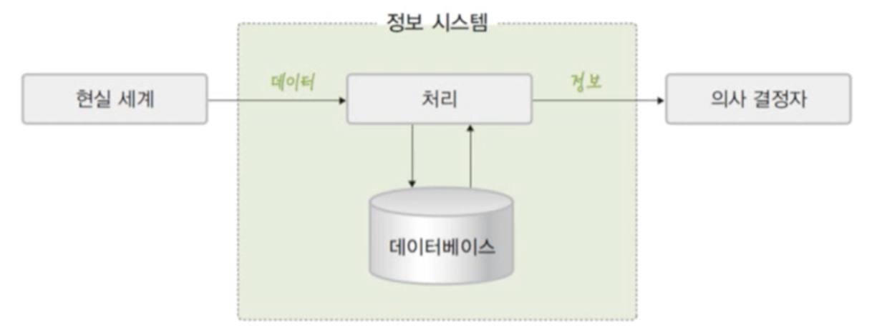

# 데이터베이스의 기본 개념

## 목차

1. [데이터베이스 관련 개념](#1-데이터베이스의-필요성)  
   &nbsp; 1-1. [데이터와 정보](#1-1-데이터와-정보)  
   &nbsp; 1-2. [정보 처리](#1-2-정보-처리information-processing)  
   &nbsp; 1-3. [정보시스템과 데이터베이스](#1-3-정보시스템과-데이터베이스)  

 

2. [데이터베이스의 정의](#2-데이터베이스의-정의)  
   &nbsp; 2-1. [데이터베이스란](#2-1-데이터베이스란)  
   &nbsp; 2-2. [데이터베이스의 특징](#2-2-데이터베이스의-특징)  

  

## 1. 데이터베이스 관련 개념

### 1-1. 데이터와 정보

- 데이터
  - 현실 세계에서 단순히 관찰하거나 측정해 수집한 값
- 정보(information)
  - 의사 결정에 유용하게 활용할 수 있도록 데이터를 처리한 결과물

 

### 1-2. 정보 처리(Information Processing)

- 데이터에서 정보를 추출하는 과정 또는 방법

 

### 1-3. 정보시스템과 데이터베이스

- 정보시스템(Information System)

  - 조직 운영에 필요한 데이터를 수집하여 저장해두었다가 필요할 때 유용한 정보를 만들어주는 수단

- 데이터베이스
  - 정보 시스템 안에서 데이터를 저장하고 있다가 필요할 때 제공하는 역할

 

## 2. 데이터베이스의 정의

### 2-1. 데이터베이스란

- 데이터베이스는 여러 사람들이 데이터를 **공유**하고 사용하기 위해서 **통합**해 **저장**한 **운영** 데이터의 집합이다.

1. **통합된 데이터(Integrated Data)**: 최소의 중복과 통제 가능한 중복만 허용하는 데이터

2. **저장된 데이터(Stored Data)**: 컴퓨터가 접근할 수 있는 저장 매체에 저장된 자료

3. **운영 데이터(Operational Data)**: 조직의 고유한 업무를 수행하는 데 존재 가치가 확실하고 없어서는 안 될 반드시 필요한 자료

4. **공유 데이터(Shared Data)**: 여러 응용 시스템들이 공동으로 소유하고 유지하는 자료

 

### 2-2. 데이터베이스의 특징

1. **실시간 접근성(Real-Time Accessibility)** : 수시적이고 비정형적인 질의(조회)에 대하여 실시간 처리에 의한 응답이 가능해야 한다.

2. **계속적인 변화(Continuous Evolution)** : 데이터베이스의 상태는 동적이다. 즉 새로운 데이터의 삽입(Insert),삭제(Delete),갱신(Update)로 항상 최신의 데이터를 유지한다.

3. **동시공용(Concurrent Sharing)**: 데이터베이스는 서로 다른 목적을 가진 여러 응용자들을 위한 것이므로 다수의 사용자가 동시에 같은 내용의 데이터를 이용할 수 있어야 한다.

4. **내용에 의한 참조(Content Reference)**: 데이터베이스에 있는 데이터를 참조할 때 데이터 레코드의 주소나 위치에 의해서가 아니라, 사용자가 요구하는 데이터 내용으로 데이터를 찾는다.

 

# 참고자료

- 데이터베이스의 원리와 응용, 한양대학교 백현미, KOCW

- https://rebro.kr/

- https://coding-factory.tistory.com/214

- https://programming-workspace.tistory.com/17
