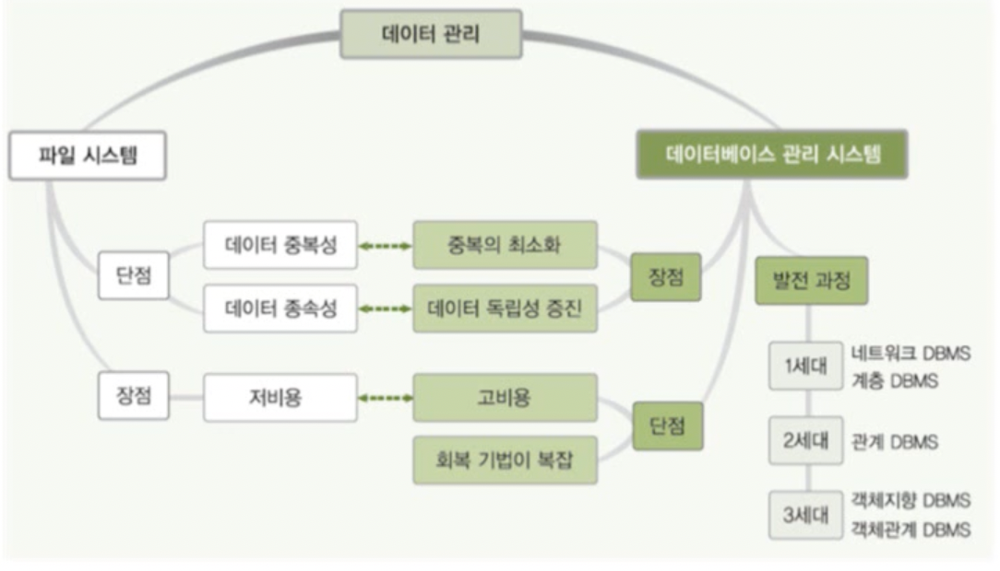
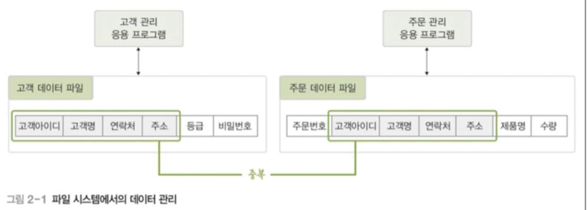
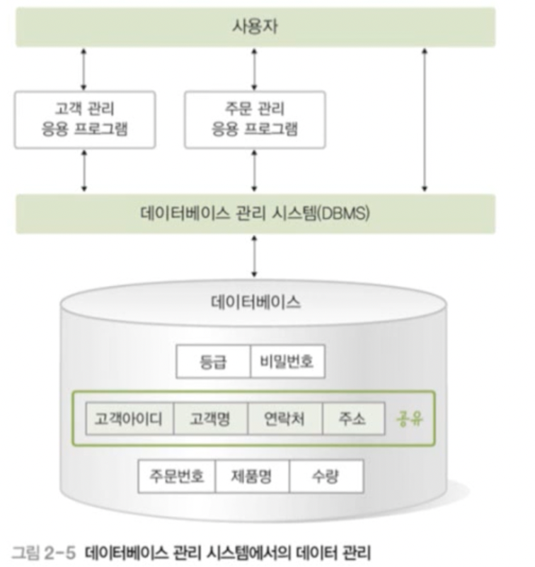
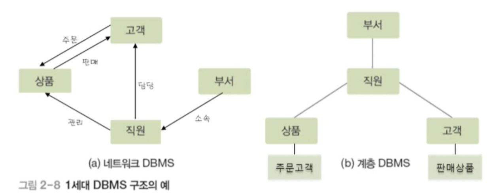
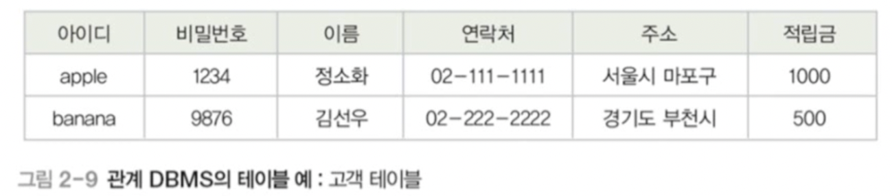
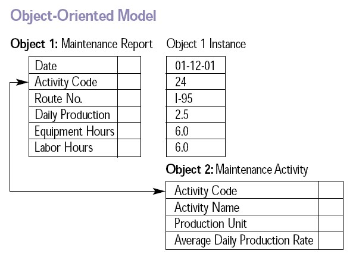

# 02 데이터베이스 관리 시스템 DBMS

## 목차

1. [DBMS의 등장 배경](#1-dbms의-등장-배경)  
   &nbsp; 1-1. [파일 시스템](#1-1-파일-시스템)  
   &nbsp; 1-2. [파일 시스템의 문제점](#1-2-파일-시스템의-문제점)  
   &nbsp; 1-3. [DBMS의 등장](#1-3-dbms의-등장)  

 

2. [DBMS의 개념](#2-dbms의-개념)  
   &nbsp; 2-1. [데이터 관리](#2-1-데이터-관리)  
   &nbsp; 2-2. [DBMS의 주요 기능](#2-2-dbms의-주요-기능)  
   &nbsp; 2-3. [DBMS의 장점](#2-3-dbms의-장점)  
   &nbsp; 2-4. [DBMS의 단점](#2-4-dbms의-단점)  

 

3. [DBMS 발전 과정](#3-dbms-발전-과정)  
   &nbsp; 3-1. [1세대 - 네트워크, 계층](#3-1-1세대)  
   &nbsp; 3-2. [2세대 - 관계형](#3-2-2세대)  
   &nbsp; 3-3. [3세대 - 객체형](#3-3-3세대)  
   &nbsp; 3-4. [4세대 - NoSQL, NewSQL](#3-4-4세대)  
   &nbsp; 3-5. [잠깐! 여기서 SQL이란?](#3-5-sql이란)  

  

## 1. DBMS의 등장 배경

### 1-1. 파일 시스템

- DBMS가 생겨나기 전에는 File System으로 데이터를 관리했다.
- 데이터를 파일로 관리하기 위해 파일을 생성, 삭제, 수정, 검색하는 기능을 제공하는 소프트웨어이다.
- **응용 프로그램마다** 필요한 데이터를 별도의 파일로 관리한다. 때문에 데이터의 중복이 발생할 수 있다.

### 1-2. 파일 시스템의 문제점

- **데이터 중복성**: 위에 봤다시피 같은 내용의 데이터가 여러 파일에 중복 저장된다. 저장 공간의 낭비는 물론 데이터 일관성과 데이터 무결성을 유지하기 어렵다.
- 데이터 파일에 대한 동시 공유, 보안, 회복 기능이 부족하다.
  - 동시 공유 측면: 파일 시스템에서는 서로 다른 파일 시스템의 데이터를 공유하는 서비스를 제공하지 않는다.
  - 보안 측면: 중복된 데이터를 가지는 모든 파일시스템을 동일한 보안 수준으로 유지하는 것이 굉장히 어려운 일이기 때문에, 하나라도 뚫리면, 다른 파일시스템의 정보도 새어나가므로 보안적인 취약점이 있다.
  - 회복 기능 측면: 장애가 발생했을 때, 데이터를 일관된 상태로 유지하기가 어렵다.
- **데이터 종속성**: 응용 프로그램이 데이터 파일에 종속적이다. 사용하는 파일의 구조를 변경하면 응용 프로그램도 함께 변경해야한다.
- 때문에 응용 프로그램 개발이 쉽지 않다. 응용 프로그램은 데이터가 필요하기 때문에 파일 시스템을 이용하기 위한 모든 로직을 응용 프로그램에 담고 있어야해서, 프로그램이 상당히 복잡해진다.

### 1-3. DBMS의 등장

- DBMS(DataBase Management System)은 파일 시스템의 문제(데이터 중복성과 종속성)를 해결하기위해 제시된 소프트웨어이다.
- 조직에 필요한 데이터를 데이터베이스에 **통합**하여 저장하고 관리한다.

 

## 2. DBMS의 개념

### 2-1. 데이터 관리

- 파일 시스템을 사용했을 때는 별도의 파일 시스템으로 나눠 관리하던 데이터들을 **통합**해서 관리한다!
- 데이터가 통합되어 있기 때문에 각각의 응용 프로그램이 데이터를 공유할 수 있다.

### 2-2. DBMS의 주요 기능

- **정의 기능**: 데이터베이스 구조를 정의하거나 수정할 수 있다.
- **조작 기능**: 데이터를 삽입, 삭제, 수정, 검색하는 연산을 할 수 있다.
- **제어 기능**: 데이터를 정확하고 안전하게 유지할 수 있다. (일관성 및 무결성 유지, 장애회복, 데이터접근허용, 보안유지, 동시접속처리)

### 2-3. DBMS의 장점

1. 데이터 중복을 통제
   - 데이터를 통합 관리하여 데이터 일관성을 유지할 수 있다.
2. 데이터 독립성 확보
   - DBMS는 응용프로그램을 대신해서 DB에 접근하고 관리하는 모든 책임을 지기 때문에 DB구조가 변경되어도 응용프로그램이 영향을 받지 않는다.
3. 데이터 동시 공유 가능
   - DBMS는 DB에 저장된 데이터를 여러 응용 프로그램이 공유해 같은 데이터에 동시에 접근할 수 있도록 한다.
4. 데이터 보안 향상
   - 중앙집중식으로 관리하여 데이터에 대한 효율적인 접근이 가능하다.
   - 권한이 없는 사용자의 접근, 허용되지 않는 데이터 연산에 대한 요청을 사전에 차단할 수 있다.
   - 사용자별로 접근 가능한 DB영역을 제어 할 수 있다.
5. 데이터 무결성(정확성) 유지
   - 데이터가 변경될 때마다 정확하지 않거나 허용되지 않는 값을 검사함으로써(유효성) 데이터 무결성을 유지할 수 있게한다.
6. 표준화
   - 데이터에 대한 모든 접근이 DBMS를 통해 이루어지기 때문에 DB에 접근방법, 데이터 형식 및 구조를 표준화 하기 편리하다.
7. 장애 발생 시 회복
   - DBMS는 장애 발생시 일관성과 무결성을 유지하면서 장애발생 이전으로 복구하는 회복 기능을 지원한다.
8. 프로그램 개발 비용 절감
   - 데이터에 대한 관리를 DBMS가 대신하여 파일시스템 사용하는것보다 비용이 절약된다.

### 2-4. DBMS의 단점

1. 비용이 많이 듦
   - 초기 DBMS 설치와 DB 구성에 비용이 발생힌다.
2. 백업, 회복 방법이 복잡함
   - 데이터 양이 많고, 여러 사용자에게 데이터를 동시에 공유하므로 장애 발생시 원인을 파악하기 어렵다.
3. 중앙 집중 관리로 인한 취약점 발생
   - 모든 데이터가 DB에 통합되어 있고 데이터를 관리하는 권한은 DBMS에 집중되어있어 장애 발생시 DBMS가 중단된다.

 

## 3. DBMS 발전 과정

### 3-1. 1세대

- 1세대: 네트워크 DBMS, 계층 DBMS
- 네트워크 DBMS : 데이터베이스를 그래프 형태로 구성한 방식이다. 구조가 복잡하고, 변경하기 어렵다는 단점이 있다. 예로는 IDS가 있다.
- 계층 DBMS : 데이터베이스를 트리 형태로 구성한 방식이다. 이것 또한 표현하기 어렵고, 구조변경이 어렵다는 단점이 있다. 예로는 IMS가 있다.

### 3-2. 2세대

- 2세대: 관계 DBMS
- 관계 DBMS : 데이터베이스를 테이블 형태로 구성한 방식이다. 직관적이고, 유지보수하기 쉽다. 대용량의 데이터를 체계적으로 관리할 수 있고 데이터의 무결성도 잘 보장된다. 하지만 시스템 자원을 많이 차지하여 시스템이 전반적으로 느려지는 단점이 있다. 예로는 오라클, MSSQL, MySQL, Access, Informix 등이 있다.

### 3-3. 3세대

- 3세대: 객체지향 DBMS, 객체관계 DBMS
- 객체지향 DBMS : 객체를 이용해 데이터베이스를 구성한 방식이다.객체지향DBMS와 관계형DBMS의 가장 큰 차이는 DB의 저장에 있다. 관계형DB의 경우 미리 정의된 데이터 형식에 맞춰 데이터만을 저장할 수 있는 데 비해 객체지향DBMS의 경우 ‘데이터와 연관된 프로그램’인 ‘메소드’를 함께 저장해 사용할 수 있다는 점이 가장 큰 차이점이다. 하지만 검색 성능이 느리고, 대규모 트랜잭션 처리 성능이 떨어진다는 단점이 있다.
- 객체관계 DBMS : 객체지향DBMS과 관계DBMS를 합친 것이다. 각각의 장점들을 가져옴으로서 성능을 강화했다.

### 3-4. 4세대

- 4세대: NoSQL, NewSQL
- NoSQL DBMS : Not Only SQL의 약자로서, 관계형 데이터베이스와 반대되는 개념이다. 데이터와 테이블 간의 관계를 정의하지 않고 정해진 스키마가 없어 자유롭게 데이터를 저장할 수 있다. 데이터 구조를 미리 정해두지 않아서 유연하고, 확장성이 뛰어나다는 장점이있다. SNS의 발전으로 인한 비정형 데이터의 증가로 NoSQL이 환영받고 있다.
- NewSQL DBMS : 관계 DBMS의 장점과 NoSQL의 장점을 모아 탄생했다.

### 3-5. 잠깐! 여기서 SQL이란?

- 데이터베이스를 조작하는 언어로 DBMS 제작 회사와 독립적이다. 대부분의 DBMS 제작회사가 표준 SQL을 준수하려고 노력하지만 각 DBMS마다 특징이 있기 때문에 완전히 통일되기는 어렵다.

 

# 공부자료

- https://agilestarskim.github.io/posts/what-is-database-02

- https://whitehairhan.tistory.com/m/238

# 참고자료

- 데이터베이스의 원리와 응용, 한양대학교 백현미, KOCW

- https://rebro.kr/

- https://coding-factory.tistory.com/214

- https://programming-workspace.tistory.com/17
