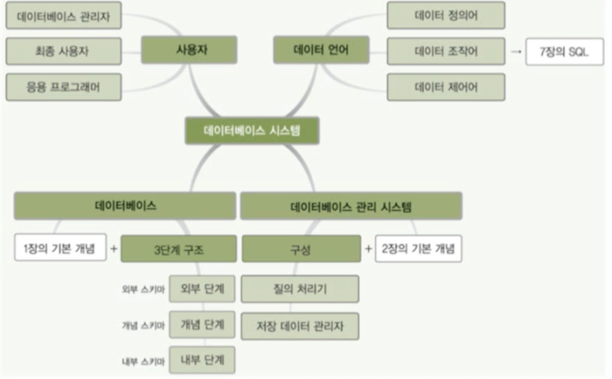
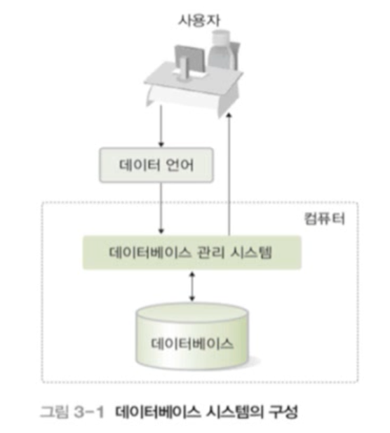
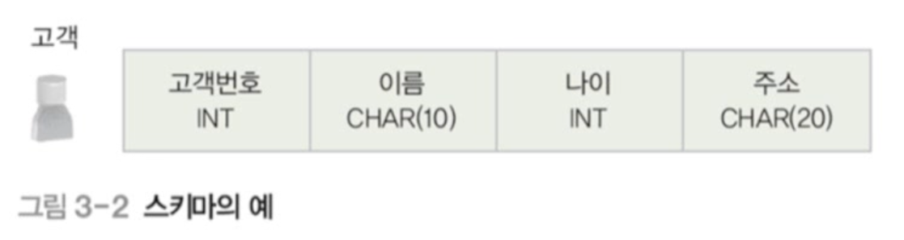
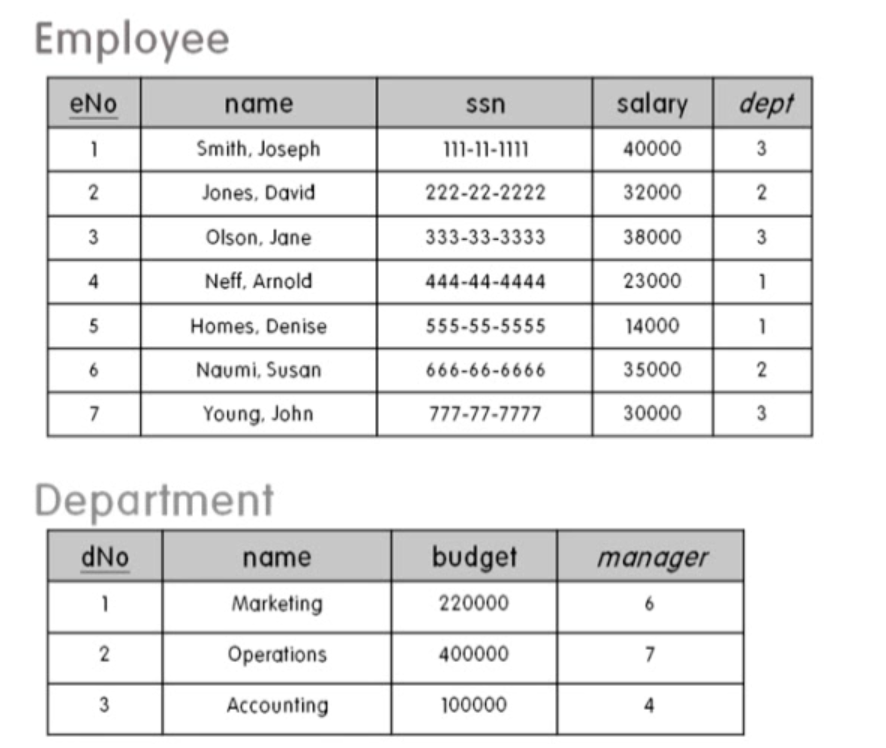
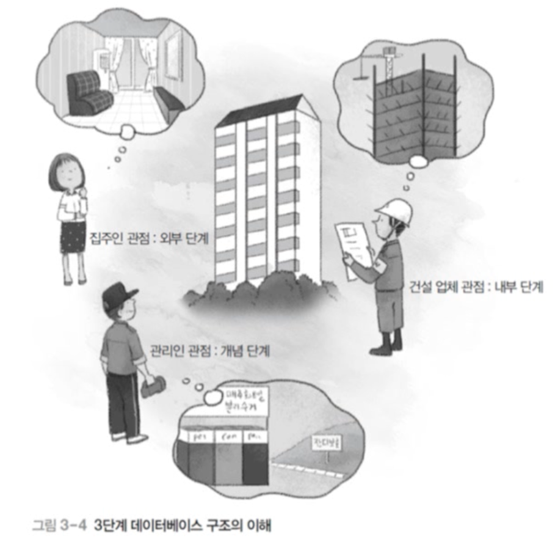
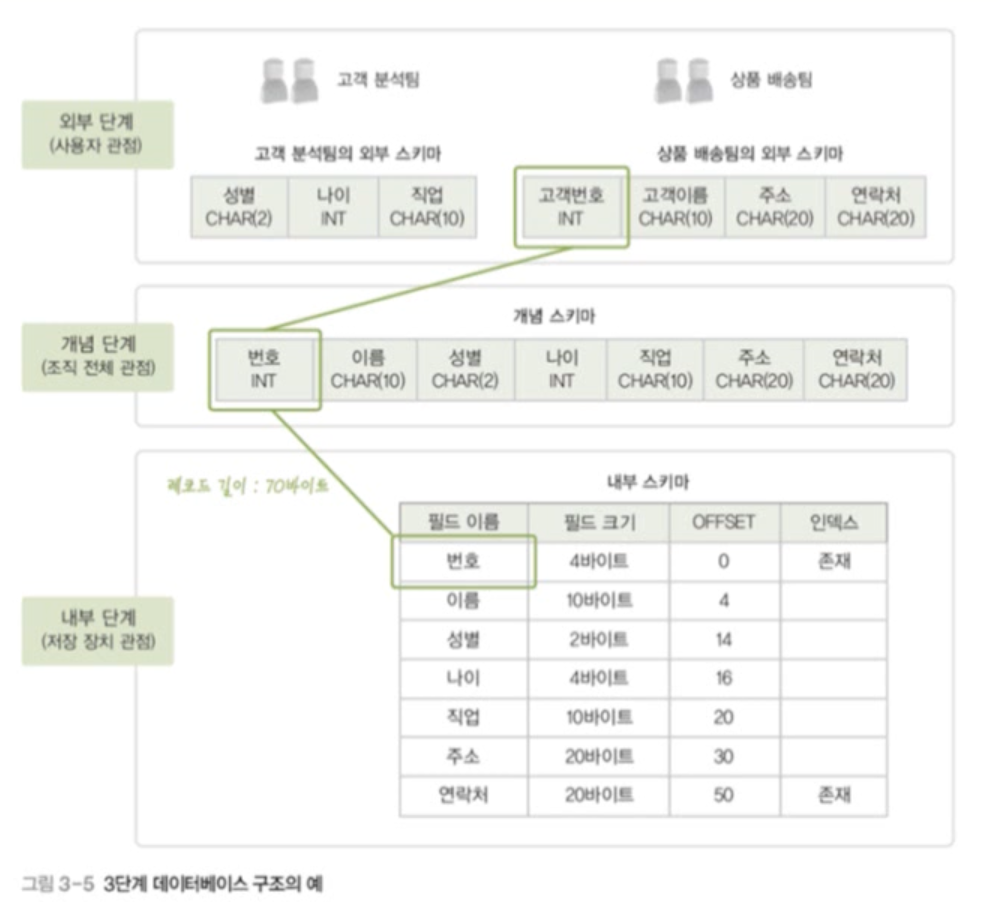
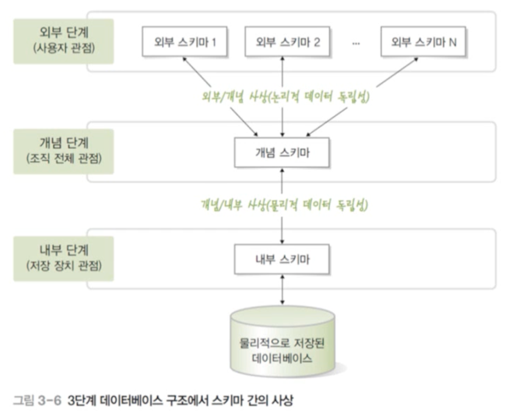
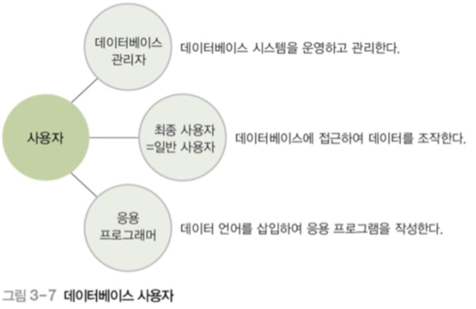
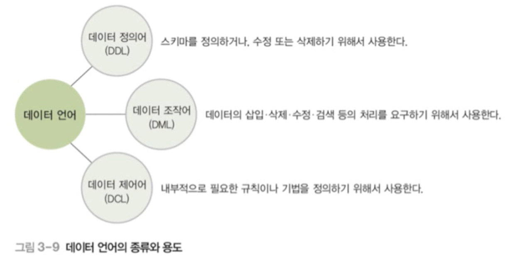
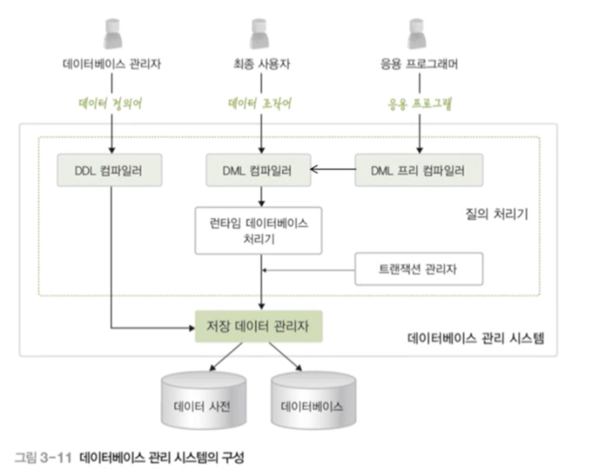

# 데이터베이스 관리 시스템

## 목차

1. [데이터베이스 시스템이란](#1-데이터베이스-시스템이란)  
   &nbsp; 1-1. [DBS](#1-1-dbs)  

 

2. [DB System의 구조](#2-db-system의-구조)  
   &nbsp; 2-1. [스키마와 인스턴스](#2-1-스키마와-인스턴스)  
   &nbsp; 2-2. [스키마와 인스턴스의 사례](#2-2-스키마와-인스턴스의-사례)  
   &nbsp; 2-3. [3단계 데이터베이스 구조](#2-3-3단계-데이터베이스-구조)  
   &nbsp; 2-4. [외부 단계](#2-4-외부-단계)  
   &nbsp; 2-5. [개념 단계](#2-5-개념-단계)  
   &nbsp; 2-6. [내부 단계](#2-6-내부-단계)  
   &nbsp; 2-7. [데이터베이스 구조의 사상 - Mapping](#2-7-데이터베이스-구조의-사상mapping)  
   &nbsp; 2-8. [용어 정리](#2-8-용어-정리)  

 

3. [사용자](#3-사용자)  
   &nbsp; 3-1. [데이터베이스 사용자](#3-1-데이터베이스-사용자)  
   &nbsp; 3-2. [데이터베이스 관리자 DBA](#3-2-데이터베이스-관리자-database-administrator)  
   &nbsp; 3-3. [최종 사용자](#3-3-최종-사용자-end-user)  
   &nbsp; 3-4. [응용 프로그래머](#3-4-응용-프로그래머-application-programmer)  

 

4. [데이터 언어](#4-데이터-언어)  
   &nbsp; 4-1. [데이터 언어란?](#4-1-데이터-언어란)  
   &nbsp; 4-2. [데이터 정의어](#4-2-데이터-정의어ddl-data-definition-language)  
   &nbsp; 4-3. [데이터 조작어](#4-3-데이터-조작어dml-data-manipulation-language)  
   &nbsp; 4-4. [데이터 제어어](#4-4-데이터-제어어dcl-data-control-language)  

 

5. [데이터베이스 관리 시스템 DBMS](#5-데이터베이스-관리-시스템-dbms)  

  

## 1. 데이터베이스 시스템이란?

- 데이터베이스, 데이터베이스 관리 시스템, 데이터베이스 시스템은 기본적으로 다른 것이다.

### 1-1. DBS

- DataBase System은 데이터 베이스에 데이터를 저장하고, 이를 관리하여 조직에 필요한 정보를 생성해주는 시스템을 말한다.

 

## 2. DB System의 구조

### 2-1. 스키마와 인스턴스

- 스키마 schema
  - 데이터베이스에 저장되는 데이터 구조와 제약조건을 정의한 것
  - 데이터에서 포함하고 있는 변수들, 속성들은 무엇인지 포함하고 있는 정보
- 인스턴스 instance
  - 스키마에 따라 데이터베이스에 실제로 저장된 값

### 2-2. 스키마와 인스턴스의 사례

- 아래를 살펴봤을 때 스키마와 인스턴스가 각각 무엇인지 알아보자.
- 위에 회색으로 칠해져있는 값들과 표에서는 보이지 않지만 그 값들의 속성, 제약조건들을 스키마라 한다.
- 반면, 인스턴스는 해당 속성값에 따라 저장된 실제 데이터를 의미한다.
  - ex) 7, Young, Jonh, 777-77-7777, 30000, 3

### 2-3. 3단계 데이터베이스 구조

- 미국 표준화 기관인 ANSI/SPARC에서 제안
- 데이터베이스를 쉽게 이해하고 이용할 수 있도록 하나의 데이터베이스를 관점에 따라 세 단계로 나눈 것이다.
  - 외부 단계(External Level): 개별 사용자 관점
  - 개념 단계(Conceptual Level): 조직 전체의 관점
  - 내부 단계(Internal Level): 물리적인 저장 장치의 관점
- 각 단계별로 다른 추상화(abstraction)을 제공한다.
  - 내부 단계에서 외부 단계로 갈수록 추상화 레벨이 높아진다.

- 구체적인 예시

### 2-4. 외부 단계

- 데이터베이스를 개별 사용자 관점에서 이해하고 표현하는 단계
- 데이터베이스 하나에 외부 스키마가 여러 개 존재할 수 있다.
- 외부 스키마 External Schema
  - 외부 단계에서 사용자에게 필요한 데이터베이스를 정의한 것
  - 각 사용자가 생각하는 데이터베이스의 모습, 즉 논리적구조로 사용자마다 다르다.
  - 서브 스키마(sub schema)라고도 한다.

### 2-5. 개념 단계

- 데이터베이스를 조직 전체의 관점에서 이해하고 표현하는 단계
- 데이터베이스 하나에 개념 스키마가 하나만 존재한다.
- 개념 스키마 Conceptual Schema
  - 개념 단계에서 데이터베이스 전체의 논리적 구조를 정의한 것
  - 조직 전체의 관점에서 생각하는 데이터베이스의 모습
  - 전체 데이터베이스에 어떤 데이터가 저장되는지, 데이터들 간에는 어떤 관계가 존재하고 어떤 제약조건이 존재하는지에 대한 정의뿐만 아니라, 데이터에 대한 보안 정책이나 접근 권한에 대한 정의도 포함한다.

### 2-6. 내부 단계

- 데이터베이스를 저장 장치의 관점에서 이해하고 표현하는 단계
- 데이터베이스 하나에 내부 스키마가 하나만 존재함
- 내부 스키마(internal schema)
  - 전체 데이터베이스가 저장 장치에 실제로 저장되는 방법을 정의한 것
  - 레코드 구조, 필드 크기, 레코드 접근 경로 등 물리적 저장 구조를 정의

### 2-7. 데이터베이스 구조의 사상(Mapping)

- 스키마 사이의 대응 관계
  - 외부/개념 사상 : 외부 스키마와 개념 스키마의 대응 관계
    - 응용 인터페이스(application interface)라고도 함
  - 개념/내부 사상 : 개념 스키마와 내부 스키마의 대응 관계
    - 저장 인터페이스(storage interface)라고도 함
- 미리 정의된 사상 정보를 이용하여 사용자가 원하는 데이터에 접근
  - 데이터베이스를 3단계 구조로 나누고 단계별로 스키마를 유지하며 스키마 사이의 대응 관계를 정의하는 궁극적인 목적 => <u>**데이터 독립성의 실현**</u>

### 2-8. 용어 정리

- 데이터 독립성 Data Independency
  - 하위 스키마를 변경하더라도 상위 스키마가 영향을 받지 않는 특성
  - 논리적 데이터 독립성
    - 개념 스키마가 변경되어도 외부 스키마는 영향을 받지 않음
    - 개념 스키마가 변경되면 관련된 외부/개념 사상만 정확하게 수정해주면 됨
  - 물리적 데이터 독립성
    - 내부 스키마가 변경되어도 개념 스키마는 영향을 받지 않음
    - 내부 스키마가 변경되면 관련된 개념/내부 사상만 정확하게 수정해주면 됨
- 데이터 사전 Data Dictionary
  - 시스템 카탈로그(system catalog)라고도 함
  - 데이터베이스에 저장되는 데이터에 관한 정보, 즉 메타 데이터를 유지 하는 시스템 데이터베이스
    - 메타 데이터(meta data) : 데이터에 대한 데이터
  - 스키마, 사상 정보, 다양한 제약조건 등을 저장
  - 데이터베이스 관리 시스템이 스스로 생성하고 유지함
  - 일반 사용자도 접근이 가능하지만 저장된 내용을 검색만 할 수 있음
- 데이터 디렉토리(data directory)
  - 데이터 사전에 있는 데이터에 실제로 접근하는 데 필요한 위치 정보를 저장하는 시스템 데이터베이스
  - 일반 사용자의 접근은 허용되지 않음
- 사용자 데이터베이스(user database)
  - 사용자가 실제로 이용하는 데이터가 저장되어 있는 일반 데이터베이스

 

## 3. 사용자

### 3-1. 데이터베이스 사용자

- 데이터 베이스를 이용하기 위해 접근하는 모든 사람
- 이용 목적에 따라 데이터베이스 관리자, 최종 사용자, 응용 프로그래머로 구분

### 3-2. 데이터베이스 관리자 Database Administrator

- **DBA**란 데이터베이스 시스템을 운영 관리하는 사람이다.
- 주로 데이터 정의어와 데이터 제어어를 사용
- 주요 업무
- 데이터베이스 구성 요소 선정
- 데이터베이스 스키마 정의
- 물리적 저장 구조와 접근 방법 결정
- 무결성 유지를 위한 제약조건 정의
- 보안 및 접근 권한 정책 결정
- 백업 및 회복 기법 정의
- 시스템 데이터베이스 관리
- 시스템 성능 감시 및 성능 분석
- 데이터베이스 재구성

### 3-3. 최종 사용자 End User

- 데이터베이스에 접근하여 데이터를 조작(삽입•삭제•수정•검색)하는 사람
- 주로 데이터 조작어를 사용
- 캐주얼 사용자와 초보 사용자로 구분

### 3-4. 응용 프로그래머 Application Programmer

- 데이터 언어를 삽입하여 응용 프로그램을 작성하는 사람
- 주로 데이터 조작어를 사용

 

## 4. 데이터 언어

### 4-1. 데이터 언어란?

- 사용자와 데이터베이스 관리 시스템 간의 통신 수단
- 사용 목적에 따라 데이터 정의어, 데이터 조작어, 데이터 제어어로 구분
- SQL이 데이터 언어에 속한다.

### 4-2. 데이터 정의어(DDL; Data Definition Language)

- 스키마를 정의하거나, 수정 또는 삭제하기 위해 사용

### 4-3. 데이터 조작어(DML; Data Manipulation Language)

- 데이터의 삽입 삭제 수정 검색 등의 처리를 요구하기 위해 사용
- 절차적 데이터 조작어와 비절차적 데이터 조작어로 구분
- 절차적 데이터 조작어(procedural DML)
  - 사용자가 어떤(what) 데이터를 원하고 그 데이터를 얻기 위해 어떻게(how) 처리해야 하는지도 설명
- 비절차적 데이터 조작어(nonprocedural DML)
  - 사용자가 어떤(what) 데이터를 원하는지만 설명
  - 선언적 언어(declarative language)라고도 함

### 4-4. 데이터 제어어(DCL; Data Control Language)

- 내부적으로 필요한 규칙이나 기법을 정의하기 위해 사용
- 사용 목적
  - 무결성 : 정확하고 유효한 데이터만 유지
  - 보안 : 허가받지 않은 사용자의 데이터 접근 차단, 허가된 사용자에 권한 부여
  - 회복 : 장애가 발생해도 데이터 일관성 유지
  - 동시성 제어 : 동시 공유 지원

 

## 5. 데이터베이스 관리 시스템 DBMS

- 데이터베이스 관리와 사용자의 데이터 처리 요구 수행
- 주요 구성 요소
  - **질의 처리기(query processor)**
    - 사용자의 데이터 처리 요구를 해석하여 처리
    - DDL 컴파일러, DML 프리 컴파일러, DML 컴파일러, 런타임 데이터베이스 처리기, 트랜잭션 관리자 등을 포함
  - **저장 데이터 관리자(stored data manager)**
    - 디스크에 저장된 사용자 데이터베이스와 데이터 사전을 관리하고, 여기에 실제로 접 근하는 역할을 담당

 

# 참고자료

- 데이터베이스의 원리와 응용, 한양대학교 백현미, KOCW

- https://rebro.kr/
