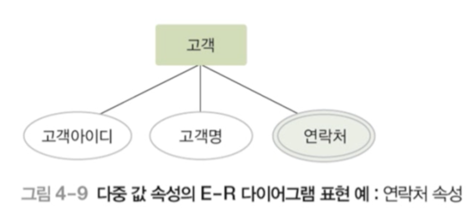

# 데이터베이스 관리 시스템

## 목차

1. [데이터베이스의 설계 단계](#1-데이터베이스의-설계-단계)  
   &nbsp; 1-1. [데이터베이스 설계](#1-1-데이터베이스-설계)  

 

2. [데이터 모델링과 데이터 모델의 개념](#2-데이터-모델링과-데이터-모델의-개념)  
   &nbsp; 2-1. [데이터 모델링 Data Modeling](#2-1-데이터-모델링-data-modeling)  
   &nbsp; 2-2. [2단계 데이터 모델링](#2-2-2단계-데이터-모델링)  
   &nbsp; 2-3. [데이터 모델 Data Model](#2-3-데이터-모델-data-model)  

 

3. [ERD의 개념](#3-erd의-개념)  
   &nbsp; 3-1. [개체 관계 모델](#3-1-개체-관계-모델)  
   &nbsp; 3-2. [개체 관계 다이어그램](#3-2-개체-관계-다이어그램)  

 

4. [ERD Entity](#4-erd-entity)  
   &nbsp; 4-1. [개체 Entity](#4-1-개체-entity)  
   &nbsp; 4-2. [개체에 대한 이해](#4-2-개체에-대한-이해)  

 

5. [ERD Attribute](#5-erd-attribute)  
   &nbsp; 5-1. [속성 Attribute](#5-1-속성-attribute)  
   &nbsp; 5-2. [속성에 대한 이해](#5-2-속성에-대한-이해)  
   &nbsp; 5-3. [단일값 속성과 다중값 속성](#5-3-단일-값-속성과-다중-값-속성)  
   &nbsp; 5-4. [단순 속성과 복합 속성](#5-4-단순-속성과-복합-속성)  
   &nbsp; 5-5. [유도 속성 Derived Attribute](#5-5-유도-속성-derived-attribute)  
   &nbsp; 5-6. [Null](#5-6-null)  
   &nbsp; 5-7. [키속성 Key Attribute](#5-7-키속성-key-attribute)  

 

6. [ERD Relationship](#6-erd-relationship)  
   &nbsp; 6-1. [관계란](#6-1-관계란)  
   &nbsp; 6-2. [관계의 유형](#6-2-관계의-유형)  
   &nbsp; 6-3. [일대일 관계](#6-3-일대일-관계)  
   &nbsp; 6-4. [일대다 관계](#6-4-일대다-관계)  
   &nbsp; 6-5. [다대다 관계](#6-5-다대다-관계)  
   &nbsp; 6-6. [관계의 참여 특성](#6-6-관계의-참여-특성)  
   &nbsp; 6-7. [관계의 종속성](#6-7-관계의-종속성)  

 

7. [ERD 기호 정리](#7-erd-기호-정리)  

  

## 1. 데이터베이스의 설계 단계

### 1-1. 데이터베이스 설계

- 사용자의 다양한 요구 사항을 고려하여 데이터베이스를 생성하는 과정
- E-R 모델과 릴레이션 변환 규칙을 이용한 설계의 과정

  

## 2. 데이터 모델링과 데이터 모델의 개념

### 2-1. 데이터 모델링 Data Modeling

- 현실 세계에 존재하는 데이터를 컴퓨터 세계의 데이터베이스로 옮기는 변환 과정
- 데이터베이스 설계의 핵심 과정

### 2-2. 2단계 데이터 모델링

- 개념적 데이터 모델링 Conceptual Modeling
  - 현실 세계의 중요 데이터를 추출하여 개념 세계로 옮기는 작업
- 논리적 데이터 모델링 Logical Modeling
  - 개념 세계의 데이터를 데이터베이스에 저장하는 구조로 표현하는 작업

### 2-3. 데이터 모델 Data Model

- 데이터 모델링의 결과물을 표현하는 도구
- 개념적 데이터 모델
  - 사람의 머리로 이해할 수 있도록 현실 세계를 개념적 모델링하여 데이터베이스의 개념적 구조로 표현하는 도구
  - ex) 개체-관계 모델
- 논리적 데이터 모델
  - 개념적 구조를 논리적 모델링하여 데이터베이스의 논리적 구조로 표현하는 도구
  - ex) 관계 데이터 모델

  

## 3. ERD의 개념

### 3-1. 개체-관계 모델

- Entity-Relationship Model
- 피터 첸(Peter Chen)이 제안한 개념적 데이터 모델
- 개체와 개체 간의 관계를 이용해 현실 세계를 개념적 구조로 표현
- 핵심 요소: 개체, 속성, 관계

### 3-2. 개체-관계 다이어그램

- ERD(E-R Diagram)
- 개체-관계 모델을 이용해 현실 세계를 개념적으로 모델링한 결과물을 그림으로 표현한 것

  

### 4. ERD: Entity

### 4-1. 개체 Entity

- 현실 세계에서 조직을 운영하는 데 꼭 필요한 사람이나 사물과 같이 구별되는 모든 것
- 저장할 가치가 있는 중요 데이터를 가지고 있는 사람이나 사물, 개념, 사건 등
- 다른 개체와 구별되는 이름을 가지고 있고, 각 개체만의 고유한 특성이나 상태, 즉 속성을 하나 이상 가지고 있음
- 예) 서점에 필요한 개체 : 고객, 책
- 예) 학교에 필요한 개체 : 학과, 과목
- 파일 구조의 레코드(record)와 대응됨
- ERD에서는 아래와 같이 사각형으로 표현하고 사각형 안에 이름을 적는다.

### 4-2. 개체에 대한 이해

- 개체 타입 Entity Type

  - 개체를 고유의 이름과 속성들로 정의한 것
  - 파일 구조의 레코드 타입(record type)에 대응된다.

- 개체 인스턴스 Entity Instance

  - 개체를 구성하고 있는 속성이 실제 값을 가짐으로써 실체화된 개체
  - 개체 어커런스(Entity Occurrence)라고도 한다.
  - 파일 구조의 레코드 인스턴스(Record Instance)에 대응된다.

- 개체 집합 Entity Set
  - 특정 개체 타입에 대한 개체 인스턴스들을 모아놓을 것

  

### 5. ERD: Attribute

### 5-1. 속성 Attribute

- 개체나 관계가 가지고 있는 고유의 특성
- 의미있는 데이터의 가장 작은 논리적 단위
- 파일 구조의 필드(field)와 대응됨
- ERD에서 타원으로 표현하고 타원 안에 이름을 표기

### 5-2. 속성에 대한 이해

### 5-3. 단일 값 속성과 다중 값 속성

- 단일 값 속성 Single-Valued Attribute
  - 값을 하나만 가질 수 있는 속성
  - 예) 고객 개체의 이름, 적립금 속성
- 다중 값 속성 Multi-Valued Attribute
  - 값을 여러 개 가질 수 있는 속성
  - 예) 고객 개체의 연락처 속성
  - 예) 책 개체의 저자 속성
  - ER 다이어그램에서 이중 타원으로 표현

### 5-4. 단순 속성과 복합 속성

- 단순 속성 Simple Attribute
  - 의미를 더는 분해할 수 없는 속성
  - 예) 고객 개체의 적립금 속성
  - 예) 책 개체의 이름, ISBN, 가격 속성
- 복합 속성 Composite Attribute
  - 의미를 분해할 수 있는 속성
  - 예)고객 개체의 주소 속성
    - 도, 시, 동, 우편번호 등으로 의미를 세분화할 수 있음
  - 예)고객 개체의 생년월일 속성
    - 연, 월, 일로 의미를 세분화할 수 있음

### 5-5. 유도 속성 Derived Attribute

- 기존의 다른 속성의 값에서 유도되어 결정되는 속성
- 값이 별도로 저장되지 않음
- 예) 책 개체의 가격과 할인율 속성으로 계산되는 판매가격 속성
- 예) 고객 개체의 출생연도 속성으로 계산되는 나이 속성
- ER 다이어그램에서 점선 타원으로 표현

### 5-6. Null

- 널 속성 Null Attribute
  - 널 값이 허용되는 속성
- 널(Null) 값
  - 아직 결정되지 않거나 모르는 값 또는 존재하지 않는 값
  - 공백이나 0과는 의미가 다름
  - 예) 등급 속성이 널 값> 등급이 아직 결정되지 않았음을 의미

### 5-7. 키속성 Key Attribute

- 각 개체 인스턴스를 식별하는 데 사용되는 속성
- 모든 개체 인스턴스의 키 속성 값이 다름
- 둘 이상의 속성들로 구성되기도 함
- 예) 고객 개체의 고객아이디 속성
- ER 다이어그램에서 밑줄로 표현

  

## 6. ERD: Relationship

### 6-1. 관계란?

- 개체와 개체가 맺고 있는 의미 있는 연관성
- 개체 집합들 사이의 대응 관계, 즉 매핑(mapping)을 의미
- 예) 고객 개체와 책 개체 간의 구매 관계
  - "고객은 책을 구매한다"
- ER 다이어그램에서 마름모로 표현

### 6-2. 관계의 유형

- 관계에 참여하는 개체 타입의 수 기준
  - 이항 관계: 개체 타입 두 개가 맺는 관계
  - 삼항 관계: 개체 타입 세 개가 맺는 관계
  - 순환 관계: 개체 타입 하나가 자기 자신과 맺는 관계
- 매핑 카디널리티 기준
  - 일대일(1:1) 관계
  - 일대다(1:n)관계
  - 다대다(n:m) 관계

> 매핑 카디 널리티 Mapping Cardinality
> 관계를 맺는 두 개체 집합에서, 각 개체 인스턴스가 연관성을 맺고 있는 상대 개체 집합의 인스턴스 개수)

### 6-3. 일대일 관계

- 개체 A의 각 개체 인스턴스가 개체 B의 개체 인스턴스 <u>하나</u>와 관계를 맺을 수 있고, 개체 B의 각 개체 인스턴스도 개체 A의 개체 인스턴스 <u>하나</u>와 관계를 맺는 관계

### 6-4. 일대다 관계

- 개체 A의 각 개체 인스턴스가 개체 B의 개체 인스턴스 <u>여러 개</u>와 관계를 맺을 수 있지만, 개체 B의 각 개체 인스턴스는 개체 A의 개체 인스턴스 <u>하나</u>와 관계를 맺을 수 있음

### 6-5. 다대다 관계

- 개체 A의 각 개체 인스턴스가 개체 B의 개체 인스턴스 <u>여러 개</u>와 관계를 맺을 수 있고, 개체 B의 각 개체 인스턴스도 개체 A의 개체 인스턴스 <u>여러 개</u>와 관계를 맺을 수 있음

### 6-6. 관계의 참여 특성

- 필수적 참여(전체 참여) Total-Participation
  - 모든 개체 인스턴스가 관계에 반드시 참여해야 하는 것을 의미한다.
  - ex) 고객 개체가 책 개체와의 구매 관계에 필수적으로 참여
    - 모든 고객은 책을 반드시 구매해야함.
  - ERD에서 이중선으로 표현
- 부분적 참여(선택적 참여) Partial (or Optional) Participation
  - 개체 인스턴스 중 일부만 관계에 참여해도 되는 것을 의미한다.
  - ex) 책 개체가 고객 개체와의 구매 관계에 선택적으로 참여
    - 고객이 구매하지 않은 책이 존재할 수 있다.

### 6-7. 관계의 종속성

- 약한 개체 Weak Entity
  - 다른 개체의 존재 여부에 의존적인 개체
- 오너 개체 Owner Entity
  - 다른 개체의 존재 여부를 결정하는 개체
- 오너 개체와 약한 개체는 일반적으로 <u>일대다의 관계</u>를 가지고, 약한 개체는 오너 개체와의 관계에 <u>필수적으로 참여</u>하는 특징이 있음
- 약한 개체는 <u>오너 개체의 키를 포함하여 키를 구성하는 특징</u>이 있음
- ERD에서 약한 개체는 이중 사각형으로 표현하고 약한 개체가 오너 개체와 맺는 관계는 이중 마름모로 표현

- 위의 직원과 부양가족은 일대다 관계가 성립된다!

  

# 7. ERD 기호 정리

- 사각형 : 개체를 표현
- 마름모 : 관계를 표현
- 타원: 속성을 표현
- 링크(연결선): 각 요소를 연결
- 레이블 : 일대일, 일대다, 다대다 관계

  

# 참고자료

- 데이터베이스의 원리와 응용, 한양대학교 백현미, KOCW

- https://lee-mandu.tistory.com/461

- https://dreamlog.tistory.com/575

- https://mjn5027.tistory.com/43
