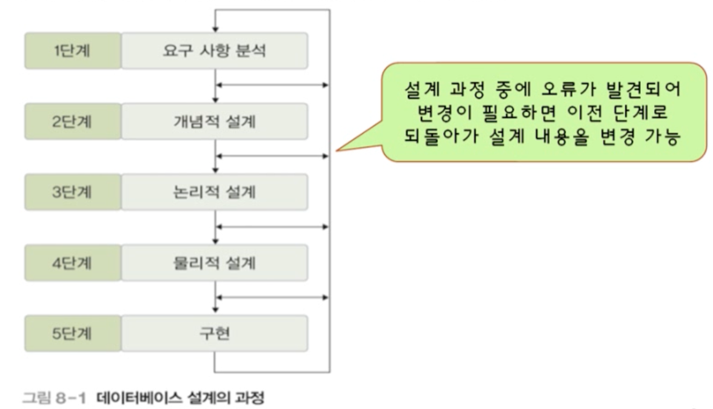

# 5 예시로 알아보는 데이터 모델링

## 목차

1. [데이터베이스의 설계 단계](#1-데이터베이스의-설계-단계) <br/>

<br/>

2. [설계 1단계: 요구 사항 분석](#2-설계-1단계-요구-사항-분석) <br/>

<br/>

3. [설계 2단계: 개념적 설계](#3-설계-2단계-개념적-설계) <br/>
   &nbsp; 3-1. [개체와 속성 추출](#3-1-개체와-속성-추출) <br/>
   &nbsp; 3-2. [개체 간 관계 설정](#3-2-개체-간-관계-설정) <br/>
   &nbsp; 3-3. [ERD 표현](#3-3-erd-표현) <br/>

<br/><br/>

## 1. 데이터베이스 설계 단계

- E-R 모델과 릴레이션 변환 규칙을 이용한 설계의 과정




<br/>

## 2. 설계 1단계: 요구 사항 분석

- 목적
  - 사용자의 요구 사항을 수집하고 분석하여 개발할 데이터베이스의 용도를 파악
  - 업무에 필요한 데이터가 무엇인지, 그 데이터에 어떤 처리가 필요한지 등을 고려
- 결과물
  - 요구 사항 명세서
- 주요 작업
  - 데이터베이스를 실제로 사용할 주요 사용자의 범위를 결정
  - 사용자가 조직에서 수행하는 업무를 분석
  - 면담, 설문 조사, 업무 관련 문서 분석 등의 방법을 이용해 요구 사항 수집
  - 수집된 요구 사항에 대한 분석 결과를 요구 사항 명세서로 작성
- 예시 (한빛 마트 데이터베이스)

```
1. 한빛 마트에 회원으로 가입하려면 회원아이디, 비밀번호, 이름, 나이, 직업을 입력해야 한다.
2. 가입한 회원에게는 등급과 적립금이 부여된다.
3. 회원은 회원아이디로 식별한다.
4. 상품에 대한 상품번호, 상품명, 재고량, 단가 정보를 유지해야 한다.
5. 상품은 상품번호로 식별한다.
6. 회원은 여러 상품을 주문할 수 있고, 하나의 상품을 여러 회원이 주문할 수 있다.
7. 회원이 상품을 주문하면 주문에 대한 주문번호, 주문수량, 배송지, 주문일자 정보를 유지해야 한다.
8. 각 상품은 한 제조업체가 공급하고, 제조업체 하나는 여러 상품을 공급할 수 있다.
9. 제조업체가 상품을 공급하면 공급일자와 공급량 정보를 유지해야 한다.
10. 제조업체에 대한 제조업체명, 전화번호, 위치, 담당자 정보를 유지해야 한다.
11. 제조업체는 제조업체명으로 식별한다.
12. 회원은 게시글을 여러 개 작성할 수 있고, 게시글 하나는 한 명의 회원만 작성할 수 있다.
13. 게시글에 대한 글번호, 글제목, 글내용, 작성일자 정보를 유지해야 한다.
14. 게시글은 글번호로 식별한다.
```

## 3. 설계 2단계: 개념적 설계

- 목적
  - DBMS에 독립적인 개념적 스키마 설계
  - 요구 사항 분석 결과물을 개념적 데이터 모델을 이용해 개념적 구조로 표현 -> 개념적 모델링
  - 일반적으로 ER 모델을 많이 이용
- 결과물
  - 개념적 스키마 : ER 다이어그램
- 주요 작업
  - 요구 사항 분석 결과를 기반으로 중요한 개체를 추출하고 개체 간의 관계를 결정하여 ER 다이어그램으로 표현
- 작업 과정
  - STEP 1) **개체** 추출, 각 개체의 주요 **속성**과 키 속성 선별
  - STEP 2) 개체 간의 **관계** 결정
  - STEP 3) E-R 다이어그램으로 표현


### 3-1. 개체와 속성 추출

- 개체: 저장할만한 가치가 있는 중요 데이터를 가진 사람이나 사물 등
  - 예) 병원 데이터베이스 개발에 필요한 개체
- 개체 추출 방법
  - 요구 사항 문장에서 업무와 관련이 깊은 의미 있는 **명사**를 개체의 이름으로 부여한다.
    - 업무와 관련이 적은 일반적이고 광범위한 의미의 명사는 제외 (예: 한빛마트)
    - 의미가 같은 명사가 여러 개일 경우는 대표 명사 하나만 선택 (예: 회원, 고객)
  - 찾아낸 명사를 개체와 속성으로 분류하면 좋다.
- 예시 1
  - `한빛마트`는 광범위하기 때문에 제외
  - `회원`을 개체로 둔다.
  - `아이디`, `비밀번호`, `이름`, `나이`, `직업`, `등급`, `적립금` 등은 속성으로 분류할 수 있다.
  - `아이디`를 키 속성으로 분류한다.
    
- 예시 결론
  - 모든 요구 사항을 분석해보면 아래와 같은 결과를 얻어낼 수 있다.


<br/>

### 3-2. 개체 간 관계 설정

- 관계 : 개체 간의 의미 있는 연관성
- 관계 추출 방법
  - 요구 사항 문장에서 개체 간의 연관성을 의미 있게 표현한 **동사**를 찾아서 부여한다.
    - 의미가 같은 동사가 여러 개일 경우는 대표 명사 하나만 선택
  - 찾아낸 관계에 대해 매핑 카디널리티와 참여 특성을 결정하면 된다.
    - 매핑 카디널리티 : 일대일(1:1), 일대다(1:n), 다대다(n:m)
    - 참여 특성 : 필수적 참여 / 선택적 참여
- 예시 1
  - `입력해야 한다`는 관계를 보여주는 동사로 보기 어렵다.
  - `부여된다`, `식별한다`도 마찬가지다.


- 예시 2
  - `주문할 수 있다`에서 회원 개체와 상품 개체가 `주문`이라는 관계를 맺고 있으며 다대다 관계임을 알 수 있다. 회원과 상품 개체는 이 관계에 선택적으로 참여함도 유추할 수 있다.
  - `주문` 관계의 속성: 주문번호, 주문수량, 배송지, 주문일자


- 예시 3
  - `공급할 수 있다`에서 상품과 제조업체가 `공급`이라는 관계를 맺고 있고 `제조업체: 상품`이 일대다 관계임을 알 수 있다. 상품은 관계에 필수적으로 참여하며, 제조업체는 선택적으로 참여한다.
  - `공급` 관계의 속성: 공급일자, 공급량


- 예시 결론


<br/>

### 3-3. ERD 표현

- 관계별


- 전체


