# 06 관계 데이터 모델 Relation Data Model

## 목차

0. [데이터베이스 설계 단계](#0-데이터베이스-설계-단계)  

 

1. [관계 데이터 모델](#1-관계-데이터-모델)  
   &nbsp; 1-1. [기본 개념](#1-1-기본-개념)  
   &nbsp; 1-2. [용어 정리](#1-2-용어-정리)  
   &nbsp; 1-3. [릴레이션의 구성](#1-3-릴레이션의-구성)  
   &nbsp; 1-4. [데이터베이스의 구성](#1-4-데이터베이스의-구성)  
   &nbsp; 1-5. [릴레이션의 특성](#1-5-릴레이션의-특성)  
   &nbsp; 1-6. [키 Key](#1-6-키-key)  
   &nbsp; 1-7. [키의 종류](#1-7-키의-종류)  

 

2. [관계 데이터 모델의 제약](#2-관계-데이터-모델의-제약)  
   &nbsp; 2-1. [무결성 제약 조건](#2-1-무결성-제약-조건-integrity-constraint)  
   &nbsp; 2-2. [개체 무결성 제약 조건](#2-2-개체-무결성-제약조건-entity-integrity-constraint)  
   &nbsp; 2-3. [참조 무결성 제약 조건](#2-3-참조-무결성-제약조건)  

  

## 0. 데이터베이스 설계 단계

- 관계 데이터 모델은 데이터베이스 설계 단계 중 3번째인 논리적 설계 단계와 관련이 깊다.

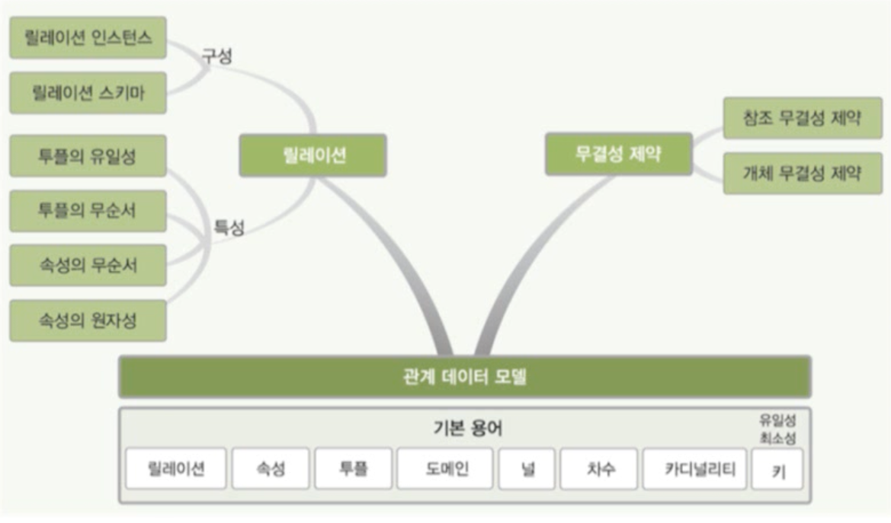

 

## 1. 관계 데이터 모델

### 1-1. 기본 개념

- 개념적 구조를 논리적 구조로 표현하는 논리적 데이터 모델
- 하나의 개체에 대한 데이터를 하나의 릴레이션에 저장

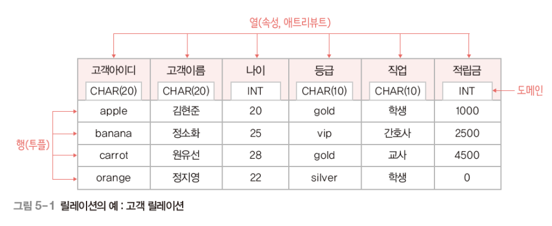

### 1-2. 용어 정리

- 릴레이션(relation)
  - 하나의 개체에 관한 데이터를 2차원 테이블의 구조로 저장한 것
  - 파일 관리 시스템 관점에서 파일(file)에 대응
- 속성(attribute)
  - 릴레이션의 열, 애트리뷰트
  - 파일 관리 시스템 관점에서 필드(field)에 대응
- 투플(tuple)
  - 릴레이션의 행
  - 파일 관리 시스템 관점에서 레코드(record)에 대응
- 도메인(domain)
  - 하나의 속성이 가질 수 있는 모든 값의 집합
  - 속성 값을 입력 및 수정할 때 적합성의 판단 기준이 됨
  - 일반적으로 속성의 특성을 고려한 데이터 타입으로 정의
- 널(nul)
  - 속성 값을 아직 모르거나 해당되는 값이 없음을 표현
- 차수(degree)
  - 하나의 릴레이션에서 속성의 전체 개수
- 카디널리티(cardicality)
  - 하나의 릴레이션에서 투플의 전체 개수

### 1-3. 릴레이션의 구성

- 릴레이션 스키마(relation schema)
  - 릴레이션의 논리적 구조
  - 릴레이션의 이름과 릴레이션에 포함된 모든 속성 이름으로 정의
  - 예) 고객(고객아이디, 고객이름, 나이, 등급, 직업, 적립금)
  - 릴레이션 내포(relation intension)라고도 함
  - 정적인 특징이 있음
- 릴레이션 인스턴스(relation instance)
  - 어느 한 시점에 릴레이션에 존재하는 투플들의 집합
  - 릴레이션 외연(relation extension)이라고도 함
  - 동적인 특징이 있음

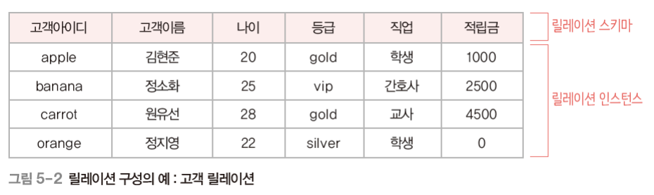

### 1-4. 데이터베이스의 구성

- 데이터베이스 스키마(database schema)
  - 데이터베이스의 전체 구조
  - 데이터베이스를 구성하는 릴레이션 스키마의 모음
- 데이터베이스 인스턴스(database instance)
  - 데이터베이스를 구성하는 릴레이션 인스턴스의 모음

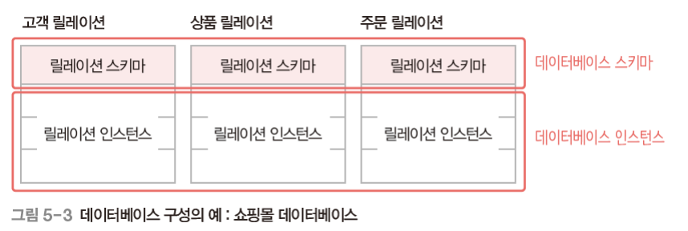

### 1-5. 릴레이션의 특성

- 투플의 유일성
  - 하나의 릴레이션에는 동일한 투플이 존재할 수 없다.
- 투플의 무순서
  - 하나의 릴레이션에서 투플 사이의 순서는 무의미하다.
- 속성의 무순서
  - 하나의 릴레이션에서 속성 사이의 순서는 무의미하다.
- 속성의 원자성
  - 속성 값으로 원자 값만 사용할 수 있다.

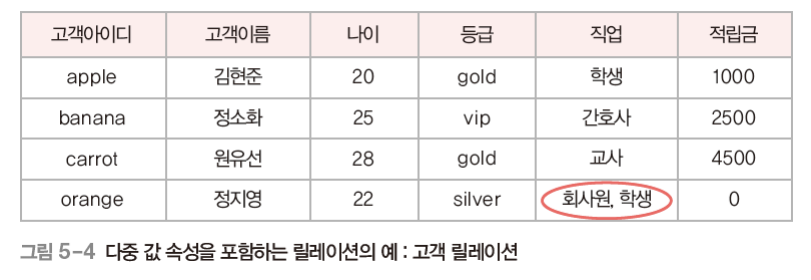

- 위와 같이 속성을 다중 값으로 갖는 것은 속성으로 볼 수 없다. (속성의 원자성 위반)

### 1-6. 키 Key

- 릴레이션에서 투플들을 유일하게 구별하는 속성 또는 속성들의 집합

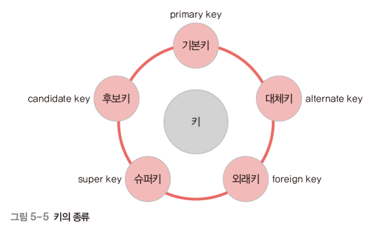

- 키의 특성
  - 유일성(uniqueness): 하나의 릴레이션에서 모든 투플은 서로 다른 키 값을 가져야 함
  - 최소성(minimality): 꼭 필요한 최소한의 속성들로만 키를 구성

### 1-7 키의 종류

- 슈퍼키(super key)
  - **유일성**을 만족하는 속성 또는 속성들의 집합
  - 예) 고객 릴레이션의 슈퍼키 : 고객아이디, (고객아이디, 고객이름), (고객이름, 주소) 등
- 후보키(candidate key)
  - **유일성**과 **최소성**을 만족하는 속성 또는 속성들의 집합
  - 예) 고객 릴레이션의 후보키 : 고객아이디, (고객이름, 주소) 등
- 기본키(primary key)
  - 후보키 중에서 기본적으로 사용하기 위해 선택한 키
  - 널값을 가질 수 있는 속성이 포함된 후보키는 부적합
  - 값이 자주 변경될 수 있는 속성이 포함된 후보키는 부적합
  - 단순한 후보키를 선택
  - 예) 고객 릴레이션의 기본키 : 고객아이디
- 대체키(alternate key)
  - 기본키로 선택되지 못한 후보키
  - 예) 고객 릴레이션의 대체키 : (고객이름, 주소)

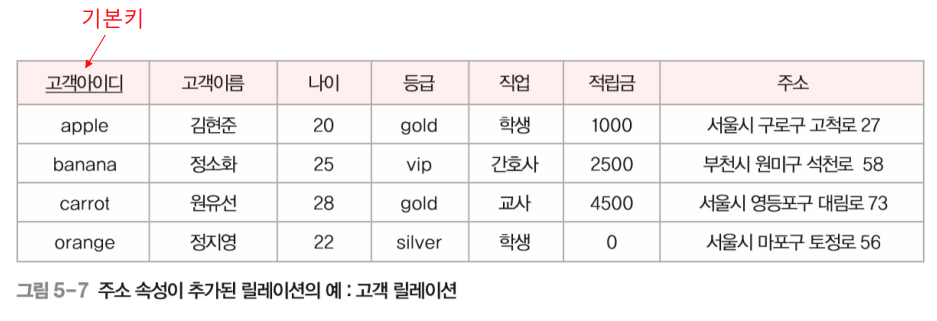
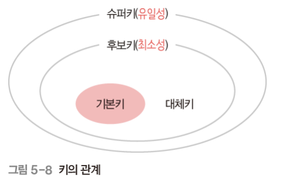

- 외래키(foreign key)
  - 다른 릴레이션의 기본키를 참조하는 속성 또는 속성들의 집합
  - 릴레이션들 간의 관계를 표현
  - 참조하는 릴레이션 : 외래키를 가진 릴레이션
  - 참조되는 릴레이션 : 외래키가 참조하는 기본키를 가진 릴레이션

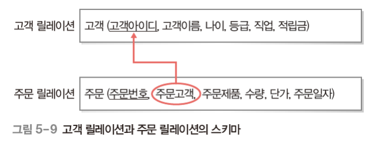

- 고객 릴레이션과 주문 릴레이션이 관계를 맺어 주문 릴레이션의 투플과 연관성 있는 고객 릴레이션의 투플을 연결할 수 있다. (외래키의 역할)

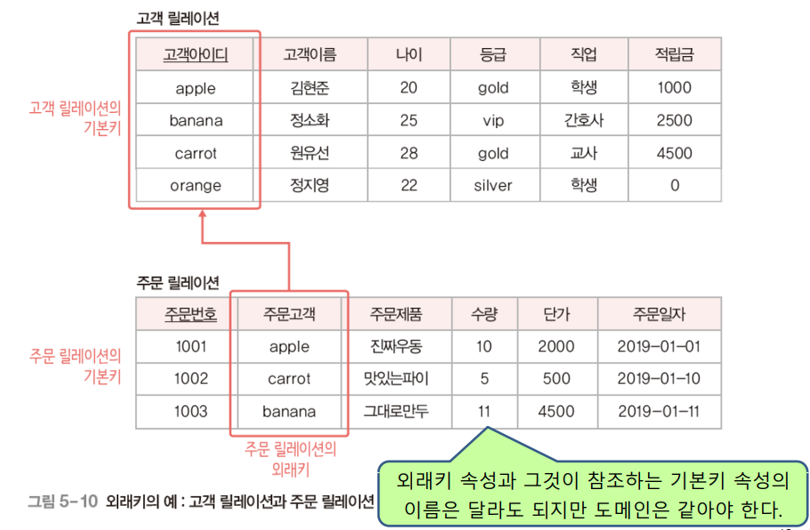

- 하나의 릴레이션에는 외래키가 여러 개 존재할 수도 있고 외래키를 기본키로 사용할 수도 있다. 또 다른 속성과 조합해 기본키로 사용할 수도 있다.

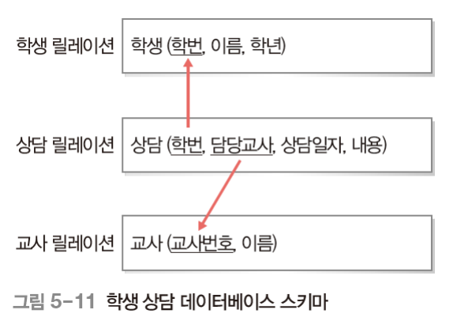

- 같은 릴레이션의 기본키를 참조하는 외래키도 정의할 수 있다. 그리고 외래키 속성은 널 값을 가질 수도 있다.

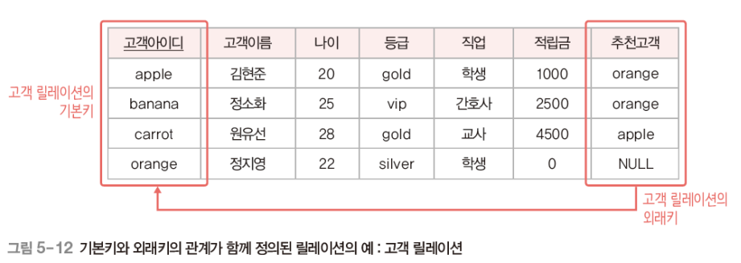

  

## 2. 관계 데이터 모델의 제약

### 2-1. 무결성 제약 조건 Integrity Constraint

- 데이터의 무결성을 보장하고 일관된 상태로 유지하기 위한 규칙
- 무결성 : 데이터를 결함이 없는 상태, 즉 정확하고 유효하게 유지하는 것

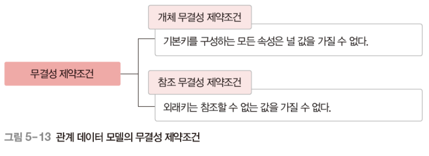

### 2-2. 개체 무결성 제약조건 Entity Integrity Constraint

- 기본키를 구성하는 모든 속성은 널 값을 가질 수 없는 규칙

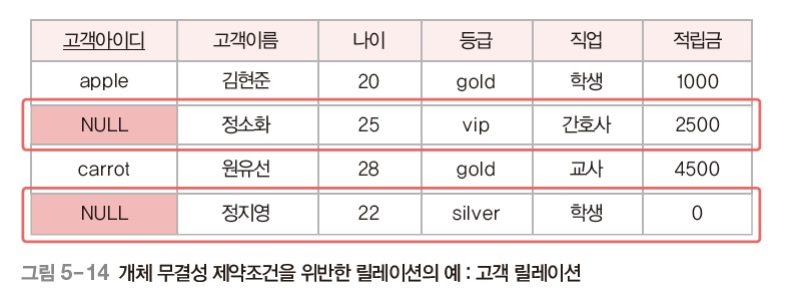

### 2-3. 참조 무결성 제약조건

- 외래키는 참조할 수 없는 값을 가질 수 없는 규칙

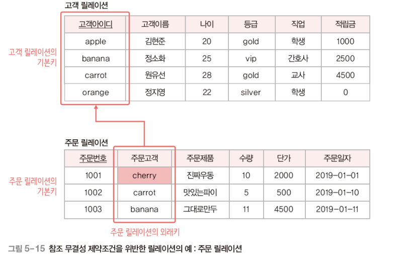

  

# 참고자료

- 데이터베이스의 원리와 응용, 한양대학교 백현미, KOCW
