# Relation Data Model 2

## 목차

0. [요구사항 및 ERD](#0-요구사항-및-erd)  

 

1. [논리적 설계](#1-설계-3단계-논리적-설계)  
   &nbsp; 1-1. [기본 개념](#1-1-기본-개념)  
   &nbsp; 1-2. [기본 규칙](#1-2-기본-규칙)  

 

2. [규칙 적용 예시](#2-규칙-적용-예시)  
   &nbsp; 2-1. [규칙1: 모든 개체는 릴레이션으로 변환한다](#2-1-규칙1-모든-개체는-릴레이션으로-변환한다)  
   &nbsp; 2-2. [규칙2: 다대다 관계는 릴레이션으로 변환한다](#2-2-규칙2-다대다-관계는-릴레이션으로-변환한다)  
   &nbsp; 2-3. [규칙3: 일대다 관계는 외래키로 표현한다](#2-3-규칙3-일대다-관계는-외래키로-표현한다)  
   &nbsp; 2-4. [규칙4: 일대일 관계는 외래키로 표현한다](#2-4-규칙4-일대일-관계는-외래키로-표현한다)  
   &nbsp; 2-5. [규칙5: 다중 값 속성은 릴레이션으로 변환한다](#2-5-규칙5-다중-값-속성은-릴레이션으로-변환한다)  
   &nbsp; 2-6. [기타 고려 사항](#2-6-기타-고려-사항)  

 

3. [테이블 명세서 작성](#3-테이블-명세서-작성)  

  

## 0. 요구사항 및 ERD

- 요구사항

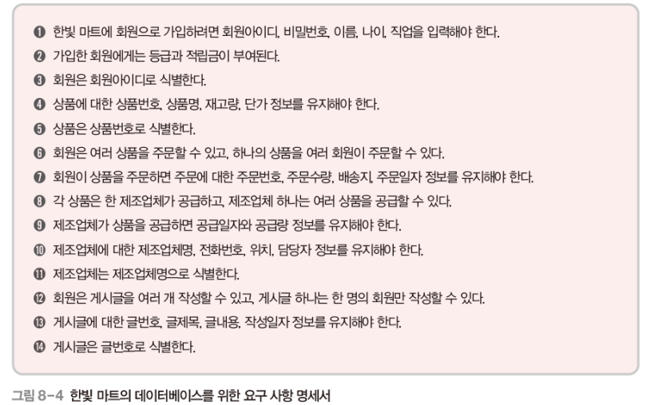

- ERD

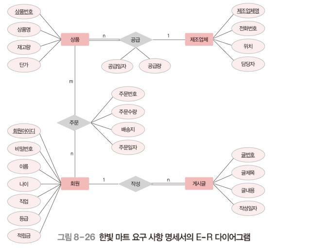

  

## 1. 설계 3단계: 논리적 설계

### 1-1. 기본 개념

- 목적
  - DBMS에 적합한 논리적 스키마 설계
  - 개념적 스키마를 논리적 데이터 모델을 이용해 논리적 구조로 표현 => 논리적 모델링(데이터 모델링)
  - 일반적으로 관계 데이터 모델을 많이 이용
- 결과물
  - 논리적 스키마 : 릴레이션 스키마
- 주요 작업
  - 개념적 설계 단계의 결과물인 E-R 다이어그램을 릴레이션 스키마로 변환
  - 릴레이션 스키마로 변환 후 속성의 데이터 타입, 길이, 널 값 허용 여부, 기본 값, 제약조건 등을 세부적으로 결정하고 결과를 문서화시킴

### 1-2. 기본 규칙

- E-R 다이어그램을 릴레이션 스키마로 변환하는 규칙
  1. 모든 개체는 릴레이션으로 변환한다.
  2. 다대다(n:m) 관계는 릴레이션으로 변환한다.
  3. 일대다(1:n) 관계는 외래키로 표현한다.
  4. 일대일(1:1) 관계는 외래키로 표현한다.
  5. 다중 값 속성은 릴레이션으로 변환한다.
- 변환 규칙을 순서대로 적용하되, 해당되지 않는 규칙은 제외함

  

## 2. 규칙 적용 예시

### 2-1. 규칙1 모든 개체는 릴레이션으로 변환한다

- E-R 다이어그램의 각 개체를 하나의 릴레이션으로 변환한다.
  - 개체의 이름 -> 릴레이션 이름
  - 개체의 속성 -> 릴레이션의 속성
  - 개체의 키 속성 -> 릴레이션의 기본키
  - 개체의 속성이 복합 속성인 경우에는 복합 속성을 구성하고 있는 단순 속성만 릴레이션의 속성으로 변환한다.

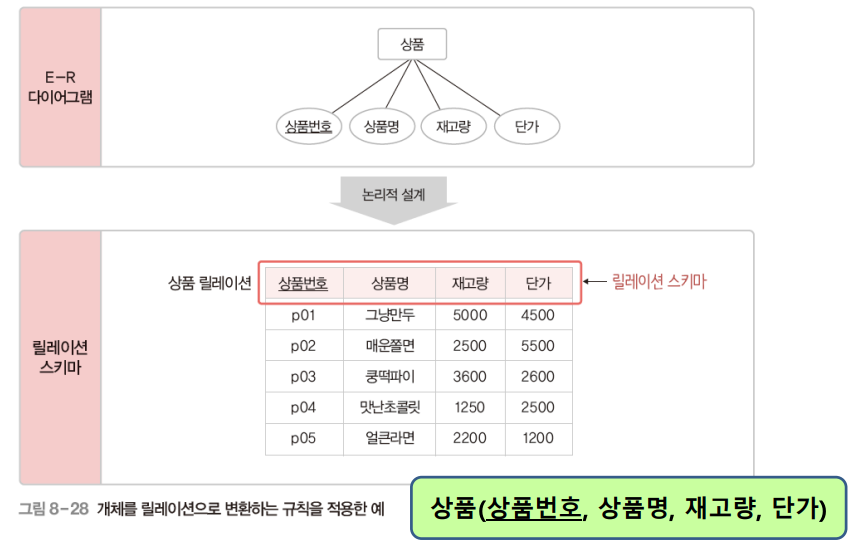

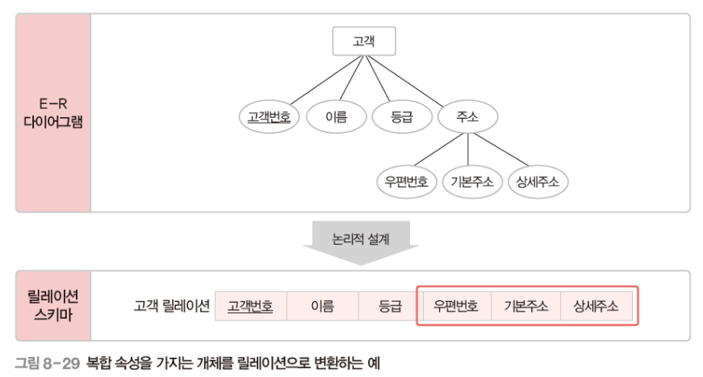

- <한빛마트> 예시에 규칙1을 적용하면 아래와 같다.

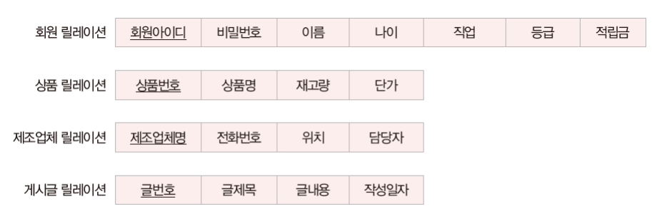

### 2-2. 규칙2 다대다 관계는 릴레이션으로 변환한다

- E-R 다이어그램의 다대다 관계를 하나의 릴레이션으로 변환
  - 관계의 이름 -> 릴레이션 이름
  - 관계의 속성 -> 릴레이션의 속성
  - 관계에 참여하는 개체를 규칙 1에 따라 릴레이션으로 변환한 후 이 릴레이션의 기본키를 관계 릴레이션에 포함시켜 외래키로 지정하고, 외래키들을 조합하여 관계 릴레이션의 기본키로 지정

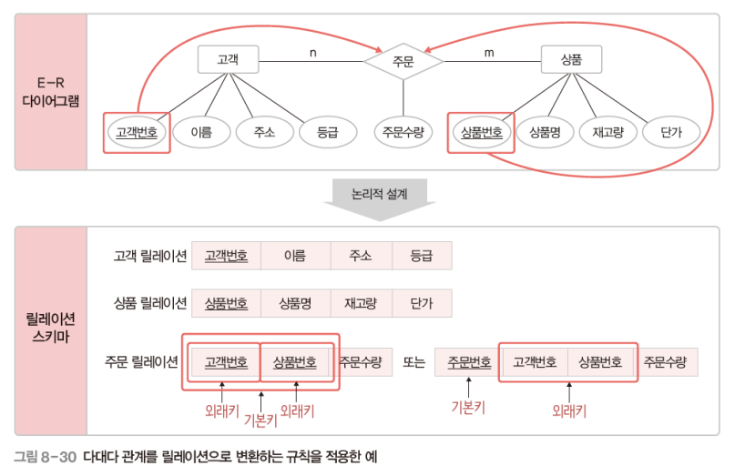

- <한빛마트> 예시에 규칙2을 적용하면 아래와 같다. 다대다 관계가 하나밖에 존재하지 않기 때문에 주문 릴레이션만 생성된다.

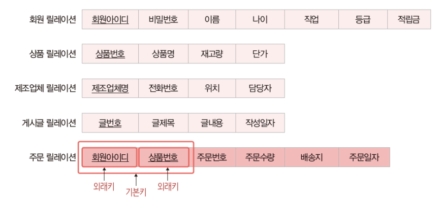

### 2-3. 규칙3 일대다 관계는 외래키로 표현한다

- E-R 다이어그램의 일대다 관계는 외래키로만 표현
- (규칙 3-1) 일반적인 일대다 관계는 외래키로 표현한다.
  - 일대다(1:n) 관계에서 1측 개체 릴레이션의 기본키를 n측 개체 릴레이션에 포함시켜 외래키로 지정
  - 관계의 속성들도 n측 개체 릴레이션에 포함시킴

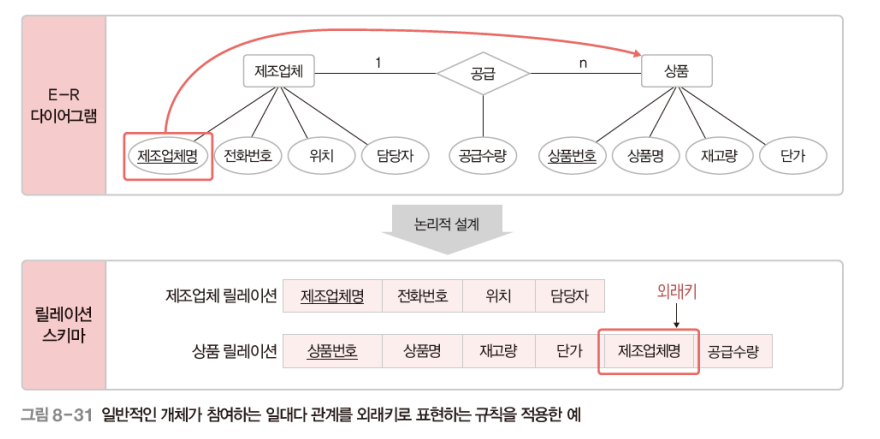

- (규칙 3-2) 약한 개체가 참여하는 일대다 관계는 외래키를 포함해서 기본키로 지정한다.

  - 일대다(1:n) 관계에서 1측 개체 릴레이션의 기본키를 n측 개체 릴레이션에 포함시켜 외래키로 지정
  - 관계의 속성들도 n측 개체 릴레이션에 포함시킴
  - n측 개체 릴레이션은 외래키를 포함하여 기본키를 지정함
  - 약한 개체는 강한 개체에 따라 존재 여부가 결정되므로 강한 개체의 기본키를 이용해 식별해야 함

- 아래예시에서 `좌석`은 비행기가 존재해야만 있을 수 있는 개체이기 때문에 약한 개체로 볼 수 있고, 비행기번호와 좌석번호를 묶어서 기본키로 지정했다.

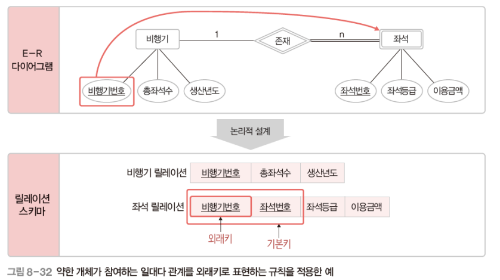

- <한빛마트> 예시에 규칙3을 적용하면 아래와 같다. (약한 개체는 없는 것으로 보인다.) `1:N` 관계 중에서도 `N`을 담당하고 있는 상품과 게시글 개체에 외래키가 들어가게 된다.

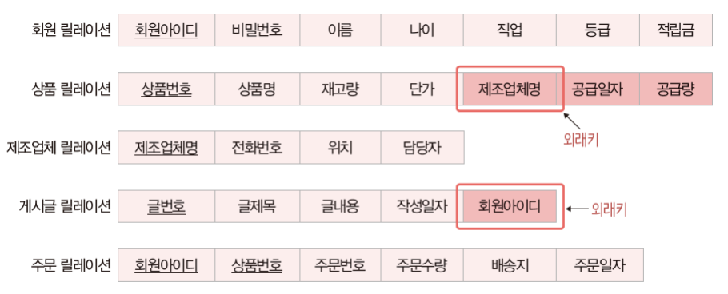

### 2-4. 규칙4 일대일 관계는 외래키로 표현한다

- E-R 다이어그램의 일대일 관계는 외래키로만 표현한다.
- (규칙 4-1) 일반적인 일대일 관계는 외래키를 서로 주고받는다.
  - 관계에 참여하는 개체 릴레이션들이 서로의 기본키를 주고받아 외래키로 지정
  - 관계의 속성들도 모든 개체 릴레이션에 포함시킴
  - 불필요한 데이터 중복이 발생할 수 있음

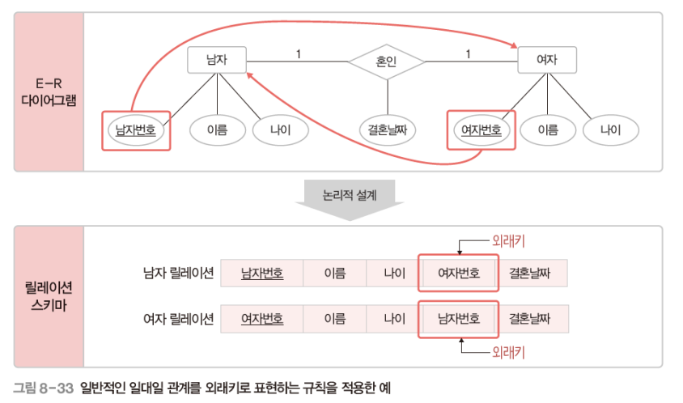

- (규칙 4-2) 일대일 관계에 필수적으로 참여하는 개체의 릴레이션만 외래키를 받는다.
  - 관계에 필수적으로 참여하는 개체 릴레이션에만 외래키를 포함시킴
  - 관계의 속성들은 관계에 필수적으로 참여하는 개체 릴레이션에 포함시킴

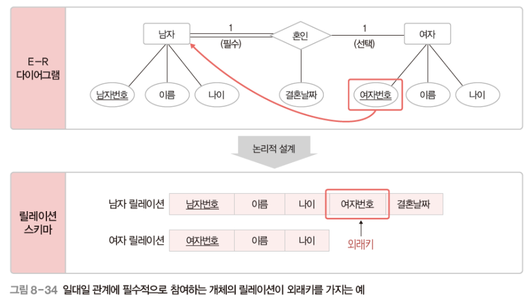

- (규칙 4-3) 모든 개체가 일대일 관계에 필수적으로 참여하면 릴레이션 하나로 합친다.
  - 관계에 참여하는 개체 릴레이션들을 하나의 릴레이션으로 합쳐서 표현(릴레이션을 만든다)
  - 관계의 이름을 릴레이션 이름으로 사용하고, 관계에 참여하는 두 개체의 속성들을 관계 릴레이션에 모두 포함시킴
  - 두 개체 릴레이션의 키 속성을 조합하여 관계 릴레이션의 기본키로 지정

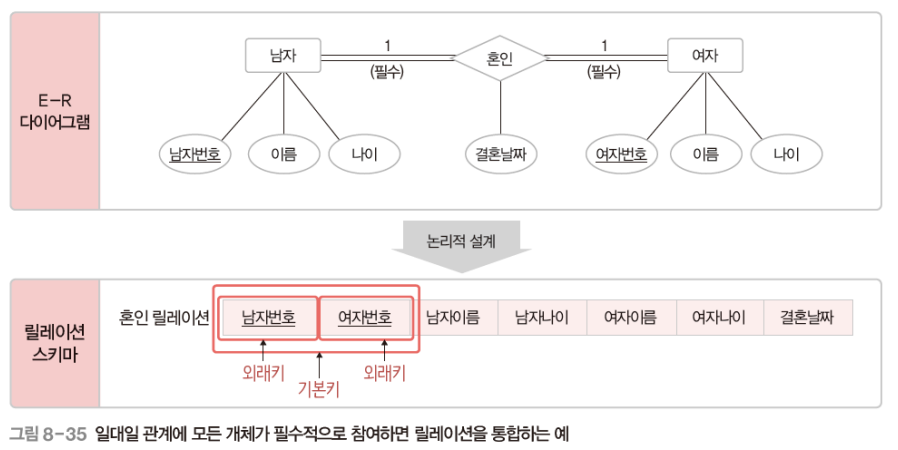

- <한빛마트> 예시에 규칙4를 적용할만한 부분은 없어보인다.

### 2-5. 규칙5 다중 값 속성은 릴레이션으로 변환한다

- E-R 다이어그램의 다중 값 속성은 독립적인 릴레이션으로 변환

  - 다중 값 속성과 함께 그 속성을 가지고 있던 개체 릴레이션의 기본키를 외래키로 가져와 새로운 릴레이션에 포함시킴
  - 새로운 릴레이션의 기본키는 다중 값 속성과 외래키를 조합하여 지정

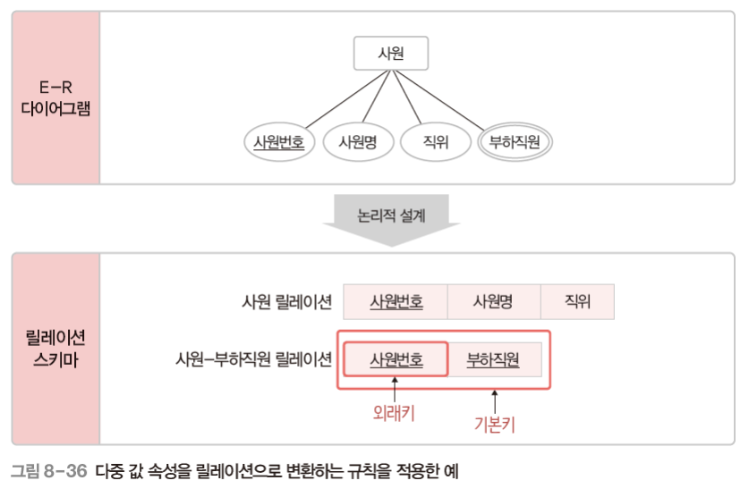

- 릴레이션 특성을 위반한 경우

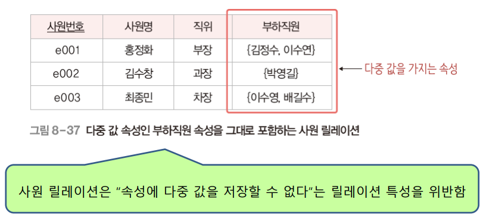

- 릴레이션 특성을 위반하지 않았지만, 중복 저장되는 문제가 발생하는 경우

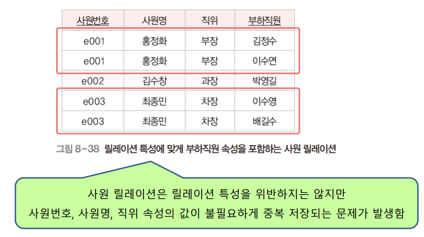

- 독립적인 릴레이션으로 변환하면 불필요한 중복을 제거할 수 있다.

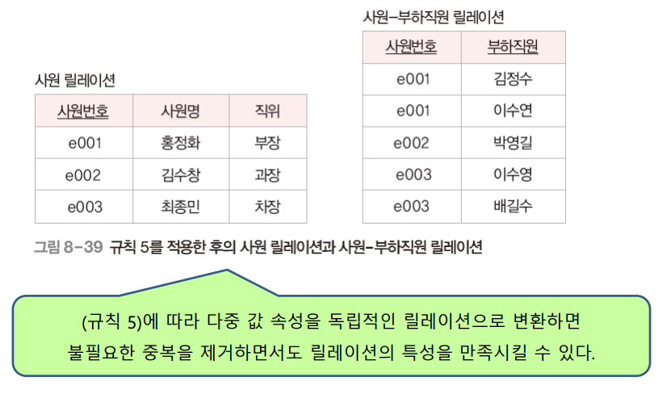

- <한빛마트> 예시에 규칙5을 적용할만한 부분이 보이지 않는 것 같다.

### 2-6. 기타 고려 사항

- 모든 관계를 독립적인 릴레이션으로 변환할 수 있다.
- 속성이 많은 관계는 유형에 상관없이 릴레이션으로의 변환을 고려할 수 있다.

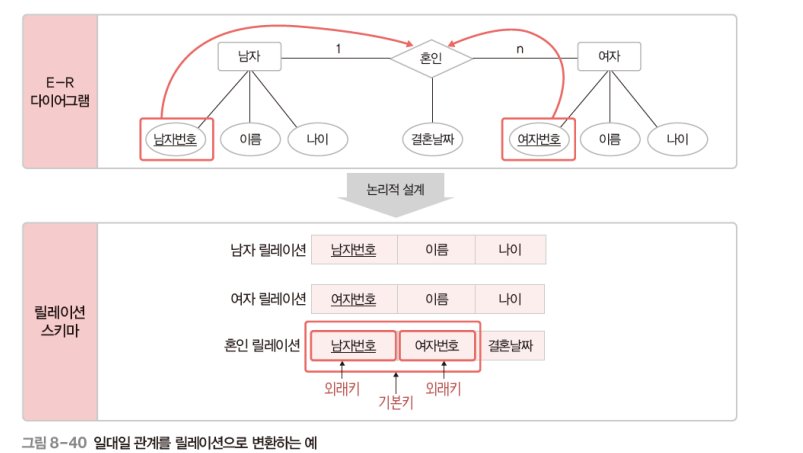

- 개체가 자기 자신과 관계를 맺는 순환 관계도 기본 규칙을 그대로 적용한다.

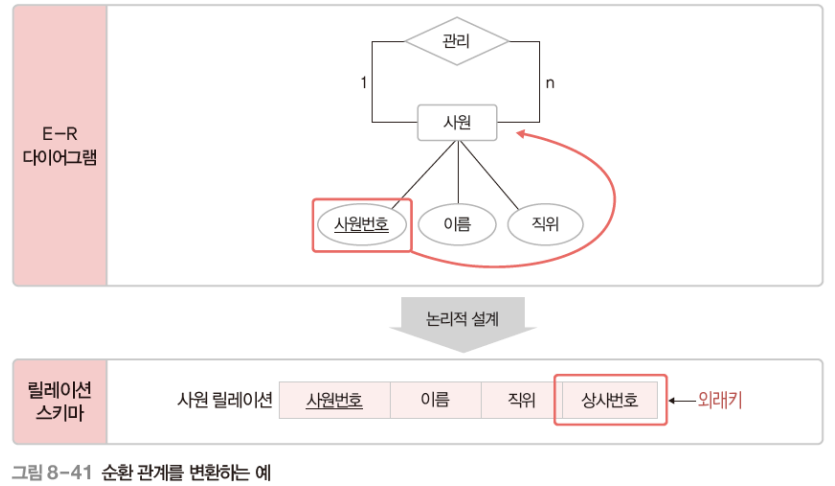

  

## 3. 테이블 명세서 작성

- 릴레이션 스키마 변환 후 속성의 데이터 타입과 길이, 널 값 허용 여부, 기본값, 제약조건 등을 세부적으로 결정하고 문서화한다.
- 테이블 명세서란 릴레이션 스키마에 대한 설계 정보를 기술한 문서이다.

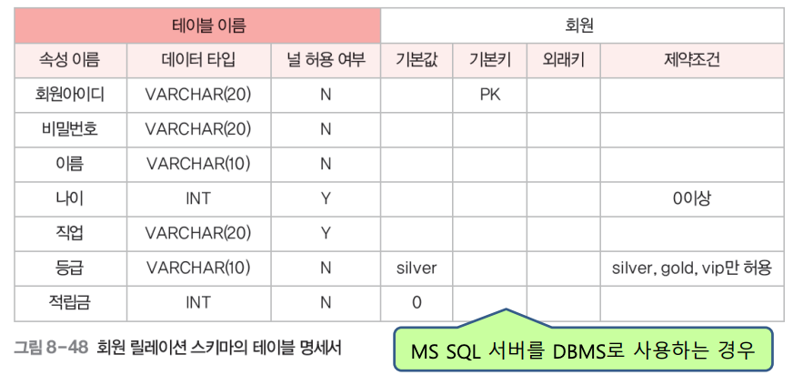

  

# 참고자료

- 데이터베이스의 원리와 응용, 한양대학교 백현미, KOCW
