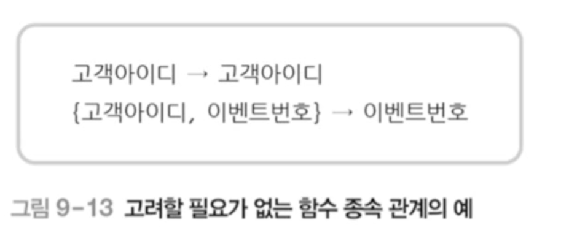

# 08 정규화 Normalization

## 목차

1.   
   &nbsp; 1-1.   
   &nbsp; 1-2.   

 

2.   
   &nbsp; 2-1.   
   &nbsp; 2-1.   

 

3.   
   &nbsp; 2-1.   
   &nbsp; 2-1.   

  

## 1. 정규화

- 정규화의 필요성과 이상 현상
- 함수 종속성
- 정규화의 유형

### 1-1. 정규화란?

- 이상(anomaly) 현상
  - 불필요한 데이터 중복으로 인해 릴레이션에 대한 데이터 삽입•수정•삭제 연산을 수행할 때 발생할 수 있는 부작용
- 정규화(normalization)
  - 이상 현상이 발생하지 않도록, 릴레이션을 관련 있는 속성들로만 구성하기 위해 릴레이션을 분해(decomposition)하는 과정
  - <u>**함수적 종속성**</u>을 판단하여 정규화를 수행한다.
- 함수적 종속성(FD; Functional Dependency)
  - 속성들 간의 관련성
  - 함수 종속성을 이용하여, 릴레이션을 연관성이 있는 속성들로만 구성되도록 분해하여 이상 현상이 발생하지 않는 바람직한 릴레이션으로 만들어 나가는 과정이 정규화다.

### 1-2. 이상현상

- 삽입 이상
  - 새 데이터를 삽입하기 위해 불필요한 데이터도 함께 삽입해야 하는 문제
- 갱신이상
  - 중복 투플 중 일부만 변경하여 데이터가 불일치하게 되는 모순의 문제
- 삭제 이상
  - 투플을 삭제하면 꼭 필요한 데이터까지 함께 삭제되는 데이터 손실의 문제

- 위 예시에서 **삽입 이상**이 발생할 수 있다.
- 아직 이벤트에 참여하지 않은 아이디가 "melon"이고, 이름이 "성원용", 등급이 "gold"인 신규 고객의 데이터는 이벤트 참여 릴레이션에 삽입할 수 없다.
- 삽입하려면 실제로 참여하지 않은 임시 이벤트 번호를 넣어줘야 한다. (불필요한 데이터도 함께 넣어줘야 한다는 의미)

- **갱신 이상** 이 발생한다.
- 아이디가 "apple"인 고객의 등급이 "gold"에서 "vip"로 변경되었지만, 일부 투플에 대해서만 등급이 수정된다면 "apple" 고객이 서로 다른 등급을 가지는 모순이 발생한다.

- **삭제 이상**도 발생한다.
- 아이디가 "orange"인 고객이 이벤트 참여를 취소해 관련 투플을 삭제하게 되면 이벤트 참여와 관련이 없는 고객아이디, 고객이름, 등급 데이터까지 손실된다.

  

## 2. 함수 종속

### 2-1. 함수 종속이란?

- "X가 Y를 함수적으로 결정한다"
  - 릴레이션 내의 모든 투플을 대상으로 하나의 X 값에 대한 Y 값이 항상 하나다.
  - X와 Y는 하나의 릴레이션을 구성하는 속성들의 부분 집합이다.
  - "Y가 X에 함수적으로 종속되어 있다"와 같은 의미이다.
  - X => Y로 표현(X는 결정자, Y는 종속자)

- 함수 종속 관계 판단 예시(1)
  - 고객아이디가 고객이름과 등급을 결정할 수 있다.
  - 하지만 고객이름이 등급을 결정한다고 보긴 어렵다. 고객이름은 중복(동명이인)이 발생할 수 있기 때문에 함수 종속 관계라고 볼 수 없다.

- 함수 종속 다이어그램

- 함수 종속 관계 판단 예시(2)

- 고객아이디가 고객이름을 결정한다.
- 고객아이디와 이벤트번호가 당첨여부를 결정한다. (아이디만으로는 당첨여부를 결정할 수 없다.)

### 2-2. 종속 관계 판단 시 유의해야할 것

1. 속성 자체의 특성과 의미를 기반으로 함수 종속성을 판단해야 한다.
   - <u>속성 값은 계속 변할 수 있으므로</u> 현재 릴레이션에 포함된 속성 값만으로 판단하면 안된다.
2. 일반적으로 기본키와 후보키는 릴레이션의 다른 모든 속성들을 함수적으로 결정한다.
3. 기본키나 후보키가 아니어도 다른 속성 값을 유일하게 결정하는 속성은 함수 종속 관계에서 결정자가 될 수 있다.

### 2-3. 함수 종속의 종류

1. 완전 함수 종속(FFD; FullFunctional Dependency)
   - 릴레이션에서 속성 집합 Y가 속성 집합 X에 함수적으로 종속되어 있지만, 속성 집합 X의 전체가 아닌 일부분에는 종속되지 않음을 의미
   - <u>일반적으로 함수 종속은 완전 함수 종속을 의미함</u>
   - 예) 당첨여부는 {고객아이디, 이벤트번호}에 완전 함수 종속됨
2. 부분 함수 종속(PFD; Partial Functional Dependency)
   - 릴레이션에서 속성 집합 Y가 속성 집합 X의 전체가 아닌 일부분에도 함수적으로 종속됨을 의미
   - 예) 고객이름은 {고객아이디, 이벤트번호}에 부분 함수 종속됨
3. 이행적 함수 종속(transitive FD)
   - 릴레이션을 구성하는 세 개의 속성 집합 X, Y, Z에 대해 함수 종속 관계 X-> Y와 X -> 2가 존재하면 논리적으로 X -> 2가 성립되는데, 이것을 Z가 X에 이행적으로 함수 종속되었다고 함

- 이행적 함수 종속의 예시
  - 아래 릴레이션에서 '상품번호'를 알면 '소분류'를 알 수 있고, '소분류'을 알면 '대분류'도 알 수 있습니다. 따라서 '상품번호'를 알면 '대분류'를 알 수 있으므로 이행적 함수 종속 관계이다.
  - 이때, 대분류는 소분류에 의해 관계되는 항목이지만, 상품번호를 통해 귀속되어있다.

| 상품번호 | 상품명             | 소분류 | 대분류   |
| :------- | :----------------- | :----- | :------- |
| A001     | 검은 체크무늬 셔츠 | 상의   | 의류     |
| A002     | 유선 마우스        | 마우스 | 전자제품 |
| A003     | 유기농 양배추      | 야채   | 식료품   |
| A004     | 포테이토 칩        | 스낵   | 식료품   |
| A005     | 32인치 4K 모니터   | 모니터 | 전자제품 |
| A006     | 청바지             | 하의   | 의류     |
| A007     | 분홍 스웨터        | 상의   | 의류     |

### 2-4. 고려할 필요가 없는 함수 종속

- 결정자와 종속자가 같거나, 결정자가 종속자를 포함하는 것처럼 당연한 함수 종속 관계는 고려하지 않음

