# 09 정규형 Normal Form

## 목차

1. [정규형](#1-정규형)  
   &nbsp; 1-1. [정규형이란](#1-1-정규형이란nf-normal-form)  

 

2. [정규형의 종류](#2-정규형의-종류)  
   &nbsp; 2-1. [제 1 정규형](#2-1-제-1-정규형1nf-first-normal-form)  
   &nbsp; 2-2. [제 2 정규형](#2-2-제-2-정규형2nf-second-normal-form)  
   &nbsp; 2-3. [제 3 정규형](#2-3-제-3-정규형3nf-third-normal-form)  
   &nbsp; 2-4. [BCNF](#2-4-bcnfboyce-and-codd-normal-form)  
   &nbsp; 2-5. [제 4 정규형](#2-5-제-4-정규형4nf)  
   &nbsp; 2-6. [제 5 정규형](#2-6-제-5-정규형5nf)  

 

  

## 1. 정규형

> 다시 알아보는 정규화(normalization)의 개념  
> 정규화는 함수 종속성을 이용해 릴레이션을 연관성이 있는 속성들로만 구성되도록 분해해서 이상 현상이 발생하지 않는 바람직한 릴레이션으로 만들어 가는 과정이다.  
> 정규화 과정을 거친 릴레이션은 무손실 분해(nonloss decomposition)되어야 한다. 릴레이션은 의미적으로 동등한 릴레이션들로 분해되어야 하고 분해로 인한 정보의 손실이 발생하지 않아야 하고 분해된 릴레이션들을 자연 조인하면 분해 전의 릴레이션으로 복원 가능해야 한다.

### 1-1. 정규형이란(NF; Normal Form)

- 릴레이션이 정규화된 정도
- 각 정규형마다 제약조건이 존재
  - 정규형의 차수가 높아질수록 요구되는 제약조건이 많아지고 엄격해짐
  - 정규형의 차수가 높아질수록 데이터 중복이 줄어 이상 현상이 발생하지 않는 바람직한 릴레이션이 됨
- 릴레이션의 특성을 고려하여 적합한 정규형을 선택
- 제 5 정규형을 만족하게 하려면 당연히 4NF가 만족해야하고, 4NF를 만족하려면 BCNF가 만족해야한다. 3NF, 2NF와 1NF도 마찬가지이다.

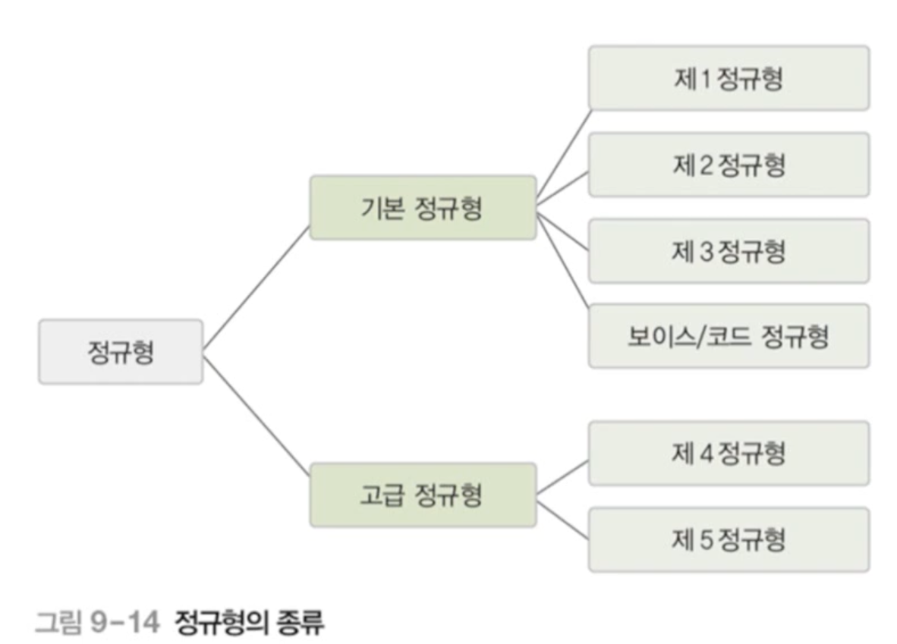

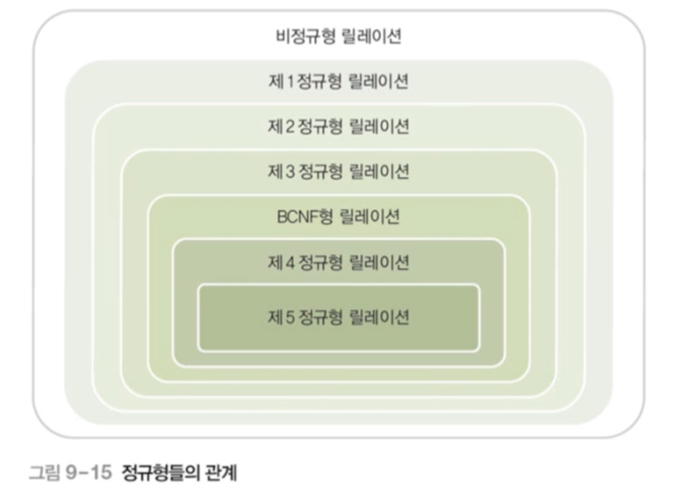

## 2. 정규형의 종류

### 2-1. 제 1 정규형(1NF; First Normal Form)

- 릴레이션의 모든 속성이 더는 분해되지 않는 원자값(atomic value)만 가지면 제 1 정규형을 만족한다.
- 제 1 정규형을 만족해야 관계 데이터베이스의 릴레이션이 될 자격이 있다.
- 아래 예시는 제 1 정규형을 만족했다고 보기 어렵다.

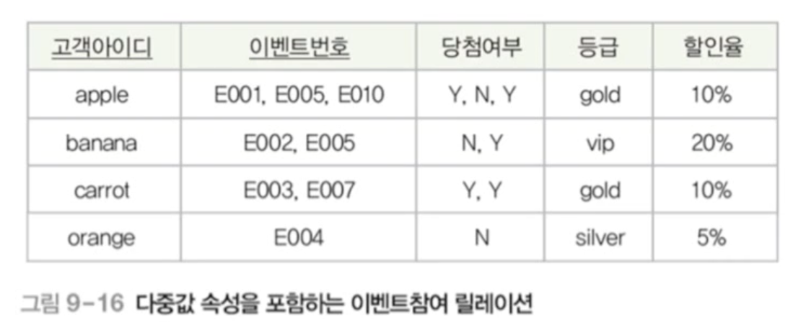

- 위의 예시를 제 1 정규형을 만족하는 릴레이션으로 바꾸면 아래와 같아진다.

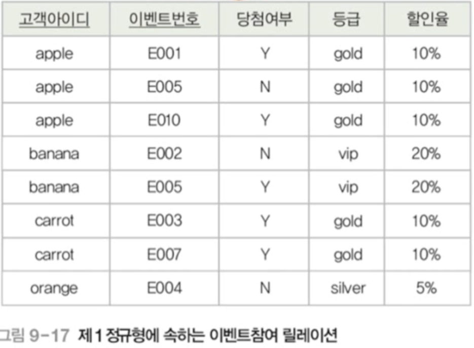

- 하지만 이상현상이 발생할 수 있다. **삽입 이상**, **갱신 이상**, **삭제 이상** 모두 발생할 수 있다.
- 왜냐하면 기본키인 {고객아이다, 이벤트번호}에 완전 함수 종속되지 못하고 일부분인 고객아이디에 종속되는 등급과 할인율 속성때문에 이상 현상이 발생하는 것이다.
- 부분 함수 종속이 제거되도록 이벤트참여 릴레이션을 분해해야 문제를 해결할 수 있다. 분해된 릴레이션은 제 2 정규형에 속하게 된다.

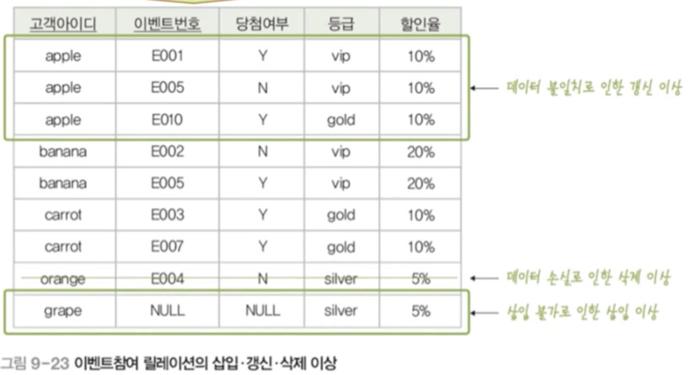

- 함수 종속 관계는 아래와 같다.

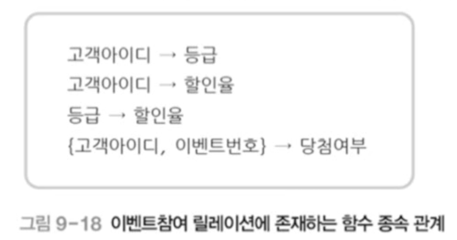

### 2-2. 제 2 정규형(2NF; Second Normal Form)

- 릴레이션이 제 1 정규형에 속하고, 기본키가 아닌 모든 속성이 기본키에 완전 함수 종속되면 제 2 정규형을 만족한다.

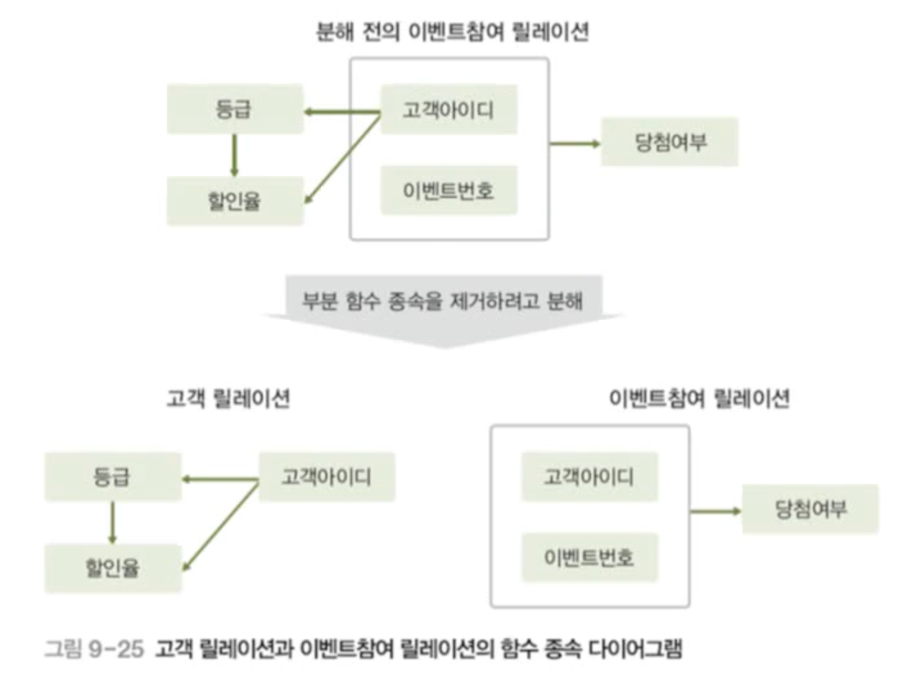

- 이벤트 참여 릴레이션은 아래와 같이 분해할 수 있다.

 

- 고객 릴레이션

| 고객아이디 | 등급   | 할인율 |
| :--------- | :----- | :----- |
| apple      | gold   | 10%    |
| banana     | vip    | 20%    |
| carrot     | gold   | 10%    |
| orange     | silver | 5%     |

- 이벤트 참여 릴레이션

| 고객아이디 | 이벤트번호 | 당첨여부 |
| :--------- | :--------- | :------- |
| apple      | E001       | Y        |
| apple      | E005       | N        |
| apple      | E010       | Y        |
| banana     | E002       | N        |
| banana     | E005       | Y        |
| carrot     | E003       | Y        |
| carrot     | E007       | Y        |
| orange     | E004       | N        |

- 하지만 아래와 같이 이행적 함수 종속(고객아이디 -> 등급, 등급 -> 할인율의 관계를 가진다. 따라서 고객아이디 -> 할인율) 때문에 고객 릴레이션에서 이상 현상이 발생할 수 있다.
- 똑같은 gold 등급끼리의 갱신 이상이 발생할 수 있다.
- banana 아이디를 지우면 vip 등급에 대한 할인율 정보가 사라질 수 있다. (삭제 이상)
- bronze 등급을 추가 시 삽입 이상이 발생할 수 있다.
- 이행적 함수 종속이 제거되도록 고객 릴레이션을 분해해야할 필요가 있다. 분해되면 릴레이션은 제 3 정규형에 속하게 된다.

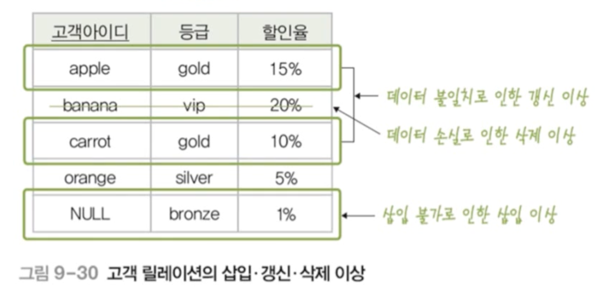

### 2-3. 제 3 정규형(3NF; Third Normal Form)

- 릴레이션이 제 2 정규형에 속하고, 기본키가 아닌 모든 속성이 기본키에 이행적 함수 종속되지 않으면 제 3 정규형을 만족한다.

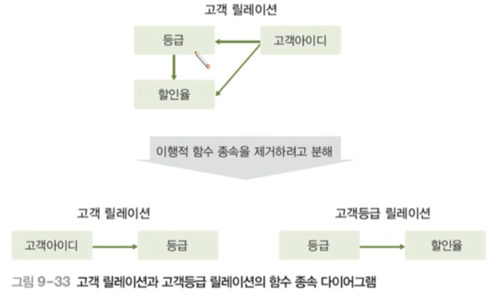

- 고객 릴레이션은 다음과 같이 분해될 수 있다.

- 고객 릴레이션

| 고객아이디 | 등급   |
| :--------- | :----- |
| apple      | gold   |
| banana     | vip    |
| carrot     | gold   |
| orange     | silver |

- 고객등급 릴레이션

| 등급   | 할인율 |
| :----- | :----- |
| gold   | 10%    |
| vip    | 20%    |
| silver | 5%     |

  

### 2-4. BCNF(Boyce and Codd Normal Form)

- 제3 정규형을 조금 더 강화시킨 개념이다. 강한 제3 정규형이라고도 한다.
- 아래는 제 3 정규형을 만족하는 릴레이션이다. 하지만 이상 현상이 발생할 수 있다.
  - 삽입 이상 : 새로운 교수가 특정 과목을 담당한다는 새로운 정보를 추가할 수 없다. 적어도 한 명 이상의 수강 학생이 필요하다.
  - 삭제 이상 : 학번 100이 C234 과목을 취소하면, P2가 C234 과목을 담당한다는 정보도 삭제된다.
  - 갱신 이상 : P1의 과목이 변경되면 P1인 행을 모두 찾아 변경시켜주어야 한다.

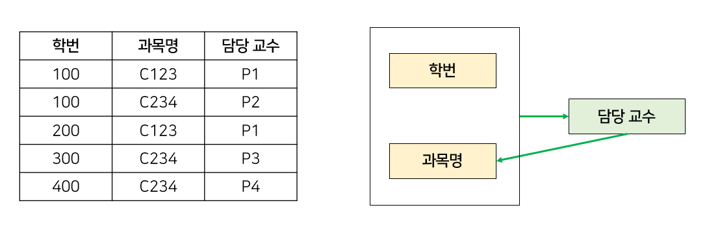

- 이러한 이상현상이 생기는 이유는, 결정자(Determinant)가 후보키(Alternative Key)로 취급되고 있지 않기 때문이다.
- 후보키는 슈퍼키(super key) 중에서 최소성을 갖는 키이므로 이 릴레이션에서는 (학번, 과목명)이나 (학번, 담당교수)가 후보키가 된다. 담당 교수만으로는 후보키가 될 수 없다.
- 하지만, 후보키가 아님에도 과목명을 결정할 수 있기 때문에 담당 교수는 결정자에 속한다.
- 이 문제를 해결하기 위해 **모든 결정자는 항상 후보키가 되도록 릴레이션을 분해**해주면 BCNF를 만족할 수 있다.

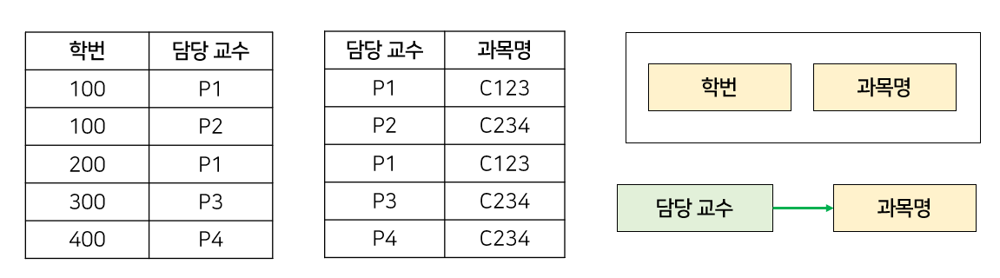

### 2-5. 제 4 정규형(4NF)

- 제 4 정규형은 다치 종속(Multi-valued Dependency)이 없어야 한다.

> 다치종속?
>
> 1. A->B 일 때 하나의 A값에 여러 개의 B값이 존재하면 다치 종속성을 가진다고 하고 A↠B라고 표시한다.
> 2. 최소 3개의 칼럼이 존재한다.
> 3. R(A, B, C)가 있을 때 A와 B 사이에 다치 종속성이 있을 때 B와 C가 독립적이다.

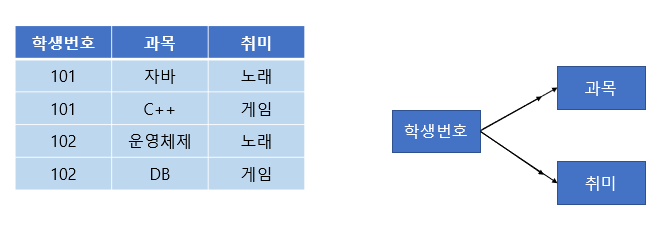

- 과목과 취미는 관계가 없는 독립적인 관계이다. 하지만 같은 테이블의 학생 번호라는 칼럼에 다치 종속되어버려 중복이 발생하는 문제가 생겼다.
- 위 예시에서 4NF를 만족하기 위해 아래와 같이 분리할 수 있다.

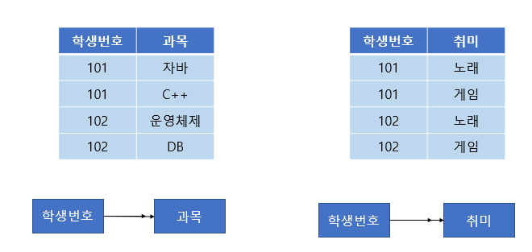

### 2-6. 제 5 정규형(5NF)

- 제5 정규형은 중복을 제거하기 위해 분해할 수 있을 만큼 전부 분해하는 것이다. 이러한 5NF는 Project Join Normal Form(PJNF)라고도 불린다.
- 제 5 정규형이 만족하는 조건은 아래과 같다.
  1. 조인 종속(Join dependency)이 없어야 한다.
  2. 조인 연산을 했을 때 손실이 없어야 한다.

  

# 참고자료

- 데이터베이스의 원리와 응용, 한양대학교 백현미, KOCW

- BCNF: https://rebro.kr/160

- 제 4, 5 정규형: https://code-lab1.tistory.com/270
