# 10 관계 데이터 연산 Relational Data Operation

## 목차

1.   
   &nbsp; 1-1.   
   &nbsp; 1-2.   

 

2.   
   &nbsp; 2-1.   
   &nbsp; 2-1.   

 

3.   
   &nbsp; 2-1.   
   &nbsp; 2-1.   

  

## 1. 관계 데이터 연산

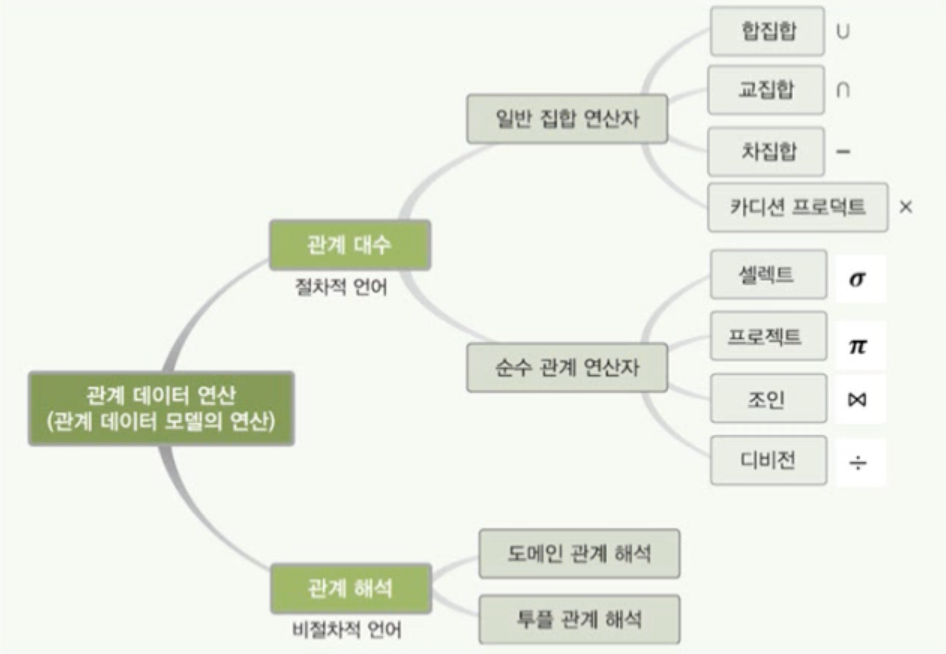

### 1-1. 데이터 모델

- 데이터 모델 = 데이터 구조 + 연산 + 제약조건

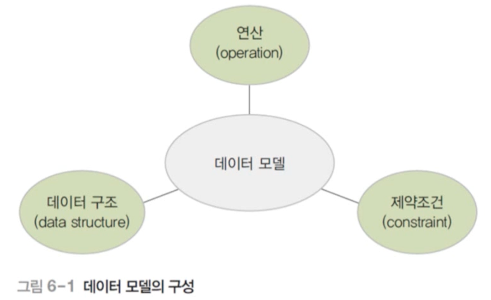

### 1-2. 관계 데이터 연산

- 관계 데이터 모델의 연산
- 원하는 데이터를 얻기 위해 릴레이션에 필요한 처리 요구를 수행하는 것
- 관계 대수와 관계 해석이 있음
  - 기능과 표현력 측면에서 능력이 동등함
  - 처리절차를 얼마나 자세히 기술하느냐에 따라 차이를 보임

  

## 2. 관계 대수 Relational Algebra

### 2-1. 관계 대수

- 원하는 결과를 얻기 위해 릴레이션의 처리 과정을 순서대로 기술하는 언어
  - 절차 언어(procedural language)
- 릴레이션을 처리하는 연산자들의 모임
  - 대표 연산자 8개
  - 일반 집합 연산자와 순수 관계 연산자로 분류됨
- 폐쇄 특성(closure property)이 존재
  - 피연산자도 릴레이션이고 연산의 결과도 릴레이션임

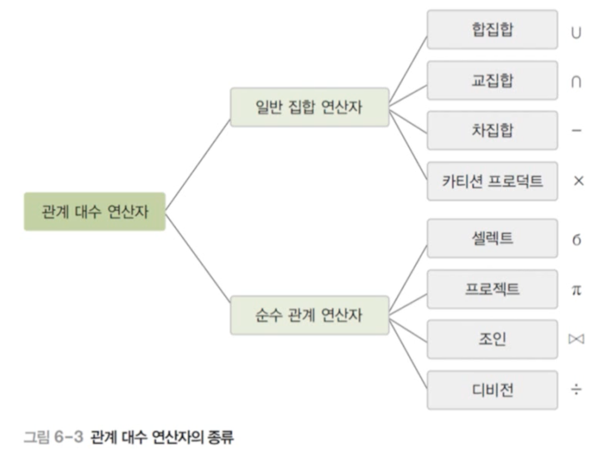

### 2-2. 일반 집합 연산자의 종류

- 릴레이션이 투플의 집합이라는 개념을 이용하는 연산자

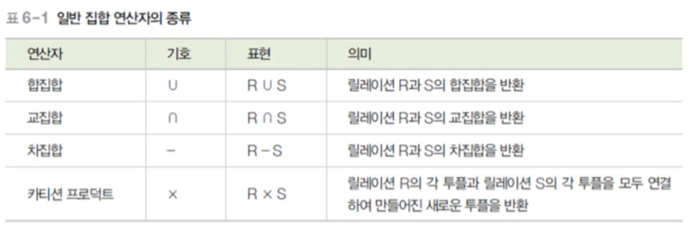

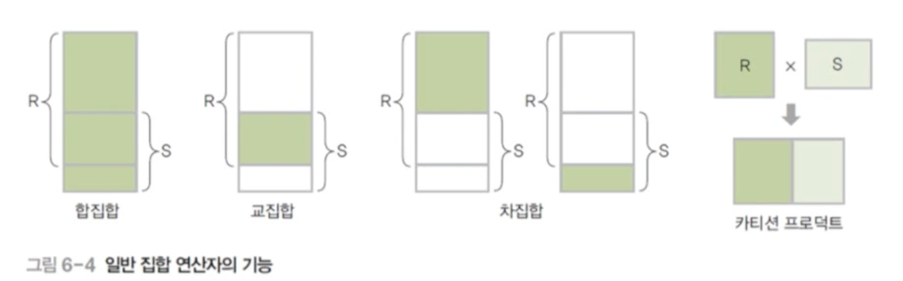

- 일반 집합 연산자의 특성
  - 피연산자가 두 개 필요함
    - 두 개의 릴레이션을 대상으로 연산을 수행
  - 합집합, 교집합, 차집합은 피연산자인 두 릴레이션이 합병이 가능해야 함
    - 합병 가능(union-compatible) 조건
      - 두 릴레이션의 차수가 같아야 함
      - 두 릴레이션에서 서로 대응되는 속성의 도메인이 같아야 함

### 2-3. 순수 관계 연산자의 종류

- 릴레이션의 구조와 특성을 이용하는 연산자

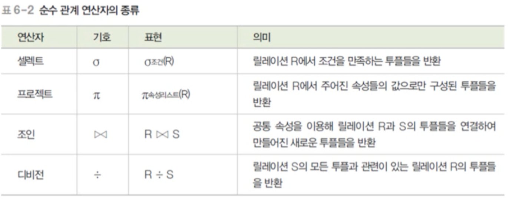

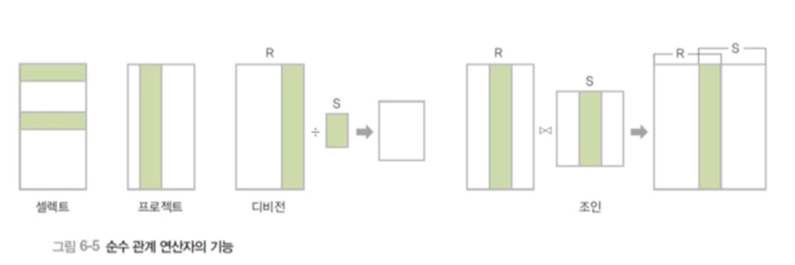

### 2-4. 합병 예시

- 아래 예시는 왼쪽의 `나이` 속성과 오른쪽의 `직위` 속성이 다르기 때문에 원칙적으로 합병이 불가능하다.

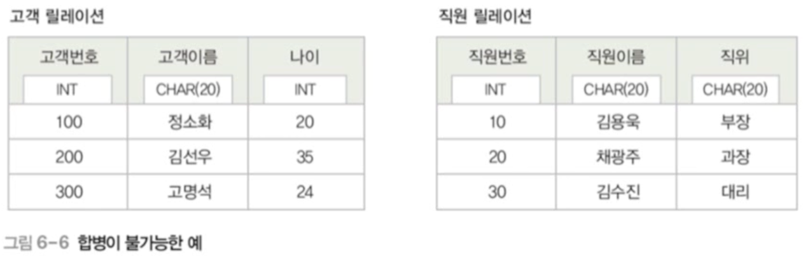

- 반면 아래 예시는 모든 도메인이 동일하기 때문에 합병이 가능하다.

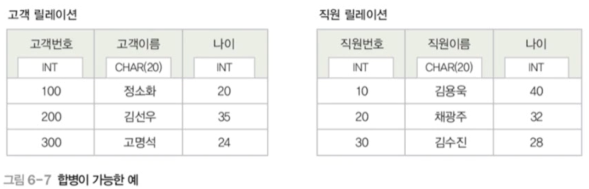

  

## 3. 일반 집합 연산자 Set Operation

### 3-1. 합집합 Union

- 합병 가능한 두 릴레이션 R과 S의 합집합: R $\cup$ S
  - 릴레이션 R에 속하거나 릴레이션 S에 속하는 모든 투플로 결과 릴레이션 구성

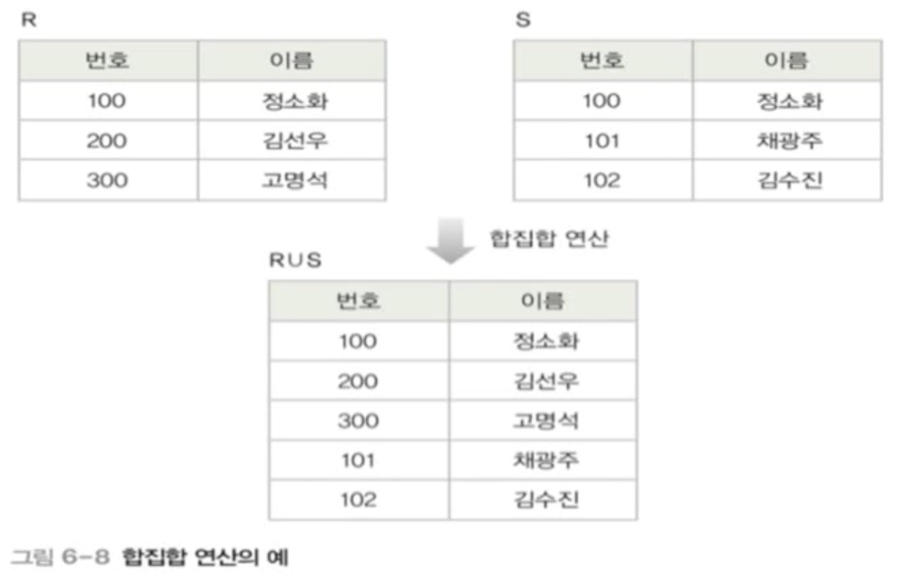

- 결과 릴레이션의 특성
  - 차수는 릴레이션 R과 S의 차수와 같음
  - 카디널리티는 릴레이션 R과 S의 카디널리티를 더한 것과 같거나 적어짐(중복값이 있느냐 없느냐에 따라 달라짐)
- 교환적 특징
  - R $\cup$ S= S $\cup$ R
- 결합적 특징
  - (R $\cup$ S) $\cup$ T = R $\cup$ (S $\cup$ T)

### 3-2. 교집합 Intersection

- 합병 가능한 두 릴레이션 R과 S의 교집합: R $\cap$ S
  - 릴레이션 R과 릴레이션 S에 속하는 모든 투플로 결과 릴레이션 구성

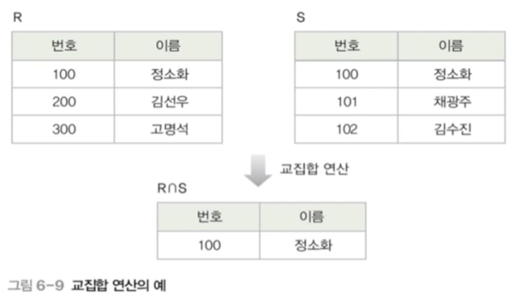

- 결과 릴레이션의 특성
  - 차수는 릴레이션 R과 S의 차수와 같음
  - 카디널리티는 릴레이션 R과 S의 어떤 카디널리티보다 크지 않음
- 교환적 특징
  - R $\cap$ S = S $\cap$ R
- 결합적 특징이 있음
  - (R $\cap$ S) $\cap$ T = R $\cap$ (S $\cap$ T)

### 3-3. 차집합 Difference

- 합병 가능한 두 릴레이션 R과 S의 차집합 : R-S
  - 릴레이션 R에는 존재하고 릴레이션 S에는 존재하지 않는 투플로 결과 릴레이션 구성

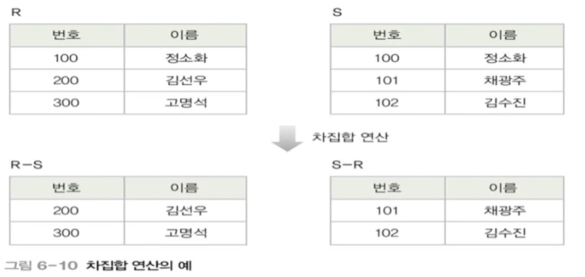

- 결과 릴레이션의 특성
  - 차수는 릴레이션 R과 S의 차수와 같음
  - R-S의 카디널리티는 릴레이션 R의 카디널리티와 같거나 적음
  - S-R의 카디널리티는 릴레이션 S의 카디널리티와 같거나 적음
- 교환적, 결합적 특징이 없음

### 3-4. 카티션 프로덕트 Cartesian product

- 두 릴레이션 R과 S의 카티션 프로덕트 : R $\times$ S
  - 릴레이션 R에 속한 각 투플과 릴레이션 S에 속한 각 투플을 모두 연결하여 만들어진 새로운 투플로 결과 릴레이션을 구성
  - 마치 곱하는 것과 같다.

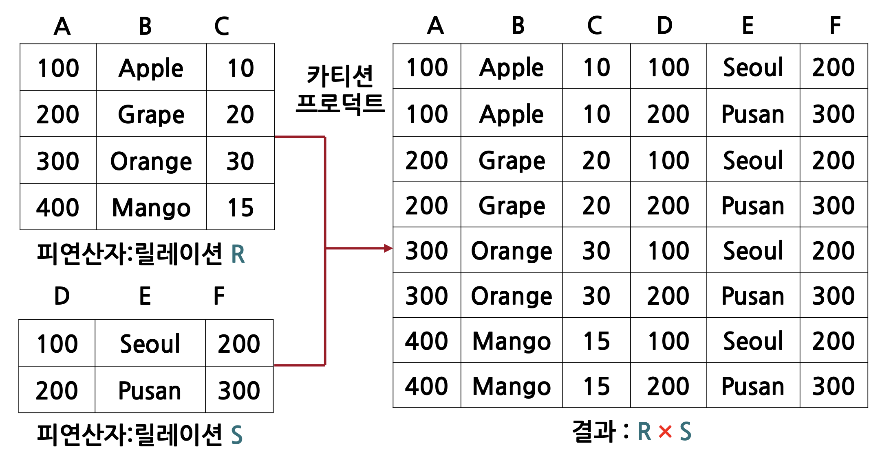

- 결과 릴레이션의 특성
  - 차수는 릴레이션 R과 S의 차수를 더한 것과 같음
  - 카디널리티는 릴레이션 R과 S의 카디널리티를 곱한 것과 같음
- 교환적 특징
  - R $\times$ S= S $\times$ R
- 결합적 특징
  - (R $\times$ S) $\times$ T = R $\times$ (S $\times$ T)

  

## 4. 순수 관계 연산자 Relational Operation

### 4-1. 셀렉트

### 4-2. 프로젝트

### 4-3. 조인

### 4-4. 디비전

  

# 참고자료

- 데이터베이스의 원리와 응용, 한양대학교 백현미, KOCW

- 관계 데이터 연산: https://velog.io/@inah-_-/%EA%B4%80%EA%B3%84-%EB%8D%B0%EC%9D%B4%ED%84%B0-%EC%97%B0%EC%82%B0
