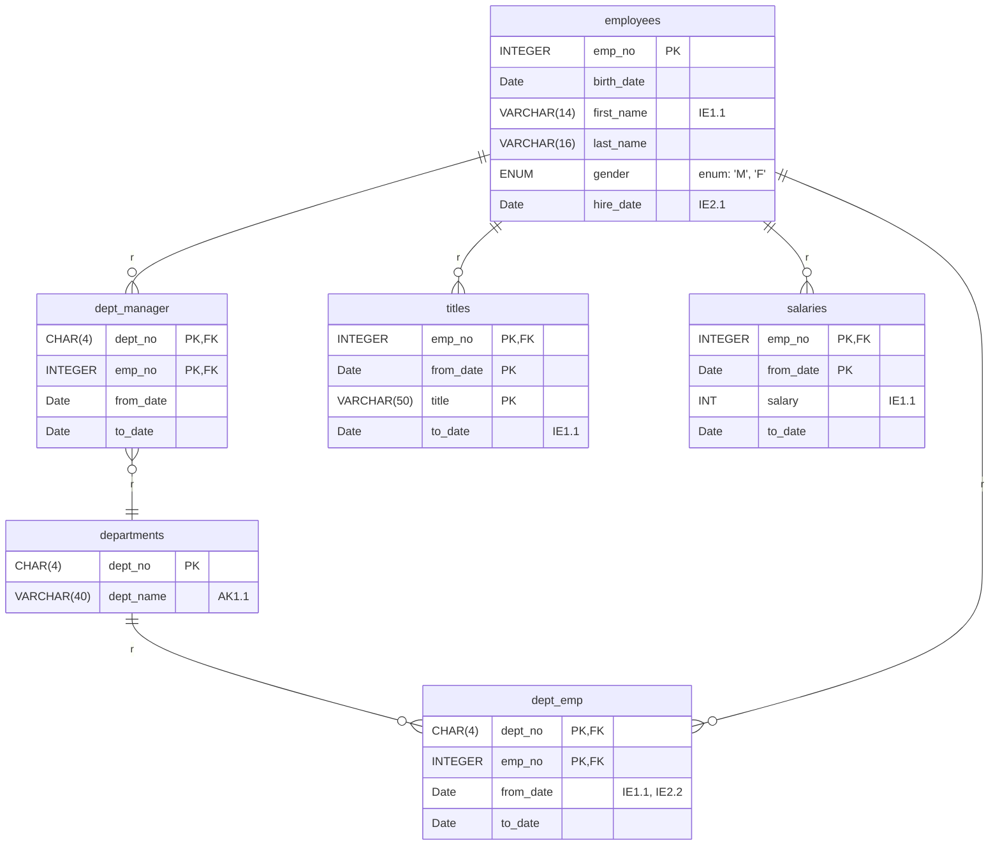

# Docker Mysql 설치 및 실행

```shell
$ docker pull mysql:8.0
$  docker run -p 3306:3307 -e MYSQL_ROOT_PASSWORD=Qwer1234 -d mysql:8.0
```

# 데이터 구성



# 데이터 넣기

- 먼저 예제 파일로 들어간다.
- 그리고 mysql을 실행해주자.

```shell
$ mysql -h 127.0.0.1 -P 3307 -u root -p                                                                                                                                          1 ↵  1664  22:06:04
Enter password:
Welcome to the MySQL monitor.  Commands end with ; or \g.
Your MySQL connection id is 8
Server version: 8.0.40 MySQL Community Server - GPL

Copyright (c) 2000, 2024, Oracle and/or its affiliates.

Oracle is a registered trademark of Oracle Corporation and/or its
affiliates. Other names may be trademarks of their respective
owners.

Type 'help;' or '\h' for help. Type '\c' to clear the current input statement.

mysql> CREATE DATABASE employees DEFAULT CHARACTER SET utf8mb4 COLLATE utf8mb4_0900_ai_ci;
Query OK, 1 row affected (0.01 sec)

mysql> use employees
Database changed
mysql> source employees.sql
...

Query OK, 0 rows affected (0.00 sec)

Query OK, 0 rows affected (0.00 sec)

Query OK, 0 rows affected (0.00 sec)

Query OK, 0 rows affected (0.00 sec)

Query OK, 0 rows affected (0.00 sec)

Query OK, 0 rows affected (0.00 sec)
```
