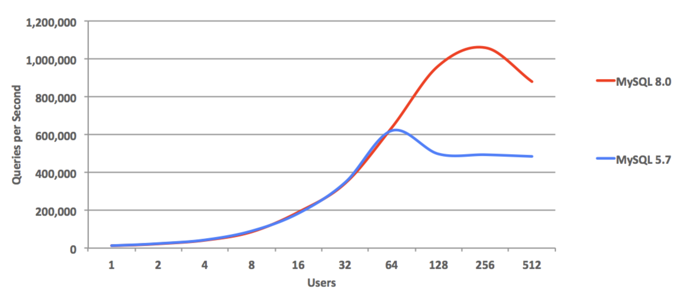
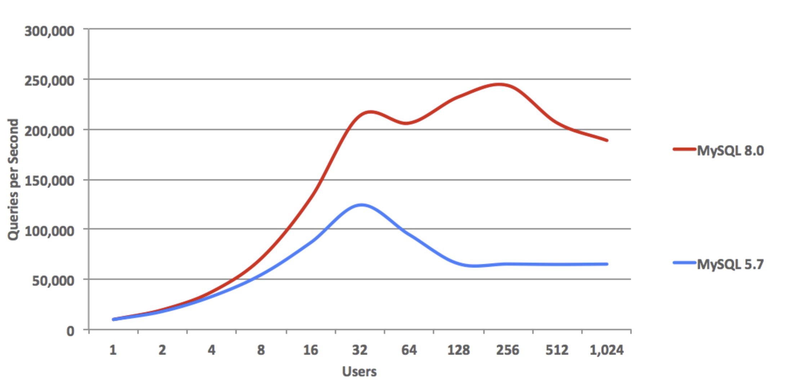
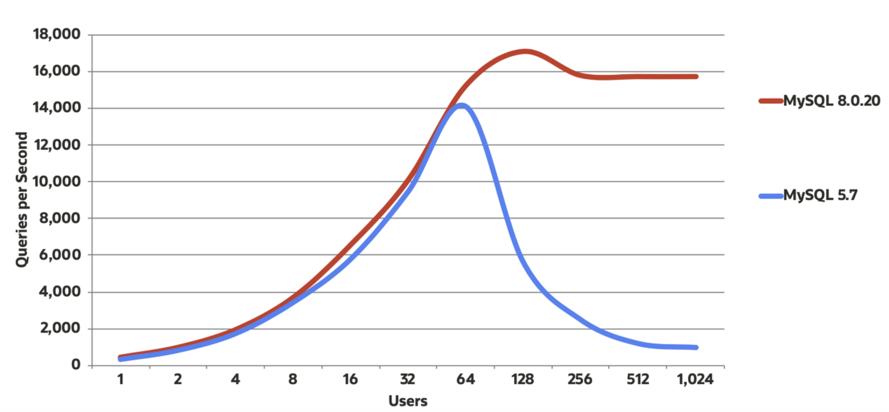
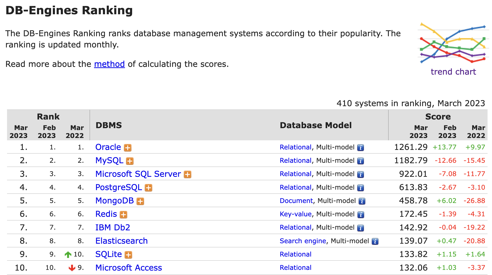

# MySQL

## MySQL의 역사

- 1979년 스웨덴의 TcX라는 회사의 터미널 인터페이스 라이브러리인 UNIREG로부터 시작되었다. UNIREG는 1994년 웹 시스템의 데이터베이스로 사용하기 시작하면서 MySQL 1.0이 완성되었고, TcX 사내에서만 사용되다가, 1996년에 오픈소스로 공개됐다.
- 2000년 몬티와 데이빗이 MySQL AB라는 회사로 독립함과 동시에 FPL(Free Public License) 라이선스 정책으로 바뀌고 2006년 최종적으로 현재와 같은 두 가지 라이선스 정책(엔터프라이즈 에디션, 커뮤티니 에디션)을 취하게 되었다.
- 이후 썬마이크로시스템즈에 인수되었고, 현재는 오라클에 인수되었지만 특별한 라이선스 정책의 변화는 없었다고 한다.

### 5.x 버전과 8.x 버전

- MySQL 5.5 ~ 5.7에서는 안정성과 성능 개선에 집중했다면 MySQL 8.0으로의 업그레이드는 상용 DBMS가 가지고 있는 기능들을 장착하는 시기였다.
- 또, 8.x 버전으로 업그레이드하면서 몇몇 기능이 향상되었다.

- 내림차순 인덱스를 지원하게 되어 (I/O 바운드) 읽기 성능이 크게 향상되었다.

- 또한 스레드 수가 증가해 읽기 쓰기(UPDATE-No Key) 효율성이 개선되었다.

- InnoDB 행 작업(이중 쓰기 버퍼와 I/O 바인딩 읽기 쓰기 등)에서 스레드 수가 증가해 성능이 좋아졌다. 재설계된 InnoDB 덕분에 이중 쓰기 버퍼 작업이 최적화된 것 같다.

### MySQL을 선택해야하는 이유?

- 아래 표는 웹사이트 언급 횟수(website mentions), 검색 빈도(search frequency), 기술 토론 빈도(technical discussion), DBMS별 구인(current job offers), 전문가 인맥(professional network profiles) 등을 고려 순위를 매긴 내용이다. (DBMS 선택의 중요한 요소인 안정성과 성능, 그리고 기능은 점수 부여 기준이 아니지만 사람들이 많이 사용하는 이유가 뭘까? 이 모든 요소가 갖춰져있기 때문이 아닐까?)
- 링크: [DB-Engines](https://db-engines.com/en/ranking)

 

## 참고자료

- Real MySQL 8.0

- [버전별 성능](https://hinweis.tistory.com/65)
