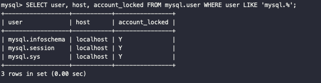
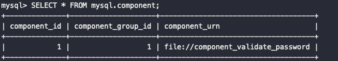
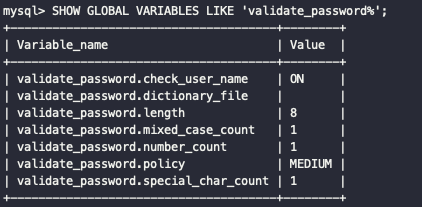

# 사용자 및 권한 User And Privilege

## 사용자 식별

- 역따옴표 `(backtick)로 아이디와 IP 주소를 감싸는 따옴표 역할을 하는데 종종 홑따옴표(')로 바뀌어서 사용되기도한다.
- 아래 계정은 어떤 것을 의미할까?

```sql
`test`@`127.0.0.1`
`test`@`%`
`test`@`192.168.0.10`
```

- `127.0.0.1`은 로컬호스트를 의미하는 IP주소인데 해당 계정은 로컬호스트로만 연결 가능하고 다른 컴퓨터에서는 `test` 아이디로 접속할 수 없음을 의미한다.
- 반면, `%`는 모든 IP에 해당 계정을 열어준다는 것을 의미한다.
- 3번째 예처럼 특정 아이피에 접근을 허용할 수도 있다.

<br/>

## 사용자 계정 관리

### 시스템 계정과 일반 계정

- MySQL 8.0부터 계정은 SYSTEM_USER 권한을 가지고 있느냐에 따라 시스템 계정(System Account)과 일반 계정(Regular Account)으로 나뉜다.
- 여기서 소개하는 시스템 계정은 MySQL 서버 내부적으로 실행되는 백그라운드 스레드 무관하다. 시스템 계정은 서버 관리자를 위한 계정이고 일반 계정은 응용 프로그램이나 개발자를 위한 계정 정도로 생각하면 된다.
- 시스템 계정은 시스템 계정과 일반 계정을 관리(생성 삭제 및 변경)할 수 있지만 일반 계정은 시스템 계정을 관리할 수 없다.
- 아래와 같이 중요 작업들은 시스템 계정으로만 수행할 수 있다.
  - 계정 관리(계정 생성 및 삭제, 그리고 계정의 권한 부여 및 제거)
  - 다른 세션(Connection) 또는 그 세션에서 실행 중인 쿼리를 강제 종료
  - 스토어드 프로그램 생성 시 DEFINER를 타 사용자로 설정
- MySQL에는 아래와 같이 내장되어 있는 계정이 있는데, 각각 다른 목적을 위해 사용되고, 이 계정이 삭제되지 않도록 주의해야한다.
  - `mysql.sys`@`localhost`: MySQL 8.0부터 기본으로 내장된 sys 스키마의 객체(뷰나 함수, 프로시저)들의 DEFINER로 사용하는 계정
  - `mysql.session`@`localhost`: MySQL 플러그인이 서버로 접근할 때 사용하는 계정
  - `mysql.infoschema`@`localhost`: information_schema에 정의된 뷰의 DEFINER로 사용하는 계정
- 아래와 같은 명령어를 실행하면 해당 계정을 확인할 수 있다.

```sql
SELECT user, host, account_locked FROM mysql.user WHERE user LIKE 'mysql.%';
```



### 계정 생성

- MySQL 5.7까지는 GRANT 명령으로 권한의 부여와 동시에 계정 생성이 가능했지만 MySQL 8.0부터 그 방식이 바뀌었다.
- CREATE USER 명령으로 계정을 생성하고, GRANT 명령어를 사용해 권한을 부여할 수 있다. 계정을 생성할 때는 아래와 같이 다양한 옵션을 설정할 수 있다.

  - 계정의 인증 방식과 비밀번호
  - 비밀번호 관련 옵션(비밀번호 유효 기간, 비밀번호 이력 개수, 비밀번호 재사용 불가 기간)
  - 기본 역할(Role)
  - SSL 옵션
  - 계정 잠금 여부

- 아래는 많이 사용되는 옵션을 이용해 계정을 만든 예시이다. 옵션을 하나씩 알아가보자.

```sql
mysql > CREATE USER `{username}`@`%`
        IDENTIFIED WITH `mysql_native_password`@ BY `{password}`;
        REQUIRE NONE
        PASSWORD EXPIRE INTERVAL 30 DAY
        ACCOUNT UNLOCK
        PASSWORD HISTORY DEFAULT
        PASSWORD REUSE INTERVAL DEFAULT
        PASSWORD REQUIRE CURRENT DAFAULT;
```

### IDNETIFIED WITH ~ BY ~

- 사용자 인증 방식과 비밀번호를 설정한다.
  - `IDENTIFIED WITH` 뒤에는 인증 방식
  - `BY` 뒤에는 사용할 password를 적어주면 된다.
- MySQL 서버는 다양한 인증 방식을 플러그인 형태로 제공한다. 그 종류는 아래와 같다.
  - **Native Pluggable Authentication**(MySQL 5.7까지 기본으로 사용되던 방식)
  - **Caching SHA-2 Pluggable Authentication**(MySQL 5.6때 도입, MySQL 8.0부터 기본 인증 방식)
  - **PAM Pluggable Authentication**(MySQL 엔터프라이즈 에디션에서만 사용 가능)
  - **LDAP Pluggable Authentication**(MySQL 엔터프라이즈 에디션에서만 사용 가능)
- MySQL 8.0에서 Native Pluggable Authentication을 사용하고 싶다면, 아래와 같이 명령어를 통해 기본 인증 방식 설정을 변경할 수도 있다. (또는 my.cnf 설정 파일에 추가)

```sql
mysql > SET GLOBAL default_authentication_plugin="mysql_native_password";
```

### REQUIRE

- MySQL 서버에 접속할 때 암호화된 SSL/TLS 채널을 사용할 지에 대한 여부를 설정하는 옵션이다.(별도 설정이 없다면 비암호화 채널로 연결한다.)

### PASSWORD EXPIRE

- 비밀번호의 유효기간을 설정하는 옵션으로 별도 명시하지 않으면 `default_password_lifetime` 시스템 변수에 저장된 기간으로 유효 기간이 설정된다. 설정 가능한 옵션은 아래와 같다.
  - PASSWORD EXPIRE: 계정 생성과 동시에 비밀번호 만료 처리
  - PASSWORD EXPIRE NEVER: 비밀번호 만료기간 없음
  - PASSWORD EXPIRE DEFAULT: `default_password_lifetime` 시스템 변수에 저장된 기간으로 처리
  - PASSWORD EXPIRE INTERVAL n DAY: 비밀번호의 유효 기간을 오늘부터 n일자로 설정

### PASSWORD HISTORY

- 한 번 사용했던 비밀번호를 재사용하지 못하게 설정하는 옵션
  - PASSWORD HISTORY DEFAULT: 시스템 변수에 저장된 개수만큼 이력 저장하고 이력에 있는 비밀번호는 사용할 수 없다.
  - PASSWORD HISTORY n: 비밀번호 이력을 최근 n개까지만 저장하고 재사용 못하게 한다.

### PASSWORD REUSE INTERVAL

- 한 번 사용했던 비밀번호의 재사용 금지 기간을 설정하는 옵션이다.
  - PASSWORD REUSE INTERVAL DEFAULT: `password_reuse_interval` 변수에 저장된 기간만큼으로 설정
  - PASSWORD REUSE INTERVAL n DAY: n일자동안 비밀번호 재사용 금지

### PASSWORD REQUIRE

- 비밀번호가 만료되어 새로운 비밀번호로 변경할 때 현재 비밀번호를 필요로 할지 말지 결정하는 옵션, 별도 명시하지 않으면 `password_require_current`시스템 변수의 값으로 설정된다.
  - PASSWORD REQUIRE CURRENT: 변경할 때 현재 비밀번호를 먼저 입력하도록 설정
  - PASSWORD REQUIRE OPTIONAL: 현재 비밀번호 입력하지 않아도 되도록 설정
  - PASSWORD REQUIRE DEFAULT: `password_require_current` 시스템 변수 값으로 설정

### ACCOUNT LOCK/UNLOCK

- 계정 생성 시 또는 `ALTER USER` 명령을 사용해 계정 정보를 변경할 때 계정을 사용하지 못하게 잠글지 여부를 결정
  - ACCOUNT LOCK: 계정을 사용하지 못하게 잠금
  - ACCOUNT UNLOCK: 잠긴 계정을 다시 사용 가능 상태로 잠금 해제

<br/>

## 비밀번호 관리

- 비밀번호를 쉽게 유추할 수 있는 단어들이 사용되지 않게 글자의 조합을 강제하거나 금칙어를 설정하는 기능도 있다.
- MySQL 서버에서 비밀번호 유효성 체크 규칙을 사용하려면 `validation_password` 컴포넌트를 사용하면 되는데 먼저 설치를 해줘야 사용할 수 있다.

```sql
## 컴포넌트 설치(Windows)
mysql > INSTALL COMPONENT `file://component_validate_password`;

## MacOS or Linux(이미 설치되어 있을 수도 있으니 확인 먼저!)
INSTALL PLUGIN component_validate_password SONAME 'component_validate_password.so';

## 설치 확인
mysql > SELECT * FROM mysql.component;

## 경로 확인
mysql > SHOW GLOBAL VARIABLES LIKE '%plu%';
```



> 5.6.6 이상 버전에서는 `INSTALL PLUGIN validate_password SONAME 'validate_password.so';`을 통해 설치했지만 8.0.4이상 버전부터는 `component_validate_password` 플러그인으로 대체되었다고 한다.

- 시스템 변수를 확인하려면 아래와 같이 명령어를 사용하면 된다.

```sql
mysql > SHOW GLOBAL VARIABLES LIKE 'validate_password%';
```



- 비밀번호 정책은 `LOW`, `MEDIUM`, `STRONG`이 있으며 기본값은 `MEDIUM`이다. 금칙어를 적용하고 싶다면 `STRONG` 정책을 사용해야한다.

```sql
mysql > SET GLOBAL validate_password.dictionary_file='prohibitive_word.data';
mysql > SET GLOBAL validate_password.policy='STRONG';
```

### 이중 비밀번호

- 기존 5.x에서는 비밀번호를 하나만 사용했었다. 데이터베이스 서버의 계정 정보는 여러 응용 프로그램 서버가 공용으로 사용하는 경우가 많았기 때문에 서비스가 실행 중인 상태에서는 비밀번호를 바꾸기 어려웠다.
- 이 문제를 해결하기 위해 MySQL 8.0부터 비밀번호 2개의 값을 동시에 사용할 수 있는 기능을 추가했다! 이 기능을 이중 비밀번호(Dual Password)라고 한다.
  - 프라이머리(Primary)와 세컨더리(Secondary)로 구분된다.
- 기존 비밀번호 변경구문에서 `RETAIN CURRENT PASSWORD` 옵션만 추가하면 된다. 아래 명령어를 사용하면 `{old_password}`는 세컨더리 비밀번호가 되고 `{new_password}`가 프라이머리 비밀번호가 된다.

```sql
mysql > ALTER USER 'root'@'localhost' IDENTIFIED BY '{old_password}'
mysql > ALTER USER 'root'@'localhost' IDENTIFIED BY '{new_password}' RETAIN CURRENT PASSWORD;
```

- 이 상태에서는 두 개의 비밀번호 중 아무거나 입력해도 로그인이 된다. 이제 응용 프로그램 서버에서 데이터베이스 계정 정보를 새로운 비밀번호로 변경하고 기존 비밀번호를 삭제하면 안전하게 이관할 수 있다!
- 아래와 같이 세컨더리 비밀번호를 삭제할 수 있다.

```sql
mysql > ALTER USER 'root'@'localhost' DISCARD OLD PASSWORD;
```

<br/>

## 권한 Privilege

- MySQL 5.7 버전까지는 글로벌 권한과 객체 단위의 권한으로 구분했다.(정적 권한)
- 8.0 버전부터는 동적 권한이 추가됐다. 동적 권한이란 서버가 시작되면서 동적으로 생성되는 권한을 의마한다. 권한의 종류는 아래 공식문서에 잘 설명되어 있다.
  - [공식문서 링크](https://dev.mysql.com/doc/refman/8.0/en/privileges-provided.html)

### 권한 부여

- 아래와 같은 형식으로 `GRANT` 명령어를 통해 권한을 부여할 수 있다.

```sql
mysql > GRANT {privilege} ON {db}.{table} TO '{username}'@'{host}';
```

- `*`을 통해 글로벌 권한을 부여할 수 있다.

```sql
mysql > GRANT SUPER ON *.* TO 'user'@'localhost';
```

- 아래와 같이 테이블에 대한 권한을 상세하게 쪼개 부여할 수도 있다.

```sql
mysql > GRANT SELECT, INSERT, UPDATE, DELETE ON *.* TO 'user'@'localhost';

## employees DB에 대해 읽기 권한만 부여
mysql > GRANT SELECT ON employees.* TO 'user'@'localhost';

## dept_name 컬럼에 대해서만 UPDATE 권한 부여, 나머지는 모든 컬럼 가능
mysql > GRANT SELECT, INSERT, UPDATE(dept_name), DELETE ON employees.department TO 'user'@'localhost';
```

<br/>

## 역할 Role

- MySQL 8.0부터 권한을 묶어서 역할(Role)을 사용할 수 있게 되었다.
- 서버 내부적으로 역할은 계정과 비슷한 모습을 하고 있다. 아래는 `CREATE ROLE` 명령어를 통해 역할을 정의한 예이다.

```sql
mysql > CREATE ROLE
        role_mydb_read;
        role_mydb_write;
```

- 아직까진 아무런 권한이 없는 빈껍데기이지만 GRANT를 통해 권한을 부여할 수 있다.

```sql
mysql > GRANT SELECT ON mydb.* TO role_mydb_read;
mysql > GRANT INSERT, UPDATE ON mydb.* TO role_mydb_write;
```

- 계정에 해당 역할을 부여하려면 아래와 같은 명령어를 작성하면 된다.

```sql
mysql > GRANT role_mydb_read TO 'reader'@'localhost';
mysql > GRANT role_mydb_read, role_mydb_write TO 'writer'@'localhost';
```

- 아래와 같이 권한 부여가 이루어졌는지 확인할 수 있다.

```sql
mysql > SHOW GRANTS;
```

- 하지만 현재 상태에서 reader나 writer 계정에 접속하려고 하면 권한이 없다는 에러가 발생한다. 해당 역할을 사용할 수 있게 만들려면 `SET ROLE` 명령어를 사용해 해당 역할을 활성화해야한다.

```sql
mysql > SET ROLE 'role_mydb_read';
```

- 만약 매번 역할을 활성하는 것이 귀찮다면, 로그인과 동시에 부여된 역할이 자동으로 활성화될 수 있게 아래 명령어를 사용할 수도 있다.

```sql
mysql > SET GLOBAL activate_all_roles_on_login=ON;
```

<br/>

## 참고자료

- Real MySQL 8.0
