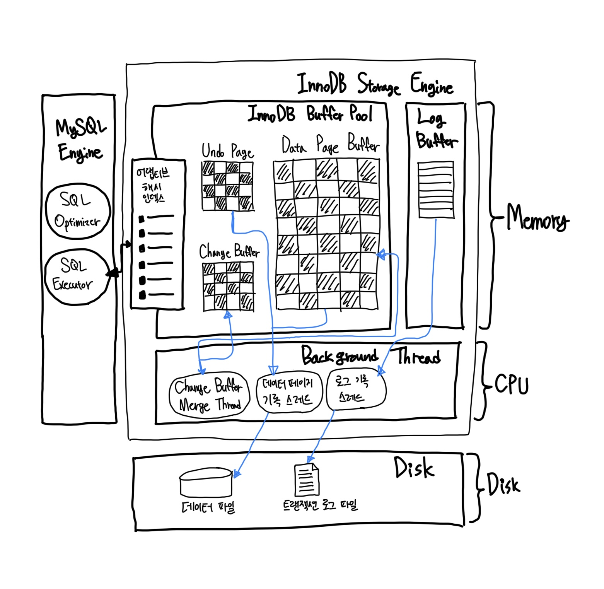
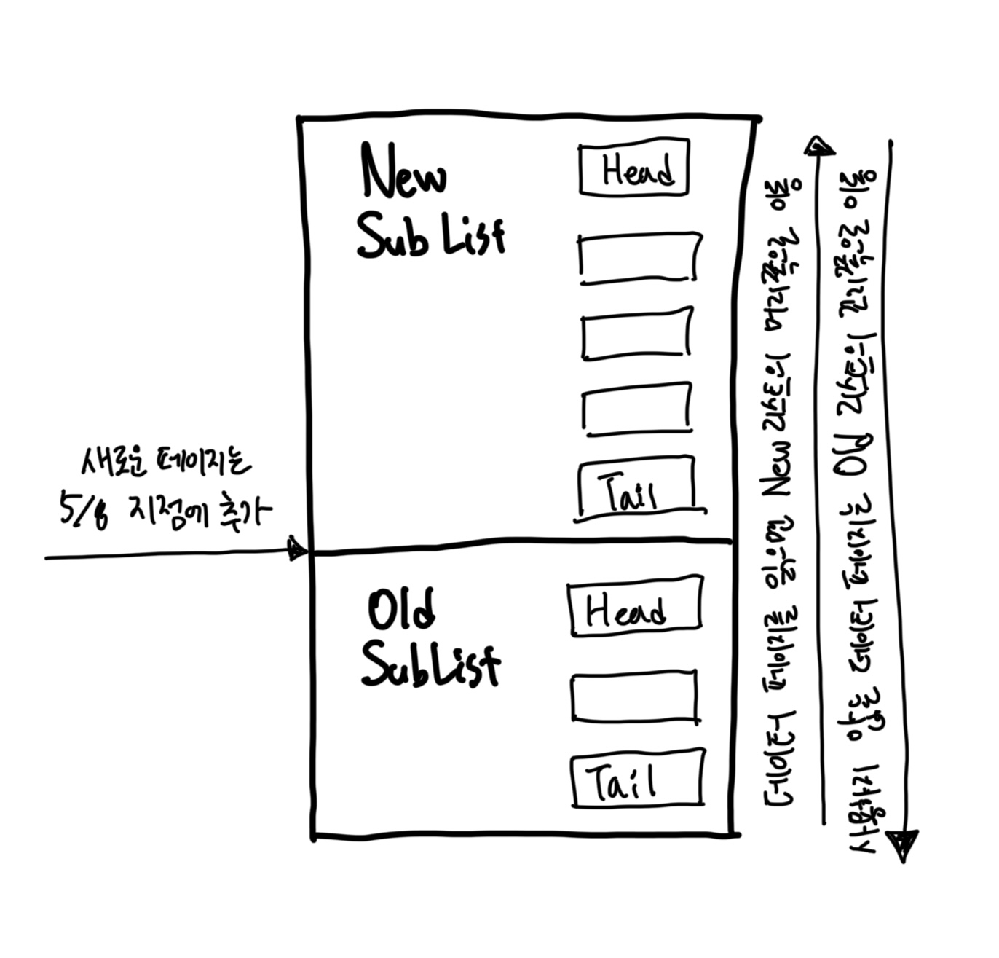
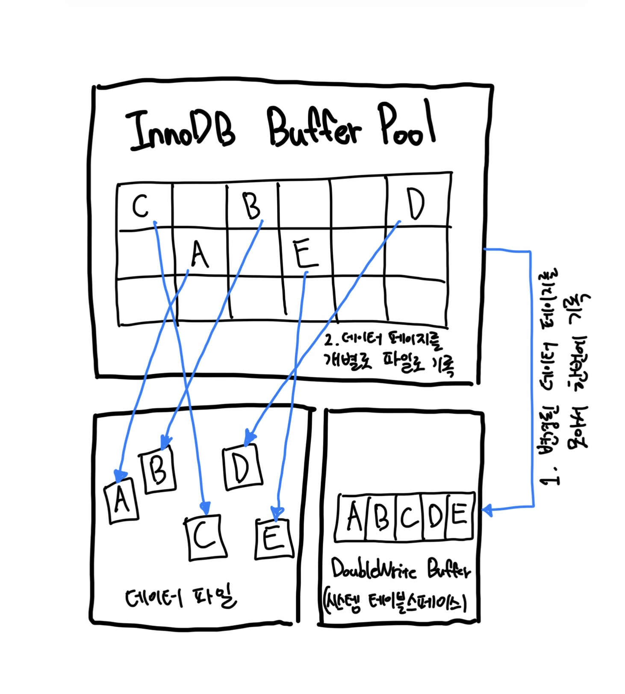

# InnoDB 스토리지 엔진 아키텍처

- MySQL에서 사용할 수 있는 스토리지 엔진 중 거의 유일하게 레코드 기반의 잠금을 제공.
    - 덕분에 높은 동시성 처리가 가능하고 안정적이며 성능이 뛰어나다.




### 2-1. 프라이머리 키에 의한 클러스터링

- InnoDB의 모든 테이블은 기본적으로 프라이머리 키를 기준으로 클러스터링되어 저장된다.
    - **프라이머리 키 값의 순서대로 디스크에 저당된다는 뜻**
    - 모든 세컨더리 인덱스는 레코드의 주소 대신 프라이머리 키의 값을 논리적인 주소로 사용한다.
    - 프라이머리 키가 클러스터링 인덱스이기 때문에 프라이머리 키를 이용한 레인지 스캔은 상당히 빨리 처리될 수 있다.
    - 결과적으로 쿼리의 실행 계획에서 프라이머리 키는 기본적으로 다른 보조 인덱스에 비해 비중이 높게 설정된다.
- InnoDB 스토리지 엔진과 달리 MyISAM 스토리지 엔진에서는 클러스터링 키를 지원하지 않는다.
    - 그래서 MyISAM 테이블에서는 프라이머리 키와 세컨더리 인덱스는 구조적으로 아무런 차이가 없다.
    - 프라이머리 키는 유니크 제약을 가진 세컨더리 인덱스일 뿐이다.
    - MyISAM 테이블의 프라이머리 키를 포함한 모든 인덱스는 `물리적인 레코드의 주소 값 ROWID`을 가진다.

## 2-2. 외래 키 지원

- 외래 키에 대한 지원은 InnoDB 스토리지 엔진 레벨에서 지원하는 기능으로 MyISAM이나 MEMORY 테이블에서는 사용할 수 없다.
- 외래 키는 서버 운영의 불편함 때문에 서비스용 데이터베이스에서는 생성하지 않는 경우도 자주 있는데, 그렇다 하더라도 개발 환경의 데이터베이스에서는 좋은 가이드 역할을 할 수 있다.
    - 외래 키 생성 시: 부모 테이블, 자식 테이블 모두 해당 칼럼에 인덱스 생성 필요
    - 변경 시: 반드시 부모 테이블이나 자식 테이블에 데이터가 있는지 체크하는 작업이 필요 => 잠금이 여러 테이블로 전파 => 데드락 발생 가능성 상승(그러므로 주의하는 것이 좋다.)
- `foreign_key_checks` 시스템 변수를 OFF로 설정하면 외래 키 관계에 대한 체크 작업을 일시적으로 멈출 수 있다.

```shell
mysql > SET foreign_key_checks=OFF;
# 작업 완료 후...
mysql > SET foreign_key_checks=ON;
```

- 아래와 같이 세션에서만 멈추게 하는 것을 추천

```shell
mysql > SET SESSION foreign_key_checks=OFF;
# 작업 완료 후...
mysql > SET SESSION foreign_key_checks=ON;
```

- 반드시 일관성을 맞춰준 다음 다시 외래 키 체크 기능을 활성화해야 한다.

### 2-3. MVCC (Multi Version Concurrency Control)

- 일반적으로 레코드 레벨의 트랜잭션을 지원하는 DBMS에서 제공하는 기능이며, MVCC의 가장 큰 목적은 잠금을 사용하지 않는 일관된 읽기를 제공하는 데 있다.
    - InnoDB는 언두 로그(Undo log)를 이용해 이 기능을 구현한다.
    - 여기서 멀티 버전이라 함은 하나의 레코드에 대해 여러 개의 버전이 동시에 관리된다는 의미다.
- 테이블이 `UPDATE`를 하면.
    - InnoDB 버퍼 풀은 업데이트가 되고, 그 이전 기록이 언두 로그에 저장된다. (COMMIT 전이기 때문에 디스크에는 아직 안 들어간 상태)
    - 이 때 격리 수준이 `READ_UNCOMMITTED`인 경우 버퍼 풀을 그대로 읽어오기 때문에 업데이트된 내용이 조회된다. (Dirty Read)
    - `COMMIT` 명령이 실행되면 InnoDB는 더 이상의 변경 작업 없이 지금의 상태를 영구적인 데이터로 만들어 버린다.
    - 하지만 `ROLLBACK`을 실행하면 InnoDB는 언두 영역에 있는 백업된 데이터르르 InnoDB 버퍼 풀로 다시 복구하고, 언두 영역의 내용을 삭제해버린다.
- `COMMIT`이 된다고 언두 영역을 바로 삭제하지는 않는다. 이 언두 영역을 필요로 하는 트랜잭션이 더는 없을 때 비로소 삭제된다.

### 2-4. 잠금 없는 일관된 읽기 (Non-Locking Consistent Read)

- InnoDB 스토리지 엔진은 MVCC 기술을 이용해 잠금을 걸지 않고 읽기 작업을 수행한다.
    - 잠금을 걸지 않기 때문에 InnoDB에서 읽기 작업은 다른 트랜잭션이 가지고 있는 잠금을 기다리지 않고, 읽기 작업이 가능하다.
    - 격리 수준이 `SERIALIZABLE`이 아니라면 `INSERT`와 연결되지 않은 순수한 `읽기 SELECT` 작업은 다른 트랜잭션의 변경 작업과 관계없이 항상 잠금을 대기하지 않고 바로 실행한다.
- 이를 '잠금 없는 일관된 읽기'라고 표현하며, InnoDB에서는 변경되기 전의 데이터를 읽기 위해 언두 로그를 사용한다.
- 오랜 시간 동안 활성 상태인 트랜잭션으로 인해 MySQL 서버가 느려지거나 문제가 발생할 때가 가끔 있는데, 바로 이러한 일관된 읽기를 위해 언두 로그를 삭제하지 못하고 계속 유지해야 하기 때문에 발생하는 문제다.


### 2-5. 자동 데드락 감지

- InnoDB 스토리지 엔진은 내부적으로 잠금이 교착 상태에 빠지지 않았는지 체크하기 위해 `잠금 대기 목록을 그래프 Wait-for List` 형태로 관리한다.
    - 데드락 감지 스레드를 가지고 있어서 데드락 감지 스레드가 주기적으로 잠금 대기 그래프를 검사해 교착 상태에 빠진 트랜잭션들을 찾아서 그중 하나를 강제 종료한다.
    - 우선순위는 언두 로그의 양으로 결정. => 더 적게 가진 트랜잭션이 일반적으로 롤백된다.
- 데드락 감지 스레드가 MySQL 엔진에서 관리되는 테이블 잠금(LOCK TABLES 명령으로 잠긴 테이블)을 볼 수 없다.
    - innodb_table_locks 변수를 활성화하면 테이블 잠금 레벨까지 감지할 수 있게 된다. (특별한 이유가 없다면 활성화!)
- 자동 데드락 감지 스레드 없이도 데드락 상황을 모면할 수 있는 방법이 있다.
    - `innodb_lock_wait_timeout` 변수를 활성화하면 데드락 상황에서 일정 시간이 지나면 자동으로 요청이 실패하고 에러 메시지를 반환하게 된다.

> #### 참고
> - 만약 PK 또는 세컨더리 인덱스를 기반으로 매우 높은 동시성 처리를 요구하는 서비스가 있다면 `innodb_deadlock_detect`를 비활성화해서 성능 비교를 해보는 것도 새로운 기회가 될 것이다.

### 2-6. 자동화된 장애 복구

- InnoDB에는 손실이나 장애로부터 데이터를 보호하기 위한 여러 가지 메커니즘이 탑재돼 있다.
    - MySQL이 시작될 때 완료되지 못한 트랜잭션이나 디스크에 일부만 기록된 (Partial write) 데이터 페이지 등에 대한 일련의 복구 작업이 자동으로 진행된다.
- 만약 자동으로 복구될 수 없는 손상이 있다면 자동 복구를 멈추고 MySQL 서버는 종료돼 버린다.
    - 이때는 MySQL 서버의 설정 파일에 `innodb_force_recovery` 변수를 설정해 MySQL 서버를 시작해야 한다.
    - 이 설정값은 MySQL 서버가 시작될 때 InnoDB 스토리지 엔진이 데이터 파일이나 로그 파일의 손상 여부 검사 과정을 선별적으로 진행할 수 있게 한다.
- `innodb_force_recovery` 옵션에서 설정 가능한 값은 1 ~ 6이다.
    - 1: 테이블스페이스나 데이터나 인덱스 페이지의 손상 무시.
    - 2: 메인 스레드를 시작하지 않고 MySQL 서버 시작.
    - 3: 롤백에 대비해 변경 전의 데이터를 언두 영역에 기록.
    - 4: 인서트 버퍼에 저장해두고 나중에 처리.
    - 5: 언두 레코드를 통해 데이터 페이지를 복구하고, 리두 로그를 적용해 종료 시점이나 장애 발생 시점의 상태를 재현. 커밋되지 않은 트랜잭션에서 변경한 작업은 모두 롤백 처리. 하지만 InnoDB의 언두 로그를 사용할 수 없다면 InnoDB 엔진의 에러로 MySQL 서버를 시작할 수 없다는 함정.
    - 6: 리두 로그를 모두 무시한 채로 MySQL 서버 시작(원래 MySQL 서버는 리두 로그가 손상되면 시작되지 않는다.)
- 위와 같이 진행해도 MySQL 서버가 시작되지 않으면 백업을 이용해 다시 구축하는 방법밖에 없다.

### 2-7. InnoDB 버퍼 풀

- InnoDB 스토리지 엔진에서 가장 핵심적인 부분
    - 디스크의 데이터 파일이나 인덱스 정보를 메모리에 캐시해 두는 공간.
    - 쓰기 작업을 지연시켜 일괄 작업으로 처리할 수 있게 해주는 버퍼 역할도 같이 한다.
- 일반적인 애플리케이션에서는 `INSERT`, `UPDATE`, `DELETE`처럼 데이터를 변경하는 쿼리는 데이터 파일의 이곳저곳에 위치한 레코드를 변경하기 때문에 랜덤한 디스크 작업을 발생시킨다.
    - 하지만 버퍼 풀이 이러한 변경된 데이터를 모아서 처리하면 랜덤한 디스크 작업의 횟수를 줄일 수 있다.

#### 2-7-1. 버퍼 풀의 크기 설정

- 일반적으로 전체 물리 메모리의 80% 정도를 InnoDB의 버퍼 풀로 설정하라는 내용도 있으나, 그렇게 단순하게 설정해서는 안되는 값이다.
    - 운영체제와 각 클라이언트 스레드가 사용할 메모리도 충분히 고려해서 설정해야 한다.
    - MySQL 서버 내에서 메모리를 필요로 하는 부분은 크게 없지만 아주 독특한 경우 레코드 버퍼가 상당한 메모리를 사용하기도 한다.
    - 레코드 버퍼: 각 클라이언트 세션에서 테이블의 레코드를 읽고 쓸 때 버퍼로 사용하는 공간. 별도 설정 불가. 전체 커넥션 개수와 각 커넥션이 읽고 쓰는 테이블의 개수에 따라서 결정. 동적으로 해제되기도 하므로 정확히 필요한 메모리 공간의 크기를 계산할 수가 없다.
- MySQL 5.7 버전부터는 InnoDB 버퍼 풀의 크기를 동적으로 조절할 수 있게 개선되었다.
    - **버퍼 풀의 크기를 적절히 작은 값으로 설정해서 조금씩 상황을 봐가면서 증가시키는 방법이 최적**
- 권장 설정 방법!!
    - 운영체제의 전체 메모리 공간이 8GB 미만이라면 50% 정도만 InnoDB 버퍼 풀로 설정하고 나머지 메모리 공간은 MySQL 서버와 운영체제, 그리고 다른 프로그램이 사용할 수 있는 공간으로 확보해주는 것이 좋다.
    - 만약 그 이상이라면, InnoDB 버퍼 풀의 크기를 전체 메모리의 50%에서 시작해서 조금씩 올려가면서 최적점을 찾는다. => 50GB라면 15~30GB 정도를 운영체제와 다른 용용 프로그램을 위해서 남겨두고 나머지를 InnoDB 버퍼 풀로 할당하자.
- InnoDB 버퍼 풀은 `innodb_buffer_pool_size` 시스템 변수로 크기를 설정할 수 있으며, 동적으로 버퍼 풀의 크기를 확장할 수 있다.
    - 하지만 버퍼 풀은 크리티컬한 변경이다. 최대한 서버가 한가한 시점을 골라서 진행해야 한다.
- InnoDB 버퍼 풀은 내부적으로 128MB 청크 단위로 쪼개어 관리되는데, 이는 버퍼 풀의 크기를 줄이거나 늘리기 위한 단위 크기로 사용된다.
    - 그래서 버퍼 풀의 크기를 줄이거나 늘릴 때는 128MB 단위로 처리된다.
- InnoDB 버퍼 풀은 전통적으로 버퍼 풀 전체를 관리하는 잠금(세마포어)으로 인해 내부 잠금 경합을 많이 유발해왔는데, 이런 경합을 줄이기 위해 버퍼 풀을 여러 개로 쪼개어 관리할 수 있게 개선됐다.
    - 여러 개의 작은 버퍼 풀로 쪼개지면서 개별 버퍼 풀 전체를 관리하는 잠금(세마포어) 자체도 경합이 분산되는 효과를 내게 되는 것이다.
    - `innodb_buffer_pool_instances` 변수를 통해 여러 개로 분리해서 관리가 가능하다. 각 버퍼 풀을 버퍼 풀을 인스턴스라고 표현한다.
    - 기본적으로 8개로 초기화. 메모리 크기가 1GB 미만이면 버퍼풀 인스턴스는 1개만 생성.
    - 메모리 공간이 40GB 이하 수준이라면 기본값인 8을 유지하고, 메모리가 크다면 버퍼 풀 인스턴스당 5GB 정보가 되게 인스턴스 개수를 설정하는 것이 좋다.

#### 2-7-2. 버퍼 풀의 구조

- 버퍼 풀의 페이지 크기 조각을 관리하기 위해 InnoDB 스토리지 엔진은 크게 `LRU(Least Recently Used)` 리스트와 `플러시 Flush` 리스트, 그리고 `프리 Free` 리스트라는 3개의 자료 구조를 관리한다.
    - Free List는 InnoDB 버퍼 풀에서 실제 사용자 데이터로 채워지지 않은 비어 있는 페이지들의 목록이며, 사용자의 쿼리가 새롭게 디스크의 데이터 페이지를 읽어와야 하는 경우 사용된다.
- 아래는 버퍼 풀 관리를 위한 LRU 리스트 구조이다.



- LRU 리스트를 관리하는 목적은 디스크로부터 한 번 읽어온 페이지를 최대한 오랫동안 InnoDB머퍼풀의 메모리에 유지해서 디스크 읽기를 최소화하는 것이다.
- InnoDB 스토리지 엔진에서 데이터를 찾는 과정

1. 필요한 레코드가 저장된 데이터가 저장된 데이터 페이가 버퍼 풀에 있는지 검사
   1. InnoDB 어댑티브 해시 인덱스를 이용해 페이지를 검색
   2. 해당 테이블의 인덱스(B-Tree)를 이용해 버퍼 풀에서 페이지 검색
   3. 버퍼 풀에 이미 데이터 페이지가 있었다면 해당 페이지의 포인터를 MRU 방향으로 승급
2. 디스크에서 필요한 데이터 페이지를 버퍼 풀에 적재하고, 적재된 페이지에 대한 포인터를 LRU 헤더 부분에 추가
3. 버퍼 풀의 LRU 헤더 부분에 적재된 데이터 페이지가 실제로 읽히면 MRU 헤더 부분으로 이동(Read Ahead와 같이 대량 읽기의 경우 디스크의 데이터 페이지가 버퍼 풀로 적재는 되지만 실제 쿼리에서 사용되지는 않을 수도 있으며 이런 경우에는 MRU로 이동되지 않음)
4. 버퍼 풀에 상주하는 데이터 페이지는 사용자 쿼리가 얼마나 최근에 접근했었는지에 따라 나이(Age)가 부여되며, 버퍼 풀에 상주하는 동안 쿼리에서 오랫동안 사용되지 않으면 데이터 페이지에 부여된 나이가 오래되고(Aging) 결국 해당 페이지는 버퍼 풀에서 제거. 버퍼 풀의 데이터 페이지가 쿼리에 의해 사용되면 나이가 초기화되어 다시 젊어지고 MRU의 헤더 부분으로 옮겨진다.
5. 필요한 데이터가 자주 접근됐다면 해당 페이지의 인덱스 키를 어댑티브 해시 인덱스에 추가

- 일단 한 번 데이터 변경이 가해진 데이터 페이지는 플러시 리스트에 관리되고 특정 시점이 되면 디스크로 기록돼야 한다.
  - 데이터가 변경되면 InnoDB는 변경 내용을 리두 로그에 기록하고 버퍼 풀의 데이터 페이지에도 변경 내용을 반영한다.
  - 그래서 리두 로그의 각 엔트리는 특정 데이터 페이지와 연결된다.
  - 하지만 리두 로그가 디스크로 기록됐다고 해서 데이터 페이지가 디스크로 기록됐다는 것을 항상 보장하지는 않는다.
  - 때로는 그 반대의 경우도 발생할 수 있는데, InnoDB 스토리지 엔진은 체크포인트를 발생시켜 디스크의 리두 로그와 데이터 페이지의 상태를 동기화하게 된다.
  - 체크포인트는 MySQL 서버가 시작될 때 InnoDB 스토리지 엔진이 리두 로그의 어느 부분부터 복구를 실행해야 할지 판단하는 기준점을 만드는 역할을 한다.

#### 2-7-3. 버퍼 풀과 리두 로그

- InnoDB의 버퍼 풀과 리두 로그는 매우 밀접한 관계다.
  - InnoDB의 버퍼 풀은 서버의 메모리가 허용하는 만큼 크게 설정하면 할수록 쿼리의 성능이 빨라진다.
  - 버퍼 풀은 데이터베이스 서버의 성능 향상을 위해 데이터 캐시와 쓰기 버퍼링이라는 두 가지 용도가 있는데, 버퍼 풀의 메모리 공간만 단순히 늘리는 것은 데이터 캐시 기능만 향상시키는 것이다.
  - 쓰기 버퍼링까지 향상시키려면 InnoDB 버퍼 풀과 리두 로그와의 관계를 먼저 이해해야 한다.
- InnoDB 버퍼 풀은 디스크에서 읽은 상태로 전혀 변경되지 않은 클린 페이지(Clean Page)와 함께 `INSERT`, `UPDATE`, `DELETE` 명령으로 변경된 데이터를 가진 `더티 페이지 Dirty Page`도 가지고 있다.
  - 더티 페이지는 디스크와 메모리(버퍼 풀)의 상태가 다르기 때문에 언젠가는 디스크로 기록돼야 한다.
  - 하지만 더티 페이지는 버퍼 풀에 무한정 머무를 수 있는 것은 아니다.
- 리두 로그는 1개 이상의 고정 크기 파일을 연결해서 순환 고리처럼 사용한다. 
  - 데이터 변경이 계속 발행하면 리두 로그 파일에 기록됐던 로그 엔트리는 어느 순간 다시 새로운 로그 엔트리로 덮어 쓰인다.
  - 전체 리두 로그 파일에서 재사용 가능한 공간과 당장 재사용 불가능한 공간을 구분해서 관리해야 하는데, 재사용 불가능한 공간을 `활성 리두 로그 Active Redo Log`라고 한다.
- 리두 로그 파일의 공간은 계속 순환되어 재사용, 매번 기록될 때마다 로그 포지션은 계속 증가된 값을 갖게 된다.
  - 이를 `LSN(Log Sequence Number)`이라고 한다.
  - 주기적으로 체크포인트 이벤트를 발생시켜 리두 로그와 버퍼 풀의 더티 페이지를 디스크로 동기화하는데, 가장 최근 체크포인트 지점의 LSN이 활성 리두 로그 공간의 시작점이 된다.
  - 체크포인트 에이지는 활성 리두 로그 공간의 크기를 일컫는다.
- InnoDB 버퍼 풀의 더티 페이지는 특정 리두 로그 엔트리와 관계를 가지고, 체크포인트가 발생하면 체크포인트 LSN보다 작은 리두 로그 엔트리와 관련된 더티 페이지는 모두 디스크로 동기화돼야 한다.
  - 물론 당연히 체크포인트 LSN보다 작은 LSN 값을 가진 리두 로그 엔트리도 디스크로 동기화돼야 한다.

> #### 참고
> - 버퍼 풀의 크기가 100GB라고 리두 로그의 공간이 100GB가 돼야 한다는 것은 아니다.
> - 일반적으로 리두 로그는 변경분만 가지고 버퍼 풀은 데이터 페이지를 통째로 가지기 때문에 데이터 변경이 발생해도 리두 로그는 훨씬 작은 공간만 있으면 된다.

#### 2-7-4. 버퍼 풀 플러시 Buffer Pool Flush

- MySQL 5.6 버전까지는 InnoDB 스토리지 더티 페이지 플러시 기능이 그다지 부드럽게 처리되지 않았다.
  - 버전 업그레이드를 통해 더티 페이지를 디스크에 동기화하는 부분에서 예전과 같은 딧스크 쓰기 폭증 현상은 발생하지 않는다.
- InnoDB 스토리지 엔진 버퍼 풀에서 아직 디스크로 기록되지 않은 더티 페이지들을 성능상의 악영향 없이 디스크에 동기화하기 위해 다음과 같이 2개의 플러시 기능을 백그라운드 실행한다.
  - 플러시 리스트 플러시
  - LRU 리스트 플러시

##### 2-7-4-1. 플러시 리스트 플러시

- 리두 로그 공간의 재활용을 위해 주기적으로 오래된 리두 로그 엔트리가 사용하는 공간을 비워야 한다.
  - 리두 로그 공간이 지워지려면 반드시 InnoDB 버퍼 풀의 더티 페이지가 먼저 디스크로 동기화돼야 한다.
- InnoDB 스토리지 엔진에서 더티 페이지를 디스크로 동기화하는 스레드를 `클리너 스레드 Cleaner Thread`라고 한다.
  - `innodb_page_cleaners` 설정값은 웬만하면 `innodb_buffer_pool_instances` 설정값과 동일한 값으로 설정.
- InnoDB 버퍼 풀에 더티 페이지가 많으면 많을수록 `디스크 쓰기 폭발 Disk IO Burst` 현상이 발생할 가능성이 높아진다.
  - 디스크에 기록되는 더티 페이지 개수보다 더 많은 더티 페이지가 발생하면 버퍼 풀에 더티 페이지가 계속 증가하게 되고, 어느 순간 더티 페이지의 비율이 90%가 넘어가면 InnoDB 스토리지 엔진은 급작스럽게 더티 페이지를 디스크로 기록해야 한다고 판단한다.

- InnoDB 스토리지 엔진은 `어댑티브 플러시 Adaptive Flush`라는 기능을 제공한다.
  - `innodb_adaptive_flushing` 시스템 변수로 키고 끔. 기본값이 사용.
  - 어댑티브 플러시 기능은 단순히 버퍼 풀의 더티 페이지 비율이나 `innodb_io_capacity`, `innodb_io_capacity_max` 설정값에 의존하지 않고 새로운 알고리즘을 사용한다.
  - 리두 로그의 증가 속도를 분석해서 적절한 수준의 더티 페이지가 버퍼 풀에 유지될 수 있도록 디스크 쓰기를 실행한다.
  - `innodb_adaptive_flushing_lwm` 시스템 변수의 기본값은 10%인데, 이는 전체 리두 공간에서 활성 리두 로그의 공간이 10% 미만이면 어댑티브 플러시가 작동하지 않게 한다.
- `innodb_flush_neighbors` 시스템 변수는 더티 페이지를 디스크에 기록할 때 디스크에서 근접한 페이지 중에서 더티 페이지가 있다면 InnoDB 스토리지 엔진이 함께 묶어서 디스크로 기록하게 해주는 기능을 활성화할 지 결정한다.
  - HDD를 사용한다면 1또는 2로 설정하는 것이 좋다.
  - SSD를 사용한다면 비활성 모드로 유지.

##### 2-7-4-2. LRU 리스트 플러시

- 사용 빈도가 낮은 데이터 페이지를 제거해서 새로운 페이지들을 읽어올 공간을 만들어야 하는데, 이를 위해 LRU 리스트(LRU_list) 플러시 함수가 사용된다.
  - LRU 리스트의 끝부분부터 시작해서 최대 `innodb_lru_scan_depth` 시스템 변수에 설정된 개수만큼의 페이지들을 스캔한다.
  - 스캔하면서 더티 페이지는 디스크에 동기화하게 하면, 클린 페이지는 즉시 `프리 Free` 리스트로 페이지를 옮긴다.
- LRU 리스트의 스캔은 (`innodb_buffer_pool_instances` * `innodb_lru_scan_depth`) 수만큼 수행한다.

### 2-7-5. 버퍼 풀 상태 백업 및 복구

- InnoDB 서버의 버퍼 풀은 쿼리의 성능에 매우 밀접하게 연결돼 있다.
- 쿼리 요청이 매우 빈번한 서버 => 셧다운 => 다시 시작 => 쿼리 처리 성능이 평상시보다 1/10도 안되는 경우가 대부분.
  - 원래대로라면 버퍼 풀에 쿼리들이 사용할 데이터가 이미 준비돼 있으므로 디스크에서 데이터를 읽지 않아도 처리할 수 있기 때문이다.
  - 데이터가 버퍼 풀에 적재되어 있는 상태 = `워밍업 Warming Up`
- 서버를 다시 시작해야 하는 경우 MySQL 서버를 셧다운하기 전에 아래와 같이 시스템 변수를 통해 버퍼 풀의 상태를 백업할 수 있다.

```shell
-- // MySQL 서버 셧다운 전에 버퍼 풀의 상태 백업
mysql> SET GLOBAL innodb_buffer_pool_dump_now=ON;

-- // MySQL 서버 재시작 후, 백업된 버퍼 풀의 상태 복구
mysql> SET GLOBAL innodb_buffer_pool_load_now=ON;
```

- 데이터 디렉터리에 `ib_buffer_pool`이라는 이름의 파일이 생성. 보통 몇십 MB 이하다.
- 아래와 같은 명령어를 사용해 버퍼 풀을 다시 복구하는 과정이 얼마나 진행됐는지 확인할 수 있다.

```shell
mysql> SHOW STATUS LIKE 'Innodb_buffer_pool_dump_status'\G
```

- 버퍼 풀 적재 작업에 너무 시간이 오래 걸려서 멈추고자 한다면 아래와 같은 명령어를 사용하자.

```shell
mysql> SET GLOBAL innodb_buffer_pool_load_abort=ON;
```

### 2-7-6. 버퍼 풀의 적재 내용 확인

- `information_schema` 데이터베이스에 `innodb_cached_indexes` 테이블을 통해 확인할 수 있다.

```shell
mysql> SELECT
         it.name table_name,
         ii.name index_name,
         ici.n_cached_pages n_cached_pages
       FROM information_schema.innodb_tables it
         INNER JOIN information_schema.innodb_indexes ii ON ii.table_id = it.table_id
         INNER JOIN information_schema.innodb_cached_indexes ici ON ici.index_id = ii.index_id
       WHERE it.name=CONCAT('employees', '/', 'employees');
```

### 2-8. Double Wirte Buffer

- 리두 로그의 공간 낭비를 막기 위해 페이지의 변경된 내용만 기록한다.
  - 더티 페이지가 만약 일부만 디스크에 기록되는 문제가 발생하면 그 페이지의 내용을 복구할 수 없을 수도 있다. (`Partial-Page`, `Torn-Page`)
- InnoDB 엔진은 이 같은 문제를 막기 위해 `Double-Write` 기법을 이용한다.



1. 먼저 'A' ~ 'E' 까지의 더티 페이지를 우선 묶어서 한 번의 디스크 쓰기로 시스템 테이블스페이스의 DoubleWrite 버퍼에 기록한다.
2. 각 더티 페이지를 파일의 적당한 위치에 하나씩 랜덤으로 쓰기를 실행한다.

- 데이터 무결성이 매우 중요한 서비스에서는 DoubleWrite의 활성화를 고려하자.
  - 만약 리두 로그 동기화 설정(`innodb_flush_log_at_trx_commit`)을 1이 아닌 값으로 설정했다면 DoubleWrite도 비활성화하는 것이 좋다.

### 2-9. 언두 로그

- 언두 로그의 용도는 아래와 같다.
- **트랜잭션 보장**
  - 롤백되면 변경 전 데이터로 복구하는 데 사용
- **격리 수준 보장**
  - 특정 커넥션에서 데이터를 변경하는 도중에 다른 커넥션에서 데이터를 조회하면 트랜잭션 격리 수준에 맞게 변경 중인 레코드를 읽지 않고 언두 로그에 백업해둔 데이터를 읽어서 반환하기도 함.

#### 2-9-1. 언두 로그 모니터링

- 대용량의 데이터를 처리하는 트랜잭션, 오랜 시간 동안 실행되는 트랜잭션을 실행할 때 언두 로그의 양은 급격히 증가할 수 있다.
  - 장기간 활성화된 트랜잭션으로 인해 언두 로그가 지워지지 않기 때문이다.
- 아래 명령을 통해 언두 로그 건수를 확인할 수 있다.

```shell
mysql> SHOW ENGINE INNODB STATUS \G
```

#### 2-9-2. 언두 테이블스페이스 관리

- 언두 로그가 저장되는 공간을 `언두 테이블스페이스 Undo Tablespace`라고 한다.
- 하나의 언두 테이블스페이스는 1개 이상 128개 이하의 롤백 세그먼트를 가지며, 롤백 세그먼트는 1개 이상의 `언두 슬롯 Undo Slot`을 가진다.
- 하나의 롤백 세그먼트는 InnoDB의 페이지 크기를 16바이트로 나눈 값의 개수만큼의 언두 슬롯을 가진다.
  - ex. 페이지 크기가 16KB라면 하나의 롤백 세그먼트는 1024개의 언두 슬롯을 갖게 된다.
  - 하나의 트랜잭션이 필요로 하는 언두 슬롯의 개수는 트랜잭션이 실행하는 `INSERT`, `UPDATE`, `DELETE` 문장의 특성에 따라 최대 4개까지 언두 슬롯을 사용하게 된다.
  - 일반적으로는 트랜잭션이 임시 테이블을 사용하지 않으므로 하나의 트랜잭션은 대략 2개 정도의 언두 슬롯을 필요로 한다고 가정하면 된다.
  - 따라서 동시 처리 가능한 트랜잭션 개수는 다음 수식으로 예측해볼 수 있다.

```
최대 동시 트랜잭션 수 = (InnoDB 페이지 크기) / 16 * (롤백 세그먼트 개수) * (언두 테이블스페이스 개수)
```

- 일반적인 설정인 페이지 16KB InnoDB 기본 설정(`innodb_undo_tablespaces=2`, `innodb_rollback_segments=128`)을 적용하면?  

```
16(KB) * 1024(Byte) / 16(Byte) * 128(128개 롤백 세그먼트) * 2(2개의 언두 테이블스페이스) / 2(트랜잭션 하나당 필요한 언두 슬롯 2개) = 131,072
```

- 131,072개 정도의 트랜잭션이 동시에 처리 가능해진다.

- 언두 테이블스페이스 공간을 필요한 만큼만 남기고 불필요하거나 과도하게 할당된 공간을 운영체제로 반납하는 것을 `Undo tablespace truncate`라고 한다.
  - 불필요한 공간을 잘라내기(Truncate) 위해 `자동 모드`와 `수도 모드`를 사용할 수 있다. 

### 2-10. 체인지 버퍼

- 레코드가 `INSERT`되거나 `UPDATE`될 때는 데이터 파일을 변경하는 작업뿐 아니라 해당 테이블에 포함된 인덱스를 업데이트하는 작업도 필요하다.
  - 변경해야 할 인덱스 페이지가 버퍼 풀에 있으면 바로 업데이트를 수행하지만 그렇지 않고 디스크로부터 읽어와서 업데이트해야 한다면 이를 즉시 실행하지 않고 임시 공간에 저장해 두고 바로 사용자에게 결과를 반환하는 형태로 성능을 향상시킨다.
  - 이때 사용하는 임시 메모리 공간을 `체인지 버퍼 Change Buffer`라고 한다.
- 유니크 인덱스는 체인지 버퍼를 사용할 수 없다.
- 체인지 버퍼에 임시로 저장된 인덱스 레코드 조각은 이후 백그라운드 스레드에 의해 병합되는데, 이 스레드를 `체인지 버퍼 머지 스레드 Change Buffer Merge Thread`라고 한다.
- `innodb_change_buffering`을 통해 작업의 종류별로 체인지 버퍼를 활성화할 수 있다.
  - `all`: 모든 인덱스 관련 작업 버퍼링
  - `none`: 버퍼링 X
  - `inserts`: 인덱스에 새로운 아이템을 추가하는 작업만 버퍼링
  - `deletes`: 인덱스에서 기존 아이템을 삭제하는 작업만 버퍼링
  - `changes`: 추가하고 삭제하는 작업만 버퍼링 (`inserts` + `deletes`)
  - `purges`: 영구적으로 삭제하는 작업만 버퍼링
- 체인지 버퍼는 보통 InnoDB 버퍼 풀로 설정된 메모리 공간의 25%까지 사용할 수 있게 설정돼 있으며, 필요하다면 InnoDB 버퍼 풀의 50%까지 사용하게 설정할 수 있다.

```shell
-- // 체인지 버퍼가 사용 중인 메모리 공간의 크기
mysql> SELECT EVENT_NAME, CURRENT_NUMBER_OF_BYTES_USED
      FROM performance_schema.memory_summary_global_by_event_name
      WHERE EVENT_NAME='memory/innodb/ibuf0ibuf';
+-------------------------+------------------------------+
| EVENT_NAME              | CURRENT_NUMBER_OF_BYTES_USED |
+-------------------------+------------------------------+
| memory/innodb/ibuf0ibuf |                          144 |
+-------------------------+------------------------------+
1 row in set (0.01 sec)
```


```shell
-- // 체인지 버퍼 관련 오퍼레이션 처리 횟수
SHOW ENGINE INNODB STATUS \G
*************************** 1. row ***************************
  Type: InnoDB
  Name:
Status:
=====================================
2024-11-18 12:47:17 281472495042304 INNODB MONITOR OUTPUT
=====================================
Per second averages calculated from the last 0 seconds
-----------------
BACKGROUND THREAD
-----------------
srv_master_thread loops: 1 srv_active, 0 srv_shutdown, 44 srv_idle
srv_master_thread log flush and writes: 0
----------
SEMAPHORES
----------
OS WAIT ARRAY INFO: reservation count 17
OS WAIT ARRAY INFO: signal count 17
RW-shared spins 0, rounds 0, OS waits 0
RW-excl spins 0, rounds 0, OS waits 0
RW-sx spins 0, rounds 0, OS waits 0
Spin rounds per wait: 0.00 RW-shared, 0.00 RW-excl, 0.00 RW-sx
------------
TRANSACTIONS
------------
Trx id counter 2318
Purge done for trx's n:o < 2315 undo n:o < 0 state: running but idle
History list length 5
LIST OF TRANSACTIONS FOR EACH SESSION:
---TRANSACTION 562947658636504, not started
0 lock struct(s), heap size 1128, 0 row lock(s)
---TRANSACTION 562947658635696, not started
0 lock struct(s), heap size 1128, 0 row lock(s)
---TRANSACTION 562947658634888, not started
0 lock struct(s), heap size 1128, 0 row lock(s)
--------
FILE I/O
--------
I/O thread 0 state: waiting for completed aio requests (insert buffer thread)
I/O thread 1 state: waiting for completed aio requests (read thread)
I/O thread 2 state: waiting for completed aio requests (read thread)
I/O thread 3 state: waiting for completed aio requests (read thread)
I/O thread 4 state: waiting for completed aio requests (read thread)
I/O thread 5 state: waiting for completed aio requests (write thread)
I/O thread 6 state: waiting for completed aio requests (write thread)
I/O thread 7 state: waiting for completed aio requests (write thread)
I/O thread 8 state: waiting for completed aio requests (write thread)
Pending normal aio reads: [0, 0, 0, 0] , aio writes: [0, 0, 0, 0] ,
 ibuf aio reads:
Pending flushes (fsync) log: 0; buffer pool: 0
1596 OS file reads, 250 OS file writes, 99 OS fsyncs
0.00 reads/s, 0 avg bytes/read, 0.00 writes/s, 0.00 fsyncs/s
-------------------------------------
INSERT BUFFER AND ADAPTIVE HASH INDEX
-------------------------------------
Ibuf: size 1, free list len 0, seg size 2, 0 merges
merged operations:
 insert 0, delete mark 0, delete 0
discarded operations:
 insert 0, delete mark 0, delete 0
Hash table size 34679, node heap has 3 buffer(s)
Hash table size 34679, node heap has 0 buffer(s)
Hash table size 34679, node heap has 0 buffer(s)
Hash table size 34679, node heap has 1 buffer(s)
Hash table size 34679, node heap has 0 buffer(s)
Hash table size 34679, node heap has 0 buffer(s)
Hash table size 34679, node heap has 0 buffer(s)
Hash table size 34679, node heap has 0 buffer(s)
0.00 hash searches/s, 0.00 non-hash searches/s
---
LOG
---
Log sequence number          32384361
Log buffer assigned up to    32384361
Log buffer completed up to   32384361
Log written up to            32384361
Log flushed up to            32384361
Added dirty pages up to      32384361
Pages flushed up to          32384361
Last checkpoint at           32384361
Log minimum file id is       9
Log maximum file id is       9
26 log i/o's done, 0.00 log i/o's/second
----------------------
BUFFER POOL AND MEMORY
----------------------
Total large memory allocated 0
Dictionary memory allocated 489041
Buffer pool size   8192
Free buffers       6995
Database pages     1193
Old database pages 460
Modified db pages  0
Pending reads      0
Pending writes: LRU 0, flush list 0, single page 0
Pages made young 0, not young 0
0.00 youngs/s, 0.00 non-youngs/s
Pages read 1050, created 143, written 187
0.00 reads/s, 0.00 creates/s, 0.00 writes/s
No buffer pool page gets since the last printout
Pages read ahead 0.00/s, evicted without access 0.00/s, Random read ahead 0.00/s
LRU len: 1193, unzip_LRU len: 0
I/O sum[0]:cur[0], unzip sum[0]:cur[0]
--------------
ROW OPERATIONS
--------------
0 queries inside InnoDB, 0 queries in queue
0 read views open inside InnoDB
Process ID=1, Main thread ID=281472188010240 , state=sleeping
Number of rows inserted 0, updated 0, deleted 0, read 0
0.00 inserts/s, 0.00 updates/s, 0.00 deletes/s, 0.00 reads/s
Number of system rows inserted 8, updated 331, deleted 8, read 4801
0.00 inserts/s, 0.00 updates/s, 0.00 deletes/s, 0.00 reads/s
----------------------------
END OF INNODB MONITOR OUTPUT
============================

1 row in set (0.00 sec)
mysql>
```

### 2-11. 리두 로그 및 로그 버퍼

- Redo Log는 트랜잭션의 4가지 요소인 ACID 중에서 D(Durable)에 해당하는 영속성과 가장 밀접하게 연관돼 있다.
- 리두 로그는 하드웨어나 소프트웨어 등 여러 가지 문제점으로 인해 MySQL 서버가 비정상적으로 종료됐을 때 데이터 파일에 기록되지 못한 데이터를 잃지 않게 해주는 안전장치다.
- 거의 모든 DBMS에서 데이터 파일은 쓰기보다 읽기 성능을 고려한 자료 구조를 가지고 있기 때문에 데이터 파일 쓰기는 디스크의 랜덤 액세스가 필요하다.
  - 변경된 데이터 기록 => 상대적으로 큰 비용 => 성능 저하를 막기 위해 데이터베이스 서버는 쓰기 비용이 낮은 자료 구조를 가진 리두 로그를 가지고 있다.
  - 리두 로그를 버퍼링할 수 있는 InnoDB 버퍼 풀이나, 리두 로그를 버퍼링할 수 있는 로그 버퍼와 같은 자료 구조도 가지고 있다.
- MySQL 비정상 종료 시 InnoDB 스토리지 엔진의 데이터 파일은 다음과 같은 두 가지 종류의 일관되지 않은 데이터를 가질 수 있다.
1. 커밋됐지만 데이터 파일에 기록되지 않은 데이터
2. 롤백됐지만 데이터 파일에 이미 기록된 데이터

- 1번의 경우 리두 로그에 저장된 데이터를 데이터 파일에 다시 복사하기만 하면 된다.
- 2번의 경우 리두 로그로 해결할 수 없는데, 이때는 변경되기 전 데이터를 가진 언두 로그의 내용을 가져와 데이터 파일에 복사하면 된다.
  - 이 경우 리두 로그도 쓸모가 있다. 최소한 그 변경이 커밋됐는지, 롤백됐는지, 아니면 트랜잭션의 실행 중간 상태였는지를 확인하기 위해서라도 필요하다.
- 리두 로그는 트랜잭션이 커밋되면 즉시 디스크로 기록되도록 시스템 변수를 설정하는 것을 권장한다.
  - 직전까지의 트랜잭션 커밋 내용이 리두 로그에 기록. => 장애 직전 시점까지의 복구가 가능해진다.

> #### 참고
> - ACID는 데이터베이스에서 트랜잭션의 무결성을 보장하기 위해 꼭 필요한 4가지 요소를 의미한다.
> - `A`: Atomic의 첫 글자로, 트랜잭션은 원자성 작업이어야 함을 의미한다.
> - `C`: Consistent의 첫 글자로, 일관성을 의미한다.
> - `I`: Isolated의 첫 글자로, 격리성을 의미한다.
> - `D`: Durable의 첫 글자이며, 한 번 저장된 데이터는 지속적으로 유지돼야 함을 의미한다.

#### 2-11-1. 리두 로그 아카이빙

- MySQL 8.0부터 InnoDB 스토리지 엔진의 리두 로그를 아카이빙할 수 있는 기능이 추가됐다.
  - 데이터 변경이 많아서 리두 로그가 덮어쓰인다고 하더라도 백업이 실패하지 않게 해준다.
- `innodb_redo_log_archive_start` UDF(사용자 정의 함수: User Defined Function)를 실행하면 된다.

#### 2-11-2. 리두 로그 활성화 및 비활성화

- MySQL 8.0부터 수동으로 리두 로그를 활성화하거나 비활성화할 수 있게 됐다.
- 그래서 데이터를 복구하거나 대용량 데이터를 한번에 적재하는 경우 다음과 같이 리두 로그를 비활성화해서 데이터의 적재 시간을 단축시킬 수 있다.

```shell
# 리두 로그 비활성화
mysql> ALTER INSTANCE DISALBE INNODB REDO_LOG;

# 리두 로그 활성화
mysql> ALTER INSTANCE ENABLE INNODB REDO_LOG;
```

- 또한 상태 변수를 통해 활성화됐는지 확인할 수 있다.

```shell
mysql> SHOW GLOBAL STATUS LIKE 'Innodb_redo_log_enabled';
```

- 리두 로그 활성화를 잊지 말자. 서버가 비정상적으로 종료된다면, 마지막 체크포인트 이후 시점의 데이터는 모두 복구할 수 없게 된다.

### 2-12. 어댑티브 해시 인덱스

- 일반적으로 '인덱스'라고 하면 테이블에 사용자가 생성해둔 B-Tree 인덱스를 의미.
- 하지만 여기서 언급하는 `어댑티브 해시 인덱스 Adaptive Hash Index`는 사용자가 수동으로 생성하는 인덱스가 아니라 InnoDB 스토리지 엔진에서 사용자가 자주 요청하는 데이터에 대해 자동으로 생성하는 인덱스이다.
  - 사용자는 `innodb_adaptive_hash_index` 시스템 변수를 이용해서 어댑티브 해시 인덱스 기능을 활성화하거나 비활성화할 수 있다.
- 어댑티브 해시 인덱스는 B-Tree 검색 시간을 줄여주기 위해 도입된 기능이다.
  - InnoDB 스토리지 엔진은 자주 읽히는 데이터 페이지의 키 값을 이용해 해시 인덱스를 만들고, 필요할 때마다 어댑티브 해시 인덱스를 검색해서 레코드가 저장된 데이터 페이지를 즉시 찾아갈 수 있다.
  - B-Tree는 루트 노드부터 리프 노드까지 찾아가는 비용이 없어지고 그만큼 CPU는 적은 일을 하지만 쿼리의 성능은 빨라진다.
  - 그와 동시에 컴퓨터는 더 많은 쿼리를 동시에 처리할 수 있게 된다.
- 인덱스 키 값은 'B-Tree 인덱스의 고유번호(Id)와 B-Tree 인덱스의 실제 키 값' 조합으로 생성된다.
  - B-Tree 인덱스의 고유번호가 존재하는 이유는 어댑티브 해시 인덱스가 하나만 존재하기 때문이다.
  - 모든 B-Tree 인덱스에 대한 것이 하나에 다 저장된다는 의미.
- 어댑티브 해시 인덱스를 활성화하면 쿼리의 처리량은 2배 가까이 늘어남에도 불구하고, CPU 사용량은 줄어드는 기적을 볼 수 있다.ㄴ
- MySQL 8.0부터는 내부 잠금(세마포어) 경합을 줄이기 위해 어댑티브 해시 인덱스의 파티션 기능을 제공한다.
- 하지만 성능 향상에 크게 도움이 되지 않는 경우도 있다.
1. 디스크 읽기가 많은 경우
2. 특정 패턴의 쿼리가 많은 경우(조인이나 LIKE 패턴 검색)
3. 매우 큰 데이터를 가진 테이블의 레코드를 폭넓게 읽는 경우
- 반면 다음과 같은 경우 성능 향상에 많은 도움이 된다.
1. 디스크의 데이터가 InnoDB 버퍼 풀의 크기와 비슷한 경우(디스크 읽기가 많지 않은 경우)
2. 동등 조건 검색(동등 비교와 IN 연산자)이 많은 경우
3. 쿼리가 데이터 중에서 일부 데이터에만 집중되는 경우
- 어댑티브 해시 인덱스는 테이블의 삭제 작업에도 많은 영향을 미친다.
  - 인덱스가 어댑티브 해시 인덱스에 적재돼 있다면, 이 테이블을 삭제하거나 변경하려고 하면 InnoDB 스토리지 엔진은 이 테이블이 가진 모든 데이터 페이지의 내용을 어댑티브 해시 인덱스에서 제거해야 한다.
  - 상당히 느려진다.
- 만약 우리 서비스 패턴에 맞게 도움이 되는지 확인하려면 MySQL 서버의 상태 값들을 살펴보면 된다.
  - 기본적으로 MySQL 서버에서 어댑티브 해시 인덱스는 기본적으로 활성화돼 있다.

```shell
> mysql SHOW ENGINE INNODB STATUS;

=====================================
2024-11-26 11:44:42 140235321083456 INNODB MONITOR OUTPUT
=====================================
Per second averages calculated from the last 40 seconds
-----------------
BACKGROUND THREAD
-----------------
srv_master_thread loops: 1785731 srv_active, 0 srv_shutdown, 6778708 srv_idle
srv_master_thread log flush and writes: 0
----------
SEMAPHORES
----------
OS WAIT ARRAY INFO: reservation count 2786511
OS WAIT ARRAY INFO: signal count 2183433
RW-shared spins 0, rounds 0, OS waits 0
RW-excl spins 0, rounds 0, OS waits 0
RW-sx spins 0, rounds 0, OS waits 0
Spin rounds per wait: 0.00 RW-shared, 0.00 RW-excl, 0.00 RW-sx
------------
TRANSACTIONS
------------
Trx id counter 8018943
Purge done for trx's n:o < 8018942 undo n:o < 0 state: running but idle
History list length 11
LIST OF TRANSACTIONS FOR EACH SESSION:
---TRANSACTION 421711358989848, not started
0 lock struct(s), heap size 1128, 0 row lock(s)
---TRANSACTION 421711358989040, not started
0 lock struct(s), heap size 1128, 0 row lock(s)
---TRANSACTION 421711358983384, not started
0 lock struct(s), heap size 1128, 0 row lock(s)
---TRANSACTION 421711358988232, not started
0 lock struct(s), heap size 1128, 0 row lock(s)
---TRANSACTION 421711358987424, not started
0 lock struct(s), heap size 1128, 0 row lock(s)
---TRANSACTION 421711358986616, not started
0 lock struct(s), heap size 1128, 0 row lock(s)
---TRANSACTION 421711358985808, not started
0 lock struct(s), heap size 1128, 0 row lock(s)
---TRANSACTION 421711358985000, not started
0 lock struct(s), heap size 1128, 0 row lock(s)
---TRANSACTION 421711358984192, not started
0 lock struct(s), heap size 1128, 0 row lock(s)
---TRANSACTION 421711358982576, not started
0 lock struct(s), heap size 1128, 0 row lock(s)
---TRANSACTION 421711358981768, not started
0 lock struct(s), heap size 1128, 0 row lock(s)
--------
FILE I/O
--------
I/O thread 0 state: waiting for completed aio requests (insert buffer thread)
I/O thread 1 state: waiting for completed aio requests (read thread)
I/O thread 2 state: waiting for completed aio requests (read thread)
I/O thread 3 state: waiting for completed aio requests (read thread)
I/O thread 4 state: waiting for completed aio requests (read thread)
I/O thread 5 state: waiting for completed aio requests (write thread)
I/O thread 6 state: waiting for completed aio requests (write thread)
I/O thread 7 state: waiting for completed aio requests (write thread)
I/O thread 8 state: waiting for completed aio requests (write thread)
Pending normal aio reads: [0, 0, 0, 0] , aio writes: [0, 0, 0, 0] ,
 ibuf aio reads:
Pending flushes (fsync) log: 0; buffer pool: 0
1237797 OS file reads, 47360252 OS file writes, 35534321 OS fsyncs
0.00 reads/s, 0 avg bytes/read, 3.08 writes/s, 2.74 fsyncs/s
-------------------------------------
INSERT BUFFER AND ADAPTIVE HASH INDEX
-------------------------------------
Ibuf: size 1, free list len 9, seg size 11, 29892 merges
merged operations:
 insert 62654, delete mark 374, delete 193
discarded operations:
 insert 0, delete mark 0, delete 0
Hash table size 34679, node heap has 12 buffer(s)
Hash table size 34679, node heap has 9 buffer(s)
Hash table size 34679, node heap has 3 buffer(s)
Hash table size 34679, node heap has 2 buffer(s)
Hash table size 34679, node heap has 15 buffer(s)
Hash table size 34679, node heap has 4 buffer(s)
Hash table size 34679, node heap has 1 buffer(s)
Hash table size 34679, node heap has 10 buffer(s)
0.40 hash searches/s, 0.20 non-hash searches/s
---
LOG
---
Log sequence number          9893385365
Log buffer assigned up to    9893385365
Log buffer completed up to   9893385365
Log written up to            9893385365
Log flushed up to            9893385365
Added dirty pages up to      9893385365
Pages flushed up to          9893384602
Last checkpoint at           9893384602
Log minimum file id is       3019
Log maximum file id is       3021
17707693 log i/o's done, 1.30 log i/o's/second
----------------------
BUFFER POOL AND MEMORY
----------------------
Total large memory allocated 0
Dictionary memory allocated 2074049
Buffer pool size   8192
Free buffers       1024
Database pages     7112
Old database pages 2605
Modified db pages  0
Pending reads      0
Pending writes: LRU 0, flush list 0, single page 0
Pages made young 986972, not young 90673848
0.00 youngs/s, 0.00 non-youngs/s
Pages read 1211217, created 308654, written 21573281
0.00 reads/s, 0.00 creates/s, 1.23 writes/s
Buffer pool hit rate 1000 / 1000, young-making rate 0 / 1000 not 0 / 1000
Pages read ahead 0.00/s, evicted without access 0.00/s, Random read ahead 0.00/s
LRU len: 7112, unzip_LRU len: 0
I/O sum[56]:cur[6], unzip sum[0]:cur[0]
--------------
ROW OPERATIONS
--------------
0 queries inside InnoDB, 0 queries in queue
0 read views open inside InnoDB
Process ID=1, Main thread ID=140235891525184 , state=sleeping
Number of rows inserted 33198221, updated 2851206, deleted 39040, read 171845743
0.00 inserts/s, 0.20 updates/s, 0.00 deletes/s, 0.20 reads/s
Number of system rows inserted 2010761, updated 54214, deleted 2005715, read 2523528
0.20 inserts/s, 0.00 updates/s, 0.00 deletes/s, 0.00 reads/s
----------------------------
END OF INNODB MONITOR OUTPUT
============================

```

- 위의 내용 중에 특히 아래의 내용이 중요하다.

```shell
-------------------------------------
INSERT BUFFER AND ADAPTIVE HASH INDEX
-------------------------------------
Ibuf: size 1, free list len 9, seg size 11, 29892 merges
merged operations:
 insert 62654, delete mark 374, delete 193
discarded operations:
 insert 0, delete mark 0, delete 0
Hash table size 34679, node heap has 12 buffer(s)
Hash table size 34679, node heap has 9 buffer(s)
Hash table size 34679, node heap has 3 buffer(s)
Hash table size 34679, node heap has 2 buffer(s)
Hash table size 34679, node heap has 15 buffer(s)
Hash table size 34679, node heap has 4 buffer(s)
Hash table size 34679, node heap has 1 buffer(s)
Hash table size 34679, node heap has 10 buffer(s)
0.40 hash searches/s, 0.20 non-hash searches/s
```

- 초당 0.6(0.4 + 0.2)의 검색이 실행. 0.4번은 어댑티브 해시 인덱스를 사용했으며, 0.2번은 사용하지 못했다.
- 효율은 검색 횟수가 아니라 두 값의 비율과 어댑티브 해시 인덱스가 사용 중인 메모리 공간, 그리고 서버의 CPU 사용량을 종합해서 판단해야 한다.
  - 예를 들어 CPU의 사용률이 높지 않은데, 히트율이 30% 정도라면 비활성화하는 편이 더 나을 수 있다. => InnoDB 버퍼 풀이 더 많은 메모리를 사용할 수 있게 유도.
- 아래는 메모리 사용량을 확인하는 방법이다.

```shell
mysql> SELECT EVENT_NAME, CURRENT_NUMBER_OF_BYTES_USED
    FROM performance_schema.memory_summary_global_by_event_name
    WHERE EVENT_NAME='memory/innodb/adaptive hash index';
```

### 2-13. InnoDB와 MyISAM, MEMORY 스토리지 엔진 비교

- InnoDB 스토리지 엔진의 기능이 개선되는 만큼 MyISAM 스토리지 엔진의 기능은 도태되는 상황이다.
- 때로 MEMORY 스토리지 엔진이 'MEMORY'라는 이름 때문에 과대평가를 받는 경우가 있지만, MEMORY 스토리지 엔진 또한 동시 처리 성능에 있어서 InnoDB 스토리지 엔진을 따라갈 수 없다.

<br/>

## 참고자료

- Real MySQL 8.0
