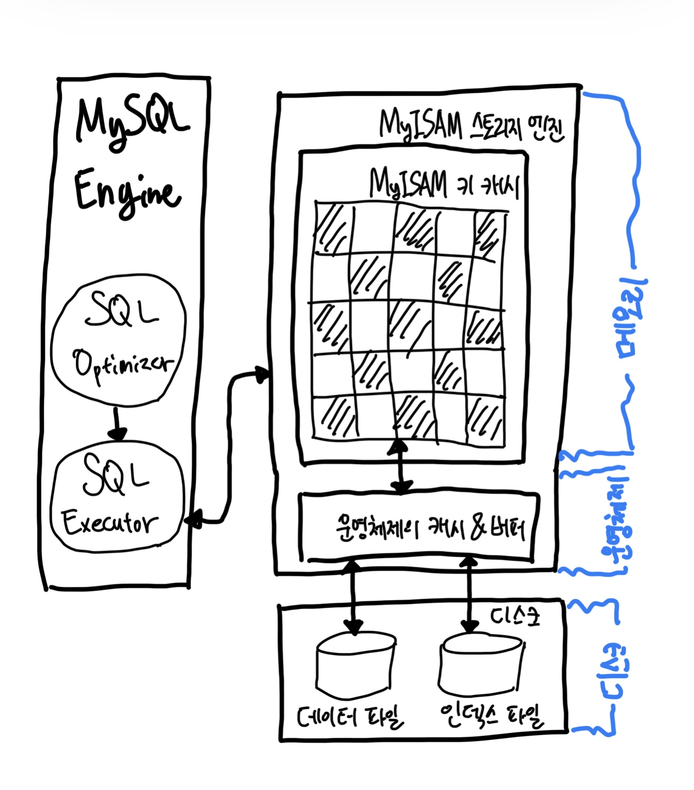

# MyISAM 스토리지 엔진 아키텍처



## 3-1. 키 캐시

- InnoDB의 버퍼 풀과 비슷한 역할을 하는 것이 MyISAM의 키 캐시(Key Cache, 키 버퍼라고도 불림)다.
- 하지만 이름 그대로 MyISAM 키 캐시는 인덱스만을 대상으로 작동하면, 또한 인덱스의 디스크 쓰기 작업에 대해서만 부분적으로 버퍼링 역할을한다.
- 키 캐시의 효율은 아래 수식을 통해 구할 수 있다.

```
Key Cache Hit Rate = 100 - (Key_reads / Key_read_requests * 100)
```

- 아래와 같이 `SHOW GLOBAL STATUS`을 통해 해당 변수들을 확인할 수 있다.

```shell
mysql> SHOW GLOBAL STATUS LIKE 'Key%';
```

- 아래와 같은 형식의 표가 뜬다.

| Variable_name          | Value |
|:-----------------------|:------|
| Key_blocks_not_flushed | 0     |
| Key_blocks_unused      | 0     |
| Key_blocks_used        | 0     |
| Key_read_requests      | 0     |
| Key_reads              | 0     |
| Key_write_requests     | 0     |
| Key_writes             | 0     |

- 메뉴얼에서는 일반적으로 키 캐시를 이용한 쿼리의 비율(히트율, Hit Rate)을 99% 이상으로 유지하라고 권장.
  - 히트율이 99% 미만이라면 키 캐시를 조금 더 크게 설정하는 것이 좋다.

## 3-2. 운영체제의 캐시 및 버퍼

- MyISAM 테이블의 인덱스는 키 캐시를 이용해 디스크를 검색하지 않고도 충분히 빠르게 검색할 수 있다.
- 하지만 MyISAM 테이블의 데이터에 대해서는 디스크로부터의 I/O를 해결해 줄 만한 어떠한 캐시나 버퍼링 기능도 MyISAM 스토리지 엔진은 가지고 있지 않다.
  - 그래서 읽기나 쓰기 작업은 항상 운영체제의 디스크 읽기 도는 쓰기 작업으로 요청될 수밖에 없다.
- 운영체제의 캐시 기능은 InnoDB처럼 데이터의 특성을 알고 전문적으로 캐시나 버퍼링을 하지는 못하지만, 그래도 여전히 없는 것보다는 낫다.
  - 운영체제의 캐시 공간은 남는 메모리를 사용 => 따라서 MyISAM을 사용한다면 운영체제가 사용할 수 있는 캐시 공간을 위해 충분한 메모리를 비워둬야 한다. 
  - 일반적으로 키 캐시는 40% 이상은 넘지 않게 설정하고, 나머지 메모리 공간은 운영체제가 자체적인 파일 시스템을 위한 캐시 공간을 마련할 수 있게 해주는 것이 좋다.

## 3-3. 데이터 파일과 프라이머리 키(인덱스) 구조

- InnoDB 스토리지 엔진을 사용하는 테이블은 프라이머리 키에 의해서 클러스터링되어 저장되는 반면, MyISAM 테이블은 프라이머리 키에 의한 클러스터링 없이 데이터 파일이 `힙 Heap` 공간처럼 활용된다.
- 즉 MyISAM 테이블의 레코드는 프라이머리 키 값과 무관하게 INSERT되는 순서대로 데이터 파일에 저장된다.
  - 모두 ROWID라는 물리적 주솟값을 가지는데, 프라이머리 키와 세컨더리 인덱스는 모두 데이터 파일에 저장된 레코드의 ROWID 값을 포인터로 가진다.
- ROWID는 고정 길이 혹은 가변 길이 방식으로 저장될 수 있다.

<br/>

## 참고자료

- Real MySQL 8.0
