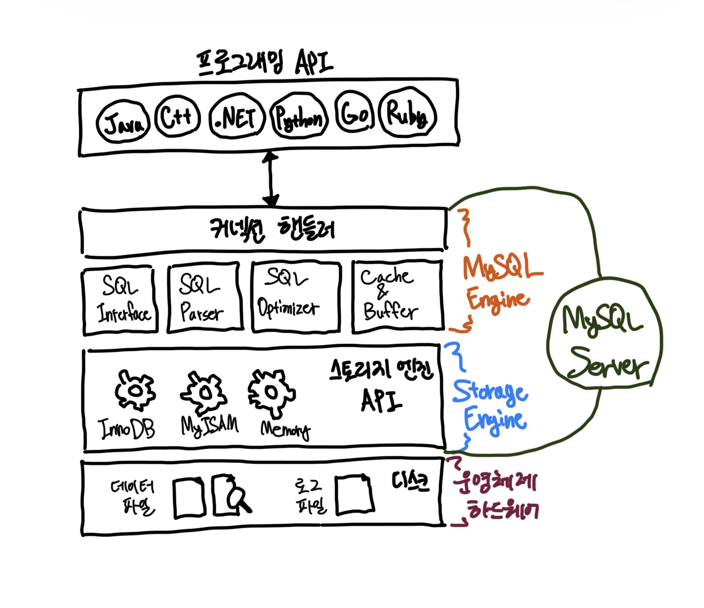
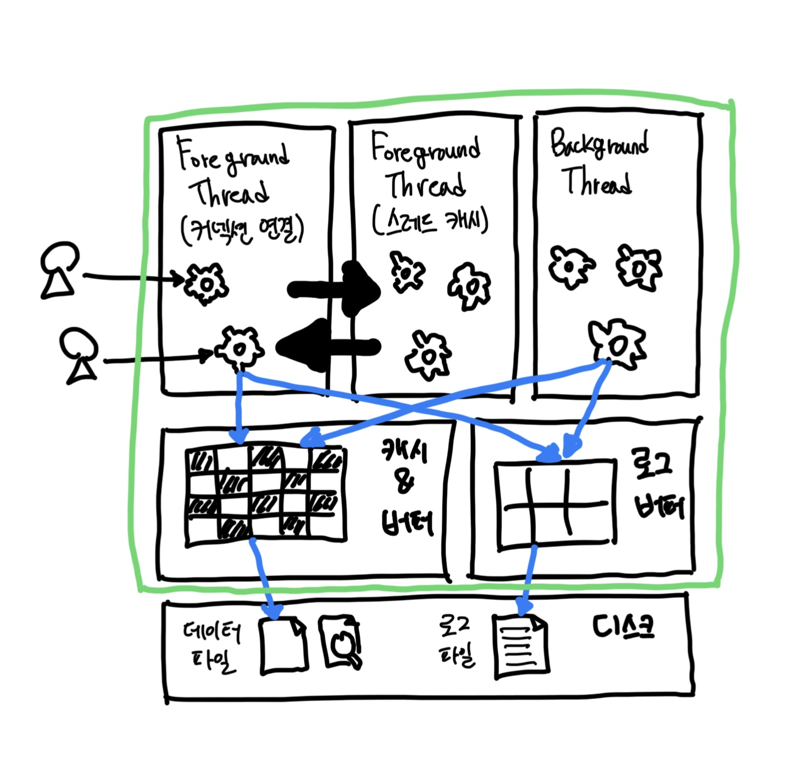
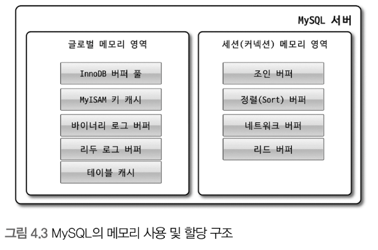
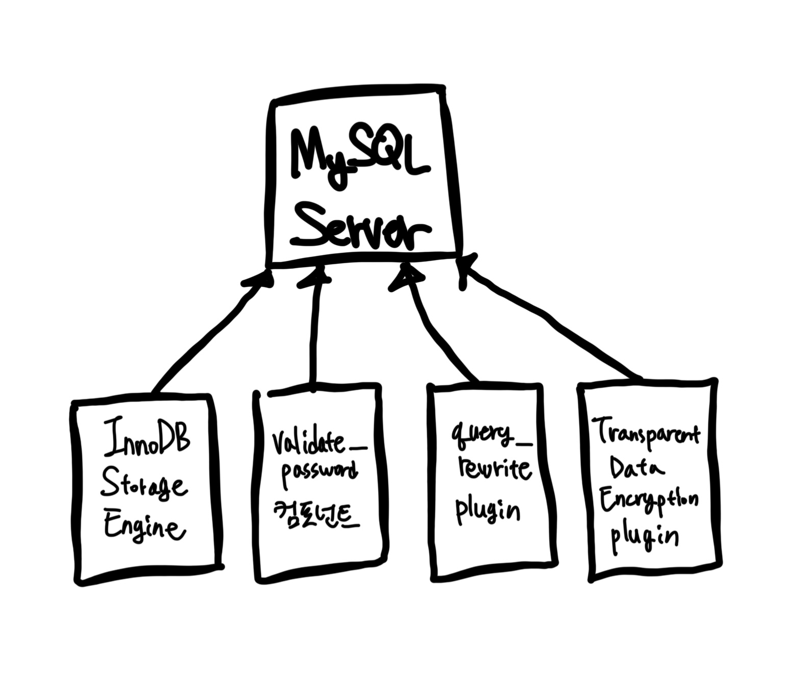
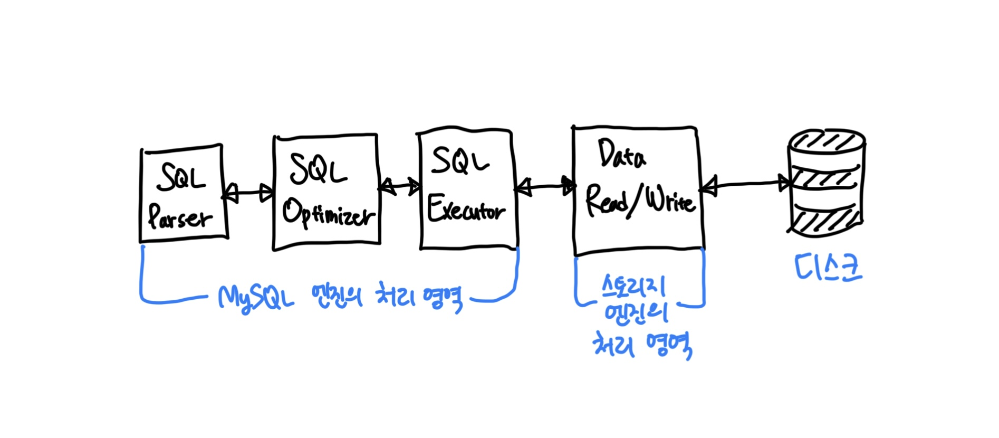

# Architecture

## 1. MySQL 엔진 아키텍처

- MySQL 서버는 다른 DBMS에 비해 구조가 상당히 독특하다. 사용자 입장에서 보면 거의 차이가 느껴지지 않지만 사실 그 내부는 아주 독특하다.

### 1-1. 전체 구조



- MySQL은 일반 상용 RDBMS와 같이 대부분의 프로그래밍 언어로부터 접근 방법을 모두 지원한다.
- MySQL 서버는 MySQL 엔진과 스토리지 엔진으로 구분할 수 있다.
  - `쿼리 파서`나 `옵티마이저` 등과 같은 기능을 `MySQL 엔진`으로 구분하고, `InnoDB`와 `MyISAM` 그리고, `Memory`는 `스토리지 엔진`으로 구분한다.

#### 1-1-1. MySQL 엔진

- 클라이언트로부터의 접속 및 쿼리 요청을 처리하는 `커넥션 핸들러`와 `SQL 파서` 및 `전처리기`, 쿼리의 최적화된 실행을 위한 `옵티마이저` 등이 있다.
- 표준 SQL 문법을 지원하기 때문에 표준 문법에 따라 작성된 쿼리는 타 DBMS와 호환되어 사용할 수 있다.

#### 1-1-2. 스토리지 엔진

- `MySQL 엔진`은 요청된 SQL 문장을 분석하거나 최적화하는 등 DBMS의 **두뇌에 해당하는 처리를 수행**한다.
- 실제 데이터를 디스크 스토리지에 저장하거나 디스크 스토리지로부터 데이터를 읽어오는 부분은 `스토리지 엔진`이다.
- MySQL 서버는 엔진은 하나지만 스토리지 엔진은 여러 개를 동시에 사용할 수 있다.
- 아래와 같이 테이블이 사용할 스토리지 엔진을 지정하면 이후 해당 테이블의 모든 읽기 작업이나 변경 작업은 정의된 스토리지 엔진이 처리한다. 

```sql
mysql> CREATE TABLE table (column1 varchar(10), column2 int) ENGINE=INNOBD;
```

- 각 스토리지 엔진은 성능 향상을 위해 키 캐시(MyISAM 스토리지 엔진)나 InnoDB 버퍼 풀(InnoDB 스토리지 엔진)과 같은 기능을 내장하고 있다.

#### 1-1-3. 핸들러 API

- MySQL 엔진의 쿼리 실행기에서 데이터를 쓰거나 읽어야 할 때는 각 스토리지 엔진에 쓰기 또는 읽기를 요청하는데, 이러한 요청을 `핸들러 Handler` 요청이라고 한다.
  - 여기서 사용되는 API를 `Handler API`라고 한다.
- InnoDB 스토리지 엔진 또한 이 핸들러 API를 이용해 MySQL 엔진과 데이터를 주고받는다.
  - 이 핸들러 API를 통해 얼마나 많은 데이터(레코드) 작업이 있었는지는 `SHOW GLOBAL STATUS LIKE 'Handler%';` 명령으로 확인할 수 있다.

```shell
mysql> SHOW GLOBAL STATUS LIKE 'Handler%';
+----------------------------+---------+
| Variable_name              | Value   |
+----------------------------+---------+
| Handler_commit             | 1531    |
| Handler_delete             | 8       |
| Handler_discover           | 0       |
| Handler_external_lock      | 11567   |
| Handler_mrr_init           | 0       |
| Handler_prepare            | 606     |
| Handler_read_first         | 51      |
| Handler_read_key           | 2674    |
| Handler_read_last          | 0       |
| Handler_read_next          | 4738    |
| Handler_read_prev          | 0       |
| Handler_read_rnd           | 27      |
| Handler_read_rnd_next      | 231     |
| Handler_rollback           | 0       |
| Handler_savepoint          | 0       |
| Handler_savepoint_rollback | 0       |
| Handler_update             | 583     |
| Handler_write              | 4819498 |
+----------------------------+---------+
18 rows in set (0.01 sec)
```

<br>

## 1-2. 스레딩 구조



- MySQL 서버는 프로세스 기반이 아닌 스레드 기반으로 작동하며, 포그라운드(Foreground) 스레드와 백그라운드(Background) 스레드로 구분할 수 있다.
- MySQL 서버에서 실행 중인 스레드 목록은 `performance_schema` 데이터베이스의 `threads` 테이블을 통해 확인할 수 있다.

```sql
mysql> SELECT thread_id, name, type, processlist_user, processlist_host 
       FROM performance_schema.threads 
       ORDER BY type, thread_id;
+-----------+---------------------------------------------+------------+------------------+------------------+
| thread_id | name                                        | type       | processlist_user | processlist_host |
+-----------+---------------------------------------------+------------+------------------+------------------+
|         1 | thread/sql/main                             | BACKGROUND | NULL             | NULL             |
|         2 | thread/mysys/thread_timer_notifier          | BACKGROUND | NULL             | NULL             |
|         4 | thread/innodb/io_ibuf_thread                | BACKGROUND | NULL             | NULL             |
|         5 | thread/innodb/io_log_thread                 | BACKGROUND | NULL             | NULL             |
|         6 | thread/innodb/io_read_thread                | BACKGROUND | NULL             | NULL             |
|         7 | thread/innodb/io_read_thread                | BACKGROUND | NULL             | NULL             |
|         8 | thread/innodb/io_read_thread                | BACKGROUND | NULL             | NULL             |
|         9 | thread/innodb/io_read_thread                | BACKGROUND | NULL             | NULL             |
|        10 | thread/innodb/io_write_thread               | BACKGROUND | NULL             | NULL             |
|        11 | thread/innodb/io_write_thread               | BACKGROUND | NULL             | NULL             |
|        12 | thread/innodb/io_write_thread               | BACKGROUND | NULL             | NULL             |
|        13 | thread/innodb/io_write_thread               | BACKGROUND | NULL             | NULL             |
|        14 | thread/innodb/page_flush_coordinator_thread | BACKGROUND | NULL             | NULL             |
|        15 | thread/innodb/log_checkpointer_thread       | BACKGROUND | NULL             | NULL             |
|        16 | thread/innodb/log_flush_notifier_thread     | BACKGROUND | NULL             | NULL             |
|        17 | thread/innodb/log_flusher_thread            | BACKGROUND | NULL             | NULL             |
|        18 | thread/innodb/log_write_notifier_thread     | BACKGROUND | NULL             | NULL             |
|        19 | thread/innodb/log_writer_thread             | BACKGROUND | NULL             | NULL             |
|        20 | thread/innodb/log_files_governor_thread     | BACKGROUND | NULL             | NULL             |
|        25 | thread/innodb/srv_lock_timeout_thread       | BACKGROUND | NULL             | NULL             |
|        26 | thread/innodb/srv_error_monitor_thread      | BACKGROUND | NULL             | NULL             |
|        27 | thread/innodb/srv_monitor_thread            | BACKGROUND | NULL             | NULL             |
|        28 | thread/innodb/buf_resize_thread             | BACKGROUND | NULL             | NULL             |
|        29 | thread/innodb/srv_master_thread             | BACKGROUND | NULL             | NULL             |
|        30 | thread/innodb/dict_stats_thread             | BACKGROUND | NULL             | NULL             |
|        31 | thread/innodb/fts_optimize_thread           | BACKGROUND | NULL             | NULL             |
|        32 | thread/mysqlx/worker                        | BACKGROUND | NULL             | NULL             |
|        33 | thread/mysqlx/worker                        | BACKGROUND | NULL             | NULL             |
|        34 | thread/mysqlx/acceptor_network              | BACKGROUND | NULL             | NULL             |
|        38 | thread/innodb/buf_dump_thread               | BACKGROUND | NULL             | NULL             |
|        39 | thread/innodb/clone_gtid_thread             | BACKGROUND | NULL             | NULL             |
|        40 | thread/innodb/srv_purge_thread              | BACKGROUND | NULL             | NULL             |
|        41 | thread/innodb/srv_worker_thread             | BACKGROUND | NULL             | NULL             |
|        42 | thread/innodb/srv_worker_thread             | BACKGROUND | NULL             | NULL             |
|        43 | thread/innodb/srv_worker_thread             | BACKGROUND | NULL             | NULL             |
|        45 | thread/sql/signal_handler                   | BACKGROUND | NULL             | NULL             |
|        46 | thread/mysqlx/acceptor_network              | BACKGROUND | NULL             | NULL             |
|        44 | thread/sql/event_scheduler                  | FOREGROUND | event_scheduler  | localhost        |
|        48 | thread/sql/compress_gtid_table              | FOREGROUND | NULL             | NULL             |
|        49 | thread/sql/one_connection                   | FOREGROUND | root             | localhost        |
+-----------+---------------------------------------------+------------+------------------+------------------+
40 rows in set (0.00 sec)
```

- 3개의 포그라운드 스레드를 제외하면 나머지는 모두 백그라운드 스레드임을 확인할 수 있다.
- 그런데 이 중 마지막인 `thread/sql/one_connection` 스레드만 실제 사용자의 요청을 처리하는 포그라운드 스레드다.
- 백그라운드 스레드의 개수는 MySQL 서버의 설정의 내용에 따라 가변적일 수 있다.
- 동일한 이름의 스레드가 2개 이상씩 보이는 것은 MySQL 서버의 설정 내용에 의해 여러 스레드가 동일 작업을 병렬로 처리하는 경우다.

> ##### 참고
> - 여기서 소개하는 스레드 모델은 MySQL 서버가 전통적으로 가지고 있던 스레드 모델. (MySQL Community Edition에서 사용)
> - 엔터프라이즈 에디션과 Percona MySQL 서버에서는 전통적인 스레드 모델뿐만 아니라 `스레드 풀 Thread Pool` 모델을 사용할 수 있다.
> - 스레드 풀과 전통적인 스레드 모델의 가장 큰 차이점은 포그라운드 스레드와 커넥션의 관계다.
> - 전통적인 스레드 모델에서는 커넥션별로 포그라운드 스레드가 하나씩 생성되고 할당된다.
> - 하지만 스레드 풀에서는 커넥션과 포그라운드 스레드는 1대1 관계가 아니라 하나의 스레드가 여러 개의 커넥션 요청을 전담한다.

#### 1-2-1. 포그라운드 스레드(클라이언트 스레드)

- 포그라운드 스레드는 최소한 MySQL 서버에 접속된 클라이언트의 수만큼 존재하면, 주로 각 클라이언트 사용자가 요청하는 쿼리 문장을 처리한다.
- 클라이언트 사용자가 작업을 마치고 커넥션을 종료하면 해당 커넥션을 담당하던 스레드는 다시 스레드 캐시(Thread Cache)로 되돌아간다.
- 스레드 캐시에 일정 개수 이상의 대기 중인 스레드가 있으면 스레드 캐시에 넣지 않고 스레드를 종료시켜 일정 개수의 스레드만 스레드 캐시에 존재하게 한다.
- 스레드 캐시에 유지할 수 있는 최대 스레드 개수는 `thread_cache_size` 시스템 변수로 설정한다.
- 포그라운드 스레드는 데이터 버퍼나 캐시로부터 데이터를 가져오며 버퍼나 캐시에 없는 경우 직접 디스크의 데이터나 인덱스 파일로부터 데이터를 읽어온다.
  - MyISAM 테이블은 디스크 쓰기 작업까지 포그라운드 스레드가 처리하지만!
  - InnoDB 테이블은 데이터 버퍼나 캐시까지만 포그라운드 스레드가 처리하고 나머지 버퍼로부터 디스크까지 기록하는 작업은 백그라운드 스레드가 처리한다.

> ##### 참고
> - MySQL에서 사용자 스레드와 포그라운드 스레드는 똑같은 의미로 사용된다.
> - 클라이언트가 MySQL 서버에 접속하게 되면 MySQL 서버는 그 클라이언트의 요청을 처리해 줄 스레드를 생성해 그 클라이언트에게 할당한다.
> - 이 스레드는 DBMS 앞단에서 사용자와 통신하기 때문에 포그라운드 스레드라고 하며, 사용자가 요청한 작업을 처리하기 때문에 사용자 스레드라고도 한다.

#### 1-2-2. 백그라운드 스레드

- MyISAM에 경우 해당 사항이 거의 없다.
- InnoDB는 아래의 작업이 백그라운드로 처리된다.
  - 인서트 버터(Insert Buffer)를 병합하는 스레드
  - 로그를 디스크로 기록하는 스레드
  - InnoDB 버퍼 풀을 데이터를 디스크에 기록하는 스레드
  - 데이터를 버퍼로 읽어 오는 스레드
  - 잠금이나 데드락을 모니터링하는 스레드
- 여기서 가장 중요한 것은 `로그 스레드 Log Thread`와 버퍼의 데이터를 디스크로 내려쓰는 작업을 수행하는 `쓰기 스레드 Write Thread`이다.
- `MySQL 5.5` 버전부터 데이터 쓰기 스레드와 데이터 읽기 스레드의 개수를 2개 이상 지정할 수 있게 됐으며, `innodb_write_io_threads`와 `innodb_read_io_threads` 시스템 변수로 스레드의 개수를 설정한다.
- InnoDB에서도 데이터를 읽는 작업은 주로 클라이언트 스레드에서 처리되기 때문에 `읽기 스레드`는 많이 설정할 필요가 없지만.
  - `쓰기 스레드`는 아주 많은 작업을 백그라운드로 처리하기 때문에 일반적인 내장 디스크를 사용할 때는 2~4개 정도로 둔다. 
  - DAS나 SAN 같은 스토리지를 사용할 때는 디스크를 최적으로 사용할 수 있을만큼 충분히 설정하는 것이 좋다.
- 사용자의 요청을 처리하는 도중 데이터의 쓰기 작업은 지연(버퍼링)되어 처리될 수 있지만 **데이터의 읽기 작업은 절대 지연될 수 없다.**
  - 예를 들어 SELECT 쿼리를 실행했는데 요청된 SELECT는 10분 뒤에 결과를 돌려주겠다라고 응답하는 DBMS는 없다.

|InnoDB|MyISAM|
|:--:|:--:|
|일반적인 상용 DBMS는 대부분 쓰기 작업을 버퍼링해서 일괄 처리하는 기능이 탑재되어 있으며 InnoDB 또한 이러한 방식으로 처리한다.| 사용자(포그라운드) 스레드가 쓰기 작업까지 함께 처리하도록 설계되어 있기 때문에 기본적으로 쓰기 작업을 버퍼링해서 일괄 처리하는 기능이 없다.|
|`INSERT`, `UPDATE`, `DELETE` 쿼리로 데이터가 변경되는 경우 데이터가 디스크의 데이터 파일로 완전히 저장될 때까지 기다리지 않아도 된다.|일반적인 쿼리는 쓰기 버퍼링 기능을 사용할 수 없다.|

<br>

### 1-3. 메모리 할당 및 사용 구조



- MySQL에서 사용되는 메모리 공간은 크게 글로벌 메모리 영역과 로컬 메모리 영역으로 구분할 수 있다.
- 글로벌 메모리 영역
  - MySQL 서버가 시작되면서 운영체제로부터 할당된다.
  - 요청된 메모리 공간을 100%로 할당해줄 수도 있고, 그 공간만큼 예약해두고 필요할 때 조금씩 할당해주는 경우도 있다.
  - 각 운영체제의 메모리 할당 방식은 상당히 복잡하며, MySQL 서버가 사용하는 정확한 메모리 양을 측정하는 것 또한 쉽지 않다.

#### 1-3-1. 글로벌 메모리 영역

- 일반적으로 클라이언트 스레드의 수와 무관하게 하나의 메모리 공간만 할당한다.
  - 단 필요에 따라 2개 이상의 메모리 공간을 할당받을 수도 있지만 클라이언트의 스레드 수와는 무관하며, 생성된 글로벌 영역이 N개라 해도 모슨 스레드에 의해 공유된다.
- 대표적인 글로벌 메모리 영역
  - 테이블 캐시
  - InnoDB 버퍼 풀
  - InnoDB 어댑티브 해시 인덱스
  - InnoDB 리두 로그 버퍼

#### 1-3-2. 로컬 메모리 영역

- 세션 메모리 영역이라고도 표현하며, MySQL 서버상에 존재하는 클라이언트 스레드가 쿼리를 처리하는 데 사용하는 메모리 영역이다.
  - 클라이언트가 MySQL 서버에 접속하면 MySQL 서버에서는 클라이언트 커넥션으로부터의 요청을 처리하기 위해 스레드를 하나씩 할당하게 되는데, 클라이언트 스레드가 사용하는 메모리 공간이라고 해서 `클라이언트 메모리 영역`이라고도 한다.
  - **클라이언트와 MySQL 서버와의 커넥션을 세션**이라고 하기 때문에 `로컬 메모리 영역`을 `세션 메모리 영역`이라고도 표현한다.
- 각 클라이언트 스레드별로 독립적으로 할당되며 절대 공유되어 사용되지 않는다면 특징이 있다.
  - 일반적으로 글로벌 메모리 영역의 크기는 주의해서 설정하지만 소트 버퍼와 같은 로컬 메모리 영역은 크게 신경 쓰지 않고 설정하는데, 최악의 경우에는 MySQL 서버가 메모리 부족으로 멈춰버릴 수 있으므로 적절한 메모리 공간을 설정하는 것이 중요하다.
- 한 가지 중요한 특징! 각 쿼리의 용도별로 필요할 때만 공간이 할당되고 필요하지 않은 경우에는 MySQL이 메모리 공간을 할당조차도 하지 않을 수도 있다는 점이다.
  - 대표적으로 소트 버퍼나 조인 버퍼.
- 로컬 메모리 공간은 커넥션이 열려 있는 동안 계속 할당된 상태로 남아 있는 공간도 있고 그렇지 않고 쿼리를 실행하는 순간에만 할당했다가 다시 해제하는 공간도 있다.
- 대표적인 로컬 메모리 영역
  - 정렬 버퍼 Sort Buffer
  - 조인 버퍼
  - 바이너리 로그 캐시
  - 네트워크 버퍼

### 1-4. 플러그인 스토리지 엔진 모델



- 플러그인 모델은 MySQL 독특한 구조 중 하나다.
  - 플러그인해서 사용할 수 있는 것이 스토리지 엔진만 있는 것은 아니다.
  - 전문 검색 엔진을 위한 검색어 파서(인덱싱할 키워드를 분리해내는 작업)도 플러그인 형태로 개발해서 사용할 수 있으며,
  - 사용자 인증을 위한 Native Authentication과 Caching SHA-2 Authentication 등도 모두 플러그인으로 구현되어 제공된다.
- 기본적으로 많은 스토리지 엔진을 가지고 있지만. 세상의 수많은 사용자의 요구 조건을 만족시키기 위해 기본적으로 제공되는 스토리지 엔진 이외에 부가적인 기능을 더 제공하는 스토리지 엔진이 필요할 수 있다.
  - 이러한 요건을 기초로 다른 전문 개발 회사 또는 사용자가 직접 스토리지 엔진을 개발하는 것도 가능하다.



- 거의 대부분의 작업이 MySQL 엔진에서 처리되고, 마지막 '데이터 읽기/쓰기' 작업만 스토리지 엔진에 의해 처리된다.
  - 사용자가 새로운 용도의 스토리지 엔진을 만든다 하더라도 DBMS 전체 기능이 아닌 일부분의 기능만 수행하는 엔진을 작성하게 된다는 의미다.
- 그리고 MySQL을 사용하다 보면 `핸들러 Handler`라는 단어를 자주 접하게 될 것이다.
  - 핸들러라는 단어는 MySQL 서버의 소스코드로부터 넘어온 표현이다.
  - 프로그래밍 언어에서 어떤 기능을 호출하기 위해 사용하는 운전대와 같은 역할을 하는 객체를 핸들러(또는 핸들러 객체)라고 표현한다. (자동차 핸들과 비슷!)
  - MySQL 서버에서 MySQL 엔진은 사람 역할을 하고 각 스토리지 엔진은 자동차 역할을 하는데, MySQL 엔진이 스토리지 엔진을 조정하기 위해 핸들러라는 것을 사용하게 된다.
- MySQL 엔진이 각 스토리지 엔진에게 데이터를 읽어오거나 저장하도록 명령하려면 반드시 핸들러를 통해야 한다는 점을 기억하자.
  - MySQL 상태 변수 중에 `Handler_`로 시작하는 상태 변수는 'MySQL 엔진이 각 스토리지 엔진에게 보낸 명령의 횟수를 의미하는 변수'라고 이해하면 된다.
- 실질적인 `GROUP BY`나 `ORDER BY` 등 복잡한 처리는 스토리지 엔진 영역이 아니라 MySQL 엔진의 처리 영역인 '쿼리 실행기'에서 처리된다.
- 여기서 중요한 것은 '하나의 쿼리 작업은 여러 하위 작업으로 나뉘는데, 각 하위 작업이 MySQL 엔진 영역에서 처리되는지 아니면 스토리지 영역에서 처리되는지 구분할 줄 알아야 한다'는 점이다.
  - 아래는 MySQL 서버에서 지원되는 스토리지 엔진이다.

```shell
mysql> SHOW ENGINES;
+--------------------+---------+----------------------------------------------------------------+--------------+------+------------+
| Engine             | Support | Comment                                                        | Transactions | XA   | Savepoints |
+--------------------+---------+----------------------------------------------------------------+--------------+------+------------+
| ndbcluster         | NO      | Clustered, fault-tolerant tables                               | NULL         | NULL | NULL       |
| MEMORY             | YES     | Hash based, stored in memory, useful for temporary tables      | NO           | NO   | NO         |
| InnoDB             | DEFAULT | Supports transactions, row-level locking, and foreign keys     | YES          | YES  | YES        |
| PERFORMANCE_SCHEMA | YES     | Performance Schema                                             | NO           | NO   | NO         |
| MyISAM             | YES     | MyISAM storage engine                                          | NO           | NO   | NO         |
| FEDERATED          | NO      | Federated MySQL storage engine                                 | NULL         | NULL | NULL       |
| ndbinfo            | NO      | MySQL Cluster system information storage engine                | NULL         | NULL | NULL       |
| MRG_MYISAM         | YES     | Collection of identical MyISAM tables                          | NO           | NO   | NO         |
| BLACKHOLE          | YES     | /dev/null storage engine (anything you write to it disappears) | NO           | NO   | NO         |
| CSV                | YES     | CSV storage engine                                             | NO           | NO   | NO         |
| ARCHIVE            | YES     | Archive storage engine                                         | NO           | NO   | NO         |
+--------------------+---------+----------------------------------------------------------------+--------------+------+------------+
11 rows in set (0.00 sec)
```

- Support 칼럼에 표시될 수 있는 값은 4가지다.
  - `YES`: MySQL 서버에 해당 스토리지 엔진이 포함돼 있고, 사용 가능으로 활성화
  - `DEFAULT`: `YES`와 동일한 생태. 피수 스토리지 엔진임으로 의미. => 없으면 실행이 안 된다.
  - `NO`: 현재 MySQL 서버에 포함되지 않았음을 의미
  - `DISABLED`: 현재 MySQL 서버에는 포함됐지만 파라미터에 의해 비활성화된 상태.

- 포함되지 않은 스토리지 엔진을 사용하려면 MySQL 서버를 다시 빌드(컴파일)해야 한다.
  - 하지만 MySQL 서버가 적절히 준비만 돼 있다면 플러그인 형태로 빌드된 스토리지 엔진 라이브러리를 다운로드해서 끼워 넣기만 하면 사용할 수 있다.
  - 또한 플러그인 형태의 스토리지 엔진은 손쉽게 업그레이드할 수 있다.
- `SHOW PLUGINS` 명령으로 스토리지 엔진뿐 아니라 인증 및 전문 검색용 파서와 같은 플러그인도 확인할 수 있다.

```shell
mysql> SHOW PLUGINS;
+----------------------------------+----------+--------------------+---------+---------+
| Name                             | Status   | Type               | Library | License |
+----------------------------------+----------+--------------------+---------+---------+
| binlog                           | ACTIVE   | STORAGE ENGINE     | NULL    | GPL     |
| mysql_native_password            | ACTIVE   | AUTHENTICATION     | NULL    | GPL     |
| sha256_password                  | ACTIVE   | AUTHENTICATION     | NULL    | GPL     |
| caching_sha2_password            | ACTIVE   | AUTHENTICATION     | NULL    | GPL     |
| sha2_cache_cleaner               | ACTIVE   | AUDIT              | NULL    | GPL     |
| daemon_keyring_proxy_plugin      | ACTIVE   | DAEMON             | NULL    | GPL     |
| CSV                              | ACTIVE   | STORAGE ENGINE     | NULL    | GPL     |
| MEMORY                           | ACTIVE   | STORAGE ENGINE     | NULL    | GPL     |
| InnoDB                           | ACTIVE   | STORAGE ENGINE     | NULL    | GPL     |
| INNODB_TRX                       | ACTIVE   | INFORMATION SCHEMA | NULL    | GPL     |
| INNODB_CMP                       | ACTIVE   | INFORMATION SCHEMA | NULL    | GPL     |
| INNODB_CMP_RESET                 | ACTIVE   | INFORMATION SCHEMA | NULL    | GPL     |
| INNODB_CMPMEM                    | ACTIVE   | INFORMATION SCHEMA | NULL    | GPL     |
| INNODB_CMPMEM_RESET              | ACTIVE   | INFORMATION SCHEMA | NULL    | GPL     |
| INNODB_CMP_PER_INDEX             | ACTIVE   | INFORMATION SCHEMA | NULL    | GPL     |
| INNODB_CMP_PER_INDEX_RESET       | ACTIVE   | INFORMATION SCHEMA | NULL    | GPL     |
| INNODB_BUFFER_PAGE               | ACTIVE   | INFORMATION SCHEMA | NULL    | GPL     |
| INNODB_BUFFER_PAGE_LRU           | ACTIVE   | INFORMATION SCHEMA | NULL    | GPL     |
| INNODB_BUFFER_POOL_STATS         | ACTIVE   | INFORMATION SCHEMA | NULL    | GPL     |
| INNODB_TEMP_TABLE_INFO           | ACTIVE   | INFORMATION SCHEMA | NULL    | GPL     |
| INNODB_METRICS                   | ACTIVE   | INFORMATION SCHEMA | NULL    | GPL     |
| INNODB_FT_DEFAULT_STOPWORD       | ACTIVE   | INFORMATION SCHEMA | NULL    | GPL     |
| INNODB_FT_DELETED                | ACTIVE   | INFORMATION SCHEMA | NULL    | GPL     |
| INNODB_FT_BEING_DELETED          | ACTIVE   | INFORMATION SCHEMA | NULL    | GPL     |
| INNODB_FT_CONFIG                 | ACTIVE   | INFORMATION SCHEMA | NULL    | GPL     |
| INNODB_FT_INDEX_CACHE            | ACTIVE   | INFORMATION SCHEMA | NULL    | GPL     |
| INNODB_FT_INDEX_TABLE            | ACTIVE   | INFORMATION SCHEMA | NULL    | GPL     |
| INNODB_TABLES                    | ACTIVE   | INFORMATION SCHEMA | NULL    | GPL     |
| INNODB_TABLESTATS                | ACTIVE   | INFORMATION SCHEMA | NULL    | GPL     |
| INNODB_INDEXES                   | ACTIVE   | INFORMATION SCHEMA | NULL    | GPL     |
| INNODB_TABLESPACES               | ACTIVE   | INFORMATION SCHEMA | NULL    | GPL     |
| INNODB_COLUMNS                   | ACTIVE   | INFORMATION SCHEMA | NULL    | GPL     |
| INNODB_VIRTUAL                   | ACTIVE   | INFORMATION SCHEMA | NULL    | GPL     |
| INNODB_CACHED_INDEXES            | ACTIVE   | INFORMATION SCHEMA | NULL    | GPL     |
| INNODB_SESSION_TEMP_TABLESPACES  | ACTIVE   | INFORMATION SCHEMA | NULL    | GPL     |
| MyISAM                           | ACTIVE   | STORAGE ENGINE     | NULL    | GPL     |
| MRG_MYISAM                       | ACTIVE   | STORAGE ENGINE     | NULL    | GPL     |
| PERFORMANCE_SCHEMA               | ACTIVE   | STORAGE ENGINE     | NULL    | GPL     |
| TempTable                        | ACTIVE   | STORAGE ENGINE     | NULL    | GPL     |
| ARCHIVE                          | ACTIVE   | STORAGE ENGINE     | NULL    | GPL     |
| BLACKHOLE                        | ACTIVE   | STORAGE ENGINE     | NULL    | GPL     |
| FEDERATED                        | DISABLED | STORAGE ENGINE     | NULL    | GPL     |
| ndbcluster                       | DISABLED | STORAGE ENGINE     | NULL    | GPL     |
| ndbinfo                          | DISABLED | STORAGE ENGINE     | NULL    | GPL     |
| ndb_transid_mysql_connection_map | DISABLED | INFORMATION SCHEMA | NULL    | GPL     |
| ngram                            | ACTIVE   | FTPARSER           | NULL    | GPL     |
| mysqlx_cache_cleaner             | ACTIVE   | AUDIT              | NULL    | GPL     |
| mysqlx                           | ACTIVE   | DAEMON             | NULL    | GPL     |
+----------------------------------+----------+--------------------+---------+---------+
48 rows in set (0.01 sec)
```

- MySQL 서버에서는 스토리지 엔진뿐만 아니라 다양한 기능을 플러그인 형태로 지원한다.
  - 인증이나 전문 검색 파서 또는 쿼리 재삭성과 같은 플러그인이 있으며, 비밀번호 검증과 커넥션 제어 등에 관련된 다양한 플러그인이 제공된다.
  - MySQL 서버의 기능을 커스텀하게 확장할 수 있게 플러그인 API가 메뉴얼에 공개돼 있으므로 기존 MySQL 서버에서 제공하던 기능들을 확장하거나 완전히 새로운 기능들을 플러그인을 이용해 구현할 수도 있다.

### 1-5. 컴포넌트

- MySQL 8.0부터 기존의 플러그인 아키텍처를 대체하기 위해 컴포넌트 아키텍처가 지원된다.
- MySQL 서버의 플러그인은 몇 가지 단점이 있는데, 컴포넌트는 이러한 단점들을 보환해서 구현됐다.
  - 플러그인은 오직 MySQL 서버와 인터페이스할 수 있고, 플러그인끼리는 통신할 수 없음.
  - 플러그인은 MySQL 서버의 변수나 함수를 직접 호출하기 때문에 안전하지 않음(캡슐화 안 됨)
  - 플러그인은 상호 의존 관계를 설정할 수 없어서 초기화 어려움.
- MySQL 5.7 버전까지는 비밀번호 검증 기능이 플러그인 형태로 제공됐지만 MySQL 8.0의 비밀번호 검증 기능은 컴포넌트로 개선됐다.
  - 컴포넌트의 간단한 사용법을 비밀번호 검증 기능 컴포넌트를 통해 살펴보자.

```shell
mysql> INSTALL COMPONENT 'file://component_validate_password';
Query OK, 0 rows affected (0.02 sec)

mysql> SELECT * FROM mysql.component;
+--------------+--------------------+------------------------------------+
| component_id | component_group_id | component_urn                      |
+--------------+--------------------+------------------------------------+
|            1 |                  1 | file://component_validate_password |
+--------------+--------------------+------------------------------------+
1 row in set (0.00 sec)
```

### 1-6. 쿼리 실행 구조


## 참고자료

- Real MySQL 8.0
