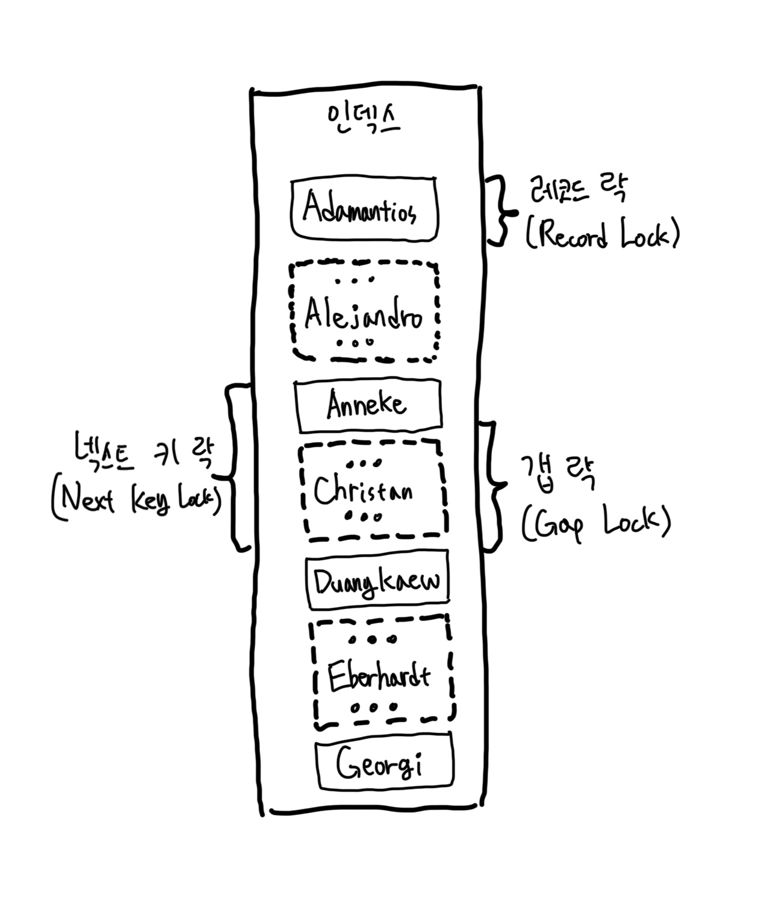

# 트랜잭션과 잠금

- 작업의 완전성을 보장해주는 것이다.
  - 즉 논리적인 작업 섯을 모두 완벽하게 처리하거나, 처리하지 못할 경우에는 원 상태로 복구해서 작업의 일부만 적용되는 현상(Partial update)이 발생하지 않게 만들어주는 기능이다.
- 잠금과 트랜잭션은 서로 비슷한 개념 같지만 사실 잠금은 동시성을 제어하기 위한 기능이고 트랜잭션은 데이터의 정합성을 보장하기 위한 기능이다.
  - 격리 수준이라는 것은 하나의 트랜잭션 내에서 또는 여러 트랜잭션 간의 작업 내용을 어떻게 공유하고 차단할 것인지를 결정하는 레벨이다.
- 잠금은 여러 커넥션에서 동시에 동일한 자원(레코드나 테이블)을 요청할 경우 순서대로 한 시점에는 하나의 커넥션만 변경할 수 있게 해주는 역할을 한다.

## 1. 트랜잭션

- InnoDB 스토리지 엔진에서 제공하는 기능 (MyIsam과 MEMORY와 같은 엔진에서는 트랜재션을 지원하지 않는다.)

### 1-1. MySQL에서의 트랜잭션

- 트랜잭션은 꼭 여러 개의 변경 작업을 수행하는 쿼리가 조합됐을 때만 의미 있는 개념은 아니다.
  - 하나의 논리적인 작업 셋에 하나 이상의 쿼리가 있을 때, 작업 셋 자체가 100% 적용되거나 아무것도 적용되지 않아야 함을 보장해주는 것이다.
- 어떤 사용자는 트랜잭션을 상당히 골치 아픈 기능쯤으로 생각하지만 트랜잭션이란 그만큼 애플리케이션 개발에서 고민해야 할 문제를 줄여주는 아주 필수적인 DBMS의 기능이라는 점을 기억해야 한다.
  - 부분 업데이트 현상이 발생하면 직접 데이터 재처리 작업을 해야할 수도 있다.
  - MyISAM에서는 `IF-ELSE`를 덕지덕지 붙여서 로직을 작성해야 했다.

### 1-2. 주의사항

- 트랜잭션은 DBMS의 커넥션과 동일하게 꼭 필요한 최소의 코드에만 적용되는 것이 좋다. (트랜잭션의 범위를 최소화)
  - 프로그램 코드에서 트랜잭션의 범위를 최소화하라는 의미다.
- 각 단위 프로그램이 커넥션을 소유하는 시간이 길어질수록 사용 가능한 여유 커넥션 개수는 줄어들 것이다. 
  - 그리고 어느 순간에는 각 단위 프로그램에서 커넥션을 가져가기 위해 기다려야 하는 상황이 발생할 수 있다.
  - 특히, 메일 발송과 같이 네트워크를 통해 원격 서버와 통신하는 등과 같은 작업은 어떻게 해서든 DBMS의 트랜잭션 내에서 제거하는 것이 좋다. 만약 통신할 수 없는 상황이 발생한다면?? DBMS 서버까지 위험해지는 상황이 발생한다.
- 프로그램의 코드에서 라인 수는 한두 줄이라고 하더라도 네트워크 작업이 있는 경우에는 반드시 트랜잭션에서 배제해야 한다.

<br/>

## 2. MySQL 엔진의 잠금

- MySQL에서 사용되는 잠금은 크게 스토리지 엔진 레벨과 MySQL 엔진 레벨로 나눌 수 있다.
  - 여기서 MySQL 엔진 레벨이란 스토리지 엔진을 제외한 나머지 부분이라고 생각하면 된다.
- MySQL 엔진 레벨의 잠금은 모든 스토리지 엔진에 영향을 미치지만, 스토리지 엔진 레벨의 잠금은 스토리지 엔진 간 상호 영향을 미치지 않는다.

### 2-1. 글로벌 락

- 글로벌 락 Global Lock
- `FLUSH TABLES WITH READ LOCK` 명령으로 획득할 수 있다.
- MySQL에서 제공하는 잠금 가운데 가장 범위가 넓다.
- 한 세션에서 글로벌 락을 획득하면 다른 세션에서 `SELECT`를 제외한 개부분의 DML, DDL 문장 실행 시 글로벌 락이 해제될 때 까지 대기해야 한다.
- MySQL 서버 전체에 영향을 미치며 작업 대상 테이블이나 데이터베이스가 다르더라도 동일한 영향을 준다.

> #### 주의
> - 글로벌 락을 거는 `FLUSH TABLES WITH READ LOCK` 명령은 실행과 동시에 MySQL 서버에 존재하는 모든 테이블을 닫고 잠금을 건다.
> - 최악의 케이스로 실행되면 MySQL 서버의 모든 테이블에 대한 INSERT, UPDATE, DELETE 쿼리가 아주 오랜 시간 동안 실행되지 못하고 기다릴 수도 있다.
> - 따라서 웹 서비스용으로 사용되는 MySQL 서버에서는 가급적 사용하지 않는 것이 좋다.
> - 또한 mysqldump 같은 백업 프로그램은 우리가 알지 못하는 사이에 이 명령을 내부적으로 실행하고 백업할 때도 있다. => 사용되는 옵션에 따라 어떤 잠금을 걸게 되는지 자세히 확인해보는 것이 좋다.

- InnoDB 스토리지 엔진에서는 트랜잭션을 지원하기 때문에 일관된 데이터 상태를 유지하기 위해 글로벌 락을 통한 데이터 변경 작업 잠금을 할 필요가 없다.
  - 조금 더 가벼운 글로벌 락의 필요성이 생겼다. 
  - 그래서 Xtrabackup이나 Enterprise Backup과 같은 백업 툴들의 안정적인 실행을 위해 백업 락이 도입됐다.

```shell
mysql> LOCK INSTANCE FOR BACKUP;
-- // 백업 실행
mysql> UNLOCK INSTANCE;
```

- 특정 세션에서 백업 락을 획득하면 모든 세션에서 다음과 같이 테이블의 스키마나 사용자의 인증 관련 정보를 변경할 수 없게 된다.
1. 데이터베이스 및 테이블 등 모든 객체 생성 및 변경, 삭제
2. `REPAIR TABLE`과 `OPTIMIZE TABLE` 명령
3. 사용자 관리 및 비밀번호 변경

- 하지만 백업 락은 일반적인 테이블의 데이터 변경은 허용된다.
- 일반적인 MySQL 서버의 구성은 `소스 서버 Source Server`와 `레플리카 서버 Replica Server`로 구성되는데, 주로 백업은 레플리카 서버에서 실행된다.
  - 레플리카 서버에서 백업을 실행하는 도중에 소스 서버에 문제가 생기면 레플리카 서버의 데이터가 최신 상태가 될 때까지 서비스를 멈춰야 할 수도 있다.
  - Xtrabackup이나 Enterprise Backup 툴이 실행되는 도중 스키마 변경이 실행되면 백업은 실패한다.

### 2-2. 테이블 락 Table Lock

- 개별 테이블 단위로 설정되는 잠금이며, 명시적 or 묵시적으로 락을 획득할 수 있다.
- 명시적 획득 : `LOCK TABLES table_name [READ | WRITE]`
  - 명시적으로 얻은 락은 명시적으로 반납해줘야 한다. (`UNLOCK TABLES`)
  - 글로벌 락과 마찬가지로 온라인 작업에 많은 영향을 미치기 때문에 특별한 상황이 아니면 사용할 필요가 없다.
- 묵시적 획득 : MyISAM 혹은 MEMORY 테이블 데이터 변경 쿼리 실행 시 발생
  - 쿼리가 실행되는 동안 자동으로 획득했다가 완료되면 자동으로 해제함
- InnoDB는 기본적으로 레코드 기반 잠금을 사용하기 때문에 단순 데이터 변경 시에는 묵시적 테이블 락이 발생하지 않는다. 
  - 더 정확히는, 테이블 락이 발생하긴 하지만 DML 쿼리에서는 무시하고 DDL의 경우에만 발생한다.

### 2-3. 사용자의 필요에 맞게 사용할 수 있는 네임드 락(Named Lock)

- `GET_LOCK()` 함수를 통해 임의의 문자열에 대해 잠금을 설정할 수 있다.
- 테이블이나 레코드 또는 `AUTO_INCREMENT`와 같은 데이터베이스 객체가 대상이 아니라는 것이 특징이다.
- 네임드 락은 단순히 사용자가 지정한 문자열에 대해 획득하고 반납하는 잠금이다.
  - 자주 사용되지는 않는다.
  - ex) DB Server 1대와 5대의 Web Server. 5대의 Web Server가 어떤 정보를 동기화해야 하는 요건처럼 여러 클라이언트 가 상호 동기화를 처리해야 할 때 네임드 락을 이용하면 쉽게 해결할 수 있다.

```shell
# "mylock"이라는 문자열에 대해 잠금을 획득
# 이미 잠금을 사용 중이면 2초 동안만 대기한다. (2초 이후 자동 잠금 해제됨)
mysql> SELECT GET_LOCK('mylock', 2);

# "mylock"이라흔 문자열에 대해 잠금이 설정돼 있는지 확인
mysql> SELECT IS_FREE_LOCK('mylock');

# "mylock"이라는 문자열에 대해 획득했던 잠금을 반납(해제)한다.
mysql> SELECT RELEASE_LOCK('mylock');
```

- 많은 레코드에 대해 복잡한 요건으로 레코드를 변경하는 트랜잭션에 유용하게 사용할 수 있다.
- 배치 프로그램처럼 한꺼번 많은 레코드를 변경하는 쿼리는 자주 데드락의 원인이 되곤 한다.
  - 실행 시간을 분산하거나 프로그램의 코드를 수정해서 데드락을 최소화할 수는 있지만, 이는 간단한 방법이 아니며 완전한 해결책이 될 수도 없다.
  - 이런 경우 동일 데이터를 변경하거나 참조하는 프로그램끼리 분류해서 네임드 락을 걸고 쿼리를 실행하면 아주 간단히 해결할 수 있다.

### 2-4. 테이블의 구조를 잠그는 메타데이터 락(Metadata Lock)

- 데이터베이스 객체(Table, View 등)의 이름이나 구조를 변경하는 경우에 획득하는 잠금이다.
- 명시적으로 획득하거나 해제할 수 있는 것이 아니고 `RENAME TALBE tab_a TO tab_b` 같이 테이블의 이름을 변경하는 경우 자동으로 획득하는 잠금이다.
  - `RENAME TABLE` 명령의 경우 원본 이름과 변경될 이름 두 개 모두 한꺼번에 잠금을 설정한다.
- 아래와 같이 실행하면 "Table not found rank"같은 상황이 발생하지 않는다.

```shell
mysql> RENAME TABLE rank TO rank_backup, rank_new TO rank;
```

- 하지만 나눠서 실행하면 아주 짧은 시간이지만 rank 테이블이 존재하지 않는 순간이 생기며, 그 순간에 실행되는 쿼리는 "Table not found rank" 오류를 발생시킨다.

```shell
mysql> RENAME TABLE rank TO rank_backup;
mysql> RENAME TABLE rank_new TO rank;
```

## 3. InnoDB 스토리지 엔진 잠금

- 스토리지 엔진 레벨에서의 잠금은 스토리지 엔진 간 상호 영향을 미치지 않는다.
- InnoDB 엔진 내부에서 레코드 기반의 잠금 방식을 탑재하고 있다. (덕분에 MyISAM보다 훨씬 뛰어난 동시성 처리가 가능)
  - 하지만 이원화된 잠금 처리 탓에 InnoDB 스토리지 엔진에서 사용되는 잠금에 대한 정보는 MySQL 명령을 이용해 접근하기가 상당히 까다롭다.
- 따라서 최근 버전에서는 InnoDB의 트랜잭션 잠금, 그리고 잠금 대기 중인 트랜잭션의 목록을 조회할 수 있는 방법이 도입됐다.
  - MySQL 서버의 `information_schema` 데이터베이스에 존재하면 `INNODB_TRX`, `INNODB_LOCKS`, `INNODB_LOCK_WAITS`라는 테이블을 조인해서 조회하면 현재 어떤 트랜잭션이 어떤 잠금을 대기하고 있고 해당 잠금을 어느 트랜잭션이 가지고 있는지 확인할 수 있으며, 도한 장시간 잠금을 가지고 있는 클라이언트를 찾아서 종료시킬 수도 있다.
  - 그리고 조금씩 업그레이드되면서 InnoDB의 중요도가 높아졌고, InnoDB의 잠금에 대한 모니터링도 강화되면서 `Performance Schema`를 이용해 InnoDB 스토리지 엔진의 내부 잠금(세마포어)에 대한 모니터링 방법도 추가됐다.

### 3-1. InnoDB 스토리지 엔진의 잠금

- InnoDB 스토리지 엔진은 레코드 기반의 잠금 기능을 제공하며, 잠금 정보가 상당히 작은 공간으로 관리되기 때문에 레코드 락이 페이지 락으로, 또는 테이블 락으로 레벨업되는 경우(락 에스컬레이션)는 없다.
- 일반 상용 DBMS와는 조금 다르게 InnoDB 스토리지 엔진에서는 레코드 락뿐 아니라 레코드와 레코드 사이의 간격을 잠그는 `갭락 GAP Lock`이라는 것이 존재하는 데, 아래 그림과 같다.



- 점선의 레코드는 실제 존재하지 않는 레코드를 가정한 것이다.

#### 3-1-1. 레코드 락 Record Lock

- 레코드 자체만을 잠그는 것을 말한다. 다른 상용 DBMS의 레코드 락과 동일한 역할을 한다.
- 한 가지 중요한 차이는 InnoDB 스토리지 엔진은 레코드 자체가 아니라 인덱스의 레코드를 잠근다는 특징이 있다.
- 인덱스가 하나도 없는 테이블이더라도 내부적으로 자동 생성된 클러스터 인덱스를 이용해 잠금을 설정한다.
  - 레코드를 자체를 잠그느냐, 아니면 인덱스를 잠그느냐는 상당히 크고 중요한 차이를 만들어낸다.
- InnoDB에서는 대부분 보조 인덱스를 이용한 변경 작업은 이어서 설명할 넥스트 키 락 또는 갭락을 사용하지만, 프라이머리 키 또는 유니크 인덱스에 의한 변경 작업에서는 갭에 대해서는 잠그지 않고 레코드 자체에 대해서만 락을 건다.

#### 3-1-2. 갭 락 Gap Lock

- 다른 DBMS와의 차이점이다.
- 레코드 자체가 아니라 레코드와 인접한 레코드 사이의 간격만 잠그는 것을 의미한다.
- 레코드와 레코드 사이에 새로운 레코드가 생성(`INSERT`)되는 것을 제어하는 것이다.
  - 그 자체보다는 넥스트 키 락의 일부로 자주 사용된다.

#### 3-1-3. 넥스트 키 락 Next Key Lock

- `레코드 락`과 `갭 락`을 합쳐 놓은 잠금 형태이다.
- STATEMENT 포맷의 바이너리 로그를 사용하는 MySQL 서버에서는 REPEATABLE READ 격리 수준을 사용해야 한다.
  - `innodb_locks_unsafe_for_binlog` 시스템 변수가 비활성화되면(0으로 설정) 변경을 위해 검색하는 레코드에는 넥스트 키 락 방식으로 잠금이 걸린다.
- 레코드 락과 갭 락은 바이너리 로그에 기록되는 쿼리가 레플리카 서버에서 실행될 때 소스 서버에서 만들어 낸 결과와 동일한 결과를 만들어내도록 보장하는 것이 주목적이다.
- 그런데 넥스트 키 락과 갭 락으로 인해 데드락이 발생하거나 다른 트랜잭션을 기다리게 하는 일이 자주 발생하기에 바이너리 로그 포맷을 ROW 형태로 바꿔서 넥스트 키 락이나 갭락이 줄이는 것이 좋다.
- 주로 Phantom Read 현상을 방지하는 데 유용하다.

#### 3-1-4. 자동 증가 락 Auto Increment Lock

- MySQL은 자동 증가하는 숫자 값을 추출하기 위해 AUTO_INCREMENT라는 컬럼 속성을 제공한다.
- 만약 동시에 여러 레코드가 INSERT되는 경우, 각 레코드는 중복되지 않고 저장된 순서대로 증가하는 일련번호를 가져야한다. 
  - 이를 위해 InnoDB 스토리지 엔진에서는 내부적으로 AUTO_INCREMENT LOCK이라는 테이블 수준의 잠금을 운용한다.
- `AUTO_INCREMENT` 락은 `INSERT`와 `REPLACE` 쿼리 문장과 같이 새로운 레코드를 저장하는 쿼리에서만 필요하며, UPDATE나 DELETE 등의 쿼리에서는 걸리지 않는다.
  - 다른 잠금과는 달리 `AUTO_INCREMENT`는 트랜잭션과 관계없이 INSERT나 REPLACE 문장에서 `AUTO_INCREMENT` 값을 가져오는 순간만 락이 걸렸다가 즉시 해제된다.
- 명시적으로 획득하거나 해제할 방법이 없다. 
- 아주 짧은 시간 동안 걸렸다가 풀리기 때문에 대부분의 경우 문제가 되지 않는다.

<br/>

### 3-2. 인덱스와 잠금

- InnoDB의 잠금과 인덱스는 상당히 중요한 연관 관계가 있다.
- InnoDB의 잠금은 레코드를 잠그는 것이 아니라 인덱스를 잠그는 방식으로 처리된다. 즉, 변경해야할 레코드를 찾기 위해 검색한 인덱스의 레코드를 모두 락을 걸어야 한다. 

```sql
# my_table은 nickname에 index가 설정되어 있다. 아래 쿼리를 실행하면 총 75건이 집계된다고 가정해보자.
SELECT COUNT(*) FROM my_table WHERE nickname='park' ;
```

- 아래의 쿼리를 실행하면 1건이 집계된다고 가정한다. 

```sql
# age에는 index가 안 걸려 있다.
SELECT COUNT(*) FROM my_table WHERE nickname='park' AND age=26;
```

- 그렇다면 아래의 업데이트 쿼리를 실행할 때 몇 개의 레코드가 LOCK 상태가 될까? nickname이 'park'인 75건의 레코드가 잠금 상태가 된다.

```sql
UPDATE my_table SET agree_yn='Y' WHERE nickname='park' AND age=26;
```

- 업데이트를 할 때 인덱스에 해당하는 값을 전부 잠그는 것이다.
- 만약 이 테이블에 인덱스가 하나도 없다면 어떻게 될까? 테이블을 풀 스캔하면서 UPDATE 작업을 하는데, 이 과정에서 테이블의 있는 모든 레코드가 잠기게 된다.
  - 이것이 MySQL의 방식이며, MySQL의 InnoDB에서 인덱스 설계가 중요한 이유다.

### 3-3. 레코드 수준의 잠금 확인 및 해제

- **InnoDB 스토리지 엔진의 레코드 수준 잠금**은 MySQL 엔진의 테이블 수준의 잠금보다는 조금 더 복잡하다.
  - 테이블 잠금은 잠금의 대상이 테이블 자체이므로 쉽게 문제의 원인이 발견되고 해결될 수 있다.
  - 하지만 레코드 수준의 잠금은 테이블의 레코드 각각에 잠금이 걸리므로 그 레코드가 자주 사용되지 않는다면 오랜 시간 동안 잠겨진 상태로 남아 있어도 잘 발견되지 않는다.
- 예전 버전의 MySQL 서버에서는 레코드 잠금에 대한 메타 정보(딕셔너리 테이블)를 제공하지 않기 때문에 더더욱 어렵다.
  - 5.1 버전부터 조회 가능하다.
  - 강제로 잠금을 해제하려면 `KILL` 명령어를 사용하면 된다.

| 커넥션1                                                               | 커넥션2                                                              | 커넥션3                                                                                |
|:-------------------------------------------------------------------|:------------------------------------------------------------------|:------------------------------------------------------------------------------------|
| BEGIN;                                                             |                                                                   |                                                                                     |
| UPDATE employees<br/>SET birth_date=NOW()<br/>WHERE emp_no=100001; |                                                                   |                                                                                     |
|                                                                    | UPDATE employees<br/>SET hire_date=NOW()<br/>WHERE emp_no=100001; |                                                                                     |
|                                                                    |                                                                   | UPDATE employees<br/>SET hire_date=NOW(), birth_date=NOW()<br/>WHERE emp_no=100001; |

- 각 트랜잭션이 어떤 잠금을 기다리고 있는지, 기다리고 있는 잠금을 어떤 트랜잭션이 가지고 있는지를 쉽게 메타 정보를 통해 조회할 수 있다.
  - MySQL 8.0 기준. `performance_schema`의 `data_locks`와 `data_locks_waits` 테이블 사용.

<br/>

## 격리 수준 Isolation Level

- 격리 수준이란 여러 트랜잭션이 동시에 처리될 때 특정 트랜잭션이 다른 트랜잭션에서 변경하거나 조회하는 데이터를 볼 수 있게 허용할지 말지를 결정하는 것이다.
- 격리 수준에는 `READ UNCOMMITTED`, `READ COMMITTED`, `REPEATABLE READ`, `SERIALIZABEL` 4가지가 있다.

<table>
    <thead>
        <th></th>
        <th>DIRTY READ</th>
        <th>NON-REPEATABLE READ</th>
        <th>PHANTOM READ</th>
    </thead>
    <tbody>
        <th>READ UNCOMMITTED</th>
        <td>O</td>
        <td>O</td>
        <td>O</td>
    </tbody>
    <tbody>
        <th>READ COMMITTED</th>
        <td>X</td>
        <td>O</td>
        <td>O</td>
    </tbody>
    <tbody>
        <th>REPEATABLE READ</th>
        <td>X</td>
        <td>X</td>
        <td>O (InnoDB는 없다.)</td>
    </tbody>
    <tbody>
        <th>SERIALIZABEL</th>
        <td>X</td>
        <td>X</td>
        <td>X</td>
    </tbody>
</table>

### READ UNCOMMITTED

- `DIRTY READ`라고도 불리며 일반적인 데이터베이스에서는 거의 사용하지 않는다.
- 커밋되지 않은 상태의 내용을 그대로 조회할 수 있다. 이렇게 처리한 작업이 완료되지 않았는데도 다른 트랜잭션에서 볼 수 있는 현상을 더티 리드(Dirty Read)라고 한다.
- `READ UNCOMMITTED`는 RDBMS 표준에서도 트랜잭션 격리 수준으로 인정하지 않을 정도로 정합성에 문제가 많은 격리 수준이다.

### READ COMMITTED

- 오라클 DBMS에서의 기본 격리수준이다. 또한, 온라인 서비스에서 가장 많이 선택하는 격리 수준이다.
- 트랜잭션에 의해 변경되고 있는 테이블을 조회할 때 변경한 내용이 담겨있는 테이블이 아니라 언두 영역에 백업된 레코드를 가져온다.
  - MVCC(Multi Version Concurrency Control)를 이용해 COMMIT되기 전의 데이터를 보여줄 수 있다.
- 하지만 하나의 트랜잭션에서 반복적인 SELECT를 한다고 가정했을 때 항상 같은 결과가 반환되지 않는 NON-REPEATABLE READ 문제가 발생할 수 있다.
- 만약 해당 문제로 인해 부정합이 발생했을 때, 금전적인 처리와 연관되어 있다면 치명적인 문제가 될 수 있다.

### REPEATABLE READ 

- MySQL InnoDB의 기본 설정 수준이다.
- InnoDB 스토리지 엔진은 트랜잭션이 ROLLBACK될 가능성에 대비해 변경되기 전 레코드를 언두 영역에 백업하고 실제 레코드 값을 변경한다.
  - `READ COMMITTED`는 COMMIT되기 전 언두 영역에 백업된 레코드를 보여주지만 커밋되면 테이블의 내용을 그대로 조회한다. 
  - `REPEATABLE READ`는 MVCC를 통해 언두 영역에 백업된 이전 데이터를 이용하고 동일 트랜잭션 내에서는 동일한 결과를 보여줄 수 있게 보장한다.
- Undo 영역에 백업된 모든 레코드에는 변경을 발생시킨 트랜잭션의 번호가 포함돼 있다. 그리고 백업된 데이터는 InnoDB 스토리지 엔진이 불필요하다고 판단하는 시점에 주기적으로 삭제한다.
- `REPEATABLE READ` 격리 수준에서는 MVCC를 보장하기 위해 실행 중인 트랜잭션 중 가장 오래된 트랜잭션 번호보다 트랜잭션의 번호가 앞서는 언두 영역의 데이터를 삭제할 수 없다.
    
### SERIALIZABLE

- 가장 단순하고 엄격한 격리 수준이다. 그만큼 속도가 많이 느리다. 동시성이 중요한 데이터베이스에서는 거의 사용되지 않는다.
- 그래도 InnoDB 테이블에서 순수한 SELECT 문을 실행했을 때 잠금을 하지는 않는다. (Non-locking consistent read: 잠금이 필요 없는 일관된 읽기)
- InnoDB 스토리지 엔진에서는 갭 락과 넥스트 키락 덕분에 `REPEATABLE READ` 격리 수준에서도 `PHANTOM READ`가 발생하지 않기 때문에 굳이 `SERIALIZABLE`를 사용할 이유가 없는 것 같다.

<br/>
