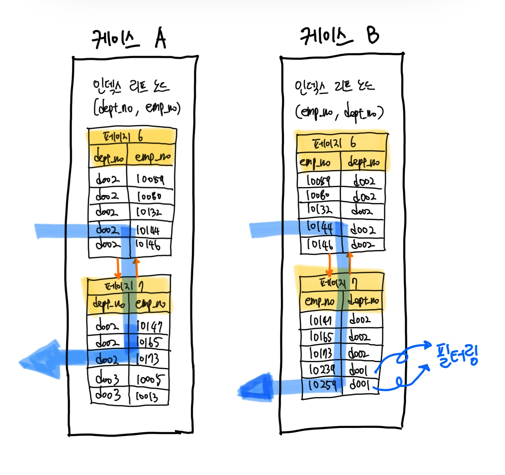

# 인덱스

- 각 인덱스의 특성과 차이는 상당히 중요하며, 물리 수준의 모델링을 할 때도 중요한 요소가 될 것이다.

## 1. 디스크 읽기 방식

- "Random I/O"와 "Sequential I/O"의 개념 먼저.
- 데이터베이스 성능 튜닝은 어떻게 디스크 I/O를 줄이느냐가 관건일 때가 상당히 많다.

### 1-1. 하드 디스크 드라이브(HDD)와 솔리드 스테이트 드라이브(SSD)

- 컴퓨터에서 CPU나 메모리 같은 주요 장치는 대부분 전자식 장치지만 하드 디스크 드라이브는 기계식 장치다.
  - 그래서 데이터베이스 서버에서는 항상 디스크 장치가 병목이 된다.
  - 기계식 하드 디스크 드라이브를 대체하기 위해 전자식 저장 매체인 SDD가 떠오르고 있다.
- SDD는 데이터 저장용 플래터(원판)를 제거하고 그 대신 플래시 메모리를 장착하고 있다.
  - 원판 회전 없이 아주 빨리 데이터를 읽을 수 있다.
  - 플래시 메모리는 전원이 공급되지 않아도 데이터가 삭제되지 않는다.
  - 그리고 컴퓨터의 메모리(D-RAM)보다는 느리지만 기계식 하드 디스크 드라이브보다는 훨씬 빠르다.
- 메모리와 디스크의 처리 속도 => 10만 배 차이
- 메모리와 SDD 처리 속도 => 1000배 차이

### 1-2. 랜덤 I/O와 순차 I/O

- Random I/O라는 표현은 하드 디스크 드라이브의 플래터(원판)를 돌려서 읽어야 할 데이터가 저장된 위치로 디스크 헤더를 이동시킨 다음 데이터를 읽는 것을 의미하는데, 사실 순차 I/O 또한 이 작업 과정은 같다.
- 순차 I/O는 3개의 페이지(3 x 16KB)를 디스크에 기록하기 위해 1번 시스템 콜을 요청했지만, 랜덤 I/O는 3개의 페이지를 디스크에 기록하기 위해 3번 시스템 콜을 요청한다.
  - 즉 순차 I/O는 헤드를 1번만 움직이고, 랜덤 I/O는 헤드를 3번 움직여야 한다.
  - 결국 순차 I/O는 랜덤 I/O보다 3배 정도 빠르다고 볼 수 있다. (디스크의 성능은 디스크 헤더의 위치 이동 없이 얼마나 많은 데이터를 한 번에 기록하느냐에 의해 결정)
  - SDD도 마찬가지다.
- 사실 쿼리를 튜닝해서 랜덤 I/O를 순차 I/O로 바꿔서 실행할 방법은 그다지 많지 않다.
  - 일반적으로 쿼리를 튜닝하는 것은 랜덤 I/O 자체를 줄여주는 것이 목적이라고 할 수 있다.
  - 여기서 랜덤 I/O를 줄인다는 것은 쿼리를 처리하는 데 꼭 필요한 데이터만 읽도록 개선하는 것을 의미한다.

> #### 참고
> - 랜덤 I/O나 순차 I/O 모두 파일에 쓰기를 실행하면 반드시 동기화(fsync 또는 flush 작업)가 필요하다.
> - 그런데 순차 I/O인 경우에도 이러한 파일 동기화 작업이 빈번히 발생한다면 랜덤 I/O와 같이 비효율적인 형태로 처리될 때가 많다.
> - 기업용으로 사용하는 데이터베이스 서버에는 캐시 메모리가 장착된 RAID 컨트롤러가 일반적으로 사용되는데, RAID 컨트롤러의 캐시 메모리는 아주 빈번한 파일 동기화 작업이 호출되는 순차 I/O를 효율적으로 처리될 수 있게 변환하는 역할을 한다.
> - 하드 디스크 드라이브뿐만 아니라 SSD를 사용하는 경우에도 여전히 RAID 컨트롤러는 중요한 역할을 하기 때문에 RAID 컨트롤러와 RAID 컨트롤러에 장착된 캐시의 성능을 무시하지 말자.

> #### 참고
> - 인덱스 레인지 스캔은 데이터를 읽기 위해 주로 랜덤 I/O를 사용하며, 풀 테이블 스캔은 순차 I/O를 사용한다.
> - 그래서 큰 테이블의 레코드 대부분을 읽는 작업에서는 인덱스를 사용하지 않고 풀 테이블 스캔을 사용하도록 유도할 때도 있다.
> - 이는 순차 I/O가 랜덤 I/O보다 훨씬 빨리 많은 레코드를 읽어올 수 있기 때문인데, 이런 형태는 OLTP(OnLine Transaction Processing) 성격의 웹 서비스보다는 데이터 웨어하우스나 통계 작업에서 자주 사용된다.

<br/>

## 2. 인덱스란?

- DBMS에서 테이블의 모든 데이터를 검색해서 원하는 결과를 가져오려면 시간이 오래 걸린다.
  - 그래서 칼럼의 값과 해당 레코드가 저장된 주소를 키와 값의 쌍(key-value pair)로 삼아 인덱스를 만들어 두는 것이다.
  - 칼럼의 값을 주어진 순서대로 정렬해서 보관한다.
- SortedList가 DBMS의 인덱스와 같은 자료 구조이며, ArrayList는 데이터 파일과 같은 자료 구조를 사용한다.
  - SortedList는 항상 값이 정렬된 상태로 유지하는 자료 구조
  - ArrayList는 값을 저장하는 순서 그대로 유지하는 자료 구조
- SortedList는 데이터가 저장될 때마다 항상 값을 정렬해야 하므로 저장하는 과정이 복잡하고 느리지만,이미 정렬돼 있어서 아주 빨리 원하는 값을 찾아올 수 있다.
  - DBMS도 마찬가지로 INSERT나 UPDAET, DELETE 문장의 처리가 느려진다. 하지만 SELECT 문은 매우 빠르게 처리할 수 있다.
- 결론적으로 DBMS에서 인덱스는 데이터의 저장(INSERT, UPDATE, DELETE) 성능을 희생하고 그 대신 데이터의 읽기 속도를 높이는 기능이다.
  - 테이블의 인덱스를 하나 더 추가할지 말지는 데이터의 저장 속도를 어디까지 희생할 수 있는지, 읽기 속도를 얼마나 더 빠르게 만들어야 하느냐에 따라 결정해야 한다.
  - 인덱스의 크기가 비대해지면 저장 성능이 떨어지고 역효과를 불러올 수 있다.

#### 역할별 분류

- 인덱스를 역할별로 구분해 본다면 `프라이머리 키 Primary Key`와 `보조 키. 세컨더리 인덱스 Secondary Key`로 구분할 수 있다.
- 프라이머리 키는 이미 잘 아는 것처럼 그 레코드를 대표하는 칼럼의 값으로 만들어진 인덱스를 의마한다. 이 칼럼은 테이블에서 해당 레코드를 식별할 수 있는 기준값이 되기 때문에 우리는 이를 식별자라고도 부른다. 프라이머리 키는 NULL 값을 허용하지 않으며 중복을 허용하지 않는 것이 특징이다.
- 프라이머리 키를 제외한 나머지 모든 인덱스는 세컨더리 인덱스로 분류한다. 유니크 인덱스는 프라이머리 키와 성격이 비슷하고 프라이머리 키를 대체해서 사용할 수도 있다고 해서 대체 키라고도 하는데, 별도로 분류하기도 하고 그냥 세컨더리 인덱스로 분류하기도 한다.

#### 알고리즘별 분류
 
- 상당히 많은 분류가 가능하겠지만, 대표적으로 `B-Tree 인덱스`와 `Hash 인덱스`로 구분할 수 있다.
- B-Tree 알고리즘은 가장 일반적으로 사용되는 인덱스 알고리즘이다. (상당히 성숙)
  - B-Tree 인덱스는 칼럼의 값을 변형하지 않고 원래의 값을 이용해 인덱싱하는 알고리즘이다.
  - MySQL 서버에서는 위치 기반 검색을 지원하기 위한 R-Tree 인덱스 알고리즘도 있지만, 결국 R-Tree 인덱스는 B-Tree의 응용 알고리즘으로 볼 수 있다.
- Hash 인덱스 알고리즘은 칼럼의 값으로 해시값을 계산해서 인덱싱하는 알고리즘으로 매우 빠른 검색을 지원한다.
  - 하지만 값을 변형해서 인덱싱하므로 전방(Prefix) 일치와 같이 값의 일부만 검색하거나 범위를 검색할 때는 해시 인덱스를 사용할 수 없다.
  - Hash 인덱스는 주로 메모리 기반의 데이터베이스에서 많이 사용한다.

#### 중복 허용 여부

- `유니크 인덱스 Unique Index`와 `유니크하지 않은 인덱스 Non-Unique Index`로 구분할 수 있다.
- 실제 DBMS의 쿼리를 실행해야 하는 옵티마이저에게는 유니크함이 상당히 중요한 문제가 된다.
  - 동등 조건으로 검색한다는 건 항상 1건의 레코드만 찾으면 더 찾지 않아도 된다는 것을 옵티마이저에게 알려주는 효과를 낸다.

<br/>

## 3. B-Tree 인덱스

- Balanced Tree
- 여러 변형된 형태의 알고리즘이 있는데, 일반적으로 B+-Tree나 B*-Tree가 사용된다.
- B-Tree는 칼럼의 원래 값을 변형시키지 않고 인덱스 구조체 내에서는 항상 정렬된 상태로 유지한다.
  - 전문 검색과 같은 특수한 요건이 아닌 경우, 대부분 인덱스는 거의 B-Tree를 사용할 정도로 일반적인 용도에 적합한 알고리즘이다.

### 3-1. 구조 및 특성

- B-Tree는 트리 구조의 최상위에 하나의 `루트 노드 Root Node`가 존재하고 그 하위에 자식 노드가 붙어 있는 형태다.
  - 가장 하위에 있는 노드를 `리프 노드 Leaf Node`라 하고, 중간의 노드를 `브랜치 노드 Branch Node`라고 한다.
  - 데이터베이스에서 인덱스와 실제 데이터가 저장된 데이터는 따로 관리되는데, 인덱스의 리프 노드는 항상 실제 데이터 레코드를 찾아가기 위한 주솟값을 가지고 있다.


- 인덱스의 키 값은 모두 정렬돼 있지만, 데이터 파일의 레코드는 정렬돼 있지 않고 임의의 순서로 저장돼 있다.

> #### 참고
> - 대부분 RDBMS의 데이터 파일에서 레코드는 특정 기준으로 정렬되지 않고 임의의 순서로 저장된다.
> - 하지만 InnoDB 테이블에서 레코드는 클러스터되어 디스크에 저장되므로 기본적으로 프라이머리 키 순서로 정렬되어 저장된다.
> - InnoDB에서는 사용자가 별도의 명령이나 옵션을 선택하지 않아도 디폴트로 클러스터링 테이블이 생성된다. 클러스터링이란 비슷한 값을 최대한 모아서 저장하는 방식을 의미한다.


- 위 그림은 MyISAM 테이블의 인덱스와 데이터 파일의 관계다.
  - `레코드 주소`는 MyISAM 테이블의 생성 옵션에 따라 레코드가 테이블에 INSERT된 순번이거나 데이터 파일 내의 위치(Offset)다.
- 반면 InnoDB의 세컨더리 인덱스는 데이터 파일 또한 프라이머리 키를 인덱스 키로 한 루트 노드, 브랜치 노드, 리프 노드 형태로 구성되어 있기 때문에 2번의 검색 과정을 거쳐야 한다.
  - InnoDB 테이블의 성능이 떨어질 것처럼 보이지만 사실은 MyISAM 인덱스 구조와 InnoDB 인덱스 구조는 각각 장단점을 가지고 있다.

### 3-2. B-Tree 인덱스 키 추가 및 삭제

#### 3-2-1. 인덱스 키 추가

- 새로운 키 값이 B-Tree에 저장될 때 테이블의 스토리지 엔진에 따라 새로운 키 값이 즉시 인덱스에 저장될 수도 있고, 그렇지 않을 수도 있다.
  - B-Tree에 저장될 때는 저장될 키 값을 이용해 B-Tree 상의 적절한 위치를 검색해야 한다. 저장될 위치가 결정되면 레코드의 키 값과 대상 레코드의 주소 정보를 B-Tree의 리프 노드에 저장한다.
  - 리프 노드가 꽉 차서 더는 저장할 수 없을 때 리프 노드가 분리(Split)돼야 하는데, 이는 상위 브랜치 노드까지 처리의 범위가 넓어진다.
  - 이러한 작업 탓에 B-Tree는 상대적으로 쓰기 작업(새로운 키를 추가하는 작업)에 비용이 많이 드는 것으로 알려졌다.
- 대략적으로 인덱스를 추가하는 비용 계산하기
  - 테이블에 레코드를 추가하는 작업 비용이 1이라고 가정하면 해당 테이블의 인덱스에 키를 추가하는 작업 비용을 1.5 정도로 예측하는 것이다.
  - 일반적으로 테이블에 인덱스가 3개가 있다면? 1 + 1.5*3 = 5.5의 비용 정도로 예측한다.

#### 3-2-2. 인덱스 키 삭제

- 해당 키 값이 저장된 B-Tree의 리프 노드를 찾아서 그냥 삭제 마크만 하면 작업이 완료된다.
  - 이렇게 삭제 마킹된 인덱스 키 공간은 계속 그대로 방치하거나 재활용할 수 있다.
  - 인덱스 키 삭제로 인한 마킹 작업 또한 디스크 쓰기가 필요하므로 이 작업 역시 디스크 I/O가 필요한 작업이다.
- MySQL 5.5 이상 버전의 InnoDB 스토리지 엔진에서는 이 작업 또한 버퍼링되어 지연 처리될 수도 있다.
  - 처리가 지연된 인덱스 키 삭제 또한 사용자에게는 특별한 악영향 없이 MySQL 서버가 내부적으로 처리하므로 특별히 걱정할 것은 없다.
- MyISAM이나 MEMORY 스토리지 엔진의 테이블에서는 체인지 버퍼와 같은 기능이 없으므로 인덱스 키 삭제가 완료된 후 쿼리 실행이 완료된다.

#### 3-2-3. 인덱스 키 변경

- 인덱스의 키 값은 그 값에 따라 저장될 리프 노드의 위치가 결정되므로 B-Tree의 키 값이 변경되는 경우에는 단순히 인덱스 상의 키 값만 변경하는 것은 불가능하다.
  - 먼저 키 값을 삭제한 후, 다시 새로운 키 값을 추가하는 형태로 처리된다.

#### 3-2-4 인덱스 키 검색

- B-Tree의 루트 노드부터 시작해 브랜치 노드를 거쳐 최종 리프 노드까지 이동하면서 비교 작업을 수행하는데, 이 과정을 "트리 탐색"이라고 한다.
- B-Tree 인덱스를 이용한 검색은 100% 일치 또는 값의 앞부분(Left-most part)만 일치하는 경우에 사용할 수 있다. 또한 부등호 비교 조건에서도 인덱스를 활용할 수 있다.
- 반면 인덱스를 구성하는 키 값의 뒤부분만 검색하는 용도로는 인덱스를 사용할 수 없다.
  - 인덱스의 키 값에 변형이 가해진 후 비교되는 경우에는 절대 B-Tree 검색이 되지 않는다. (함수나 연산을 수행한 결과로 정렬을 하거나 검색)

### 3-3. B-Tree 인덱스 사용에 영향을 미치는 요소

- 칼럼의 크기, 레코드의 건수, 유니크한 인덱스 키 값의 개수 등에 의해 검색이나 변경 작업의 성능이 영향을 받는다.

#### 3-3-1. 인덱스 키 값의 크기

- InnoDB 스토리지 엔진은 디스크에 데이터를 저장하는 가장 기본 단위를 `페이지 Page` 또는 `블록 Block`이라고 하며, 디스크의 모든 읽기 및 쓰기 작업의 최소 단위가 된다.
  - 버퍼 풀에서 데이터를 버퍼링하는 기본 단위이기도 하다.
  - 인덱스도 결국 페이지 단위로 관리되며, 루트와 브랜치 그리고 리프 토드를 구분한 기준이 바로 페이지 단위다.
- 이진 트리는 각 노드가 자식 노드를 2개만 가지는 것과 다르게 B-Tree는 자식 노드의 개수가 가변적인 구조다.
  - 그렇다면 자식 노드를 몇 개까지 가질가? 그것을 바로 인덱스의 페이지 크기와 키 값의 크기에 따라 결정된다.
  - MySQL 5.7 버전부터는 InnoDB 스토리지 엔진의 페이지 크기를 `innodb_page_size` 시스템 변수를 이용해 4KB ~ 64KB 사이의 값을 선택할 수 있지만 기본값은 16KB이다.
- 인덱스의 키가 16바이트라고 가정하면 다음 그림과 같이 인덱스 페이지가 구성될 것이다.


- 자식노드 주소는  여러 가지 복합적인 정보가 담긴 영역이며 페이지의 종류별로 대략 6바이트에서 12바이트까지 다양한 크기의 값을 가질 수 있다.
- 그렇다면 하나의 인덱스 페이지(16KB)에 몇 개의 키를 저장할 수 있을까?
  - 16 * 1024 / (16+12) = 585개를 저장할 수 있다.
- 따라서 인덱스 값이 커지면 커질수록 한 페이지에 저장할 수 있는 인덱스 키는 줄어들게 된다.
  - 인덱스의 키 값이 커지면 디스크로부터 읽어야 하는 횟수가 늘어나고, 그만큼 느려진다는 것을 의미한다.

#### 3-3-2. B-Tree 깊이

- B-Tree의 Depth는 상당히 중요하지만 직접 제어할 방법이 없다.
- B-Tree 깊이가 3인 경우 최대 몇 개의 키 값을 가질 수 있을가?
  - 16바이트인 경우 최대 2억(585 * 585 * 585)개 정도의 키 값을 담을 수 있다.
  - 32바이트로 늘어나면 5천만(372 * 372 * 372)개로 줄어든다.
- B-Tree의 깊이는 MySQL에서 값을 검색할 때 몇 번이나 랜덤하게 디스크를 읽어야 하는지와 직결되는 문제다.
  - 결론적으로 인덱스 키 값의 크기가 커지면 키질수록 하나의 인덱스 페이지가 담을 수 있는 인덱스 키 값의 개수가 적어지고, 그 때문에 같은 레코드 건수라 하더라도 B-Tree의 깊이가 깊어져서 디스크 읽기가 더 많이 필요하게 된다는 것을 의미한다.
- 보통 아무리 깊어도 5단계 이상까지 깊어지는 경우가 흔치 않다.

#### 3-3-3. 선택도 (기수성, Cardinality)

- `선택도 Selectiviry` 또는 `기수성 Cardinality`은 거의 같은 의미로 사용되며, 모든 인덱스 키 값 가운데 유니크한 값의 수를 의미한다.
  - 전체 인덱스 키 값은 100개인데, 그중에서 유니크한 값의 수는 10개라면 기수성은 10이다.
  - 인덱스 키 값 가운데 중복된 값이 많아지면 많아질수록 기수성은 낮아지고 동시에 선택도 또한 떨어진다.

> #### 참고
> - 선택도가 좋지 않다고 하더라도 정렬이나 그루핑과 같은 작업을 위해 인덱스를 만드는 것이 훨씬 나은 경우도 많다. 인덱스가 항상 검색에만 사용되는 것은 아니므로 여러 가지 용도를 고려해 적절히 인덱스를 설계할 필요가 있다.

- 인덱스에서 유니크한 값의 개수는 인덱스나 쿼리의 효율성에 큰 영향을 미친다.

#### 3-3-4. 읽어야 하는 레코드 건수

- 인덱스를 통해 테이블의 레코드를 읽는 것은 인덱스를 거치지 않고 바로 테이블의 레코드를 읽는 것보다 높은 비용이 드는 작업니다.
- 인덱스를 이용한 읽기의 손익 분기점이 얼마인지 판단할 필요가 있는데, 일반적인 DBMS의 옵티마이저에서는 인덱스를 통해 레코드 1건을 읽는 것이 테이블에서 직접 레코드 1건을 읽는 것보다 4~5배 정도 비용이 더 많이 드는 작업인 것으로 예측한다.
  - 즉, 인덱스를 통해 읽어야 할 레코드의 건수가 전체 테이블 레코드의 20~25%를 넘어서면 인덱스를 이용하지 않고 테이블을 모두 직접 읽어서 필요한 레코드만 가녀래는 방식으로 처리하는 것이 효율적이다.

### 3-4. B-Tree 인덱스를 통한 데이터 읽기

- 어떤 경우에 인덱스를 사용하게 유도할지, 또는 사용하지 못하게 할지 판단하려면 MySQL이 어떻게 인덱스를 이용해서 실제 레코드를 읽어 내는지 알아야 한다.
- 대표적인 세 가지 방법을 알아보자.

#### 3-4-1. 인덱스 레인지 스캔

- 가장 대표적인 접근 방식. 뒤의 2가지 방식보다는 빠른 방법
- 만약 아래와 같은 쿼리를 실행한다면 B-Tree를 어떻게 스캔할까?

```shell
mysql> SELECT * FROM employees WHERE first_name BETWEEN 'Ebbe' AND 'Gad';
```


- 인덱스 레인지 스캔은 검색해야 할 인덱스의 범위가 결정됐을 때 사용하는 방식이다.
  - 검색하려는 값의 수나 검색 결과 레코드 건수와 관계없이 레인지 스캔이라고 표현한다.
  - 루트 노드에서부터 비교를 시작해 브랜치 노드를 거치고 최종적으로 리프 노드까지 찾아 들어가야만 비로소 필요한 레코드의 시작 지점을 찾을 수 있다.
  - 만약 스캔하다가 리프 노드의 끝까지 읽으면 리프 노드 간의 링크를 이용해 다음 리프 노드를 찾아서 다시 스캔한다.
  - 그리고 최종적으로 스캔을 멈춰야 할 위치에 다다르면 지금까지 읽은 레코드를 사용자에게 반환하고 쿼리를 끝낸다.
- 한 가지 중요한 것은 인덱스의 리프 노드에서 검색 조건에 일치하는 건들은 데이터 파일에서 레코드를 읽어오는 과정이 필요하다는 것이다.
  - 이때 리프 노드에 저장된 레코드 주소로 데이터 파일의 레코드를 읽어오는데 레코드 한 건 한 건 단위로 랜덤 I/O가 한 번씩 일어난다.
  - 만약 3건의 레코드가 검색 조건에 일치했다고 가정하면, 데이터 레코드를 읽기 위해 랜덤 I/O가 최대 3번 필요하다. (인덱스 순서대로 레코드가 저장되리란 법이 없기 때문이다.)
  - 그래서 인덱스를 통해 데이터 레코드를 읽는 작업은 비용이 많이 드는 작업으로 분류된다.
- 정리하자면 인덱스 레인지 스캔은 다음과 같이 크게 3단계를 거친다.
1. 인덱스에서 조건을 만족하는 값이 저장된 위치를 찾는다. 이 과정을 `인덱스 탐색 index seek`이라고 한다.
2. 1번에서 탐색된 위치부터 필요한 만큼 인덱스를 차례대로 쭉 읽는다. 이 과정을 `인덱스 스캔 index scan`이라고 한다. (1번과 2번을 합쳐서 인덱스 스캔으로 통칭하기도 한다.)
3. 2번에서 읽어 들인 인덱스 키와 레코드 주소를 이용해 레코드가 저장된 페이지를 가져오고, 최종 레코드를 읽어 온다.

- 쿼리가 필요로 하는 데이터에 따라 3번 과정은 필요하지 않을 수도 있는데, 이를 커버링 인덱스라고 한다.
  - 커버링 인덱스로 처리되는 쿼리는 디스크의 레코드를 읽지 않아도 되기 때문에 랜덤 읽기가 상당히 줄어들고 성능은 그만큼 빨라진다.

#### 3-4-2. 인덱스 풀 스캔

- 인덱스 레인지 스캔과 달리 인덱스의 처음부터 끝까지 모두 읽는 방식을 인덱스 풀 스캔이라고 한다.
  - 대표적으로 쿼리의 조건절에 사용된 칼럼이 인덱스의 첫 번째 칼럼이 아닌 경우 인덱스 풀스캔 방식이 사용된다.
  - 예를 들어 인덱스는 A, B, C 칼럼의 순서로 만들어져 있지만 쿼리의 조건절은 B 칼럼이나 C칼럼으로 검색하는 경우다.
- 일반적으로 인덱스의 크기는 테이블의 크기보다 작으므로 직접 테이블을 처음부터 끝까지 읽는 것보다는 인덱스만 읽는 것이 효율적이다.
  - 쿼리가 인덱스에 명시된 칼럼만으로 조건을 처리할 수 있는 경우 주로 이 방식이 사용된다.
  - 인덱스뿐만 아니라 데이터 레코드까지 모두 읽어야 한다면 절대 이방식으로 처리되지 않는다.


- 먼저 인덱스 리프 노드의 제일 앞 또는 제일 뒤로 이동한 후, 인덱스 리프 노드를 연결하는 링크드 리스트를 따라서 처음부터 끝까지 스캔하는 방식이다.
  - 인덱스 레인지 스캔보다는 빠르지 않지만 테이블 풀 스캔보다는 효율적이다. (테이블 레코드를 읽을 필요가 없기 때문)

> #### 주의
> - 보통 "인덱스를 사용한다"라고 표현하는 것은 `인덱스 레인지 스캔`이나 `루스 인덱스 스캔` 방식으로 인덱스를 사용한다는 것을 의미한다.
> - 인덱스 풀 스캔 방식 또한 인덱스를 이용하는 것이지만 효율적인 방식은 아니며, 일반적으로 인덱스를 생성하는 목적은 아니다.
> - `인덱스 풀 스캔` 방식으로 인덱스를 사용하는 경우 "인덱스를 사용하지 못한다" 또는 "인덱스를 효율적으로 사용하지 못한다"라는 표현을 사용한다.

#### 3-4-3. 루스 인덱스 스캔

- 루스 인덱스 스캔이란 말 그대로 느슨하게 듬성듬성하게 인덱스를 읽는 것을 의미한다.
  - 인덱스 레인지 스캔과 비슷하게 동작하지만 중간에 필요치 않은 인덱스 키 값은 `무시 SKIP`하고 다음으로 넘어가는 형태로 처리한다.
  - 일반적으로 `GROUP BY` 또는 집합 함수 가운데 `MAX()` 또는 `MIN()` 함수에 대해 최적화를 하는 경우에 사용된다.
  - 오라클과 같은 DBMS의 `인덱스 스킵 스캔`이라고 하는 기능과 작동 방식이 비슷하지만, MySQL에서는 `루스 인덱스 스캔`이라고 한다.

```shell
mysql> SELECT dept_no, MIN(emp_no)
       FROM dept_emp
       WHERE dept_no BETWEEN 'd002' AND 'd004'
       GROUP BY dept_no;
```


- 이 쿼리에서는 위 그림과 같이 dept_no 그룹별로 첫 번째 레코드의 emp_no 값만 읽으면 된다.
  - 즉 인덱스에서 WHERE 조건을 만족하는 범위 전체를 다 스캔할 필요가 없다는 것을 옵티마이저는 알고 있기 때문에 조건에 만족하지 않는 레코드는 무시하고 다음 레코드로 이동한다.

#### 3-4-4 인덱스 스킵 스캔

- MySQL 8.0 버전부터는 옵티마이저가 `인덱스 스킵 스캔`을 지원한다. 
- 데이터베이스 서버에서 인덱스의 핵심은 값이 정렬돼 있다는 것이며, 이로 인해 인덱스를 구성하는 칼럼의 순서가 매우 중요하다.
- 만약 `birth_date`와 `gender`이 한 묶음으로 인덱스가 걸려 있는 경우 `birth_date`만 WHERE 절에 넣어 검색하면 어떻게 될까?

```shell
mysql> ALTER TABLE employees
       ADD INDEX ix_gender_birthdate (gender, birth_date);

mysql> SET optimizer_switch='skip_scan=OFF';

mysql> EXPLAIN
       SELECT gender, birth_date
       FROM employees
       WHERE birth_date >= '1965-02-01';
+----+-------------+-----------+-------+---------------+---------------------+---------+--------+----------+--------------------------+
| id | select_type | table     | type  | possible_keys | key                 | key_len | rows   | filtered | Extra                    |
+----+-------------+-----------+-------+---------------+---------------------+---------+--------+----------+--------------------------+
|  1 | SIMPLE      | employees | index | NULL          | ix_gender_birthdate | 4       | 299922 |    33.33 | Using where; Using index |
+----+-------------+-----------+-------+---------------+---------------------+---------+--------+----------+--------------------------+
1 row in set, 1 warning (0.01 sec)
```
  
- 인덱스 스킵 스캔 기능이 비활성화되면 `풀 인덱스 스캔`을 해버린다.
  - `type`이 `index`라고 표시된 것이 인덱스를 처음부터 끝까지 읽었다는 의미이다. => 인덱스를 비효율적으로 사용했다는 의미
- 그렇다면 `인덱스 스킵 스캔`을 활성화하고, 동일 쿼리를 다시 실행하면?

```shell
mysql> SET optimizer_switch='skip_scan=ON';

mysql> EXPLAIN
       SELECT gender, birth_date
       FROM employees
       WHERE birth_date >= '1965-02-01';
+----+-------------+-----------+-------+---------------------+---------------------+---------+-------+----------+----------------------------------------+
| id | select_type | table     | type  | possible_keys       | key                 | key_len | rows  | filtered | Extra                                  |
+----+-------------+-----------+-------+---------------------+---------------------+---------+-------+----------+----------------------------------------+
|  1 | SIMPLE      | employees | range | ix_gender_birthdate | ix_gender_birthdate | 4       | 99964 |   100.00 | Using where; Using index for skip scan |
+----+-------------+-----------+-------+---------------------+---------------------+---------+-------+----------+----------------------------------------+
1 row in set, 1 warning (0.00 sec)
```

- 여기서 `type`이 `range`라는 것은 인덱스에서 필요한 부분만 읽었다는 것을 의미한다.
  - 그리고 실행 계획의 `Extra` 칼럼에 `Using index for skip scan`이라는 문구가 표시 됐다. 
  - 위 실행 계획을 분석해보면, `ix_gender_birthdate` 인덱스를 사용해 `인덱스 스킵 스캔`을 사용했다는 의미다.


- `gender` 칼럼은 성별을 구분하는 칼럼으로 `M`과 `F` 값만 가지는 ENUM 타입의 칼럼이다.
  - 따라서 `gender` 칼럼에 대해 가능한 값 2개를 구한 다음, 옵티마이저는 내부적으로 아래 2개의 쿼리를 실행하는 것과 비슷한 형태의 최적화를 실행하게 된다.

```mysql
SELECT gender, birth_date FROM employees WHERE gender='M' birth_date >= '1965-02-01';
SELECT gender, birth_date FROM employees WHERE gender='Y' birth_date >= '1965-02-01';
```

> #### 주의
> - 여기서 gender가 ENUM 값이 아니더라도, 어떤 타입이든 루스 인덱스 스캔과 동일한 방식으로 읽으면서 인덱스에 존재하는 모든 값을 먼저 추출하고 그 결과를 이용해 인덱스 스킵 스캔을 실행한다.

- 인덱스 스킵 스캔은 다음과 같은 단점이 있다. (MySQL 8.0 기준)
  - WHERE 조건절에 조건이 없는 인덱스의 선행 칼럼의 유니크한 값의 개수가 적어야 함.
  - 쿼리가 인덱스에 존재하는 칼럼만으로 처리 가능해야 함(커버링 인덱스)
- 아래 예제처럼 커버링 인덱스가 아니라면 풀 스캔을 해야 한다.
  - `gender`와 `birth_date` 외에 다른 칼럼이 필요.

```shell
mysql> EXPLAIN
       SELECT *
       FROM employees
       WHERE birth_date >= '1965-02-01';
+----+-------------+-----------+------+---------------+------+---------+--------+----------+-------------+
| id | select_type | table     | type | possible_keys | key  | key_len | rows   | filtered | Extra       |
+----+-------------+-----------+------+---------------+------+---------+--------+----------+-------------+
|  1 | SIMPLE      | employees | ALL  | NULL          | NULL | NULL    | 299922 |    33.33 | Using where |
+----+-------------+-----------+------+---------------+------+---------+--------+----------+-------------+
1 row in set, 1 warning (0.00 sec)
```

### 3-5. 다중 칼럼 인덱스 Multi-column Index

- 실제 서비스용 데이터베이스에서는 2개 이상의 칼럼을 포함하는 인덱스가 더 많이 사용된다.
- 두 개 이상의 칼럼으로 구성된 인덱스를 다중 칼럼 인덱스(또는 복합 칼럼 인덱스)라고 하며, 또한 2개 이상의 칼럼이 연결됐다고 해서 `Concatenated Index`라고도 한다.
- 두 번째 칼럼은 첫 번째 칼럼에 의존해서 정렬한다. 세 번째 칼럼은 두 번째 칼럼에 의존해서 정렬되고, 네 번째 칼럼은 다시 세 번째 칼럼에 의존해서 정렬된다.

### 3-6. B-Tree 인덱스의 정렬 및 스캔 방향

- 인덱스를 생성할 때 설정한 정렬 규칙에 따라서 인덱스의 키 값은 항상 오름차순이거나 내림차순으로 정렬되어 저장된다.
  - 하지만 어떤 인덱스가 오름차순으로 생성됐다고 해서 그 인덱스를 오름차순으로만 읽을 수 있다는 뜻은 아니다.
- 인덱스를 어느 방향으로 읽을지는 쿼리에 따라 옵티마이저가 실시간으로 만들어내는 실행 계획에 따라 결정된다.

#### 3-6-1. 인덱스의 정렬

- 일반적인 상용 DBMS에서는 인덱스를 생성하는 시점에 인덱스를 구성하는 각 칼럼의 정렬을 오름차순 또는 내림차순으로 설정할 수 있다.
- MySQL 8.0 버전부터는 다음과 같이 정렬 순서를 혼합한 인덱스도 생성할 수 있게 됐다.

```shell
mysql> CREATE INDEX ix_teamname_userscore ON employees (team_name ASC, user_score DESC);
```

##### 3-6-1-1. 인덱스 스캔 방향

- 만약 아래 쿼리를 실행했다고 해보자. (`first_name`을 기준으로 최후순위)
  - 인덱스를 처음부터 오름차순으로 끝까지 읽지 않고, 역순으로 읽어 값을 가져올 것이다.

```shell
mysql> SELECT *
        FROM employees
        ORDER BY first_name DESC
        LIMIT 1;
```

- 즉, 인덱스 생성 시점에 오름차순 또는 내림차순으로 정렬이 결정되지만 쿼리가 그 인덱스를 사용하는 시점에 인덱스를 읽는 방향에 따라 오름차순 또는 내림차순 정렬 효과를 얻을 수 있다.
  - 오름차순으로 생성된 인덱스를 정순으로 읽으면 출력되는 결과 레코드는 자동으로 오름차순으로 정렬된 결과가 되고, 역순으로 읽으면 그 결과는 내림차순으로 정렬된 상태가 되는 것이다.

```shell
mysql> SELECT * FROM employees WHERE first_name >= 'Anneke'
        ORDER BY first_name ASC LIMIT 4;

mysql> SELECT * FROM employees
        ORDER BY first_name DESC LIMIT 5;
```

- 위의 첫 번째 쿼리는 `first_name` 칼럼에 정의된 인덱스를 통해 'Anneke'라는 레코드를 찾은 후, 정순으로 해당 인덱스를 읽으면서 4개의 레코드만 가져오면 아무런 비용을 들이지 않고도 원하는 정렬 효과를 얻을 수 있다.
- 두 번째 쿼리는 반대로 `employees` 테이블의 `first_name` 칼럼에 정의된 인덱스를 역순으로 읽으면서 처음 다섯 개의 레코드만 가져오면 된다.
- 쿼리의 `ORDER BY` 처리나 `MIN()` 또는 `MAX()` 함수 등의 최적화가 필요한 경우에도 MySQL 옵티마이저는 인덱스의 읽기 방향을 전환해서 사용하도록 실행 계획을 만들어 낸다.

##### 3-6-1-2. 내림차순 인덱스

```shell
mysql> SELECT * FROM employees ORDER BY first_name DESC LIMIT 10;
```

- 만약 위와 같이 역순으로 정렬하여 조회하는 요건만 있다면 다음 2개의 인덱스 중에서 어떤 것을 선택하는 것이 좋을까?

```shell
mysql> CREATE INDEX ix_firstname_asc ON employees (first_name ASC);
mysql> CREATE INDEX ix_firstname_asc ON employees (first_name DESC);
```


> ##### 용어정리
> - `오름차순 인덱스 Ascending index`: 작은 값의 인덱스 키가 B-Tree의 왼쪽으로 정렬된 인덱스
> - `내림차순 인덱스 Descending index`: 큰 값의 인덱스 키가 B-Tree의 외쪽으로 정렬된 인덱스
> - `인덱스 정순 스캔 Forward index scan`: 인덱스 키의 크고 작음에 관계없이 인덱스 리프 노드의 왼쪽 페이지부터 오른쪽으로 스캔
> - `인덱스 역순 스캔 Backward index scan`: 인덱스 키의 크고 작음에 관계없이 인덱스 리프 노드의 오른쪽 페이지부터 왼쪽으로 스캔

- 예제를 통해 인덱스 역순 정렬 쿼리가 정순 정렬 쿼리보다 28.9%나 시간이 더 걸리는 것을 확인할 수 있다.
- InnoDB에서 인덱스 역순 스캔이 정순 스캔에 비해 느릴 수밖에 없는 2가지 이유
1. 페이지 잠금이 인덱스 정순 스캔에 적합한 구조
2. 페이지 내에서 인덱스 레코드가 단방향으로만 연결된 구조

- 역순으로 정렬하여 조회하는 쿼리가 많은 레코드를 조회하면서 빈번하게 실행된다면 오름차순 인덱스보다는 내림차순 인덱스가 더 효율적이라고 볼 수 있다.
- 또한 많은 쿼리가 인덱스의 앞쪽만 또는 뒤쪽만 집중적으로 읽어서 인덱스의 특정 페이지 잠금이 병목이 될 것으로 예상된다면 쿼리에서 자주 사용되는 정렬 순서대로 인덱스를 생성하는 것이 잠금 병목 현상을 완화하는 데 도움이 될 것이다.

### 3-7. B-Tree 인덱스의 가용성과 효율성

- 쿼리의 `WHERE` 조건이나 `GROUP BY`, 또는 `ORDER BY` 절이 어떤 경우에 인덱스를 사용할 수 있고 어떤 방식으로 사용할 수 있는지 식별할 수 있어야 한다.
  - 쿼리 조건 최적화 및 쿼리에 맞는 인덱스 생성 등을 위한 기초

#### 3-7-1. 비교 조건의 종류와 효율성

- 다중 칼럼 인덱스에서 각 칼럼의 순서와 그 칼럼에 사용된 조건이 동등 비교(`=`)인지 부등호(`>`, `<`)와 같은 범위 조건인지에 따라 각 인덱스 칼럼의 활용 형태가 달라지며, 그 효율 또한 달라진다.

```shell
mysql> SELECT * FROM dept_emp
        WHERE dept_no='d002' AND emp_no>=10114;
```

- 인덱스 케이스에 따라 어떤 차이가 있는지 확인해보자.
- 케이스A: `INDEX(dept_no, emp_no)`
  - `dept_no='d002' AND emp_no>=10114`인 레코드만 찾고, 그 이후에는 `dept_no`이 `d002`가 아닐 때까지 인덱스를 쭉 읽기만 하면 된다.
  - `작업 범위 결정 조건`: 작업의 범위를 결정하는 조건

- 케이스B: `INDEX(emp_no, dept_no)`
  - `emp_no>=10144 AND dept_no='d002'`인 레코드를 찾고, 그 이후 모든 레코드에 대해 dept_no가 `d002`인지 비교하는 과정을 거쳐야 한다.
  - 이처럼 인덱스를 통해 읽은 레코드가 나머지 조건에 맞는지 비교하면서 취사선택하는 작업을 `필터링 filtering`이라고 한다.
  - `필터링 조건`: 비교 작업의 범위를 줄이지 못하고 단순히 거름종이 역할만 하는 조건
  - 성능을 높이지 못하고, 오히려 쿼리 실행을 더 느리게 만들 때가 더 많다.



#### 3-7-2. 인덱스의 가용성

- B-Tree 인덱스의 특징은 `왼쪽 값을 기준 Left-most`으로 오른쪽 값이 정렬돼 있다는 것이다.
  - 단일 컬럼 인덱스와 다중 칼럼 인덱스 둘 다 해당
- 케이스A: `INDEX(first_name)`
  - 문자열에서 제일 왼쪽에 있는 문자를 기준으로 정렬한 다음, 또 그 다음 문자로 정렬하는 식으로 구성
  - 아래와 같은 쿼리는 인덱스 레인지 스캔 방식의 인덱스를 이용할 수 없다.

```shell
mysql> SELECT * FROM employees WHERE first_name LIKE '%mer';
```

- 케이스B: `INDEX(dept_no, emp_no)`
  - 왼쪽에 있는 dept_no 칼럼이 먼저 정렬되고, 그 안에서 emp_no 순으로 정렬
  - 아래의 쿼리는 인덱스를 효율적으로 사용할 수 없다. 만약 `dept_no`을 조건으로 사용했다면 복합 인덱스를 사용했을 수도 있다.

```shell
mysql> SELECT * FROM dept_emp WHERE emp_no>=10144;
```

#### 3-7-3. 가용성과 효율성 판단

- 기본적으로 B-Tree 인덱스의 특성상 다음 조건에서는 사용할 수 없다.

- **`NOT-EQUAL`로 비교된 경우(`<>`, `NOT IN`, `NOT BETWEEN`, `IS NOT NULL`)**
  - `WHERE column <> 'N'`
  - `WHERE column NOT IN (10,11,12)`
  - `WHERE column IS NOT NULL`
- **`LIKE '%??'(앞부분이 아닌 뒷부분 일치) 형태로 문자열 패턴이 비교된 경우`**
  - `WHERE column LIKE '%bell'`
  - `WHERE column LIKE '%bell%'`
  - `WHERE column LIKE '_bell'`
- **스토어드 함수나 다른 연산자로 인덱스 칼럼이 변형된 후 비교된 경우**
  - `WHERE SUBSTRING(column, 1, 1) = 'X'`
  - `WHERE DAYOFMONTH(column) = 1`
- **`NOT-DETERMINISTIC` 속성의 스토어드 함수가 비교 조건에 사용된 경우**
  - `WHERE column = deterministic_function()`
- **데이터 타입이 서로 다른 비교(인덱스 칼럼의 타입을 변환해야 비교가 가능한 경우)**
  - `WHERE char_column = 10`
- **문자열 데이터 타입의 콜레이션이 다른 경우**
  - `WHERE utf8_bin_char_column = euckr_bin_char_column`

---

- 다중 칼럼 인덱스의 조건
  - 아래는 인덱스 예시

```mysql
INDEX ix_test(column_1, column_2, column_3, ..., column_n)
```

- **작업 범위 결정 조건으로 인덱스를 사용하지 못하는 경우**
  - `column_1` 칼럼에 대한 조건이 없는 경우
  - `column_1` 칼럼의 비교 조건이 위의 인덱스 사용 불가 조건 중 하나인 경우
- **작업 범위 결정 조건으로 인덱스를 사용하는 경우(i는 2보다 크고 n보다 작은 임의의 값을 의미)**
  - `column_1` ~ `column_(i-1)` 칼럼까지 동등 비교 형태(`=` 또는 `IN`) 비교
  - `column_i` 칼럼에 대해 다음 연산 중 하나로 비교
    - 동등 비교(`=`, `IN`)
    - 부등호(`>`, `<`)
    - LIKE로 좌측 일치 패턴(`LIKE 'bell%'`)

## 4. R-Tree 인덱스

- MySQL의 `공간 인덱스 Spatial Index`
  - 2차원의 데이터를 인덱싱하고 검색하는 목적의 인덱스.
  - 기본적인 매커니즘은 B-Tree와 비슷하지만, B-Tree는 1차원 스칼라 값인 점이 다르다.

### 4-1. 구조 및 특성

- `기하학적 도형 Geometry` 정보를 관리할 수 있는 데이터 타입을 제공한다.
  - `POINT`, `LINE`, `POLYGON` 객체 등
- MBR의 개념
  - Minimum Bounding Rectangle

### 4-2. R-Tree 인덱스의 용도

- 일반적으로는 WGS84(GPS) 기준의 위도, 경도 좌표 저장에 주로 사용된다.
  - CAD/CAM 소프트웨어 또는 회로 디자인 등과 같이 좌표 시스템에 기반을 둔 정보에 대해서는 모두 적용할 수 있다.
- R-Tree는 각 도형의 포함 관계를 이용해 만들어진 인덱스다.
  - 따라서 `ST_Contains()` 또는 `ST_Within()` 등과 같은 포함 관계를 비교하는 함수로 검색을 수행하는 경우에만 인덱스를 이용할 수 있다.
  - 대표적인 예시 '현재 사용자의 위치로부터 반경 5km 이내의 음식점 검색'

## 5. 전문 검색 인덱스

- 문서의 내용 전체를 인덱스화해서 특정 키워드가 포함된 문서를 검색하는 `전문 Full Text` 검색에는 InnoDB나 MyISAM 스토리지 엔진에서 제공하는 일반적인 용도의 B-Tree 인덱스를 사용할 수 없다.
  - 문서 전체에 대한 분석과 검색을 위한 이러한 인덱싱 알고리즘을 `전문 검색 Full Text search` 인덱스라고 하는데, 전문 검색 인덱스는 일반화된 기능의 명칭이지 전문 검색 알고리즘의 이름을 지칭하는 것은 아니다.

### 5-1. 인덱스 알고리즘

- 전문 검색에서는 문서 본문의 내용에서 사용자가 검색하게 될 키워드를 분석해 내고, 빠른 검색용으로 사용할 수 있게 키워드 인덱스를 구축한다.
- 기법 분류
  - 어근 분석
  - n-gram 분석 알고리즘

#### 5-1-1. 어근 분석 알고리즘

- 전문 검색 인덱스는 두 가지 중요한 과정을 거쳐서 색인 작업이 수행된다.
  - `불용어 Stop Word` 처리
  - `어근 분석 Stemming`
- 불용어 처리는 검색에서 별 가치가 없는 단어를 모두 필터링해서 제거하는 작업을 의미한다.
  - 현재 MySQL 서버는 불용어가 소스코드에 정의돼 있지만, 이를 무시하고 사용자가 별도로 불용어를 정의할 수 있는 기능을 제공한다.
- 어근 분석은 검색어로 선정된 단어의 뿌리인 원형을 찾는 작업이다.
  - MySQL 서버는 오픈소스 형태소 분석 라이브러리인 `MeCab`을 플러그인 형태로 지원
  - 한글이나 일본어는 어근 분석보다 형태소 분석이 더 중요.
  - 중요한 것은 각 국가의 언어가 서로 문법이 다르고 다른 방식으로 발전해왔기 때문에 형태소 분석이나 어근 분석 또한 언어별로 방식이 모두 다르다는 점이다.
  - `MeCab`을 적용하는 방법은 어렵지 ㅇ낳지만 한글에 맞게 완성도를 갖추는 작업은 많은 시간과 노력이 필요하다.

#### 5-1-2. n-gram 알고리즘

- 형태소 분석이 문장을 이해하는 알고리즘이라면, n-gram은 단순히 키워드를 검색해내기 위한 인덱싱 알고리즘이다.
- n-gram은 본문을 무조건 몇 글자씩 잘라서 인덱싱하는 방법을 채택한다.
  - 형태소 분석보다 단순 
  - 국가별 언어에 대한 이해와 준비 작업이 필요 X
  - 만들어진 인덱스 크기가 상당히 크다.

#### 5-1-3. 불용어 변경 및 삭제

- 불용어 처리 자체를 완전히 무시하거나 MySQL 서버에 내장된 불용어 대신 사용자가 직접 불용어를 등록하는 방법을 권장

##### 전문 검색 인덱스의 불용어 처리 무시

1. MySQL 서버의 모든 전문 검색 인덱스에 대해 불용어를 완전히 제거 (`ft_stopword_file=''`)
2. InnoDB 스토리지 엔진을 사용하는 테이블의 전문 검색 인덱스에 대해서만 불용어 처리 무시. (`innodb_ft_enable_stopword=OFF`)

##### 사용자 정의 불용어 사용

- `ft_stopword_file='{불용어 목록 파일}'`로 사용자 설정

### 5-2. 전문 검색 인덱스의 가용성

- 전문 검색 인덱스를 사용하려면 반드시 다음 두 가지 조건을 갖춰야 한다.

1. 쿼리 문장이 전문 검색을 위한 문법(`MATCH ... AGAINST ...`) 사용
2. 테이블이 전문 검색 대상 칼럼에 대해서 전문 인덱스 보유

- 아래와 같이 전문 검색 인덱스를 생성해야 한다. (`FULLTEXT KEY`)

```mysql
CREATE TABLE my_tabe (
  # ...
 doc_body TEXT,
  FULLTEXT KEY fx_docbody (doc_body) WITH PARSER ngram
) ENGINE=InnoDB;
```

- `WHERE` 조건에서 그냥 `LIKE`로 검색해버리는 풀 테이블 스캔을 해버린다.

```shell
mysql> SELECT * FROM my_table WHERE doc_body LIKE '%애플%';
```

- 전문 검색 인덱스를 사용하려면 반드시 아래와 같이 `MATCH (...) AGAINST (...)` 구문으로 검색 쿼리를 작성해야 하며, 전문 검색 인덱스를 구성하는 칼럼들은 `MATCH` 절의 괄호 안에 모두 명시돼야 한다.

```shell
mysql> SELECT * FROM my_table
        WHERE MATCH(doc_body) AGAINST('애플' IN BOOLEAN MODE);
```

## 6. 함수 기반 인덱스

- 일반적인 인덱스는 칼럼의 값 일부 도는 전체에 대해서만 인덱스 생성이 허용된다.
  - 하지만 때로는 칼럼의 값을 변형해서 만들어진 값에 대해 인덱스를 구축해야 할 때도 있는데, 이러한 경우 함수 기반의 인덱스를 활용하면 된다.
  - MySQL 8.0부터 함수 기반 인덱스 지원.
- MySQL 서버의 함수 기반 인덱스는 인덱싱할 값을 계산하는 과정의 차이만 있을 뿐, 실제 인덱스의 내부적인 구조 및 유지관리 방법은 B-Tree 인덱스와 동일하다.
  - 그래서 함수 기반 인덱스의 내부 구조는 앞에서 살펴본 B-Tree를 참고

### 6-1. 가상 칼럼을 이용한 인덱스

```mysql
CREATE TABLE user(
  user_id BIGINT,
  first_name VARCHAR(10),
  last_name VARCHAR(10),
  PRIMARY KEY (user_id)
);
```

- 만약 `user` 테이블에서 `first_name`과 `last_name`을 합쳐서 검색해야 하는 요건이 생겼다면 이전 버전의 MySQL 서버에서는 full_name이라는 칼럼을 추가하고 모든 레코드에 대해 `full_name`을 업데이트하는 작업을 거쳐야 했다. 그래야만 비로소 `full_name` 칼럼에 대해 인덱스를 생성할 수 있었다.
- 하지만 MySQL 8.0 버전부터는 다음과 같이 가상 칼럼을 추가하고 그 가상 칼럼에 인덱스를 생성할 수 있게 됐다.

```shell
mysql> ALTER TABLE user
         ADD full_name VARCHAR(30) AS (CONCAT(first_name, ' ', last_name)) VIRTUAL,
         ADD INDEX ix_full_name(full_name);
```

- 실행 계획을 살펴보자.

```shell
mysql> EXPLAIN SELECT * FROM user WHERE full_name='Matt Lee';
+----+-------------+-------+------+--------------+---------+-------+
| id | select_type | table | type | key          | key_len | Extra |
+----+-------------+-------+------+--------------+---------+-------+
|  1 | SIMPLE      | user  | ref  | ix_full_name | 123     | NULL  |
+----+-------------+-------+------+--------------+---------+-------+
1 row in set, 1 warning (0.00 sec)
```

- 가상 칼럼이 `VIRTUAL`이나 `STORED` 옵션 중 어떤 옵션으로 생성됐든 관계없이 해당 가상 칼럼에 인덱스를 생성할 수 있다.
- 가상 칼럼은 테이블에 새로운 칼럼을 추가하는 것과 같은 효과를 내기 때문에 실제 테이블의 구조가 변경된다는 단점이 있다.

### 6-2. 함수를 이용한 인덱스

- MySQL 8.0 버전부터는 다음과 같이 테이블의 구조를 변경하지 않고, 함수를 직접 사용하는 인덱스를 생성할 수 있게 됐다.

```mysql
CREATE TABLE user(
  user_id BIGINT,
  first_name VARCHAR(10),
  last_name VARCHAR(10),
  PRIMARY KEY (user_id),
  INDEX ix_full_name ((CONCAT(first_name, ' ', last_name)))
);
```

- 함수를 직접 사용하는 인덱스는 테이블의 구조는 변경하지 않고, 계산된 결괏값의 검색을 빠륵 만들어준다.
  - 함수 기반 인덱스를 제대로 활용하려면 반드시 조건절에 함수 기반 인덱스에 명시된 표현식이 그대로 사용돼야 한다.
  - 함수 생성 시 명시된 표현식과 쿼리의 WHERE 조건절에 사용된 표현식이 다르다면 MySQL 옵티마이저는 다른 표현식으로 간주해서 함수 기반 인덱스를 사용하지 못한다.

```shell
mysql> EXPLAIN SELECT * FROM user WHERE CONCAT(first_name, ' ', last_name)='Matt Lee';
+----+-------------+-------+------+--------------+---------+-------+-------+
| id | select_type | table | type | key          | key_len | ref   | Extra |
+----+-------------+-------+------+--------------+---------+-------+-------+
|  1 | SIMPLE      | user  | ref  | ix_full_name | 87      | const | NULL  |
+----+-------------+-------+------+--------------+---------+-------+-------+
1 row in set, 1 warning (0.00 sec)
```

- 위의 공백 리터럴이 다르면 `ix_full_name` 인덱스를 사용하지 않는 것으로 표시될 것이다.

```shell
mysql> EXPLAIN SELECT * FROM user WHERE CONCAT(first_name,'  ',last_name)='Matt Lee';
+----+-------------+-------+------+------+---------+------+-------------+
| id | select_type | table | type | key  | key_len | ref  | Extra       |
+----+-------------+-------+------+------+---------+------+-------------+
|  1 | SIMPLE      | user  | ALL  | NULL | NULL    | NULL | Using where |
+----+-------------+-------+------+------+---------+------+-------------+
1 row in set, 1 warning (0.00 sec)
```

- 만약 공백 리터럴이 같은데도 인덱스를 사용하지 않으면 시스템 변수 문제일 수 있다. 아래 3개의 콜레이션을 일치시켜야 한다.
  - collation_connection
  - collation_database
  - collation_server

## 7. 멀티 밸류 인덱스

- 전문 검색 인덱스를 제외한 모든 인덱스는 레코드 1건이 1개의 인덱스 키 값을 가진다.
  - 즉, 인덱스 키와 데이터 레코드는 1:1의 관계를 가진다. 하지만 멀티 밸류(Multi-Value) 인덱스는 하나의 데이터 레코드가 여러 개의 키 값을 가질 수 있는 형태의 인덱스다.
  - 일반적으로 RDBMS를 기준으로 생각하면 이러한 인덱스는 정규화에 위배되는 형태다. 하지만 최근 RDMBS들이 JSON 데이터 타입을 지원하기 시작하면서 JSON의 배열 타입의 필드에 저장된 원소들에 대한 인덱스 요건이 발생한 것이다.
- MySQL 8.0부터는 MySQL 서버의 JSON 관리 기능은 이제 태생적으로 JSON을 사용했던 MongoDB에 비해서도 부족함이 없는 상태가 됐다.

```mysql
CREATE TABLE user(
  user_id BIGINT AUTO_INCREMENT PRIMARY KEY,
  first_name VARCHAR(10),
  last_name VARCHAR(10),
  credit_info JSON,
  INDEX my_creditscores( (CAST(credit_info->'$.credit_scores' AS UNSIGNED ARRAY)) )
);

INSERT INTO user VALUES (1, 'Matt', 'Lee', '{"credit_scores": [360, 353, 351]}');
```

- 멀티 밸류 인덱스를 활용하기 위해서는 일반적인 조건 방식을 사용하면 안 되고, 반드시 다음 함수들을 이용해서 검색해야 옵티마이저가 인덱스를 활용한 실행 계획을 수립한다.
  - `MEMBER OF()`
  - `JSON_CONTAINS()`
  - `JSON_OVERLAPS()`

```shell
mysql> SELECT * FROM user WHERE 360 MEMBER OF(credit_info->'$.credit_scores');
+---------+------------+-----------+------------------------------------+
| user_id | first_name | last_name | credit_info                        |
+---------+------------+-----------+------------------------------------+
|       1 | Matt       | Lee       | {"credit_scores": [360, 353, 351]} |
+---------+------------+-----------+------------------------------------+
1 row in set (0.00 sec)

mysql> EXPLAIN SELECT * FROM user WHERE 360 MEMBER OF(credit_info->'$.credit_scores');
+----+-------------+-------+------+-----------------+---------+-------+-------------+
| id | select_type | table | type | key             | key_len | ref   | Extra       |
+----+-------------+-------+------+-----------------+---------+-------+-------------+
|  1 | SIMPLE      | user  | ref  | my_creditscores | 9       | const | Using where |
+----+-------------+-------+------+-----------------+---------+-------+-------------+
1 row in set, 1 warning (0.00 sec)
```

> #### 참고
> - 멀티 밸류 인덱스는 8.0.17 버전 InnoDB에 처음으로 도입되었다.
> - MySQL 서버의 Worklog에는 `DECIMAL`, `INTEGER`, `DATETIME`, `VARCHAR/CHAR` 타입에 대해 멀티 밸류 인덱스를 지원한다고 명시되어 있다.
> - 하지만 MySQL 8.0.21 버전에서는 `VARCHAR/CHAR` 타입에 대해서는 지원하지 않는 상황이었다.
> - GPT한테 물어봤을 때는, 아직까지도 릴리스 노트에 명시적으로 `VARCHAR/CHAR` 타입을 지원한다는 얘기를 하지 않았다고 한다.

## 8. 클러스터링 인덱스

- 클러스터링이란 여러 개를 하나로 묶는다는 의미로 주로 사용된다.
- MySQL 서버에서 클러스터링은 테이블의 레코드를 비슷한 것(프라이머리 키를 기준으로)들끼리 묶어서 저장하는 형태로 구현되는데, 이는 주로 비슷한 값들을 동시에 조회하는 경우가 많다는 점에 착안한 것이다.
- MySQL에서 클러스터링 인덱스는 InnoDB 스토리지 엔진에서만 지원하며, 나머지 스토리지 엔진에서는 지원되지 않는다.

### 8-1. 클러스터링 인덱스

- 클러스터링 인덱스는 테이블의 프라이머리 키에 대해서만 적용되는 내용이다.
  - 즉 프라이머리 키 값이 비슷한 레코드끼리 묶어서 저장하는 것을 클러스터링 인덱스라고 표현한다.
  - 여기서 중요한 것은 프라이머리 키 값에 의해 레코드의 저장 위치가 결정된다는 것이다.
  - 또한 프라이머리 키 값이 변경된다면 그 레코드의 물리적인 저장 위치가 바뀌어야 한다는 것을 의미하기도 한다.
  - 프라이머리 키 값으로 클러스터링된 테이블은 프라이머리 키 값 자체에 대한 의존도가 상당히 크기 때문에 신중히 프라이머리 키를 결정해야 한다.
- 클러스터링 인덱스는 프라이머리 키 값에 의해 레코드의 저장 위치가 결정되므로 사실 인덱스 알고리즘이라기보다 테이블 레코드의 저장 방식이라고 볼 수 있다.
  - 그래서 "클러스털이 인덱스"와 "클러스터링 테이블"은 동의어로 사용되기도 한다.
  - 또한 클러스터링의 기준이 되는 프라이머리 키는 클러스터링 키라고도 표현한다.
  - 일반적으로 InnoDB와 같이 항상 클러스터링 인덱스로 저장되는 테이블은 프라이머리 키 기반의 검색이 매우 빠르며, 대신 레코드의 저장이나 프라이머리 키의 변경이 상대적으로 느리다.

> #### 주의
> - 일반적으로 B-Tree 인덱스도 인덱스 키 값으로 이미 정렬되어 저장된다. 이 또한 어떻게 보면 인덱스 키 값으로 클러스터링된 것으로 생각할 수 있다.
> - 하지만 이러한 일반적인 B-Tree 인덱스를 클러스터링 인덱스라고 부르지는 않는다.
> - 테이블의 레코드가 프라이머리 키 값으로 정렬되어 저장된 경우만 "클러스터링 인덱스" 또는 "클러스터링 테이블"이라고 한다.

- 그러면 프라이머리 키가 없는 InnoDB 테이블은 어떻게 클러스터링 테이블로 구성될까?
- 프라이머리 키가 없는 경우에는 InnoDB 스토리지 엔진이 다음 우선순위대로 프라이머리 키를 대체할 칼럼은 선택한다.

1. 프라이머리 키가 있으면 기본적으로 프라이머리 키를 클러스터링 키로 선택
2. `NOT NULL` 옵션의 `유니크 인덱스 UNIQUE INDEX` 중에서 첫 번째 인덱스를 클러스터링 키로 선택
3. 자동으로 유니크한 값을 가지도록 증가되는 칼럼을 내부적으로 추가한 후, 클러스터링 키로 선택

- InnoDB 스토리지 엔진이 적절한 클러스터링 키 후보를 찾지 못하는 경우 InnoDB 스토리지 엔진이 내부적으로 레코드의 일련번호 칼럼을 생성한다.
- 이렇게 자동으로 추가된 프라이머리 키(일련번호 칼럼)는 사용자에게 노출되지 않으며, 쿼리 문장에 명시적으로 사용할 수 없다.
  - 즉, 프라이머리 키나 유니크 인덱스가 전혀 없는 InnoDB 테이블에서는 아무 의미 없는 숫자 값으로 클러스터링되는 것이며, 이것은 우리에게 아무런 혜택을 주지 않는다.
  - InnoDB 테이블에서 클러스터링 인덱스는 테이블당 단 하나만 가질 수 있는 엄청난 혜택이므로 가능하다면 프라이머리 키를 명시적으로 생성하자.

### 8-2. 세컨더리 인덱스에 미치는 영향

- 프라이머리 키가 `세컨더리 인덱스 Secondary Index`에 미치는 영향에 대해 알아보자.
- MyISAM이나 MEMORY 테이블 같은 클러스터링되지 않은 테이블은 `INSERT`될 때 처음 저장된 공간에서 절대 이동하지 않는다.
  - 데이터 레코드가 저장된 내부적인 레코드 아이디 ROWID
  - 프라이머리 키나 세컨더리 인덱스의 각 키는 그 주소를 이용해 실제 데이터 레코드를 찾아온다.
- 하지만 InnoDB가 이런 식으로 돌아간다면, 클러스터링 키 값이 변경될 때마다 데이터 레코드 주소가 변경 되고, 그때마다 해당 테이블의 모든 인덱스에 저장된 주솟값을 변경해야 할 것이다. => 오버헤드 발생
  - 이런 오버헤드를 제거하기 위해 InnoDB 테이블의 모든 세컨더리 인덱스는 해당 레코드가 저장된 주소가 아니라 프라이머리 키 값을 저장하도록 구현돼 있다.

#### 예시 - employees에서 first_name 조건으로 검색

```shell
mysql> SELECT * FROM employees WHERE first_name='Aamer';
```

- `MyISAM`: `ix_firstname` 인덱스를 검색해서 레코드의 주소를 확인한 후, 레코드의 주소를 이용해 최종 레코드를 가져옴
- `InnoDB`: `ix_fristname` 인덱스를 검색해 레코드의 프라이머리 키 값을 확인한 후, 프라이머리 키 인덱스를 검색해서 최종 레코드를 가져옴

### 8-3. 클러스터링 인덱스의 장점과 단점

| 장점                                                                            | 단점                                                                      |
|:------------------------------------------------------------------------------|:------------------------------------------------------------------------|
| 프라이머리 키로 검색할 때 처리 성능이 매우 빠름(특히, 프라이머리 키 범위 검색)                                | 테이블의 모든 세컨더리 인덱스가 클러스터링 키를 갖기 때문에 클러스터링 키 값의 크기가 클 경우 전체적으로 인덱스의 크기가 커짐 |
| 테이블의 모든 세컨더리 인덱스가 프라이머리 키를 가지고 있기 때문에 인덱스만으로 처리될 수 있는 경우가 많다.(이를 커버링 인덱스라 함.) | 세컨더리 인덱스를 통해 검색할 때 프라이머리 키로 다시 한번 검색해야 하므로 처리 성능 느림                     |
|                                                                               | INSERT할 때 프라이머리 키에 의해 레코드의 저장 위치가 결정되기 때문에 처리 성능이 느림                    |
|                                                                               | 프라이머리 키를 변경할 때 레코드를 DELETE하고 INSERT하는 작업이 필요하기 때문에 처리 성능이 느림            |

- 대부분 클러스터링 인덱스의 장점은 빠른 읽기이며, 단점은 느린 쓰기라는 것을 알 수 있다.
  - 일반적인 웹 서비스에서 쓰기:읽기 = 2:8 or 1:9 이므로 읽기를 빠르게 유지하는 것이 중요

### 8-4. 클러스터링 테이블 사용 시 주의사항

#### 8-4-1. 클러스터링 인덱스 키의 크기

- 프라이머리 키의 크기 => 인덱스 키의 크기에 영향
- 인덱스가 커질수록 같은 성능을 내기 위해 그만큼의 메모리가 더 필요해지므로 InnoDB 테이블의 프라이머리 키는 신중하게 선택해야 한다.

#### 8-4-2. 프라이머리 키는 `AUTO_INCREMENT`보다는 업무적인 칼럼으로 생성(가능한 경우)

- 프라이머리 키는 그 의미만큼이나 중요한 역할을 하기 때문에 대부분 검색에서 상당히 빈번하게 사용되는 것이 일반적이다.
- 그러므로 설령 그 칼럼의 크기가 크더라도 업무적으로 해당 레코드를 대표할 수 있다면 그 칼럼을 프라이머리 키로 설정하는 것이 좋다.

#### 8-4-3. 프라이머리 키는 반드시 명시할 것

- 가능하면 `AUTO_INCREMENT` 칼럼을 이용해서라도 프라이머리 키를 생성하는 것을 권장한다.
  - 이전에 설명했다시피 프라이머리 키를 지정하지 않으면 어차피 테이블은 자체 키를 생성하고, 심지어 그 키에는 접근도 못함.
- 또한 ROW 기반의 복제나 InnoDB Cluster에서는 모든 테이블이 프라이머리 키를 가져야만 하는 정상적인 복제 성능을 보장하기도 하므로 프라이머리 키는 꼭 생성해야 한다.

#### 8-4-4. `AUTO_INCREMENT` 칼럼을 인조 식별자로 사용할 경우

- 프라이머리 키의 크기가 길어도 세컨더리 인덱스가 필요치 않다면 그대로 프라이머리 키를 사용하는 것이 좋다.
- 세컨더리 인덱스도 필요하고 프라이머리 키의 크기도 길다면 `AUTO_INCREMENT` 칼럼을 추가하고, 이를 프라이머리 키로 설정하면 된다.
- 이렇게 프라이머리 키를 대체하기 위해 인위적으로 추가된 프라이머리 키를 `인조 식별자 Surrogate key`라고 한다.
  - 로그 테이블과 과 같이 조회보다는 INSERT 위주의 테이블은 `AUTO_INCREMENT`를 이용한 인조 식별자를 프라이머리 키로 설정하는 것이 성능 향상에 도움이 된다.

## 9. 유니크 인덱스

- 유니크는 사실 인덱스라기보다는 제약 조건에 가깝다고 볼 수 있다.
  - 하지만 MySQL에서는 인덱스 없이 유니크 제약만 설정할 방법이 없다.
- 유니크 인덱스에서 NULL도 저장될 수 있는데, NULL은 특정 값이 아니므로 2개 이상 저장될 수 있다.
  - MySQL에서 프라이머리 키는 기본적으로 NULL을 허용하지 않는 유니크 속성이 자동으로 부여된다.
  - MyISAM이나 MEMORY 테이블에서 프라이머리 키는 사실 NULL이 허용되지 않는 유니크 인덱스와 같지만, InnoDB 테이블의 프라이머리 키는 클러스터링 키의 역할도 하므로 유니크 인덱스와는 근본적으로 다르다.

### 9-1. 유니크 인덱스와 일반 세컨더리 인덱스의 비교

- 유니크 인덱스와 유니크하지 않은 일반 세컨더리 인덱스는 사실 인덱스의 구조상 아무런 차이점이 없다.

#### 9-1-1. 인덱스 읽기

- 많은 사람이 유니크 인덱스가 빠르다고 생각한다. 하지만 이것은 사실이 아니다.
- 유니크하지 않은 세컨더리 인덱스에서 한 번 더 해야 하는 작업은 디스크 읽기가 아니라 CPU에서 칼럼값을 비교하는 작업이기 때문에 이는 성능상 영향이 거의 없다고 볼 숭 ㅣㅆ따.
  - 중복된 값이 허용되므로 읽어야 할 레코드가 많아서 느린 것이지, 인덱스 자체의 특성 때문에 느린 것은 아니라는 것이다.

#### 9-1-2. 인덱스 쓰기

- 새로운 레코드가 INSERT되거나 인덱스 칼럼의 값이 변경되는 경우에는 인덱스 쓰기 작업이 필요하다.
- 그런데 유니크 인덱스의 키 값을 쓸 때는 중복된 값이 있는 없는지 체크하는 과정이 한 단계 더 필요하다.
  - 그래서 더 느리다.
  - 중복된 값을 체크할 때는 읽기 잠금을 사용하고, 쓰기를 할 때는 쓰기 잠금을 사용하는데 이 과정에서 데드락이 아주 빈번히 발생한다.
- InnoDB 스토리지 엔진은 인덱스 키의 저장을 버퍼링하기 위해 `체인지 버퍼 `Change Buffer`를 사용한다.
  - 그래서 인덱스의 저장이나 변경 작업이 상당히 빨리 처리되지만, 안타깝게도 유니크 인덱스는 반드시 중복 체크를 해야 하므로 작업 자체를 버퍼링하지 못한다.
  - 결론: 그래서 더 느리다.

### 9-2. 유니크 인덱스 사용 시 주의사항

- 성능 때문에 유니크를 사용하지 말자.
  - **유일성이 꼭 보장**돼야 하는 경우라면 사용해도 된다.
- 그리고 가끔 똑같은 칼럼에 대해 프라이머리 키와 유니크 인덱스를 동일하게 생성한 경우도 있는데, 이는 불필요한 중복이므로 주의하자.

## 10. 외래키

- MySQL에서 외래키는 InnoDB 스토리지 엔진에서만 생성할 수 있으며, 외래키 제약이 설정되면 자동으로 연관되는 테이블의 칼럼에 인덱스까지 생성된다.
  - 외래키가 제거되지 않은 상태에서는 자동으로 생성된 인덱스를 삭제할 수 없다.
- 외래키 관리에는 중요한 두 가지 특징이 있다.

1. 테이블이 변경(쓰기 잠금)이 발생하는 경우에만 잠금 경합(잠금 대기)이 발생
2. 외래키와 연관되지 않은 칼럼의 변경은 최대한 잠금 경합(잠금 대기)을 발생시키지 않는다.

### 10-1. 자식 테이블의 변경이 대기하는 경우

| 작업 번호 | 커넥션-1                                               | 커넥션-2                                       |
|:------|:----------------------------------------------------|:--------------------------------------------|
| 1     | BEGIN;                                              |                                             |
| 2     | UPDATE tb_parent<br/>SET fd='changed-2' WHERE id=2; |                                             |
| 3     |                                                     | BEGIN;                                      |
| 4     |                                                     | UPDATE tb_child<br/>SET pid=2 WHERE id=100; |
| 5     | ROLLBACK;                                           |                                             |
| 6     |                                                     | Query OK, 1 row affected (3.04 sec)         |

- 1번 커넥션이 먼저 트랜잭션을 시작하고 부모 테이블에서 id가 2인 레코드에 UPDATE를 실행한다.
  - id=2인 레코드에 대해 쓰기 잠금을 획득한다.
- 2번 커넥션에서 자식 테이블이 외래키 칼럼인 pid를 2로 변경하는 쿼리를 실행한다.
  - 이 쿼리는 부모 테이블의 변경 작업을 완료할 때까지 대기한다.
  - 1번 커넥션이 ROLLBACK되거나, COMMIT으로 트랜잭션을 종료하면 2번 커넥션의 대기 중이던 작업이 즉시 실행된다.
- 자식 테이블의 외래키가 아닌 칼럼의 변경은 외래키로 인한 잠금 확장이 발생하지 않는다.

### 10-2. 부모 테이블의 변경 작업이 대기하는 경우

| 작업 번호 | 커넥션-1                                                      | 커넥션-2                                 |
|:------|:-----------------------------------------------------------|:--------------------------------------|
| 1     | BEGIN;                                                     |                                       |
| 2     | UPDATE tb_child<br/>SET fd='changed-100'<br/>WHERE id=100; |                                       |
| 3     |                                                            | BEGIN;                                |
| 4     |                                                            | DELETE FROM tb_parent<br/>WHERE id=1; |
| 5     | ROLLBACK;                                                  |                                       |
| 6     |                                                            | Query OK, 1 row affected (6.09 sec)   |

- 부모 키 `1`을 차조하는 자식 테이블의 레코드를 변경하면 `tb_child` 테이블의 레코드에 대해 쓰기 잠금을 획득한다.
- 이 상태에서 2번 커넥션이 `tb_parent` 테이블에서 id=1인 레코드를 삭제하는 경우 `tb_child` 테이블의 레코드에 대한 쓰기 잠금이 해제될 때까지 기다려야 한다.
  - 이는 자식 테이블이 생성될 때 정의된 외래키의 특성(ON DELETE CASCADE) 때문에 부모 레코드가 삭제되면 자식 레코드도 동시에 삭제되는 식으로 작동하기 때문이다.

<br/>

## 참고자료

- Real MySQL 8.0
