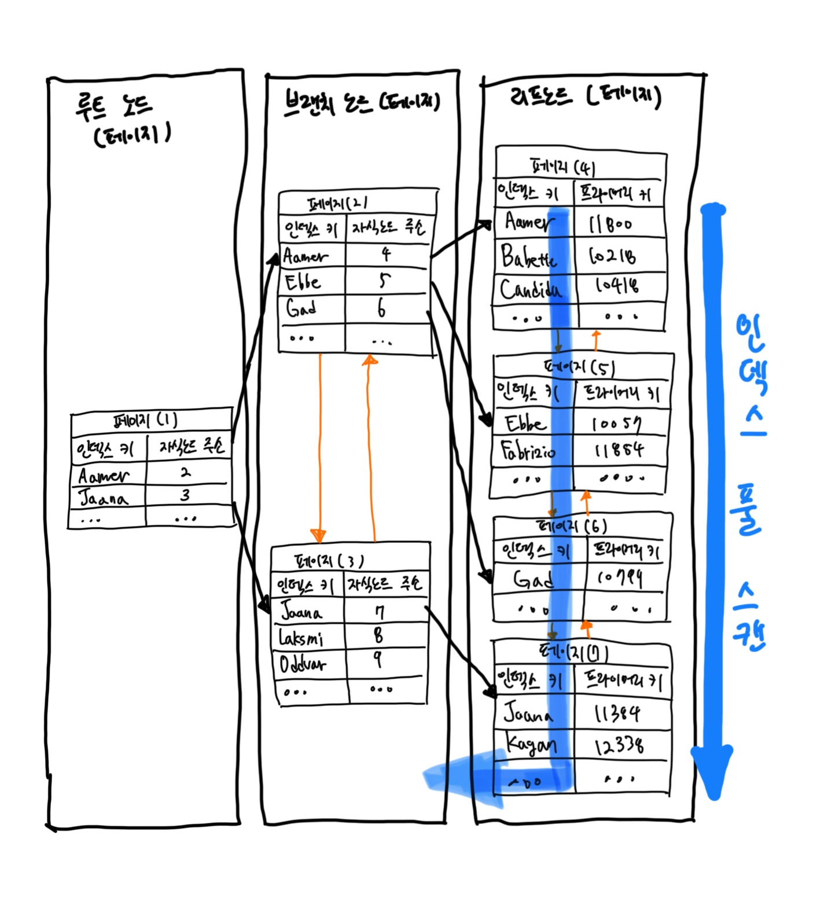

# 인덱스

- 각 인덱스의 특성과 차이는 상당히 중요하며, 물리 수준의 모델링을 할 때도 중요한 요소가 될 것이다.

## 1. 디스크 읽기 방식

- "Random I/O"와 "Sequential I/O"의 개념 먼저.
- 데이터베이스 성능 튜닝은 어떻게 디스크 I/O를 줄이느냐가 관건일 때가 상당히 많다.

### 1-1. 하드 디스크 드라이브(HDD)와 솔리드 스테이트 드라이브(SSD)

- 컴퓨터에서 CPU나 메모리 같은 주요 장치는 대부분 전자식 장치지만 하드 디스크 드라이브는 기계식 장치다.
  - 그래서 데이터베이스 서버에서는 항상 디스크 장치가 병목이 된다.
  - 기계식 하드 디스크 드라이브를 대체하기 위해 전자식 저장 매체인 SDD가 떠오르고 있다.
- SDD는 데이터 저장용 플래터(원판)를 제거하고 그 대신 플래시 메모리를 장착하고 있다.
  - 원판 회전 없이 아주 빨리 데이터를 읽을 수 있다.
  - 플래시 메모리는 전원이 공급되지 않아도 데이터가 삭제되지 않는다.
  - 그리고 컴퓨터의 메모리(D-RAM)보다는 느리지만 기계식 하드 디스크 드라이브보다는 훨씬 빠르다.
- 메모리와 디스크의 처리 속도 => 10만 배 차이
- 메모리와 SDD 처리 속도 => 1000배 차이

### 1-2. 랜덤 I/O와 순차 I/O

- Random I/O라는 표현은 하드 디스크 드라이브의 플래터(원판)를 돌려서 읽어야 할 데이터가 저장된 위치로 디스크 헤더를 이동시킨 다음 데이터를 읽는 것을 의미하는데, 사실 순차 I/O 또한 이 작업 과정은 같다.
- 순차 I/O는 3개의 페이지(3 x 16KB)를 디스크에 기록하기 위해 1번 시스템 콜을 요청했지만, 랜덤 I/O는 3개의 페이지를 디스크에 기록하기 위해 3번 시스템 콜을 요청한다.
  - 즉 순차 I/O는 헤드를 1번만 움직이고, 랜덤 I/O는 헤드를 3번 움직여야 한다.
  - 결국 순차 I/O는 랜덤 I/O보다 3배 정도 빠르다고 볼 수 있다. (디스크의 성능은 디스크 헤더의 위치 이동 없이 얼마나 많은 데이터를 한 번에 기록하느냐에 의해 결정)
  - SDD도 마찬가지다.
- 사실 쿼리를 튜닝해서 랜덤 I/O를 순차 I/O로 바꿔서 실행할 방법은 그다지 많지 않다.
  - 일반적으로 쿼리를 튜닝하는 것은 랜덤 I/O 자체를 줄여주는 것이 목적이라고 할 수 있다.
  - 여기서 랜덤 I/O를 줄인다는 것은 쿼리를 처리하는 데 꼭 필요한 데이터만 읽도록 개선하는 것을 의미한다.

> #### 참고
> - 랜덤 I/O나 순차 I/O 모두 파일에 쓰기를 실행하면 반드시 동기화(fsync 또는 flush 작업)가 필요하다.
> - 그런데 순차 I/O인 경우에도 이러한 파일 동기화 작업이 빈번히 발생한다면 랜덤 I/O와 같이 비효율적인 형태로 처리될 때가 많다.
> - 기업용으로 사용하는 데이터베이스 서버에는 캐시 메모리가 장착된 RAID 컨트롤러가 일반적으로 사용되는데, RAID 컨트롤러의 캐시 메모리는 아주 빈번한 파일 동기화 작업이 호출되는 순차 I/O를 효율적으로 처리될 수 있게 변환하는 역할을 한다.
> - 하드 디스크 드라이브뿐만 아니라 SSD를 사용하는 경우에도 여전히 RAID 컨트롤러는 중요한 역할을 하기 때문에 RAID 컨트롤러와 RAID 컨트롤러에 장착된 캐시의 성능을 무시하지 말자.

> #### 참고
> - 인덱스 레인지 스캔은 데이터를 읽기 위해 주로 랜덤 I/O를 사용하며, 풀 테이블 스캔은 순차 I/O를 사용한다.
> - 그래서 큰 테이블의 레코드 대부분을 읽는 작업에서는 인덱스를 사용하지 않고 풀 테이블 스캔을 사용하도록 유도할 때도 있다.
> - 이는 순차 I/O가 랜덤 I/O보다 훨씬 빨리 많은 레코드를 읽어올 수 있기 때문인데, 이런 형태는 OLTP(OnLine Transaction Processing) 성격의 웹 서비스보다는 데이터 웨어하우스나 통계 작업에서 자주 사용된다.

<br/>

## 2. 인덱스란?

- DBMS에서 테이블의 모든 데이터를 검색해서 원하는 결과를 가져오려면 시간이 오래 걸린다.
  - 그래서 칼럼의 값과 해당 레코드가 저장된 주소를 키와 값의 쌍(key-value pair)로 삼아 인덱스를 만들어 두는 것이다.
  - 칼럼의 값을 주어진 순서대로 정렬해서 보관한다.
- SortedList가 DBMS의 인덱스와 같은 자료 구조이며, ArrayList는 데이터 파일과 같은 자료 구조를 사용한다.
  - SortedList는 항상 값이 정렬된 상태로 유지하는 자료 구조
  - ArrayList는 값을 저장하는 순서 그대로 유지하는 자료 구조
- SortedList는 데이터가 저장될 때마다 항상 값을 정렬해야 하므로 저장하는 과정이 복잡하고 느리지만,이미 정렬돼 있어서 아주 빨리 원하는 값을 찾아올 수 있다.
  - DBMS도 마찬가지로 INSERT나 UPDAET, DELETE 문장의 처리가 느려진다. 하지만 SELECT 문은 매우 빠르게 처리할 수 있다.
- 결론적으로 DBMS에서 인덱스는 데이터의 저장(INSERT, UPDATE, DELETE) 성능을 희생하고 그 대신 데이터의 읽기 속도를 높이는 기능이다.
  - 테이블의 인덱스를 하나 더 추가할지 말지는 데이터의 저장 속도를 어디까지 희생할 수 있는지, 읽기 속도를 얼마나 더 빠르게 만들어야 하느냐에 따라 결정해야 한다.
  - 인덱스의 크기가 비대해지면 저장 성능이 떨어지고 역효과를 불러올 수 있다.

#### 역할별 분류

- 인덱스를 역할별로 구분해 본다면 `프라이머리 키 Primary Key`와 `보조 키. 세컨더리 인덱스 Secondary Key`로 구분할 수 있다.
- 프라이머리 키는 이미 잘 아는 것처럼 그 레코드를 대표하는 칼럼의 값으로 만들어진 인덱스를 의마한다. 이 칼럼은 테이블에서 해당 레코드를 식별할 수 있는 기준값이 되기 때문에 우리는 이를 식별자라고도 부른다. 프라이머리 키는 NULL 값을 허용하지 않으며 중복을 허용하지 않는 것이 특징이다.
- 프라이머리 키를 제외한 나머지 모든 인덱스는 세컨더리 인덱스로 분류한다. 유니크 인덱스는 프라이머리 키와 성격이 비슷하고 프라이머리 키를 대체해서 사용할 수도 있다고 해서 대체 키라고도 하는데, 별도로 분류하기도 하고 그냥 세컨더리 인덱스로 분류하기도 한다.

#### 알고리즘별 분류
 
- 상당히 많은 분류가 가능하겠지만, 대표적으로 `B-Tree 인덱스`와 `Hash 인덱스`로 구분할 수 있다.
- B-Tree 알고리즘은 가장 일반적으로 사용되는 인덱스 알고리즘이다. (상당히 성숙)
  - B-Tree 인덱스는 칼럼의 값을 변형하지 않고 원래의 값을 이용해 인덱싱하는 알고리즘이다.
  - MySQL 서버에서는 위치 기반 검색을 지원하기 위한 R-Tree 인덱스 알고리즘도 있지만, 결국 R-Tree 인덱스는 B-Tree의 응용 알고리즘으로 볼 수 있다.
- Hash 인덱스 알고리즘은 칼럼의 값으로 해시값을 계산해서 인덱싱하는 알고리즘으로 매우 빠른 검색을 지원한다.
  - 하지만 값을 변형해서 인덱싱하므로 전방(Prefix) 일치와 같이 값의 일부만 검색하거나 범위를 검색할 때는 해시 인덱스를 사용할 수 없다.
  - Hash 인덱스는 주로 메모리 기반의 데이터베이스에서 많이 사용한다.

#### 중복 허용 여부

- `유니크 인덱스 Unique Index`와 `유니크하지 않은 인덱스 Non-Unique Index`로 구분할 수 있다.
- 실제 DBMS의 쿼리를 실행해야 하는 옵티마이저에게는 유니크함이 상당히 중요한 문제가 된다.
  - 동등 조건으로 검색한다는 건 항상 1건의 레코드만 찾으면 더 찾지 않아도 된다는 것을 옵티마이저에게 알려주는 효과를 낸다.

<br/>

## 3. B-Tree 인덱스

- Balanced Tree
- 여러 변형된 형태의 알고리즘이 있는데, 일반적으로 B+-Tree나 B*-Tree가 사용된다.
- B-Tree는 칼럼의 원래 값을 변형시키지 않고 인덱스 구조체 내에서는 항상 정렬된 상태로 유지한다.
  - 전문 검색과 같은 특수한 요건이 아닌 경우, 대부분 인덱스는 거의 B-Tree를 사용할 정도로 일반적인 용도에 적합한 알고리즘이다.

### 3-1. 구조 및 특성

- B-Tree는 트리 구조의 최상위에 하나의 `루트 노드 Root Node`가 존재하고 그 하위에 자식 노드가 붙어 있는 형태다.
  - 가장 하위에 있는 노드를 `리프 노드 Leaf Node`라 하고, 중간의 노드를 `브랜치 노드 Branch Node`라고 한다.
  - 데이터베이스에서 인덱스와 실제 데이터가 저장된 데이터는 따로 관리되는데, 인덱스의 리프 노드는 항상 실제 데이터 레코드를 찾아가기 위한 주솟값을 가지고 있다.


- 인덱스의 키 값은 모두 정렬돼 있지만, 데이터 파일의 레코드는 정렬돼 있지 않고 임의의 순서로 저장돼 있다.

> #### 참고
> - 대부분 RDBMS의 데이터 파일에서 레코드는 특정 기준으로 정렬되지 않고 임의의 순서로 저장된다.
> - 하지만 InnoDB 테이블에서 레코드는 클러스터되어 디스크에 저장되므로 기본적으로 프라이머리 키 순서로 정렬되어 저장된다.
> - InnoDB에서는 사용자가 별도의 명령이나 옵션을 선택하지 않아도 디폴트로 클러스터링 테이블이 생성된다. 클러스터링이란 비슷한 값을 최대한 모아서 저장하는 방식을 의미한다.


- 위 그림은 MyISAM 테이블의 인덱스와 데이터 파일의 관계다.
  - `레코드 주소`는 MyISAM 테이블의 생성 옵션에 따라 레코드가 테이블에 INSERT된 순번이거나 데이터 파일 내의 위치(Offset)다.
- 반면 InnoDB의 세컨더리 인덱스는 데이터 파일 또한 프라이머리 키를 인덱스 키로 한 루트 노드, 브랜치 노드, 리프 노드 형태로 구성되어 있기 때문에 2번의 검색 과정을 거쳐야 한다.
  - InnoDB 테이블의 성능이 떨어질 것처럼 보이지만 사실은 MyISAM 인덱스 구조와 InnoDB 인덱스 구조는 각각 장단점을 가지고 있다.

### 3-2. B-Tree 인덱스 키 추가 및 삭제

#### 3-2-1. 인덱스 키 추가

- 새로운 키 값이 B-Tree에 저장될 때 테이블의 스토리지 엔진에 따라 새로운 키 값이 즉시 인덱스에 저장될 수도 있고, 그렇지 않을 수도 있다.
  - B-Tree에 저장될 때는 저장될 키 값을 이용해 B-Tree 상의 적절한 위치를 검색해야 한다. 저장될 위치가 결정되면 레코드의 키 값과 대상 레코드의 주소 정보를 B-Tree의 리프 노드에 저장한다.
  - 리프 노드가 꽉 차서 더는 저장할 수 없을 때 리프 노드가 분리(Split)돼야 하는데, 이는 상위 브랜치 노드까지 처리의 범위가 넓어진다.
  - 이러한 작업 탓에 B-Tree는 상대적으로 쓰기 작업(새로운 키를 추가하는 작업)에 비용이 많이 드는 것으로 알려졌다.
- 대략적으로 인덱스를 추가하는 비용 계산하기
  - 테이블에 레코드를 추가하는 작업 비용이 1이라고 가정하면 해당 테이블의 인덱스에 키를 추가하는 작업 비용을 1.5 정도로 예측하는 것이다.
  - 일반적으로 테이블에 인덱스가 3개가 있다면? 1 + 1.5*3 = 5.5의 비용 정도로 예측한다.

#### 3-2-2. 인덱스 키 삭제

- 해당 키 값이 저장된 B-Tree의 리프 노드를 찾아서 그냥 삭제 마크만 하면 작업이 완료된다.
  - 이렇게 삭제 마킹된 인덱스 키 공간은 계속 그대로 방치하거나 재활용할 수 있다.
  - 인덱스 키 삭제로 인한 마킹 작업 또한 디스크 쓰기가 필요하므로 이 작업 역시 디스크 I/O가 필요한 작업이다.
- MySQL 5.5 이상 버전의 InnoDB 스토리지 엔진에서는 이 작업 또한 버퍼링되어 지연 처리될 수도 있다.
  - 처리가 지연된 인덱스 키 삭제 또한 사용자에게는 특별한 악영향 없이 MySQL 서버가 내부적으로 처리하므로 특별히 걱정할 것은 없다.
- MyISAM이나 MEMORY 스토리지 엔진의 테이블에서는 체인지 버퍼와 같은 기능이 없으므로 인덱스 키 삭제가 완료된 후 쿼리 실행이 완료된다.

#### 3-2-3. 인덱스 키 변경

- 인덱스의 키 값은 그 값에 따라 저장될 리프 노드의 위치가 결정되므로 B-Tree의 키 값이 변경되는 경우에는 단순히 인덱스 상의 키 값만 변경하는 것은 불가능하다.
  - 먼저 키 값을 삭제한 후, 다시 새로운 키 값을 추가하는 형태로 처리된다.

#### 3-2-4 인덱스 키 검색

- B-Tree의 루트 노드부터 시작해 브랜치 노드를 거쳐 최종 리프 노드까지 이동하면서 비교 작업을 수행하는데, 이 과정을 "트리 탐색"이라고 한다.
- B-Tree 인덱스를 이용한 검색은 100% 일치 또는 값의 앞부분(Left-most part)만 일치하는 경우에 사용할 수 있다. 또한 부등호 비교 조건에서도 인덱스를 활용할 수 있다.
- 반면 인덱스를 구성하는 키 값의 뒤부분만 검색하는 용도로는 인덱스를 사용할 수 없다.
  - 인덱스의 키 값에 변형이 가해진 후 비교되는 경우에는 절대 B-Tree 검색이 되지 않는다. (함수나 연산을 수행한 결과로 정렬을 하거나 검색)

### 3-3. B-Tree 인덱스 사용에 영향을 미치는 요소

- 칼럼의 크기, 레코드의 건수, 유니크한 인덱스 키 값의 개수 등에 의해 검색이나 변경 작업의 성능이 영향을 받는다.

#### 3-3-1. 인덱스 키 값의 크기

- InnoDB 스토리지 엔진은 디스크에 데이터를 저장하는 가장 기본 단위를 `페이지 Page` 또는 `블록 Block`이라고 하며, 디스크의 모든 읽기 및 쓰기 작업의 최소 단위가 된다.
  - 버퍼 풀에서 데이터를 버퍼링하는 기본 단위이기도 하다.
  - 인덱스도 결국 페이지 단위로 관리되며, 루트와 브랜치 그리고 리프 토드를 구분한 기준이 바로 페이지 단위다.
- 이진 트리는 각 노드가 자식 노드를 2개만 가지는 것과 다르게 B-Tree는 자식 노드의 개수가 가변적인 구조다.
  - 그렇다면 자식 노드를 몇 개까지 가질가? 그것을 바로 인덱스의 페이지 크기와 키 값의 크기에 따라 결정된다.
  - MySQL 5.7 버전부터는 InnoDB 스토리지 엔진의 페이지 크기를 `innodb_page_size` 시스템 변수를 이용해 4KB ~ 64KB 사이의 값을 선택할 수 있지만 기본값은 16KB이다.
- 인덱스의 키가 16바이트라고 가정하면 다음 그림과 같이 인덱스 페이지가 구성될 것이다.


- 자식노드 주소는  여러 가지 복합적인 정보가 담긴 영역이며 페이지의 종류별로 대략 6바이트에서 12바이트까지 다양한 크기의 값을 가질 수 있다.
- 그렇다면 하나의 인덱스 페이지(16KB)에 몇 개의 키를 저장할 수 있을까?
  - 16 * 1024 / (16+12) = 585개를 저장할 수 있다.
- 따라서 인덱스 값이 커지면 커질수록 한 페이지에 저장할 수 있는 인덱스 키는 줄어들게 된다.
  - 인덱스의 키 값이 커지면 디스크로부터 읽어야 하는 횟수가 늘어나고, 그만큼 느려진다는 것을 의미한다.

#### 3-3-2. B-Tree 깊이

- B-Tree의 Depth는 상당히 중요하지만 직접 제어할 방법이 없다.
- B-Tree 깊이가 3인 경우 최대 몇 개의 키 값을 가질 수 있을가?
  - 16바이트인 경우 최대 2억(585 * 585 * 585)개 정도의 키 값을 담을 수 있다.
  - 32바이트로 늘어나면 5천만(372 * 372 * 372)개로 줄어든다.
- B-Tree의 깊이는 MySQL에서 값을 검색할 때 몇 번이나 랜덤하게 디스크를 읽어야 하는지와 직결되는 문제다.
  - 결론적으로 인덱스 키 값의 크기가 커지면 키질수록 하나의 인덱스 페이지가 담을 수 있는 인덱스 키 값의 개수가 적어지고, 그 때문에 같은 레코드 건수라 하더라도 B-Tree의 깊이가 깊어져서 디스크 읽기가 더 많이 필요하게 된다는 것을 의미한다.
- 보통 아무리 깊어도 5단계 이상까지 깊어지는 경우가 흔치 않다.

#### 3-3-3. 선택도 (기수성, Cardinality)

- `선택도 Selectiviry` 또는 `기수성 Cardinality`은 거의 같은 의미로 사용되며, 모든 인덱스 키 값 가운데 유니크한 값의 수를 의미한다.
  - 전체 인덱스 키 값은 100개인데, 그중에서 유니크한 값의 수는 10개라면 기수성은 10이다.
  - 인덱스 키 값 가운데 중복된 값이 많아지면 많아질수록 기수성은 낮아지고 동시에 선택도 또한 떨어진다.

> #### 참고
> - 선택도가 좋지 않다고 하더라도 정렬이나 그루핑과 같은 작업을 위해 인덱스를 만드는 것이 훨씬 나은 경우도 많다. 인덱스가 항상 검색에만 사용되는 것은 아니므로 여러 가지 용도를 고려해 적절히 인덱스를 설계할 필요가 있다.

- 인덱스에서 유니크한 값의 개수는 인덱스나 쿼리의 효율성에 큰 영향을 미친다.

#### 3-3-4. 읽어야 하는 레코드 건수

- 인덱스를 통해 테이블의 레코드를 읽는 것은 인덱스를 거치지 않고 바로 테이블의 레코드를 읽는 것보다 높은 비용이 드는 작업니다.
- 인덱스를 이용한 읽기의 손익 분기점이 얼마인지 판단할 필요가 있는데, 일반적인 DBMS의 옵티마이저에서는 인덱스를 통해 레코드 1건을 읽는 것이 테이블에서 직접 레코드 1건을 읽는 것보다 4~5배 정도 비용이 더 많이 드는 작업인 것으로 예측한다.
  - 즉, 인덱스를 통해 읽어야 할 레코드의 건수가 전체 테이블 레코드의 20~25%를 넘어서면 인덱스를 이용하지 않고 테이블을 모두 직접 읽어서 필요한 레코드만 가녀래는 방식으로 처리하는 것이 효율적이다.

### 3-4. B-Tree 인덱스를 통한 데이터 읽기

- 어떤 경우에 인덱스를 사용하게 유도할지, 또는 사용하지 못하게 할지 판단하려면 MySQL이 어떻게 인덱스를 이용해서 실제 레코드를 읽어 내는지 알아야 한다.
- 대표적인 세 가지 방법을 알아보자.

#### 3-4-1. 인덱스 레인지 스캔

- 가장 대표적인 접근 방식. 뒤의 2가지 방식보다는 빠른 방법
- 만약 아래와 같은 쿼리를 실행한다면 B-Tree를 어떻게 스캔할까?

```shell
mysql> SELECT * FROM employees WHERE first_name BETWEEN 'Ebbe' AND 'Gad';
```


- 인덱스 레인지 스캔은 검색해야 할 인덱스의 범위가 결정됐을 때 사용하는 방식이다.
  - 검색하려는 값의 수나 검색 결과 레코드 건수와 관계없이 레인지 스캔이라고 표현한다.
  - 루트 노드에서부터 비교를 시작해 브랜치 노드를 거치고 최종적으로 리프 노드까지 찾아 들어가야만 비로소 필요한 레코드의 시작 지점을 찾을 수 있다.
  - 만약 스캔하다가 리프 노드의 끝까지 읽으면 리프 노드 간의 링크를 이용해 다음 리프 노드를 찾아서 다시 스캔한다.
  - 그리고 최종적으로 스캔을 멈춰야 할 위치에 다다르면 지금까지 읽은 레코드를 사용자에게 반환하고 쿼리를 끝낸다.
- 한 가지 중요한 것은 인덱스의 리프 노드에서 검색 조건에 일치하는 건들은 데이터 파일에서 레코드를 읽어오는 과정이 필요하다는 것이다.
  - 이때 리프 노드에 저장된 레코드 주소로 데이터 파일의 레코드를 읽어오는데 레코드 한 건 한 건 단위로 랜덤 I/O가 한 번씩 일어난다.
  - 만약 3건의 레코드가 검색 조건에 일치했다고 가정하면, 데이터 레코드를 읽기 위해 랜덤 I/O가 최대 3번 필요하다. (인덱스 순서대로 레코드가 저장되리란 법이 없기 때문이다.)
  - 그래서 인덱스를 통해 데이터 레코드를 읽는 작업은 비용이 많이 드는 작업으로 분류된다.
- 정리하자면 인덱스 레인지 스캔은 다음과 같이 크게 3단계를 거친다.
1. 인덱스에서 조건을 만족하는 값이 저장된 위치를 찾는다. 이 과정을 `인덱스 탐색 index seek`이라고 한다.
2. 1번에서 탐색된 위치부터 필요한 만큼 인덱스를 차례대로 쭉 읽는다. 이 과정을 `인덱스 스캔 index scan`이라고 한다. (1번과 2번을 합쳐서 인덱스 스캔으로 통칭하기도 한다.)
3. 2번에서 읽어 들인 인덱스 키와 레코드 주소를 이용해 레코드가 저장된 페이지를 가져오고, 최종 레코드를 읽어 온다.

- 쿼리가 필요로 하는 데이터에 따라 3번 과정은 필요하지 않을 수도 있는데, 이를 커버링 인덱스라고 한다.
  - 커버링 인덱스로 처리되는 쿼리는 디스크의 레코드를 읽지 않아도 되기 때문에 랜덤 읽기가 상당히 줄어들고 성능은 그만큼 빨라진다.

#### 3-4-2. 인덱스 풀 스캔

- 인덱스 레인지 스캔과 달리 인덱스의 처음부터 끝까지 모두 읽는 방식을 인덱스 풀 스캔이라고 한다.
  - 대표적으로 쿼리의 조건절에 사용된 칼럼이 인덱스의 첫 번째 칼럼이 아닌 경우 인덱스 풀스캔 방식이 사용된다.
  - 예를 들어 인덱스는 A, B, C 칼럼의 순서로 만들어져 있지만 쿼리의 조건절은 B 칼럼이나 C칼럼으로 검색하는 경우다.
- 일반적으로 인덱스의 크기는 테이블의 크기보다 작으므로 직접 테이블을 처음부터 끝까지 읽는 것보다는 인덱스만 읽는 것이 효율적이다.
  - 쿼리가 인덱스에 명시된 칼럼만으로 조건을 처리할 수 있는 경우 주로 이 방식이 사용된다.
  - 인덱스뿐만 아니라 데이터 레코드까지 모두 읽어야 한다면 절대 이방식으로 처리되지 않는다.



- 먼저 인덱스 리프 노드의 제일 앞 또는 제일 뒤로 이동한 후, 인덱스 리프 노드를 연결하는 링크드 리스트를 따라서 처음부터 끝까지 스캔하는 방식이다.
  - 인덱스 레인지 스캔보다는 빠르지 않지만 테이블 풀 스캔보다는 효율적이다. (테이블 레코드를 읽을 필요가 없기 때문)

> #### 주의
> - 보통 "인덱스를 사용한다"라고 표현하는 것은 `인덱스 레인지 스캔`이나 `루스 인덱스 스캔` 방식으로 인덱스를 사용한다는 것을 의미한다.
> - 인덱스 풀 스캔 방식 또한 인덱스를 이용하는 것이지만 효율적인 방식은 아니며, 일반적으로 인덱스를 생성하는 목적은 아니다.
> - `인덱스 풀 스캔` 방식으로 인덱스를 사용하는 경우 "인덱스를 사용하지 못한다" 또는 "인덱스를 효율적으로 사용하지 못한다"라는 표현을 사용한다.

#### 3-4-3. 루스 인덱스 스캔

- 루스 인덱스 스캔이란 말 그대로 느슨하게 듬성듬성하게 인덱스를 읽는 것을 의미한다.
  - 인덱스 레인지 스캔과 비슷하게 동작하지만 중간에 필요치 않은 인덱스 키 값은 `무시 SKIP`하고 다음으로 넘어가는 형태로 처리한다.
  - 일반적으로 `GROUP BY` 또는 집합 함수 가운데 `MAX()` 또는 `MIN()` 함수에 대해 최적화를 하는 경우에 사용된다.
  - 오라클과 같은 DBMS의 `인덱스 스킵 스캔`이라고 하는 기능과 작동 방식이 비슷하지만, MySQL에서는 `루스 인덱스 스캔`이라고 한다.

```shell
mysql> SELECT dept_no, MIN(emp_no)
       FROM dept_emp
       WHERE dept_no BETWEEN 'd002' AND 'd004'
       GROUP BY dept_no;
```


- 이 쿼리에서는 위 그림과 같이 dept_no 그룹별로 첫 번째 레코드의 emp_no 값만 읽으면 된다.
  - 즉 인덱스에서 WHERE 조건을 만족하는 범위 전체를 다 스캔할 필요가 없다는 것을 옵티마이저는 알고 있기 때문에 조건에 만족하지 않는 레코드는 무시하고 다음 레코드로 이동한다.

#### 3-4-4 인덱스 스킵 스캔

- MySQL 8.0 버전부터는 옵티마이저가 `인덱스 스킵 스캔`을 지원한다. 
- 데이터베이스 서버에서 인덱스의 핵심은 값이 정렬돼 있다는 것이며, 이로 인해 인덱스를 구성하는 칼럼의 순서가 매우 중요하다.
- 만약 `birth_date`와 `gender`이 한 묶음으로 인덱스가 걸려 있는 경우 `birth_date`만 WHERE 절에 넣어 검색하면 어떻게 될까?

```shell
mysql> ALTER TABLE employees
       ADD INDEX ix_gender_birthdate (gender, birth_date);

mysql> SET optimizer_switch='skip_scan=OFF';

mysql> EXPLAIN
       SELECT gender, birth_date
       FROM employees
       WHERE birth_date >= '1965-02-01';
+----+-------------+-----------+-------+---------------+---------------------+---------+--------+----------+--------------------------+
| id | select_type | table     | type  | possible_keys | key                 | key_len | rows   | filtered | Extra                    |
+----+-------------+-----------+-------+---------------+---------------------+---------+--------+----------+--------------------------+
|  1 | SIMPLE      | employees | index | NULL          | ix_gender_birthdate | 4       | 299922 |    33.33 | Using where; Using index |
+----+-------------+-----------+-------+---------------+---------------------+---------+--------+----------+--------------------------+
1 row in set, 1 warning (0.01 sec)
```
  
- 인덱스 스킵 스캔 기능이 비활성화되면 `풀 인덱스 스캔`을 해버린다.
  - `type`이 `index`라고 표시된 것이 인덱스를 처음부터 끝까지 읽었다는 의미이다. => 인덱스를 비효율적으로 사용했다는 의미
- 그렇다면 `인덱스 스킵 스캔`을 활성화하고, 동일 쿼리를 다시 실행하면?

```shell
mysql> SET optimizer_switch='skip_scan=ON';

mysql> EXPLAIN
       SELECT gender, birth_date
       FROM employees
       WHERE birth_date >= '1965-02-01';
+----+-------------+-----------+-------+---------------------+---------------------+---------+-------+----------+----------------------------------------+
| id | select_type | table     | type  | possible_keys       | key                 | key_len | rows  | filtered | Extra                                  |
+----+-------------+-----------+-------+---------------------+---------------------+---------+-------+----------+----------------------------------------+
|  1 | SIMPLE      | employees | range | ix_gender_birthdate | ix_gender_birthdate | 4       | 99964 |   100.00 | Using where; Using index for skip scan |
+----+-------------+-----------+-------+---------------------+---------------------+---------+-------+----------+----------------------------------------+
1 row in set, 1 warning (0.00 sec)
```

- 여기서 `type`이 `range`라는 것은 인덱스에서 필요한 부분만 읽었다는 것을 의미한다.
  - 그리고 실행 계획의 `Extra` 칼럼에 `Using index for skip scan`이라는 문구가 표시 됐다. 
  - 위 실행 계획을 분석해보면, `ix_gender_birthdate` 인덱스를 사용해 `인덱스 스킵 스캔`을 사용했다는 의미다.


- `gender` 칼럼은 성별을 구분하는 칼럼으로 `M`과 `F` 값만 가지는 ENUM 타입의 칼럼이다.
  - 따라서 `gender` 칼럼에 대해 가능한 값 2개를 구한 다음, 옵티마이저는 내부적으로 아래 2개의 쿼리를 실행하는 것과 비슷한 형태의 최적화를 실행하게 된다.

```mysql
SELECT gender, birth_date FROM employees WHERE gender='M' birth_date >= '1965-02-01';
SELECT gender, birth_date FROM employees WHERE gender='Y' birth_date >= '1965-02-01';
```

> #### 주의
> - 여기서 gender가 ENUM 값이 아니더라도, 어떤 타입이든 루스 인덱스 스캔과 동일한 방식으로 읽으면서 인덱스에 존재하는 모든 값을 먼저 추출하고 그 결과를 이용해 인덱스 스킵 스캔을 실행한다.

- 인덱스 스킵 스캔은 다음과 같은 단점이 있다. (MySQL 8.0 기준)
  - WHERE 조건절에 조건이 없는 인덱스의 선행 칼럼의 유니크한 값의 개수가 적어야 함.
  - 쿼리가 인덱스에 존재하는 칼럼만으로 처리 가능해야 함(커버링 인덱스)
- 아래 예제처럼 커버링 인덱스가 아니라면 풀 스캔을 해야 한다.
  - `gender`와 `birth_date` 외에 다른 칼럼이 필요.

```shell
mysql> EXPLAIN
       SELECT *
       FROM employees
       WHERE birth_date >= '1965-02-01';
+----+-------------+-----------+------+---------------+------+---------+--------+----------+-------------+
| id | select_type | table     | type | possible_keys | key  | key_len | rows   | filtered | Extra       |
+----+-------------+-----------+------+---------------+------+---------+--------+----------+-------------+
|  1 | SIMPLE      | employees | ALL  | NULL          | NULL | NULL    | 299922 |    33.33 | Using where |
+----+-------------+-----------+------+---------------+------+---------+--------+----------+-------------+
1 row in set, 1 warning (0.00 sec)
```

<br/>

## 참고자료

- Real MySQL 8.0
