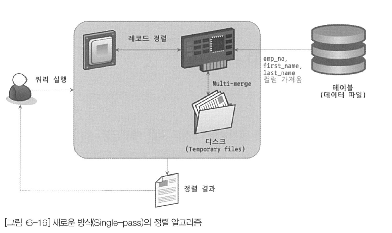
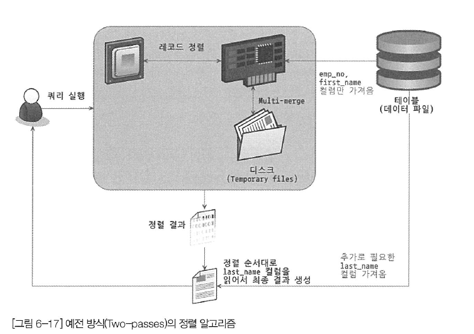

# 옵티마이저와 힌트

- 옵티마이저는 쿼리의 실행 계획을 수립하는 부분으로 가장 복잡하다.
- MySQL에서는 `EXPLAIN`이라는 명령으로 쿼리의 실행 계획을 확인할 수 있다. (상당히 많은 정보가 출력된다.)

## 1. 개요

### 1-1. 쿼리 실행 절차

- MySQL에서 쿼리가 실행되는 과정은 아래 세 단계이다.

1. SQL 파싱
   - 사용자로부터 요청된 SQL 문장을 잘게 쪼개서 MySQL 서버가 이해할 수 있는 수준으로 분리한다.
   - SQL 파서라는 모듈로 SQL 문장을 파싱한다.
   - 이 단계를 통해 SQL 파스 트리가 만들어지고 파스 트리를 통해 쿼리를 실행한다.
2. 최적화 및 실행 계획 수립
   - SQL의 파싱 정보를 확인하면서 어떤 테이블부터 읽고 어떤 인덱스를 이용해 테이블을 읽을지 결정한다.
   - SQL 파스 트리를 참조해 작업을 수행한다.
3. 실행 계획대로 작업 수행
   - 두 번째 단계에서 결정된 테이블의 읽기 순서나 선택된 인덱스를 이용해 스토리지 엔진으로부터 데이터를 가져온다.

- 2번째 단계인 "최적화 및 실행 계획 수립"은 첫 번째 단계에서 만들어진 SQL 파스 트리를 참조하면서 다음과 같은 내용을 처리한다.
  - 불필요한 조건 제거 및 복잡한 연산의 단순화
  - 여러 테이블의 조인이 있는 경우 어떤 순서로 테이블을 읽을지 결정
  - 각 테이블에 사용된 조건과 인덱스 통계 정보를 이용해 사용할 인덱스를 결정
  - 가져온 레코드들을 임시 테이블에 넣고 다시 한 번 가공해야 하는지 결정
- 첫 번째 단계와 두 번째 단계는 거의 MySQL 엔진에서 처리하며, 세 번째 단계는 MySQL 엔진과 스토리지 엔진이 동시에 참여해서 처리한다.
  - 두 번째 단계는 옵티마이저가 처리

<br/ >

### 1-2. 옵티마이저의 종류

- 옵티마이저는 데이터베이스의 두뇌 역할
- 대부분의 DBMS에서는 `비용 기반 최적확 Cost-Based Optimizer, CBO` 방법을 사용한다.
- 예전에 오라클에서 많이 사용했던 `규칙 기반 최적화 Rule-Based Optimizer` 방법도 있다.

### 비용 기반 최적화

- 쿼리를 처리하기 위한 여러 가지 가능한 방법을 만들고, 각 단위 작업의 비용 정보와 대상 테이블의 예측된 통계 정보를 이용해 실행 계획별로 비용을 산출한다.
- 이렇게 산출된 실행 방법 별로 비용이 최소로 소요되는 처리 방식을 사용해 최종적으로 쿼리 실행

### 규칙 기반 최적화

- 이제 거의 사용되지 않는 방법
- 옵티마이저에 내장된 우선순위에 따라 실행 계획을 수립하는 방식
- 통계 정보(테이블의 레코드 건수, 칼럼값의 분포도)를 조사하지 않고 실행 계획이 수립되기 때문에 같은 쿼리에 대해서 거의 항상 같은 방법 실행 방법을 만들어낸다.

<br/ >

## 2. 기본 데이터 처리

- 기본적으로 정렬 및 그루핑 등의 기본 데이터 가공 기능을 가지고 있다.
- 하지만 결과물은 동일하더라도 RDBMS별로 그 결과를 만들어 내는 과정은 천차만별이다.

### 2-1. 풀 테이블 스캔

- 옵티마이저는 아래와 같은 조건일 때 주로 풀 테이블 스캔을 선택한다.
  - 테이블의 레코드 건수가 너무 작아서 인덱스를 통해 읽는 것보다 풀 테이블 스캔을 하는 편이 더 빠른 경우 (일반적으로 테이블이 페이지 1개로 구성된 경우)
  - WHERE 절이나 ON 절에 인덱스를 이용할 수 있는 적절한 조건이 없는 경우
  - 인덱스 레인지 스캔을 사용할 수 있는 쿼리라고 하더라도 옵티마이저가 판단한 조건 일치 레코드 건수가 너무 많은 경우 (인덱스의 B-Tree를 샘플링해서 조사한 통계 정보 기준)
- 대부분의 DBMS는 풀 테이블 스캔을 실행할 때 한꺼번에 여러 개의 블록이나 페이지를 읽어오는 기능을 내장하고 있다.
  - 하지만 MySQL에는 풀 테이블 스캔을 실행할 때 한꺼번에 몇 개씩 페이지를 읽어올지 설정하는 시스템 변수는 없다.
  - 그래서 많은 사람들이 MySQL은 풀 테이블 스캔을 실행할 때 디스크로부터 페이지를 하나씩 읽어 온다고 생각하지만 그것은 착각이다.
- MyISAM에서 풀 테이블 스캔을 할 때는 디스크로부터 페이지를 하나씩 읽어오지만 InnoDB의 작동 방식은 약간 다르다.
  - InnoDB 스토리지 엔진은 특정 테이블의 연속된 데이터 페이지가 읽히면 백그라운드 스레드에 의해 `리드 어헤드 Read ahead` 작업이 자동으로 시작된다.
  - 여기서 `리드 어헤드`란 어떤 영역에서 데이터가 앞으로 필요해지리라는 것을 예측해서 요청이 오기 전에 미리 디스크에서 읽어 InnoDB의 버퍼 풀에 가져다 두는 것을 의미한다.
  - 즉, 풀 테이블 스캔이 실행되면 처음 몇 개의 데이터 페이지는 `포그라운드 스레드 (Foreground thread, 클라이언트 스레드)`가 페이지 읽기를 실행하지만, 특정 시점부터 백그라운드 스레드로 넘긴다.
  - 백그라운드 스레드가 읽기를 넘겨받으면 한 번에 4개 또는 8개씩 페이지를 읽으면서 계속 그 수를 증가시킨다. 이 때 한 번에 최대 64개의 데이터 페이지까지 읽어서 버퍼 풀에 저장해둔다.
  - 포그라운드 스레드는 버퍼 풀에 준비된 데이터만 가져다 사용하면 되기 때문에 쿼리가 상당히 빨리 처리되는 것이다.
- `innodb_read_ahead_threshold`라는 시스템 변수를 이용해 리드 어헤드를 언제 시작할지 임계값을 정할 수 있다.
  - 일반적으로 디폴트 설정으로도 충분하지만 데이터 웨어하우스용으로 MySQL을 사용한다면 이 옵션을 더 낮은 값으로 설정해서 더 빨리 리드 어헤드가 시작되게 유도하는 것도 좋은 방법이다.
- 리드 어헤드는 풀 테이블 스캔에서만 사용되는 것이 아니라 풀 인덱스 스캔에서도 동일하게 사용된다.

### 2-2. 병렬 처리

- MySQL 8.0부터 처음으로 쿼리의 병렬 처리가 가능해졌다.

> #### 주의
> - 여기서 말하는 병렬 처리는 하나의 쿼리를 여러 스레드가 작업을 나누어 동시에 처리하는 것을 의미한다.
> - 여러 개의 쿼리를 동시에 처리하는 것은 MySQL가 처음 만들어질 때부터 가능했다.

- `innodb_parallel_read_threads`라는 시스템 변수를 이용해 하나의 쿼리를 최대 몇 개의 스레드를 이용해서 처리할지를 변경할 수 있다.
- 하지만 아직 MySQL 서버에서는 쿼리를 여러 개의 스레드를 이용해 병럴로 처리하게 하는 힌트나 옵션은 없다.

```shell
mysql> SET SESSION innodb_parallel_read_threads=1;
mysql> SELECT COUNT(*) FROM salaries;
1 row in set (0.81 sec)

# 이 순간부터 쿼리가 개선되지 않는다.
mysql> SET SESSION innodb_parallel_read_threads=2;
mysql> SELECT COUNT(*) FROM salaries;
1 row in set (0.19 sec)

mysql> SET SESSION innodb_parallel_read_threads=4;
mysql> SELECT COUNT(*) FROM salaries;
1 row in set (0.19 sec)

mysql> SET SESSION innodb_parallel_read_threads=8;
mysql> SELECT COUNT(*) FROM salaries;
1 row in set (0.19 sec)
```

- 병렬 처리용 스레드 개수가 늘어날수록 쿼리 처리에 걸리는 시간이 줄어든다고 하나, 서버에 장착된 CPI의 코어 개수를 넘어가면 오히려 성능이 안 좋아진다고 한다.

### 2-3. ORDER BY 처리 (Using Filesort)

- 정렬을 처리하는 방법은 인덱스를 이용하는 방법과 쿼리가 실행될 때 Filesort라는 별도의 처리를 이용하는 방법으로 나눌 수 있다.

<table>
    <thead>
        <tr>
            <td></td>
            <td>장점</td>
            <td>단점</td>
        </tr>
    </thead>
    <tbody>
        <tr>
            <td>인덱스 이용</td>
            <td>INSERT, UPDATE, DELETE 쿼리가 실행될 때 이미 인덱스가 정렬되어 있어서 순서대로 읽기만 하면 되므로 매우 빠르다.</td>
            <td>INSERT, UPDATE, DELETE 작업 시 부가적인 인덱스 추가/삭제 작업이 필요하므로 느리다. 인덱스 때문에 디스크 공간이 더 많이 필요하다. 인덱스의 개수가 늘어날수록 InnoDB의 버퍼 풀을 위한 메모리가 많이 필요하다.</td>
        </tr>
        <tr>    
            <td>Filesort 이용</td>
            <td>인덱스를 생성하지 않아도 되므로 인덱스를 이용할 때의 단점이 장점으로 바뀐다. 정렬해야 할 레코드가 많지 않으면 메모리에서 Filesort가 처리되므로 충분히 빠르다.</td>
            <td>정렬 작업이 쿼리 실행 시 처리되므로 레코드 대상 건수가 많아질 수록 쿼리의 응답 속도가 느리다.</td>
        </tr>
    </tbody>
</table>

- 물론 레코드를 정렬하기 위해 항상 "Filesort"라는 정렬 작업을 거쳐야 하는 것은 아니다. 인덱스를 이용한 정렬도 가능하다.
- 하지만 아래와 같은 이유로 모든 정렬을 인덱스로 처리해 튜닝하기란 불가능하다.
  - 정렬 기준이 너무 많아서 요건별로 모두 인덱스를 생성하는 것이 불가능할 때
  - GROUP BY의 결과 또는 DISTINCT 같은 처리의 결과를 정렬해야할 때
  - UNION의 결과와 같이 임시 테이블의 결과를 다시 정렬해야할 때
  - 랜덤하게 결과 레코드를 가져와야할 때
- 별도의 정렬 처리를 수행했는지는 실행 계획의 Extra 칼럼에 "Using filesort" 메시지가 표시되는지 여부로 판단할 수 있다.

#### 2-3-1. 소트 버퍼

- MySQL에서는 정렬을 수행하기 위해 별도의 메모리 공간을 할당받아 사용하는데 이 메모리 공간을 `소트 버퍼 Sort buffer`라고 한다.
- 소트 버퍼는 정렬이 필요한 경우에만 할당되며, 버퍼의 크기는 정렬해야 할 레코드의 크기에 따라 가변적으로 증가하지만 최대 사용 가능한 소트 버퍼의 공간은 `sort_buffer_size`라는 시스템 변수로 설정할 수 있다. 
  - 할당된 메모리 공간은 쿼리 실행이 완료되면 바로 반납된다.
- 그런데 정렬이 왜 문제가 될까?
  - 정렬할 레코드가 아주 소량이어서 메모리에 할당된 소트 버퍼만으로 정렬할 수 있다면 아주 빠르게 정렬이 처리될 것이다.
- 하지만 정렬해야 할 레코드의 건수가 소트 버퍼로 할당된 공간보다 크다면 어떨까?
  - 정렬해야 할 레코드의 건수가 소트 버퍼보다 많아지면 레코드를 여러 조각으로 나눠 처리한다. 
  - 소트 버퍼에서 정렬을 수행하고 디스크에 임시로 저장해둔다. 이것을 반복한다. 
  - 각 버퍼의 크기만큼 정렬된 레코드를 다시 병합하면서 정렬을 수행해야 한다. `Multi-Merge 멀티 머지`
  - 수행된 멀티 머지 횟수는 `Sort_merge_passes`라는 상태 변수에 누적해서 집계된다.
- 이 작업들이 모두 디스크의 쓰기와 읽기를 유발하며, 레코드 건수가 많을수록 이 반복 작업의 횟수가 많아진다. 
  - 소트 버퍼를 크게 설정하면 디스크를 사용하지 않아서 더 빨라질 것으로 생각할 수도 있지만, 실제 벤치마크 결과로는 큰 차이를 보이진 않았다.
  - 256KB ~ 8MB에서 최적의 결과를 보임.
  - 너무 큰 메모리 할당은 성능을 떨어뜨린다.
- 필자에 의하면 적당한 소트버퍼의 크기는 56KB에서 1MB 미만 이라고 한다.
  - 소트 버퍼는 여러 클라이언트가 공유해서 사용할 수 있는 영역이 아니다.
  - 커넥션이 많으면 많을수록, 정렬 작업이 많으면 많을수록 소트 버퍼로 소비되는 메모리 공간이 커짐을 의미한다.

#### 2-3-2. 정렬 알고리즘

- 레코드 전체를 버퍼에 담을지, 정렬 기준 칼럼만 소트 버퍼에 담을지에 따라 `싱글 패스 Single-Pass`와 `투 패스 Two-Pass` 2가지로 모드를 나눌 수 있다.
- 정렬을 수행하는 쿼리가 어떤 정렬 모드를 사용하는지는 아래와 같이 옵티마이저 트레이스 기능으로 확인할 수 있다.

```shell
mysql> SET OPTIMIZER_TRACE="enabled=on",END_MARKERS_IN_JSON=on;
mysql> SET OPTIMIZER_TRACE_MAX_MEM_SIZE=1000000;
```

- 쿼리를 실행해보자.

```shell
mysql> SELECT * FROM employees ORDER BY last_name LIMIT 100000, 1;
+--------+------------+------------+-----------+--------+------------+
| emp_no | birth_date | first_name | last_name | gender | hire_date  |
+--------+------------+------------+-----------+--------+------------+
| 418804 | 1958-01-06 | Jacopo     | Gyimothy  | F      | 1997-06-20 |
+--------+------------+------------+-----------+--------+------------+
1 row in set (0.21 sec)
```

- 그리고 트레이션 쿼리를 날리면 옵티마이저의 트레이스 내용을 확인할 수 있다.

```shell
mysql> SELECT * FROM INFORMATION_SCHEMA.OPTIMIZER_TRACE \G
*************************** 1. row ***************************
                            QUERY: SELECT * FROM employees ORDER BY last_name LIMIT 100000, 1
                            TRACE: {
  "steps": [
    {
      "join_preparation": {
        "select#": 1,
        "steps": [
          {
            "expanded_query": "/* select#1 */ select `employees`.`emp_no` AS `emp_no`,`employees`.`birth_date` AS `birth_date`,`employees`.`first_name` AS `first_name`,`employees`.`last_name` AS `last_name`,`employees`.`gender` AS `gender`,`employees`.`hire_date` AS `hire_date` from `employees` order by `employees`.`last_name` limit 100000,1"
          }
        ] /* steps */
      } /* join_preparation */
    },
    {
      "join_optimization": {
        "select#": 1,
        "steps": [
          {
            "substitute_generated_columns": {
            } /* substitute_generated_columns */
          },
          {
            "table_dependencies": [
              {
                "table": "`employees`",
                "row_may_be_null": false,
                "map_bit": 0,
                "depends_on_map_bits": [
                ] /* depends_on_map_bits */
              }
            ] /* table_dependencies */
          },
          {
            "rows_estimation": [
              {
                "table": "`employees`",
                "table_scan": {
                  "rows": 300252,
                  "cost": 922.709
                } /* table_scan */
              }
            ] /* rows_estimation */
          },
          {
            "considered_execution_plans": [
              {
                "plan_prefix": [
                ] /* plan_prefix */,
                "table": "`employees`",
                "best_access_path": {
                  "considered_access_paths": [
                    {
                      "rows_to_scan": 300252,
                      "access_type": "scan",
                      "resulting_rows": 300252,
                      "cost": 30947.9,
                      "chosen": true
                    }
                  ] /* considered_access_paths */
                } /* best_access_path */,
                "condition_filtering_pct": 100,
                "rows_for_plan": 300252,
                "cost_for_plan": 30947.9,
                "chosen": true
              }
            ] /* considered_execution_plans */
          },
          {
            "attaching_conditions_to_tables": {
              "original_condition": null,
              "attached_conditions_computation": [
              ] /* attached_conditions_computation */,
              "attached_conditions_summary": [
                {
                  "table": "`employees`",
                  "attached": null
                }
              ] /* attached_conditions_summary */
            } /* attaching_conditions_to_tables */
          },
          {
            "optimizing_distinct_group_by_order_by": {
              "simplifying_order_by": {
                "original_clause": "`employees`.`last_name`",
                "items": [
                  {
                    "item": "`employees`.`last_name`"
                  }
                ] /* items */,
                "resulting_clause_is_simple": true,
                "resulting_clause": "`employees`.`last_name`"
              } /* simplifying_order_by */
            } /* optimizing_distinct_group_by_order_by */
          },
          {
            "finalizing_table_conditions": [
            ] /* finalizing_table_conditions */
          },
          {
            "refine_plan": [
              {
                "table": "`employees`"
              }
            ] /* refine_plan */
          },
          {
            "considering_tmp_tables": [
              {
                "adding_sort_to_table": "employees"
              } /* filesort */
            ] /* considering_tmp_tables */
          }
        ] /* steps */
      } /* join_optimization */
    },
    {
      "join_execution": {
        "select#": 1,
        "steps": [
          {
            "sorting_table": "employees",
            "filesort_information": [
              {
                "direction": "asc",
                "expression": "`employees`.`last_name`"
              }
            ] /* filesort_information */,
            "filesort_priority_queue_optimization": {
              "limit": 100001
            } /* filesort_priority_queue_optimization */,
            "filesort_execution": [
            ] /* filesort_execution */,
            "filesort_summary": {
              "memory_available": 262144,
              "key_size": 32,
              "row_size": 169,
              "max_rows_per_buffer": 1551,
              "num_rows_estimate": 300252,
              "num_rows_found": 300024,
              "num_initial_chunks_spilled_to_disk": 82,
              "peak_memory_used": 262144,
              "sort_algorithm": "std::stable_sort",
              "sort_mode": "<fixed_sort_key, packed_additional_fields>"
            } /* filesort_summary */
          }
        ] /* steps */
      } /* join_execution */
    }
  ] /* steps */
}
MISSING_BYTES_BEYOND_MAX_MEM_SIZE: 0
          INSUFFICIENT_PRIVILEGES: 0
1 row in set (0.00 sec)
```

- "filesort_summary" 섹션의 "sort_algorithm" 필드에 정렬 알고리즘이 표시된다.

```shell
"filesort_summary": {
  "memory_available": 262144,
  "key_size": 32,
  "row_size": 169,
  "max_rows_per_buffer": 1551,
  "num_rows_estimate": 300252,
  "num_rows_found": 300024,
  "num_initial_chunks_spilled_to_disk": 82,
  "peak_memory_used": 262144,
  "sort_algorithm": "std::stable_sort",
  "sort_mode": "<fixed_sort_key, packed_additional_fields>"
} /* filesort_summary */
```

- 또한 "sort_mode" 필드에는 "<fixed_sort_key, packed_additional_fields>"가 표시된 것을 확인할 수 있다. 정확히는 MySQL 서버의 정렬 방식은 다음과 같이 3가지가 있다.
  1. `<sort_key, rowid>`: 정렬 키와 레코드의 로우 아이디(Row ID)만 가져와서 정렬하는 방식
  2. `<sort_key, additional_fields>`: 정렬 키와 레코드 전체를 가져와서 정렬하는 방식. 레코드의 칼럼들은 고정 사이즈로 메모리 저장
  3. `<sort_key, packed_additional_fields>`: 정렬 키와 레코드 전체를 가져와서 정렬하는 방식. 레코드의 칼럼들은 가변 사이즈로 메모리 저장
- 여기서 첫 번째 방식을 "투 패스" 정렬 방식, 두 번째와 세 번째 방식을 "싱글 패스" 정렬 방식이라 한다.

##### 2-3-2-1. 싱글 패스 정렬 방식

- 소트 버퍼에 정렬 기준 칼럼을 포함해 SELECT 대상이 되는 칼럼 전부를 담아서 정렬을 수행하는 정렬 방법이다.

```shell
mysql> SELECT emp_no, first_name, last_name
       FROM employees
       ORDER BY first_name;
```



- 테이블을 읽을 때 '정렬에 필요하지 않은 칼럼까지 전부' 읽어서 소트 버퍼에 담고 정렬을 수행한다.
- 정렬이 완료되면 정렬 버퍼의 내용을 그대로 클라이언트로 넘겨준다.

##### 2-3-2-2. 투 패스 정렬 방식

- 정렬 대상 컬럼과 프라이머리 키 값만 소트 버퍼에 담아서 정렬을 수행하고, 정렬된 순서대로 다시 프라이머리 키로 테이블을 읽어오는 방식
  - 싱글 패스 정렬 방식이 도입되기 이전부터 사용하던 방식. 하지만 MySQL 8.0에서도 여전히 특정 조건에서는 투 패스 정렬 방식을 사용한다.



- `정렬에 필요한 칼럼` + `프라이머리 키`만 읽어서 정렬을 수행하고, 나머지 조회 값을 가져오는 방식이다.
- 테이블을 2번 읽어야 한다는 점에서 비효율적이다.
  - 새로운 정렬 방식인 싱글 패스는 이런 불합리가 없다.
- 최신 버전에서는 일반적으로 싱글 패스 정렬 방식을 주로 사용한다. 대신 싱글 패스 방식은 더 많은 소트 버퍼의 공간이 필요하다.
  - ex) 128KB 정렬 버퍼. 투 패스는 7,000건 레코드 정렬 가능, 반면 싱글 패스는 절반인 3,500건 정도밖에 정렬할 수 없다.
- 하지만, 아래의 경우 MySQL은 싱글 패스 방식을 사용하지 못하고 투 패스 정렬 방식을 사용한다.
  - 레코드의 크기가 `max_length_for_sort_data` 시스템 변수에 설정된 값보다 클 때
  - BLOB이나 TEXT 타입의 칼럼이 SELECT 대상에 포함될 때
- 싱글 패스는 레코드의 크기나 건수가 작은 경우 빠른 반면, 투 패스 방식은 레코드의 크기나 건수가 상당히 많은 경우 효율적이다.

> #### 주의
> - SELECT 쿼리에서 꼭 필요한 칼럼만 조회하지 않고, 모든 칼럼(*)을 가져오도록 개발할 때가 많을 것이다. 하지만 이는 정렬 버퍼를 몇 배에서 몇십 배까지 비효율적으로 사용할 가능성이 크다.
> - SELECT 쿼리에서 꼭 필요한 칼럼만 조회하도록 쿼리를 작성하는 것이 좋다고 권장하는 것은 바로 이런 이유 때문이다.

#### 2-3-3. 정렬 처리 방법

- `ORDER BY`가 사용되면 반드시 아래 3가지 처리 방법 중 하나로 정렬이 처리된다.

| 정렬 처리 방법                        | 실행 계획의 Extra 칼럼 내용                        |
|:--------------------------------|:------------------------------------------|
| **인덱스를 사용한 정렬**                 | 별도 표기 없음                                  |
| **조인에서 드라이빙 테이블만 정렬**           | "Using filesort" 메시지 표시됨                  |
| **조인에서 조인 결과를 임시 테이블로 저장 후 정렬** | "Using temporary; Using filesort" 메시지 표시됨 |

- 먼저 옵티마이저는 정렬 처리를 위해 인덱스를 사용할 수 있는지 검토한다. 인덱스를 사용할 수 없다면 레코드를 검색에 정렬 버퍼에 저장하면서 정렬 처리(Filesort)를 한다.
- Filesort를 할 때 옵티마이저는 2가지 방법 중 하나를 선택한다. (가능하다면 전자가 더 효율적인 방법이다.)
  1. 조인이 드라이빙 테이블만 정렬한 다음 조인을 수행
  2. 조인이 끝나고 일치하는 레코드를 모두 가져온 후 정렬을 수행

##### 2-3-3-1. 인덱스를 이용한 정렬

- 인덱스를 사용한 정렬을 위해서는 반드시 `ORDER BY`에 면시된 칼럼이 제일 먼저 읽는 테이블에 속하고, `ORDER BY`의 순서대로 생성된 인덱스가 있어야 한다.
  - 또한 `WHERE` 절에 첫 번째로 읽는 테이블의 칼럼에 대한 조건이 있다면 그 조건과 `ORDER BY`는 같은 인덱스를 사용할 수 있어야 한다.
  - 그리고 B-Tree 계열의 인덱스가 아닌 해시 인덱스나 전문 검색 인덱스 등에서는 인덱스를 이용한 정렬을 사용할 수 없다.
  - 여러 테이블이 조인되는 경우에는 `네스티드 루프 Nested-loop` 방식의 조인에서만 이 방식을 사용할 수 있다.
- 인덱스를 이용해 정렬이 처리되는 경우에는 실제 인덱스의 값이 정렬돼 있기 때문에 인덱스의 순서대로 읽기만 하면 된다.

##### 2-3-3-2. 조인의 드라이빙 테이블만 정렬

- 조인이 수행되면 레코드의 건수가 몇 배로 불어나고, 레코드 하나하나의 크기도 늘어난다.
  - 따라서 조인을 실행하기 전에 첫 번째 테이블의 레코드를 먼저 정렬한 다음 조인을 실행하는 것이 정렬의 차선책이 될 것이다.
  - 이 방법으로 정렬이 처리되려면 조인에서 첫 번째로 읽히는 테이블(드라이빙 테이블)의 칼럼만으로 `ORDER BY` 절을 작성해야 한다.


##### 2-3-3-3. 임시 테이블을 이용한 정렬

- 2개 이상의 테이블을 조인해서 그 결과를 정렬해야 한다면 임시 테이블이 필요할 수 있다.
  - 예외! 조인의 드라이빙 테이블만 정렬할 때는 2개 이상의 테이블이 조인되면서 정렬이 실행되지만 임시 테이블을 사용하지 않는다. (조인되는 테이블이 정렬 기준이 아니기 때문에!)
- 조인의 결과를 임시 테이블에 저장하고, 그 결과를 다시 정렬하는 과정을 거친다. 이 방법은 정렬의 3가지 방법 가운데 정렬해야 할 레코드 건수가 가장 많기 때문에 가장 느린 정렬 방법이다.
- 아래와 같이 정렬 기준이 드라이빙 테이블이 아니라 드리븐 테이블에 있다면 이 쿼리는 조인된 데이터를 가지고 정렬해야 하면, 이 경우 임시 테이블을 활용한다.

```shell
mysql> SELECT *
       FROM employees e, salaries s
       WHERE s.emp_no=e.emp_no
         AND e.emp_no BETWEEN 100002 AND 100010
       ORDER BY s.salary;
```

- 위 쿼리의 실행계획을 살펴보자. Extra 칼럼에 `Using where; Using temporary; Using filesort`라는 코멘트가 표시된다.
  - 이는 조인의 결과를 임시 테이블에 저장하고, 그 결과를 다시 정렬 처리했음을 의미한다.

```shell
+----+-------+-------+---------+----------------------------------------------+
| id | table | type  | key     | Extra                                        |
+----+-------+-------+---------+----------------------------------------------+
|  1 | e     | range | PRIMARY | Using where; Using temporary; Using filesort |
|  1 | s     | ref   | PRIMARY | NULL                                         |
+----+-------+-------+---------+----------------------------------------------+
```


##### 2-3-3-4. 정렬 처리 방법의 성능 비교

- 웹 서비스용 쿼리에서는 `ORDER BY`와 함께 `LIMIT`이 거의 필수로 사용된다.
  - `LIMIT`은 테이블이나 처리 결과의 일부만 가져오기 때문에 MySQL 서버가 처리해야 할 작업량을 줄이는 역할을 한다.
- 그런데 `ORDER BY`나 `GROUP BY` 같은 작업은 `WHERE` 조건을 만족하는 레코드를 `LIMIT` 건수만큼만 가져와서는 처리할 수 없다.
  - 조건을 만족하는 레코드를 모두 가져와 정렬을 수행하거나, 그루핑 작업을 실행해야만 비로소 `LIMIT`으로 건수를 제한할 수 있다.
  - 아무리 WHERE 조건이 인덱스를 잘 활용하도록 튜닝해도 잘못된 `ORDER BY`나 `GROUP BY` 때문에 쿼리가 느려지는 경우가 자주 발생한다.

###### 2-3-3-4-1. 스트리밍 방식

- 레코드가 검색될 때마다 바로바로 클라이언트로 전송해주는 방식
- 일치하는 레코드를 찾는 즉시 전달받기 때문에 동시에 데이터의 가공 작업을 시작할 수 있다.
  - 스트리밍으로 처리되는 쿼리는 쿼리가 얼마나 많은 레코드를 조회하느냐에 상관없이 빠른 응답 시간을 보장해준다.
- 또한, `LIMIT`처럼 결과 건수를 제한하는 조건들은 쿼리의 전체 실행 시간을 상당히 줄여줄 수 있다면 장점이 있다.

###### 2-3-3-4-2. 버퍼링 방식

- `ORDER BY`나 `GROUP BY` 같은 처리는 쿼리의 결과가 스트리밍되는 것을 불가능하게 한다.
  - `WHERE` 조건에 일치하는 모든 레코드를 가져온 후, 정렬하거나 그루핑해서 차례대로 보내야 하기 때문이다.
  - MySQL 서버에서는 모든 레코드를 검색하고 정렬 작업을 하는 동안 클라이언트는 아무것도 하지 않고 기다려야 하기 때문에 응답 속도가 느려진다.
- 버퍼링 방식으로 처리되는 쿼리는 먼저 결과를 모아서 MySQL 서버에서 일괄 가공해야 하므로 모든 결과를 스토리지 엔진으로부터 가져올 때까지 기다려야 한다.
  - 따라서 `LIMIT`처럼 결과 건수를 제한하는 조건이 있어도 성능 향상에 별로 도움이 되지 않는다.
  - 레코드 건수는 줄일 수 있지만 MySQL 서버가 해야하는 작업량에는 그다지 변화가 없기 때문이다.

##### 정렬 처리 방법 정리

- `ORDER BY`의 3가지 처리 방법 중 인덱스를 사용한 정렬 방식만 스트리밍 형태의 처리이다.
- "조인에서 드라이빙 테이블만 정렬"과 "조인에서 조인 결과를 임시 테이블로 저장 후 정렬"은 모두 버퍼링된 후에 정렬된다.
- 즉 인덱스를 사용한 방식은 `LIMIT`으로 제한된 건수만큼만 읽으면 바로바로 클라이언트로 전송해줄 수 있다는 말이다.

##### 정렬 처리 방법 예시

- 예시 가정
1. `tb1`의 레코드가 100건
2. `tb2` 레코드가 1,000건
3. `tb1` 테이블 1건당, `tb2` 테이블 10건이 있음을 가정
4. 두 테이블 조인 결과는 전체 1,000건이라고 가정한 예시

- 먼저 `tb1`이 드라이빙 테이블이라고 가정했을 때

| 정렬 방법           | 읽어야 할 건수                           | 조인 횟수                     | 정렬해야 할 대상 건수                     |
|:----------------|:-----------------------------------|:--------------------------|:---------------------------------|
| 인덱스 사용          | 드라이빙 테이블: 1건<br/>드리븐 테이블: 10건      | 1번                        | 0건                               |
| 조인 드라이빙 테이블만 정렬 | 드라이빙 테이블: 100건<br/>드리븐 테이블: 10건    | 1번                        | 100건(드라이빙 테이블 건수만큼 정렬 필요)        |
| 임시 테이블 사용 후 정렬  | 드라이빙 테이블: 100건<br/>드리븐 테이블: 1,000건 | 100번(드라이빙 테이블 건수만큼 조인 발생) | 1,000건(조인된 결과 레코드 건수를 전부 정렬해야 함) |

- `tb2`가 드라이빙 테이블이라고 가정했을 때

| 정렬 방법           | 읽어야 할 건수                           | 조인 횟수                       | 정렬해야 할 대상 건수                     |
|:----------------|:-----------------------------------|:----------------------------|:---------------------------------|
| 인덱스 사용          | 드라이빙 테이블: 10건<br/>드리븐 테이블: 10건     | 10번                         | 0건                               |
| 조인 드라이빙 테이블만 정렬 | 드라이빙 테이블: 1000건<br/>드리븐 테이블: 10건   | 100번                        | 1,000건(드라이빙 테이블 건수만큼 정렬 필요)      |
| 임시 테이블 사용 후 정렬  | 드라이빙 테이블: 1,000건<br/>드리븐 테이블: 100건 | 1,000번(드라이빙 테이블 건수만큼 조인 발생) | 1,000건(조인된 결과 레코드 건수를 전부 정렬해야 함) |

- 어느 테이블이 먼저 드라이빙되어 조인되는지도 중요하지만 어떤 정렬 방식으로 처리되는지는 더 큰 성능 차이를 만든다.
- 가능하다면 인덱스를 사용한 정렬로 유도하고, 그렇지 못하다면 최소한 드라이빙 테이블만 정렬해도 되는 수준으로 유도하는 것이 좋은 튜닝 방법이라고 할 수 있다.


> **갑자기 궁금해서 찾아본 정보!**
> 
> 요즘 `date`나 `datetime` 타입의 컬럼으로 정렬할 일이 많다. 그런데 DATE_FORMAT을 사용하고 있는데?!? MySQL에서는 함수를 사용하면 인덱스가 타질까?
> 
> 정답은 "인덱스를 타지 않는다"이다. MySQL에서는 함수를 사용하면 인덱스를 타지 않는다고 한다. 
> 신기했던 점은 BETWEEN과 같은 함수 또한 인덱스를 타지 않는다는 점이다! 때문에 자제하는 것이 좋다.
> 날짜를 검색할 때 아래 코드와 같이 검색하자. 

```sql
SELECT *
FROM order
where order_date >= '2023-11-21'
and order_date < '2023-11-22'
```

```sql
SELECT *
FROM order
where order_date >= '2023-11-21 00:00:00'
and order_date < '2023-11-22 23:59:59'
```

#### 2-3-4. 정렬 관련 상태 변수

- MySQL 서버는 처리하는 주요 작업에 대해서는 해당 작업의 실행 횟수를 상태 변수로 저장한다.
- 지금까지 몇 건의 레코드나 정렬 처리를 수행했는지, 소트 버퍼 간의 병합 작업은 몇 번이나 발생했는지 등을 아래 명령어를 통해 확인할 수 있다.

```sql
mysql> FLUSH STATUS;
mysql> SHOW STATUS LIKE 'Sort%';
+-------------------+-------+
| Variable_name     | Value |
+-------------------+-------+
| Sort_merge_passes | 0     |
| Sort_range        | 0     |
| Sort_rows         | 0     |
| Sort_scan         | 0     |
+-------------------+-------+
```

- `Sort_merge_passes`는 멀티 머지 처리 횟수를 의미한다.
- `Sort_range`는 인덱스 레인지 스캔을 통해 검색된 결과에 대한 정렬 작업 횟수다.
- `Sort_rows`는 지금까지 정렬한 전체 레코드 건수를 의미한다.
- `Sort_scan`은 풀 테이블 스캔을 통해 검색된 결과에 대한 정렬 작업 횟수다.

### 2-4. GROUP BY 처리

- `GROUP BY` 또한 `ORDER BY`와 마찬가지로 쿼리가 스트리밍된 처리를 할 수 없게 하는 기능 중 하나다.
- `GROUP BY`에서는 `HAVING` 절을 사용할 수 있는데, 결과에 대해 필터링 역할을 수행한다.
- `GROUP BY`에서 사용된 조건은 인덱스를 사용해서 처리될 수 없으므로 `HAVING` 절을 튜닝하려고 하는 어리석음은 범하지 말자.
- `GROUP BY`도 인덱스를 사용하는 경우와 그렇지 못한 경우로 나눌 수 있다.
- 인덱스를 사용하는 경우
  - 인덱스를 차례대로 읽는 **인덱스 스캔** 방법 
  - 인덱스를 건너뛰면서 읽는 **루스 인덱스 스캔** 방법
- 인덱스를 사용하지 못하는 경우 
  - 임시 테이블을 사용한다.

#### 2-4-1. 인덱스 스캔을 이용하는 GROUP BY(타이트 인덱스 스캔)

- 조인의 드라이빙 테이블에 속한 컬럼만 이용해 그루핑할 때 `GROUP BY` 칼럼으로 이미 인덱스가 있다면 그 인덱스를 차례대로 읽으면서 그루핑 작업을 수행하고 그 결과로 조인을 처리한다.
- `GROUP BY`가 인덱스로 처리된다 하더라도 그룹 합수(Aggregation Function) 등의 그룹값을 처리해야 해서 임시 테이블이 필요할 때도 있다.
- 이러한 그루핑 방식을 사용하는 쿼리의 실행 계획에서는 Extra 칼럼에 별도로 `GROUP BY` 코멘트 "Using index for group-by"나 임시 테이블 사용 또는 정렬 관련 코멘트 "Using temporary, Using filesort"가 표시되지 않는다.

### 루스 인덱스 스캔을 이용하는 GROUP BY

- 인덱스의 레코드를 건너뛰면서 필요한 부부만 읽어서 가져오는 것을 의미한다.
- 옵티마이저가 루스 인덱스 스캔을 사용할 때는 실행 계획의 Extra 칼럼에 "Using index for group-by" 코멘트가 표시된다.
- 예시를 살펴보자. 아래 테이블은 (emp_no, from_date)의 그룹 키를 primary key로 가지는 테이블이다.

```sql
mysql> desc salaries;
+-----------+------+------+-----+---------+-------+
| Field     | Type | Null | Key | Default | Extra |
+-----------+------+------+-----+---------+-------+
| emp_no    | int  | NO   | PRI | NULL    |       |
| salary    | int  | NO   | MUL | NULL    |       |
| from_date | date | NO   | PRI | NULL    |       |
| to_date   | date | NO   |     | NULL    |       |
+-----------+------+------+-----+---------+-------+
4 rows in set (0.00 sec)
```

```sql
mysql> EXPLAIN
    -> SELECT emp_no
    -> FROM salaries
    -> WHERE from_date='1985-03-01'
    -> GROUP BY emp_no;
+----+----------+-------+---------+--------+----------+---------------------------------------+
| id | table    | type  | key     | rows   | filtered | Extra                                 |
+----+----------+-------+---------+--------+----------+---------------------------------------+
|  1 | salaries | range | PRIMARY | 299646 |   100.00 | Using where; Using index for group-by |
+----+----------+-------+---------+--------+----------+---------------------------------------+
1 row in set, 1 warning (0.00 sec)
```

- 위 쿼리는 아래의 순서대로 실행된다.
1. `(emp_no, from_date)` 인덱스를 차례대로 스캔하면 `emp_no`의 첫 번째 유일한 값(그룹 키) '10001'을 찾아낸다. 
2. `(emp_no, from_date)` 인덱스에서 `emp_no`가 '10001'인 것 중에서 from_date 값이 '1985-03-01'인 레코드만 가져온다. 
    - '10001' 값과 WHERE 절에 사용된 `from_date='1985-03-01'` 조건을 합쳐서 `emp_no=10001 AND from_date='1985-03-01'` 조건으로 (emp_no, from_date) 인덱스를 검색하는 것과 거의 흡사하다.
3. `(emp_no, from_date)` 인덱스에서 `emp_no`의 그 다음 유니크한 값을 가져온다. (그룹키)
4. 결과가 더 없으면 처리를 종료하고 결과가 있다면 2번 과정으로 돌아가 반복 수행한다.

- MySQL의 루스 인덱스 스캔 방식은 단일 테이블에 대해 수행되는 `GROUP BY` 처리에만 사용할 수 있다.
- 또한 `Prefix Index, 칼럼의 앞쪽 일부만으로 생성된 인덱스`는 루스 인덱스 스캔을 사용할 수 없다.
- 인덱스 레인지 스캔은 유니크한 값의 수가 많을수록 성능이 향상되는 반면 루스 인덱스 스캔에서는 인덱스의 유니크한 값의 수가 적을수록 성능이 향상된다.
  - 즉, 루스 인덱스 스캔은 분포도가 좋지 않은 인덱스일수록 더 빠른 결과를 만들어낸다.
- 루스 인덱스 스캔이 사용될 수 있을지 없을지 판단하는 것은 WHERE 절의 조건이나 ORDER BY 절이 인덱스를 사용할 수 있을지 없을지 판단하는 것보다는 더 어렵다.

### 임시 테이블을 사용하는 GROUP BY

- 기준 칼럽이 드라이빙 테이블에 있든 드리븐 테이블에 있는 관계 없이 인덱스를 사용하지 못한다면 임시 테이블을 사용한다.
- 실행 계획을 살펴보면 Extra 칼럼에 "Using temporary"라는 메시지가 표시된다.

```shell
mysql> EXPLAIN 
    SELECT e.last_name, AVG(s.salary) 
    FROM employees e, salaries s 
    WHERE s.emp_no = e.emp_no 
    GROUP BY e.last_name;
+----+-------+------+---------+--------+-----------------+
| id | table | type | key     | rows   | Extra           |
+----+-------+------+---------+--------+-----------------+
|  1 | e     | ALL  | NULL    | 300252 | Using temporary |
|  1 | s     | ref  | PRIMARY |      9 | NULL            |
+----+-------+------+---------+--------+-----------------+
2 rows in set, 1 warning (0.00 sec)
```

- MySQL 8.0 이전 버전까지는 `GROUP BY`가 사용된 쿼리는 그루핑되는 칼럼을 기준으로 묵시적인 정렬까지 수행했다.
  - `GROUP BY`만 해도 Extra에 "Using temporary"와 "Using filesort"가 같이 찍혔다는 얘기다.
- 하지만 MySQL 8.0에서는 GROUP BY가 필요한 경우 내부적으로 `GROUP BY` 절의 칼럼들로 구성된 유니크 인덱스를 가진 임시 테이블을 만들어서 중복 제거와 집합 함수 연산을 수행한다.
  - 그리고 조인의 결과를 한 건씩 가져와 임시 테이블에서 중복 체크를 하면서 `INSERT` 또는 `UPDATE`를 실행한다.

```mysql
CREATE TEMPORARY TABLE ... (
    last_name VARCHAR(16),
    salary INT,
    UNIQUE INDEX ux_lastname(last_name)
)
```

- `GROUP BY`와 `ORDER BY`가 같이 실행되면 명시적으로 정렬 작업을 수행하는데 Extra 칼럼에 "Using temporary와 Using filesort"가 같이 표시된다.

```shell
mysql> EXPLAIN 
    SELECT e.last_name, AVG(s.salary) 
    FROM employees e, salaries s 
    WHERE s.emp_no = e.emp_no 
    GROUP BY e.last_name 
    ORDER BY e.last_name;
+----+-------+------+---------+--------+---------------------------------+
| id | table | type | key     | rows   | Extra                           |
+----+-------+------+---------+--------+---------------------------------+
|  1 | e     | ALL  | NULL    | 300252 | Using temporary; Using filesort |
|  1 | s     | ref  | PRIMARY |      9 | NULL                            |
+----+-------+------+---------+--------+---------------------------------+
2 rows in set, 1 warning (0.00 sec)
```

### 2-5. DISTINCT 처리

- 특정 칼럼의 유니크한 값만 조회하려면 `SELECT` 쿼리에 `DISTINCT`를 사용한다.
- `MIN`, `MAX`, `COUNT`와 같은 집합와 함께 사용되는 경우와 집합 함수가 없는 경우 2가지로 구분해서 볼 수 있다.
  - 각 경우마다 `DISTINCT` 키워드가 미치는 범위가 달라진다.
- 또한 `DISTINCE` 처리가 인덱스를 사용하지 못할 때 항상 임시 테이블이 필요하다. 하지만 실행 계획의 Extra 칼럼에는 "Using temporary" 메시지가 출력되지 않는다.

#### 2-5-1. SELECT DISTINCT ...

- 단순히 `SELECT`되는 레코드 중에서 유니크한 레코드만 가져오고자 하면 `SELECT DISTINCT` 형태의 쿼리 문장을 사용한다.
  - 이 경우에는 `GROUP BY`와 동일한 방식으로 처리된다.
- 특히 MySQL 8.0 버전부터는 `GROUP BY`를 수행하는 쿼리에 `ORDER BY` 절이 없으면 정렬을 사용하지 않기 때문에 다음의 두 쿼리는 내부적으로 같은 작업을 수행한다.

```shell
mysql> SELECT DISTINCT emp_no FROM salaries;
mysql> SELECT emp_no FROM salaries GROUP BY emp_no;
```

- 하나 주의할 점이 있는데, DISTINCT는 SELECT하는 레코드(튜플)을 유니크하게 `SELECT`하는 것이지, 특정 칼럼만 유니크하게 조회하는 것이 아니다.
- 그런데 아래와 같이 DISTINCT를 함수처럼 사용하는 경우도 있다.

```sql
SELECT DISTINCT(first_name), last_name FROM employees;
```

- 문제 없이 실행되는 것 같아 보이지만, MySQL 서버는 `DISTINCT` 뒤의 괄호를 그냥 의미 없이 사용된 괄호로 해석하고 제거해버린다. `DISTINCT`는 함수가 아니기 때문에 그 뒤의 괄호는 의미가 없는 것이다.
- 따라서 `SELECT` 절에 사용된 `DISTINCT` 키워드는 조회되는 모든 칼럼에 영향을 미친다.
- 단, 이어서 설명할 집합 함수와 함께 사용된 `DISTINCT`의 경우 조금 다르다.

#### 2-5-2. 집합 함수와 함께 사용된 DISTINCT

- 집합 함수를 사용하는 경우 일반적으로 `SELECT DISTINCT`와는 다르게 해석된다.
- 집합 함수 내에서 사용된 `DISTINCT`는 그 집합 함수의 인자로 전달된 칼럼값이 유니크한 것들을 가져온다.

```shell
mysql> EXPLAIN 
    SELECT COUNT(DISTINCT s.salary) 
    FROM employees e, salaries s 
    WHERE e.emp_no = s.emp_no 
      AND e.emp_no BETWEEN 100001 AND 100100;
+----+-------+-------+---------+------+--------------------------+
| id | table | type  | key     | rows | Extra                    |
+----+-------+-------+---------+------+--------------------------+
|  1 | e     | range | PRIMARY |  100 | Using where; Using index |
|  1 | s     | ref   | PRIMARY |    9 | NULL                     |
+----+-------+-------+---------+------+--------------------------+
2 rows in set, 1 warning (0.00 sec)
```

- 위 쿼리는 내부적으로 `COUNT(DISTINCT s.salary)`를 처리하기 위해 임시 테이블을 사용한다.
- 하지만 실행 계획에는 임시 테이블을 사용한다는 메시지인 "Using temporary"가 보이지 않는다.
- 이때 임시 테이블의 salary 칼럼에는 유니크 인덱스가 생성되기 때문에 레코드 건수가 많아진다면 상당히 느려질 수 있는 형태의 쿼리가 된다.

### 2-6. 내부 임시 테이블 활용

- MySQL 엔진이 스토리지 엔진으로부터 받아온 레코드를 정렬하거나 그루핑할 때는 내부 임시 테이블(Internal temporary table)을 사용한다.
- 내부 임시 테이블은 `CREATE TEMPORARY TABLE` 명령으로 만든 임시 테이블과는는 다르다.
- 일반적인 임시 테이블은 처음에 메모리에 생성됐다가 테이블의 크기가 커지면 디스크로 옮겨진다. 
  - 특정 예외 케이스에는 메모리를 거치지 않고 바로 디스크에 만들어지기도 한다.
- 내부 임시 테이블은 내부적인 가공을 위해 MySQL 엔진이 직접 생성하며 다른 세션이나 다른 쿼리에서 볼 수 없으며 사용하는 것도 불가능하다. 
  - 또한 쿼리의 처리가 완료되면 자동으로 삭제된다는 점에서 사용자가 생성하는 임시 테이블과는 다르다.

#### 2-6-1. 메모리 임시 테이블과 디스크 임시 테이블

- MySQL 8.0 이전에는 임시 테이블이 메모리를 사용할 때는 MEMORY 스토리지 엔진을 사용하고, 디스크에 저장될 때는 MyISAM 스토리지 엔진을 사용했다.
  - MEMORY 스토리지 엔진은 가변 길이 타입(`VARBINARY`, `VARCHAR`)을 지원하지 못하기 때문에 임시 테이블이 메모리에 만들어지면 가변 타입의 겨우 최대 길이 만큼 메모리를 할당했기 때문에 낭비가 심했다.
  - 또한 MyISAM에서 디스크에 임시 테이블을 만들었을 땐 트랜잭션을 지원하지 못한다는 문제점을 가지고 있었다.
- 8.0 버전부터는 메모리는 `TempTable`이라는 스토리지 엔진을 사용하고, 디스크에 저장되는 임시 테이블은 InnoDB 스토리지 엔진을 사용하도록 개선했다.
  - `TempTable`은 가변 길이 타입을 지원한다.
- 8.0 버전에서도 `internal_tmp_storage_engine` 시스템 변수를 이용해 MEMORY와 TempTable 중에서 선택할 수 있다. (default = TempTable)
- `TempTable`이 최대한 사용 가능한 메모리 공간의 크기는 `temptable_max_ram` 시스템 변수로 제어할 수 있다. 
- 기본값은 1GB으로 설정되어 있다. 임시 테이블의 크기가 1GB보다 커지면 MySQL 서버는 임시 테이블을 디스크에 기록한다. (아래 2가지 방식)
  - MMAP 파일로 디스크에 기록
  - InnoDB 테이블로 기록
- MySQL 서버가 MMAP 파일로 기록할지 InnoDB 테이블로 전환할지는 `temptable_use_mmap` 시스템 변수로 설정할 수 있는데, 기본값은 ON으로 설정되어 있다.
  - 즉, 메모리의 `TempTable`의 크기가 1GB가 넘으면 MySQL 서버는 메모리의 `TempTable`을 MMAP 파일로 전환하게 된다.
  - 메모리의 `TempTable`을 MMAP 파일로 전환하는 것은 InnoDB 테이블로 전환하는 것보다 오버헤드가 적기 때문에 기본값이 ON인 것이다.
  - 이 때 디스크에 생성되는 임시 테이블은 `tmpdir` 시스템 변수에 정의된 디텍터리에 저장된다.
- 처음부터 디스크 테이블로 생성되는 경우도 있다. 이 경우 internal_tmp_disk_storage_engine 시스템 변수에 설정된 스토리지 엔진이 사용된다. (default = InnoDB)

> #### 주의
> - MySQL 서버는 디스크의 임시 테이블을 생성할 때, 파일 오픈 후 즉시 파일 삭제를 실행한다. 그리고 데이터를 저장하기 위해 해당 임시 테이블을 사용한다.
>   - 이를 통해 서버가 종료되거나 해당 쿼리가 종료되면 임시 테이블은 즉시 사라지게 보장하는 것이다.
>   - 또한 서버 내부의 다른 스레드 또는 서버 외부에서 사용자가 해당 임시 테이블을 위한 파일을 변경 및 삭제하거나 볼 수 없게 하는 것이다.
> - 이 같은 이유로 디슼에 저장된 임시 테이블이 저장되는 파일은 운영체제의 `dir` 또는 `ls -al` 같은 명령으로는 확인할 수 없다.
>   - 리눅스나 유닉스 명령어인 `lsof -p 'pidof mysqld'` 명령으로 확인해도 "deleted"로 표시될 것이다.

#### 2-6-2. 임시 테이블이 필요한 쿼리

- 대표적인 케이스들
  - `ORDER BY`와 `GROUP BY`에 명시된 칼럼이 다른 쿼리
  - `ORDER BY`나 `GROUP BY`에 명시된 칼럼이 조인의 순서상 첫 번째 테이블이 아닌 쿼리
  - `DISTINCT`와 `ORDER BY`가 동시에 쿼리에 존재하는 경우 또는 `DISTINCT`가 인덱스로 처리되지 못하는 쿼리
  - `UNION`이나 `UNION DISTINCT`가 사용된 쿼리(`select_type` 칼럼이 `UNION RESULT`인 경우)
  - 쿼리의 실행 계획에서 `select_type`이 `DERIVED`인 쿼리
- Extra 칼럼에 "Using temporary" 메시지가 표시되는지 확인하면 임시테이블이 사용되는지 확인할 수 있다. (사용하더라도 표시되지 않는 경우가 있으니 주의하자. - 3번째 케이스)
- 위의 3번째 패턴 "Using temporary"가 표시되지 않지만 임시 테이블을 사용하는 케이스다.

#### 2-6-3. 임시 테이블이 디스크에 생성되는 경우

- 아래의 조건을 만족하면 메모리 임시 테이블을 사용할 수 없게 된다.
  - `UNION`이나 `UNION ALL`에서 `SELECT`되는 칼럼 중에서 길이가 512바이트 이상의 크기의 칼럼이 있는 경우
  - `GROUP BY`나 `DISTINCT` 칼럼에서 512바이트 이상인 크기의 칼럼이 있는 경우
  - (MEMORY 스토리지 엔진을 사용할 경우) 메모리 임시 테이블의 크기가 `tmp_table_size` 또는 `max_heap_table_size` 시스템 변수보다 큰 경우
  - (TempTable 스토리지 엔진을 사용할 경우) 메모리 임시 테이블의 크기가 `temptable_max_ram` 시스템 변수 값보다 큰 경우

#### 2-6-4. 임시 테이블 관련 상태 변수

- 임시 테이블이 디스크에 생성됐는지 메모리에 생성됐는지 확인하려면 MySQL 서버의 상태 변수를 확인해 보면 된다.

```shell
mysql> FLUSH STATUS;

mysql> SELECT first_name, last_name
       FROM employees
       GROUP BY first_name, last_name;

mysql> SHOW SESSION STATUS LIKE 'Created_tmp%';
+-------------------------+-------+
| Variable_name           | Value |
+-------------------------+-------+
| Created_tmp_disk_tables | 1     |
| Created_tmp_files       | 0     |
| Created_tmp_tables      | 1     |
+-------------------------+-------+
```

- `Created_tmp_disk_tables`:  디스크에 내부 임시 테이블이 만들어진 개수만 누적해서 가지고 있는 상태 값이다.
- `Created_tmp_tables`: 쿼리의 처리를 위해 만들어진 내부 임시 테이블의 개수를 누적하는 상태 값이다. 이 값은 내부 임시 테이블이 메모리에 만들어졌는지 디스크에 만들어졌는지를 구분하지 않고 모두 누적한다.

## 3. 고급 최적화

- MySQL 서버의 옵티마이저가 실행 계획을 수립할 때 통계 정보와 옵티마이저 옵션을 결합해서 최적의 실행 계획을 수립하게 된다.
- 옵티마이저 옵션은 조인 관련되 옵티마이저 옵션과 옵티마이저 스위치로 구분할 수 있다.
  - 조인 관련된 옵티마이저 옵션은 MySQL 서버 초기 버전부터 제공되던 옵션이지만, 많은 사람이 그다지 신경 쓰지 않는 편이다. 하지만 조인이 많이 사용되는 서비스에서는 알아야 하는 부분이기도 하다.
  - 옵티마이저 스위치는 MySQL 5.5부터 지원되기 시작했고, 이들은 MySQL 서버의 고급 최적화 기능들을 활성화할지를 제어하는 용도로 사용된다.

### 3-1. 옵티마이저 스위치 옵션

- `optimizer_switch` 시스템 변수를 이용해서 제어하며, 여러 개의 옵션을 세트로 묶어서 설정하는 방식을 사용한다.
- 각 스위치 옵션은 `default`, `on`, `off` 중에서 하나를 고를 수 있다.

| 옵티마이저 스위치 이름                          | 기본값   | 설명                                                    |
|:--------------------------------------|:------|:------------------------------------------------------|
| `batched_key_access`                  | `off` | BKA 조인 알고리즘 결정                                        |
| `block_nested_loop`                   | `on`  | Block Nested Loop 조인 알고리즘 설정                          |
| `engine_condition_pushdown`           | `on`  | Engine Condition Pushdown 기능 설정                       |
| `index_condition_pushdown`            | `on`  | Index Condition Pushdown 기능 설정                        |
| `use_index_extensions`                | `on`  | Index Extension 최적화 설정                                |
| `index_merge`                         | `on`  | Index Merge 최적화 설정                                    |
| `index_merge_intersection`            | `on`  | Index Merge Intersection 최적화 설정                       |
| `index_merge_sort_union`              | `on`  | Index Merge Union 최적화 설정                              |
| `mrr`                                 | `on`  | MRR 최적화 설정                                            |
| `mrr_cost_based`                      | `on`  | 비용 기반의 MRR 최적화 설정                                     |
| `semijoin`                            | `on`  | 세미 조인 최적화 설정                                          |
| `firstmatch`                          | `on`  | FirstMatch 세미 조인 최적화                                  |
| `loosescan`                           | `on`  | LooseScan 세미 조인 최적화 설정                                |
| `materialization`                     | `on`  | Materialization 최적화 설정 (Materialization 세미 조인 최적화 포함) |
| `subquery_materialization_cost_based` | `on`  | 비용 기반의 Materialization 최적화 설정                         |

- 옵티마이저 스위치 옵션은 글로벌과 세션별 모두 설정할 수 있는 시스템 변수이므로 MySQL 서버 전체적으로 또는 현재 커넥션에 대해서만 다음과 같이 설정할 수 있다.
- Global 설정

```shell
mysql> SET GLOBAL optimizer_switch='index_merge=on,index_merge_union=on';
```

- Session별 설정

```shell
mysql> SET SESSION optimizer_switch='index_merge=on,index_merge_union=on';
```

- 아래와 같이 `SET_VAR` 옵티마이저 힌트를 이용하면 현재 쿼리에만 설정할 수도 있다.

```shell
mysql> SELECT /*+ SET_VAR(optimizer_switch='condition_fanout_filter=off') */ 
         * 
       FROM employees
       LIMIT 1;
+--------+------------+------------+-----------+--------+------------+
| emp_no | birth_date | first_name | last_name | gender | hire_date  |
+--------+------------+------------+-----------+--------+------------+
|  10001 | 1953-09-02 | Georgi     | Facello   | M      | 1986-06-26 |
+--------+------------+------------+-----------+--------+------------+
1 row in set (0.00 sec)
```

#### 3-1-1. MRR과 배치 키 엑세스(mmr & batched_key_access)

- MRR(Multi-Range Read)는 DS-MRR(Disk Sweep Multi-Range Read)이라고도 부른다. 
- MySQL 서버에서 지금까지 지원하던 조인 방식은 드라이빙 테이블의 레코드를 한 건 읽어서 드리븐 테이블의 일치하는 레코드를 찾아서 조인을 수행하는 것이었다.
  - 이를 `네스티드 루프 조인  Nested Loop Join`이라고 한다.
  - MySQL 서버 내부 구조상 조인 처리는 MySQL 엔진이 처리하지만, 실제 레코드를 검색하고 읽는 부분은 스토리지 엔진이 담당한다.
  - 이때 드라이빙 테이블의 레코드 건별로 드리븐 테이블의 레코드를 찾으면 레코드를 찾고 읽는 스토리지 엔진에서는 아무런 최적화를 수행할 수가 없다.
- 이 같은 단점을 보완하기 위해 MySQL 서버는 조인 대상 테이블 중 하나로부터 레코드를 읽어서 조인 버퍼에 버퍼링한다. 
  - 드라이빙 테이블의 레코드를 읽어서 드리븐 테이블과의 조인을 즉시 실행하지 않고 조인 대상을 버퍼링하는 것이다.
  - 조인 버퍼에 레코드가 가득 차면 MySQL 엔진은 버퍼링된 레코드를 스토리지 엔진으로 한 번에 요청한다. 
  - 이를 통해 스토리지 엔진은 읽어야할 레코드들을 데이터 페이지에 정렬된 순서로 접근해서 디스크의 데이터 페이지 읽기를 최소화할 수 있는 것이다.
  - 물론 데이터 페이지가 메모리(InnoDB 버퍼 풀)에 있다고 하더라도 버퍼 풀의 접근을 최소화할 수 있는 것이다.
- MMR을 응용해서 실행되는 조인 방식인 BKA 조인 최적화 방식도 있는데 기본값이 `off`이다. 
  - 그 이유는 BKA 조인을 사용하면 부가적인 정렬 작업이 필요해지기 때문에 오히려 성능이 안 좋아질 수 있다는 단점이 존재하기 때문이다.
  - 하지만 도움이 되는 경우도 있다.

#### 3-1-2. 블록 네스티드 루프 조인(block_nested_loop)

> #### 주의 
> **MySQL 8.0.18 버전부터 해시 조인 알고리즘이 도입되었고, MySQL 8.0.20 버전부터는 블록 네스티드 조인은 더이상 사용되지 않고 해시 조인 알고리즘을 대체된다. 
> 따라서 Extra 칼럼에 "Using Join Buffer(block nested loop)" 메시지가 표시되지 않을 수 있다.**

- MySQL에서 사용되는 대부분의 조인이 네스티드 루프 조인이다. 
  - 조인의 연결 조건이 되는 칼럼에 모두 인덱스가 있는 경우 사용되는 조인 방식이다.
- 마치 중첩된 반복 명령을 사용하는 것처럼 작동한다고 하여 네스티드 루프 조인이라고 부른다.

```shell
mysql> EXPLAIN
       SELECT *
       FROM employees e
       INNER JOIN salaries s ON s.emp_no = e.emp_no
       AND s.from_date <= NOW()
       AND s.to_date >= NOW()
       WHERE e.first_name = 'Amor';
+----+-------------+------+--------------+------+----------+-------------+
| id | select_type | type | key          | rows | filtered | Extra       |
+----+-------------+------+--------------+------+----------+-------------+
|  1 | SIMPLE      | ref  | ix_firstname |    1 |   100.00 | NULL        |
|  1 | SIMPLE      | ref  | PRIMARY      |    9 |    11.11 | Using where |
+----+-------------+------+--------------+------+----------+-------------+
2 rows in set, 1 warning (0.00 sec)
```

- 네스티드 루프 조인과 블록 네스티드 루프 조인(Block Nested Loop Join)의 가장 큰 차이는 조인 버퍼가 사용되는지 여부와 조인에서 드라이빙 테이블과 드리븐 테이블이 어떤 순서로 조인되느냐이다.
- 조인 알고리즘에서 "Block"이라는 단어가 사용되면 조인용으로 별도의 버퍼가 사용됐다는 것을 의미하는데, 조인 쿼리의 실행 계획에서 Extra 칼럼에 "Using Join buffer"라는 문구가 표시되면 그 실행 계획은 조인 버퍼를 사용한다는 것을 의미한다.
- 조인은 드라이빙 테이블에서 일치하는 레코드의 건수만큼 드리븐 테이블을 검색하면서 처리된다. 드라이빙 테이블은 한 번에 쭉 읽지만, 드리븐 테이블은 여러 번 읽는다.
  - ex) 드라이빙 테이블에 일치하는 레코드 1,000건. 드리븐 테이블의 조인 조건이 인덱스를 이용할 수 없었다면 드리븐 테이블에서 연결되는 레코드를 찾기 위해 1,000번의 풀 테이블 스캔을 해야 한다.
  - 그래서 드리븐 테이블을 검색할 때 인덱스를 사용할 수 없는 쿼리는 상당히 느려지며, 옵티마이저는 최대한 드리븐 테이블의 검색이 인덱스를 사용할 수 있게 실행 계획을 수립한다.
- 그런데 어떤 방식으로든 드리븐 테이블의 풀 테이블 스캔이나 인덱스 풀 스캔을 피할 수 없다면 옵티마이저는 드라이빙 테이블에서 읽은 레코드를 메모리에 캐시한 후 드리븐 테이블과 이 메모리 캐시를 조인하는 형태로 처리한다. 
  - 이 때 사용되는 메모리의 캐시를 `조인 버퍼 Join Buffer`라고 한다.
  - 조인 버퍼는 `join_buffer_size`라는 시스템 변수로 크기를 제한할 수 있으며 조인이 완료되면 조인 버퍼는 바로 해제된다.
- 아래 조인의 예제는 각 테이블에 대한 조건 `WHERE`는 있지만, 두 테이블 간의 연결 고리 역할을 하는 조인 조건은 없다.
  - 따라서 `dept_emp` 테이블에서 `from_date>'2000-01-01'`인 레코드(10,616건)와 `employees` 테이블에서 `emp_no<109004` 조건을 만족하는 레코드(99,003건)는 카테시안 조인을 수행한다.

```sql
mysql> EXPLAIN
       SELECT *
       FROM dept_emp de, employees e
       WHERE de.from_date > '1995-01-01' AND e.emp_no < 109004;
+----+-------------+-------+-------+---------+--------+----------+--------------------------------------------+
| id | select_type | table | type  | key     | rows   | filtered | Extra                                      |
+----+-------------+-------+-------+---------+--------+----------+--------------------------------------------+
|  1 | SIMPLE      | e     | range | PRIMARY | 150070 |   100.00 | Using where                                |
|  1 | SIMPLE      | de    | ALL   | NULL    | 331143 |    50.00 | Using where; Using join buffer (hash join) |
+----+-------------+-------+-------+---------+--------+----------+--------------------------------------------+
2 rows in set, 1 warning (0.01 sec)
```

- 실행 계획을 살펴보면 "Using Join Buffer(block nested loop)" 메시지가 출력되지 않고 "Using Join Buffer(hash join)"으로 출력되는 것을 확인할 수 있다.
  - 주의에서 보여준 것처럼 해시 조인 알고리즘이 도입됐기 때문이다. 8.0.20 버전 이전이라면 "Using join buffer (block nested loop)"라는 문구가 출력됐을 것이다. 
- 위 쿼리는 아래의 과정을 거쳐 실행된다. (block nested loop join의 경우)
  1. `dept_emp` 테이블의 `ix_fromdate` 인덱스를 이용해(`from_date > '1995-01-01'`) 조건을 만족하는 레코드를 검색한다.
  2. 조인에 필요한 나머지 칼럼을 모두 `dept_emp` 테이블로부터 읽어서 조인 버퍼에 저장한다.
  3. `employees` 테이블의 프라이머리 키를 이용해 (`emp_no < 109004`) 조건을 만족하는 레코드를 검색한다.
  4. 3번에서 검색된 결과(`employees`)에 2번의 캐시된 조인 버퍼의 레코드(`dept_emp`)를 결합해서 반환한다.


#### 3-1-3/ 인덱스 컨디션 푸시다운(index_condition_pushdown)

- MySQL 5.6 버전부터 도입된 기능, 쿼리의 성능을 몇 배에서 몇십 배로 향상할 수 있는 중요한 기능이다.
- 아래와 같이 설정해줄 수 있다. (기본값은 `on`이다.)

```shell
# on
mysql> SET optimizer_switch='index_condition_pushdown=on';
# off
mysql> SET optimizer_switch='index_condition_pushdown=off';
```

- 먼저 비활성화해서 테스트를 진행해보자.

```shell
mysql> ALTER TABLE employees ADD INDEX ix_lastname_firstname (last_name, first_name);
Query OK, 0 rows affected (0.67 sec)
Records: 0  Duplicates: 0  Warnings: 0

mysql> SET optimizer_switch='index_condition_pushdown=off';
mysql> SHOW VARIABLES LIKE 'optimizer_switch' \G
*************************** 1. row ***************************
Variable_name: optimizer_switch
        Value: index_merge=on,index_merge_union=on,index_merge_sort_union=on,index_merge_intersection=on,engine_condition_pushdown=on,index_condition_pushdown=on,mrr=on,mrr_cost_based=on,block_nested_loop=on,batched_key_access=off,materialization=on,semijoin=on,loosescan=on,firstmatch=on,duplicateweedout=on,subquery_materialization_cost_based=on,use_index_extensions=on,condition_fanout_filter=on,derived_merge=on,use_invisible_indexes=off,skip_scan=on,hash_join=on,subquery_to_derived=off,prefer_ordering_index=on,hypergraph_optimizer=off,derived_condition_pushdown=on
1 row in set (0.00 sec)
```

- 이제 쿼리를 실행할 때 스토리지 엔진이 몇 건의 레코드를 읽는지를 살펴보자.

```shell
mysql> EXPLAIN 
       SELECT * FROM employees WHERE last_name='Acton' AND first_name LIKE '%sal';
+----+-------------+-----------+------+-----------------------+---------+------+----------+-------------+
| id | select_type | table     | type | key                   | key_len | rows | filtered | Extra       |
+----+-------------+-----------+------+-----------------------+---------+------+----------+-------------+
|  1 | SIMPLE      | employees | ref  | ix_lastname_firstname | 66      |  189 |    11.11 | Using where |
+----+-------------+-----------+------+-----------------------+---------+------+----------+-------------+
```

- "Using where"라고 표시된 것을 확인할 수 있다.
  - "Using where"는 InnoDB 스토리지 엔진이 읽어서 반환해준 레코드가 인덱스를 사용할 수 없는 `WHERE` 조건에 일치하는지 검사하는 과정을 의미한다.
  - 이 쿼리에서는 `first_name LIKE '%sal'`이 검사 과정에서 사용된 조건이다.

- 아래 그림은 `last_name='Anton'` 조건으로 인덱스 레인지 스캔을 하고 테이블의 레코드를 읽은 후, `first_name LIKE '%sal'` 조건에 부합하는지 여부를 비교하는 과정을 표현한 것이다.
  - 성능과 큰 관계가 없어 보일 수 있지만, 사실 이 과정은 매우 중요한 의미를 가진다. 
  - 실제 테이블을 읽어서 3건의 레코드를 가져왔지만 그중 단 1건만 `first_name LIKE '%sal'` 조건에 일치했다.
  - 그런데 만약 `last_name` 조건에 일치하는 레코드가 10만 건이고, 그중에서 `first_name` 조건에 일치하는 경우가 단 1건만 있다면 어떨까? => 99,999건의 레코드 읽기가 불필요한 작업이 된다.


- MySQL 5.6 버전부터는 이렇게 인덱스를 범위 제한 조건으로 사용하지 못한다고 하더라도 인덱스에 포함된 조건이 있다면 모두 모아서 스토리지 엔진으로 전달할 수 있게 핸들러 API가 개선됐다.
  - 따라서 아래와 같이 인덱스를 이용해 최대한 필터링까지 완료해서 꼭 필요한 레코드 1건에 대해서만 테이블 읽기를 수행할 것이다.
  - 실행계획을 확인해보면 "Using where"이 아니라 "Using index condition"이라는 문구가 출력되는 것을 확인할 수 있다.

```shell
SET optimizer_switch='index_condition_pushdown=on';

mysql> EXPLAIN 
       SELECT * FROM employees WHERE last_name='Acton' AND first_name LIKE '%sal';
+----+-------------+-----------+------+-----------------------+---------+------+----------+-----------------------+
| id | select_type | table     | type | key                   | key_len | rows | filtered | Extra                 |
+----+-------------+-----------+------+-----------------------+---------+------+----------+-----------------------+
|  1 | SIMPLE      | employees | ref  | ix_lastname_firstname | 66      |  189 |    11.11 | Using index condition |
+----+-------------+-----------+------+-----------------------+---------+------+----------+-----------------------+
```
  
### 인덱스 확장(use_index_extensions)

- InnoDB 스토리지 엔진을 사용하는 테이블에서 세컨더리 인덱스에 자동으로 추가된 프라이머리 키를 활용할 수 있게 할지를 결정하는 옵션
- InnoDB 스토리지 엔진은 프라이머리 키를 클러스터링 키로 생성한다. 그래서 모든 세컨더리 인덱스는 리프 노드에 프라이머리 키 값을 가진다.
  - 예를 들어 프라이머리 키가 `(dept_no, emp_no)`와 같이 되어 있는 테이블에 `from_date` 칼럼에 대해 인덱스를 생성하면 `(dept_no, emp_no, from_date)` 조합으로 인덱스를 생성하는 것과 흡사하게 작동한다는 의미이다.
- MySQL 서버가 업그레이드되면서 숨어있는 프라이머리 키를 인지하고 실행 계획을 수립하도록 개선됐다고 한다.
- 아래 예시를 살펴보자. from_date은 DATE 타입(3byte)이다. 아래 조건은 검색을 위해 DATE만 사용했기 때문에 key_len에 `3`만 표시된다. 

```sql
mysql> EXPLAIN SELECT COUNT(*) FROM dept_emp WHERE from_date='1987-07-25';
+----+-------------+----------+------------+------+-------------------------------+-------------+---------+-------+------+----------+-------------+
| id | select_type | table    | partitions | type | possible_keys                 | key         | key_len | ref   | rows | filtered | Extra       |
+----+-------------+----------+------------+------+-------------------------------+-------------+---------+-------+------+----------+-------------+
|  1 | SIMPLE      | dept_emp | NULL       | ref  | ix_fromdate,ix_empno_fromdate | ix_fromdate | 3       | const |   64 |   100.00 | Using index |
+----+-------------+----------+------------+------+-------------------------------+-------------+---------+-------+------+----------+-------------+
1 row in set, 1 warning (0.01 sec)
```

- 하지만 다른 조건을 추가한다면 어떻게 될까?
- from_date(3byte)와 dept_emp(16byte)가 사용되어 key_len이 `19`라는 수치로 찍힌다.

```sql
mysql> EXPLAIN SELECT COUNT(*) FROM dept_emp WHERE from_date='1987-07-25' AND dept_no='d001';
+----+-------------+----------+------------+------+---------------------------------------+-------------+---------+-------------+------+----------+-------------+
| id | select_type | table    | partitions | type | possible_keys                         | key         | key_len | ref         | rows | filtered | Extra       |
+----+-------------+----------+------------+------+---------------------------------------+-------------+---------+-------------+------+----------+-------------+
|  1 | SIMPLE      | dept_emp | NULL       | ref  | PRIMARY,ix_fromdate,ix_empno_fromdate | ix_fromdate | 19      | const,const |    6 |   100.00 | Using index |
+----+-------------+----------+------------+------+---------------------------------------+-------------+---------+-------------+------+----------+-------------+
1 row in set, 1 warning (0.01 sec)
```

### 인덱스 머지(index_merge)

- 인덱스를 이용해 쿼리를 실행하는 경우, 대부분 옵티마이저는 테이블 별로 하나의 인덱스만 사용하도록 실행계획을 수립한다.
- 하지만 인덱스 머지 실행 계획을 사용하는 경우 하나의 테이블에 대해 2개 이상의 인덱스를 이용해 쿼리를 처리한다.
- 보통 인덱스를 하나만 사용하는 것이 효율적이나 사용된 각각의 조건이 서로 다른 인덱스를 사용할 수 있고 그 조건을 만족하는 레코드 건수가 많을 것으로 예상될 때 MySQL 서버는 인덱스 머지 실행 계획을 선택한다.
- 인덱스 머지 실행 계획은 3개의 세부 실행 계획으로 나눠볼 수 있다.
  - `index_merge_intersection`
  - `index_merge_sort_union`
  - `index_merge_union`
- `index_merge` 옵티마이저 옵션은 위의 3개의 최적화 옵션은 한 번에 제어할 수 있는 옵션이다.

### 인덱스 머지 - 교집합(index_merge_intersection)

- 아래의 예시를 보자. 
  - `first_name`은 `ix_firstname` 인덱스
  - `emp_no`는 `PRIMARY` 인덱스

```sql
mysql> EXPLAIN
    -> SELECT *
    -> FROM employees
    -> WHERE first_name='Georgi' AND emp_no BETWEEN 10000 AND 20000;
+----+-------------+-----------+------------+-------------+----------------------+----------------------+---------+------+------+----------+----------------------------------------------------+
| id | select_type | table     | partitions | type        | possible_keys        | key                  | key_len | ref  | rows | filtered | Extra                                              |
+----+-------------+-----------+------------+-------------+----------------------+----------------------+---------+------+------+----------+----------------------------------------------------+
|  1 | SIMPLE      | employees | NULL       | index_merge | PRIMARY,ix_firstname | ix_firstname,PRIMARY | 62,4    | NULL |    1 |   100.00 | Using intersect(ix_firstname,PRIMARY); Using where |
+----+-------------+-----------+------------+-------------+----------------------+----------------------+---------+------+------+----------+----------------------------------------------------+
1 row in set, 1 warning (0.01 sec)
```

- 2개의 인덱스 중 어떤 조건을 사용하더라도 인덱스를 사용할 수 있다. 옵티마이저는 2개의 인덱스를 모두 사용해서 쿼리를 처리하기로 결정했다. Extra에 "Using intersect(ix_firstname,PRIMARY)"라고 보이는 것이 인덱스를 각각 검색해서 그 결과의 교집합만 반환했다는 것을 의미하는 것이다.

### 인덱스 머지 - 합집합(index_merge_union)

- WHERE 절에 사용된 2개 이상의 조건이 각각의 인덱스를 사용하되 `OR` 연산자로 연결된 경우에 사용되는 최적화다.
- 예시
  - first_name 칼럼은 ix_firstname 인덱스
  - hire_date 칼럼은 ix_hiredate 인덱스

```sql
mysql> EXPLAIN
    -> SELECT * FROM employees
    -> WHERE first_name='Matt' OR hire_date='1987-03-31';
+----+-------------+-----------+------------+-------------+--------------------------+--------------------------+---------+------+------+----------+----------------------------------------------------+
| id | select_type | table     | partitions | type        | possible_keys            | key                      | key_len | ref  | rows | filtered | Extra                                              |
+----+-------------+-----------+------------+-------------+--------------------------+--------------------------+---------+------+------+----------+----------------------------------------------------+
|  1 | SIMPLE      | employees | NULL       | index_merge | ix_hiredate,ix_firstname | ix_firstname,ix_hiredate | 58,3    | NULL |  344 |   100.00 | Using union(ix_firstname,ix_hiredate); Using where |
+----+-------------+-----------+------------+-------------+--------------------------+--------------------------+---------+------+------+----------+----------------------------------------------------+
1 row in set, 1 warning (0.00 sec)
```

- "Using union(ix_firstname,ix_hiredate)"이라고 표시되어 있는 것을 확인할 수 있다. (인덱스 머지 최적화가 ix_firstname과 ix_hiredate 인덱스 검색 결과를 Union 알고리즘으로 병합했다는 것을 의미)
- MySQL 서버는 두 개의 인덱스를 통한 결과의 집합을 정렬해 중복 레코드를 제거하는 작업을 수행한다.
- 두 개의 집합은 프라이머리키(emp_no)로 정렬되어 있기 때문에 프라이머리 키로 정렬하여 emp_no 칼럼이 중복된 레코드를 제거하고 하나의 레코드만 내보낸다.
- 중복 제거를 할 때 사용하는 알고리즘은 우선순위 큐(Priority Queue)이다.

### 인덱스 머지 - 정렬 후 합집합(index_merge_sort_union)

- 만약 인덱스 머지 작업을 하는 도중에 결과의 정렬이 필요한 경우 MySQL 서버는 인덱스 머지 최적화의 'Sort Union' 알고리즘을 사용한다.

```sql
mysql> EXPLAIN SELECT * FROM employees WHERE first_name='Matt' OR hire_date BETWEEN '1987-03-01' AND '1987-03-31';
+----+-------------+-----------+------------+-------------+--------------------------+--------------------------+---------+------+------+----------+---------------------------------------------------------+
| id | select_type | table     | partitions | type        | possible_keys            | key                      | key_len | ref  | rows | filtered | Extra                                                   |
+----+-------------+-----------+------------+-------------+--------------------------+--------------------------+---------+------+------+----------+---------------------------------------------------------+
|  1 | SIMPLE      | employees | NULL       | index_merge | ix_hiredate,ix_firstname | ix_firstname,ix_hiredate | 58,3    | NULL | 3197 |   100.00 | Using sort_union(ix_firstname,ix_hiredate); Using where |
+----+-------------+-----------+------------+-------------+--------------------------+--------------------------+---------+------+------+----------+---------------------------------------------------------+
1 row in set, 1 warning (0.00 sec)
```

- `first_name='Matt'` 절은 emp_no로 정렬되어 출력되지만 `hire_date BETWEEN '1987-03-01' AND '1987-03-31'` 조건은 <u>`ix_hiredate` index 순서대로 정렬되어 있기 때문에 emp_no 칼럼으로 정렬되지 않는다.</u>
- 그래서 우선순위 큐 알고리즘을 사용해 레코드 중복제거를 실행하기 전에 각 집합을 emp_no로 정렬한 다음 중복 제거를 수행한다.

## 세미 조인(semijoin)

- 다른 테이블과 실제 조인을 수행하지 않고 단지 다른 테이블에서 조건에 일치하는 레코드가 있는지 없는지만 체크하는 형태의 쿼리를 세미 조인이라고 한다.
- MySQL 5.7 버전은 세미 조인 형태의 쿼리를 최적화하는 부분이 상당히 취약했다고 한다.
- 세미조인이 켜져있을 땐 57건만 조회한다.
- 
```sql
mysql> EXPLAIN SELECT * FROM employees e WHERE e.emp_no IN (SELECT de.emp_no FROM dept_emp de WHERE de.from_date='1995-01-01');
+----+--------------+-------------+------------+--------+-------------------------------+-------------+---------+--------------------+------+----------+-------------+
| id | select_type  | table       | partitions | type   | possible_keys                 | key         | key_len | ref                | rows | filtered | Extra       |
+----+--------------+-------------+------------+--------+-------------------------------+-------------+---------+--------------------+------+----------+-------------+
|  1 | SIMPLE       | <subquery2> | NULL       | ALL    | NULL                          | NULL        | NULL    | NULL               | NULL |   100.00 | NULL        |
|  1 | SIMPLE       | e           | NULL       | eq_ref | PRIMARY                       | PRIMARY     | 4       | <subquery2>.emp_no |    1 |   100.00 | NULL        |
|  2 | MATERIALIZED | de          | NULL       | ref    | ix_fromdate,ix_empno_fromdate | ix_fromdate | 3       | const              |   57 |   100.00 | Using index |
+----+--------------+-------------+------------+--------+-------------------------------+-------------+---------+--------------------+------+----------+-------------+
3 rows in set, 1 warning (0.00 sec)
```

- 반면 세미조인을 끄고 실행하면 무려 30만 건 이상 읽고 처리되는 것을 살펴볼 수 있다.

```sql
mysql> SET SESSION optimizer_switch='semijoin=off';
Query OK, 0 rows affected (0.00 sec)
    
mysql> EXPLAIN SELECT * FROM employees e WHERE e.emp_no IN (SELECT de.emp_no FROM dept_emp de WHERE de.from_date='1995-01-01');
+----+-------------+-------+------------+------+-------------------------------+-------------+---------+-------+--------+----------+-------------+
| id | select_type | table | partitions | type | possible_keys                 | key         | key_len | ref   | rows   | filtered | Extra       |
+----+-------------+-------+------------+------+-------------------------------+-------------+---------+-------+--------+----------+-------------+
|  1 | PRIMARY     | e     | NULL       | ALL  | NULL                          | NULL        | NULL    | NULL  | 300141 |   100.00 | Using where |
|  2 | SUBQUERY    | de    | NULL       | ref  | ix_fromdate,ix_empno_fromdate | ix_fromdate | 3       | const |     57 |   100.00 | Using index |
+----+-------------+-------+------------+------+-------------------------------+-------------+---------+-------+--------+----------+-------------+
2 rows in set, 1 warning (0.00 sec)
```

- 세미 조인 형태의 쿼리와 안티 세미 조인 형태의 쿼리는 최적화 방법이 조금 차이가 있다.
- 세미 조인 형태는 3가지 방법을 적용할 수 있다.
  - 세미 조인 최적화
  - IN-to-EXISTS 최적화
  - MATERIALIZATION 최적화
- 안티 세미 조인 형태는 2가지 방법이 있다.
  - IN-to-EXISTS 최적화
  - MATERIALIZATION 최적화
- 최근 도입된 세미 조인 최적화는 아래와 같은 최적화 전략을 가지고 있다.
  - Table Pull-out
  - Duplicate Weed-out
  - First Match
  - Loose Scan
  - Materialization

### 테이블 풀-아웃 (Table Pull-out)

- 세미 조인의 서브쿼리에 사용된 테이블을 아우터 쿼리로 끄집어낸 후 쿼리를 조인 쿼리로 재작성하는 형태의 최적화다.
- 서브쿼리가 최적화가 도입되기 전 수동으로 쿼리를 튜닝하던 대표적인 방법이었다.

```sql
mysql> EXPLAIN
    -> SELECT * FROM employees e
    -> WHERE e.emp_no IN (SELECT de.emp_no FROM dept_emp de WHERE de.dept_no='d009');
+----+-------------+-------+------------+--------+---------------------------+---------+---------+---------------------+-------+----------+-------------+
| id | select_type | table | partitions | type   | possible_keys             | key     | key_len | ref                 | rows  | filtered | Extra       |
+----+-------------+-------+------------+--------+---------------------------+---------+---------+---------------------+-------+----------+-------------+
|  1 | SIMPLE      | de    | NULL       | ref    | PRIMARY,ix_empno_fromdate | PRIMARY | 16      | const               | 46012 |   100.00 | Using index |
|  1 | SIMPLE      | e     | NULL       | eq_ref | PRIMARY                   | PRIMARY | 4       | employees.de.emp_no |     1 |   100.00 | NULL        |
+----+-------------+-------+------------+--------+---------------------------+---------+---------+---------------------+-------+----------+-------------+
2 rows in set, 1 warning (0.00 sec)
```

- 테이블 풀아웃 최적화는 별도의 실행 계획의 Extra 칼럼에 "Using table pullout"과 같은 문구가 출력되지 않는다. 최적화가 사용됐는지 확인하려면 해당 테이블들의 id 칼럼값이 같은지 다른지 비교해보는 것이 가장 간단하다.
- 위의 예시에서는 id 칼럼 값이 모두 1로 표시되는 것으로 보아 테이블 풀아웃 최적화가 진행된 것을 알 수 있다.

```sql
mysql> SHOW WARNINGS;
Level: Note
Code: 1003
Message:  /* select#1 */
    select `employees`.`e`.`emp_no` AS `emp_no`,
       `employees`.`e`.`birth_date` AS `birth_date`,
       `employees`.`e`.`first_name` AS `first_name`,
       `employees`.`e`.`last_name` AS `last_name`,
       `employees`.`e`.`gender` AS `gender`,
       `employees`.`e`.`hire_date` AS `hire_date` 
    from `employees`.`dept_emp` `de` 
        join `employees`.`employees` `e` 
    where ((`employees`.`e`.`emp_no` = `employees`.`de`.`emp_no`) 
               and (`employees`.`de`.`dept_no` = 'd009')) 
1 row in set (0.00 sec)
```

- `SHOW WARNINGS` 명령어를 통해 쿼리가 어떤 식으로 재작성되었는지 확인할 수 있다. 해당 쿼리를 확읺해보면 IN(subquery) 형태는 사라지고 JOIN으로 쿼리가 재작성된 것을 확인할 수 있다.
- 테이블 풀아웃의 특성을 정리하면 아래와 같다.
  - 세미 조인 서브쿼리에서만 사용 가능하다.
  - 서브쿼리 부분이 UNIQUE 인덱스나 프라이머리 키 룩업으로 결과가 1건인 경우에만 사용 가능하다.
  - 적용된다 하더라도 기본 쿼리에서 가능했던 최적화 방법이 불가능한 것은 아니므로 MySQL에서는 가능하다면 테이블 풀아웃을 최대한 적용한다.
  - 테이블 풀아웃 최적화는 서브쿼리의 테이블을 아우터 쿼리로 가져와서 조인으로 풀어쓰는 최적화를 수행하는데 만약 서브쿼리의 모든 테이블이 아우터 쿼리로 끄집어낼 수 있다면 서브쿼리 자체는 없어진다.
  - MySQL에서는 "최대한 서브쿼리를 조인으로 풀어서 사용해라"라는 튜닝 가이드가 많은데 테이블 풀아웃 최적화는 사실 이 가이드를 그대로 실행하는 것이다.

### 퍼스트 매치 (firstmatch)

- 퍼스트 매치 전략은 IN(subquery) 형태의 세미 조인을 EXIST(subquery) 형태로 튜닝한 것과 비슷한 방법으로 실행된다.
- 실행 계획을 보면 Extra 칼럼에 `FirstMatch(e)`라는 문구가 표시된다.

```sql
mysql> EXPLAIN 
    SELECT * FROM employees e 
    WHERE e.emp_no IN 
          (SELECT de.emp_no FROM dept_emp de WHERE de.dept_no='d009');
+----+-------------+-------+------------+--------+---------------------------+---------+---------+---------------------+-------+----------+-------------+
| id | select_type | table | partitions | type   | possible_keys             | key     | key_len | ref                 | rows  | filtered | Extra       |
+----+-------------+-------+------------+--------+---------------------------+---------+---------+---------------------+-------+----------+-------------+
|  1 | SIMPLE      | de    | NULL       | ref    | PRIMARY,ix_empno_fromdate | PRIMARY | 16      | const               | 46012 |   100.00 | Using index |
|  1 | SIMPLE      | e     | NULL       | eq_ref | PRIMARY                   | PRIMARY | 4       | employees.de.emp_no |     1 |   100.00 | NULL        |
+----+-------------+-------+------------+--------+---------------------------+---------+---------+---------------------+-------+----------+-------------+
2 rows in set, 1 warning (0.00 sec)

```

- 퍼스트매치는 서브쿼리가 아니라 조인으로 풀어 실행하면서 일치하는 첫 번째 레코드만 검색하는 최적화를 실행한 것이다.
- 예시에서는 titles 테이블에 일치하는 레코드 1건만 찾으면 더이상 titles 테이블 검색을 하지 않는다는 것을 의미한다.


- 퍼스트 매치 최적화의 특성은 아래와 같다.
  - 서브쿼리에서 하나의 레코드만 검색되면 더이상의 검색을 멈추는 단축 실행 경로(Short-cut path)이기 때문에 퍼스트매치 최적화에서 서브쿼리는 그 서브쿼리가 참조하는 모든 아우터 테이블이 먼저 조회된 이후에 실행된다.
  - 실행 계획의 Extra 칼럼에서 `FirstMatch(table-N)` 문구가 표시된다.
  - 상관 서브쿼리(Correlated subquery)에서도 사용될 수 있다.
  - GROUP BY나 집합 함수가 사용된 서브쿼리의 최적화에는 사용될 수 없다.

### 루스 스캔(loosescan)

- `GROUP BY` 최적화에서 살펴본 "Using index for group-by"의 루스 인덱스 스캔(Loose Index Scan)과 비슷한 읽기 방식을 사용한다.

```sql
mysql> EXPLAIN
    -> SELECT * FROM departments d 
    -> WHERE d.dept_no IN(SELECT de.dept_no FROM dept_emp de);
+----+-------------+-------+------------+-------+---------------+---------+---------+------+--------+----------+--------------------------------------------+
| id | select_type | table | partitions | type  | possible_keys | key     | key_len | ref  | rows   | filtered | Extra                                      |
+----+-------------+-------+------------+-------+---------------+---------+---------+------+--------+----------+--------------------------------------------+
|  1 | SIMPLE      | de    | NULL       | index | PRIMARY       | PRIMARY | 20      | NULL | 331143 |     0.00 | Using index; LooseScan                     |
|  1 | SIMPLE      | d     | NULL       | ALL   | PRIMARY       | NULL    | NULL    | NULL |      9 |    11.11 | Using where; Using join buffer (hash join) |
+----+-------------+-------+------------+-------+---------------+---------+---------+------+--------+----------+--------------------------------------------+
2 rows in set, 1 warning (0.00 sec)
```

- departments 테이블의 레코드 건수는 9건밖에 되지 않지만 dept_emp 테이블의 레코드 건수는 무려 33만 건 가까이 저장되어 있다.
- dept_emp 테이블에는 (dept_no, emp_no) 조합의 프라이머리 키 인덱스가 만들어져 있다.dept_no만으로 그루핑해보면 결국 9건 밖에 없다는 것을 알 수 있다.
- dept_emp 테이블의 프라이머리 키를 루스 인덱스 스캔으로 유니크한 dept_no만 읽으면 중복된 레코드를 제거하면서 아주 효율적으로 서브쿼리 부분을 실행할 수 있다.


- 서브쿼리에 사용된 dept_emp 테이블의 프라이머리 키를 dept_no 부분에서 유니크하게 한 건씩만 읽고 있다는 것을 보여준다.

### 구체화 (Materialization)

- 세미 조인에 사용된 서브쿼리를 통째로 구체화해서 쿼리를 최적화한다는 의미다.
- 쉽게 표현하면 내부 임시 테이블을 생성한다는 것을 의미한다.

```sql
mysql> EXPLAIN
    -> SELECT *
    -> FROM employees e
    -> WHERE e.emp_no IN
    -> (SELECT de.emp_no FROM dept_emp de
    -> WHERE de.from_date='1995-01-01');
+----+--------------+-------------+------------+--------+-------------------------------+-------------+---------+--------------------+------+----------+-------------+
| id | select_type  | table       | partitions | type   | possible_keys                 | key         | key_len | ref                | rows | filtered | Extra       |
+----+--------------+-------------+------------+--------+-------------------------------+-------------+---------+--------------------+------+----------+-------------+
|  1 | SIMPLE       | <subquery2> | NULL       | ALL    | NULL                          | NULL        | NULL    | NULL               | NULL |   100.00 | NULL        |
|  1 | SIMPLE       | e           | NULL       | eq_ref | PRIMARY                       | PRIMARY     | 4       | <subquery2>.emp_no |    1 |   100.00 | NULL        |
|  2 | MATERIALIZED | de          | NULL       | ref    | ix_fromdate,ix_empno_fromdate | ix_fromdate | 3       | const              |   57 |   100.00 | Using index |
+----+--------------+-------------+------------+--------+-------------------------------+-------------+---------+--------------------+------+----------+-------------+
3 rows in set, 1 warning (0.00 sec)
```

- 해당 쿼리에서 사용하는 테이블은 2개인데 실행 계획은 3개 라인이 출력되었다. 실행 계획 어디선가 임시 테이블이 생성됐다는 것을 짐작할 수 있다.
- dept_emp 테이블을 읽는 서브쿼리가 먼저 실행되어 그 결과로 임시 테이블(<subquery2>)가 만들어졌다. 최종적으로 서브쿼리가 구체화된 임시 테이블 (<subquery2>)과 employees 테이블을 조인해서 결과를 반환한다.
- Materialization는 다른 서브쿼리 최적화와 다르게 서브쿼리 내에 GROUP BY 절이 있어도 이 최적화 전략을 사용할 수 있다.

```sql
mysql> EXPLAIN
    -> SELECT *
    -> FROM employees e
    -> WHERE e.emp_no IN
    -> (SELECT de.emp_no FROM dept_emp de
    -> WHERE de.from_date='1995-01-01'
    -> GROUP BY de.dept_no);
+----+--------------+-------------+------------+--------+-------------------------------+-------------+---------+--------------------+------+----------+-------------+
| id | select_type  | table       | partitions | type   | possible_keys                 | key         | key_len | ref                | rows | filtered | Extra       |
+----+--------------+-------------+------------+--------+-------------------------------+-------------+---------+--------------------+------+----------+-------------+
|  1 | SIMPLE       | <subquery2> | NULL       | ALL    | NULL                          | NULL        | NULL    | NULL               | NULL |   100.00 | NULL        |
|  1 | SIMPLE       | e           | NULL       | eq_ref | PRIMARY                       | PRIMARY     | 4       | <subquery2>.emp_no |    1 |   100.00 | NULL        |
|  2 | MATERIALIZED | de          | NULL       | ref    | ix_fromdate,ix_empno_fromdate | ix_fromdate | 3       | const              |   57 |   100.00 | Using index |
+----+--------------+-------------+------------+--------+-------------------------------+-------------+---------+--------------------+------+----------+-------------+
3 rows in set, 1 warning (0.00 sec)
```

- Materialization의 특성은 아래와 같다.
  - IN(subquery)에서 서브쿼리는 상관 서브쿼리(Correlated subquery)가 아니어야 한다.
  - 서브쿼리는 GROUP BY나 집합 함수들이 사용돼도 구체화를 사용할 수 있다.
  - 구체화가 사용된 경우에는 내부 임시 테이블이 사용된다.