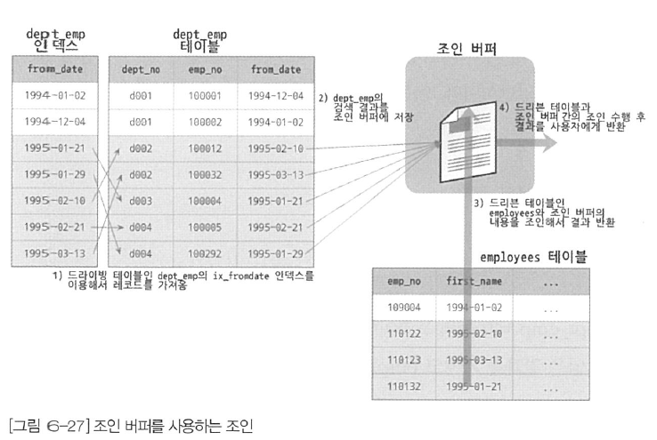

# 옵티마이저와 힌트

- 옵티마이저는 쿼리의 실행 계획을 수립하는 부분으로 가장 복잡하다.
- MySQL에서는 `EXPLAIN`이라는 명령으로 쿼리의 실행 계획을 확인할 수 있다. (상당히 많은 정보가 출력된다.)

## 쿼리 실행 절차

- MySQL에서 쿼리가 실행되는 과정은 아래 세 단계이다.

1. SQL 파싱
   - 사용자로부터 요청된 SQL 문장을 잘게 쪼개서 MySQL 서버가 이해할 수 있는 수준으로 분리한다.
   - SQL 파서라는 모듈로 SQL 문장을 파싱한다.
   - 이 단계를 통해 SQL 파스 트리가 만들어지고 파스 트리를 통해 쿼리를 실행한다.
2. 최적화 및 실행 계획 수립
   - SQL의 파싱 정보를 확인하면서 어떤 테이블부터 읽고 어떤 인덱스를 이용해 테이블을 읽을지 결정한다.
   - SQL 파스 트리를 참조해 작업을 수행한다.
   - 불필요한 조건 제거 및 복잡한 연산의 단순화
   - 여러 테이블의 조인이 있는 경우 어떤 순서로 테이블을 읽을지 결정
   - 각 테이블에 사용된 조건과 인덱스 통계 정보를 이용해 사용할 인덱스를 결정
   - 가져온 레코드들을 임시 테이블에 넣고 다시 한 번 가공해야 하는지 결정
3. 실행 계획대로 작업 수행
   - 두 번째 단계에서 결정된 테이블의 읽기 순서나 선택된 인덱스를 이용해 스토리지 엔진으로부터 데이터를 가져온다.

<br/ >

## 옵티마이저의 종류

- 옵티마이저는 데이터베이스의 두뇌 역할
- 대부분의 DBMS에서는 비용 기반 최적확(Cost-Based Optimizer, CBO) 방법을 사용한다.
- 예전에 오라클에서 많이 사용했던 규칙 기반 최적화(Rule-Based Optimizer) 방법도 있다.

### 비용 기반 최적화

- 쿼리를 처리하기 위한 여러 가지 가능한 방법을 만들고, 각 단위 작업의 비용 정보와 대상 테이블의 예측된 통계 정보를 이용해 실행 계획별로 비용을 산출한다.
- 이렇게 산출된 실행 방법 별로 비용이 최소로 소요되는 처리 방식을 사용해 최종적으로 쿼리 실행

### 규칙 기반 최적화

- 이제 거의 사용되지 않는 방법
- 옵티마이저에 내장된 우선순위에 따라 실행 계획을 수립하는 방식
- 통계 정보(테이블의 레코드 건수, 칼럼값의 분포도)를 조사하지 않고 실행 계획이 수립되기 때문에 같은 쿼리에 대해서 거의 항상 같은 방법 실행 방법을 만들어낸다.

<br/ >

## 기본 데이터 처리

### 풀 테이블 스캔

- 옵티마이저는 아래와 같은 조건일 때 주로 풀 테이블 스캔을 선택한다.
  - 테이블의 레코드 건수가 너무 작아서 인덱스를 통해 읽는 것보다 풀 테이블 스캔을 하는 편이 더 빠른 경우
  - WHERE 절이나 ON 절에 인덱스를 이용할 수 있는 적절한 조건이 없는 경우
  - 인덱스 레인지 스캔을 사용할 수 있는 쿼리라고 하더라도 옵티마이저가 판단한 조건 일치 레코드 건수가 너무 많은 경우
- MyISAM에서 풀 테이블 스캔을 할 때는 디스크로부터 페이지를 하나씩 읽어오지만 InnoDB의 작동 방식은 약간 다르다.
- InnoDB 스토리지 엔진은 특정 테이블의 연속된 데이터 페이지가 읽히면 백그라운드 스레드에 의해 리드 어헤드 작업이 자동으로 시작된다.
- 여기서 리드 어헤드란 어떤 영역에서 데이터가 앞으로 필요해지리라는 것을 예측해서 요청이 오기 전에 미리 디스크에서 읽어 InnoDB의 버퍼 풀에 가져다 두는 것을 의미한다.
- 풀 테이블 스캔이 실행되면 처음 몇 개의 데이터 페이지는 포그라운드 스레드가 페이지 읽기를 실행하지만, 특정 시점부터 백그라운드 스레드로 넘긴다.
- 백그라운드 스레드가 읽기를 넘겨받으면 한 번에 4개 또는 8개씩 페이지를 읽으면서 계속 그 수를 증가시킨다. 이 때 한 번에 최대 64개의 데이터 페이지까지 읽어서 버퍼 풀에 저장해둔다.
- 포그라운드 스레드는 버퍼 풀에 준비된 데이터만 가져다 사용하면 되기 때문에 쿼리가 상당히 빨라진다.
- `innodb_read_ahead_threshold`라는 시스템 변수를 이용해 리드 어헤드를 언제 시작할지 임계값을 정할 수 있다.

### 병렬 처리

- MySQL 8.0부터 처음으로 쿼리의 병렬 처리가 가능해졌다.
- `innodb_parallel_read_threads`라는 시스템 변수를 이용해 하나의 쿼리를 최대 몇 개의 스레드를 이용해서 처리할지를 변경할 수 있다.
- 하지만 아직 쿼리를 여러 개의 스레드를 이용해 병럴로 처리하게 하는 힌트나 옵션은 없다.
- 병렬 처리용 스레드 개수가 늘어날수록 쿼리 처리에 걸리는 시간이 줄어든다고 하나, 서버에 장착된 CPI의 코어 개수를 넘어가면 오히려 성능이 안 좋아진다고 한다.

## 정렬

### ORDER BY 처리 (Using Filesort)

- 정렬을 처리하는 방법은 인덱스를 이용하는 방법과 쿼리가 실행될 때 Filesort라는 별도의 처리를 이용하는 방법으로 나눌 수 있다.

<table>
    <thead>
        <tr>
            <td></td>
            <td>장점</td>
            <td>단점</td>
        </tr>
    </thead>
    <tbody>
        <tr>
            <td>인덱스 이용</td>
            <td>INSERT, UPDATE, DELETE 쿼리가 실행될 때 이미 인덱스가 정렬되어 있어서 순서대로 읽기만 하면 되므로 매우 빠르다.</td>
            <td>INSERT, UPDATE, DELETE 작업 시 부가적인 인덱스 추가/삭제 작업이 필요하므로 느리다. 인덱스 때문에 디스크 공간이 더 많이 필요하다. 인덱스의 개수가 늘어날수록 InnoDB의 버퍼 풀을 위한 메모리가 많이 필요하다.</td>
        </tr>
        <tr>    
            <td>Filesort 이용</td>
            <td>인덱스를 생성하지 않아도 되므로 인덱스를 이용할 때의 단점이 장점으로 바뀐다. 정렬해야 할 레코드가 많지 않으면 메모리에서 Filesort가 처리되므로 충분히 빠르다.</td>
            <td>정렬 작업이 쿼리 실행 시 처리되므로 레코드 대상 건수가 많아질 수록 쿼리의 응답 속도가 느리다.</td>
        </tr>
    </tbody>
</table>

- 아래와 같은 이유로 모든 정렬을 인덱스로 처리해 튜닝하기란 불가능하다.
  - 정렬 기준이 너무 많아서 요건별로 모두 인덱스를 생성하는 것이 불가능할 때
  - GROUP BY의 결과 또는 DISTINCT 같은 처리의 결과를 정렬해야할 때
  - UNION의 결과와 같이 임시 테이블의 결과를 다시 정렬해야할 때
  - 랜덤하게 결과 레코드를 가져와야할 때

### 소트 버퍼

- MySQL에서는 정렬을 수행하기 위해 별도의 메모리 공간을 할당받아 사용하는데 이 메모리 공간을 소트 버퍼라고 한다.
- 소트 버퍼는 정렬이 필요한 경우에만 할당되며, 버퍼의 크기는 정렬해야 할 레코드의 크기에 따라 가변적으로 증가하지만 최대 사용 가능한 소트 버퍼의 공간은 `sort_buffer_size`라는 시스템 변수로 설정할 수 있다. 사용이 완료되면 바로 반납된다.
- 정렬해야할 레코드의 건수가 소트 버퍼보다 많아지면 레코드를 여러 조각으로 나눠 처리한다. 소트 버퍼에서 정렬을 수행하고 디스크에 임시로 저장해둔다. 각 버퍼의 크기만큼 정렬된 레코드를 다시 병합하면서 정렬을 수행해야한다는 말이다. (Multi-Merge 멀티머지)
- 필자에 의하면 적당한 소트버퍼의 크기는 56KB ~ 1MB 이라고 한다.

## 정렬 알고리즘

- 레코드 전체를 버퍼에 담을지, 정렬 기준 칼럼만 소트 버퍼에 담을지에 따라 싱글 패스(Single-Pass)와 투 패스(Two-Pass) 2가지로 모드를 나눌 수 있다.

### 싱글 패스 정렬 방식

- 소트 버퍼에 정렬 기준 칼럼을 포함해 SELECT 대상이 되는 칼럼 전부를 담아서 정렬을 수행하는 정렬 방법이다.


- 테이블을 읽을 대 정렬에 필요하지 않은 칼럼까지 전부 읽어서 소트 버퍼에 담고 정렬을 수행한다.
- 정렬이 완료되면 정렬 버퍼의 내용을 그대로 클라이언트로 넘겨준다.

### 투 패스 정렬 방식

- 정렬 대상 컬럼과 프라이머리 키 값만 소트 버퍼에 담아서 정렬을 수행하고, 정렬된 순서대로 다시 프라이머리 키로 테이블을 읽어오는 방식


- 테이블을 2번 읽어야 한다는 점에서 비효율적이다.
- 최신 버전에서는 일반적으로 싱글 패스 정렬 방식을 주로 사용한다. 대신 싱글 패스 방식은 더 많은 소트 버퍼의 공간이 필요하다.
- 아래의 경우 MySQL은 싱글 패스 방식을 사용하지 못하고 투 패스 정렬 방식을 사용한다.
  - 레코드의 크기가 `max_length_for_sort_data` 시스템 변수에 설정된 값보다 클 때
  - BLOB이나 TEXT 타입의 칼럼이 SELECT 대상에 포함될 때
- 싱글 패스는 레코드의 크기나 건수가 작은 경우 빠른 반면, 투 패스 방식은 레코드의 크기나 건수가 상당히 많은 경우 효율적이다.

## 정렬 처리 방법

- `ORDER BY`가 사용되면 반드시 아래 3가지 처리 방법 중 하나로 정렬이 처리된다.
  - **인덱스를 사용한 정렬**: 별도 표기 없음
  - **조인에서 드라이빙 테이블만 정렬**: "Using filesort" 메시지 표시됨
  - **조인에서 조인 결과를 임시 테이블로 저장 후 정렬**: "Using temporary; Using filesort" 메시지 표시됨
- 먼저 옵티마이저는 정렬 처리를 위해 인덱스를 사용할 수 있는지 검토한다. 인덱스를 사용할 수 없다면 레코드를 검색에 정렬 버퍼에 저장하면서 정렬 처리(Filesort)를 한다.
- Filesort를 할 때 옵티마이저는 2가지 방법 중 하나를 선택한다. (가능하다면 전자가 더 효율적인 방법이다.)
  - 조인이 드라이빙 테이블만 정렬한 다음 조인을 수행
  - 조인이 끝나고 일치하는 레코드를 모두 가져온 후 정렬을 수행
- 2개 이상의 테이블을 조인해서 그 결과를 정렬해야 한다면 임시 테이블이 필요할 수 있다.
- 조인의 드라이빙 테이블만 정렬할 때는 2개 이상의 테이블이 조인되면서 정렬이 실행되지만 임시 테이블을 사용하지 않는다. (조인되는 테이블이 정렬 기준이 아니기 때문에!)

### 정렬 처리 방법의 성능 비교 - 스트리밍 방식

- 레코드가 검색될 때마다 바로바로 클라이언트로 전송해주는 방식
- 스트리밍으로 처리되는 쿼리는 쿼리가 얼마나 많은 레코드를 조회하느냐에 상관없이 빠른 응답 시간을 보장해준다.
- `LIMIT`처럼 결과 건수를 제한하는 조건들은 쿼리의 전체 실행 시간을 상당히 줄여줄 수 있다면 장점이 있다.

### 정렬 처리 방법의 성능 비교 - 버퍼링 방식

- `ORDER BY`나 `GROUP BY` 같은 처리는 쿼리의 결과가 스트리밍되는 것을 불가능하게 한다.
- `WHERE` 조건에 일치하는 모든 레코드를 가져온 후, 정렬하거나 그루핑해서 차례대로 보내야 하기 때문이다.
- MySQL 서버에서는 모든 레코드를 검색하고 정렬 작업을 하는 동안 클라이언트는 아무것도 하지 않고 기다려야 하기 때문에 응답 속도가 느려진다.
- 버퍼리 방식으로 처리되는 쿼리는 `LIMIT`처럼 결과 건수를 제한하는 조건이 있어도 성능 향상에 별로 도움이 되지 않는다. 레코드 건수는 줄일 수 있지만 MySQL 서버가 해야하는 작업량에는 그다지 변화가 없기 때문이다.

### 정렬 처리 방법 정리

- ORDER BY의 3가지 처리 방법 중 인덱스를 사용한 정렬 방식만 스트리밍 형태의 처리이다.
- "조인에서 드라이빙 테이블만 정렬"과 "조인에서 조인 결과를 임시 테이블로 저장 후 정렬"은 모두 버퍼링된 후에 정렬된다.
- 즉 인덱스를 사용한 방식은 LIMIT으로 제한된 건수만큼만 읽으면 바로바로 클라이언트로 전송해줄 수 있다는 말이다.
- 어느 테이블이 먼저 드라이빙되어 조인되는지도 중요하지만 어떤 정렬 방식으로 처리되는지는 더 큰 성능 차이를 만든다.

> **갑자기 궁금해서 찾아본 정보!**
> 
> 요즘 `date`나 `datetime` 타입의 컬럼으로 정렬할 일이 많다. 그런데 DATE_FORMAT을 사용하고 있는데?!? MySQL에서는 함수를 사용하면 인덱스가 타질까?
> 
> 정답은 "인덱스를 타지 않는다"이다. MySQL에서는 함수를 사용하면 인덱스를 타지 않는다고 한다. 
> 신기했던 점은 BETWEEN과 같은 함수 또한 인덱스를 타지 않는다는 점이다! 때문에 자제하는 것이 좋다.
> 날짜를 검색할 때 아래 코드와 같이 검색하자. 

```sql
SELECT *
FROM order
where order_date >= '2023-11-21'
and order_date < '2023-11-22'
```

```sql
SELECT *
FROM order
where order_date >= '2023-11-21 00:00:00'
and order_date < '2023-11-22 23:59:59'
```

### 정렬 관련 상태 변수

- MySQL 서버는 처리하는 주요 작업에 대해서는 해당 작업의 실행 횟루를 상태 변수로 저장한다.
- 지금까지 몇 건의 레코드나 정렬 처리를 수행했는지, 소트 버퍼 간의 병합 작업은 몇 번이나 발생했는지 등을 아래 명령어를 통해 확인할 수 있다.

```sql
mysql> FLUSH STATUS;
mysql> SHOW STATUS LIKE 'Sort%';
+-------------------+-------+
| Variable_name     | Value |
+-------------------+-------+
| Sort_merge_passes | 0     |
| Sort_range        | 0     |
| Sort_rows         | 0     |
| Sort_scan         | 0     |
+-------------------+-------+
```

- `Sort_merge_passes`는 멀티 머지 처리 횟수를 의미한다.
- `Sort_range`는 인덱스 레인지 스캔을 통해 검색된 결과에 대한 정렬 작업 횟수다.
- `Sort_rows`는 지금까지 정렬한 전체 레코드 건수를 의미한다.
- `Sort_scan`은 풀 테이블 스캔을 통해 검색된 결과에 대한 정렬 작업 횟수다.

## GROUP BY 처리

- `GROUP BY` 또한 `ORDER BY`와 마찬가지로 쿼리가 스트리밍된 처리를 할 수 없게 하는 기능 중 하나다.
- `GROUP BY`에서는 `HAVING` 절을 사용할 수 있는데, 결과에 대해 필터링 역할을 수행한다.
- `GROUP BY`에서 사용된 조건은 인덱스를 사용해서 처리될 수 없으므로 `HAVING` 절을 튜닝하려고 하는 어리석음은 범하지 말자.
- `GROUP BY`도 인덱스를 사용하는 경우와 그렇지 못한 경우로 나눌 수 있다.
  - 인덱스를 차례대로 읽는 **인덱스 스캔** 방법 
  - 인덱스를 건너뛰면서 읽는 **루스 인덱스 스캔** 방법
- 인덱스를 사용하지 못하는 경우 임시 테이블을 사용한다.

### 인덱스 스캔(타이트 인덱스 스캔)

- 조인의 드라이빙 테이블에 속한 컬럼만 이용해 그루핑할 때 `GROUP BY` 칼럼으로 이미 인덱스가 있다면 그 인덱스를 차례대로 읽으면서 그루핑 작업을 수행하고 그 결과로 조인을 처리한다.
- `GROUP BY`가 인덱스로 처리된다 하더라도 그룹 합수(Aggregation Function) 등의 그룹값을 처리해야 해서 임시 테이블이 필요할 때도 있다.

### 루스 인덱스 스캔

- 인덱스의 레코드를 건너뛰면서 필요한 부부만 읽어서 가져오는 것을 의미한다.
- 옵티마이저가 루스 인덱스 스캔을 사용할 때는 실행 계획의 Extra 칼럼에 "Using index for group-by" 코멘트가 표시된다.
- 예시를 살펴보자. 아래 테이블은 (emp_no, from_date)의 그룹 키를 primary key로 가지는 테이블이다.

```sql
mysql> desc salaries;
+-----------+------+------+-----+---------+-------+
| Field     | Type | Null | Key | Default | Extra |
+-----------+------+------+-----+---------+-------+
| emp_no    | int  | NO   | PRI | NULL    |       |
| salary    | int  | NO   | MUL | NULL    |       |
| from_date | date | NO   | PRI | NULL    |       |
| to_date   | date | NO   |     | NULL    |       |
+-----------+------+------+-----+---------+-------+
4 rows in set (0.00 sec)
```

```sql
mysql> EXPLAIN
    -> SELECT emp_no
    -> FROM salaries
    -> WHERE from_date='1985-03-01'
    -> GROUP BY emp_no;
+----+-------------+----------+------------+-------+-------------------+---------+---------+------+--------+----------+---------------------------------------+
| id | select_type | table    | partitions | type  | possible_keys     | key     | key_len | ref  | rows   | filtered | Extra                                 |
+----+-------------+----------+------------+-------+-------------------+---------+---------+------+--------+----------+---------------------------------------+
|  1 | SIMPLE      | salaries | NULL       | range | PRIMARY,ix_salary | PRIMARY | 7       | NULL | 299646 |   100.00 | Using where; Using index for group-by |
+----+-------------+----------+------------+-------+-------------------+---------+---------+------+--------+----------+---------------------------------------+
1 row in set, 1 warning (0.00 sec)
```

- 위 쿼리는 아래의 순서대로 실행된다.
  1. `(emp_no, from_date)` 인덱스를 차례대로 스캔하면 `emp_no`의 첫 번째 유일한 값(그룹 키) '10001'을 찾아낸다. 
  2. `(emp_no, from_date)` 인덱스에서 `emp_no`가 '10001'인 것 중에서 from_date 값이 '1985-03-01'인 레코드만 가져온다. '10001' 값과 WHERE 절에 사용된 `from_date='1985-03-01'` 조건을 합쳐서 `emp_no=10001 AND from_date='1985-03-01'` 조건으로 (emp_no, from_date) 인덱스를 검색하는 것과 거의 흡사하다.
  3. `(emp_no, from_date)` 인덱스에서 `emp_no`의 그 다음 유니크한 값을 가져온다. (그룹키)
  4. 결과가 더 없으면 처리를 종료하고 결과가 있다면 2번 과정으로 돌아가 반복 수행한다.

### 임시 테이블을 사용하는 GROUP BY

- 기준 칼럽이 드라이빙 테이블에 있든 드리븐 테이블에 있는 관계 없이 인덱스를 사용하지 못한다면 임시 테이블을 사용한다.
- 실행 계획을 살펴보면 Extra 칼럼에 "Using temporary"라는 메시지가 표시된다.

```sql
mysql> EXPLAIN 
    SELECT e.last_name, AVG(s.salary) 
    FROM employees e, salaries s 
    WHERE s.emp_no = e.emp_no 
    GROUP BY e.last_name;
+----+-------------+-------+------------+------+---------------+---------+---------+--------------------+--------+----------+-----------------+
| id | select_type | table | partitions | type | possible_keys | key     | key_len | ref                | rows   | filtered | Extra           |
+----+-------------+-------+------------+------+---------------+---------+---------+--------------------+--------+----------+-----------------+
|  1 | SIMPLE      | e     | NULL       | ALL  | PRIMARY       | NULL    | NULL    | NULL               | 300252 |   100.00 | Using temporary |
|  1 | SIMPLE      | s     | NULL       | ref  | PRIMARY       | PRIMARY | 4       | employees.e.emp_no |      9 |   100.00 | NULL            |
+----+-------------+-------+------------+------+---------------+---------+---------+--------------------+--------+----------+-----------------+
2 rows in set, 1 warning (0.00 sec)
```

- `GROUP BY`와 `ORDER BY`가 같이 실행되면 명시적으로 정렬 작업을 수행하는데 Extra 칼럼에 "Using temporary와 Using filesort"가 같이 표시된다.

```sql
mysql> EXPLAIN 
    SELECT e.last_name, AVG(s.salary) 
    FROM employees e, salaries s 
    WHERE s.emp_no = e.emp_no 
    GROUP BY e.last_name 
    ORDER BY e.last_name;;
+----+-------------+-------+------------+------+---------------+---------+---------+--------------------+--------+----------+---------------------------------+
| id | select_type | table | partitions | type | possible_keys | key     | key_len | ref                | rows   | filtered | Extra                           |
+----+-------------+-------+------------+------+---------------+---------+---------+--------------------+--------+----------+---------------------------------+
|  1 | SIMPLE      | e     | NULL       | ALL  | PRIMARY       | NULL    | NULL    | NULL               | 300252 |   100.00 | Using temporary; Using filesort |
|  1 | SIMPLE      | s     | NULL       | ref  | PRIMARY       | PRIMARY | 4       | employees.e.emp_no |      9 |   100.00 | NULL                            |
+----+-------------+-------+------------+------+---------------+---------+---------+--------------------+--------+----------+---------------------------------+
2 rows in set, 1 warning (0.00 sec)
```

## DISTINCT 처리

- MIN, MAX, COUNT와 같은 집합와 함께 사용되는 경우와 집합 함수가 없는 경우 2가지로 구분해서 볼 수 있다.

### SELECT DISTINCT

- 집합 함수 없이 단순히 `SELECT`만을 할 때는 `GROUP BY`와 동일한 방식으로 처리된다.
- MySQL 8.0 버전부터는 `GROUP BY`를 수행하는 쿼리에 `ORDER BY`가 없으면 정렬을 사용하지 않는다.
- 따라서 아래의 두 쿼리는 내부적으로 같은 작업을 수행한다.

```sql
SELECT DISTINCT emp_no FROM salaries;
SELECT emp_no FROM salaries GROUP BY emp_no;
```

- 하나 주의할 점이 있는데, DISTINCT는 SELECT하는 레코드(튜플)을 유니크하게 `SELECT`하는 것이지, 특정 칼럼만 유니크하게 조회하는 것이 아니다.
- 그런데 아래와 같이 DISTINCT를 함수처럼 사용하는 경우도 있다.

```sql
SELECT DISTINCT(first_name), last_name FROM employees;
```

- 문제 없이 실행되는 것 같아 보이지만, MySQL 서버는 DISTINCT 뒤의 괄호를 그냥 의미 없이 사용된 괄호로 해석하고 제거해버린다. DISTINCT는 함수가 아니기 때문에 그 뒤의 괄호는 의미가 없는 것이다.
- 따라서 SELECT 절에 사용된 DISTINCT 키워드는 조회되는 모든 칼럼에 영향을 미친다.

### 집합 함수와 함께 사용된 DISTINCT

- 집합 함수를 사용하는 경우 일반적으로 SELECT DISTINCT와는 다르게 해석된다.
- 집합 함수 내에서 사용된 DISTINCT는 그 집합 함수의 인자로 전달된 칼럼값이 유니크한 것들을 가져온다.

```sql
mysql> EXPLAIN 
    SELECT COUNT(DISTINCT s.salary) 
    FROM employees e, salaries s 
    WHERE e.emp_no = s.emp_no 
      AND e.emp_no BETWEEN 100001 AND 100100;
+----+-------------+-------+------------+-------+---------------+---------+---------+--------------------+------+----------+--------------------------+
| id | select_type | table | partitions | type  | possible_keys | key     | key_len | ref                | rows | filtered | Extra                    |
+----+-------------+-------+------------+-------+---------------+---------+---------+--------------------+------+----------+--------------------------+
|  1 | SIMPLE      | e     | NULL       | range | PRIMARY       | PRIMARY | 4       | NULL               |  100 |   100.00 | Using where; Using index |
|  1 | SIMPLE      | s     | NULL       | ref   | PRIMARY       | PRIMARY | 4       | employees.e.emp_no |    9 |   100.00 | NULL                     |
+----+-------------+-------+------------+-------+---------------+---------+---------+--------------------+------+----------+--------------------------+
2 rows in set, 1 warning (0.00 sec)
```

- 위 쿼리는 내부적으로 `COUNT(DISTINCT s.salary)`를 처리하기 위해 임시 테이블을 사용한다.
- 하지만 실행 계획에는 임시 테이블을 사용한다는 메시지인 "Using temporary"가 보이지 않는다.

## 내부 임시 테이블 활용

- MySQL 엔진이 스토리지 엔진으로부터 받아온 레코드를 정렬하거나 그루핑할 때는 내부 임시 테이블(Internal temporary table)을 사용한다.
- 내부 임시 테이블은 `CREATE TEMPORARY TABLE` 명령으로 만든 임시 테이블과는는 다르다.
- 일반적인 임시 테이블은 처음에 메모리에 생성됐다가 테이블의 크기가 커지면 디스크로 옮겨진다. 어떤 경우에는 메모리를 거치지 않고 바로 디스크에 만들어지기도 한다.
- 내부 임시 테이블은 내부적인 가공을 위해 MySQL 엔진이 직접 생성하며 다른 세션이나 다른 쿼리에서 볼 수 없으며 사용하는 것도 불가능하다. 또한 쿼리의 처리가 완료되면 자동으로 삭제된다는 점에서 사용자가 생성하는 임시 테이블과는 다르다.

### 메모리 임시 테이블과 디스크 임시 테이블

- 8.0 이전에는 임시 테이블이 메모리를 사용할 때는 MEMORY 스토리지 엔진을 디스크에 저장될 때는 MyISAM 스토리지 엔진을 사용했다.
  - MEMORY 스토리지 엔진은 가변 길이 타입(VARBINARY, VARCHAR)을 지원하지 못하기 때문에 임시 테이블이 메모리에 만들어지면 가변 타입의 겨우 최대 길이 만큼 메모리를 할당했기 때문에 낭비가 심했다.
  - 또한 MyISAM에서 디스크에 임시 테이블을 만들었을 땐 트랜잭션을 지원하지 못한다는 문제점을 가지고 있었다.
- 8.0 버전부터는 메모리는 TempTable이라는 스토리지 엔진을 사용하고 디스크에 저장되는 임시 테이블은 InnoDB 스토리지 엔진을 사용하도록 개선했다.
  - TempTable은 가변 길이 타입을 지원한다.
- 8.0 버전에서도 `internal_tmp_storage_engine` 시스템 변수를 이용해 MEMORY와 TempTable 중에서 선택할 수 있다. (default = TempTable)
- TempTable이 최대한 사용 가능한 메모리 공간의 크기는 `temptable_max_ram` 시스템 변수로 제어할 수 있다. 
- 기본값은 1GB인데 1GB보다 커지면 디스크에 기록한다.
  - MMAP 파일로 디스크에 기록
  - InnoDB 테이블로 기록
- 처음부터 디스크 테이블로 생성되는 경우도 있다. 이 경우 internal_tmp_disk_storage_engine 시스템 변수에 설정된 스토리지 엔진이 사용된다. (default = InnoDB)

### 임시 테이블이 필요한 쿼리

- 대표적인 케이스들
  - ORDER BY와 GROUP BY에 명시된 칼럼이 다른 쿼리
  - ORDER BY나 GROUP BY에 명시된 칼럼이 조인의 순서상 첫 번째 테이블이 아닌 쿼리
  - DISTINCT와 ORDER BY가 동시에 쿼리에 존재하는 경우 또는 DISTINCT가 인덱스로 처리되지 못하는 쿼리
  - UNION이나 UNION DISTINCT가 사용된 쿼리(select_type 칼럼이 UNION RESULT인 경우)
  - 쿼리의 실행 계획에서 select_type이 DERIVED인 쿼리
- Extra 칼럼에 "Using temporary" 메시지가 표시되는지 확인하면 임시테이블이 사용되는지 확인할 수 있다. (사용하더라도 표시되지 않는 경우가 있으니 주의하자. - 3번째 케이스)

### 임시 테이블이 디스크에 생성되는 경우

- 아래의 조건을 만족하면 메모리 임시 테이블을 사용할 수 없게 된다.
  - UNION이나 UNION ALL에서 SELECT되는 칼럼 중에서 길이가 512바이트 이상의 크기의 칼럼이 있는 경우
  - GROUP BY나 DISTINCT 칼럼에서 512바이트 이상인 크기의 칼럼이 있는 경우
  - (MEMORY 스토리지 엔진을 사용할 경우) 메모리 임시 테이블의 크기가 tmp_table_size 또는 max_heap_table_size 시스템 변수보다 큰 경우
  - (TempTable 스토리지 엔진을 사용할 경우) 메모리 임시 테이블의 크기가 temptable_max_ram 시스템 변수 값보다 큰 경우

# 고급 최적화

- MySQL 서버의 옵티마이저가 실행 계획을 수립할 때 통계 정보와 옵티마이저 옵션을 결합해서 최적의 실행 계획을 수립하게 된다.
- 옵티마이저 옵션은 조인 관련되 옵티마이저 옵션과 옵티마이저 스위치로 구분할 수 있다.

## 옵티마이저 스위치 옵션

- 각 스위치 옵션은 default, on, off 중에서 하나를 고를 수 있다.

<table>
    <thead>
        <tr>
            <th>옵티마이저 스위치 이름</th>
            <th>기본값</th>
            <th>설명</th>
        </tr>
    </thead>
    <tbody>
        <tr>
            <td>batched_key_access</td>
            <td>off</td>
            <td>BKA 조인 알고리즘 결정</td>
        </tr>
        <tr>
            <td>block_nested_loop</td>
            <td>on</td>
            <td>Block Nested Loop 조인 알고리즘 설정</td>
        </tr>
        <tr>
            <td>engine_condition_pushdown</td>
            <td>on</td>
            <td>Engin Condition Pushdown 기능 설정</td>
        </tr>
        <tr>
            <td>index_condition_pushdown</td>
            <td>on</td>
            <td>Index Condition Pushdown 기능 설정</td>
        </tr>
        <tr>
            <td>use_index_extensions</td>
            <td>on</td>
            <td>Index Extension 최적화 설정</td>
        </tr>
        <tr>
            <td>index_merge</td>
            <td>on</td>
            <td>Index Merge 최적화 설정</td>
        </tr>
        <tr>
            <td>index_merge_intersection</td>
            <td>on</td>
            <td>Index Merge Intersection 최적화 설정</td>
        </tr>
        <tr>
            <td>index_merge_sort_union</td>
            <td>on</td>
            <td>Index Merge Union 최적화 설정</td>
        </tr>
        <tr>
            <td>mrr</td>
            <td>on</td>
            <td>MRR 최적화 설정</td>
        </tr>
        <tr>
            <td>mrr_cost_based</td>
            <td>on</td>
            <td>비용 기반의 MRR 최적화 설정</td>
        </tr>
        <tr>
            <td>semijoin</td>
            <td>on</td>
            <td>세미 조인 최적화 설정</td>
        </tr>
        <tr>
            <td>firstmatch</td>
            <td>on</td>
            <td>FirshMatch 세미 조인 최적화</td>
        </tr>
        <tr>
            <td>loosescan</td>
            <td>on</td>
            <td>LooseScan 세미 조인 최적화 설정</td>
        </tr>
        <tr>
            <td>materialization</td>
            <td>on</td>
            <td>Materialization 최적화 설정(Materialization 세미 조인 최적화 포함)</td>
        </tr>
        <tr>
            <td>subquery_materialization_cost_based</td>
            <td>on</td>
            <td>비용 기반의 Materialization 최적화 설정</td>
        </tr>
        <tr>
            <td></td>
            <td></td>
            <td></td>
        </tr>
    </tbody>
</table>

### MRR과 배치 키 엑세스(mmr & batched_key_access)

- MRR(Multi-Range Read) 또는 DS-MRR(Disk Sweep Multi-Range Read)는 드라이빙 테이블과 드리븐 테이블을 조회 최적화를 위해 사용한다.
- MySQL 서버는 조인 대상 테이블 중 하나로부터 레코드를 읽어서 조인 버퍼에 버퍼링한다. 드라이빙 테이블의 레코드를 읽어서 드리븐 테이블과의 조인을 즉시 실행하지 않고 조인 대상을 버퍼링하는 것이다.
- 조인 버퍼에 레코드가 가득 차면 MySQL 엔진은 버퍼링된 레코드를 스토리지 엔진으로 한 번에 요청한다. 이를 통해 스토리지 엔진은 읽어야할 레코드들을 데이터 페이지에 정렬된 순서로 접근해서 디스크의 데이터 페이지 읽기를 최소화할 수 있는 것이다.
- MMR을 응용해서 실행되는 조인 방식인 BKA 조인 최적화 방식도 있는데 기본값이 off이다. 그 이유는 BKA 조인을 사용하면 부가적인 정렬 작업이 필요해지기 때문에 오히려 성능이 안 좋아질 수 있다는 단점이 존재하기 때문이다.

### 블록 네스티드 루프 조인(block_nested_loop)

**주의: MySQL 8.0.18 버전부터 해시 조인 알고리즘이 도입되었고, MySQL 8.0.20 버전부터는 블록 네스티드 조인은 더이상 사용되지 않고 해시 조인 알고리즘을 대체된다. 따라서 Extra 칼럼에 "Using Join Buffer(block nested loop)" 메시지가 표시되지 않을 수 있다.**

- MySQL에서 사용되는 대부분의 조인이 네스티드 루프 조인이다. 조인의 연결 조건이 되는 칼럼에 모두 인덱스가 있는 경우 사용되는 조인 방식이다.
- 마치 중첩된 반복 명령을 사용하는 것처럼 작동한다고 하여 네스티드 루프 조인이라고 부른다.

```sql
mysql> EXPLAIN
    -> SELECT *
    -> FROM employees e
    -> INNER JOIN salaries s ON s.emp_no = e.emp_no
    -> AND s.from_date <= NOW()
    -> AND s.to_date >= NOW()
    -> WHERE e.first_name = 'Amor';
+----+-------------+-------+------------+------+----------------------+--------------+---------+--------------------+------+----------+-------------+
| id | select_type | table | partitions | type | possible_keys        | key          | key_len | ref                | rows | filtered | Extra       |
+----+-------------+-------+------------+------+----------------------+--------------+---------+--------------------+------+----------+-------------+
|  1 | SIMPLE      | e     | NULL       | ref  | PRIMARY,ix_firstname | ix_firstname | 58      | const              |    1 |   100.00 | NULL        |
|  1 | SIMPLE      | s     | NULL       | ref  | PRIMARY              | PRIMARY      | 4       | employees.e.emp_no |    9 |    11.11 | Using where |
+----+-------------+-------+------------+------+----------------------+--------------+---------+--------------------+------+----------+-------------+
2 rows in set, 1 warning (0.00 sec)
```

- 네스티드 루프 조인과 블록 네스티드 루프 조인(Block Nested Loop Join)의 가장 큰 차이는 조인 버퍼가 사용되는지 여부와 조인에서 드라이빙 테이블과 드리븐 테이블이 어떤 순서로 조인되느냐이다.
- 조인 알고리즘에서 Block이라는 단어가 사용되면 조인용으로 별도의 버퍼가 사용됐다는 것을 의미하는데, 조인 쿼리의 실행 계획에서 Extra 칼럼에 "Using Join buffer"라는 문구가 표시되면 그 실행 계획은 조인 버퍼를 사용한다는 것을 의미한다.
- 조인은 드라이빙 테이블에서 일치하는 레코드의 건수만큼 드리븐 테이블을 검색하면서 처리된다. 드라이빙 테이블은 한 번에 쭉 읽지만, 드리븐 테이블은 여러 번 읽는다.
- 어떤 방식으로든 드리븐 테이블의 풀 테이블 스캔이나 인덱스 풀 스캔을 피할 수 없다면 옵티마이저는 드라이빙 테이블에서 읽은 레코드를 메모리에 캐시한 후 드리븐 테이블과 이 메모리 캐시를 조인하는 형태로 처리한다. 이 때 사용되는 메모리의 캐시를 조인 버퍼(Join Buffer)라고 한다.
- 조인 버퍼는 `join_buffer_size`라는 시스템 변수로 크리를 제한할 수 있으며 조인이 완료되면 조인 버퍼는 바로 해제된다.

```sql
mysql> EXPLAIN
    -> SELECT *
    -> FROM dept_emp de, employees e
    -> WHERE de.from_date > '1995-01-01' AND e.emp_no < 109004;
+----+-------------+-------+------------+-------+---------------+---------+---------+------+--------+----------+--------------------------------------------+
| id | select_type | table | partitions | type  | possible_keys | key     | key_len | ref  | rows   | filtered | Extra                                      |
+----+-------------+-------+------------+-------+---------------+---------+---------+------+--------+----------+--------------------------------------------+
|  1 | SIMPLE      | e     | NULL       | range | PRIMARY       | PRIMARY | 4       | NULL | 150070 |   100.00 | Using where                                |
|  1 | SIMPLE      | de    | NULL       | ALL   | ix_fromdate   | NULL    | NULL    | NULL | 331143 |    50.00 | Using where; Using join buffer (hash join) |
+----+-------------+-------+------------+-------+---------------+---------+---------+------+--------+----------+--------------------------------------------+
2 rows in set, 1 warning (0.01 sec)
```

- (위 쿼리를 살펴보면 "Using Join Buffer(block nested loop)" 메시지가 출력되지 않고 "Using Join Buffer(hash join)"으로 출력되는 것을 확인할 수 있다.)
- 위 쿼리는 아래의 과정을 거쳐 실행된다. (Extra 칼럼을 보면 Using join buffer 라는 문구를 볼 수 있음)
  1. dept_emp 테이블의 ix_fromdate 인덱스를 이용해(from_date > '1995-01-01') 조건을 만족하는 레코드를 검색한다.
  2. 조인에 필요한 나머지 칼럼을 모두 dept_emp 테이블로부터 읽어서 조인 버퍼에 저장한다.
  3. employees 테이블의 프라이머리 키를 이용해 (emp_no < 109004) 조건을 만족하는 레코드를 검색한다.
  4. 3번에서 검색된 결과(employees)에 2번의 캐시된 조인 버퍼의 레코드(dept_emp)를 결합해서 반환한다.

