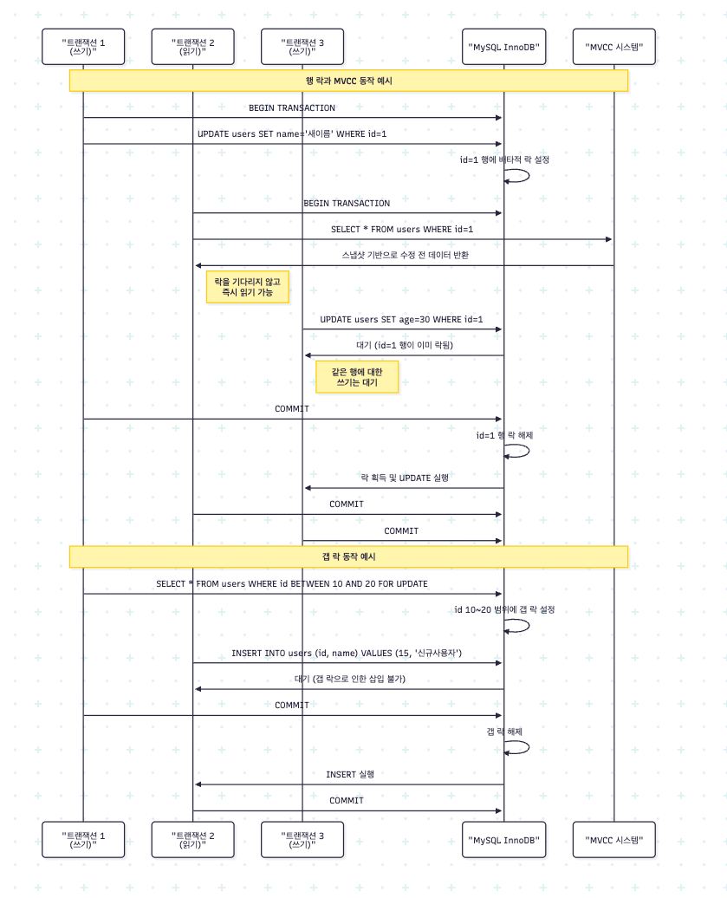

# Transaction과 Lock 메커니즘

## 트랜잭션

- Transaction의 그 유명한 ACID 법칙....
- 결국 트랜잭션이 필요한 이유는 작업 원자성과 데이터 정합성 때문이다.

## 테이블 락

- 종류
  - 테이블 락: 테이블 전체에 락
  - 갭락: 인덱스에 범위 락
  - X-Lock(Exclusive Lock): 데이터 수정 락
  - 읽기 락: 명시적으로 락을 걸어 사용 (SELECT ... FOR UPDATE).
- MVCC와의 연관성이 중요한 개념

### MVCC

- DB의 읽기&쓰기 효율성을 극대화
- ex) X-Lock이 걸렸을 때, SELECT를 하면 값이 이미 변경되었더라도 MVCC에 찍어 놓은 스냅샷을 제공

## 예시

