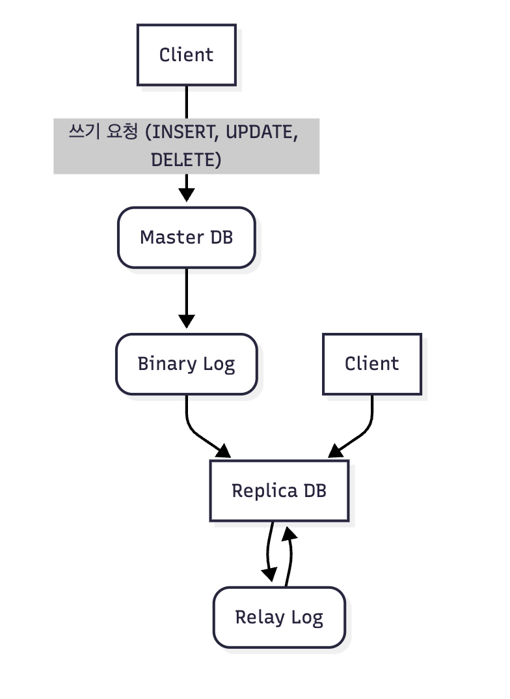
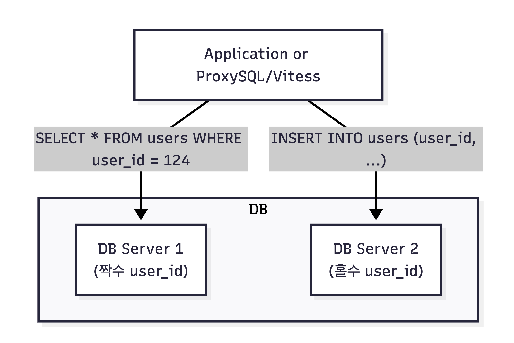
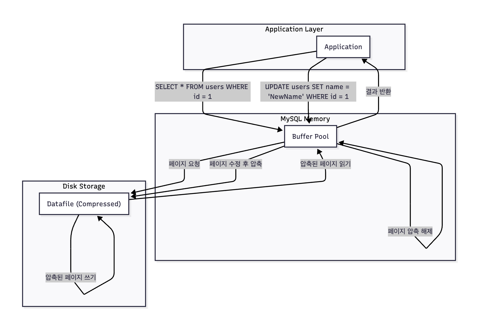
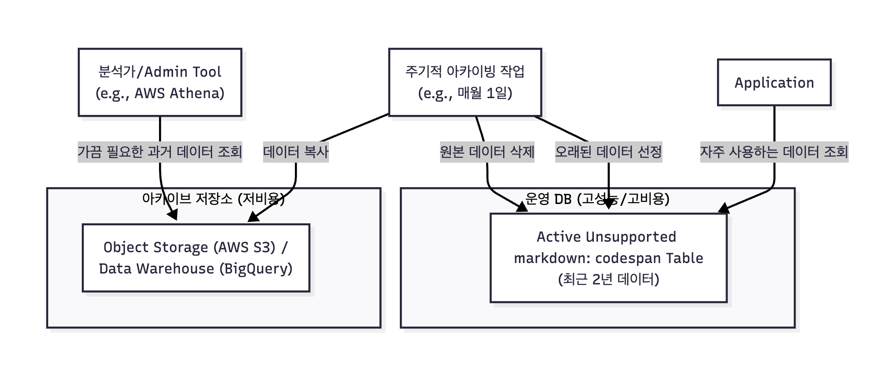

# 데이터베이스 확장

- 스케일 업(수직적 확장)은 한계가 있다.
- 스케일 아웃(수평적 확장) 위주로 설명

## Replication

- 복제 : 복제본 데이터베이스를 여러 개 만들어 사용
  - 마스터에 추가된 데이터를 지속적으로 복사 => 데이터 정합성 보장
  - 읽기 작업 라우팅 (보통 `읽기:쓰기=9:1` 이라고 함. 읽기 작업을 대신 해주는 것만으로도 큰 도움)
  - 마스터 노드는 쓰기 작업에만 집중할 수 있다.

### 복제는 어떻게 할까?

- 보통 로그를 통해서 한다고 보면 된다.



1. 마스터 노드가 `Binary Log`를 기록 (모든 쓰기 요청[INSERT, UPDATE, DELETE]에 의한 변경 내용을 기록하는 로그)
2. 레플리카는 바이너리 로그를 모니터링(마스터 노드의 `dump thread`가 바이너리 로그를 읽어 레플리카에 전송)
3. 바이너리 로그에서 트리거가 되면 `Relay Log`라는 곳에 저장. 버퍼 형태. 후에 디스크에 작성(데이터 동기화).

### 복제 방식 - 비동기

- 마스터 노드는 레플리카 노드가 로그를 잘 받았는지 확인하지 않는다. 
- 레이턴시가 가장 낮은 방식이지만, 마스터 노드에 장애 발생 시 일부 데이터를 레플리카로 전송하지 못하고 유실될 수 있는 가능성

### 복제 방식 - 반비동기

- 최소 하나의 레플리카에 저장되었는지 확인 (ACK)

### 복제 지연

- 여러 요인이 존재한다.
1. 네트워크 지연
2. 마스터와 레플리카간의 대역폭
3. 노드간에 물리적 거리

### 성능 문제

- 레플리카의 사양이 낮아 바이너리 로그에 쌓인 변경사항을 따라잡지 못하는 문제가 생길 수 있음. => 정합성 문제 발생할 수도.

### 복제 지연 해결

1. 마스터 노드에 직접 읽기: N사는 레플리카는 마스터로 승격을 시키기 위한 용도로만 사용하고 마스터 노드에서 읽기/쓰기를 다 한다는 얘기를 들은 적이 있음.
2. 캐시 활용: DB 부하를 줄이는 기법

--- 

## Partitioning

- 쓰기 확장 기법
- 거대한 파일을 논리적인 기준으로 나눠서 저장하는 기법

### 어떤 문제를 해결할 수 있을까?

1. 조회 성능이 좋아진다. (ex. 월별 파티셔닝 => 월별로 묶어서 조회 => `Partition Pruning`: 불필요한 테이블 스캔을 막을 수 있는 튜닝 기법)
2. 데이터 관리에 도움이 된다. (ex. Row을 찾아서 삭제 vs 파티션 자체를 삭제 => 당연히 파티션 삭제가 훨씬 용이하다.)

### 파티션 기준

1. RANGE: 날짜, 연도, 월, 번호 등 연속적인 값을 기준으로 나눔.
2. LIST: 국가코드, 카테고리 등 정해진 값을 목록에 따라 나눔
3. HASH: 특정 기준 없이 균등하게 저장

### 코드 예시

```sql
CREATE TABLE access_logs (
     log_id BIGINT AUTO_INCREMENT,
     user_id INT NOT NULL,
     access_time DATETIME NOT NULL,
     message VARCHAR(255),
     PRIMARY KEY (log_id, access_time) -- 파티션 키는 PK에 포함되어야 함
)
    PARTITION BY RANGE (TO_DAYS(access_time)) (
        PARTITION p202401 VALUES LESS THAN (TO_DAYS('2024-02-01')),
        PARTITION p202402 VALUES LESS THAN (TO_DAYS('2024-03-01')),
        PARTITION p202403 VALUES LESS THAN (TO_DAYS('2024-04-01')),
        PARTITION p_future VALUES LESS THAN MAXVALUE
        );
```

---

## Sharding

- 쓰기 확장 기법
- 데이터를 여러 대의 독립된 데이터베이스에 나눠 저장한다.

### 예시

- 아래 예시는 `user_id`를 짝수와 홀수로 나눠 저장하는 형태다.



### 장점

- 이론상 쓰기 성능을 무한대로 확장할 수 있다.

### 단점

1. 샤드 키 선정 문제: 무엇을 기준으로 데이터를 나눌 것인가? 한 번 정하면 바꾸기 어렵다. 잘못 정하면 바로잡기 어렵다.
    - 잘못된 샤드 키는 데이터 불균형 문제가 발생시킨다. (`HOT_SPOT`) 따라서 카디널리티가 높은 필드를 샤드 키로 잡는 것이 좋다.
    - where 절에 자주 사용되는 칼럼을 선정하는 것이 좋다. 만약 위의 예시에서 이메일로 검색한다면? 모든 샤드를 조회해야 하는 문제가 발생한다.
2. Cross Shard: 여러 샤드에 걸쳐 있는 데이터를 조인하거나 집계하는 것이 성능 저하가 크게 발생. 사실상 조인은 금기에 가깝다.
    - 따라서 철저하게 비정규화를 통해 스키마를 구성해야 한다. 예를 들어, NoSQL과 유사하게. 
3. 분산 트랜잭션: 트랜잭션의 핵심은 원자성이다. 그런데 데이터가 여러 샤드 서버에 분산되어 있다면 원자성을 지키기 어렵다.
    - 일부 샤드에 장애가 발생한다면? => 데이터 정합성에 문제가 생긴다.
    - 2PC: 트랜잭션을 준비 단계와 커밋 단계로 나눠, 모든 샤드가 준비되면 커밋. => 정합성 보장. but, 관련 데이터에 락을 걸어야 하기 때문에 성능 저하가 발생할 수 있다. 또한 명령을 내리는 노드가 고장나면 시스템이 마비된다는 단점이 존재 (단일 실패 지점, Single Point of Failure)
    - 사가 패턴: 구현이 어렵다. 모든 실패 케이스의 보상 트랜잭션을 구현해야 한다. 게다가 보상 트랜잭션을 실행하는 중간에는 데이터 정합성이 맞지 않을 수 있다.

---

## 압축과 아카이빙

- 데이터는 계속 쌓인다. 시간이 지날수록 기하급수적으로 증가한다. 그리고 2가지 문제를 만나게 될 것이다.
1. 데이터 저장에 대한 비용
2. 성능 저하

- 따라서 이 문제를 해결하기 위해 압축이나 아카이빙 전략을 택하게 된다.
- 현재 운영에 중요한 활성화된 데이터만 남겨두고 비용 줄이고, 성능을 확보한다. 

### Compression

- 데이터를 디스크에 저장할 때 특정 알고리즘을 적용하여 데이터의 물리적인 크기를 줄이는 것이다.



- 코드 예시
- 압축 크기는 InnoDB의 기본 페이지 크기인 16KB보다 작은 값을 사용하는 게 좋다.
  - 크기가 작을수록 좋겠지만, CPU 사용률이 증가할 수 있다.

```sql
-- 압축 기능을 활성화하여 테이블 생성
CREATE TABLE logs_compressed (
     log_id BIGINT AUTO_INCREMENT PRIMARY KEY,
     user_id INT,
     message TEXT,
     created_at TIMESTAMP
)
    ROW_FORMAT=COMPRESSED
    KEY_BLOCK_SIZE=8; -- 페이지 압축 후 목표 크기 (KB). 4, 8, 16 등.
```

### 아카이빙

- 데이터베이스에서 사용 빈도가 매우 낮지만 법적 규제나 비즈니스 요구사항에 따라서 따로 보관을 해야 하는 오래된 데이터를 관리하는 기법이다.
  - 데이터를 어디로 어떻게 옮길 것인가?
  - 옮긴 데이터를 어떻게 접근할 것인가?



1. 하지만 임의대로 데이터 아카이빙의 기준을 잡으면 안 된다. ex) <s>3년 이상의 데이터는 그냥 오래된 데이터니깐, 삭제를 해버리자.</s>
  - 법적인 부분과 규제를 기본적으로 준수해야 하고, 비즈니스적 가치를 참고해야 한다.
  - ex) 3년 전 구매 기록이지만, 이 사용자의 구매 패턴을 분석해서 VIP 등급을 유지하는 데 사용해야 한다면?
2. 아카이빙 프로세스는 원자적으로 동작해야 한다.
   - 데이터 복사와 삭제.
3. 아카이빙 데이터는 죽어 있는 데이터가 아니다.
   - 언젠가는 사용할 날이 올 수 있다.
   - 사업적인 측면에서 어떻게 필요해질지 모른다.
