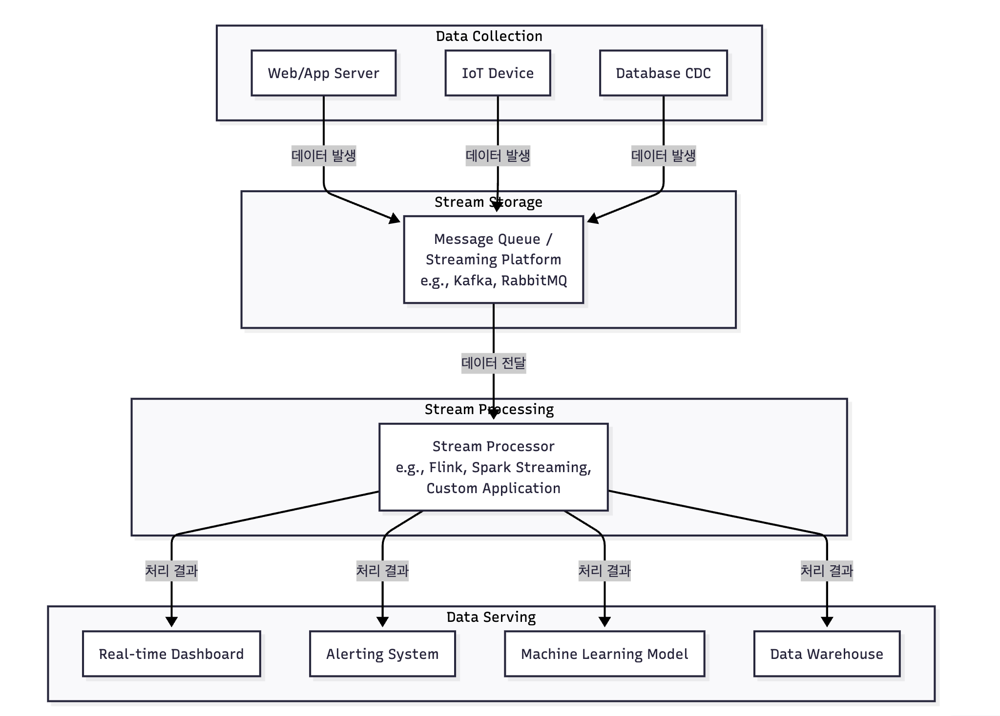
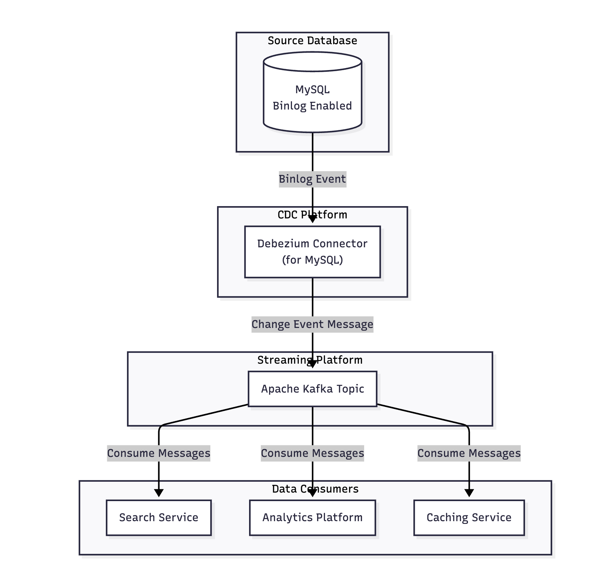
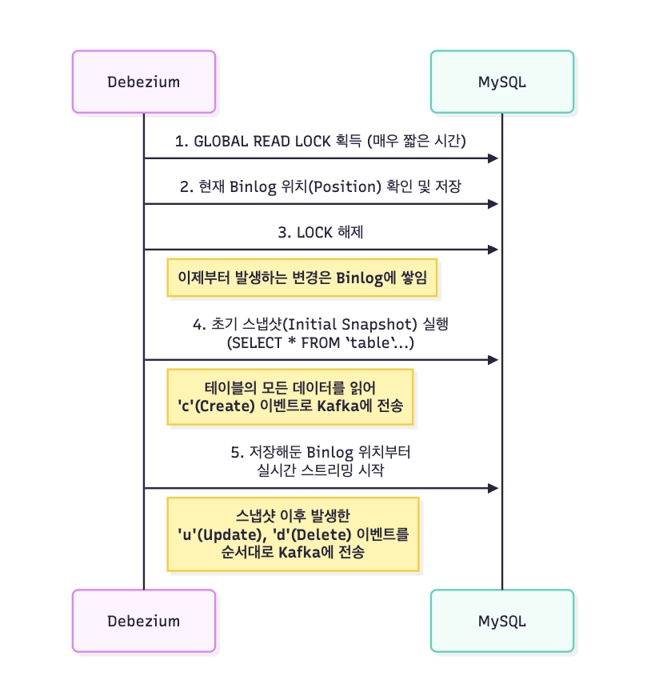
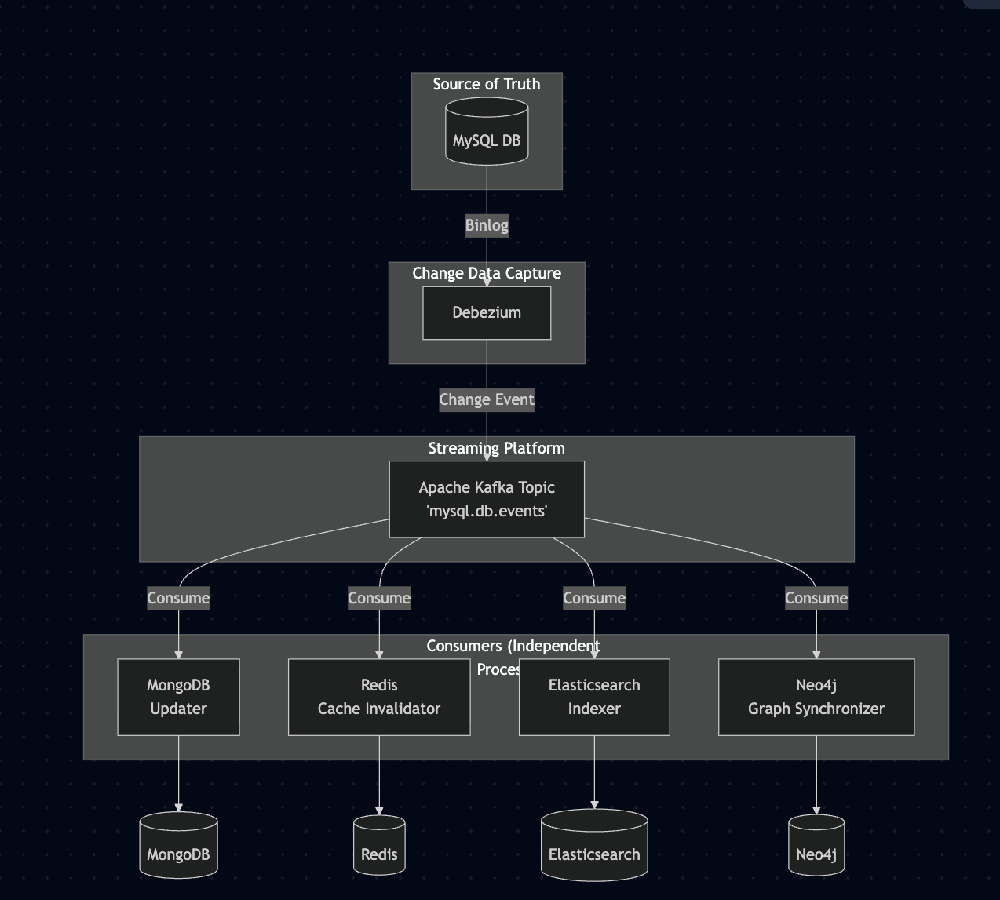

# 운영 레벨의 시스템 디자인 설계

## 스트리밍 데이터 처리

- 스트림 데이터가 발생하는 즉시 처리하는 기술
- 특징
  - 데이터가 끝없이 발생
  - 데이터 간격이 짧은 실시간성
  - 로그나 센서 신호 등과 같이 정해진 형식이 없음

### 파이프라인 구조



### MySQL에서의 스트림

- 가능하지만 효율적이지 않다.
- ex) 웹 사이트 클릭 로그가 스트림으로 실시간으로 들어온다.

```json
{ "user_id": 101, "page": "/products/1", "timestamp": "2024-04-25 10:00:01" }
```

```json
{ "user_id": 204, "page": "/main", "timestamp": "2024-04-25 10:00:03" }
```

```sql
SELECT
    page,
    COUNT(*) AS click_count
FROM clicks
GROUP BY
    -- 10초 간격의 텀블링 윈도우를 정의
    TUMBLE(timestamp, INTERVAL '10' SECOND),
    page;

-- 0 ~ 10분 사이 윈도우1
-- 10 ~ 20분 사이 윈도우2

-- Apache Flink SQL, Kafa SQL(ksqlDB)

-- 10:00:10 시점에 출력
{ "window_end": "10:00:10", "page": "/products/1", "click_count": 15 }
{ "window_end": "10:00:10", "page": "/main", "click_count": 8 }

-- 10:00:20 시점에 출력
{ "window_end": "10:00:20", "page": "/cart", "click_count": 12 }-- 웹 사이트 클릭 로그가 스트림으로 실시간으로 들어온다.
```

---

## 초대용량 배치 처리

- 대규모의 데이터를 정확하고 안정적으로 처리하는 것이 핵심이다.

### MySQL을 통한 전통적인 배치 처리

```sql
-- 스케줄러 & 스크립트의 조합
INSERT INTO daily_product_sales (product_id, total_sales_amount, total_sales_count, target_date)
SELECT
    product_id,
    SUM(sale_price * quantity),
    SUM(quantity),
    '2024-05-20'
FROM
    orders
WHERE
    created_at >= '2024-05-20 00:00:00' AND created_at < '2024-05-21 00:00:00'
GROUP BY
    product_id;
```

- 한계
1. 만약 처리 시간이 급증한다면?
2. DB 부하 -> 서비스에 영향
3. 장애 대응 문제

### 계산을 분산 처리 시스템에 위임

#### Map Reduce

- 분산 처리 시스템의 근간
- 거대한 데이터 처리 작업을 위해, 분할 정복 방식으로 해결한다.

#### Apache Spark

- Map Reduce를 구현하고, 인메모리 기술로 성능을 극대화 하는 시스템

1. 계산 위임 (스파크 클러스터에서 병렬 처리)
2. 병렬 데이터 로딩

```sparksql
-- 1. MySQL의 'orders' 테이블을 Spark에서 병렬로 읽어와 임시 뷰로 정의
CREATE OR REPLACE TEMPORARY VIEW orders_view
USING "jdbc"
OPTIONS (
  url              "jdbc:mysql://your-mysql-server:3306/service_db",
  dbtable          "orders",
  user             "spark_user",
  password         "spark_password",

  -- ▼ 병렬 읽기를 위한 핵심 옵션들 ▼
  partitionColumn  "order_id",         -- 데이터를 나눌 기준 컬럼 (숫자 타입, PK 권장)
  lowerBound       "1",                -- 기준 컬럼의 최소값
  upperBound       "100000000",        -- 기준 컬럼의 최대값
  numPartitions    "100"               -- 데이터를 몇 개로 나눌지 (파티션 개수)
);

-- Executor 1이 실행하는 쿼리
SELECT * FROM orders WHERE order_id >= 1 AND order_id < 1000000;

-- Executor 2가 실행하는 쿼리
SELECT * FROM orders WHERE order_id >= 1000000 AND order_id < 2000000;

-- Executor 100이 실행하는 쿼리
SELECT * FROM orders WHERE order_id >= 99000000 AND order_id <= 100000000;

-- 2. 실제 계산은 Spark 클러스터에서 병렬로 수행
--    (이 쿼리는 더 이상 MySQL이 아닌 Spark 엔진이 실행)
CREATE OR REPLACE TEMPORARY VIEW daily_summary AS
SELECT
    product_id,
    SUM(sale_price * quantity) AS total_amount,
    COUNT(*) AS total_count
FROM
    orders_view
WHERE
    created_at >= '2024-05-20 00:00:00' AND created_at < '2024-05-21 00:00:00'
GROUP BY
    product_id;

-- 3. 집계된 결과를 다시 다른 DB 테이블에 저장
INSERT INTO analytics_db.daily_product_sales
SELECT * FROM daily_summary;
```
 
---

## 실시간 데이터 동기화

### 안티 패턴

#### 1. 이중 쓰기 작업 

- 데이터 정합성을 맞추는 게 너무 어렵다.

```
-- Anti-pattern: Dual Writes
public void registerProduct(Product product) {
    --  1. MySQL에 저장
    mysqlRepository.save(product);

-- 2. Elasticsearch에 인덱싱
    try {
        elasticsearchClient.index(product);
} catch (Exception e) {
        -- ??? 어떻게 처리해야 할까? 롤백? 재시도? 무시?
    }

--  3. 캐시 업데이트
    redisClient.update(product);
}
```

#### 2. 배치 풀링

- DB 부하가 발생한다.
- 실시간성이 떨어진다.
- 또 삭제는 어떻게 처리할 것인가?

```sql
-- 5분마다 실행되는 스케줄러
SELECT * FROM products WHERE updated_at > '5분 전 시간';
```

### CDC

- 데이터베이스 내부 트랜잭션 로그를 직접 읽어서 데이터의 모든 변경사항을 실시간으로 스트리밍하는 기법
- MySQL의 Binary Log, Mongo DB의 OP Log

#### 다이어그램



#### Debezium




```json
{
  "schema": { ... }, // 메시지 구조를 정의하는 스키마 정보
  "payload": {
    "before": { // 변경 전 데이터
      "id": 123,
      "name": "Old Product Name",
      "price": 10000.00
    },
    "after": { // 변경 후 데이터
      "id": 123,
      "name": "New Product Name",
      "price": 12000.00
    },
    "source": { // 변경이 발생한 소스 정보
      "version": "1.9.7.Final",
      "connector": "mysql",
      "name": "mysql.prod-db.main",
      "ts_ms": 1678886400000,
      "db": "mydatabase",
      "table": "products",
      "server_id": 1,
      "gtid": null,
      "file": "mysql-bin.000123", // Binlog 파일명
      "pos": 4567,               // Binlog 위치
      "row": 0
    },
    "op": "u", // Operation 타입: 'c'(create), 'u'(update), 'd'(delete)
    "ts_ms": 1678886400500, // Debezium이 이벤트를 처리한 시간
    "transaction": null
  }
}
```

----

## MYSQL의 작업 큐

### 안티 패턴을 먼저 살펴보자. (Synchronous Processing)

```java
public void signUp(User user) {
    // 1. 사용자 정보를 DB에 저장 (빠름)
    userRepository.save(user);

    // 2. 환영 이메일 발송 (느릴 수 있음)
    emailService.sendWelcomeEmail(user.getEmail());

    // 3. 신규 가입 쿠폰 발급 (느릴 수 있음)
    couponService.issueSignUpCoupon(user.getId());

    // 4. 모든 작업이 끝나야 사용자에게 응답이 감
}
```

### 비동기 작업 등록

```sql
BEGIN; -- 트랜잭션 시작

-- 1. 핵심 비즈니스 로직
INSERT INTO users (name, email) VALUES ('John Doe', 'john.doe@example.com');
SET @user_id = LAST_INSERT_ID();

-- 2. 비동기 작업 등록
INSERT INTO jobs (job_type, payload, priority)
VALUES ('SEND_WELCOME_EMAIL', JSON_OBJECT('user_id', @user_id), 100);

INSERT INTO jobs (job_type, payload, priority)
VALUES ('ISSUE_SIGNUP_COUPON', JSON_OBJECT('user_id', @user_id), 200);

COMMIT; -- 트랜잭션 종료
```

### 비관적 락을 사용한다면?

- 락이 걸린 행을 건너뛰어 효율성을 증대시킬 수 있다.

```sql
-- 1. 처리할 작업을 찾고, 해당 행에 배타적 락(Exclusive Lock)을 건다.
--    다른 워커는 이 행에 접근할 수 없게 된다.
SET @job_id = (
    SELECT id FROM jobs
    WHERE status = 'PENDING' AND run_at <= NOW()
    ORDER BY priority ASC, id ASC
    LIMIT 1
    FOR UPDATE SKIP LOCKED -- MySQL 8.0+ : 락이 걸린 행은 건너뛰고 다음 행을 찾음
);

-- 2. 만약 처리할 작업이 있다면 (job_id가 NULL이 아니라면)
IF @job_id IS NOT NULL THEN
  -- 상태를 'RUNNING'으로 변경하여 다른 워커가 가져가지 못하도록 명시한다.
UPDATE jobs SET status = 'RUNNING' WHERE id = @job_id;
END IF;

COMMIT; -- 트랜잭션 종료. 락이 해제된다.
```

### 재시도 처리

```sql
-- pseudo code
SET @new_retry_count = retry_count + 1;
SET @delay = POWER(10, @new_retry_count); -- 10, 100, 1000... 초 지연 (예시)

UPDATE jobs
SET
    status = 'PENDING', -- 재시도를 위해 PENDING으로 변경
    retry_count = @new_retry_count,
    last_error_message = '...',
    run_at = NOW() + INTERVAL @delay SECOND -- 다음 실행 시간을 뒤로 미룸
WHERE id = @job_id;
```

---

## NoSQL과의 결합

### 상품 도메인 예시

- MySQL : 상품의 정보만을 저장
- MongoDB : 상품별로 다른 옵션이나 상세 설명과 같은 스키마를 가진다.

### 장바구니와 세션 관리 예시 

- Redis 연동
  - 최종적으로 주문했을 시에만 MySQL에 저장
  - 중간 과정(장바구니)은 메모리 기반으로 처리

### Full Text 검색

- MySQL의 풀 텍스트 검색을 사용할 수도 있지만, 더 뛰어난 성능을 자랑하는 ElasticSearch를 검색 엔진으로 활용해볼 수도 있다.

### 데이터 일관성 보장



---

# 마무리

1. 시스템 요구사항을 고려하자. 그냥 적용해보고 싶어서 불필요한 NoSQL을 붙이지 말자.
2. 분산 트랜잭션을 고민 -> 오히려 단일 MySQL이 좋을 수도 있다.

