# 5장 레디스를 캐시로 사용하기

## 레디스와 캐시

- 애플리케이션이 다음 조건을 만족시킨다면 캐시를 도입했을 때 성능을 효과적으로 개선할 수 있다.
1. 원본 데이터 저장소에서 원하는 데이터를 찾기 위해 검색하는 시간이 오래 걸리거나, 매번 계산을 통해 데이터를 가져와야 한다.
2. 캐시에서 데이터를 가져오는 것이 원본 데이터 저장소 데이터를 요청하는 것보다 빨라야 한다.
3. 캐시에 저장된 데이터는 잘 변하지 않는 데이터다.
4. 캐시에 저장된 데이터는 자주 검색되는 데이터다.

### 캐시로서의 레디스

- 장점이 많다.
1. 사용이 간단하다.
2. 모든 데이터를 메모리에 저장하는 인메모리 데이터 저장소이기 때문에 속도가 상당히 빠르다. 
   - 평균 읽기 및 쓰기 작업 속도가 1ms 미만 => 초당 수백만 건의 작업이 가능함을 의미
3. 자체적으로 고가용성 기능을 가진 솔루션이다.
    - 일부 캐싱 전략에서는 캐시에 접근할 수 없게 되면 이는 곧바로 서비스의 장애로 이어질 수 있다.
    - 레디스의 센티널 또는 클러스터 기능을 사용하면 마스터 노드의 장애를 자동으로 감지해 failover를 발생시키기 때문에 운영자의 개입 없이 캐시는 정상으로 유지될 수 있어 가용성이 높아진다.
4. 레디스의 클러스터를 사용하면 캐시의 scale out 또한 쉽게 처리할 수 있다.
    - 자체 샤딩 솔루션인 클러스터를 사용하면 수평 확장이 굉장히 간단해진다는 장점이 존재한다.

### 캐싱 전략

#### 읽기 전략 

##### 1. look aside

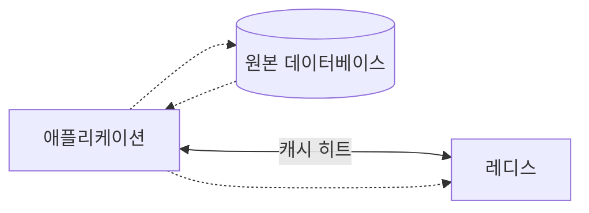

- 위 그림과 같이 애플리케이션은 찾고자 하는 데이터가 먼저 캐시에 있는지 확인한 뒤, 캐시에 데이터가 있으면 캐시에서 데이터를 읽어온다. (캐시 히트)
- 찾고자 하는 데이터가 없을 때에는 캐시 미스가 발생하며 아래와 같이 동작하게 된다.

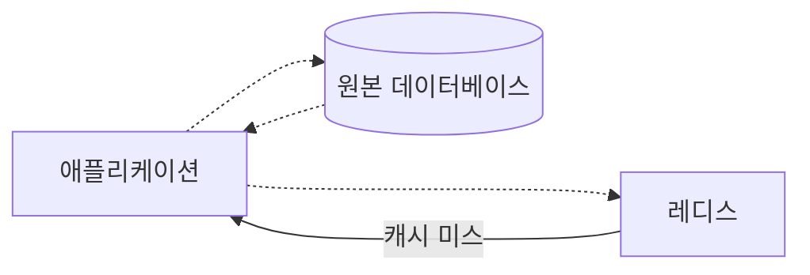

- 레디스로부터 데이터가 없다는 응답을 받은 애플리케이션은 직접 데이터베이스에 접근해 찾고자 하는 데이터를 가져온다.
  - 그 뒤 애플리케이션은 이를 다시 캐시에 저장하는 과정을 거친다.
- `look aside` 구조의 장점은 레디스에 문제가 생겨 접근을 할 수 없는 상황이 발생하더라도 바로 서비스 장애로 이어지지 않고 데이터베이스에서 데이터를 가지고 올 수 있다는 것이다.
  - 하지만 기존에 애플리케이션에서 레디스를 통해 데이터를 가져오는 연결이 매우 많았다면 모든 커넥션이 한꺼번에 원본 데이터베이스로 몰려 많은 부하를 발생시키고, 이로 인해 원본 데이터베이스의 응답이 느려지거나 리소스를 많이 차지하는 등의 이슈가 발생해 애플리케이션의 성능에 영향을 미칠 수 있다.
- 찾고자 하는 데이터가 레디스에 없을 때에만 레디스에 데이터가 저장되기 때문에 이와 같은 구조는 `lazy loading`이라고도 부른다.
- 지연을 최대한 줄이기 위해 데이터베이스에서 캐시로 데이터를 밀어넣어주는 작업을 하기도 하는데, 이를 `캐시 워밍 cache warming`이라고도 한다.

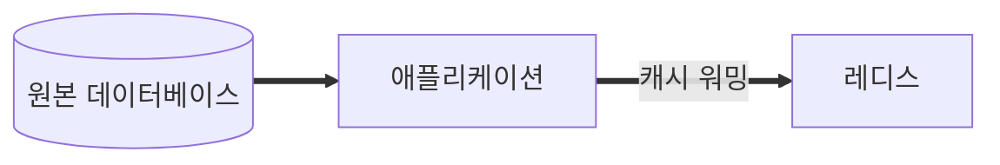

##### 2. Read Through

- 캐시에서만 데이터를 읽어오는 전략 (inline cache)
- Look Aside와 비슷하지만 데이터 동기화를 라이브러리 또는 캐시 제공자에게 위임한다는 차이가 있다.
- 데이터 조회를 전적으로 캐시에 의지하므로, redis가 다운될 경우 서비스 이요에 차질이 생길 수 있다.
  - 따라서 캐시와 DB 간의 데이터 동기화가 항상 이뤄져야 데이터 정합성 문제에서 벗어날 수 있다. 

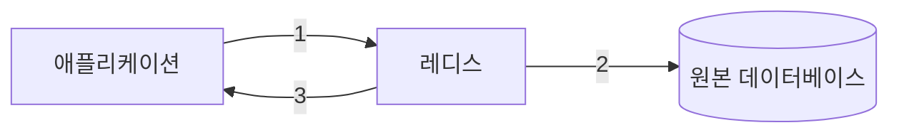

1. Cache Store에 검색하는 데이터가 있는지 확인 (Cache hit)
2. Cache Store에 없을 경우 캐시에서 DB에 데이터를 조회하여 자체 업데이트 (Cache miss)
3. Cache에서 데이터를 가져옴

#### 쓰기 전략과 캐시의 일관성

- 캐시는 데이터베이스에 저장돼 있는 데이터를 단순히 복사해 온 값이다.
  - 따라서 원본 데이터와 동일한 값을 갖도록 유지하는 것이 필수적이다.
  - 만약 데이터가 변경될 때 원본 데이터베이스에만 업데이트돼 캐시에는 변경된 값이 반영되지 않는다면 데이터 간 불일치가 일어난다. => `캐시 불일치 cache inconsisency`

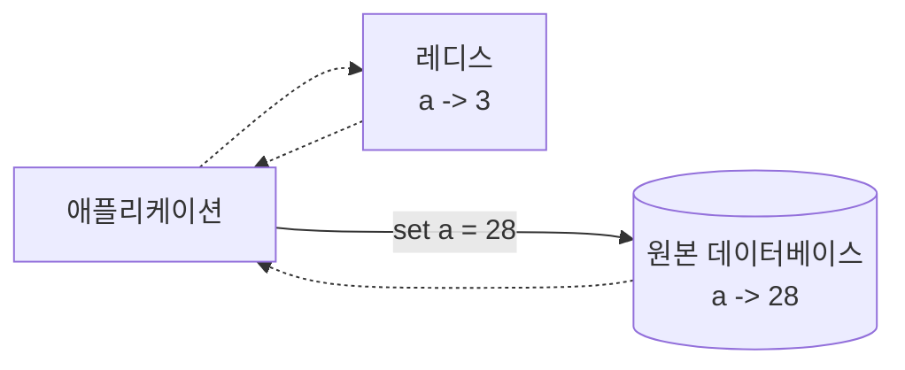

- 캐시를 이용한 쓰기 전략은 대표적으로 세 가지가 있다.

##### 1. write through

- 데이터베이스를 업데이트할 때마다 매번 캐시에도 데이터를 함께 업데이트시키는 방식.
- 데이터를 매번 2개의 저장소에 저장해야 하기 때문에 데이터를 쓸 때마다 시간이 많이 소요될 수 있다.

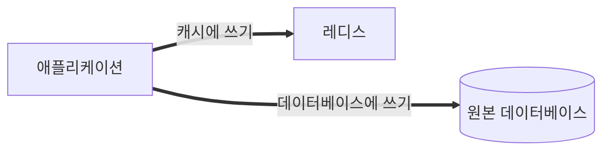

- 무조건 캐시에도 저장되기 때문에 일종의 리소스 낭비가 발생할 수 있다고 볼 수 있다.
  - 따라서 이 방식을 사용할 경우 데이터를 저정할 때 만료 시간을 사용할 것을 권장한다.

##### 2. cache invalidation

- 데이터베이스에 값을 업데이트할 때마다 캐시에서는 데이터를 삭제하는 전략.
- 저장소에서 특정 데이터를 삭제하는 것이 새로운 데이터를 저장하는 것보다 훨씬 리소스를 적게 사용하기 때문에 앞선 `write through`의 단점을 보완한 방식

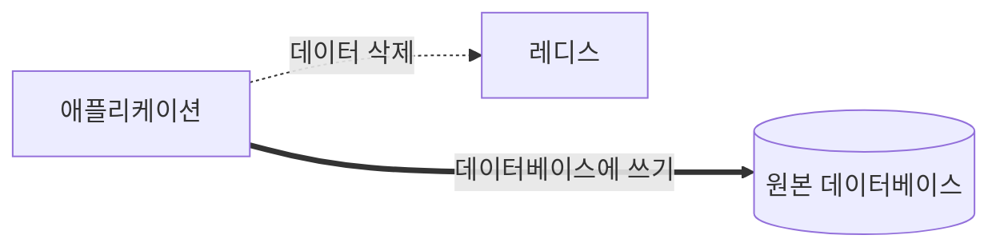

##### 3. write behind(write back)

- 쓰기가 빈번하다면 `write behind` 방식을 고려해볼 수 있다.

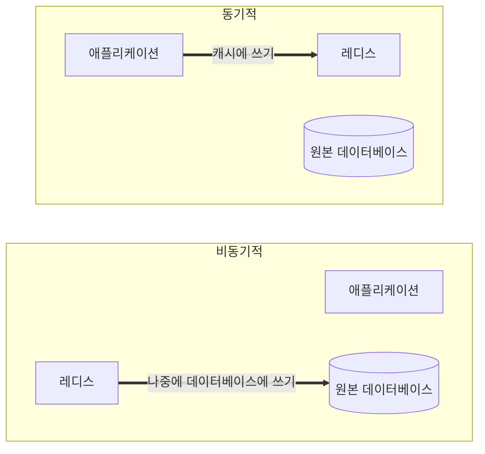

- 저장되는 데이터가 실시간으로 정확한 데이터가 아니어도 되는 경우 이 방법이 유용할 수 있다.
- 물론, 이 방법에서는 캐시에 문제가 생겨 데이터가 날아갈 경우 최대 5분 동안의 데이터가 날아갈 수 있다는 위험성이 있음을 감수해야 한다.

##### 4. Write Around

- 모든 데이터를 DB에 저장하는 방법
- Write Through보다 훨씬 빠르다는 장점
- Cache miss가 발생하는 경우에만 캐시에 데이터 저장
  - 따라서 캐시와 DB 내의 데이터가 다를 수 있다.

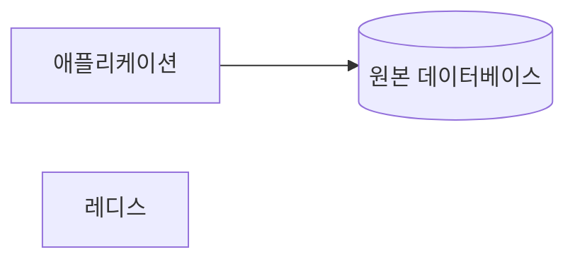

<br/>

## 캐시에서의 데이터 흐름

- 레디스는 메모리에 모든 데이터를 저장하기 때문에 기본적으로 스토리지보다 훨씬 적은 양을 보관할 수밖에 없다.
- 따라서 캐시는 가득 차지 않게 일정 양의 데이터를 유지해야 하며 계속해서 새로운 데이터가 저장되고 기존 데이터는 삭제될 수 있도록 관리돼야 한다.
- 따라서 캐시로 레디스를 사용할 때에는 데이터를 저장함과 동시에 적절한 시간의 TTL 값을 지정하는 것이 좋다.

### 만료 시간

- `TTL, Time To Live`은 데이터가 얼마나 오래 저장될 것인지를 나타내는 시간 설정이다.
- 레디스에 저장된 키에 EXPIRE 커맨드를 사용하면 만료 시간을 설정할 수 있다.
- SET 커맨드로 string 데이터를 저장할 때에는 EX 옵션을 함께 사용해 데이터의 저장과 동시에 만료 시간을 설정할 수도 잇다.
- TTL 값
  - `-2`: 키가 존재하지 않음
  - `-1`: 만료 시간이 지정되지 않음
- 단위
  - `EXPIRE`, `TTL`: 초 단위
  - `PTTL`, `PEXPRIE`: 밀리초 단위

> #### 참고
> - 레디스에서 키가 만료됐다고 바로 메모리에서 삭제되는 것은 아니다. 키는 passive 방식과 active 방식 두 가지로 삭제된다.
> - `passive` 방식: 클라이언트가 키에 접근하고자 할 때 키가 만료됐다면 메모리에서 수동으로 삭제한다. 사용자가 접근할 때에만 삭제된다는 의미다. 그러나 사용자가 다시 접근하지 않는 경우 만료된 키가 그대로 남아 있어, `passive` 방식만으로는 키 제거에 충분하지 않다.
> - `active` 방식: TTL 값이 있는 키 중 20개를 랜덤하게 뽑아낸 뒤, 만료된 키를 모두 메모리에서 삭제한다. 만약 25% 이상의 키가 삭제됐다면 다시 20개의 키를 랜덤하게 뽑은 뒤 확인하고, 아니라면 뽑아놓은 20개의 키 집합에서 다시 확인. 이러한 과정을 1초에 10번씩 수행한다.
> - 만료된 키를 곧바로 삭제하지 않기 때문에 키를 삭제하는 데에 들어가는 리소스를 줄일 수 있지만, 그만큼 메모리를 더 사용할 가능성이 존재한다. 최악의 경우 전체 메모리의 1/4가 이미 만료된 키 값일 수 있다.

### 메모리 관리와 maxmemory-policy 설정

- 레디스에서 키의 만료 시간을 설정해 데이터가 자동으로 삭제되도록 함으로써 데이터의 수명을 관리할 수 있다.
- 하지만 만료 시간이 지나기 전에 메모리가 가득차게된다면 어떤 상황이 발생하게 될까?
  - 내부 정책을 사용해 어떤 키를 삭제할지 결정한다.

#### Noeviction

- 기본값이다. 데이터를 삭제하지 않고, 더 이상 레디스에 데이터를 저장할 수 업사는 에러를 반환한다.
  - 이는 데이터의 관리를 캐시에게 맡기지 않고, 애플리케이션 측에서 관리하겠다는 것을 의미한다.
- 하지만 캐시에 데이터를 저장하지 못해 에러가 발생할 경우 로직에 다라 장애로 이어질 수 있으므로, 권장하지 않는다.

#### LRU eviction

- LRU. Least-Recently Used
- 가장 오랫동안 사용되지 않은 데이터부터 삭제하는 정책이다.
- `volatile-lru`: 만료 시간이 설정돼 있는 키에 한해서 키를 삭제.
- `allkeys-lru`: 모든 키에 대해 LRU로 키 삭제. 공식 문서에서는 정책을 잘 모르겠다면 `allkeys-lru` 방식을 사용하기를 권장.

#### LFU eviction

- 자주 사용되지 않은 데이터부터 삭제하는 정책.
- `volatile-lfu`: 만료 시간이 설정돼 있는 키에 한해서 LFU 방식으로 삭제
- `allkeys-lfu`: 모든 키에 대해 LFU 방식으로 삭제

> #### 참고
> - 레디스에서 키를 삭제하기 위해 사용되는 LRU와 LFU 알고리즘은 모두 근사 일고리즘으로 구현됐다.
> - 메모리가 가득 찬 상황에서 가장 오래 사용되지 않거나 자주 사용되지 않은 키를 정확하게 찾아내는 것이 불필요하게 CPU 및 메모리 리소스를 소비할 수 때문이다.

#### RANDOM eviction

- 레디스에 저장된 키 중 하나를 임의로 골라내 삭제한다.
- 값을 계산할 필요가 없기 때문에 레디스의 부하를 줄일 수 있다.
  - 하지만 굳이 레디스를 부하를 줄이기 위한 이유로 `random evection`을 사용하는 것은 권장하지 않는다.
- `volatile-random`: 만료 시간이 설정돼 있는 키를 랜덤으로 삭제
- `allkeys-random`: 모든 키를 대상으로 랜덤으로 골라 삭제

#### `voliatile-ttl`

- 만료 시간이 가장 작은 키부터 삭제
- 다른 알고리즘과 마찬가지로 근사 알고리즘 사용.

### 캐시 스탬피드 현상

- cache stampede
- 대규모 트래픽 환경에서 만료 시간을 어떻게 설정하느냐에 다라 캐시 스탬피드와 같은 예상치 못한 문제 상황이 발생할 수 있다.

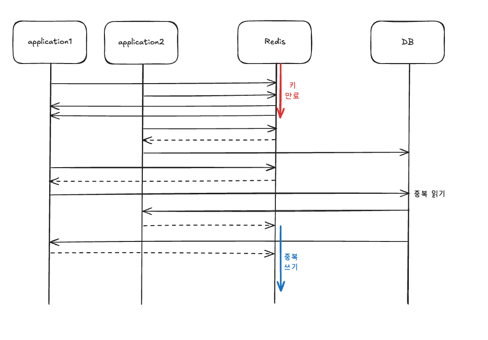

- 중복 읽기는 데이터베이스에 부하를 줄 수 있으며, 이는 곧 서비스 이슈로도 이어질 수 있다.
- 한번 캐시 스탬피드 현상이 발생하면 결과적으로 더 많은 데이터가 이 현상의 영향을 받게 돼, 더 큰 문제로 이어질 수 있다.
  - 이런 이유로 이 현상은 `계단식 실패 cascading failure`라고도 부른다.

#### 적절한 만료 시간 설정

- 캐시 스탬피드를 줄이기 가장 간단한 방법. 캐시 만료 시간을 너무 짧지 않게 설정하는 것.

#### 선 계산

- look aside 방식으로 캐시를 사용할 때 애플리케이션은 다음 코드와 비슷하게 동작하게 된다.

```python
def fetch(key):
    value = redis.get(key)
    if (!value):
        value = db.fetch(key)
        redis.set(value)
    return value
```

- 캐시 스탬피드가 문제가 되는 이유는 데이터가 만료되는 시점에 여러 애플리케이션에서 동시다발적으로 이를 인지하고, 이후 작업을 동시에 진행하기 때문이다.
  - 만약 키가 실제로 만료되기 전에 이 값을 미리 갱신해준다면 여러 애플리케이션에서 한꺼번에 데이터베이스에 접근해 데이터를 읽어오는 과정을 줄여 불필요한 프로세스를 줄일 수 있다.
- 아래 코드는 레디스가 실제로 만료되기 전 랜덤한 확률로 데이터베이스에 접근해서 데이터를 읽어와 캐시의 값을 갱신하는 과정을 거친다.

```python
def fetch(key):
    ttl = redis.ttl(key)
    
    if ttl - (random() * expiry_gap) > 0:
        return redis.get(key)
    
    else:
        value = db.fetch(key)
        redis.set(value, KEY_TTL)
        return value
```

#### PER 알고리즘

- Probabilistic Early Recomputation
- 캐시 값이 만료되기 전에 언제 데이터베이스에 접근해서 값을 읽어오면 되는지 최적으로 계산이 가능하다.

```
currentTime - ( timeToCompute * beta * log(rand()) ) > expiry
```

- `currentTime`: 현재 남은 만료 시간
- `timeToCompute`: 캐시된 값을 다시 계산하는 데 걸리는 시간
- `beta`: 기본적으로 1.0보다 큰 값으로 설정 가능(?)
- `rand()`: 0과 1 사이의 랜덤 값을 반환하는 함수
- `expiry`: 키를 재설정할 때 새로 넣어줄 만료 시간

-----

## 세션 스토어로서의 레디스

### 세션이란?

- 세션이란 서비스를 사용하는 클라이언ㅌ의 상태 정보를 의미한다.

### 세션 스토어가 필요한 이유

- 웹 서버를 늘리면 어러 개의 웹 서버에 트래픽을 분산할 수 있기 때문에 더 많은 유저를 수용할 수 있게 된다.
  - 이때 각 웹 서버별로 세션 스토어를 따로 관리한다면 유저는 유저의 세션 정보를 갖고 있는 웹 서버에 종속되어야 한다. 그렇지 않으면 유저 데이터 정합성에 문제가 생길 수 있다.
  - 쇼핑 카트에 상품을 저장했는데, 서버에 재접속할 때마다 아이템이 사라졌다 생겼다 한다면 정상적인 서비스 이용이 불가능하다.
- 이 문제를 해결하기 위해 `sticky session`을 사용하기도 하는데, 이는 로드밸런서에 부하를 준다.
- 혹은 `all-to-all` 방법을 사용하는 방법도 있다.
  - 세션 정보를 모든 웹 서버에 복제하여 저장하는 방법인데, 이 방법은 불필요한 저장 공간을 사용해야 한다는 단점이 있다.
- 데이터베이스를 세션 스토어를 사용하는 방법도 있다.
  - 하지만 이 또한 유저가 많아져 세션 스토어의 응답 속도가 낮아진다는 단점이 존재한다.
- 레디스를 세션 스토어로 사용한다면 앞의 모든 이슈를 해결할 수 있다.

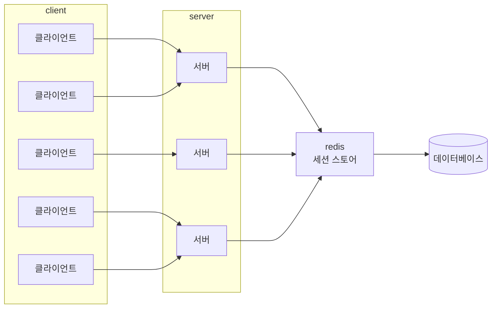

- 유저는 어떤 웹 서버에 연결되더라도 동일한 세션 데이터를 조회할 수 있어 트래픽 분산에도 도움이 되고, 데이터 일관성도 고려할 필요가 없다.

### 캐시와 세션의 차이

- 가장 일반적인 `look aside` 전략을 이용할 때 데이터는 아래와 같이 동작한다.

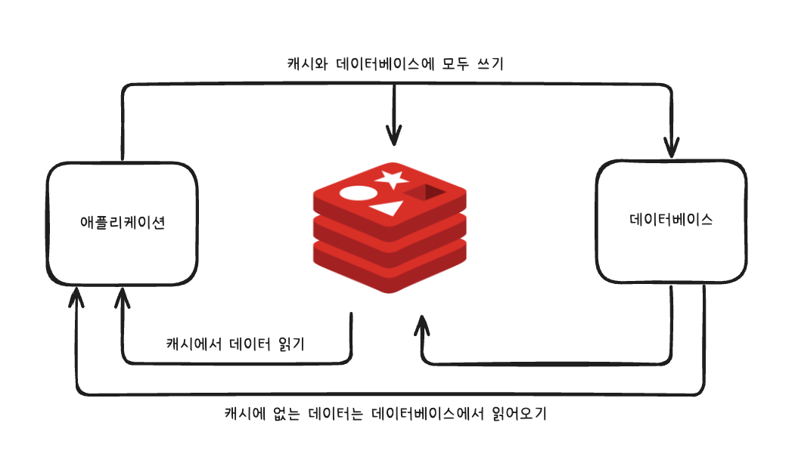

- 캐시는 데이터베이스의 완벽한 서브셋으로 동작한다.
  - 즉, 캐시가 갖고 있는 데이터는 모두 데이터베이스에 저장돼 있으며, 따라서 캐시 내부의 데이터가 유실되더라도 해당 데이터는 데이터베이스에서 찾을 수 있다.
- 캐시에 저장된 데이터는 여러 애플리케이션에서 함께 사용할 수 있고, 여러 애플리케이션이 함께 사용할수록 더 효율적이다.
  - 하지만 세션 스토어에 저장된 데이터는 여러 사용자 간 공유되지 않으며, 특정 사용자 ID에 한해 유효하다.

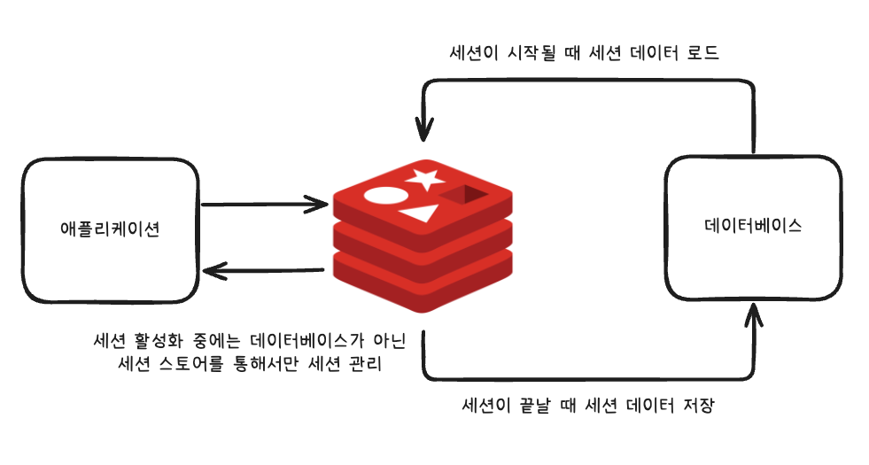

- 이때 세션 스토어에 장애가 발생하면 내부 데이터가 손실될 가능성이 있으므로 레디스를 세션세션 스토어로 활용할 때에는 레디스를 캐시로 사용할 때보다 더 신중한 운영이 필요하다.


# 참고자료

- 개발자를 위한 레디스, 김가람 지음
- [[REDIS] 캐시(Cache) 설계 전략 지침 총정리](https://inpa.tistory.com/entry/REDIS-%F0%9F%93%9A-%EC%BA%90%EC%8B%9CCache-%EC%84%A4%EA%B3%84-%EC%A0%84%EB%9E%B5-%EC%A7%80%EC%B9%A8-%EC%B4%9D%EC%A0%95%EB%A6%AC)
