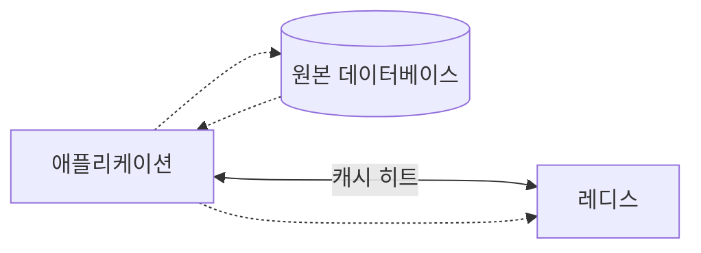
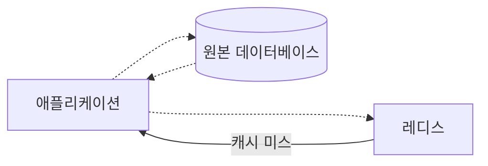
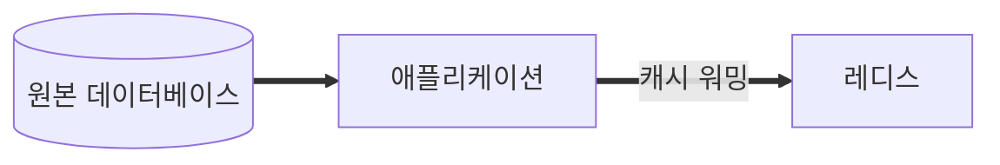
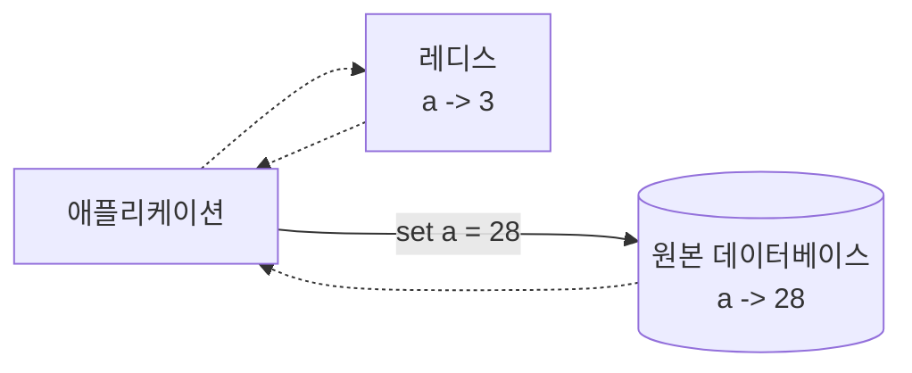
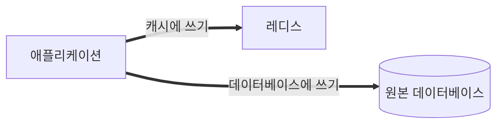
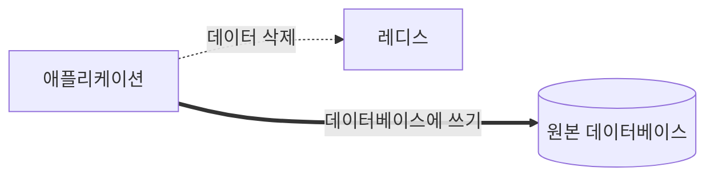
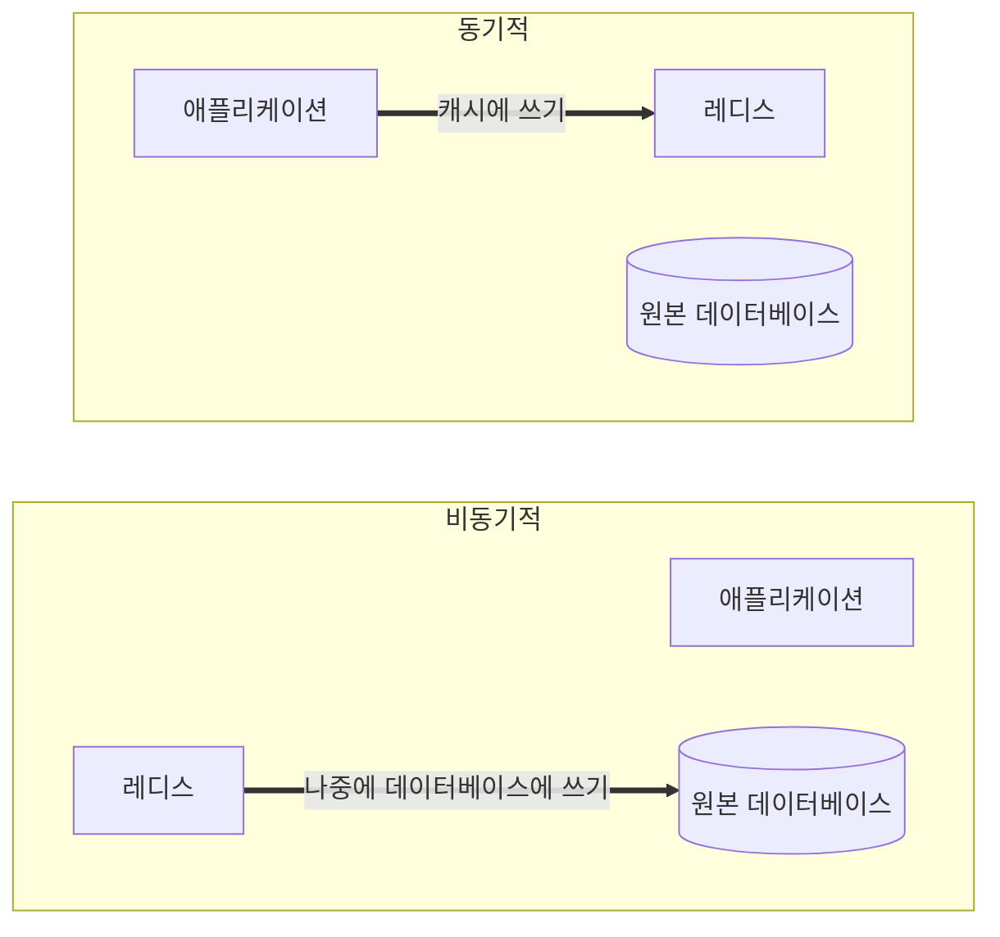

# 5장 레디스를 캐시로 사용하기

## 레디스와 캐시

- 애플리케이션이 다음 조건을 만족시킨다면 캐시를 도입했을 때 성능을 효과적으로 개선할 수 있다.
1. 원본 데이터 저장소에서 원하는 데이터를 찾기 위해 검색하는 시간이 오래 걸리거나, 매번 계산을 통해 데이터를 가져와야 한다.
2. 캐시에서 데이터를 가져오는 것이 원본 데이터 저장소 데이터를 요청하는 것보다 빨라야 한다.
3. 캐시에 저장된 데이터는 잘 변하지 않는 데이터다.
4. 캐시에 저장된 데이터는 자주 검색되는 데이터다.

### 캐시로서의 레디스

- 장점이 많다.
1. 사용이 간단하다.
2. 모든 데이터를 메모리에 저장하는 인메모리 데이터 저장소이기 때문에 속도가 상당히 빠르다. 
   - 평균 읽기 및 쓰기 작업 속도가 1ms 미만 => 초당 수백만 건의 작업이 가능함을 의미
3. 자체적으로 고가용성 기능을 가진 솔루션이다.
    - 일부 캐싱 전략에서는 캐시에 접근할 수 없게 되면 이는 곧바로 서비스의 장애로 이어질 수 있다.
    - 레디스의 센티널 또는 클러스터 기능을 사용하면 마스터 노드의 장애를 자동으로 감지해 failover를 발생시키기 때문에 운영자의 개입 없이 캐시는 정상으로 유지될 수 있어 가용성이 높아진다.
4. 레디스의 클러스터를 사용하면 캐시의 scale out 또한 쉽게 처리할 수 있다.
    - 자체 샤딩 솔루션인 클러스터를 사용하면 수평 확장이 굉장히 간단해진다는 장점이 존재한다.

### 캐싱 전략

#### 읽기 전략 - look aside

- 위 그림과 같이 애플리케이션은 찾고자 하는 데이터가 먼저 캐시에 있는지 확인한 뒤, 캐시에 데이터가 있으면 캐시에서 데이터를 읽어온다. (캐시 히트)
- 찾고자 하는 데이터가 없을 때에는 캐시 미스가 발생하며 아래와 같이 동작하게 된다.

- 레디스로부터 데이터가 없다는 응답을 받은 애플리케이션은 직접 데이터베이스에 접근해 찾고자 하는 데이터를 가져온다.
  - 그 뒤 애플리케이션은 이를 다시 캐시에 저장하는 과정을 거친다.
- `look aside` 구조의 장점은 레디스에 문제가 생겨 접근을 할 수 없는 상황이 발생하더라도 바로 서비스 장애로 이어지지 않고 데이터베이스에서 데이터를 가지고 올 수 있다는 것이다.
  - 하지만 기존에 애플리케이션에서 레디스를 통해 데이터를 가져오는 연결이 매우 많았다면 모든 커넥션이 한꺼번에 원본 데이터베이스로 몰려 많은 부하를 발생시키고, 이로 인해 원본 데이터베이스의 응답이 느려지거나 리소스를 많이 차지하는 등의 이슈가 발생해 애플리케이션의 성능에 영향을 미칠 수 있다.
- 찾고자 하는 데이터가 레디스에 없을 때에만 레디스에 데이터가 저장되기 때문에 이와 같은 구조는 `lazy loading`이라고도 부른다.
- 지연을 최대한 줄이기 위해 데이터베이스에서 캐시로 데이터를 밀어넣어주는 작업을 하기도 하는데, 이를 `캐시 워밍 cache warming`이라고도 한다.

#### 쓰기 전략과 캐시의 일관성

- 캐시는 데이터베이스에 저장돼 있는 데이터를 단순히 복사해 온 값이다.
  - 따라서 원본 데이터와 동일한 값을 갖도록 유지하는 것이 필수적이다.
  - 만약 데이터가 변경될 때 원본 데이터베이스에만 업데이트돼 캐시에는 변경된 값이 반영되지 않는다면 데이터 간 불일치가 일어난다. => `캐시 불일치 cache inconsisency`

- 캐시를 이용한 쓰기 전략은 대표적으로 세 가지가 있다.

##### 1. write through

- 데이터베이스를 업데이트할 때마다 매번 캐시에도 데이터를 함께 업데이트시키는 방식.
- 데이터를 매번 2개의 저장소에 저장해야 하기 때문에 데이터를 쓸 때마다 시간이 많이 소요될 수 있다.

- 무조건 캐시에도 저장되기 때문에 일종의 리소스 낭비가 발생할 수 있다고 볼 수 있다.
  - 따라서 이 방식을 사용할 경우 데이터를 저정할 때 만료 시간을 사용할 것을 권장한다.

##### 2. cache invalidation

- 데이터베이스에 값을 업데이트할 때마다 캐시에서는 데이터를 삭제하는 전략.
- 저장소에서 특정 데이터를 삭제하는 것이 새로운 데이터를 저장하는 것보다 훨씬 리소스를 적게 사용하기 때문에 앞선 `write through`의 단점을 보완한 방식

##### 3. write behind(write back)

- 쓰기가 빈번하다면 `write behind` 방식을 고려해볼 수 있다.

- 저장되는 데이터가 실시간으로 정확한 데이터가 아니어도 되는 경우 이 방법이 유용할 수 있다.
- 물론, 이 방법에서는 캐시에 문제가 생겨 데이터가 날아갈 경우 최대 5분 동안의 데이터가 날아갈 수 있다는 위험성이 있음을 감수해야 한다.

 

## 캐시에서의 데이터 흐름

- 레디스는 메모리에 모든 데이터를 저장하기 때문에 기본적으로 스토리지보다 훨씬 적은 양을 보관할 수밖에 없다.
- 따라서 캐시는 가득 차지 않게 일정 양의 데이터를 유지해야 하며 계속해서 새로운 데이터가 저장되고 기존 데이터는 삭제될 수 있도록 관리돼야 한다.
- 따라서 캐시로 레디스를 사용할 때에는 데이터를 저장함과 동시에 적절한 시간의 TTL 값을 지정하는 것이 좋다.

### 만료 시간

- `TTL, Time To Live`은 데이터가 얼마나 오래 저장될 것인지를 나타내는 시간 설정이다.
- 레디스에 저장된 키에 EXPIRE 커맨드를 사용하면 만료 시간을 설정할 수 있다.
- SET 커맨드로 string 데이터를 저장할 때에는 EX 옵션을 함께 사용해 데이터의 저장과 동시에 만료 시간을 설정할 수도 잇다.
- TTL 값
  - `-2`: 키가 존재하지 않음
  - `-1`: 만료 시간이 지정되지 않음
- 단위
  - `EXPIRE`, `TTL`: 초 단위
  - `PTTL`, `PEXPRIE`: 밀리초 단위

# 참고자료

- 개발자를 위한 레디스, 김가람 지음
