# 6장 레디스를 메시지 브로커로 사용하기

- 서비스 간 통신이 불가능한 상황이 바로 장애로 이어지지 않게, 당장 메시지를 처리하지 못하더라도 보낸 메시지를 어딘가에 쌓아둔 뒤 나중에 처리할 수 있는 채널을 만들어 주는 것. 이것이 메시지 브로커의 핵심 역할이라고 할 수 있다.
- 메시지 브로커는 크게 메시징 큐와 이벤트 스트림이라는 두 가지 형태로 나눌 수 있다.

## 메시징 큐와 이벤트 스트림

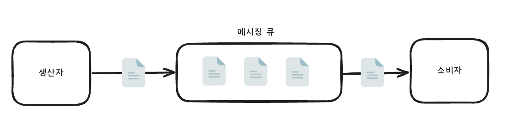

- `생산자 producer`: 데이터를 생성하는 쪽
- `소비자 consumer`: 데이터를 수신하는 쪽

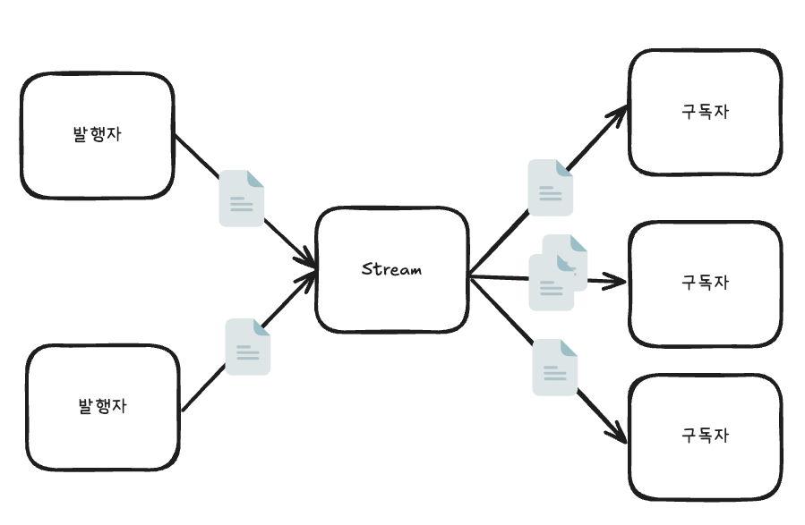

- `발행자 publisher`: 데이터를 생성하는 쪽
- `구독자 subscriber`: 데이터를 조회하는 쪽

---

- 메시징 큐는 1대1
- 스트림은 다대다

#### 메시징 큐와 이벤트 스트림의 2가지 차이점

1. 방향성
- 메시징 큐의 생산자는 소비자의 큐로 데이터를 직접 푸시.
  - 2개의 서비스에 같은 메시지를 보내야 할 때 메시징 큐를 이용한다면 생산자는 2개의 각각 다른 메시징 큐에 각각 데이터를 `푸시 push`해야 한다.
- 반면 스트림을 이용하면 생산자는 스트림의 특정 저장소에 하나의 메시지를 보낼 수 있고, 메시지를 읽어가고자 하는 소비자들은 스트림에서 같은 메시지를 `풀 pull`해 갈 수 있기 때문에 메시지를 복제해서 저장하지 않아도 된다.

2. 영속성
- 메시징 큐에서는 소비자가 데이터를 읽어갈 때 큐에서 데이터를 삭제
- 이벤트 스트림에서 구독자가 읽어간 데이터는 바로 삭제되지 않고, 저장소의 설정에 따라 특정 기간 동안 저장될 수 있다.
  - 새롭게 추가된 구독자들이 이전 히스토리를 확인할 수 있다는 뜻이다.

---

### 레디스를 메시지 브로커로 사용하기

- 레디스에서 제공하는 pub/sub를 사용하면 빠르고 간단한 방식으로 메시지를 전달할 수 있는 메시지 브로커를 구현할 수 있다.
- 발행자가 특정한 채널에 데이터를 전송하면 이 채널을 듣고 있는 모든 소비자는 데이터를 바로 소비할 수 있다.
- 레디스의 pub/sub에서 모든 데이터느느 한 번 채널에 전파된 뒤 삭제되는 일회성의 특징을 가지며, 메시지가 잘 전달됐는지 등의 정보는 보장하지 않는다.
  - 따라서 완벽하게 메시지가 전달돼야 하는 상황에는 적합하지 않을 수 있다.
  - 하지만 `fire-and-forget` 패턴이 필요한 간단한 알림 서비스에서는 유용하게 사용될 수 있다.

> #### fire-and-forget 패턴
> - 비동기 프로그래밍에서 사용되는 디자인 패턴. 어떤 작업을 실행하고 그 결과에 대한 응답을 기다리지 않고 바로 다음 코드를 실행하는 것을 의미한다.
> - 성능 향상. 비동기. 작업의 완료나 결과에 대한 처리가 필요하지 않을 때 유용.
> - ex) 로깅, 이벤트 발행, 통계 데이터 수집과 같이 작업의 성공 또는 실패에 대한 관심이 없는 경우
> - 신뢰성이 필요한 경우 사용하면 안 된다.

- 레디스의 list 자료 구조는 메시징 큐로 사용하기에 알맞다.
- 레디스의 stream을 사용하면 레디스를 완벽한 스트림 플랫폼으로 사용할 수 있다.
  - 소비자와 소비자 그룹이라는 개념을 이용하면 카프카와 비슷하게 데이터의 분산 처리를 구현할 수 있다.

### 레디스의 pub/sub

- 레디스 노드에 접근할 수 있는 모든 클라이언트는 발행자와 구독자가 될 수 있다.
  - 발행자는 메시지를 채널로 보낼 수 있다. 그러나 어떤 구독자가 메시지를 읽어가는지, 정상적으로 모든 구독자에게 전달됐는지 확인할 수 없다.
  - 구독자 또한 메시지를 받을 수 있으나, 해당 메시지가 언제 어떤 발행자에 의해 생성됐는지 등의 메타데이터는 알 수 없다.
- 만약 정합성이 필요하다면 애플리케이션 단의 로직이 필요

#### 메시지 publish하기

- `PUBLISH` 커맨드를 이용해 데이터를 전파할 수 있다.

```shell
> PUBLISH <channel> <message>
```

#### 메시지 구독하기

- `SUBSCRIBE` 커맨드를 이용하면 특정 채널을 구독할 수 있다.

```shell
> SUBSCRIBE <channel>...
```

- 사용 예시) 여러 채널을 한꺼번에 구독

```shell
> SUBSCRIBE event1 event2
```

- 구독자가 수행할 수 있는 커맨드
  - `SUBSCRIBE`
  - `SSUBSCRIBE`
  - `SUNSUBSCRIBE`
  - `PSUBSCRIBE`: 일치하는 패턴에 해당하는 채널을 한 번에 구독 (`glob-style` 패턴)
  - `UNSUBSCRIBE`
  - `PUNSUBSCRIBE`
  - `PING`
  - `RESET`
  - `QUIT`

#### 클러스터 구조에서의 pub/sub

- 클러스터는 레디스 자체적으로 제공하는 데이터 분산 형태의 구조다.

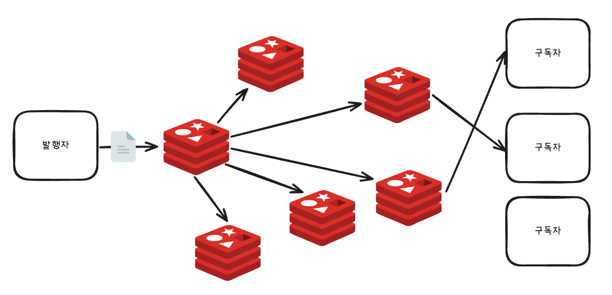

- 하나의 노드에 메시지를 발행하면 메시지는 모든 노드에 전파.
- 사실, 비효율적인 방식으로 여겨질 수 있다.
  - 클러스터는 주로 대규모 서비스에서 데이터를 분산해서 저장하고 처리하기 위해 도입됐으며, 그렇기 때문에 레디스 클러스터 내에서 pub/sub을 사용할 때 메시지가 모든 레디스 노드에 복제되는 방식은 클러스터 화녁ㅇ의 핵심 목표와는 부합하지 않다.
  - 이로 인해 불필요한 리소스 사용과 네트워크 부하 발생 가능성

#### sharded pub/sub

- 레디스 7.0부터 도입된 기능
- 각 채널이 슬롯에 매핑
  - 클러스터에서 키가 슬롯에 할당되는 것과 동일한 방식으로 채널이 할당.
  - 같은 슬롯을 가지고 있는 노드 간에만 pub/sub 메시지를 전파.

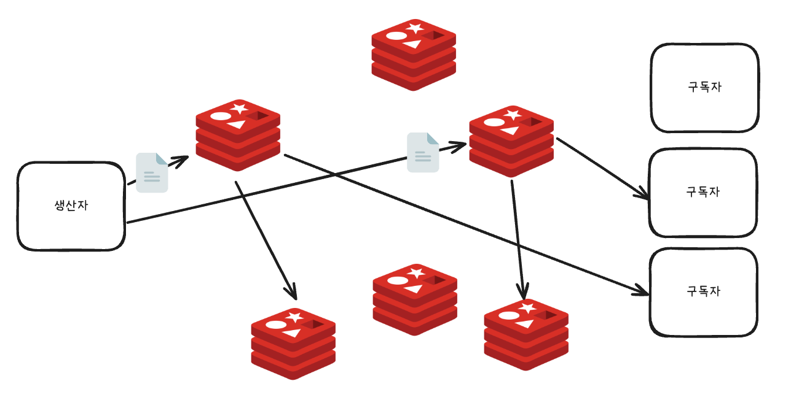

- 아래와 같이 `SPUBLISH` 커맨드로 발행된 메시지는 모든 노드에 전파되지 않으며, 노드의 복제본에만 전달된다.

```shell
10.0.0.1:6379> SPUBLISH channel1 apple
-> Redirected to slot [7092] located at 10.0.0.2:6379
10.0.0.2:6379>
```

- 로컬에서 redis-cli 클라이언트를 이용해 데이터를 전파하려고 할 때, 연결된 노드에서 지정한 채널에 전파할 수 없다는 메시지와 함께 연결된 노드로 리다이렉트된다.
- `SSUBSCRIBE`도 마찬가지로 특정한 서버에서만 수행될 수 있다.
- Sharded pub/sub을 이용하면 클러스터 구조에서 pub/sub되는 메시지는 모든 노드로 전파되지 않기 때문에 불필요한 복제를 줄여 자원을 절약할 수 있다는 장점이 있다.

----

## 레디스의 list를 메시징 큐로 사용하기

### list의 EX 기능

- 트위터는 각 유저의 타임라인 캐시 데이터를 레디스의 list 자료 구조로 관리한다.
- 유저 A가 새로운 트윗을 작성하면 그 데이터는 A를 팔로우하는 유저의 타임라인 캐시에 저장된다.
  - A를 팔로우하는 유저 B와 C의 타임라인 캐시 list에 새로운 아이템으로 추가된다.
- 타임라인 캐시를 저장할 때 `RPUSH`가 아닌 `RPUSHX` 커맨드를 사용한다.
  - `RPUSHX` 커맨드는 데이터를 저장하고자 하는 list가 이미 존재할 때에만 아이템을 추가하는 커맨드다.
  - 이미 캐시된 타임라인에만 데이터를 추가할 수 있다.
  - 자주 들어오지 않는 유저 D에게는 타임라인 캐시 데이터를 굳이 관리해야 할 필요가 없기 때문이다.
  - 애플리케이션에서 확인할 필요 없이 레디스에서 제어가 가능해 성능이 향상되는 효과!

### list의 블로킹 기능

- 레디스를 이벤트 큐로 사용할 경우 블로킹 기능 또한 유용하게 사용할 수 있다.

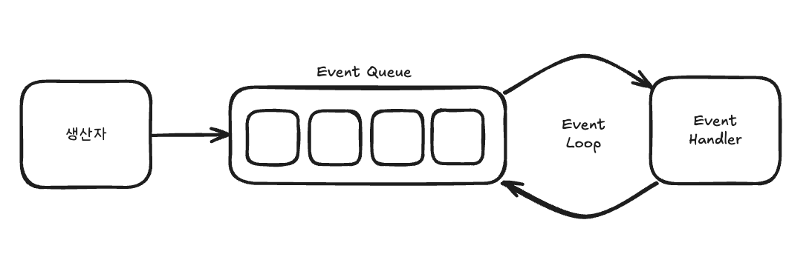

- 이벤트 루프는 이벤트 큐에 새 이벤트가 있는지 체크하며, 새로운 이벤트가 없을 경우 정해진 시간(`polling interval`) 동안 대기한 뒤 다시 이벤트 큐에 데이터가 있는지 확인하는 과정을 반복한다.
  - 폴링 프로세스가 진행되는 동안 애플리케이션과 큐의 리소스가 불필요하게 소모될 수 있다.
  - 또한 이벤트 큐에 이벤트가 들어왔을 수 있지만, 폴링 인터벌 시간 동안 대기한 뒤 다시 확인하는 과정을 거치기 때문에 이벤트를 즉시 처리할 수 없다는 단점이 있다.
- 이때 list의 블로킹 기능을 사용하면 이와 같은 불필요함을 줄일 수 있다.
- `BRPOP`이나 `BLPOP`을 사용하면 데이터를 요청했을 때 즉시 반환. 없으면 데이터가 들어올 때까지 기다린 후 들어온 값을 반환 혹은 클라이언트가 설정한 타임아웃이 지나면 nil값 반환. 
  - `BRPOP`: `RPOP`에 블로킹 추가
  - `BLPOP`: `LPOP`에 블로킹 추가
- 아래 예시는 `queue:a`에 대해 5초 동안 대기하고 5초가 경과하면 nil 반환
  - 타임아웃 값을 0으로 설정하면 데이터가 리스트에 들어올 때까지 제한 없이 기다리라는 의미로 쓰인다.
  - 하나의 리스트에 대해 여러 클라이언트가 블로킹될 수 있으며, 리스트에 데이터가 입력되면 가장 먼저 요청을 보낸 클라이언트가 데이터를 가져간다.
  - 또한 `BRPOP`은 `RPOP`과는 다르게 키와 데이터 2개의 값을 반환한다.

```shell
> BRPOP queue:a 5
1) "queue:a"
2) "data"
```

- 여러 리스트에서 대기할 수 있게 하기 위해서다.

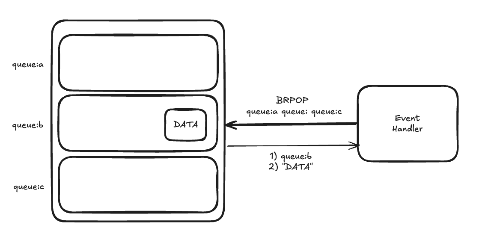

- 아래 커맨드 `BRPOP`는 1,000초 동안 `queue:a`, `queue:b`,`queue:c` 중 어느 하라도 데이터가 들어올 때까지 기다린 뒤, 그중 하나의 리스트에 데이터가 들어오면 해당 값을 읽어온다.

```shell
> BRPOP queue:a queue:b queue:c timeout 1000
1) "queue:b"
2) "DATA"
(19.89s)
```

### list를 사용한 원형 큐

- 여러 개의 클라이언트가 병렬적으로 같은 아이템에 접근해야 하는 경우, `원형 큐 circular queue`를 이용해 아이템을 처리하고 싶을 수 있다.
- list에서 `RPOPLPUSH` 커맨드를 사용하면 간편하게 원형 큐를 사용할 수 있다.

---

## Stream

### 레디스의 Stream과 아파치 카프카

- `Stream`은 레디스 5.0에서 새로 추가된 자료 구조로 대용량, 대규모의 메시징 데이터를 빠르게 처리할 수 있도록 설계되었다.
- stream은 사용 목적에 따라 크게 두 가지 방식으로 활용
1. 백엔드 개발자들은 stream을 대량의 데이터를 효율적으로 처리하는 플랫폼으로 활용.
2. 데이터 엔지니어들은 stream을 여러 생산자가 생성한 데이터를 다양한 소비자가 처리할 수 있게 지원하는 데이터 저장소 및 중간 큐잉 시스템으로 사용.

- 레디스 stream은 카프카의 영향을 많이 받은 시스템인 만큼 카프카와 유사한 여러 기능을 갖고 있으며, 일부 기능은 카프카보다 뛰어난 처리를 할 수 있도록 설계됐다.

### 스트림이란?

- 연속적인 데이터의 흐름.
- 일정한 데이터 조각의 연속.

### 데이터의 저장

#### 메시지의 저장과 식별

- 카프카에서 스트림 데이터는 토픽이라는 개념에 저장.
  - 토픽은 각각의 분리된 스트림을 뜻하며, 같은 데이터를 관리하는 하나의 그룹을 의미
  - 각 메시지는 0부터 시작해 증가하는 시퀀스 넘버로 식별. 토픽 내의 파티션 안에서만 유니크.
- 레디스에서는 하나의 stream 자료 구조가 하나의 stream을 의미한다.
  - 하나의 키에 연결된 자료 구조.
  - 각 메시지는 시간과 관련된 유니크한 ID를 가지며, 중복되지 않는다.
- 레디스 stream에서 ID는 아래와 같이 2개의 파트로 나뉜다.

```
<millisecondsTime>-<sequenceNumber>
```

- `millisecondsTime`은 아이템이 저장될 시점의 레디스 노드 로컬 시간
- `sequenceNumber`는 같은 밀리세컨드에 저장된 데이터의 순서 (64bit)

#### 스트림 생성과 데이터 입력

- 레디스에서는 stream을 따로 생성하는 과정이 필요하지 않다.
- `XADD` 커맨드를 이용해 새로운 이름의 stream에 데이터를 저장하면 데이터의 저장과 동시에 stream 자료 구조가 생성된다.

#### 데이터의 조회

- 카프카와 레디스의 데이터 조회는 차이가 있다.
- 카프카에서는 소비자가 특정 토픽을 실시간으로 리스닝.
- 레디스 stream에서는 데이터를 두 가지 방식으로 읽을 수 있다.
1. 카프카처럼 실시간 리스닝

```shell
> XREAD [COUNT count] [BLCOK milliseconds] STREAMS key [key ...] ID [ID ...]
```

2. ID를 이용해 필요한 데이터를 검색
   - 원하는 시간대의 데이터를 조회

```shell
> XRANGE key start end [COUNT count]
> XREVRANGE key end start [COUNT count]
```

#### 소비자와 소비자 그룹

- 같은 데이터를 여러 소비자에게 전달하는 것을 `팬아웃 fan-out`이라 한다.
- 레디스 stream에서도 XREAD 커맨드를 여러 소비자가 수행한다면 팬아웃이 가능하다.
- 하지만 만약 같은 데이터를 여러 소비자가 나눠서 가져가게 하려면 어떻게 해야 할까?
  - 같은 역할을 하는 여러 개의 소비자를 이용해 메시지를 병렬 처리함으로써 서비스의 처리 성능을 높일 수 있다.
- 레디스 stream에서는 데이터가 저장될 때마다 고유한 ID를 부여받아 순서대로 저장된다. 따라서 소비자에게 데이터가 전달될 때, 그 순서는 항상 보장된다.
  - 반면 카프카는 유니크 키가 파티션 내에서만 보장되기 때문에 소비자가 여러 파티션에서 토픽을 읽어갈 때에는 데이터의 순서를 보장할 수 없다.

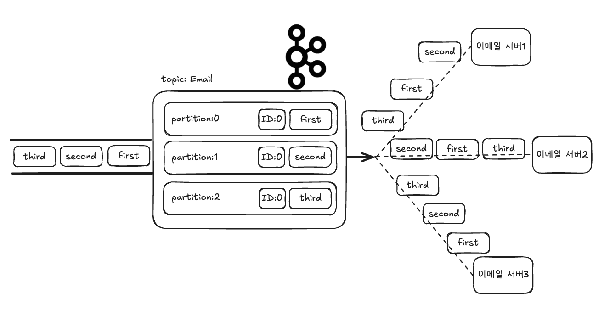

- 카프카에서 메시지 순서가 보장되도록 데이터를 처리하기 위해서는 소비자 그룹을 사용해야 한다.

#### 소비자 그룹

- 카프카에서는 소비자 그룹에 여러 소비자를 추가할 수 있으며, 이때 소비자는 토픽 내의 파티션과 일대일로 연결된다.

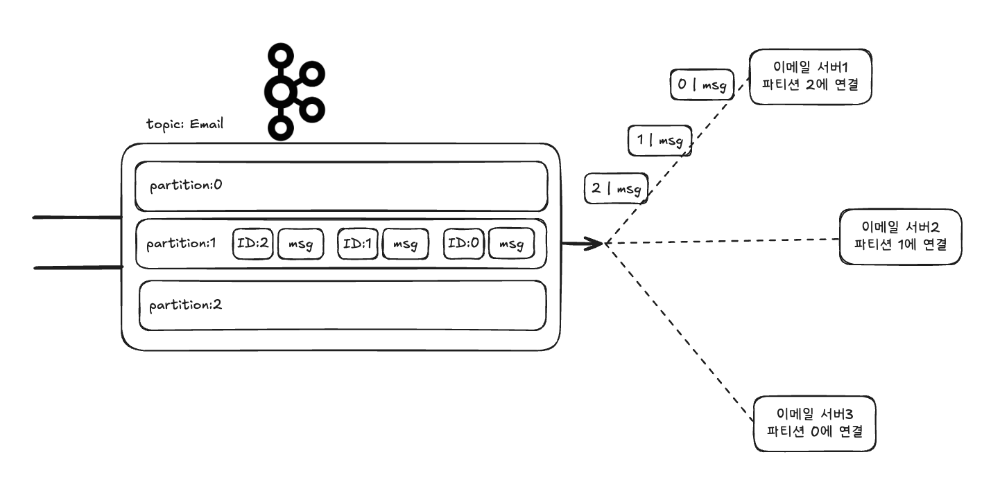

- 레디스 stream에서도 소비자 그룹이라는 개념이 존재하지만, 카프카에서와 다르다.
  - 메시지가 전달되는 순서를 신경쓰지 않아도 되기 때문!
  - 소비자 그룹 내의 한 소비자는 다른 소비자가 아직 읽지 않은 데이터만을 읽어간다.

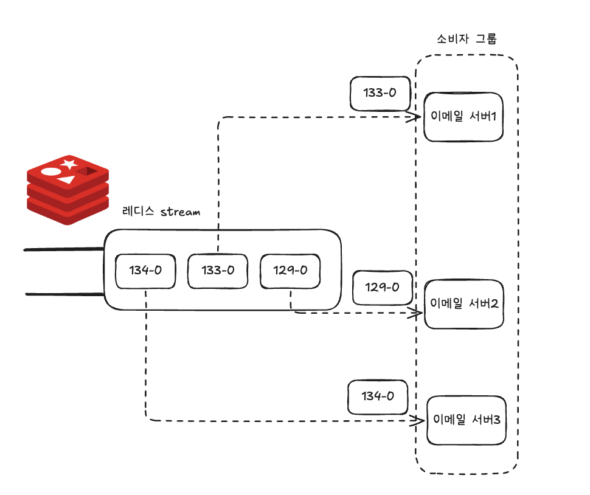

- 레디스 stream에서 소비자 그룹을 생성하려면 `XGROUP` 커맨드를 사용하면 된다.

```shell
> XGRUOP CREATE Email EmailServiceGroup $
```

- 소비자 그룹을 이용해 데이터를 읽어오고 싶다면 `XREADGROUP` 커맨드를 사용하면 된다.
  - `XREAD`와 비슷. but 소비자 그룹을 통해서 데이터를 읽길 원한다는 것을 뜻함

```shell
> XREADGROUP GROUP EmailServiceGroup emailService1 COUNT 1 STREAMS Email >
```

#### ACK와 보류 리스트

- 여러 서비스가 메시지 브로커를 이용해 데이터를 처리할 때, 예상치 못한 장애로 인해 시스템이 종료됐을 경우 이를 인지하고 재처리할 수 있는 기능이 필요하다.
  - 메시지 브로커는 각 소비자에게 어떤 메시지까지 전달됐고, 전달된 메시지의 처리 유무를 인지하고 있어야 한다.
- 레디스 stream에서는 소비자 그룹에 속한 소비자가 메시지를 읽어가면 각 소비자별로 읽어간 메시지에 대한 리스트를 새로 생성하며, 마지막으로 읽어간 데이터의 ID로 `last_delivered_id` 값을 업데이트한다.
  - `last_delivered_id` 값은 해당 소비자 그룹에 마지막으로 전달한 ID가 무엇인지를 파악해, 동일한 메시지를 중복으로 전달하지 않기 위해 사용된다.

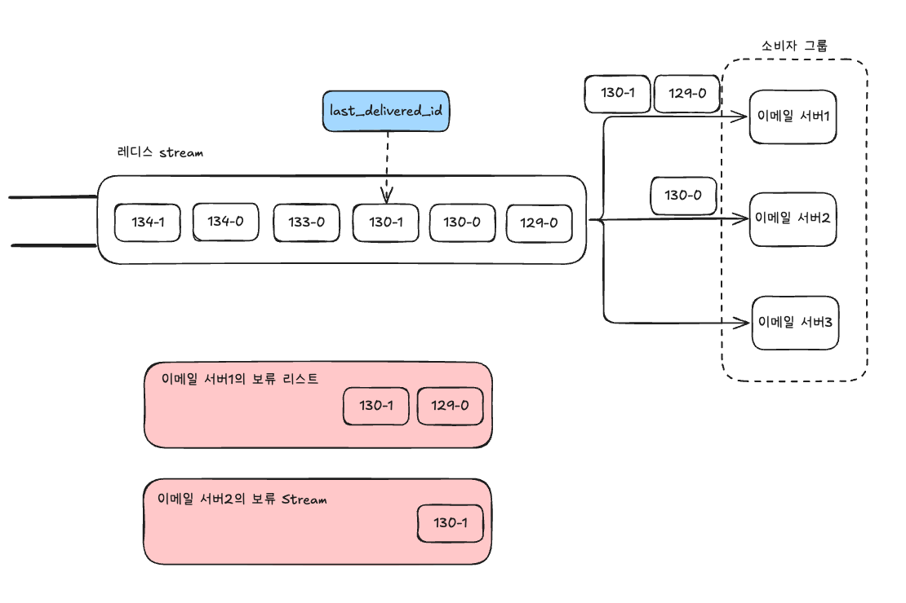

- 위의 예시에서는 `이메일 서버1`이라는 소비자가 2개의 메시지를 가져갔고, `서버2`가 1개의 메시지를 가져갔다.
  - 레디스 stream은 소비자별로 `보류 리스트 pending list`를 만들고, 어떤 소비자가 어떤 데이터를 읽어갔는지 인지하고 있다.

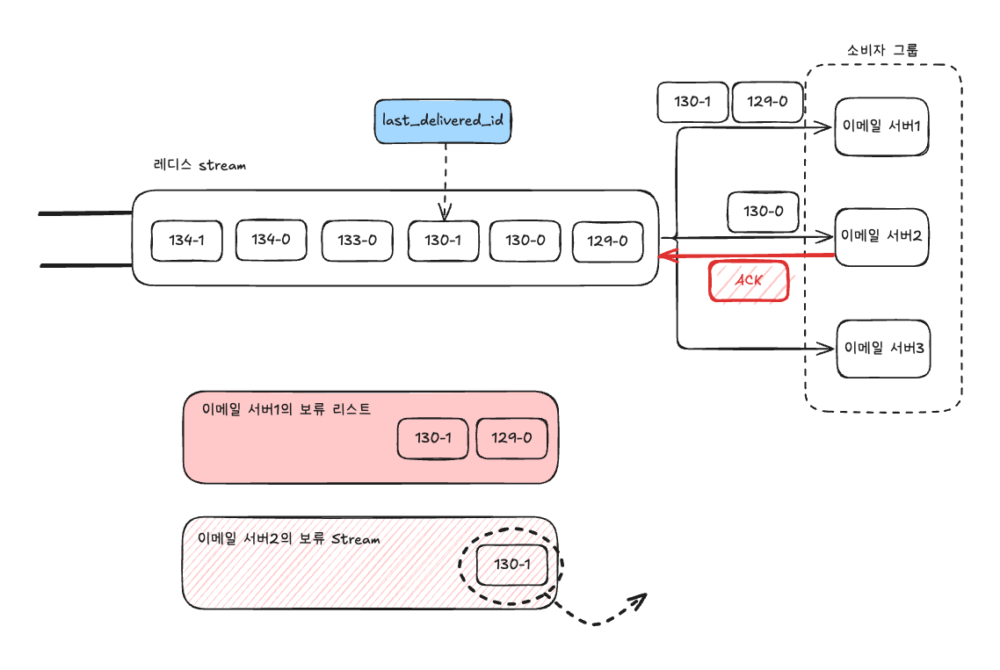

- 만약 이메일 서버2가 stream에게 데이터가 처리됐다는 뜻의 ACK를 보내면 레디스 stream은 이메일 서버2의 보류 리스트에서 ACK를 받은 메시지를 삭제한다.
- 이 상황에서 이메일 서버1에 장애가 발생하면, 보류 리스트에 남아 있는 항목을 확인해 다른 서버가 처리하도록 할 수 있을 것이다.
  - `XREADGROUP`을 이용해 소비자 그룹 형태로 데이터를 읽었을 때, 데이터 처리가 완료된 후에 애플리케이션에서 `XACK`를 주기적으로 전송하는 작업이 필요하다.
- 현재 소비자 그룹에서 보류 중인 리스트를 확인하는 커맨드는 아래와 같다.

```shell
> XPENDING <key> <groupname> [<start-id> <end-id> <count> [<consumer-name>]]]
```

- XACK를 이용해 데이터가 처리됐음을 알릴 수 있다.
  - Email이라는 `stream`에서 EmailServiceGroup 그룹에 속한 소비자가 `1659114481311-0` ID를 가진 메시지를 처리했다는 의미

```shell
> XACK Email EmailServiceGroup 1659114481311-0
```

- 카프카도 파티션별 오프셋을 관리한다.
  - 내부적으로 `__consumer_offsets`라는 토픽에 데이터를 기록
  - 내부 소비자가 어디까지 읽었는지 추적 가능
  - 오프셋은 소비자가 마지막으로 읽은 위치가 아니라 다음으로 읽어야 할 위치를 기록

#### 메시지의 재할당

- 만약 소비자 서버에 장애가 발생해 복구되지 않는다면, 해당 소비가 처리하던 보류 중인 메시지들은 다른 소비자가 대신 처리해야 한다.
- `XCLAIM` 커맨드를 이용해 메시지의 소유권을 다른 소비자에게 할당할 수 있다.

```shell
> XCLAIM <key> <group> <consumer> <min-idle-time> <ID-1> <ID-2> ... <ID-N>
```

- `XCLAIM` 커맨드를 사용할 때에는 `최소 대기 시간 min-idle-time`을 지정해야 한다.
  - 메시지가 보류 상태로 머무른 시간이 최소 대기 시간을 초과한 경우에만 소유권을 변경할 수 있도록 해서 2개의 다른 소비자에게 중복으로 할당되는 것을 방지
- 아래 시나리오는 `EmailService3`에 문제가 생겨 `EmailService1`과 `EmailService2`가 가져가는 상황

```shell
> EmailService1: XCLAIM Email EmailServiceGroup EmailService3 3600000
1659114481311-0
> EmailService2: XCLAIM Email EmailServiceGroup EmailService3 3600000
1659114481311-0
```

- 2개의 소비자 모두 보류 중인 메시지 커맨드를 실행했지만, 위의 예제처럼 `EmailService1`의 커맨드가 먼저 실행되면 보류 시간이 즉시 0으로 재설정된다.
  - `EmailService2`의 커맨드는 무시되며, 이를 통해 중복 메시지 할당을 방지한다.

#### 메시지의 자동 재할당

- 소비자가 직접 보류했던 메시지 중 하나를 자동으로 가져와서 처리할 수 있도록 하는 `XAUTOCLAIM` 커맨드는 할당 대기 중인 다음 메시지의 ID를 반환하는 방식으로 동작하기 때문에 반복적 호출을 가능하게 한다.

```shell
> XAUTOCLAIM <key> <group> <min-idle-time> <start> [COUNT count] [JUSTID]
```

- 지정한 소비자 그룹에서 최소 대기 시간을 만족하는 보류 중인 메시지가 있다면 지정한 소비자에 소유권을 재할당하는 식으로 동작한다.

#### 메시지의 수동 재할당

- 만약 메시지에 문제가 있어 처리되지 못할 경우 메시지는 여러 소비자에게 할당되기를 반복하면서 counter 값이 계속 증가하게 된다.
- 따라서 counter 값이 특정 값에 도달하면 이 메시지를 특수한 stream으로 보내 관리자가 추후에 처리할 수 있도록 하는 것이 현명할 수 있다.

#### stream 상태 확인

- 어떤 소비자가 활성화?
- 보류된 메시지는 어떤 것인지?
- 어떤 소비자 그룹이 메시지를 처리하고 있는지?
- `XINFO` 커맨드를 이용해 stream의 여러 상태를 확인할 수 있으며, 이때 사용할 수 있는 기능은 help 커맨드로 확인 가능!

```shell
> XINFO HELP
```

- 특정 소비자 그룹에 속한 소비자의 정보

```shell
> XINFO consumers <stream key> <소비자 그룹 이름>
```

- stream에 속한 전체 소비자 그룹

```shell
> XINFO groups <stream key>
```

- stream 자체의 정보 (stream이 내부적으로 어떻게 인코딩되고 있는지, 그리고 첫 번째와 마지막 메시지의 ID를 표시)

```shell
> XINFO STREAM <stream key>
```

---

# 참고자료

- 개발자를 위한 레디스, 김가람 지음
