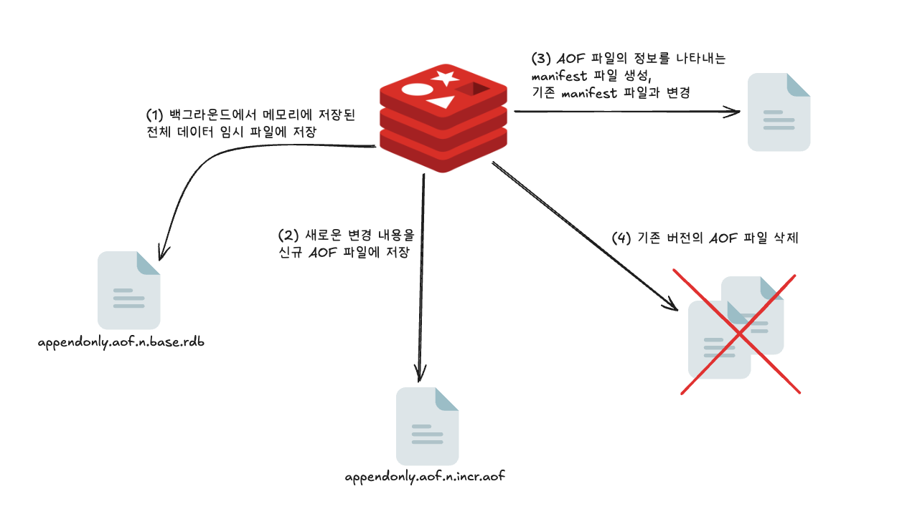

# 07장 레디스 데이터 백업 방법

## 레디스에서 데이터를 영구 저장하기

- 인스턴스 재시작 => 데이터 손실
- 레디스가 복제 구조를 사용할 경우, 데이터가 실시간으로 복제본에 전달되고 있으니 따로 데이터를 백업할 필요를 느끼지 못할 수도 있다.
  - 하지만 백업과 복제는 목적부터 다르다는 점을 유의
  - 복제: 가용성을 위한 것.
  - 백업: 장애 상황에서 데이터의 복구를 위해 필요.
- 디스크에 주기적으로 백업하는 것이 안전. 데이터를 안정하게 저장하기 위한 방법으로 RDB와 AOF 두 가지 백업 방식을 지원.
    - `AOF(Append Only File)`: 레디스 인스턴스가 처리한 모든 쓰기 작업을 차례대로 기록. 복원 시에는 파일을 다시 읽어가며 데이터 세트 재구성
    - `RDB(Redis Database)`: 일정 시점에 메모리에 저장된 데이터 전체를 저장 (snapshot 방식)
- 아래와 같이 명령어를 진행했다고 가정하자.

```redis
> SET key1 a
> SET key1 apple
> SET key2 b
> DEL key2
```

- 위의 커맨드를 실행하고 나면 AOF와 RDB에는 각각 아래와 같이 저장될 것이다.
  - 사실 AOF는 `레디스 프로토콜 RESP` 형태로 저장되고, RDB는 바이너리 형태로 저장되어 우리가 읽고 해석할 수 없다.


- 그렇다면 어떤 백업 방법을 사용하는 것이 좋을까?
  - RDB의 경우, 시점 단위로 여러 백업본을 저장할 수 있고, AOF보다 복원이 빠르다는 장점이 있지만 특정 시점으로의 복구는 불가능하다.
  - AOF는 RDB 파일보다 크고 주기적으로 압축해 작성해야 하지만, 원하는 시점으로 복구할 수 있다는 장점이 있다.
- 하나의 인스턴스에서 RDB와 AOF 옵션을 동시에 사용하는 것도 가능하며, 권장된다.
- 레디스에서 데이터를 복원할 수 있는 시점은 서버가 재시작될 때뿐이며, 레디스 인스턴스의 실행 도중에 데이터 파일을 읽어올 수 있는 방법은 없다.
  - 재시작될 때 AOF 파일이나 RDB 파일이 존재하는지 확인한 뒤, 파일이 있을 때에는 파일을 로드한다.
  - 레디스는 RDB 파일보다 AOF 파일이 더 내구성이 보장된다고 판단하기 때문에 2개의 파일이 모두 존재할 때에는 AOF의 데이터를 로드한다.

---

## RDB 방식의 데이터 백업

- 레디스에서 데이터를 백업하기 위한 가장 단순한 방법.
- RDB 파일이 저장될 때마다 원격 저장소로 파일을 옮겨 2차 백업을 수행한다면 데이터 센터 장애 등 더 큰 장애에도 대처할 수 있다.
- 하지만 장애가 발생했을 때 손실 가능성을 최소화해야 하는 서비스에는 RDB 파일을 이용한 백업만 사용하는 것은 적절하지 않다.
  - 사용자가 지정한 시간 단위로 파일이 저장되기 때문에 저장 시점부터 장애가 발생한 직전까지의 데이터는 손실될 수 있다는 것을 알아둬야 한다.
- RDB 파일을 생성할 수 있는 방법은 크게 세 가지다.
1. 설정 파일에서 특정 조건에 파일이 자동으로 저장되도록 지정
2. 사용자가 원하는 시점에 커맨드를 이용해 수동으로 파일을 생성
3. 복제 기능을 사용해 레디스가 자동으로 RDB 파일을 생성

### 1. 특정 조건에 자동으로 RDB 파일 생성

```
save <기간(초)> <기간 내 변경된 키의 개수>
dbfilename <RDB 파일 이름>
dir <RDB 파일이 저장될 경로>
```

- 레디스 설정 파일에서 `save` 옵션을 사용해 원하는 조건에 RDB 파일을 저장하도록 설정할 수 있다.

```
save 900 1
save 300 10
save 60 10000
```

- `redis.conf`에서 위와 같은 조건으로 save 옵션을 설정한다면 인스턴스는 다음과 같은 상황에서 RDB 파일을 생성한다.
  - 900초(15분) 동안 1개 이상의 키가 변경된 경우
  - 300초(5분) 동안 10개 이상의 키가 변경된 경우
  - 60초(1분) 동안 10,000개 이상의 키가 변경된 경우
- 만약 RDB 파일을 저장하고 싶지 않다면 `save ""`와 같이 빈 문자열로 설정해서 옵션을 비활성화할 수 있다.
  - 이미 레디스 인스턴스가 실행 중인 상태에서 RDB 저장을 비활성화하고 싶다면 `CONFIG SET` 커맨드를 이용해 `save` 파라미터를 ""로 초기화시키면 된다.

```redis
# 현재 적용된 save 옵션 확인
> CONFIG GET save
1) "save"
2) "900 1 300 10 60 10000"

# save 옵션 초기화
> CONFIG SET save ""
OK
```

### 2. 수동으로 RDB 파일 생성

- `SAVE`, `BGSAVE` 커맨드를 사용하면 원하는 시점에 직접 RDB 파일을 생성할 수 있다.
  - 두 커맨드 모두 실행 시점의 메모리 스냅샷을 생성하는 커맨드지만 동작하는 방식에 차이가 있다.
- `SAVE`는 동기 방식으로 파일을 저장. 
  - 해당 명령어가 실행되면 파일 생성이 완료될 때까지 다른 모든 클라이언트의 명령을 차단. 
  - 따라서 일반적인 운영 환경에서는 실행 X
- `BGSAVE`는 `fork`를 호출해 자식 프로세스를 생성하며 생성된 자식 프로세스가 백그라운드에서 RDB 파일을 생성한 뒤 종료된다.
  - 레디스를 이용하는 다른 클라이언트는 원래대로 부모 프로세스를 이용하므로 파일 저장에 영향을 받지 않는다.
  - 만약 이미 백그라운드에서 데이터가 저장되고 있을 때 이 커맨드를 수행하면 에러를 반환한다.
    - 이런 상황에서는 `BGSAVE`와 `SCHEDULE` 옵션을 사용.
- RDB 파일이 정상적으로 저장됐는지는 `LASTSAVE` 커맨드로 확인할 수 있으며, 마지막으로 RDB 파일이 저장된 시점을 유닉스 타임스탬프로 반환한다.

### 3. 복제를 사용할 경우 자동으로 RDB 파일 생성

- 복제본에서 `REPLICAOF` 커맨드를 사용해 복제를 요청하면 마스터 노드에서는 RDB 파일을 새로 생성해 복제본에 전달한다.


- 혹은 이미 복제 연결이 돼 있는 상태에서 네트워크 등의 이슈로 인해 일정 시간 이상 복제가 끊어졌다가 복구된 경우 복제 재연결이 발생하며, 이럴 경우에도 마스터 노드는 복제본으로 RDB 파일을 전송한다.
  - 따라서 복제 연결을 처음 시작했을 때뿐만 아니라 이미 복제 연결이 돼 있는 상테에서도 상황에 따라 마스터에서는 언제든지 RDB 파일을 재생성할 수 있다.

---

## AOF 방식의 데이터 백업

- AOF는 레디스 인스턴스에서 수행된 모든 쓰기 작업의 로그를 차례대로 기록한다.
  - 실수로 `FLUSHALL` 커맨드로 데이터를 모두 날려버렸다 해도, AOF 파일을 직접 열어 `FLUSHALL` 커맨드만 삭제한 뒤 레디스를 재시작시킨다면 커맨드를 실행하기 직전까지로 데이터를 바로 복구할 수 있다.
- 설정 파일에서 `appendonly` 옵션을 `yes`로 지정하면 AOF 파일에 주기적으로 데이터가 저장된다.
  - AOF 파일은 `appenddirname`에서 지정한 경로와 `appendfilename` 옵션에 설정한 이름으로 생성된다.

```
appendonly yes
appendfilename "appendonly.aof"
appenddirname "appendonlydir
```

- 아래 명령어가 실행되면 어떤 식으로 AOF 파일이 저장될까?

```
> SET key1 apple
> SET key1 beer
> DEL key1
> DEL non_existing_key
```

- 1, 2, 3번째 명령어는 서버의 메모리에 영향을 끼치는 작업이기 때문에 AOF 파일에 저장된다.
  - 4번째는 저장되지 않는다.
- AOF에서 모든 커맨드의 실행 내역은 아래와 같이 `레디스 프로토콜 RESP` 형식으로 저장된다.

```
*3
$3
set
$4
key1
$5
apple
*3
$3
set
$4
key1
$4
beer
*2
$3
del
$4
key1
```

- 하지만 항상 AOF 파일이 사용자가 실행한 커맨드를 그대로 저장하는 것은 아니다.
- list에서 블로킹 기능을 지원하는 `BRPOP` 커맨드는 AOF 파일에 저장될 때에는 `RPOP`로 기록
  - AOF 파일에는 블로킹 기능을 굳이 명시해줄 필요가 없기 때문.
- string 값에 사용자가 입력한 부동소수점 값을 더해주는 `INCRBYFLOAT` 명령어도 AOF 파일에는 그대로 기록되지 않는다.

```redis
> SET counter 100
OK
> INCRBFLOAT counter 50
"150"
```

- 레디스가 실행되는 아키텍처에 따라 부동소수점을 처리하는 방식이 다를 수 있기 때문에 AOF 파일에는 증분 후의 값을 직접 `SET`하는 커맨드로 변경돼 저장된다.

```resp
*3
$3
SET
$7
counter
$3
100
*4
$3
SET
$7
counter
$3
150
$7
KEEPTTL
```

- AOF는 Append-Only File이라는 이름 뜻 그대로 실행되는 커맨드가 파일 뒤쪽에 계속 추가되는 방식으로 동작한다.
  - 따라서 인스턴스가 실행되는 시간에 비례해서 AOF 파일의 크기는 계속 증가하게 된다.
  - INCR 커맨드를 사용해 counter 키를 100번 증가시킨다면 실제 레디스의 메모리에서 counter라는 키는 100이 증가된 값을 저장하고 있지만, AOF 파일에는 키를 증가시킨 100번의 실행 내역이 그대로 남아 있게 된다.

### AOF 파일을 재구성하는 방법

- 따라서 AOF 파일을 이용한 백업 기능을 안정적으로 사용하려면 점점 커지는 파일을 주기적으로 압축시키는 `재구성 rewrite` 작업이 필요하다.
  - RDB에서와 마찬가지로 특정 조건에 자동으로 재구성되도록 설정할 수도 있으며, 사용자가 원하는 시점에 커맨드를 이용해 재구성시킬 수 있다.
- 이때 압축, 즉 재구성은 기존 디스크에 저장됐던 AOF 파일을 사용하는 것이 아니라 레디스 메모리에 있는 데이터를 읽어와서 새로운 파일로 저장하는 형태로 동작한다.
  - 설정 파일에서 기본 옵션인 `aof-use-rdb-preamble yes`를 `no`로 변경하지 않는다면 이 데이터는 RDB 파일 형태로 저장한다.
  - RDB 파일을 저장할 때와 마찬가지로 AOF 파일을 재구성할 때에도 `fork`를 이용해 자식 프로세스를 생성하며, 이 자식 프로세스가 AOF 파일을 재구성해 저장한다.


- 버전 7 이전까지는 AOF는 하나의 파일로 관리됐다. (위와 같음.)
  - AOF 파일 앞부분은 메모리의 데이터를 읽어와 바이너리 형태로 저장한 RDB 파일이 위치한다.
  - 이후 레디스의 메모리를 변경한 커맨드 로그들은 RESP 형태로 RDB 파일의 뒤에 쌓이는 형태로 증가한다. (append only하게)
- 버전 7 이전까지 AOF 파일의 재구성 과정이 어떻게 동작했는지 아래 그림으로 파악해보자.


- 위의 (2)의 과정에서 RDB 파일이 저장되는 동안 데이터가 변경된 동일한 로그가 AOF 파일과 인메모리 버퍼에 이중으로 저장된다.
  - 또한 하나의 AOF 파일 내에 바이너리 형태와 RESP의 텍스트 형태의 데이터가 함께 저장돼 수동으로 AOF 파일을 처리할 때 관리가 복잡할 수 있다는 단점이 존재한다.
- 레디스 7.0부터는 AOF 파일 저장 구조가 아래와 같이 변경됐다.


- AOF는 기본이 되는 바이너리 형태의 RDB 파일, 증가하는 RESP의 텍스트 형태의 AOF 파일로 나눠서 데이터를 관리한다.
  - 또한 현재 레디스가 바라보고 있는 파일이 어떤 것인지 나타내는 매니페스트 파일을 추가적으로 도입했으며, 매니페스트 파일은 RDB와 AOF 파일이 어떤 것인지 알려주는 역할을 한다.
  - 세 파일은 모두 설정 파일이 지정한 `appenddirname` 이름의 폴더 내에 저장된다.
- AOF가 재구성될 때마다 AOF를 구성하고 있는 각 RDB와 AOF의 파일명의 번호 그리고 매니페스트 파일 내부의 `seq` 값도 1씩 증가한다.
- 재구성 동작은 아래와 같이 변경되었다.



- 기존 버전의 (2), (3) 단계의 비효율을 줄일 수 잇어 훨씬 간단한 과정으로 데이터를 저장할 수 있다.
- 앞서 `aof-use-rdb-preamble` 옵션에 의해 압축되는 데이터 파일은 RDB 형태로 저장된다고 언급.
  - 이를 `no`로 변경하면 베이스 파일은 `*.base.rdb` 형태가 아닌 `*.base.aof`라는 이름으로 저장되며, 저장되는 형태도 RESP 프로토콜 형태의 텍스트로 변경된다.
- 여기서 주목해야 할 점은 레디스에서 AOF 파일의 재구성 과정은 모두 `순차 입출력 sequential I/O`만 사용하기 때문에 디스크에 접근하는 모든 과정이 굉장히 효율적이라는 것이다.
  - 레디스의 서버는 복원 시 순차적으로 데이터를 로드하는 용도로만 AOF 파일을 사용한다.
  - 파일 내에서 직접 데이터를 검색할 필요가 없기 때문에 `랜덤 입출력 random I/O`를 고려할 이유가 전혀 없다.
  - 이는 RDB 파일을 저장할 때에도 마찬가지이다. 
  - (파일을 저장할 때 랜덤 입출력을 고려하지 않는다는 점은 모든 데이터 저상소에서 매우 드문 기능)

### 자동 AOF 재구성

```
auto-aof-rewrite-percentage 100
auto-aof-rewrite-min-size 64mb
```

- `auto-aof-rewrite-percentage`는 AOF 파일을 다시 쓰기 위한 시점을 정하기 위한 옵션.
  - 마지막으로 재구성됐던 AOF 파일의 크기와 비교해, 현재의 AOF 파일이 지정된 퍼센트만큼 커졌을 때 재구성을 시도한다.
  - 마지막으로 저장된 AOF 파일의 크기는 레디스에서 `INFO Persistnece` 커맨드로 확인할 수 있는 `aof_base_size` 값이다.

```redis
> INFO Persistence
# Persistence
...
aof_current_size: 186830
aof_base_size: 145802
...
```

- `auto-aof-rewrite-percentage`가 `100`이라면 `aof_current_size`가 `aof_base_size`의 100%만큼 커진 291604가 되면 자동으로 재구성을 시도한다.
- 데이터가 아무것도 없는 상태로 인스턴스가 처음 부팅됐을 때의 `aof_base_size`는 0이므로, 이럴 때에는 `auto_aof_rewrite_min_size`를 기준으로 데이터를 재구성한다.
- `auto-aof-rewrite-min-size` 옵션은 재구성된 이후의 AOF 파일의 최소 크기를 지정할 수 있다.
  - 마지막으로 작성된 AOF 파일 크기를 기준으로 재구성하되, AOF 파일의 최소 크기를 지정해 비효율적인 작업을 최소화

### 수동 AOF 재구성

- `BGREWRITEAOF` 커맨드를 이용하면 원하는 시점에 직접 AOF 파일을 재구성할 수 있다.
  - 자동으로 재구성할 때와 동일하게 동작한다.

### AOF 타임스탬프

- 버전 7 이상부터는 AOF를 저장할 때 타임스탬프를 남길 수 있다.

```
aof-timestamp-enabled no
```

- 설정에서 `aof-timestamp-enabled`를 활성화시키면 AOF 데이터가 저장될 때 타임스탬프도 함께 저장된다.
- 이를 사용하면 수동으로 AOF 파일을 조작하지 않아도 시스템상에서 `시점 복원 point-in-time recovery`이 가능하다.
  - `redis-check-aof` 프로그램 사용

### AOF 파일 복원

- `시점 복원 point-in-time recovery`에서 사용한 `redis-check-aof` 프로그램은 AOF 파일이 손상됐을 때에도 사용할 수 있다.
  - 의도치 않은 서버의 장애 발생 시 AOF 파일 작성 도중 레디스가 중지됐을 가능성이 존재한다.
  - 이때 `redis-check-aof` 프로그램을 사용하면 AOF 파일의 상태가 정상적인지 확인할 수 있다.

```shell
$ src/redis-check-aof appendonlydir/appendonly.aof.manifest
Start checking Multi Part AOF
...
RDB preamble is OK, proceeding with AOF tail...
...
AOF appendonly.aof.15.incr.aof is not valid. Use the --fix option to try fixing it. 
```

- 위와 같은 경우, RDB 파일은 정상이며, AOF 파일은 비정상이니 fix 옵션을 사용하며 해결하라는 문구가 나왔다. 

```shell
$ src/redis-check-aof appendonlydir/appendonly.aof.manifest
Start checking Multi Part AOF
...
RDB preamble is OK, proceeding with AOF tail...
...
This will shring the AOF appendonly.aof.15.incr.aof from 73984 bytes, with 27 bytes, to 73957 bytes
Continue? [y/N]: y
Successfully truncated AOF appendonly.aof.15.incr.aof
ALL AOF files and manifest are valid
```

- `fix` 옵션을 사용한 복구 또한 원본 파일을 변경하기 때문에 이전의 데이터를 보호하고 싶은 경우에는 원본 데이터를 다른 곳에 복사해두는 것이 안전하다.

### AOF 파일의 안전성

- AOF가 RDB보다 얼마나 더 안전하다고 얘기할 수 있을까?


- 운영체제에서 애플리케이션이 파일에 데이터를 저장하고자 할 때, 곧바로 디스크에 데이터가 저장되진 않는다.
  - `WRITE`라는 시스템 콜을 이용해 애플리케이션에서 파일에 데이터를 저장하겠다 하면 데이터는 커널 영역의 OS 버퍼에 임시로 저장한다.
  - 운영체제가 판단하기에 커널이 여유 있거나, 최대 지연 시간인 30초에 도달하면 커널 버퍼의 데이터를 실제로 디스크에 내려 쓴다.
- `FSYNC`는 커널의 OS 버퍼에 저장된 내용을 실제로 디스크에 내리도록 강제하는 시스템 콜이다.
  - OS에 부하가 있ㄷ라도 `FSYNC`가 호출되면 데이터는 무조건 디스크에 flush된다.
- 레디스에서 AOF 파일을 저장할 때 `APPENDFSYNC` 옵션을 이용하면 `FSYNC` 호출을 제어할 수 있으며, 즉 파일 저장의 내구성을 제어할 수 있다. 아래와 같은 세 가지 옵션을 사용할 수 있다.

1. `APPENDFSYNC no`: AOF 데이터를 저장할 때 WRITE 시스템 콜을 호출한다. 데이터는 커널 영역에 데이터가 잘 저장되는지만 확인하기 때문에 쓰기 성능이 가장 빠르다.
2. `APPENDFSYNC always`: AOF 데이터를 저장할 때 항상 WRITE와 FSYNC 시스템 콜을 함께 호출한다. 즉, 매번 쓰고자 하는 데이터가 파일에 정확하게 저장되는 것을 기다리기 때문에 쓰기 성능은 가장 느리다.
3. `APPENDFSYNC everysec`: 데이터를 저장할 대 WRITE 시스템 콜을 호출하며, 1초에 한 번씩 `FSYNC` 시스템 콜을 호출한다. 성능은 `no` 옵션을 사용했을 때와 거의 비슷하다.

- 기본 옵션은 `everysec`이다.
  - 장애 발생 시, 유실될 수 있는 데이터는 최대 1초
  - `no`로 설정 시, 최대 30초 동안 레디스에 입력했던 데이터를 잃을 수 있다.

---

## 백업을 사용할 때 주의할 점

- RDB와 AOF 파일을 사용하는 경우 인스턴스의 `maxmemory` 값은 실제 서버 메모리보다 여유를 갖고 설정하는 것이 좋다.
  - 물리적 메모리에 있는 실제 메모리 페이지가 그대로 복제되기 때문에 최악의 경우 레디스는 기존 메모리 용량의 2배를 사용하게 될 수도 있다.
  - `maxmemory`를 너무 크게 설정한 경우, 레디스의 copy-on-write 동작으로 인해 OS 메모리가 가득 차는 상황이 발생할 수 있으며, 이로 인해 OOM 문제가 발생할 수 있다.
- 따라서 아래 표와 같이 여유를 갖고 설정하는 것이 안정적이다.

| RAM  | `maxmemory`  | 비율  |
|:----:|:------------:|:---:|
| 2GB  |    638MB     | 33% |
| 4GB  |    2048MB    | 50% |
| 8GB  |    4779MB    | 58% |
| 16GB |   10240MB    | 63% |
| 32GB |   21163MB    | 65% |
| 64GB |   43008MB    | 66% |

- RDB 스냅샷을 저장하는 도중엔 AOF의 재구성 기능을 사용할 수 없고, AOF 재구성이 진행될 때에는 `BGSAVE`를 실행할 수 없다.

---

# 참고자료

- 개발자를 위한 레디스, 김가람 지음
