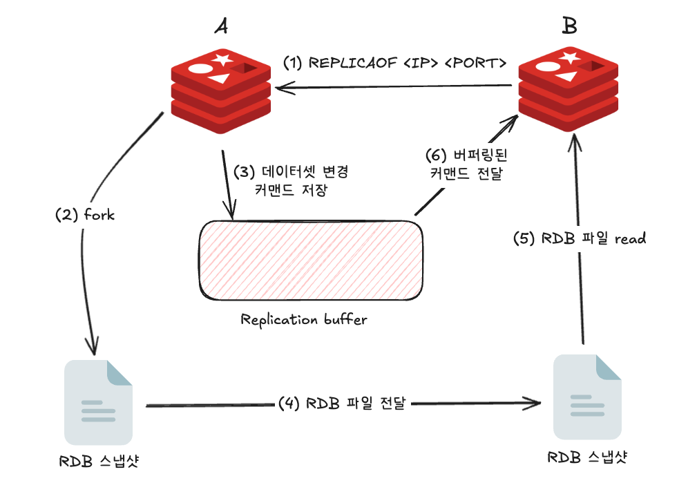
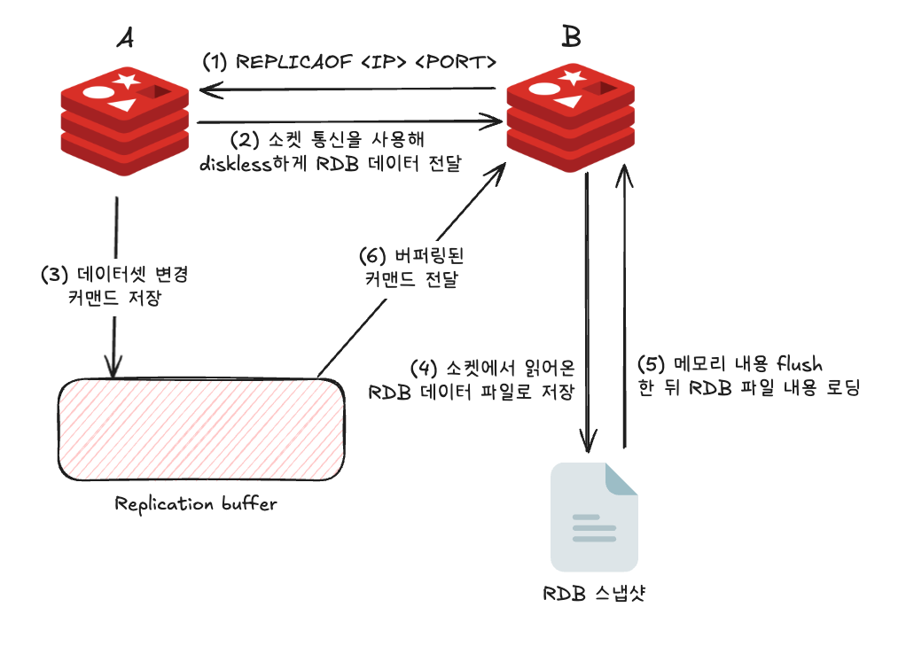
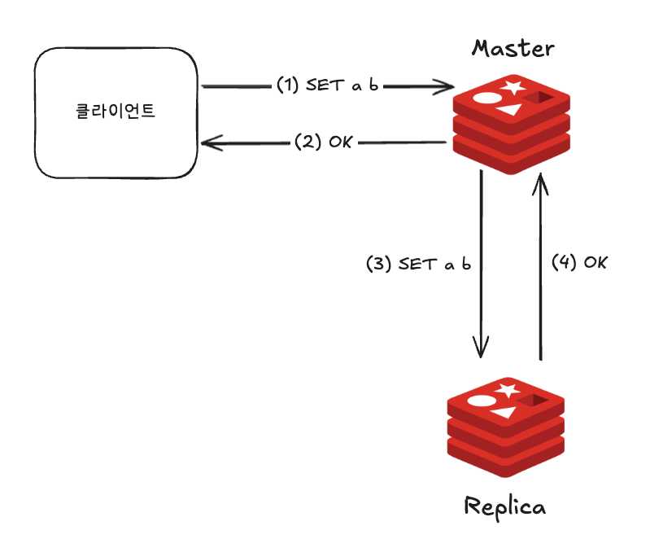
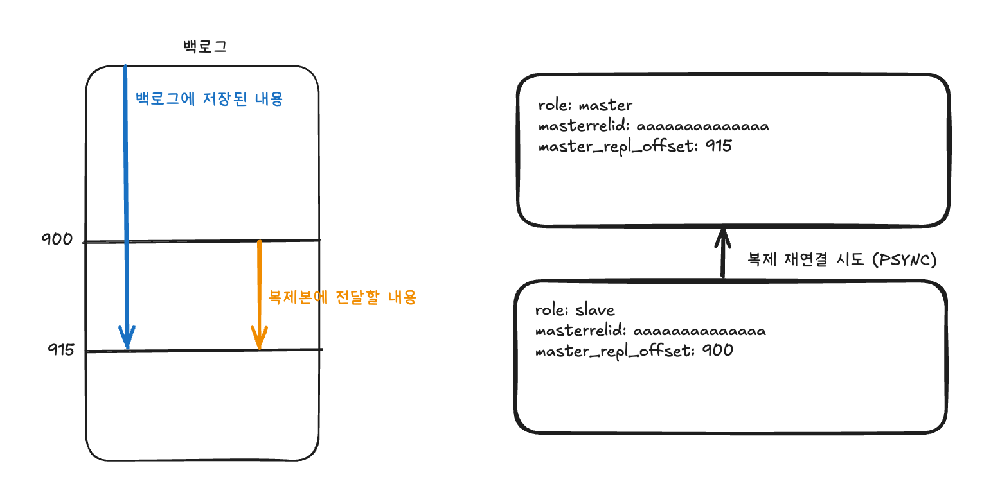
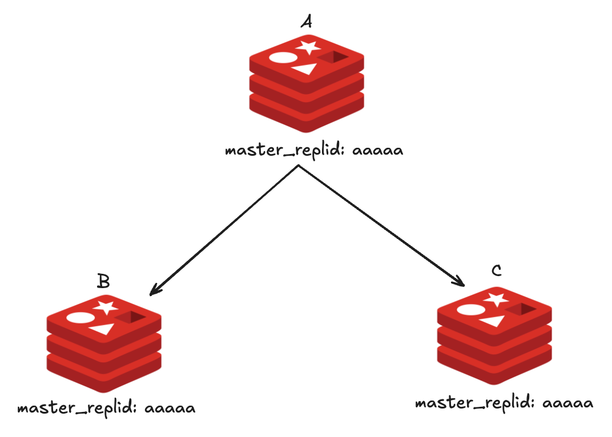
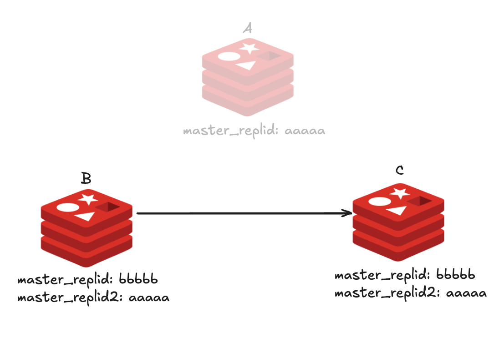
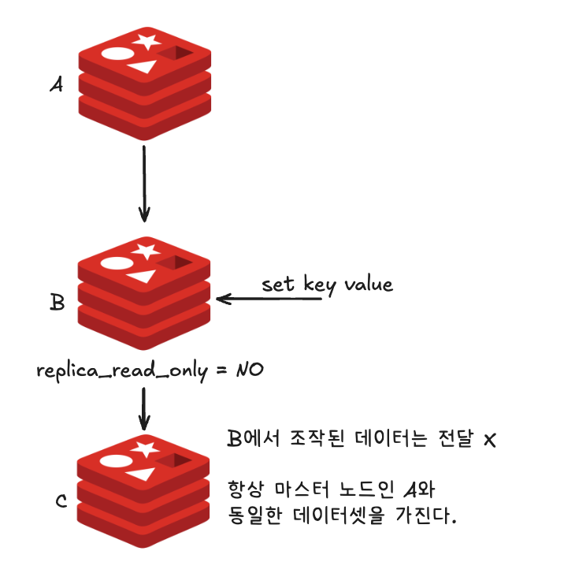
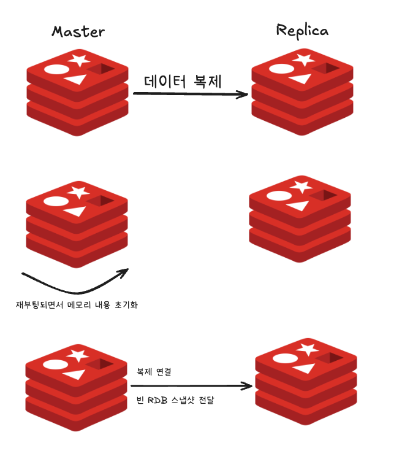

# 08장 복제

```shell
Availability = {Availalbe for Use Time} / {Total Time}
```

- 레디스에서 고가용성 확보
1. 복제
- 마스터 노드의 데이터를 복제본 노드로 실시간 복사하는 기능
- 마스터 노드의 서버에 장애가 생겨 데이터가 유실된다 해도 복제본 노드에서 데이터를 확인할 수 있다.
2. 자동 failover (Sentinel이나 Cluster 모드)
- 마스터 노드에서 발생한 장애를 감지해 레디스로 들어오는 클라이언트 연결을 자동으로 복제본 노드로 리디렉션하는 기능
- 수동으로 레디스의 엔드포인트를 변경할 필요 X => 빠른 장애 조치 가능

----

## 레디스에서의 복제 구조

- 복제본 노드를 추가하는 이유?
1. 애플리케이션이 실행 중인 하드웨어는 언제든지 고장날 수 있으므로, 서비스를 안정적으로 운영하기 위해서는 마스터 데이터베이스가 다운됐을 때 대신 사용할 여분의 복제본이 필요.
2. 대규모 서비스에서 복제본은 트래픽을 감소시키는 역할을 수행할 수 있다. 실시간으로 마스터 노드에 접근해 데이터를 가져가는 서비스가 많을 때, 일부 트래픽이 복제본을 바라보게 한다면 부하 분산을 통해 마스터 노드로의 트래픽을 줄일 수 있다.
3. 운영 중인 마스터 노드에서 매번 데이터의 백업을 받는 것은 부담스러운 작업이다. 백업을 복제본에서 수행하면 백업 작업이 서비스에 미치는 영향도를 최소화할 수 있다.

- MySQL이나 PostgreSQL은 멀티 마스터 복제 구조를 제공하기 때문에 모든 노드가 마스터이면서 동시에 복제본이 되는 구조가 될 수 있다.
- 하지만 레디스는 멀티 마스터 구조를 지원하지 않으며 마스터는 복제본이 될 수 없다.
  - 레디스 2.6 이상부터 복제본 노드는 기본으로 읽기 전용으로 동작하기 때문에 데이터를 읽는 커맨드만 수행할 수 있다.
  - 모든 데이터 입력은 마스터 노드에서 이뤄지는 게 일반적. 복제본은 마스터에서 변경된 데이터를 그대로 받아온다.

### 복제 구조 구성

- 커맨드

```shell
> REPLICAOF <master-ip> <master-port>
```

- 마스터에는 여러 개의 복제본이 연결될 수 있으며, 복제본 노드에 새로운 복제본을 추가하는 것도 가능하다.
  - 하지만 한 개의 복제 그룹에서는 항상 한 개의 마스터 노드만 존재한다.
  - 가장 상위의 노드인 마스터 노드만 데이터를 업데이트하는 커맨드를 수행할 수 있으며, 하위 복제본은 모두 읽기 전용으로 동작하기 때문에 데이터를 읽어가는 커맨드만 수행할 수 있다.

### 패스워드 설정

- 레디스 6.0 이상부터 도입된 ACL 기능이 아닌 기본적인 패스워드를 사용해서 데이터를 복제할 때에는 `masterauth` 옵션에 패스워드를 입력해야 한다.
- `requirepass` 옵션을 이용해 패스워드를 설정할 수 있다.
  - 복제본 노드는 `masterpass` 옵션에 마스터의 `requirepass`에 성정된 패스워드 값을 입력해야 한다.
    - 해당 값이 없을 때에는 마스터에 연결해 데이터를 받아갈 수 없다. 

### 복제 메커니즘

- 레디스에서 복제는 사용자의 개입이 필요치 않다.

#### Redis 7.0 이전의 복제 연결 메커니즘



1. `REPLICAOF` 커맨드로 복제 연결 시도
2. 마스터 노드에서는 `fork`로 자식 프로세스를 새로 만든 뒤 RDB 스냅샷을 생성
3. 2번 과정 동안 마스터 노드에서 수행된 모든 데이터셋 변경 작업은 `레디스 프로토콜 RESP` 형태로 마스터의 복제 버퍼에 저장
4. RDB 파일이 생성 완료되면 파일을 복제본 노드로 복사
5. 복제본에 저장됐던 모든 내용을 모두 삭제한 뒤 RDB 파일을 이용해 데이터를 로딩
6. 복제 과정 동안 버퍼링됐던 복제 버퍼의 데이터를 복제본으로 전달해 수행

- 복제본 노드에서는 마스터와의 통신을 확인한 후 마스터로부터 RDB 파일을 읽어오고, RDB 파일을 로드하는 과정이 남아 있다.
- 이와 같은 복제 과정에서 복제 속도는 디스크 I/O 처리량에 영향을 받는다.
  - 마스터에서 RDB 파일을 저장하는 시간
  - 복제본에서 RDB 파일을 읽어오는 과정
- 만약 로컬 디스크에 RDB를 쓰는 것이 아니라 NAS와 같은 원격 디스크를 사용한다면 디스크 I/O 속도는 더욱 느려질 수 있다.
- 버전 7 이후부터 `repl-diskless-sync` 옵션의 기본값은 yes.
  - 디스크를 사용하지 않는다는 말이다.

#### Redis 7.0 이후




1. `REPLICAOF` 커맨드로 복제 연결 시도
2. 마스터 노드는 소켓 통신을 이용해 복제본 노드에 바로 연결하며, RDB 파일은 생성됨과 동시에 점진적으로 복제본의 소켓에 전송된다.
3. 2번의 과정 동안 마스터 노드에서 수행된 모든 데이터셋 변경 작업은 `레디스 프로토콜 RESP` 형태로 마스터의 복제 버퍼에 저장
4. 소켓에서 읽어온 RDB 파일을 복제본의 디스크에 저장
5. 복제본에 저장된 모든 데이터를 모두 삭제한 뒤 RDB 파일 내용을 메모리에 로딩.
6. 복제 버퍼의 데이터를 복제본으로 전달해 수행.

- `repl-diskless-load` 옵션은 기본적으로 `disabled`
  - 소켓에서 읽어온 RDB 스냅샷 데이터를 바로 메모리에 로드하지 않고, 일단 복제본 노드의 디스크에 저장하는 과정을 거친다.
- 디스크의 I/O가 느리고 네트워크가 빠른 경우 디스크를 사용하지 않는 복제 방식을 사용하는 것이 더 빠르게 복제 연결을 완료할 수 있는 방법이다.

### 비동기 방식으로 동작하는 복제 연결

- 정상적으로 복제 연결이 된 상태에서 마스터에서 복제본으로의 데이터 전달은 `비동기 asyncronous` 방식으로 동작한다.



### 복제 ID

- 모든 레디스 인스턴스는 `복제 ID (Replication ID)`를 가지고 있다.
  - 복제 기능을 사용하지 않는 인스턴스라도 모두 랜덤 스트링 값의 복제 ID를 갖니다.
  - 복제 ID는 오프셋과 쌍으로 존재.
  - 레디스 내부의 데이터가 수정되는 모든 커맨드를 수행할 때마다 오프셋이 증가
- `INFO REPLICAION` 커맨드를 사용하면 복제 연결 상태를 확인할 수 있다.

```shell
> INFO REPLICATION
# Replication
role:master
connected_slaves:2
slave0:ip=<ip주소1>,port=6379,state=online,offset=7215560408,lag=1
slave1:ip=<ip주소2>,port=6379,state=online,offset=7215560408,lag=0
master_failover_state:no-failover
master_replid:<복제 ID1>
master_replid2:<복제 ID2>
master_repl_offset:7215560408
second_repl_offset:7002341815
repl_backlog_active:1
repl_backlog_size:1048576
repl_backlog_first_byte_offset:7214502978
repl_backlog_histlen:1057431
```

### 부분 재동기화

- 복제 연결이 끊길 대마다 마스터에서 RDB 파일을 새로 내려 복제본에 전달하는 과정을 거친다면 네트워크가 불안정한 상황에서 복제 기능을 사용하는 레디스의 성능은 급격하게 나빠질 것이다.
- 이를 방지하기 위해 레디스는 부분 `재동기화 partial resynchronization` 기능을 사용해 안정적으로 복제 연결을 유지한다.
- 마스터는 커넥션 유실을 대비해 백로그 버퍼라는 메모리 공간에 복제본에 전달한 커맨드 데이터들을 저장해둔다.
  - 하나의 복제 그룹에서 `replication id`와 오프셋을 이용하면 복제본이 마스터의 어느 시점까지의 데이터를 가지고 있는지 파악할 수 있다.



- offset 900의 복제본 노드가 마스터 노드에 재연결을 시도하는 모습이다.
  - 만약 offset 901~915의 내용이 마스터의 백로그에 저장돼 있다면 마스터는 RDB 파일을 새로 저장할 필요 없이 백로그에 저장된 내용을 복제본에 전달함으로써 부분 재동기화를 진행할 수 있다.
  - 하지만 마스터의 백로그 버퍼에 원하는 데이터가 남아 있지 않거나, 복제본이 보낸 `replication ID`가 현재의 마스터와 일치하지 않다면 `전체 재동기화 full resync`를 시도한다.

- 복제 백로그 크기는 `repl-backlog-size` 파라미터로 설정할 수 있으며, 기본값은 1MB이다.
  - 백로그는 1개 이상의 복제본이 연결된 경우에만 할당되며, `repl-backlog-ttl` 만큼의 시간이 경과하면 메모리에서 백로그 공간을 삭제한다.
- 복제본은 언제든지 마스터로 승격될 가능성을 갖고 있기 때문에 복제본에 직접 연결된 복제 연결이 따로 없더라도 백로그 버퍼를 해제하지 않는다.
  - 이는 추후 다른 복제본과 부분 재동기화를 시도할 때 사용된다.

### Secondary 복제 ID



- 한 개의 복제본 그룹 내의 모든 레디스 노드는 동일한 복제 ID를 갖는다.
- 아래는 A 노드에 문제가 발생해 복제본 B가 새로운 마스터 노드로 승격되는 상황이다.



- 기존 마스터 노드와의 복제가 끊어짐과 동시에 복제본은 새로운 복제 ID를 갖게 된다.
  - 복제 ID가 동일하다는 것은 동일한 데이터셋을 갖는다는 의미. => 장애가 해결된 기존 마스터 노드 A와 재연결되면 동일한 오프셋이 동일한 데이터셋을 갖는다는 사실을 위반할 수 있다.
- 노드 C가 B에 복제 연결이 될 때,두 노드의 `master_replid2`가 같기 때문에 C 노드는 B 노드에 `부분 재동기화 partial resynchronization`를 시도한다.
- 레디스가 2개의 복제 ID를 갖는 이유는 마스터로 승격되는 복제본 때문이며, 같은 복제 그룹 내에서 failover 이후 승격된 새로운 마스터에 연결된 복제본은 전체 재동기화를 수행할 필요가 없을 수 있다.

### 읽기 전용 모드로 동작하는 복제본 노드

- 복제본 노드에 새로운 데이터를 저장하는 것은 불가능.
  - 이 설정은 `replica-read-only` 옵션을 이용해 제어된다.
- 특정 상황에서 마스터 노드에서 수행하기에는 오래 걸리는 연산의 결과를 테스트하기 위한 용도로 복제본의 `replica-read-only` 설정을 해제하고 싶을 수 있다.
  - 이 경우 복제본 노드의 데이터가 변경되더라도 복제본이 재시작되거나 커넥션이 유실돼 마스터와 전체 재동기화를 수행하게 되면 복제본에서 수행한 데이터는 사라지기 대문에 유의해야 한다.



- 복제본에 데이터를 직접 쓰더라도 복제본에 쓰는 내용은 오직 로컬에서만 유지되며, 해당 노드에 복제 연결된 다른 복제본으로는 전파되지 않는다.

### 유효하지 않은 복제본 데이터

- 복제 구조에서 `유효하지 않은 stale` 데이터란 복제본의 데이터와 마스터의 데이터가 정확하게 일치하지 않는 경우의 데이터를 의미한다.
- 레디스에서 복제본이 마스터와 연결이 끊어진 상태, 혹은 복제 연결이 시작된 뒤 아직 완료되지 않았을 경우에 복제본의 데이터가 유효하지 않다고 판단할 수 있다.
- 복제본의 동작 방식은 `replica-serve-stale-data` 파라미터를 이용해 제어할 수 있다.
  - 기본값은 `yes`. 유효하지 않다고 판단할 때도 모든 읽기 요청에 데이터를 반환
  - `no`로 설정한다면, `INFO`, `CONFIG`, `PING` 등의 일부 기본 커맨드를 제외한 모든 커맨드에 대해 `SYNC with master in progress`라는 오류를 반환한다.

### 백업을 사용하지 않는 경우에서의 데이터 복제

- 복제를 사용하는 경우, 마스터와 복제본에서 백업 기능을 사용하는 것이 좋다.
  - 만약 이 기능을 사용하지 않으려면 재부팅 후 레디스가 자동으로 재시작되지 않도록 설정할 것을 권장한다.



- 위의 장애 상황 정리

1. 백업 기능을 사용하지 않는 마스터와 복제본 노드가 존재
2. 마스터 노드가 장애로 인해 종료됐지만, 레디스 프로세스를 자동 재시작하는 시스템에 의해 노드가 재부팅. 이때 메모리의 내용은 초기화
3. 복제본 노드에는 데이터가 존재하지만, 마스터 노드로의 복제 연결을 시도
4. 마스터에서 복제본으로 빈 데이터셋 전달

- 따라서 복제 기능을 사용한다면, 백업 기능을 사용하거나! 그렇지 않다면 마스터에서는 인스턴스의 자동 재시작을 활성화하지 말자!

--- 

# 참고자료

- 개발자를 위한 레디스, 김가람 지음
