# 09장 센티널

## 고가용성 기능의 필요성

- 복제 구성에서의 마스터 인스턴스 장애 발생 시 처리 과정

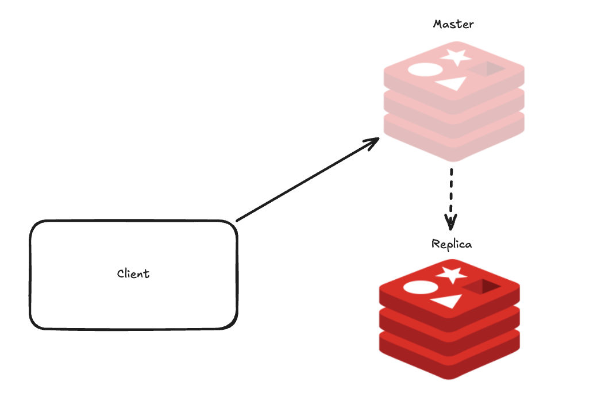
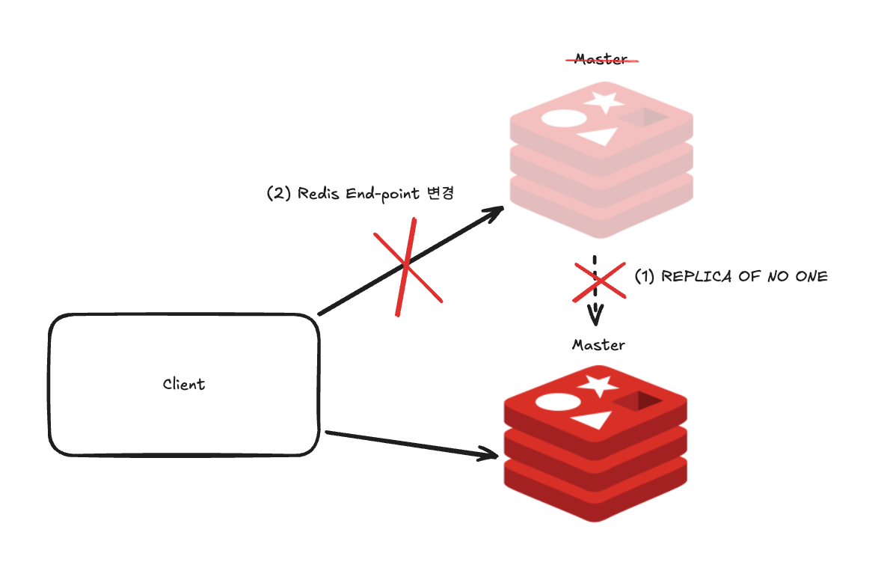

1. 복제본 노드에 직접 접속한 뒤 `REPLICA OF NO ONE` 커맨드를 입력해 읽기 전용 상태 해제
2. 애플리케이션 코드에서 레디스의 엔드포인트를 복제본의 IP로 변경
3. 배포

- 가용성 부족
  - look aside 전략 사용의 경우 -> 서버 부하 급증. 급격한 DB 커넥션 증가.

## 센티널이란?

- 레디스의 자체 고가용성 기능은 `센티널 Sentinel`을 사용하면 앞선 장애 상황을 대비할 수 있다.
  - 데이터를 저장하는 기존 레디스 인스턴스와는 다른 역할을 하는 별도의 프로그램.
  - 센티널의 자동 failover 기능을 사용하면 마스터 인스턴스에 장애가 발생하더라도 레디스를 계속 사용할 수 있도록 동작해 레디스의 다운타임을 최소화할 수 있다.

### 센티널 기능

#### 모니터링

- 마스터, 복제본 인스턴스의 상태를 실시간으로 확인

#### 자동 failover

- 마스터의 비정상 상태를 감지해 정상 상태의 복제본 중 하나를 마스터로 승격.
- 기존 마스터에서 연결된 복제본은 새롭게 승격된 마스터에 연결

#### 인스턴스 구성 정보 안내

- 클라이언트에게 현재 구성에서의 마스터 정보를 알려줌
- failover가 발생하면 변경된 마스터 정보를 재전달하기 때문에 failover가 발생하더라도 레디스의 엔드포인트 정보를 변경할 필요가 없다.

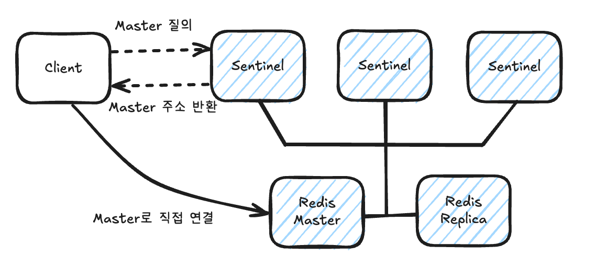

### 분산 시스템으로 동작하는 센티널

- `SPOF (Single Point Of Failure)`는 하나의 서비스에 문제가 발생했을 때 전체 시스템이 영향을 받는 지점을 뜻한다.
  - 복제와 자동 failover를 이용해 고가용성을 확보하는 이유는 레디스가 SPOF가 되는 것을 방지하기 위함이다.
- 센티널은 그 자체로 SPOF가 되는 것을 방지하기 위해 최소 3대 이상일 때 정상적으로 동작할 수 있도록 설계됐으며, 하나의 센티널에 이상이 생기더라도 다른 센티널이 계속해서 역할을 수행할 수 있게 된다.
- 센티널은 오탐을 줄이기 위해 `쿼럼 quorum`이라는 개념을 사용한다.
  - 마스터가 비정상 동작을 한다는 것에 동의해야 하는 센티널의 수로, 쿼럼을 만족하는 경우 failover를 시작한다.
  - 일반적으로 센티널 인스턴스가 3개일 때 쿼럼은 2로 설정. 이 경우 최소 2개 이상의 센티널 인스턴스가 마스터 비정상 상태에 동의한다면 페일오버 프로세스를 시작시킨다.

### 센티널 인스턴스 배치 방법

- 기본적으로 인스턴스는 물리적으로 서로 영향받지 않는 서버에서 실행되는 것이 좋다.
- 마스터의 장애를 감지할 수 있어야 하기 때문에 서로 다른 가용 영역에 배치하는 것이 일반적이다.

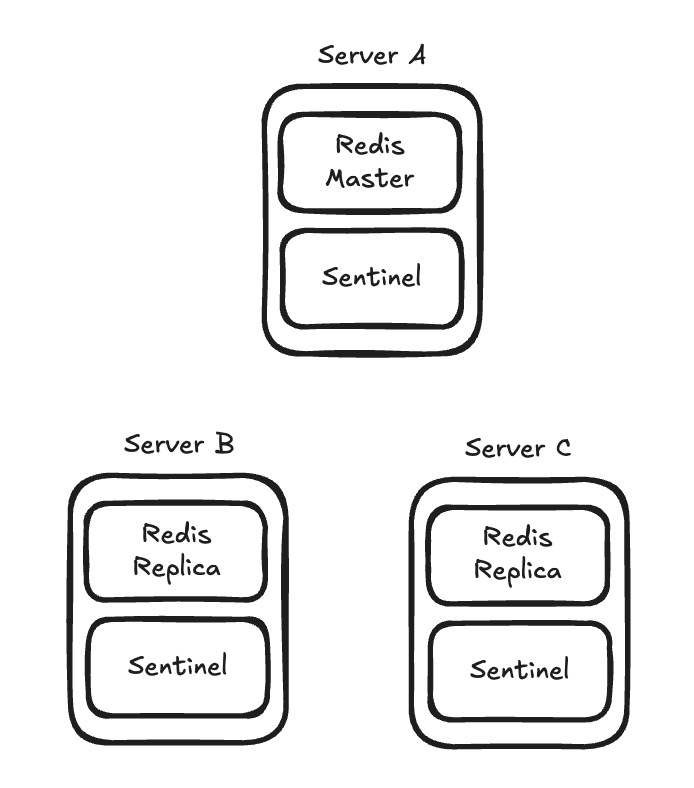

- 각각 다른 물리 서버에 배치하는 것이 좋기 때문에 위와 같은 구조가 센티널을 사용할 때의 가장 일반적인 배치 방법이다.
- 만약 서버 A에 문제가 생겨 마스터 노드와 센티널에 접근할 수 없게 되면 서버 B, C에 있는 센티널 인스턴스가 마스터 인스턴스에 접근이 불가능한 상태라는 것을 동의한 뒤, failover를 진행시켜 아래와 같은 상태가 된다.

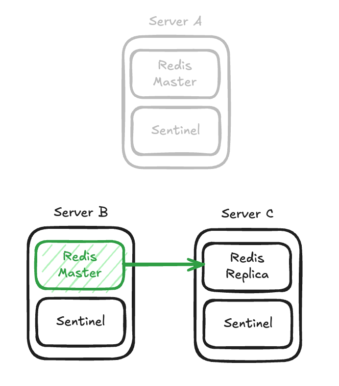

- 서버 B와 C의 센티널 인스턴스는 새롭게 마스터가 될 복제본을 선출한 뒤, 해당 복제본 인스턴스를 마스터로 승격시킨다.
  - 서버 B의 복제본이 마스터 노드로 선출되면, 서버 C의 복제본은 서버 B를 바라보도록 복제 연결을 변경한다.
- 클라이언트도 새롭게 선출된 마스터로 연결.
- 서버 A가 복구된다면, 서버 A의 레디스 인스턴스를 새롭게 마스터가 된 서버 B의 복제본이 되도록 연결시킨다.
- 이는 모두 센티널 인스턴스의 판단. 운영자의 개입 필요 X
- 아래와 같이 센티널 프로세스만 살행시키도록 배치할 수 있다.
  - 이때 센티널만 실행시키는 컨테이너는 최저 사양의 스펙으로 구성되어도 괜찮다.

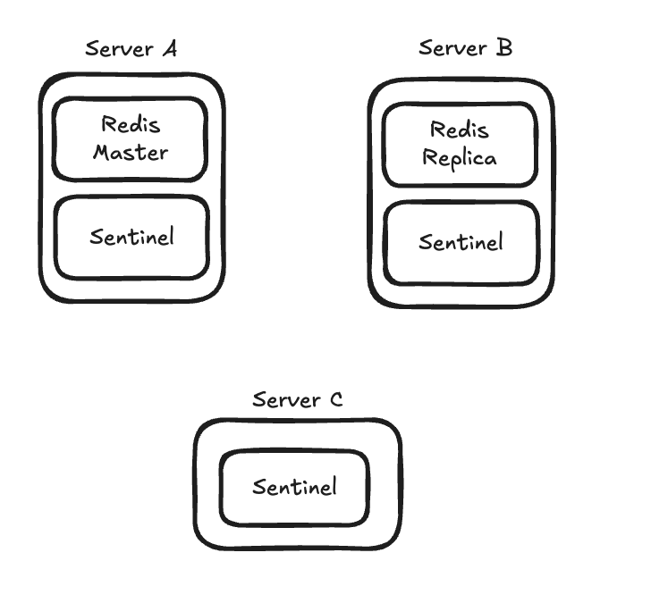

---

## 센티널 인스턴스 실행하기

- 센티널은 마스터와 복제본을 포함한 모든 레디스 프로세스를 모니터링한다.
    - 구성 파일에는 복제본 정보를 직접 입력하지 않아도 된다.
    - 센티널 프로세스가 시작하면 마스터에 연결된 복제본을 자동으로 찾아내는 과정을 거친다.

- 마스터에 연결된 자세한 정보 확인

```redis
> SENTINEL replicas <master-name>
```

- 마스터에 연결된 센티널의 자세한 정보 확인

```redis
> SENTINEL sentinels <master-name>
```

### 커맨드를 이용해 페일오버 발생시키기

- 실제 레디스를 운영 서비스에 투입하기 전에 페일오버 테스트를 진행해보는 것이 좋다.
- 아래 명령어를 실행하면 다른 센티널의 동의를 구하지 않고도 failover를 바로 발생시킬 수 있다.

```redis
> SENTINEL FAILOVER <masterName>
```

### 마스터 동작을 중지시켜 failover 발생 (자동 failover)

```shell
> redis-cli -h <master-host> -p <master-port> shutdown
```

- 센티널은 주기적으로 마스터 노드에 `PING`을 보내 응답이 정상적으로 돌아오는지 확인함으로써 마스터 인스턴스의 상태를 파악한다.
- `sentinel.conf`에 지정한 `down-after-milliseconds` 시간 동안 마스터에서 응답이 오지 않으면 마스터의 상태가 정상적이지 않다고 판단해 failover를 트리거한다.
  - 기본값은 30초.

----

## 센티널 운영하기

### 패스워드 인증

- `requirepass/masterauth` 옵션을 이용해 패스워드를 설정한 경우 센티널의 설정 파일에서도 패스워드르 지정해야 한다.
- 하나의 복제 그룹에서 `requirepass`와 `masterauth` 값은 모든 노드에서 동일하게 설정해야 한다.
- 패스워드가 걸려 있는 레디스를 모니터링할 경우 `sentinel.conf`에 다음과 같이 패스워드를 지정해야 한다.

```redis
> SENTINEL auth-pass <master-name> <password>
```

### 복제본 우선순위

- 모든 레디스 인스턴스는 `replica-priority`라는 파라미터를 가지고 있다.
- 센티널은 failover를 진행할 때 복제본 노드의 `replica-priority`라는 우선순위 노드를 확인하며, 해당 값이 가장 작은 노드를 마스터로 선출한다.
- 기본값은 100이며, 이 값이 0인 복제본은 절대 마스터로 선출되지 않는다.

### 운영 중 센티널 구성 정보 변경

- 센티널은 실행 도중 모니터링할 마스터를 추가, 제거, 변경할 수 있다.
- 이때 마스터를 모니터링하는 센티널이 여러 대라면 각각의 센티널에 모두 설정을 적용해야 하며, 설정을 변경했다고 해서 그 정보들이 다른 센티널로 전파되지는 않는다.
- `SENTINEL MONITOR` 명령어는 센티널이 새로운 마스터를 모니터링할 수 있도록 한다.

```redis
> SENTINEL MONITOR <master-name> <ip> <port> <quorum>
```

- `SENTINEL REMOVE` 커맨드는 더 이상 지정하는 마스터를 모니터링하지 않도록 지시

```redis
> SENTINEL REMOVE <master-name>
```

- `SENTINEL SET` 명령어는 특정 마스터에 대해 지정한 파라미터를 변경할 수 있다.

```redis
> SENTINEL SET <name> [<option> <value> ...]
```

### 센티널 초기화

- 센티널은 비정상적이라 판단한 복제본 노드에 대해서도 임의로 모니터링을 멈추지 않는다.
- 만약 서버를 더 이상 사용할 수 없어 해당 인스턴스에 대한 모니터링을 중단하려면 `SENTINEL RESET` 명령어를 사용해 센티널 인스턴스의 상태 정보를 초기화해야 한다.

```redis
> SENTINEL RESET <master-name>
```

### 센티널 노드의 추가/제거

- 마스터를 모니터링하도록 설정한 센티널 인스턴스를 실행시키면 자동 검색 메커니즘에 의해 자동으로 기존에 실행 중이던 다른 센티널의 `known-list`에 추가된다.
- 센티널 노드끼리는 오랜 시간 동안 응답이 없어도 센티널의 `known-list`에서 지우지 않는다.
  - 따라서 우선 제거할 센티널 프로세스를 종료한 뒤, `SENTINEL RESET *` 커맨드를 사용해 센티널이 모티너링하고 있는 정보를 리셋한다.

### 센티널의 자동 failover 과정

#### 마스터의 장애 상황 감지

- 센티널은 `down-after-milliseconds` 파라미터에 지정된 값 이상 동안 마스터에 보낸 `PING`에 대해 유효한 응답을 받지 못하면 마스터가 다운됐다고 판단한다.
- `PING`에 대한 유효한 응답은 `+PING`, `-LOADING`, `-MASTERDOWN`이며, 다른 응답이나 응답을 아예 받지 못할 경우는 모두 유효하지 않다고 판단한다.
- 만약 `down-after-milliseconds` 값이 30이고, 마스터는 29초마다 응답한다면 센티널은 해당 마스터를 정상적이라고 인지한다.

#### sdown, odown 실패 상태로 전환

- 아래와 같이 하나의 센티널 노드에서 레디스 마스터 인스턴스에 대한 응답을 늦게 받으면 그 센티널은 마스터의 상태를 우선 `sdown`으로 플래깅한다.
  - `sdown`이란 subjectly down. 주관적인 다운 상태를 의미한다.

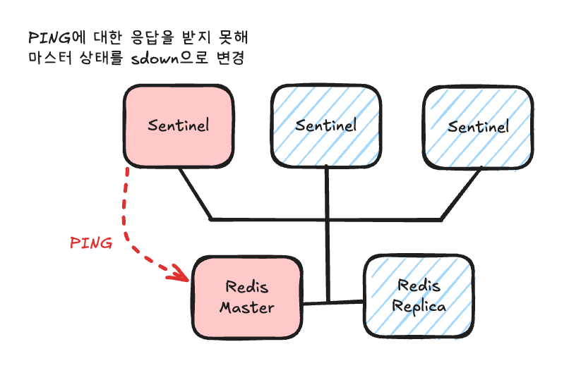

- 이후 센티널 노드는 다른 센티널 노드들에게 `SENTINEL is-master-down-by-addr <master-ip> <master-port> <current-epoch> <*>` 라는 커맨드를 보내 장애 사실을 전파한다.
- 그 과정은 아래와 같다.

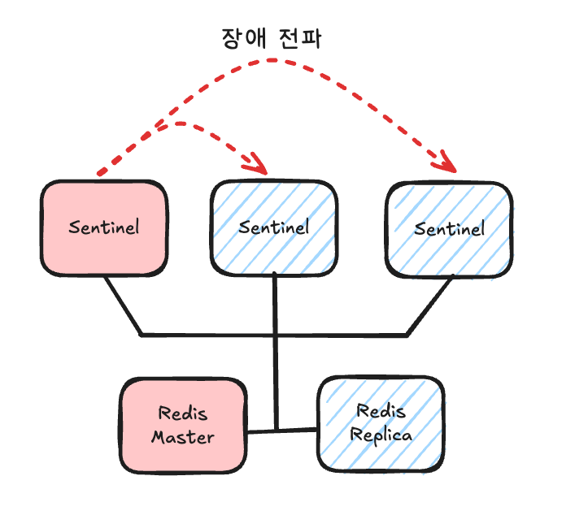

- 커맨드를 받은 센티널들은 해당 마스터 서버의 장애를 인지했는지 여부를 응답한다.
- 자기 자신을 포함해 쿼럼 값 이상의 센티널 노드에서 마스터의 장애를 인지한다면 센티널 노드는 마스터의 상태를 `odown`으로 변경한다.
  - objectly down, 즉 객관적인 다운 상태가 됐음을 의미한다.

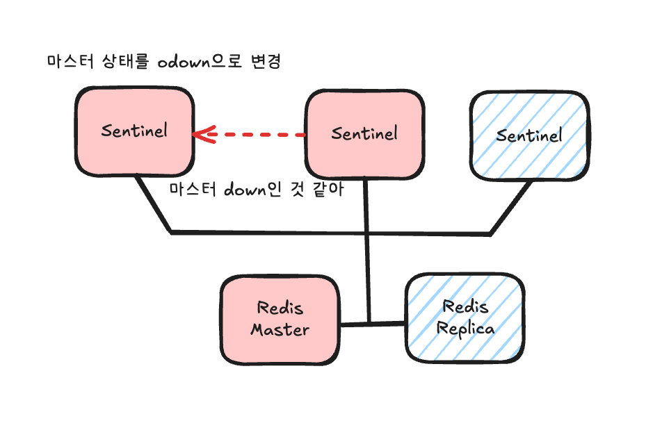

- `odown`은 마스터 노드에서만 갖는 상태다.
  - 복제본 노드는 `sdown`으로만 플래깅한다. 다른 센티널 노드로 전파하지는 않는다.
  - 다만 failover가 진행할 때 `sdown` 상태인 복제본은 마스터로 승격되도록 선택되지 않는다.

```shell
sentinel.log
+sdown
+odown
```

#### epoch 증가

- 처음으로 마스터 노드를 `odown`으로 인지한 센티널 노드가 failover 과정을 진행한다.
  - 시작하기 전 우선 `에포크 epoch` 값을 하나 증가시킨다.
- 에포크를 사용해 페일오버의 버전을 관리한다.
  - 동일한 에포크 값을 이용해 페일오버 과정이 진행되는 동안 모든 센티널 노드가 같은 작업을 시도하고 있다는 것을 보장할 수 있다.

```shell
sentinel.log
+new-epoch
+try-failover
```

#### 센티널 리더 선출

- 에포크를 증가시킨 센티널은 다른 센티널 노드에게 센티널 리더를 선출하기 위해 투표하라는 메시지를 보낸다.
  - 메시지를 받은 센티널 노드는 본인의 에포크도 증가시킨 뒤, 리더에게 투표하겠다는 응답을 보낸다.
  - 하나의 에포크에서 센티널은 하나의 센티널에 투표할 수 있으며, 투표 결과는 변경할 수 없다.

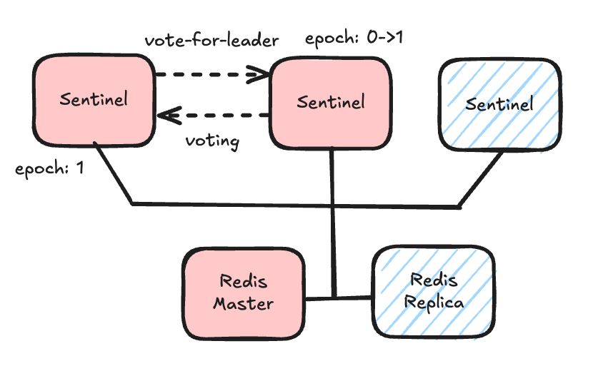

```shell
sentinel.log
+vote-for-leader
```

#### 복제본 선정 후 마스터로 승격

- 과반수 이상의 센티널이 failover에 동의했다면 리더 센티널은 failover를 시도하기 위해 마스터가 될 수 있는 적당한 복제본을 선정한다.
- 이때 마스터로부터 오랜 기간 동안 연결이 끊겼던 복제본은 승격될 자격이 없으며, 자격이 있는 복제본은 다음과 같다.

1. redis.conf 파일에 명시된 `replica-priority`가 낮은 복제본
2. 마스터로부터 더 많은 데이터를 수신한 복제본(`master_repl_offset`)
3. 2번 조건까지 동일하다면, `runID`가 사전 순으로 작은 복제본

- 선정한 복제본에는 `slaveof no one` 커맨드를 수행해, 기존 마스터로부터의 복제를 끊는다.

```shell
sentinel.log
+failover-state-select-slave
+selected-slave
+failover-state-send-slaveof-noone
+failover-state-wait-promotion
+promoted-slave
```

#### 복제 연결 변경

- 기존 마스터에 연결돼 있던 다른 복제본이 새로 승격된 마스터의 복제본이 될 수 있도록 복제본마다 `replicaof new-ip new-port` 커맨드를 수행해 복제 연결을 변경한다.
  - 복제 그룹의 모든 센티널 노드에서도 레디스의 구성 정보를 변경한다.

```shell
sentinel.log
+failover-state-reconf-slaves
+slave-reconf-sent
+slave-reconf-inprog
+slave-reconf-done
+config-update-from sentinel
```

#### 장애 조치 완료

- 모든 과정이 완료된 뒤 센티널은 새로운 마스터를 모니터링한다.

```shell
sentinel.log
+failover-end
+switch-master
```

### 스플릿 브레인 현상

- `스플릿 브렌 split brain`이란 네트워크 파티션 이슈로 인해 분산 환경의 데이터 저장소가 끊어지고, 끊긴 두 부분이 각각을 정상적인 서비스라고 인식하는 현상을 말한다.
- 아래와 같이 네트워크 단절이 발생하면 스플릿 브레인 현상이 발생할 수 있다.

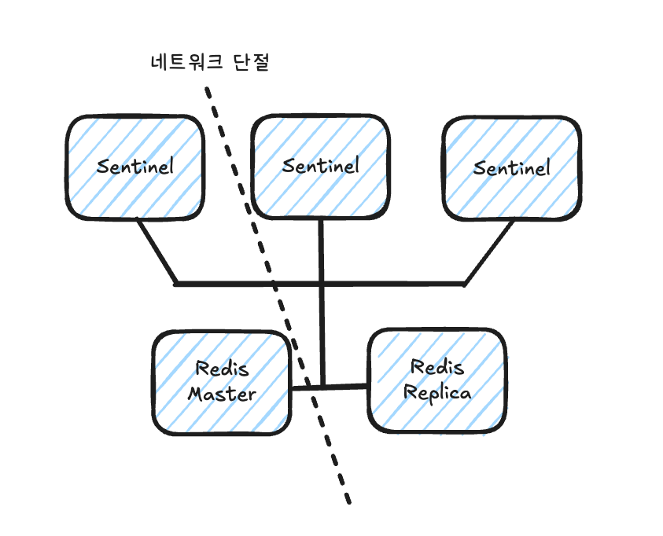

- 네트워크 단절이 길어지면 센티널 B와 C는 마스터 노드로의 접근이 정상적이지 않다는 것을 감지한 뒤, 복제본 노드를 마스터로 승격시키게 된다.
- 만약 마스터 인스턴스에는 장애가 발생하지 않았으며, 단지 노드 간 네트워크 단절이 일어난 경우라면 하나의 복제본에 2개의 마스터가 생기는 스플릿 브레인 현상이 일어난다.

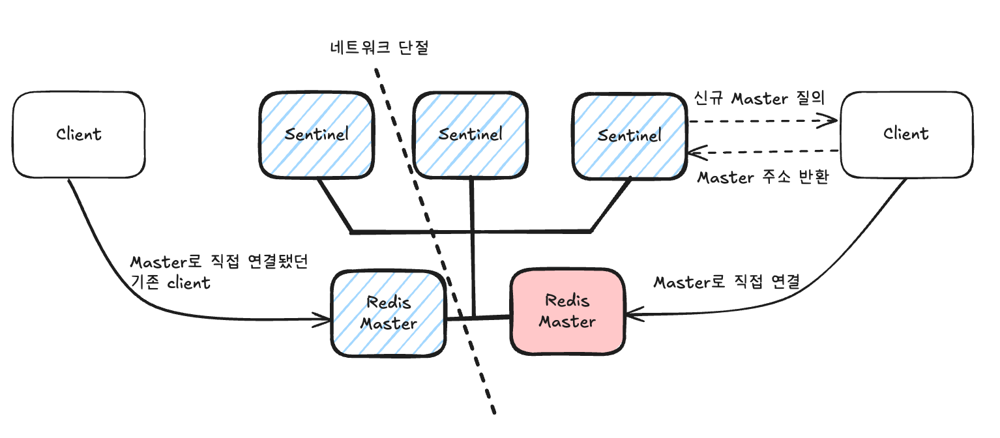

- 이 경우 새로 레디스로 연결하고자 하는 클라이언트가 센티널 C에 마스터 주소를 물어본다면 센티널은 새롭게 마스터로 승격된 주소를 반환한다.
  - 클라이언트는 새로운 마스터에 데이터를 쓰게 된다.
- 만약 네트워크 단절이 복구된다면 기존 마스터는 센티널 B, C에 의해 새롭게 승격된 마스터의 복제본으로 연결된다.
  - 이때 기존 마스터가 단절 동안 처리했던 모든 데이터는 유실된다.

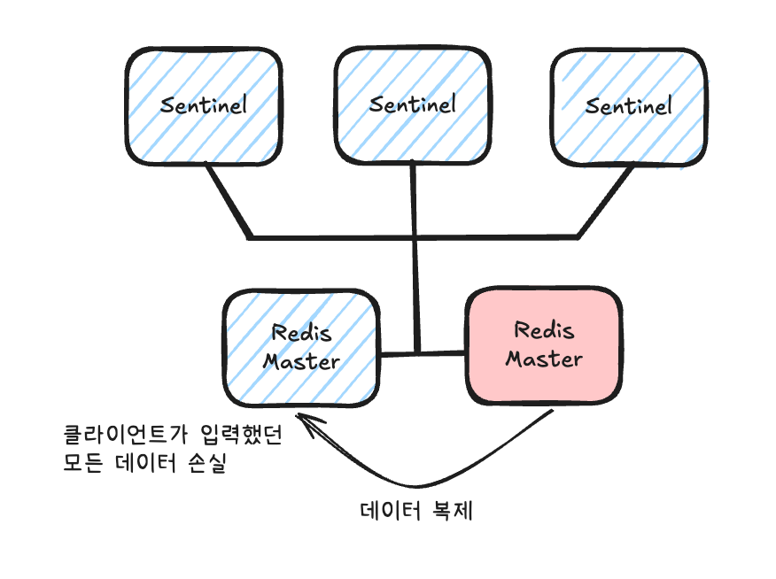

# 참고자료

- 개발자를 위한 레디스, 김가람 지음

