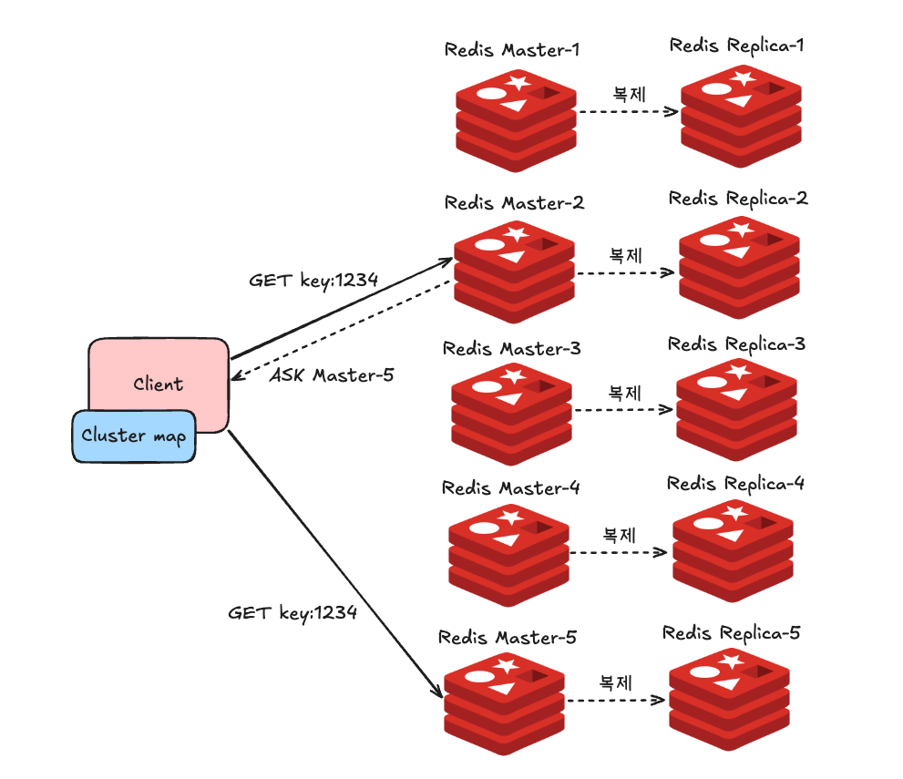
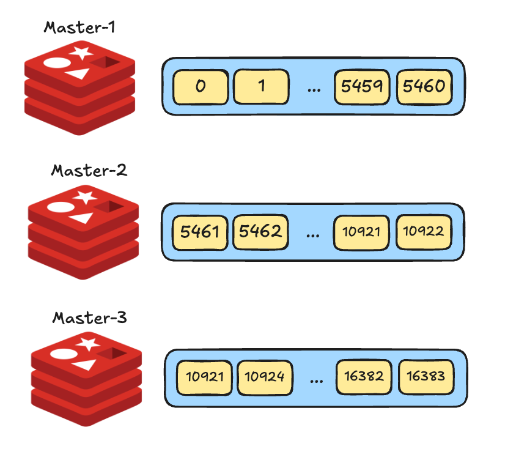
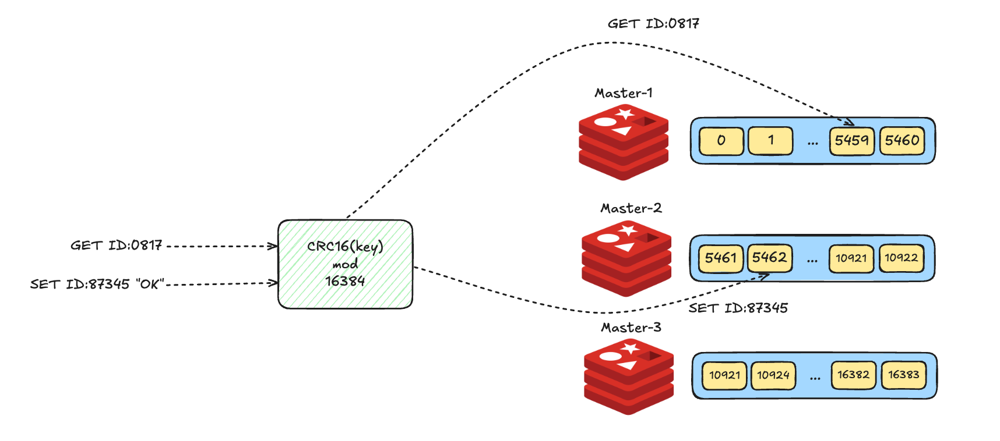
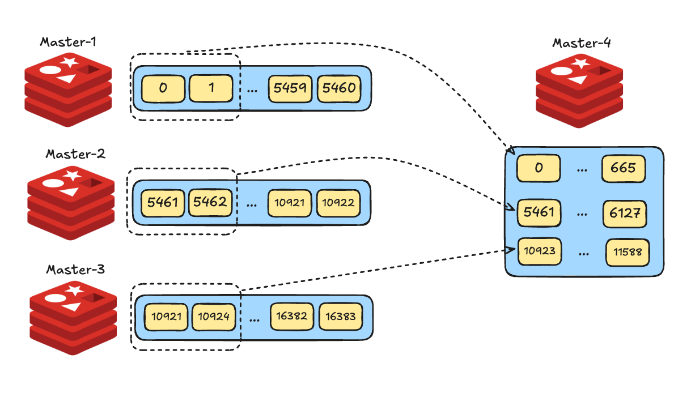
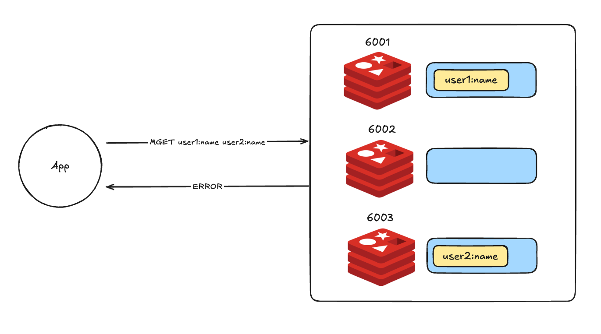

# 10장 클러스터

## 레디스 클러스터와 확장성

### 스케일 업 vs 스케일 아웃

- `확장성 scalability`은 운영 중인 시스템에서 증가하는 트래픽에 유연하게 대응할 수 있는 능력을 말한다.
- `스케일 업 scale up`: 하드웨어 사양 높이기 = `수직 확장 vertical scaling`
- `스케일 아웃 scale out`: 장비 추가하기 = `수평 확장 horizontal scaling`

### 레디스에서의 확장성

- 운영 중 키의 `eviction`이 자주 발생한다면 서버의 메모리를 증가시키는 스케일 업을 고려할 수 있다.
  - 키의 `eviction`은 레디스 인스턴스의 `maxmemory`만큼 데이터가 차 있을 때 또다시 데이터를 저장할 때 발생하는 것이므로, 서버의 메모리를 늘리고 레디스의 `maxmemory` 값을 증가시키는 스케일 업이 필요
- 하지만 레디스의 처리량을 증가시키고 싶다면? 스케일 업만으로는 한계가 있다.
  - 레디스는 단일 스레드로 동작하기 때문에 서버에 CPU를 추가해도 여러 CPU 코어를 동시에 활용할 수 없다.
  - 그러나 데이터를 여러 서버로 분할해 관리하면 다수의 서버에서 요청을 병렬로 처리할 수 있으므로, 서버 대수를 늘림으로써 처리량을 선형적으로 확장시킬 수 있다.

### 레디스 클러스터의 기능

- 레디스를 클러스터 모드로 사용하면 추가적인 애플리케이션 아키텍처의 변경 없이 여러 레디스 인스턴스 간 수평 확장이 가능해지며, 데이터의 분산 처리와 복제, 자동 페일오버 기능 또한 사용할 수 있다.

#### 데이터 샤딩

- 데이터 저장소를 수평 확장하며 여러 서버 간에 데이터를 분할하는 데이터베이스 아키텍처 패턴을 샤딩이라 한다.



- 레디스에서 클러스터 기능을 사용하면 마스터를 최대 1,000개까지 확장시킬 수 있다.
  - 데이터의 샤딩과 관련된 모든 기능은 레디스 내부에서 자체적으로 관리되며, 이를 위한 프록시 서버 등의 추가 아키텍처는 필요치 않다.
- 클러스터의 모든 노드는 키가 저장돼야 할 노드를 알고 있기 때문에 클라이언트가 다른 노드에 데이터를 쓰거나 읽으려 할 때 키가 할당된 마스터 노드로 연결을 리디렉션한다.
- 클러스터에서 노드가 추가/변경되지 않는 이상 하나의 키는 특정 마스터에 매핑된다.
  - 매번 레디스에 키를 저장할 노드를 질의하지 않게 하기 위해 클라이언트에서는 클러스터 내에서 특정 키가 어떤 마스터에 저장돼 있는지의 정보를 캐싱할 수 있다.
  - 이를 이용해 키를 찾아오는 시간을 단축

#### 고가용성

- 클러스터는 각각 최소 3대의 마스터, 복제본 노드를 갖도록 구성하는 것이 일반적.
  - 하나의 클러스터 구성에 속한 각 노드는 서로를 모니터링.
  - 마스터 노드에 장애 발생 -> 연결된 복제본 노드를 마스터로 자동 페일오버시키기 때문에 사용자의 추가적인 개입 없이 레디스의 가용성을 증가
- `클러스터 버스`: 클러스터 내에서 노드들이 통신할 수 있는 독립적인 공간.
  - 모든 레디스 클러스터 노드는 TCP 포트가 열려 있다.
  - 클라이언트로부터 커맨드를 받는 TCP 포트와 독립되게 동작. 구성 파일에서 `cluster_bus_port` 값을 정의하지 않는다면 일반적으로 일반 포트에 10,000을 더한 값으로 자동 설정
  - ex) 레디스 노드 포트가 6379 포트일 때, 클러스터 버스 포트는 16379 포트를 이용해 통신
- 모든 노드가 TCP 연결을 사용해 다른 모든 노드와 연결돼 있는 `풀 메쉬 full-mesh` 토폴로지 형태다.
  - 클러스터가 N개의 노드로 이뤄져 있을 때, 모든 노드는 N-1개의 다른 노드와 송수신 TCP 연결을 하고 있으며, 이 연결은 계속 유지된다.
  - 1개 노드에서 다른 노드로 `PING`을 보냈을 때, `PONG` 응답이 늦는다면 해당 노드로의 연결을 새로 시도한다.

---

## 레디스 클러스터 동작 방법

### 해시슬롯을 이용한 데이터 샤딩

- 클러스터 구조에서 모든 데이터는 해시슬롯에 저장된다.
- 레디스는 총 16,384개의 해시슬롯을 가지며, 마스터 노드는 해시슬롯을 나눠 갖고 있다.
  - 3대의 마스터 노드로 클러스터를 구성하면 해시슬롯은 아래와 같이 분배된다.



- 레디스에 입력되는 모든 키는 하나의 해시슬롯에 매핑. 해시함수는 다음과 같다.

```
HASH_SLOT = CRC16(key) mod 16384
```

- 키를 CRC16으로 먼저 한 번 암호화한 다음 16384라는 값으로 나눈 나머지 값을 이요해 해시슬롯이 결정된다.
  - 데이터를 저장할 때뿐만 아니라 데이터를 읽어올 때도 위의 함수를 이용해 커맨드를 처리할 적절한 마스터 노드를 찾아간다.



- 해시슬롯은 마스터 노드 내에서 자유롭게 옮겨질 수 있으며, 옮겨지는 중에도 데이터는 정상적으로 접근할 수 있다.
- 이러한 특성으로 인해 하나의 클러스터 내에서 마스터 노드의 추가, 삭제는 굉장히 간단하게 처리될 수 있다.



- 신규 레디스 노드를 마스터로 추가한 뒤 기존 노드가 가지고 있던 해시슬롯의 일부를 신규 마스터로 이동시켜주면 된다.
- 만약 노드를 삭제한다고 하면 이 또한 쉬운데, 삭제할 노드가 갖고 있는 해시슬롯을 전부 다른 마스터로 이동시킨 다음 노드를 클러스터에서 제외시키면 된다.

### 해시태그

- 클러스터를 사용할 때는 다중 키 커맨드를 사용할 수 없다.
  - ex) `MGET`과 같이 한 번에 여러 키에 접근해 데이터를 가져오는 커맨드
- 정확히 말하면, 서로 다른 해시슬롯에 속한 키에 대해 다중 키 커맨드를 사용할 수 없다.



- 이때 해시태크라는 기능을 사용하면 이런 문제를 해결할 수 있다.
  - 클러스터에서 데이터는 앞서 설명한 알고리즘을 이용해 키를 해시하기 때문에 키는 랜덤으로 해시슬롯에 배정된다.
  - 하지만 키에 중괄호를 사용하면 전체 키가 아닌 대괄호 사이에 있는 값을 이용해 해시될 수 있다. 이를 해시태그라 한다.

```shell
user:{123}:profile
user:{123}:account
```

- 위의 두 키는 중괄호 사이에 123이라는 동일한 값을 가지고 있기 때문에 같은 해시슬롯, 즉 같은 마스터에 저장된다는 것이 보장된다.
  - 만약 중괄호 사이에 아무런 문자열이 없다면 다른 키들과 동일하게 전체 키의 문자열로 해싱되며, 여러 개의 `{}` 문자가 포함된 키의 경우 가장 처음의 `{`부터 가장 처음의 `}` 사이의 값들이 해싱된다.
- 따라서 다중 키 커맨드를 사용하고 싶다면 아래처럼 태그 기능을 사용하자.

```redis
MGET {user}1:name {user}2:name
```

- 하지만 너무 많은 키가 같은 해시태그를 갖고 있다면 하나의 해시슬롯에 데이터가 몰리는 현상이 발생할 수 있기 때문에 키의 분배에 대한 모니터링이 필요할 수 있다.

### 자동 재구성

- 클러스터 구조는 센티널과 다르게, 일반 레디스 노드가 서로를 감시한다.
- 레디스 클러스터를 사용할 때 발생하는 재구성은 총 두 가지다.
1. 마스터 노드에 장애가 발생했을 대 복제본 노드를 마스터로 승격시키는 자동 페일오버
2. 잉여 복제본 노드를 다른 마스터에 연결시키는 복제본 마이그레이션

#### 자동 페일오버

- 센티널과 마찬가지로 과반수 이상의 마스터 노드에서 투표를 받아야 한다.
- 만약 복제본이 마스터로 승격된 상태에서 도 장애가 발생하면 어떻게 될까?

```redis
cluster-require-full-coverage yes
```

- 위와 같이 기본값으로 설정되어 있다면, 레디스 클러스터에서 일부 해시슬롯을 사용하지 못하게 된다.
- 데이터 정합성을 위해 클러스터 전체 상태가 fail이 되어 전체 해시슬롯 조작에 실패하게 된다.
- 만약 가용성이 중요하고, 노드의 다운타임을 줄이려면 `자동 복제본 마이그레이션`이 가능하도록 아무 마스터 노드에 복제본을 하나 추가하는 것을 고려하자!

#### 자동 복제본 마이그레이션

- 복제본이 마스터로 승격되면 복제본 노드의 불균형이 발생할 수 있다.
- 클러스터는 이를 파악해 복제본의 불균형을 해소해준다.
  - ex) 복제본이 하나도 없는 마스터 노드 A가 있다면 복제본을 2개 이상 가지고 있는 노드 B의 복제본을 A로 이동시킨다. 
  - 이를 `복제본 마이그레이션 replica migration`이라 한다.

```redis
cluster-allow-replica-migration yes
cluster-migration-barrier 1
```

- `cluster-allow-replica-migration` 옵션이 `yes`일 때 동작하며, 기본값은 `yes`다.
- `cluster-migration-barrier`는 복제본을 마이그레이션하기 전 마스터가 가지고 있어야 할 최소 복제본의 수를 의미한다.

---

## 레디스 클러스터로 실행하기

---

# 참고자료

- 개발자를 위한 레디스, 김가람 지음

