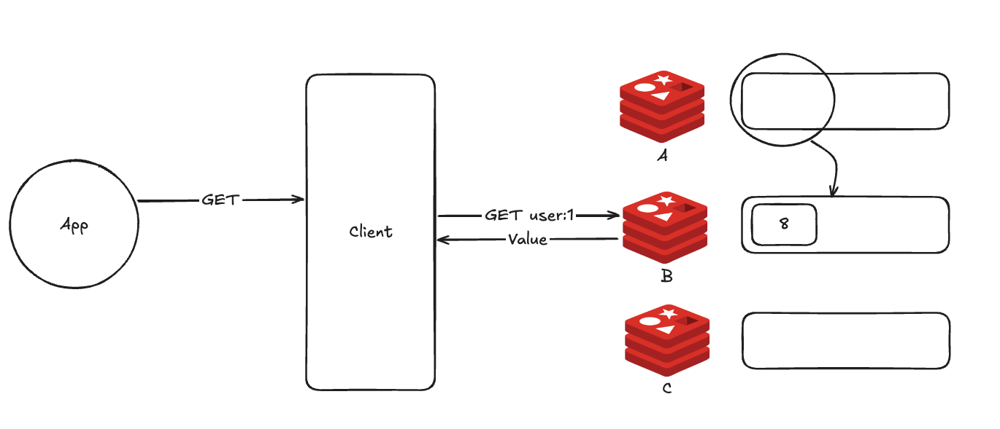

# 10장 클러스터

## 레디스 클러스터와 확장성

### 스케일 업 vs 스케일 아웃

- `확장성 scalability`은 운영 중인 시스템에서 증가하는 트래픽에 유연하게 대응할 수 있는 능력을 말한다.
- `스케일 업 scale up`: 하드웨어 사양 높이기 = `수직 확장 vertical scaling`
- `스케일 아웃 scale out`: 장비 추가하기 = `수평 확장 horizontal scaling`

### 레디스에서의 확장성

- 운영 중 키의 `eviction`이 자주 발생한다면 서버의 메모리를 증가시키는 스케일 업을 고려할 수 있다.
  - 키의 `eviction`은 레디스 인스턴스의 `maxmemory`만큼 데이터가 차 있을 때 또다시 데이터를 저장할 때 발생하는 것이므로, 서버의 메모리를 늘리고 레디스의 `maxmemory` 값을 증가시키는 스케일 업이 필요
- 하지만 레디스의 처리량을 증가시키고 싶다면? 스케일 업만으로는 한계가 있다.
  - 레디스는 단일 스레드로 동작하기 때문에 서버에 CPU를 추가해도 여러 CPU 코어를 동시에 활용할 수 없다.
  - 그러나 데이터를 여러 서버로 분할해 관리하면 다수의 서버에서 요청을 병렬로 처리할 수 있으므로, 서버 대수를 늘림으로써 처리량을 선형적으로 확장시킬 수 있다.

### 레디스 클러스터의 기능

- 레디스를 클러스터 모드로 사용하면 추가적인 애플리케이션 아키텍처의 변경 없이 여러 레디스 인스턴스 간 수평 확장이 가능해지며, 데이터의 분산 처리와 복제, 자동 페일오버 기능 또한 사용할 수 있다.

#### 데이터 샤딩

- 데이터 저장소를 수평 확장하며 여러 서버 간에 데이터를 분할하는 데이터베이스 아키텍처 패턴을 샤딩이라 한다.


- 레디스에서 클러스터 기능을 사용하면 마스터를 최대 1,000개까지 확장시킬 수 있다.
  - 데이터의 샤딩과 관련된 모든 기능은 레디스 내부에서 자체적으로 관리되며, 이를 위한 프록시 서버 등의 추가 아키텍처는 필요치 않다.
- 클러스터의 모든 노드는 키가 저장돼야 할 노드를 알고 있기 때문에 클라이언트가 다른 노드에 데이터를 쓰거나 읽으려 할 때 키가 할당된 마스터 노드로 연결을 리디렉션한다.
- 클러스터에서 노드가 추가/변경되지 않는 이상 하나의 키는 특정 마스터에 매핑된다.
  - 매번 레디스에 키를 저장할 노드를 질의하지 않게 하기 위해 클라이언트에서는 클러스터 내에서 특정 키가 어떤 마스터에 저장돼 있는지의 정보를 캐싱할 수 있다.
  - 이를 이용해 키를 찾아오는 시간을 단축

#### 고가용성

- 클러스터는 각각 최소 3대의 마스터, 복제본 노드를 갖도록 구성하는 것이 일반적.
  - 하나의 클러스터 구성에 속한 각 노드는 서로를 모니터링.
  - 마스터 노드에 장애 발생 -> 연결된 복제본 노드를 마스터로 자동 페일오버시키기 때문에 사용자의 추가적인 개입 없이 레디스의 가용성을 증가
- `클러스터 버스`: 클러스터 내에서 노드들이 통신할 수 있는 독립적인 공간.
  - 모든 레디스 클러스터 노드는 TCP 포트가 열려 있다.
  - 클라이언트로부터 커맨드를 받는 TCP 포트와 독립되게 동작. 구성 파일에서 `cluster_bus_port` 값을 정의하지 않는다면 일반적으로 일반 포트에 10,000을 더한 값으로 자동 설정
  - ex) 레디스 노드 포트가 6379 포트일 때, 클러스터 버스 포트는 16379 포트를 이용해 통신
- 모든 노드가 TCP 연결을 사용해 다른 모든 노드와 연결돼 있는 `풀 메쉬 full-mesh` 토폴로지 형태다.
  - 클러스터가 N개의 노드로 이뤄져 있을 때, 모든 노드는 N-1개의 다른 노드와 송수신 TCP 연결을 하고 있으며, 이 연결은 계속 유지된다.
  - 1개 노드에서 다른 노드로 `PING`을 보냈을 때, `PONG` 응답이 늦는다면 해당 노드로의 연결을 새로 시도한다.

---

## 레디스 클러스터 동작 방법

### 해시슬롯을 이용한 데이터 샤딩

- 클러스터 구조에서 모든 데이터는 해시슬롯에 저장된다.
- 레디스는 총 16,384개의 해시슬롯을 가지며, 마스터 노드는 해시슬롯을 나눠 갖고 있다.
  - 3대의 마스터 노드로 클러스터를 구성하면 해시슬롯은 아래와 같이 분배된다.


- 레디스에 입력되는 모든 키는 하나의 해시슬롯에 매핑. 해시함수는 다음과 같다.

```
HASH_SLOT = CRC16(key) mod 16384
```

- 키를 CRC16으로 먼저 한 번 암호화한 다음 16384라는 값으로 나눈 나머지 값을 이요해 해시슬롯이 결정된다.
  - 데이터를 저장할 때뿐만 아니라 데이터를 읽어올 때도 위의 함수를 이용해 커맨드를 처리할 적절한 마스터 노드를 찾아간다.


- 해시슬롯은 마스터 노드 내에서 자유롭게 옮겨질 수 있으며, 옮겨지는 중에도 데이터는 정상적으로 접근할 수 있다.
- 이러한 특성으로 인해 하나의 클러스터 내에서 마스터 노드의 추가, 삭제는 굉장히 간단하게 처리될 수 있다.


- 신규 레디스 노드를 마스터로 추가한 뒤 기존 노드가 가지고 있던 해시슬롯의 일부를 신규 마스터로 이동시켜주면 된다.
- 만약 노드를 삭제한다고 하면 이 또한 쉬운데, 삭제할 노드가 갖고 있는 해시슬롯을 전부 다른 마스터로 이동시킨 다음 노드를 클러스터에서 제외시키면 된다.

### 해시태그

- 클러스터를 사용할 때는 다중 키 커맨드를 사용할 수 없다.
  - ex) `MGET`과 같이 한 번에 여러 키에 접근해 데이터를 가져오는 커맨드
- 정확히 말하면, 서로 다른 해시슬롯에 속한 키에 대해 다중 키 커맨드를 사용할 수 없다.


- 이때 해시태크라는 기능을 사용하면 이런 문제를 해결할 수 있다.
  - 클러스터에서 데이터는 앞서 설명한 알고리즘을 이용해 키를 해시하기 때문에 키는 랜덤으로 해시슬롯에 배정된다.
  - 하지만 키에 중괄호를 사용하면 전체 키가 아닌 대괄호 사이에 있는 값을 이용해 해시될 수 있다. 이를 해시태그라 한다.

```shell
user:{123}:profile
user:{123}:account
```

- 위의 두 키는 중괄호 사이에 123이라는 동일한 값을 가지고 있기 때문에 같은 해시슬롯, 즉 같은 마스터에 저장된다는 것이 보장된다.
  - 만약 중괄호 사이에 아무런 문자열이 없다면 다른 키들과 동일하게 전체 키의 문자열로 해싱되며, 여러 개의 `{}` 문자가 포함된 키의 경우 가장 처음의 `{`부터 가장 처음의 `}` 사이의 값들이 해싱된다.
- 따라서 다중 키 커맨드를 사용하고 싶다면 아래처럼 태그 기능을 사용하자.

```redis
MGET {user}1:name {user}2:name
```

- 하지만 너무 많은 키가 같은 해시태그를 갖고 있다면 하나의 해시슬롯에 데이터가 몰리는 현상이 발생할 수 있기 때문에 키의 분배에 대한 모니터링이 필요할 수 있다.

### 자동 재구성

- 클러스터 구조는 센티널과 다르게, 일반 레디스 노드가 서로를 감시한다.
- 레디스 클러스터를 사용할 때 발생하는 재구성은 총 두 가지다.
1. 마스터 노드에 장애가 발생했을 대 복제본 노드를 마스터로 승격시키는 자동 페일오버
2. 잉여 복제본 노드를 다른 마스터에 연결시키는 복제본 마이그레이션

#### 자동 페일오버

- 센티널과 마찬가지로 과반수 이상의 마스터 노드에서 투표를 받아야 한다.
- 만약 복제본이 마스터로 승격된 상태에서 도 장애가 발생하면 어떻게 될까?

```redis
cluster-require-full-coverage yes
```

- 위와 같이 기본값으로 설정되어 있다면, 레디스 클러스터에서 일부 해시슬롯을 사용하지 못하게 된다.
- 데이터 정합성을 위해 클러스터 전체 상태가 fail이 되어 전체 해시슬롯 조작에 실패하게 된다.
- 만약 가용성이 중요하고, 노드의 다운타임을 줄이려면 `자동 복제본 마이그레이션`이 가능하도록 아무 마스터 노드에 복제본을 하나 추가하는 것을 고려하자!

#### 자동 복제본 마이그레이션

- 복제본이 마스터로 승격되면 복제본 노드의 불균형이 발생할 수 있다.
- 클러스터는 이를 파악해 복제본의 불균형을 해소해준다.
  - ex) 복제본이 하나도 없는 마스터 노드 A가 있다면 복제본을 2개 이상 가지고 있는 노드 B의 복제본을 A로 이동시킨다. 
  - 이를 `복제본 마이그레이션 replica migration`이라 한다.

```redis
cluster-allow-replica-migration yes
cluster-migration-barrier 1
```

- `cluster-allow-replica-migration` 옵션이 `yes`일 때 동작하며, 기본값은 `yes`다.
- `cluster-migration-barrier`는 복제본을 마이그레이션하기 전 마스터가 가지고 있어야 할 최소 복제본의 수를 의미한다.

---

## 레디스 클러스터로 실행하기

- 최소 3개의 마스터 노드, 그리고 각각에 붙어있는 최소 3개의 복제본 노드. 총 6개의 노드로 클러스터를 구성하는 것이 일반적
- `redis.conf`에서 아래의 설정을 추가

```
cluster-enabled yes
```

- 그 다음 각기 다른 서버 6대에 레디스를 실행하고, 클러스터를 생성

```shell
$ redis-cli --cluster create [host:port] --cluster-replicas 1
```

- `--cluster-replicas 1` 옵션은 각 마스터마다 1개의 복제본을 추가할 것임을 의미한다.

### 클러스터 상태 확인하기

- `CLUSTER NODES` 커맨드를 이용해 현재 클러스터 상태 확인

```shell
$ redis-cli cluster nodes
```

- 위 명령어를 실행하면 아래 순서대로 정보를 보여준다.

```shell
{id} {ip:port@cport} {flags} {master} {ping-sent} {pong-recv} {config-epoch} {link-state} {slot} ... {slot} 
```

| 필드명             | 설명                                                                                                                                                                                                                                                                                                                                                    |
|:----------------|:------------------------------------------------------------------------------------------------------------------------------------------------------------------------------------------------------------------------------------------------------------------------------------------------------------------------------------------------------|
| `id`            | 노드가 실행될 때 자동으로 만들어지는 랜덤 문자열인 클러스터 ID 값. 한 번 설정되면 바뀌지 않는다.                                                                                                                                                                                                                                                                                             |
| `ip:port@cport` | 노드가 실행되는 ip와 port 그리고 클러스터 버스 포트. 클러스터 버스 포트는 보통 port에 10,000을 더한 값.                                                                                                                                                                                                                                                                                  | 
| `flags`         | 노드의 상태. 다음과 같은 상태 값이 플래그로 표시 <br/>- `msyself`: redis-cli를 이용해 접근한 노드<br/>-`master`: 마스터 노드<br/>- `slave`: 복제본 노드<br/>- `fail?`: 노드가 `PFAIL` 상태임을 의미(노드가 정상접근을 할 수 없다는 것을 확인해 다른 노드에 확인을 하기 시작하는 상태)<br/>- `handshake`: 새로운 노드를 인지하고 핸드셰이킹을 하는 단계<br/>- `nofilover`: 복제본 노드가 페일오버를 시도하지 않을 것을 의미<br/>- `noaddr`: 해당 노드의 주소를 모른다는 것을 의미<br/>- `noflags` |
| `master`        | 복제본 노드일 경우 마스터 노드의 ID / 마스터 노드일 경우 `-`                                                                                                                                                                                                                                                                                                                |
| `ping-sent`     | 보류 중인 PING이 없다면 0, 있다면 마지막 PING이 전송된 유닉스 타임 표시                                                                                                                                                                                                                                                                                                        |
| `pong-recv`     | 마지막 PONG이 수신된 유닉스 타임 표시                                                                                                                                                                                                                                                                                                                               |
| `config-epoch`  | 현재 노드의 에포크, 페일오버가 발생할 때마다 에포크는 증가하며, 구성 충돌이 있을 때 에포크가 높은 노드의 구성으로 변경                                                                                                                                                                                                                                                                                  |
| `link-state`    | 클러스터 버스에 사용되는 링크의 상태를 의미 (connected/disconnected)                                                                                                                                                                                                                                                                                                     |
| `slot`          | 노드가 갖고 있는 해시슬롯의 범위를 표시                                                                                                                                                                                                                                                                                                                                |

### redis-cli를 이용해 클러스터 접근하기와 리디렉션

- 아래처럼 그냥 `redis-cli`로 접속하고, `SET` 명령어를 던졌을 때 슬롯에 맞지 않으면 에러가 발생한다.

```shell
$ redis-cli
127.0.0.1:6379> SET user:1 true
(error) MOVED 10778 192.168.0.22:6379
```

- 이럴 땐 `-c` 옵션을 이용해 접근해야 한다.

```shell
$ redis-cli -c
127.0.0.1:6379> SET user:1 true
-> Redirected to slog [10778] located at 192.168.0.22:6379
OK
192.168.0.22:6379>
```

- `MOVED`라는 응답을 받은 클라이언트는 반환받은 에러를 바로 사용자에게 전달하지 않고, 변경된 노드로 직접 연결을 변경한 뒤 올바른 레디스 노드에서 커맨드를 다시 수행한다.
- 대부분의 레디스 클라이언트는 이렇게 리디렉션한 정보를 캐싱해 맵을 생성하게 되는데, 다음번 같은 키에 대해 커맨드를 수행해야 할 경우 이번과 같이 에러를 반환해서 커넥션을 옮겨가는 과정을 거치지 않고, 캐싱된 노드로 바로 커맨드를 보낼 수 있게 해 클러스터의 성능을 향상시킬 수 있게 된다.
- 클러스터에 저장된 맵은 마스터 노드가 추가/삭제되거나, 페일오버가 발생하는 등 클러스터의 구조가 변경되면 리프레시된다.

### 페일오버 테스트

- 클러스터를 구성하는 작업을 완료했다면, 센티널과 마찬가지로 정상적으로 페일오버가 동작하는지 확인하는 작업을 거치는 것이 좋다.

---

## 레디스 클러스터 운영하기

### 클러스터 리샤딩

- 마스터 노드가 가지고 있는 해시슬롯 중 일부를 다른 마스터로 이동하는 것을 리샤딩이라고 함.
  - `redis-cli`에서 `cluster reshard` 옵션을 사용
- 클러스터가 속한 여러 노드 중 하나의 노드를 지정 -> 해당 노드가 속한 클러스터 구조를 파악한 뒤 연결된 다른 노드의 정보를 찾아와 다음과 같이 보여줌.

1. 이동시킬 슬롯의 개수를 지정.

```shell
How many slots do you want to move (from 1 to 16384)? 100
```

2. 이제 해시슬롯을 받은 노드의 ID를 입력한다.

```shell
What is the receiving node ID? aaaaaaaaaaa
```

3. 이제 해시슬롯을 이동시킬 노드의 ID를 묻는 메시지가 표시된다. 
   - `all` 입력: 모든 마스터 노드에서 조금씩 이동할 것을 의미.
   - 노드를 하나씩 지정하고 `done` 입력: 해시슬롯을 가져올 마스터 ID를 직접 지정

```shell
Please enter all the source node IDs.
  Type 'all' to use all the nodes as source nodes for the hash slots.
  Type 'done' once you entered all the source nodes IDs.
Source node #1: all
```

4. 해시슬롯을 이동시킬 노드의 입력이 끝나면, 리샤딩이 진행될 소스와 데스티네이션의 마스터 노드 정보를 확인할 수 있으며 리샤딩 플랜이 보여진다. `yes`를 입력할 경우 리샤딩 작업이 진행된다.

```shell
Do you want to proceed with the proposed reshard plan (yes/no)? yes
```

5. 모든 작업이 끝나면 `--cluster check` 옵션을 통해 클러스터 정보를 자세히 확인할 수 있다.

```shell
$ redis-cli --cluster check <ip> <port>
```

### 리샤딩 - 간단한 버전

- 아래 명령어를 실행하면 된다. 대신 커맨드를 실행하자마자 옮겨지기 때문에 중간에 취소와 확인이 어렵다.

```shell
$ redis-cli --cluster reshard <ip>:<port> --cluster-from <node-id> --cluster-to <node-id> --cluster-slots <number of slots> --cluster-yse
``` 

### 클러스터 확장

1. 새로운 마스터 추가
2. 가용성을 위한 복제본 추가

- redis 설정인 `cluster-enalbed`에 `yes`를 추가해 클러스터 노드로 실행된 상태여야 한다.

#### 마스터 추가

- 기존 클러스터에 속한 노드 중 1개의 노드를 지정해야 한다.

```shell
$ redis-cli --cluster add-node <추가할 노드 ip:port> <기존 노드 ip:port>
```

- 작업이 완료됐다면 아래 명령어로 노드가 잘 구성됐는지 확인

```shell
$ redis-cli cluster nodes
```

#### 복제본 추가

```shell
$ redis-cli --cluster add-node <추가할 노드 ip:port> <기존 노드 ip:port> --cluster-slave [--cluster-master-id <기존 마스터 ID>]
```

- `[--cluster-master-id <기존 마스터 ID>]`가 없으면 임의의 마스터의 복제본으로 연결된다.

#### 노드 제거하기

```shell
$ redis-cli --cluster del-node <기존 노드 ip:port> <삭제할 노드 ID>
```

- 마스터 노드의 경우 제거하기 전에 리샤딩을 모두 완료한 후에 진행해야 한다.
- 혹은 수동으로 페일오버를 진행한 뒤 노드의 역할을 복제본으로 만들어 클러스터에서 제거할 수도 있다.
- 노드를 제거하면 아래의 과정이 수행되게 된다.

```shell
>>> Sending CLUSTER FORGET messages to the cluster...
>>> Sending CLUSTER RESET SOFT to the deleted node.
```

#### CLUSTER FORGET

- 클러스터를 제거하기 위해서는 제거될 노드에서 클러스터 구성 데이터를 지우는 것뿐만 아니라, 클러스터 내의 다른 노드들에게도 해당 노드를 지우라는 커맨드를 함께 보내야 한다.
  - 그렇지 않으면 클러스터 내부의 다른 노드는 여전히 해당 노드의 ID와 주소를 기억하고 있게 된다.
- `CLUSTER FORGET <node-id>` 커맨드를 수신한 노드는 노드 테이블에서 제거할 노드의 정보를 지운 뒤, 60초 동안은 이 노드 ID를 가지고 있는 노드와 신규로 연결되지 않도록 설정한다.

#### CLUSTER RESET SOFT

- 클러스터 리셋 커맨드는 제거될 노드에서 수행된다.
- 리셋에는 두 가지 옵션이 존재하며, 옵션을 지정하지 않으면 기본값은 SOFT다.
- 리셋은 아래 과정으로 진행된다.

1. 클러스터 구성에서 복제본 역할을 했었다면 노드는 마스터로 전환되고, 노드가 가지고 있던 모든 데이터셋은 삭제된다. 노드가 마스터이고 저장된 키가 있다면 리셋 작업이 중단된다.
2. 노드가 해시슬롯을 가지고 있었다면 모든 슬롯이 해제되며, 만약 페일오버가 진행되는 과정이었다면 페일오버에 대한 진행 상태도 초기화된다.
3. 클러스터 구성 내의 다른 노드 데이터가 초기화된다. 기존에 클러스터 버스를 통해 연결됐던 노드를 더 이상 인식할 수 없다.
4. `currentEpoch`, `configEpoch`, `lastVoteEpoch` 값이 0으로 초기화된다.
5. 노드의 ID가 새로운 임의 ID로 변경된다.

### 레디스 클러스터로의 데이터 마이그레이션

- 기존에 싱글 혹은 센티널 구성으로 사용하고 있던 레디스 인스턴스를 가용성과 확장성을 위해 클러스터 구성의 레디스로 마이그레이션하고 싶을 수 있다.
  - 레디스 커맨드라인 클라이언트를 이용해 손쉽게 데이터의 마이그레이션이 가능하다.
  - 만약 다중 키 조회를 사용하고 있었다면 해시태그를 사용하도록 애플리케이션 로직을 일부 수정해야 한다.
- 데이터를 전달받을 클러스터 노드에서 소스 레디스 노드로 데이터 import 요청을 한다.
  - 데이터가 저장될 클러스터 노드는 해시슬롯 16,384개가 정상적으로 할당된 정상 상태여야 하며, 클러스터 내의 마스터 노드에 모두 접근 가능한 상태로 준비돼 있어야 한다.
  - 데이터의 소스 노드 또한 접근이 가능한 온라인 상태여야 하며, 클라이언트와 소스 레디스 노드 간 네트워크 통신이 되는지 미리 확인하는 것이 좋다.
- 운영 중인 레디스의 데이터를 마이그레이션할 때에는 소스 레디스에 연결된 클라이언트를 모두 중단시키는 것이 좋다.
  - 마이그레이션 되는 클러스터에 변경 사항이 반영되지 않아 문제가 될 수 있다.
  - 경우에 따라 서비스에 점검을 건 상태에서 진행해야 할 수도 있다.
- 아래 커맨드를 이용하면 데이터를 마이그레이션할 수 있다.

```shell
$ redis-cli --cluster import <클러스터 노드 중 하나의 마스터 노드 ip:port> --cluster-from <소스 노드 ip:port> --cluster-copy
```

### 복제본을 이용한 읽기 성능 향상

- 쓰는 커넥션은 마스터에, 읽기는 복제본에서 수행할 수 있도록 커넥션을 분배시켜 읽기 성능을 향상.

---

## 레디스 클러스터 동작 방법

### 하트비트 패킷

- 레디스 클러스터 노드들은 지속적으로 서로의 상태를 확인하기 위해 PING, PONG 패킷을 주고 받는다.
- 이 두 패킷을 묶어서 `하트비트 Heartbeat` 패킷이라 하며, 일반적으로 클러스터가 주고받는 유형의 패킷에 가십 섹션이 추가된 형태를 띈다.


- 일반적으로 사용하는 패킷의 헤더는 다음 정보를 포함하고 있다.

1. 노드 ID
2. 현재 에포크/구성 에포크: 분산 환경에서 일관성을 유지하기 위한 정보
3. 노드 플래그: 노드가 마스터인지 혹은 복제본인지 등의 노드 정보
4. 비트맵: 마스터가 제공하는 해시슬롯의 비트맵 정보. 복제본인 경우 마스터의 정보
5. TCP 포트: 발신 노드의 TCP 포트
6. 발신 노드의 노드 간 커뮤니케이션을 위한 포트
7. 발신 노드 관점에서 봤을 때의 클러스터 상태 (down/ok)
8. 마스터 노드ID: 복제본 노드인 경우 마스터의 노드 ID

- 하트비트 패킷의 경우 위의 헤더에 가십 섹션을 추가로 포함하고 있다.
  - 이 섹션은 패킷을 발신하는 노드가 일고 있는 클러스터 내의 다른 노드 정보를 나타낸다.
  - 발신자 노드는 자신이 알고 있는 노드 중 랜덤한 몇 개의 노드만 가십 섹션에 포함한다.
  - 하트비트 패킷을 받은 클러스터 노드는 다른 노드에 대한 정보를 얻을 수 있다.
- 정합서을 유지하기 위해 센티널과 비슷하게 `epoch`를 사용한다.
  - 결국 모든 노드는 클러스터에서 가장 큰 구성 에포크 값으로 통일된다.
  - 이 값은 클러스터 상태를 변경할 때와 페일오버가 발생할 때 동의를 구하기 위해 사용된다.

### 해시슬롯 구성이 전파되는 방법

- 클러스터에서 가장 중요한 기능 중 하나는 커맨에서 사용한 키의 해시슬롯이 어디에 있는지 파악해 정확한 해시슬롯의 위치를 알려주는 것이다.
  - 클러스터에서 해시슬롯의 구성은 두 가지 방법으로 전파된다.

1. 하트비트 패킷: 마스터 노드가 PING, PONG의 패킷을 보낼 때 항상 자기가 갖고 있는 해시슬롯을 패킷 데이터에 추가
2. 업데이트 메시지: 하트비트 패킷에는 발신하는 노드의 구성 에포크 값이 포함돼 있으며, 패킷을 보낸 노드의 에포크 값이 오래됐다면 해당 패킷을 받은 노드는 신규 에포크의 구성 정보를 포함한 업데이트 메시지를 노드에 보내 하트비티 패킷을 보낸 노드의 해시슬롯 구성을 업데이트

- 클러스트어 시작됐을 때 우선 모든 노드의 해시슬롯은 NULL로 초기화된다.
  - 위의 2가지 방법을 이용해 특정 해시슬롯을 가지고 있다는 노드의 메시지를 받으면 그때 자기 자신의 해시슬롯 구성 정보를 업데이트한다.

```
0 -> NULL
1 -> NULL
...
16383 -> NULL
```

- 만약 노드 A가 해시 슬롯 1과 2를 갖고 있다는 주장하는 패킷을 수신.
  - 이때 패킷의 구성 에포크가 3이었다면, 값을 수신한 해시슬롯 테이블은 아래와 같이 변경된다.

```
0 -> NULL
1 -> A [3]
2 -> A [3]
...
16383 -> NULL
```

- 페일오버가 발생한 뒤 현재의 구성 에포크인 3보다 더 큰 4라는 구성 에포크를 가진 패킷을 수신했다고 해보자.
  - 해당 패킷에서 노드 B가 해시슬롯 1, 2를 갖고 있다고 주장하고 있다면 하트비트 패킷을 수신한 해시슬롯 테이블을 다음과 같이 업데이트한다.

```
0 -> NULL
1 -> B [4]
2 -> B [4]
...
16383 -> NULL
```

- 해시슬롯 구성의 변경은 페일오버와 리샤딩 중에만 발생한다.
  - 두 작업 모두 에포크가 증가하는 작업이기 때문에 작업 이후 변경 사항은 클러스터 전체에 전파된다.

### 노드 핸드셰이크

- 한 노드가 클러스터에 합류하기 위해서는 `CLUSTER MEET` 커맨드를 다른 노드에 보낸다.
  - 해당 커맨드를 수신한 노드는 자신이 알고 있는 다른 노드들에게 전파하고, 이 정보를 수신한 노드가 신규 합류한 노드를 모르는 상태라면 해당 노드와 `CLUSTER MEET`를 통해 신규 연결을 맺게 된다.
  - 만약 해당 노드를 이미 알고 있었다면 해당 커맨드는 무시한다. 이와 같은 방식으로 클러스터 내부의 모든 노드들은 `풀 메쉬 full-mesh` 연결을 하게 된다.

### 클러스터 라이브 재구성

1. 클러스터에 새로운 노드를 추가하려면 빈 노드를 클러스터에 추가한 뒤, 일부 해시슬롯을 기존 마스터엣 신규 노드로 옮긴다.
2. 클러스터에서 노드를 제거하려면 해당 노드를 빈 노드로 만들기 위해, 갖고 있던 해시슬롯을 다른 노드로 보낸다.

- 두 작업 모두 결국 하나의 노드 내에서 해시슬롯을 다른 노드로 옮기는 작업이 동반된다.
  - 사실 해시슬롯 또한 결국 논리적인 키의 집합이기 때문에 레디스 클러스터가 실제로 하는 일은 하나의 마스터 노드에서 다른 마스터 노드로 데이터를 옮기는 것을 의미한다.
- A가 갖고 있던 해시슬롯 8을 B로 옮기고 싶다면 각 노드에서 다음과 같은 커맨드가 수행된다.
  - A에게: `CLUSTER SETSLOT 8 MIGRATING B`
  - B에게: `CLUSTER SETSLOT 8 IMPORTING A`
- 만약 위 커맨드가 실행 중인 상태에서 노드 A가 해시슬롯 8에 대한 쿼리를 받았을 때 만약 기존에 존재하던 키를 읽는 쿼리라면 A에서 수행한다.
  - 반대로 해시슬롯 8에 새로운 키를 생성하는 쿼리를 받았다면, 이 쿼리는 노드 B로 리디렉션한다. 더 이상 노드 A에서 새로운 키를 만들지 않는다.
- 그리고 아래 커맨드를 사용해 해시슬롯 8에 속한 키를 A에서 B로 마이그레이션한다.

```redis
> CLUSTER GETKEYINSLOT <slot> <count>
```

- 지정한 해시슬롯이 가지고 있는 키를 반환하며, 반환된 모든 키에 대해 노드 A에 `MIGRATE` 커맨드를 전송한다.
- 다음 커맨드는 키를 원자적으로 A에서 B로 마이그레이션한다.
  - 2개의 인스턴스 모두 키를 마이그레이션하는 동안 락이 걸리며, 이로 인한 경쟁 상황은 발생하지 않는다.

```redis
> MIGRATE target-host target-port key target-database id timeout
```

- 키를 전송하고 OK 코드를 받으면 기존 데이터셋에서 키를 삭제한다.
- 마이그레이션 프로세스가 완료되면 두 노드에게 모두 `SETSLOT <slot> NODE <node-id>` 커맨드를 전송한다.
  - 이 커맨드는 다른 모든 노드로 전파된다.

### 리디렉션

- `MOVED`와 `ASK`
  - `MOVED`: '요청하는 해시슬롯이 저 노드에 있으니 앞으로 이 키에 대한 요청은 저 노드로 보내'
  - `ASK`: '지금 요청한 이 쿼리는 저 노드에서 수행해. 하지만 다음 노드는 다시 나한테 보내'

#### MOVED 리디렉션

- 해시슬롯을 가지고 있다면 원하는 데이터를 반환.
- 하지만 없다면 MOVED 에러로 클라이언트에게 응답
  - 키의 해시슬롯과 해당 해시슬롯을 갖고 있는 마스터 노드의 정보를 반환.
  - 클라이언트는 반환받은 노드의 IP와 포트로 다시 커맨드를 수행해 데이터를 조회
- 이때 MOVED 에러를 반환받은 클라이언트는 특정 해시슬롯에 어떤 노드에 존재한다는 것을 기억한다.
  - 효율적인 서비스를 위해.

#### ASK 리디렉션

- 해시슬롯이 이동되는 과정에서만 발생한다. 이 리디렉션을 받으면 client는 아래와 같이 동작한다.

1. 리디렉션 오류가 반환한 노드 정보로 쿼리를 재전송하지만, 이후에 같은 키에 대한 쿼리가 들어오면 기존에 전송한 노드에 다시 보낸다.
2. 리디렉션을 받은 값으로 클라이언트의 해시슬롯 맵을 업데이트하지 않는다.


- 마이그레이션이 완료되었다. 
  - `ASK`를 받은 클라이언트는 다음 요청을 다시 B에게 보내고, 값을 받는다!
  - ASK 리디렉션은 단 한 번만 전환하는 특성이 있기 때문이다.



- 만약 마이그레이션이 완료된 뒤, 다른 클라이언트가 노드 A에 대해 커맨드를 수행하면 `MOVED` 리디렉션을 이용한다.


### 장애 감지와 페일오버

#### PFAIL 플래그

- Possible Fail. 일부 노드에서는 해당 노드에 접근할 수 없지만, 아직 확실하진 않은 실패임을 의미.
- 특정 노드에 `NODE_TIMEOUT` 시간 이상 도달할 수 없을 경우 `PFAIL` 플래그로 표시한다.

#### FAIL 플래그

- 실제로 마스터 노드에 장애가 발생했다고 인지해서 페일오버를 트리거시키기 위해서는 노드가 `PFAIL`이 아닌 `FAIL` 상태여야 한다.
- 만약 노드 A가 노드 B를 `PFAIL` 상태로 플래깅했다면 이후 클러스터 내의 다른 노드가 보낸 하트비트 패킷에서 B의 상태에 대한 정보를 듣는다.
  - 이때 일정 시간 냉에 다른 노드에서 B에 대한 `PFAIL` 또는 `FAIL` 알림을 받으면 이 노드를 `FAIL`이라 플래깅한다.

### 복제본 선출

- 다음과 같은 조건에서 복제본은 페일오버를 직접 시도한다.

1. 마스터가 `FAIL` 상태
2. 마스터는 1개 이상의 해시슬롯을 갖고 있다.
3. 마스터와의 복제가 끊어진 지 오래. (파라미터로 조절된 값)

- 위 조건을 만족할 때, 복제본은 마스터로 선출되기 위해 자신의 현재 에포크 값을 1 증가시키고, 마스터 인스턴스에 투표를 요청한다.
- 복제본은 `FAILOVER_AUTH_REQUEST` 패킷을 보내 투표를 요청한다.
  - 요청을 받은 마스터는 `FAILOVER_AUTH_ACK` 패킷으로 긍정적인 응답을 보내 투표에 동의함을 알린다.
  - 이때 마스터는 동시에 다른 복제본을 승격시키는 것을 방지하기 위해 `NODE_TIME` * 2의 시간 동안 같은 마스터로 승격되고자 하는 다른 복제본에게는 투표할 수 없다.
- 응답을 받은 복제본은 현재 에포크 값보다 작은 에포크로 온 `AUTH_ACK`에 대한 응답은 무시하기 때문에 이전 버전의 투표에 대한 응답은 거를 수 있다.
- 다수의 마스터로부터 `ACK`를 받은 복제본이 마스터 후보로 선출된다.
  - `NODE_TIME` * 2의 시간 동안 과반수 이상의 마스터에게 `ACK`가 오지 않으면 페일오버는 중단된다.
  - 이후 `NODE_TIME` * 4만큼 지연 후에 다시 새로운 투표를 시도할 수 있다.
- 마스터가 `FAIL` 상태가 된 이후 복제본은 다음과 같이 계산된 짧은 딜레이를 가진 뒤 투표를 시작한다.

```
DELAY = 500ms + 랜덤 지연 시간(0~500ms) + SLAVE_RANK * 1000ms
```

- 마스터에 연결된 여러 복제본에서 동시에 투표를 시작하는 것을 방지하기 위함이다.
- `SLAVE RANK`는 마스터에서 처리한 복제 데이터의 양과 관련된 복제본으 우선순위이다.
  - 마스터가 `FAIL` 상태가 되면 복제본끼리 메시지를 교환하는데, 가장 최근의 오프셋을 가진 복제본이 0순위, 두 번째는 1순위와 같은 방식으로 우선순위를 부여한다.

---

# 참고자료

- 개발자를 위한 레디스, 김가람 지음

