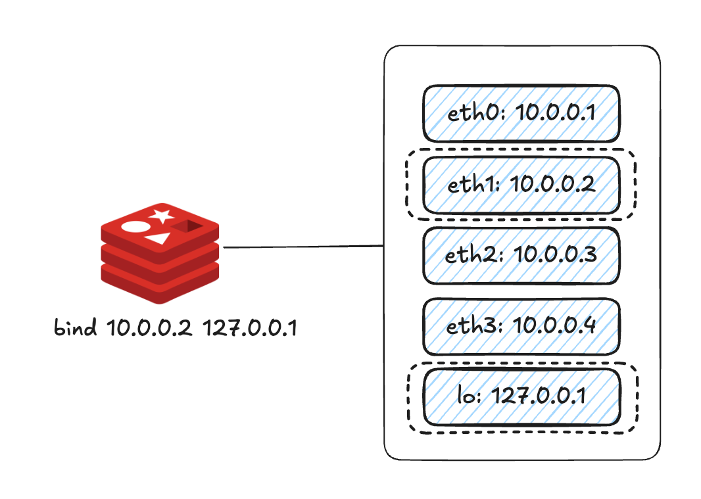

# 11장 보안

- 버전 6부터 ACL 기능을 사용하면 유저를 생성한 뒤 각 유저별로 다른 패스워드를 설정할 수 있으며, 이를 통해 유저 간에 패스워드를 개별적으로 관리하고 다른 권한을 할당할 수 있게 됐다.

---

## 커넥션 제어

### bind 

- 레디스 인스턴스가 실행 중인 서버는 여러 개의 네트워크 인터페이스를 가질 수 있다.
- `bind` 설정은 레디스가 서버의 여러 ip 중 어떤 ip를 통해 연결을 받아들일 것인지 지정한다.



- 레디스가 실행된 서버는 `eth0~3`, `localhost`까지 총 5개의 네트워크 인터페이스를 가지고 있다.
  - 이때 `eth1`, `localhost` 인터페이스를 사용해 들어오는 연결만 허용하기 위해 bind 설정에 해당하는 인터페이스 ip 주소만을 지정할 수 있다.
- `bind`의 기본 설정값은 `127.0.0.1`이며, 이는 서버에 대한 루프백(로컬) IP 주소를 나타낸다.
  - 기본값을 변경하지 않으면 레디스는 오직 동일한 서버 내에서의 연결만을 허용한다.
  - 레디스가 설치된 서버 외부에서 직접 레디스에 접근해야 하는 경우, 이 값을 서버를 바라보는 다른 유효한 IP 주소로 변경해야 한다.
- 레디스를 실행하는 서버 외부에서 연결이 필요한 경우, `bind` 설정값을 `127.0.0.1`이 아닌 다른 IP 주소로 명시적으로 설정해야 한다. 
  - `bind` 설정값 자체를 주석 처리하거나 `0.0.0.0` 또는 `*`로 설정하는 경우, 레디스는 서버가 가지고 있는 IP주소로 들어오는 모든 연결을 허용하는 방식으로 동작한다.

### 패스워드

1. 노드에 직접 패스워드 지정
2. 버전 6.0에서 새롭게 추가된 `ACL (Access Control List)` 기능을 사용

- 이전 버전에서는 `requirepass`를 사용해 레디스 서버에 하나의 패스워드를 설정할 수 있었지만, 버전 6부터는 ACL을 사용한 패스워드 설정이 권장된다.
  - 하지만 기존 방식도 여전히 사용할 수 있다.

```redis
127.0.0.1:6379> CONFIG SET requirepass password
OK
```

- 패스워드는 `redis.conf`에서 지정한 뒤 실행시킬 수도 있다.
- 또한 아래 커맨드를 통해 변경하는 것도 가능하다.
- `-a` 옵션을 이용해 패스워드를 직접 지정.

```shell
$ redis-cli -a password
```

- `-a` 옵션을 사용하지 않고 접속한 뒤 `AUTH` 커맨드를 이용해 패스워드 입력

```shell
$redis-cli
127.0.0.1:6379> AUTH password
```

- 패스워드가 설정돼 있는 인스턴스에 접속한 뒤 인증을 하지 않으면 아무런 커맨드를 사용할 수 없다.
  - `AUTH` 커맨드를 사용해 패스워드를 입력해야 다른 커맨드를 사용할 수 있다.

### Protected mode

- 운영 용도로 사용할 때 설정 권장
- `protected mode`를 `yes`로 설정
- 인스턴스에 패스워드를 설정하지 않으면, 레디스는 127.0.0.1 IP를 이용해 로컬에서 들어오는 연결만을 허용한다.
  - `bind` 설정을 이용해 다른 네트워크 인터페이스를 이용해 들어온 커넥션을 허용한다고 설정했을 경우에도 마찬가지다.

---

## 커맨드 제어

- `CONFIG GET`과 `CONFIG SET`

### 커맨드 이름의 변경

- `rename-command`는 레디스에서 특정 커맨드를 다른 이름으로 변경하거나, 커맨드를 비활성화할 수 있는 설정.
- 이 설정을 사용하면 레디스의 커맨드를 커스터마이징하거나 보안을 강화하는데 도움이 된다.
- `redis.conf`에서만 변경 가능하며 실행 중에는 동적으로 변경할 수 없다.
  - `CONFIG GET`으로 확인하거나, `CONFIG SET`으로 변경하는 것이 불가능
- 설정 파일에서 아래와 같이 명령어를 수정할 수 있다.

```shell
rename-command CONFIG CONFIG_NEW
```

- 또한 커맨드를 빈문자열로 변경하면 해당 커맨드는 사용할 수 없게 된다.

```shell
rename-command CONFIG ""
```

- 만약 센티널을 사용한다면 한 가지 더 신경쓸 것이 있다.
  - 센티널은 직접 레디스로 `REPLICAOF`, `CONFIG` 등의 커맨드를 사용해 레디스 인스턴스를 제어한다.
  - 만약 `rename-command`를 이용해 레디스에서 커맨드 이름을 변경했다면 장애 상황에서 센티널이 전송하는 커맨드를 레디스가 정상적으로 수행할 수 없어 페일오버가 정상적으로 발생하지 않게 된다.
  - 따라서 `redis.conf`에서 변경한 커맨드는 `sentinel.conf`에서도 변경해야 한다.
- `sentinel.conf`에서 명령어를 바꾸는 방법은 아래와 같다.

```shell
sentinel rename-command mymaster CONFIG CONFIG_NEW
```

### 커맨드 실행 환경 제어

- 버전 7부터 보안 강화를 위해 특정 커맨드를 실행하는 환경을 제어할 수 있게 됐다.
  - 레디스가 실행 중일 때 변경하면 위험할 수 있는 커맨드는 기본적으로 변경할 수 없도록 차단.
  - 사용자는 이러한 커맨드의 변경을 아예 차단 또는 허용하거나, 로컬 연결에서만 변경이 가능할 수 있도록 선택할 수 있다.

```shell
enable-protected-configs no
enable-debug-command no
enable-module-command no
```

- `enable-protected-configs` 설정은 레디스의 기본 경로 설정인 `dir` 및 백업 파일의 경로를 지정하는 `dbfile` 옵션을 `CONFIG` 커맨드로 수정하는 것을 차단
- `enable-debug-command` 설정은 DEBUG 커맨드를 차단
- `enable-module-command`는 `MODULE` 커맨드의 수행을 차단
- 위 세 가지 설정은 아래와 같은 값으로 변경 가능하다.
  - `no`: 차단
  - `yes`: 허용
  - `local`: 로컬 연결에 대해서만 허용
- `DEBUG` 커맨드는 디버깅할 때 사용 => 운영 환경에서 사용 X
- `MODULE` 커맨드 역시 잘 사용 X, 검증되지 않은 모듈을 가져올 수 있어 잠재적으로 위험.

### 레디스를 이용한 해킹 사례

1. telnet 커맨드를 통해 통신 가능 여부 확인
2. SSH 키를 생성해 레디스 서버로의 접근을 가능하게 설정
3. 레디스의 내용을 전체 삭제한 뒤, 방금 생성한 `ssh-keygen`으로 생성한 `key.txt` 파일을 데이터로 삽입
4. 레디스에 직접 접근해 데이터가 저장되는 경로와 파일명 수정

- 생성한 SSH 키를 레디스 서버에 직접 복사하는 대신, 레디스를 이용해서 데이터를 간접적으로 전달함으로써, 생성한 SSH 키를 이용해 레디스 서버에 직접 접근할 수 있게 된다.
- 따라서 보안 강화를 위해 `protected-mode`를 yes로 설정!
  - 그러나 패스워드를 사용하지 않고 레디스를 사용하려는 경우, `enable-protected-configs` 옵션을 `local` 또는`no`로 설정해 외부에서 레디스의 중요한 설정 파일을 변경할 수 없도록 하는 것이 좋다.

---

## ACL

- 버전 6 이전에는 허용되지 않은 클라이언트의 접근을 제어할 수 없었다.
  - `FLUSHALL` 커맨드로 모든 데이터 삭제.
  - `REPLICAOF`를 사용해 복제 설정 변경.
  - `SHUTDOWN` 커맨드로 인스턴스 종료.

### 유저의 생성과 삭제

```redis
> ACL SETUSER bell on >password ~cached:* &* +@all -@dangerous
OK
```

- `password`: 패스워드
- `~`: 접근 가능한 키를 설정 => `cached:*`: `cached:`를 프리픽스로 가진 모든 키
- `&`: 접근 가능한 pub/sub 채널을 의미 => `*`: 모든 채널
- `+`: 실행 가능한 커맨든 => `@all -@dangerous`: 위험한 커맨드를 제외한 모든 권한 부여

- 아래 명령어를 통해 특정 유저를 확인할 수 있다.

```redis
> ACL GETUSER bell
```

- 아래 명령어는 접근할 수 있는 키를 추가하는 예제다.
  - `id:`를 프리픽스로 가지는 키가 추가되었다.

```redis
> ACL SETUSER bell ~id:*
```

- 유저를 삭제할 수도 있다.

```redis
> ACL DELUSER bell
```

- 생성된 모든 유저 확인

```redis
> ACL LIST
```

- 유저를 만든 적이 없다면 기본 유저를 가진다. 기본 유저는 아래 특징을 가진다.
    - 이름: `default`
    - 상태: `on`(활성 상태)
    - 패스워드: `nopass` (패스워드 없음)
    - 접근할 수 있는 키: `~*` (전체 키)
    - 접근할 수 있는 채널: `&*` (모든 채널) 
    - 유저가 접근할 수 있는 커맨드: `+@all` (전체 커맨드)
- ACL 규칙은 항상 왼쪽에서 오른쪽으로 적용되기 때문에 권한을 적용하는 순서가 중요하다.

### 유저 상태 제어

- `on`과 `off`

```redis
> ACL SETUSER bell on
```

- `off`로 변경하면 더 이상 접근할 수 없지만, 이미 접속해 있는 유저의 연결은 여전히 유지

### 패스워드

- `>패스워드` 키워드로 패스워드 지정 가능
  - 패스워드는 1개 이상 지정할 수 있다.
- `<패스워드` 키워드를 사용해 지정한 패스워드 삭제 가능
- 유저에 `nopass` 권한을 부여하면 기존 유저에 설정돼 있던 모든 패스워드도 삭제된다.
- `resetpass` 권한을 부여하면 유저에 저장된 모든 패스워드가 삭제되며, 이때 `nopass` 상태도 사라진다.
  - 다른 패스워드나 `nopass` 권한을 부여하기 전까니느 그 유저에 접근 불가

### 패스워드 저장방식

- `requirepass`를 사용해 인스턴스를 패스워드를 저장하면 암호화 X => 설정 파일에 접근하여 누구나 패스워드 확인 가능
- 하지만 ACL을 사용하면 내부적으로 SHA256 방식으로 암호화. => 패스워드 바로 조회 불가능
- 다른 사용자가 패스워드를 예측할 수 없도록 복잡한 패스워드 생성하여 사용. 아래 명령어를 사용하면 난수 생성이 가능

```redis
> ACL GENPASS
```

### 커맨드 권한 제어

- `+@all` 혹은 `allcommands`: 모든 커맨드의 수행 권한
- `-@all` 혹은 `nocommands`: 아무런 커맨드를 수행할 수 없다.
  - 커맨드 권한에 대한 언급이 없으면 `-@all` 권한의 유저가 생성
- `+@<category>`: 특정 카테고리의 권한 추가
- `-@<category>`: 특정 카테고리의 권한 삭제
- `+<command>`: 개별 커맨드의 권한 추가
- `-<command>`: 개별 커맨드의 권한 삭제

```redis
> ACL SETUSER bell +@all -@admin +bgsave +slowlog|get
```

- 왼쪽부터 오른쪽으로 차례대로 적용!
- 아래 명령어로르 통해 레디스에 정의돼 있는 카테고리의 커맨드 list를 확인할 수 있다.

```redis
> ACL CAT
```

#### dangerous

- 아무나 사용하면 위험할 수 있는 커맨드
- 구성 변경 커맨드
1. `replconf`
2. `replicaof`
3. `migrate`
4. `failover`

- 장애 유발 커맨드
5. `sort`
6. `flushdb`
7. `flushall`
8. `keys`

- 운영 커맨드
9. `shutdown`
10. `monitor`
11. `acl|log`, `acl|deluser`, `acl|list`, `acl|setuser`
12. `bgsave`, `bgrewriteaof`
13. `info`
14. `config|get`, `config|set`, `config|rewrite`, `config|resetstat`
15. `debug`
16. `cluster|addslots`, `cluster|forget`, `cluster|failover`
17. `latency|graph`, `latency|doctor`, `latency|reset`, `latency|history`
18. `client|list`, `client|kill`, `client|pause`
19. `module|loadex`, `module|list`, `module|unload`

#### admin

- `dangerous` 카테고리에서 장애 유발 커맨드를 제외한 커맨드가 들어 있다.

#### fast

- O(1)로 수행되는 커맨드를 모아 놓은 카테고리
- `get`, `spop`, `hset`

#### slow

- `fast` 카테고리에 속하지 않은 커맨드
- `scan`, `set`, `setbit`, `sunion`

#### keyspace

- 키와 관련된 커맨드가 포함된 카테고리
- `scan`, `keys`, `rename`, `type`, `expire`, `exists` 등

#### read

- 데이터를 읽어오는 커맨드가 포함된 카테고리
- `get`, `hget`, `xtrange`

#### write

- 메모리에 데이터를 쓰는 커맨드가 포함된 카테고리
- `set`, `lset`, `setbit`, `hmset`
- 키의 만료 시간 등의 메타데이터를 변경하는 `expire`, `pexpire`와 같은 커맨드도 포함

### 키 접근 제어

- 유저가 접근할 수 있는 키도 제어 가능
- prefix를 사용해 키를 생성하는 것이 일반적.
- `~*` 혹은 `allkeys` 키워드는 모든 키에 대한 접근이 가능함을 의미한다.
- `~<pattern>`을 이용해 접근 가능한 키를 정의할 수 있다.
- 레디스 버전 7부터는 키에 대한 읽기, 쓰기 권한을 나눠서 부여할 수도 있다.
    - `%R~<pattern>`: 키에 대한 읽기 권한
    - `%W~<pattern>`: 키에 대한 쓰기 권한
    - `%RW~<pattern>`: 쓰기 & 읽기 권한 = `~<pattern>`

### 셀렉터

- `셀렉터 Selector`는 버전 7에서 추가된 개념으로, 좀 더 유연한 ACL 규칙을 위해 도입됐다.
- `%R`로 설정해도 TTL과 같은 메타데이터도 가져올 수 있다.
  - 이때 셀렉터를 통해 키에 대한 다른 읽기 커맨드를 사용하지 못하게 하고 `GET` 커맨드만 사용하도록 강제할 수 있다.

```redis
> ACL SETUSER bell resetkeys ~log:* (+GET ~mail:*)
```

- bell 계정에 정의된 모든 키를 리셋(`resetkeys`)하고 `log:`에 대한 모든 접근 권한을 부여한 뒤, `mail:`에 대해서 `get`만 가능하도록 설정.

### pub/sub 채널 접근 제어

- `&<pattern>` 키워드로 pub/sub 채널에 접근할 수 있는 권한을 제어할 수 있다.
- `allchannels` 또는 `&*` 키워드로 전체 채널에 접근 권한 부여 가능
- `resetchannels`를 통해 어떤 채널에도 발행 또는 구독할 수 없게 만드는 것도 가능.
  - 유저를 생성하면 기본으로 `resetchannels`를 부여

### 유저 초기화

- `reset` 커맨드로 유저에 대한 모든 권한을 회수하고 기본 상태로 변경할 수 있다.
- 자동으로 `resetpass`, `resetkeys`, `resetchannels`, `off`, `-@all` 상태로 변경된다.
  - `ACL SETUSER`를 한 직후와 동일

### ACL 규칙 파일로 관리하기

- 기본적으로 `redis.conf`에 저장되지만, ACL 파일을 따로 관리해 유저 정보만 저장하는 것도 가능하다.
- 만약 `etc/redis/users.acl` 파일로 관리
  - `redis.conf`에 아래 커맨드를 추가해주면 된다.

```
aclfile /etc/redis/users.acl
```

- ACL 파일을 사용하지 않을 때에는 `CONFIG REWRITE` 커맨드를 사용해 레드스의 모든 설정값과 ACL 룰을 한 번에 `redis.conf`에 저장할 수 있다.
- 다만 ACL 파일을 따로 관리할 경우 `ACL LOAD`나 `ACL SAVE` 커맨드를 이용해 유저 데이터를 레디스로 로드하거나 저장하는 것이 가능 => 운영 측명에서 조금 더 유용하게 사용 가능
  - 대신 `CONFIG REWRITE` 커맨드를 사용하면 ACL 정보가 저장되지 않는다는 점을 유의

---

## SSL/TLS

### SSL/TLS란?

- TLS는 1.2 이상의 사용을 권장
- SSL/TLS 프로토콜은 데이터 전송 과정에서 정보를 암호화함으로써 중간에서 데이터가 노출되거나 조작되는 것을 방지
  - 클라이언트와 서버 간에 안전한 핸드셰이크 과정을 거침. 모두 신뢰할 수 있는지 확인.
- 인증서는 통신의 무결성과 기밀성을 확보하는 데 중요한 역할을 한다.
  - 무결성: 전송 과정에서 왜곡되지 않았음을 보증.
  - 기밀성: 제3자가 데이터를 열람할 수 없도록 보호.

### 레디스에서 SSL/TLS 사용

- 기본값은 비활성화. 레디스를 처음 빌드할 때 다음과 같이 정의 필요

```
make BUILD_TLS=yes
```

- 인증서 파일인 `certificates/keys` 파일이 준비돼 있다는 가정하에 이를 이용해 레디스 구성하는 방법
- `redis.conf`에 `tls-port` 값을 추가하면 SSL/TLS를 사용할 것이라는 것을 의미

```
tls-port <포트번호>
tls-cert-file /path/to/redis.crt
tls-key-file /path/to/redis.key
tls-ca-cert-file /path/to/ca/crt
```

- 만약 기본 설정인 `port`와 `tls-port`를 모두 지정했다면 레디스 인스턴스는 두 가지의 설정을 모두 받아들일 수 있다.
  - ex) port를 6379, tls-port를 16379로 설정 => 6379로는 일반적인 통신을 할 수 있고, 16379 포트로는 인증서를 기반으로 하는 TLS 통신이 가능

- 만약 보안을 강화하기 위해 인증서 없이는 레디스 인스턴스로 접근할 수 없도록 막고 싶다면 port 0을 명시해 기본 포트를 비활성화하자.
  - TLS 포트 사용 강제
- `redis-cli`를 사용해 SSL/TLS 프로토콜을 활성화한 인스턴스에 접속할 때에는 연결 시 다음과 같이 인증서를 입력해야 한다.
  - 이때 지정하는 인증서는 `redis.conf`에서 지정한 파일과 동일해야 한다.

```
./src/redis-cli --tls \
    --cert /path/to/redis.crt \
    --key /path/to/redis.key \
    --cacert /path/to/ca/crt
```

- 이는 애플리케이션에서 접근할 때도 마찬가지다. 

### SSL/TLS를 사용한 HA 구성

#### 복제 구성

- 복제본도 마스터와 동일하게 설경을 추가해야 한다.


```
tls-port <포트번호>

tls-replication yes

tls-cert-file /path/to/redis.crt
tls-key-file /path/to/redis.key
tls-ca-cert-file /path/to/ca/crt
```

- 기존 설정에서 `tls-replication yes`가 추가된 것을 확인할 수 있다.
- 기본적으로 `tls-replication no`이므로, 설정이 없으면 에러가 발생한다.

#### 센티널 구성

- 센티널에서도 SSL/TLS 연결을 사용해 레디스에 접속할 수 있따.
  - 복제 연결을 할 때와 마찬가지로 센티널 구성 파일인 `sentinel.conf`에 다음 내용을 추가해야 한다.

```
tls-port <포트번호>

tls-replication yes

tls-cert-file /path/to/redis.crt
tls-key-file /path/to/redis.key
tls-ca-cert-file /path/to/ca/crt
```

#### 클러스터 구성

- `tls-cluster yes`를 추가해준다.

```
tls-port <포트번호>

tls-replication yes

tls-cluster yes

tls-cert-file /path/to/redis.crt
tls-key-file /path/to/redis.key
tls-ca-cert-file /path/to/ca/crt
```

---

# 참고자료

- 개발자를 위한 레디스, 김가람 지음

