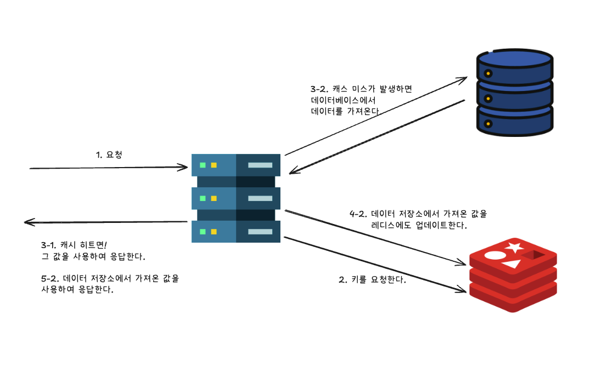
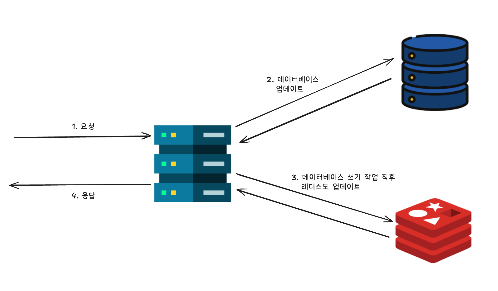
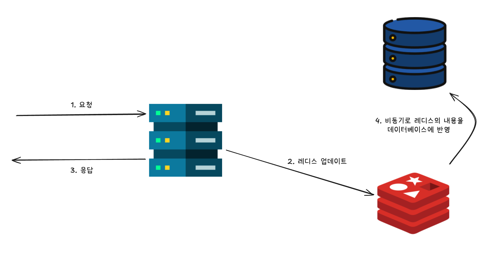
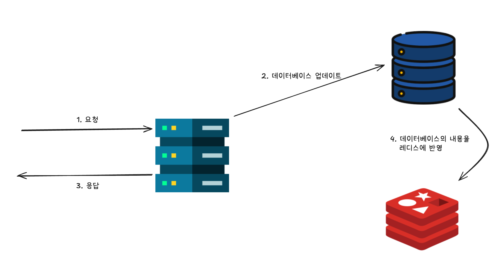

# Chapter 05 레디스 운용 관리

## 1. 데이터 영속성

- 레디스는 인메모리 데이터베이스의 특성상 기본적으로 모든 데이터를 메모리에서 처리하기 때문에 서버가 재시작되면 데이터가 유실될 수 있다.
  - 단순한 캐시 서버로 사용한다면 아키텍처나 성능에 영향. but 대부분의 경우 데이터 휘발성과 관련된 문제는 없다.
- 현업에서는 레디스를 캐시 서버가 아닌 데이터 저장소처럼 데이터 영속성을 전제로 운용하는 경우가 있다.
  - 영속성 관련 기능을 모두 활성화하는 것은 권장하지 않는다.
  - 성능과 내구성의 타협점을 찾고 그에 맞춰 설정해야 한다.
  - 트레이드오프를 고려하여 적절한 영속성 전략을 짜는 것이 중요!
- RDB(스냅샷)은 아래 조건이 기본값
  - 1시간 이내에 하나 이상의 키가 저장
  - 5분 내에 최소 100개 이상의 키가 변경
  - 1분 내에 최소 10,000개 이상의 키가 변경
- AOF는 모든 데이터 차례대로 기록

### 1-1. RDB

- 자동 혹은 수동 저장
  - 수동으로 저장할 때 `SAVE`(동기 방식) 혹은 `BGSAVE`(비동기 방식 - 백그라운드 실행) 명령어 사용
- `BGSAVE` 명령어는 백그라운드에서 아래와 같은 처리를 수행한다.
1. 요청을 처리 중인 프로세스에서 RDB 파일을 덤프하기 위한 자식 프로세스를 `포크 fork` 처리하여 생성합니다.
2. 자식 프로세스는 데이터 세트 전체를 임시 RDB 파일로 덤프
3. 덤프 처리가 완료되면 설정된 RDB 파일 이름으로 변경한다.

- `BGSAVE`는 요청을 처리하는 스레드와는 별도로 스냅샷을 생성하기 때문에 요청 처리에 미치는 영향을 줄일 수 있다.
- RDB 파일을 덤프하기 위한 자식 프로세스를 생성할 때는 `CoW(Copy on Write)`의 매커니즘을 사용하여 메모리를 확보한다.
  - 따라서 부모 프로세스 및 자식 프로세스에 쓰기 작업을 수행할 때 내용 차이가 발생하는 경우에는 그 차이만큼 메모리 영역을 추가로 사용하게 된다.
- `BGSAVE` 명령어처럼 RDB를 생성하여 백업하는 방식은 포크로 처리할 때 성능에 영향을 줄 수 있다. 아래 사항을 확인하자.
1. 스냅샷을 사용하기 위한 메모리가 충분한지 확인
2. 문제없이 레플리카에서 스냅샷을 가져올 수 있는지 확인
3. 서비스에 지장이 없는 시간에 스냅샷을 생성하는지 확인

- 생성한 파일을 cron 작업이나 `system.timer`를 통해 복원하기 위해 정기적으로 S3 등에 저장하는 운영 방식도 있다.
  - 복원을 위해 지정한 디렉터리에 RDB 파일을 배치하여 실행한다.
- 튜닝도 가능
  - LZF 압축: 크기를 줄이지만, CPU 사용량 증가.
  - CRC64 체크섬 사용: 파일 손상 확인. 대신 RDB 파일 저장하고 읽을 때 10% 정도 성능 저하.
- 스냅샷 저장 처리에 실패하게 되면, 레디스는 기본적으로 쓰기 작업 요청을 수락하지 않는다.
  - 데이터 손실의 가능성 -> 영속성을 위해 관리자에게 알리려고 하기 때문.
  - 영구 저장 처리를 모니터링할 수 있다면 해당 기능을 비활성화하고 생성이 실패해도 쓰기 요청을 수락하게 할 수 있다. (`stop-writes-on-bgsave-error`로 설정)
- 4MB의 데이터가 생성될 때마다 `fsync`를 수행할 수 있다.
  - 파일에서 디스크로 데이터 커밋을 단계적으로 진행 -> 지연 줄이기.
  - `rdb-save-incremental-fsync` 매개변수로 제어

### 1-2. AOF

- 계속 기록하는 특성 덕분에 내구성이 높다.
  - 대신 RDB 파일보다 크기가 커지는 경향이 있음.
  - 그리고 메모리 복구 시간이 오래 걸림.
- 레디스 서버는 요청받은 명령어를 파일에 기록하기 위해서 우선 파일을 버퍼에 유지하는데, 이 버퍼를 AOF 버퍼라 한다.
  - 이후 레디스 혹은 운영체제가 버퍼에 있는 데이터를 플러시 하여 디스크 내의 파일에 영구적으로 저장한다.
- AOF는 자동 생성만 가능.
  - 기본적으로 활성화 X
  - 활성화하기 위해 `appendonly` 지시자 지정.
- `appendfsync` 지시자는 자동생성 시점을 정할 수 있다.
  - `always`
  - `everysec`
  - `no`
- 대량의 입출력 중에는 요청을 처리하는 프로세스에서 호출되지 않도록 운영체제에서 `no-appendfsync-on-rewrite` 지시자로 제어.
  - 이때 백그라운드에서 스냅샷 생성이나 AOF 재작성 처리 중에는 `appendfsync` 지시자의 값이 `no` 상태가 된다.
  - 지연 시간 같은 문제가 특별히 없다면 데이터 손실의 내구성 관점에서 이 기능을 비활성화하는 것이 좋다.
- 파일 크기가 커지만 자동으로 AOF 재작성을 위해 `BGREWRITEAOF` 명령어 처리가 수행된다.
  - 이미 삭제되거나 만료된 키, 같은 키에 여러 작업을 하는 경우 등을 통합하여 파일 크기를 줄이는 작업 수행
  - AOF 재작성은 파일 변경을 감지하여 실행. 시작 시 파일 크기 혹은 이전 파일 크기와 현재 파일 크기 비교 -> 설정값을 초과하면 재작성
  - 또한 최소값을 설정해 파일이 너무 작아도 재작성 안 하게 할 수 있다. (for 성능)
  - `auto-aof-rewrite-percentage`: 트리거 비율
  - `auto-aof-rewrite-min-size`: 파일 최소 크기

#### AOF 메커니즘

- 7.0 이후 멀티파트 AOF 기능 도입. (Hybrid AOF)
  - 데이터 세트 전체를 보유하는 기본 파일과 이후에 추가된 부분을 보유하는 추가 파일로 분할. 
  - 재작성을 처리할 때 메모리 소비나 디스크의 입출력이 많아지는 문제 개선.
- 하지만 백업 시 AOF 재작성을 일시적으로 비활성화하지 않으면 파일이 망가질 수 있다. 따라서 AOF 재작성이 실행되고 있지 않은지를 확인한 후에 AOF 파일을 복사해야 한다.
- `auto-aof-rewrite-percentage` 지시자의 값을 0으로 설정하여 AOF 재작성을 비활성화한다. 그 이후 `INFO persistence` 명령을 실행하여 `aof-rewrite-in-progress`의 값이 1이면 0이 될 때까지 AOF 재작성 처리가 완료될 때까지 대기

### 1-3. 스냅샷과 AOF 비교

- 오픈소스 레디스는 기본적으로 스냅샷/AOF 혼합 형식이 활성화되어 있다.
- 레디스는 먼저 AOF 파일의 첫 다섯 글자를 확인한다. `REDIS`라는 문자열로 시작하는 경우 AOF 파일은 혼합 형식으로 간주한다.
  - 그러면 레디스 서버는 먼저 스냅샷을 읽고, 그다음에 AOF를 읽는다.
  - 이 동작을 통해 데이터 손실 위험을 최소화하면서도 레디스 재시작 시간을 단축한다.
- AOF를 활성화하지 않은 경우 AOF 파일에 명령이 추가되지 않으며, 혼합 형식으로도 설정할 수 없다.
- `aof-use-rdb-preamble` 지시자로 설정할 수 있으며, 기본적으로 활성화되어 있다.
- 기본적으로 스냅샷을 정기적으로 생성하는 것을 추천.

### 1-4. 데이터 삭제 패턴

- 레디스는 데이터 영속화 기능이 있지만, 데이터가 메모리에만 저장된 상태에서는 예기치 않게 데이터가 삭제될 가능성이 있다.
  - 원인 특정이 필요. 의도하지 않은 조작이나 장애 때문일 수 있다.
- 데이터가 손실될 수 있는 몇 가지 상황
  - 엔진 재시작
  - 레디스 서버 전체 장애
  - 명령어 실행
    - `DEL` / `HDEL` / `XDEL`
    - `FLUSHALL` / `FLUSHDB`
    - `UNLINK`
  - TTL 만료
    - `EXPIRE` / `EXPIREAT` / `PEXPIRE` / `PEXPIREAT`
    - `SET` 명령어 `EX` 옵션
  - 강제 제거
  - 비동기 레플리케이션
  - 레디스 클러스터의 네트워크 단절
  - 기타
    - 키 이름 재설정
    - 잘못된 데이터베이스 선택
    - 데이터가 아예 삽입되지 않은 경우

----

## 2. 캐시 서버로서 레디스 아키텍처

- 최소한! `지연 로딩 Lazy Loading/Cache-Aside` 패턴과 Write-Through 패턴을 숙지하고 있어야 한다.

### 2-1. 읽기 관점의 아키텍처

#### 지연 로딩 패턴(= Look Aside = Cache Aside)

- 원본 데이터는 MySQL과 같은 RDBMS에 저장하고, 레디스는 그 앞단에 배치하는 형태로 사용한다. 애플리케이션은 다음과 같은 흐름으로 처리한다.

1. 애플리케이션이 레디스에 데이터를 요청한다.
2. 요청된 데이터가 레디스 서버에 존재하는지, 유효 기간 내인지에 따라 처리 내용을 분기한다.
   1. 요청된 데이터가 레디스 서버에 존재하고 유효 기간 내에 있는 경우라면 레디스에서 애플리케이션으로 응답한다.
   2. 요청된 데이터가 레디스 서버에 존재하지 않거나, 존재하더라도 유효 기간이 지난 경우라면 다음과 같이 응답한다.
      1. 애플리케이션은 데이터베이스에서 데이터를 가져온다.
      2. 애플리케이션은 가져온 데이터를 레디스의 캐시에 업데이트한다.



- 장점
  - 캐시 노드 장애 시 다운타임을 줄일 수 있으며, 백엔드로의 데이터 접근에 수반되는 지연 시간의 영향을 최소화할 수 있다.
  - 요청된 데이터만 캐시에 저장하므로, 사용하지 않는 데이터를 캐시로 사용하는 공간이 작다.
- 단점
  - 가져온 데이터가 오래되었을 수 있다.
  - 캐시 미스 시 오버헤드가 크다.

#### Read-Through 패턴

- 지연 읽기 패턴의 변형과 같은 아키텍처
- 레디스에 데이터를 요청하고 캐시 미스가 발생했을 때 데이터베이스에서 캐시로 데이터를 읽어오는 방식을 사용.
- 지연 읽기 패턴과 가장 큰 차이점은 데이터베이스에서 데이터를 읽어오는 작업을 애플리케이션에서 직접 처리할 필요가 없다는 점이다.
  - 대신 라이브러리 등을 사용하여 데이터베이스에서 레디스로 데이터를 읽어오는 과정을 처리해야 한다.
- 레디스 내장 기능으로는 제공되지 않으므로, 서드파티 소프트웨어나 모듈 등을 통해 이러한 기능이 가능한지 확인할 필요가 있다.

<br/>

### 2-2. 쓰기 관점 아키텍처

#### Write-Through 패턴

- 아래와 같은 흐름으로 처리된다.

1. 애플리케이션은 데이터베이스에 데이터를 저장한다.
2. 애플리케이션은 1번과 같은 데이터를 레디스 서버에도 저장한다.



- 장점
  - 레디스 서버 내의 캐시 데이터가 항상 최신 상태를 유지
  - 읽기 작업 시 오버헤드 적다.
- 단점
  - 사용하지 않는 캐시 데이터 생성 가능성이 있다.
  - 쓰기 작업 시 데이터베이스와 캐시에 모두 쓰기를 해야 하므로 오버헤드가 크다.

- 쓰기 작업 때 지연 시간이 다소 증가해도 괜찮은 경우에 효과적인 방법이다.
  - 하지만 데이터베이스가 변경될 때마다 레디스 서버에 쓰기 작업을 수행하기 때문에 사용하지 않는 데이터가 레디스에 저장될 수 있다.
- 새로 시작하거나 캐시 노드에 장애가 발생해 새로운 캐시 노드를 추가한 경우에는 캐시에 데이터가 존재하지 않게 된다.
  - 데이터베이스에서 미리 데이터를 가져와 복사해두는 방법(캐시 워밍)을 생각해볼 수 있다.

#### Write-Back

- 캐시에 저장한 후, 일정 시간이 지연되면 데이터베이스를 비동기 방식으로 주기적인 업데이트!
- 데이터베이스가 RDBMS인 경우, 데이터를 영구적으로 저장하는 시점에 정규화하여 테이블에 저장



- Look-Aside나 Write-Through 패턴과 같은 아키텍처에서 쓰기/읽기 작업 시 발생하는 오버헤드를 줄일 수 있어 쓰기 작업을 빠르게 처리할 수 있다.
  - 하지만, 레디스에서 장애가 발생하는 경우 데이터 손실의 위험이 있기 때문에 애플리케이션의 특성, 데이터의 특성, 복구 방법 등을 사전에 충분히 검토해야 한다.
  - 성능을 우선하지만, 데이터 손실이 발생하는 상황을 가정해도 큰 문제가 없는 경우에 고려하는 패턴이다.
  - 복구할 때는 사전에 계획적으로 생성한 스냅샷으로 데이터를 복원한다.
- Write-Back의 변형인 `마이그레이션 Migration` 패턴도 있다.
  - ex) 이벤트 등의 이유로 일시적으로 많은 요청이 발생하는 기간에는 레디스에 데이터를 저장. 이벤트 종료 후 등의 특정 시점에는 데이터베이스에 영속화
- 장점
  - 레디스 서버 내의 캐시 데이터가 항상 최신 상태를 유지할 수 있다.
  - 쓰기 작업을 빠르게 처리할 수 있다.
- 단점
  - 데이터 손실 위험이 높다.

#### Write-Around

- 데이터를 직접 데이터베이스에 저장하는 방식
- AWS DMS와 같은 CDC(Change Data Capture) 기능을 사용하여 데이터베이스에서 레디스로 변경 내용을 레플레케이션하고, 레디스에서 직접 데이터를 읽어올 수 있다.



- 장점
  - 데이터 손실 위험이 낮다
- 단점
  - 구현 방법과 읽기 관점의 아키텍처에 따라 달라질 수 있다.

<br/>

### 2-3. 아키텍처 안티 패턴

- 캐시 노드의 다운으로 애플리케이션을 사용할 수 없는 경우가 있다.
- 만약 이런 상황이 발생한다면 아키텍처를 제대로 설계했는지 검토할 필요가 있다.
  - 애플리케이션과 데이터의 특성, 요구사항 등을 다시 확인하고, 재시도 처리 등 애플리케이션의 구현이나 아키텍처도 재검토해야 한다.
- 지연 로딩 아키텍처에서 캐시 노드가 다운된 경우에 미치는 영향도 사전에 고려해야 하는 대상이다.
  - 데이터베이스로 동작할 때 지연 시간이 최소화되도록!

<br/>

### 2-4. 데이터 저장소로서의 레디스 아키텍처

- 레디스 고유 기능을 활용해 관계형 데이터베이스에서 구현하기 어려운 요구사항이나 작은 데이터의 빈번한 쓰기 작업이 필요할 경우가 있을 수 있다.
- 이때 레디스를 데이터 저장소로 사용하며, 목적에 따라 관계형 데이터베이스와 병행하여 사용하는 것도 고려해볼 수 있다.
- 대신 아래의 주의사항이 있다.
  - 사용하는 레디스의 기능이 데이터 저장소로서의 요구사항을 충족하는지 확인해야 한다.
  - 문제 발생 시 복구 방법을 확인해야 한다.
  - 다른 관계형 데이터베이스 등과 결합하여 사용할 경우 롤백 발생 시 데이터의 일관성 측면에서 애플리케이션 구현에 문제가 없는지 여부를 고려해야 한다.
  - 레디스의 레플리케이션 기능이나 스냅샷 생성을 사전에 준비해야 한다.
- 레디스의 자료 구조나 기능을 반드시 사용해야 하는 상황을 제외하고는 RDBMS가 적합한 경우가 많다.

----

## 3. 모범 사례

### 3-1 . TTL 설정

- 필요한 기간 이상으로 데이터를 저장하는 것은 좋지 않다.
- 그렇다고 TTL을 너무 짧게 설정하면 DB에 부담을 줄 수 있다.
- `SET` 명령어의 `EX`/`PX` 옵션 또는 `EXAT`/`PXAT` 옵션 등을 사용하면 된다.
- `SET` 명령어를 사용할 수 없다면 `EXPIRE`, `PEXPIRE`, `EXPIREAT`, `PEXPIREAT` 등의 명령어로 TTL을 설정할 수 있다.
- 설정된 TTL을 비활성화하려면 `PERSIST` 명령어를 사용하면 된다.

#### TTL 확인

- 각 데이터베이스 내 키의 TTL 설정 상태는 `INFO Keyspace` 명령어 실행 결과로 확인할 수 있다.

```redis
127.0.0.1:6379> INFO Keyspace
# Keyspace
db0:keys=22,expires=0,avg_ttl=0
```

- 0번 데이터베이스에 22개의 키가 저장되어 있지만, TTL이 설정된 키가 없다는 것을 확인할 수 있따.
- `avg_ttl` 값으로 데이터베이스 내의 평균 TTL을 밀리 초 단위로 확인할 수 있는데, 값이 너무 크게 설정되어 있지는 않은지 등을 확인할 수 있다.
- 캐시 서버는 쓰기 빈도는 낮고 읽기 처리가 중심일 때 가장 효과적이므로 애플리케이션의 쓰기 빈도 비중이 높다면 레디스를 캐시 서버로 사용하는 것이 과연 효과가 있는지 다시 고려해보는 것이 좋다.

### 3-2. 제거 정책 설정

- `maxmemory`와 `maxmemory-policy`
- 캐시 서버를 사용하는 경우 다음과 같은 정책 중에서 선택하는 것을 고려해볼 수 있다.
  - TTL이 설정된 키를 대상으로 하는 `volatile-`로 시작하는 정책을 선택
  - 데이터 저장소로도 사용하는 경우, 모든 키를 대상으로 하는 `allkeys-`로 시작하는 정책을 선택
- LRU, LFU, 랜덤, TTL을 기반으로 한 정책 선택은 애플리케이션과 데이터의 특성을 고려하여 설정해야 한다.

### 3-3. 백업

- 스냅샷(RDB)과 AOF(Append Only File)
- 스냅샷을 생성할 때 중요한 것들
  - 메모리 확보
  - 생성 시점
  - 레플리카로부터 생성하기
- 스냅샷은 요청을 처리하는 스레드로부터 일반 포크 처리를 통해 생성된 새로운 스레드로 RDB 파일이 생성되는 방식으로 만들어진다.
  - 백업 등 데이터 세트 이외의 메모리 할당에는 CoW 방식을 사용한다.
  - 포크 처리로 생성된 스레드는 포크 처리 직후 부모 스레드와 같은 범위의 메모리 영역을 사용한다.
  - 그후 마스터와 레플리카에서 변경이 발생하면 각각 개별적으로 메모리 영역을 준비해서 기존에 공유하던 메모리 영역에서 분리하여 사용한다.
  - 따라서 읽기 작업만 하는 워크로드라면 스냅샷 생성 중에도 메모리 사용량이 크게 증가하지 않지만, 쓰기 작업이 많은 워크로드에서는 최대 두 배 가까이 메모리 소비가 증가할 수 있다.
  - 따라서 레디스를 사용할 때는 데이터 영역에 사용하는 메모리양은 레디스가 사용할 수 있는 메모리양의 50% 정도를 여유로 두는 게 바람직하다.
- 관리형 서비스를 사용하는 경우
  - 데이터 이외의 용도로 사용하는 메모리 영역을 예약할 수 있는 설정. -> 활용 고려
  - `ElasticCache`는 `reserved-memory-percent` (또는 `reserved-memory`) 지시자를 제공한다.
  - `ElasticCache`에서는 일반적으로 메모리가 부족할 때 포크 처리 없이 스냅샷을 생성하는 기능을 제공한다.
  - 이 기능을 사용하면 포크 작업 중 쓰기 작업이 많아질 때 발생하는 문제들(CoW로 인한 메모리 사용량 증가, OOM 등)을 예방할 수 있다.
  - CoW로 메모리 사용이 증가해도 두 배까지 증가하지는 않으니 25% 정도의 메모리만 확보해도 충분하다.
- 레플리카에서 스냅샷 생성
  - 포크 처리하여 새로운 스레드에서 RDB 생성.
  - 포크 작업 자체 및 환경에 영향을 받아 처리 시간 문제가 발생할 수 있다.
  - 스냅샷은 마스터보다 레플리카에서 생성하는 방식이 쓰기 작업을 수행하는 서비스에 미치는 영향을 줄일 수 있다.
  - 단, 레디스의 레플리케이션은 비동기 방식이므로, 마스터와 레플리카 간에 약간의 차이가 있을 수 있다는 점을 주의

### 3-4. 커넥션 풀링

- 클라이언튼에게 `커넥션 풀링 Connection Pooling` 기능 제공
- 연결을 재사용하여 처리 효율성을 높임.
- 사용 중인 레디스 클라이언트에서 이 기능을 지원하는지 확인하고, 지원한다면 활용하는 것이 좋다.
- 최대 동시 연결 수뿐만 아니라, 새로운 연결이 많은 경우에도 문제가 발생하여 지연 시간에 영향을 줄 수 있으므로 이 부분을 모니터링해야 한다.
- 최대 동시 연결 수는 `maxclients` 지시자로 설정할 수 있으며, 기본값은 10,000이다.
  - 레디스가 열 수 있는 파일 디스크립터의 최대 개수는 커널에 의해 소프트 제한이 걸려 있다. (32개) => 파일 디스크립터 수를 `maxclients + 32개`로 설정

### 3-5. 재시도 처리

- 클라이언트와 레디스 서버 간 통신이 일시적으로 중단되었을 때, 클라이언트 측에서 재시도를 수행하는 것은 효과적일 수 있다.
- 재시도 처리 
  - 재시도 횟수
  - 타임아웃 값
  - 재시도 간격
  - 재시도 횟수의 상한선
- 경우에 따라서는 `지터 Jiter`라고 불리는 무작위성을 추가하여 재시도를 분산시키는 방법도 사용
- 저자가 추천하는 방법. `지수 백오프 Exponential Backoff` 알고리즘에 기반한 방법
  - 처음 접속 시도에 실패하면 짧은 시간 동안 대기한 후 다시 시도. 성공하면 종료되지만 실패할 경우 이전 대기 시간의 두 배를 기다린 후 다시 시도. 재시도 간격을 지수적으로 늘려가는 방법.
  - 무한으로 재시도하지 않도록 재시도 횟수의 상한선도 설정하는 것이 일반적이다.
  - 여러 클라이언트가 동시에 재시도를 할 경우, 레디스 서버에 집중적인 부하가 발생할 수 있는데 이때 지터를 활용할 수 있다.
  - 지터는 재시도 간격 시간을 단순히 두 배 증가시키는 것뿐 아니라, 무작위로 짧은 시간을 추가하여 여러 클라이언트에서 동시 접소하는 반복 상황을 피하고, 레디스 서버의 과부하를 줄일 수 있다.
- 애플리케이션과 데이터의 특성을 고려하여 각종 매개변수 값을 적절하게 설정해야 한다.
  - 레디스 클라이언트 자체적으로 지수 백오프 기능을 제공하기도 하니 참고!

### 3-6. 기타 모범 사례

- 클라이언트의 소켓 타임아웃 값을 확인하면 좋다.
  - 이 값은 적어도 1초 이상으로 설정하는 것을 권장
  - 너무 작으면 레디스 서버에 대한 부하가 증가할 때마다 소켓을 통한 데이터 송수신에 시간이 걸려, 타임아웃 오류를 자주 발생시킬 수 있다.
  - 하지만 값이 너무 크면 연결 문제를 감지하는 데 시간이 오래 걸릴 수 있으므로 요구사항에 맞춰 균형 잡힌 값으로 설정해야 한다.ㄴ

----

# 참고자료

- 실전 레디스, 하야시 쇼고 지음, 서대원 옮김, 정격석 감수, 한빛미디어
