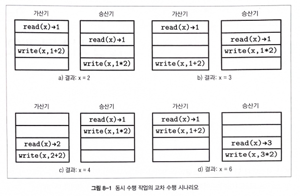
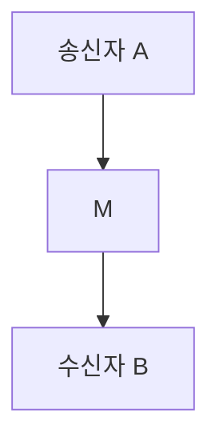
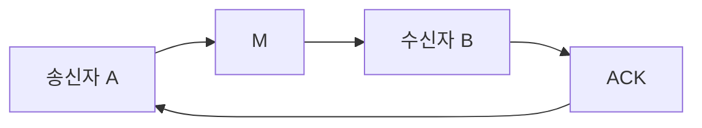

# 8장 분산 시스템 개요

- 분산 시스템과 단일 노드 시스템의 본질적인 차이?

## 동시 수행

- 동시성이라는 분산 시스템의 첫 번째 문제.
  - 동시성을 지원하는 프로그램은 모두 분산 시스템의 성격을 따른다.
  - 스레드는 공유된 자원에 접근하고 개별적으로 연산을 수행한 뒤 결과를 다시 공유 변수에 쓴다.
- 수행 단계를 정확하게 정의하고 가능한 결과의 수를 줄이기 위해서는 `일관성 모델 consistency model`이 필요하다.
  - 작업 수행 순서 정의, 다른 참가자가 순서를 알 수 있도록 해줌.
  - 시스템 상태의 종류를 제한하거나 완화할 수 있다.

> #### 동시성과 병렬성
> - 동시 수행: 한 대의 커피 머신에 두줄을 세우는 것
> - 병렬 수행: 두 대의 커피 머신에 두 줄을 세우는 것
> - 하지만 대부분의 경우 시스템이 여러 개의 스레드를 병렬로 실행하는 것을 동시성이라고 표현한다. 병렬성이라는 용어는 거의 사용하지 않는다.

## 분산 시스템의 자원 공유

- 데이터베이스에 대한 동시 요청 문제를 해결한다고 해도 모든 프로세스의 동기화를 보장할 수 없다.
- 데이터베이스에 접근하기 위해 프로세스는 전송 매체를 통해 메시지를 주고받아 상태를 쿼리하거나 수정해야 한다.
  - 하지만 오랫동안 응답을 받지 못한다면? -> 우선 오랜 시간에 대한 정의 필요
  - 이를 위해 통신이 완전히 비동기적인지 또는 일부 타이밍 가정이 있는지 여부를 나타내는 `동기성 synchrony`의 관점에서 시스템을 설명해야 한다.
  - 타이밍 가정이 있다면 타임아웃과 재시도 기능을 사용할 수 있다.
- 데이터베이스 응답 없음?
  - 과부화 상태? 사용할 수 없음? 느림? 네트워크에 문제? => 정확한 원인을 알 수 없다. 시스템 장의 특성.
  - 따라서 장애를 해결할 수 있는 방법을 찾기 전에 발생할 수 있는 장애 유형을 나타내는 `장애 모델 failure model`을 정의해야 한다.
- `내겸할성 fault tolerance`은 시스템의 신뢰성과 장애 발생 시 정상적으로 작동할 수 있는지 여부를 나타내는 속성이다.
  - 시스템 장애는 불가피 -> 단일 장애 지점 제거. 시스템의 `다중화 redundancy` -> 여러 복사본의 동기화 문제

## 분산 컴퓨팅의 오류

- 모든 위기 시나리오를 상황에 맞게 대처할 수 있는 시스템을 구축해야 한다.
  - 연결이 안정적이라도 원격 서버 호출이 로컬 호출보다 빠를 수 없다.
  - Latency에 대한 가정은 최소화해야 하지만 Latency가 0이라고 가정해서는 안 된다.
  - 메시지가 상대 서버에 도달하는 과정에서 여러 소프트웨어 계층과 광케이블 같은 물리적 매체를 통과한다.
  - 이 모든 과정은 즉각적이지 않다.
- 교환된 메시지의 수와 속도, 크기를 늘리거나 네트워크에 새로운 프로세스를 추가할 때 대역폭이 무한하다는 가정은 옳지 않다.

## 프로세싱

- 원격 프로세스 -> 즉각적이라고 가정할 수 없다.
  - 원격 프로세스의 로컬 프로세싱도 즉각적이지 않기 때문에 네트워크 레이턴시를 고려하는 것도 충분하지 않다.
- 나아가 메시지가 전달되는 즉시 프로세싱이 시작된다는 보장도 없다.
  - 작업을 우선 원격 서버의 대기열에 등록하고 이전에 도착한 메시지가 모두 처리될 때까지 기다려야 할 수 있다.
- 노드는 물리적으로 위치가 가깝거나 멀 수 있으며 CPU의 종류와 RAM의 크기, 디스크 종류, 소프트웨어 버전 및 환경 설정이 다를 수 있다.
  - 병렬로 처리? -> 전체 작업 속도 = 속도가 가장 느린 원격 서버의 속도
- 큐의 용량은 제한적 -> 요청을 계속 쌓는 것은 시스템에 아무런 도움이 되지 않는다.
  - `백프레셔 Backpressure` 알고리즘은 프로듀서가 컨슈머가 요청을 처리할 수 있는 속도보다 더 빠른 속도로 메시지를 발행하는 경우 프로듀서의 속도를 의도적으로 늦추는 알고리즘이다.
  - 분산 시스템에서 가장 인정받지 못하고 사용되지 않는 알고리즘 -> 보통 임시방편
- 큐의 용량을 늘리는 것은 아무런 영향도 없다. -> 오히려 레이턴시를 증가시킬지도.
- 일반적으로 프로세스에서 로컬 큐를 사용하는 이유
1. `분리 decoupling`: 메시지 수신과 처리를 시간적으로 분리하고 독립적으로 수행
2. `파이프라이닝 pipelining`: 서로 다른 단계에 있는 요청은 각각 독립된 서브시스템이 처리. 메시지를 수신하는 서브시스템은 이전 메시지가 완전히 처리될 때까지 블록하지 않아도 된다.
3. `일시적 급증 부하 처리`: 시스템 부하는 일정하지 않다. 레이턴시 = 큐에서 대기하는 시간에 비례. 일반적으로 요청을 실패했다고 응답하고 재시도하게 만드는 것보다는 훨씬 낫다.

- 작업량이 비교적 일정하다면 작업 처리 시간과 큐에 머무르는 평균 시간을 측정해 큐의 크기를 조정한다.
  - 처리량은 늘리고 레이턴시는 허용 가능한 범위 내로 유지해야 한다.

## 클럭과 시간

> 시간은 환상이다. 점심시간은 두 배로 그렇다.
> - 포드 프레펙트, "은하수를 여행하는 히치하이커를 위한 안내서"

- 두 서버의 클럭이 동기화됐다는 가정은 위험.
- 데이터를 수집하고 집계할 때 전달받은 타임스탬프에 의존하지 않고 참가자 사이의 시간 차이의 이해하고 알맞게 시간을 정규화해야 한다.
  - 참가자가 정확한 시간을 제공하지 않는 이상 동기화 또는 순서화에 타임스탬프를 사용하면 안 된다.
  - 물론 전달받은 시간을 완전히 무시하라는 의미 X -> 결국 모든 동기 시스템의 타임아웃은 로컬 클럭에 의존
- 프로세스 간의 시간 차이와 메시지를 전달하고 처리하는 데 소요되는 시간을 항상 고려
  - `일부 장애 감지 failure-detection` 알고리즘은 공유된 클럭에 의존하고 `클럭 차이 clock drift`가 항상 허용된 범위 내에 있다고 가정.
- 클럭 동기화는 쉽지 않다는 사실 + 현재 시간은 항상 바뀐다는 점을 기억.
  - 시간 제공자와 타임스탬프가 의미하는 정확한 순간을 이해하는 것이 중요하다.
- 클럭이 단조 클럭인지 여부와 예정된 시간 관련 작업 사이에 시간 차이가 얼마나 발생할 수 있는지 아는 것은 많은 도움이 될 수 있다.

## 상태 일관성

- 분산 알고리즘은 상태에 대한 일관성을 완벽하게 보장하지 않는다.
  - 일부는 제약 조건이 엄격하지 않고 복제 노드 간의 상태 차이를 허용하며 `충돌 해결 conflict resolution`과 `읽기 중 데이터 복구 방식 read-time data repair`을 통해 상태 차이를 해결한다.
- `결과적 일관성 eventual consistency`을 보장하는 분산 시스템에는 읽기 중에 노드 `쿼럼 quorum`(정족수)을 쿼리해 복제 노드 사이의 상태 불일치를 해결하는 로직이 있을 수 있다.
  - 하지만 데이터베이스 스키마와 클러스터의 뷰가 완전히 일치한다고 가정한다.
  - 이 둘의 일관성을 강제하지 않고 가정에 의존하면 심각한 문제가 생길 수 있다.
- ex) 아파치 카산드라
  - 스키마 변경 사항이 각 서버로 다른 시점에 전파되는 문제로 인한 버그 발견된 적 있음.
  - 서버가 서로 다른 형식의 스키마를 인코딩 혹은 디코딩하면서 데이터베이스가 손상
- ex) 카산드라 `링 상태 불일치 divergent view of the ring`
  - 한 노드가 다른 노드에 특정 키에 대한 레코드가 있다고 가정하지만, 해당 노드의 클러스터 뷰가 다른 노드와 다른 경우 읽거나 새로 쓴 데이터가 잘못된 위치에 배치되거나 데이터는 존재하지만 빈 응답을 반환하는 버그.

## 로컬 실행과 원격 실행

- 원격 API 뒤에 복잡한 로직을 숨기는 것은 위험할 수 있다.
  - 익숙하지 않은 스토리지 엔진을 사용하더라도 로컬 데이터셋의 반복자가 내부적으로 어떤 방식으로 동작하는지 쉽게 추론할 수 있다.
  - 하지만 원격 노드의 데이터셋을 순회하는 작업은 방식이 완전히 다르다. -> 일관성과 전달 방식, 데이터 조정, 페이징, 병합, 동시 접근 등 여러 부분에 관한 이해 필요
- 로컬 실행과 원격 실행은 완전히 다르다는 사실을 명심.
- 원격 실행을 감추기 어려운 이유는 바로 레이턴시.
  - 로컬보다 비용이 몇 배 이상 높다.
  - 양방향 네트워크 전송과 직렬화/역직렬화 등의 여러 단계가 추가되기 때문이다.
  - 원격 실행과 로컬 실행이 뒤섞이면 성능 저하와 부작용의 원인이 될 수 있다.

## 장애 처리

- 모든 노드가 정상적으로 작동한다고 가정하고 시스템 설계를 시작하는 것도 괜찮지만 항상 이렇게 가정하는 것은 위험하다.
  - 점검을 위해 `중단 graceful shutdown`되기도 하고 소프트웨어 문제, `메모리 부족 킬러 out-of-memory killer`, 런타임 버그, 하드웨어 문제 등으로 인해 노드에 장애가 발생하기도 한다.
  - 프로세스는 중단될 수 있다. 따라서 장애 상황에 대비하고 어떻게 대처할 수 있을지 고민해야 한다.
- 원격 서버가 응답하지 않는 정확한 이유를 항상 알 수 있는 것이 아니다.
  - 충돌, 네트워크 장애, 원격 프로세스 또는 링크의 속도 저하 등의 다양한 원인이 있을 수 있다.
  - 일부 분산 알고리즘은 `하트비트 프로토콜 heartbeat protocol`과 `장애 검출기 failure detector`를 사용해 어떤 노드가 살아 있고 접근 가능한지 추측한다.

## 네트워크 파션 부분 장애

- 2개 이상의 서버가 서로 통신할 수 없는 상황을 네트워크 파티션이 발생했다고 한다.
- 불안정한 네트워크(패킷 분실, 재전송, 예측할 수 없는 레이턴시 등)는 견디고 대처할 수 있지만, 네트워크 파티션은 훨씬 더 심각한 문제다.
  - 격리된 그룹이 각자 작업을 수행해 결과가 충돌할 수 있기 때문이다.
  - 비대칭 네트워크 링크가 발생할 수도 있다. -> 메시지가 한 프로세스에서 다른 프로세스로 성공적으로 전달되지만 반대 방향은 실패하는 경우
- 장애 감지는 쉽지 않다. -> 모든 부분에서 동일한 형태로 발생하지 않는다.
  - 가용성이 높은 시스템을 설계할 때는 항상 여러 특수 상황을 고려해야 한다.
  - 데이터를 성공적으로 복제했지만 확인 응답을 받지 못했다면 재시도할 것인가?
  - 확인 응답을 보낸 노드의 데이터는 읽기를 허용할 것인가?
- 장애에 대처하는 가장 이상적인 방법 = 테스트
  - 파티션 생성, 비트 손상 시뮬레이션, 레이턴시 증가, 클럭 불일치 유발, 상대적 처리 속도 증가 등을 설정할 수 있는 `테스트 하네스 test harness`를 준비해야 한다.
  - 상용 분산 시스템은 매우 적대적이고 불친절하며 창조적일 수 있다. 따라서 테스트는 가능한 한 많은 시나리오를 포함해야 한다.
- 분산 시스템 설계 시 내결함성, 회복력, 장애 시나리오 그리고 여러 특수 상황을 모두 신중하게 고려해야 한다.
  - 일반적으로 클러스터에는 항상 문제가 발생하기 마련이다.

## `계단식 장애 cascading failures`

- 장애는 분리가 불가능할 수 있다.
  - 특정 프로세스의 사용량이 급증하면 결국 클러스터 전체의 사용량이 증가해 다른 노드에도 장애가 발생할 확률이 높아진다.
  - 계단식 장애는 시스템의 한 부분에서 다른 부분으로 전파돼 오류의 범위를 확장한다.

> 시스템 내에 장애가 전파되는 것을 방지하고 장애 상황에 적절하게 대응하기 위해 `Circuit Breaker`를 사용하기도 한다.

- 특정 서버와의 연결이 끊어지거나 서버가 응답하지 않는 경우 클라이언트는 계속해서 재연결을 시도한다.
  - 하지만 과부하가 걸린 서버는 새로운 접속 요청을 처리하는데 바쁘기 때문에 지속적인 재연결 시도는 상황을 악화시킨다.
  - 이와 같은 상황을 방지하기 위해 `백오프 backoff` 전략을 사용한다. -> 재시도를 스케줄링하고 요청 사이의 시간을 늘려 증폭 문제 해결
- 하지만 여러 클라이언트가 동일한 백오프 전략을 사용할 경우 상당한 부하가 발생할 수 있다.
  - 여러 클라이언트가 백오프 기간이 지나고 동시에 재시도하는 상황을 방지하기 위해 `지터 Jitter`를 사용한다.
  - 백오프 기간에 임의의 짧은 시간을 추가해 여러 클라이언트가 동시에 재시도하는 확률을 줄인다.
- 하드웨어 장애와 비트 손상, 소프트웨어 에러로 인해 손상된 데이터 전송 및 전파 -> 정상적인 레코드 덮어씀
  - 이와 같은 문제는 `체크섬 checksum`과 유효성 검증을 통해 노드 사이에 교환되는 데이터의 무결성을 확인해야 한다.
- 부하와 `핫스팟 hotspot`은 작업을 미리 계획하고 조정함으로써 방지할 수 있다.
  - 각 노드가 독립적으로 작업을 수행하지 않고 코디네이터가 가용 리소스를 기반으로 실행 계획을 준비하고 과거 실행 데이터 기반으로 부하를 예측해야 한다.
- 장애 전파는 미리 차단하자!
  - Circuit Breaker, 백오프 전략, 유효성 검증 및 조정 메커니즘을 구현해야 한다.
  - 분리된 작은 문제를 해결하는 것이 대규모 장애를 복구하는 것보다 훨씬 더 간단하다.

## 분산 시스템 추상화

- 프로그래밍 언어에 대해 설명할 때? 공통 용어를 사용. 프로그램을 함수와 연산자, 클래스, 변수, 포인터의 관점에서 정의
  - 공통 용어 -> 개념을 설명할 때마다 새로운 단어를 만들지 않아도 된다.
- 분산 시스템 용어부터 살펴보자.

### 링크

- 네트워크의 신뢰성은 낮다.
  - 메시지 분실, 전송 지연, 순서 뒤바뀜.
  - 여러 통신 프로토콜을 설계해보자.

#### 손실될 수 있는 링크

- 송신자의 관점에서 전송된 메시지 M의 상태는 다음 중 하나일 수 있다.
1. 아직 프로세스 B에 전달되지 않음(하지만 결과적으로 전달됨)
2. 전송 중에 손실돼 복구가 불가능함
3. 원격 프로세스에 성공적으로 전달됨

- 이 방식에서 송신자는 메시지의 전달 여부를 확인할 수 없다.
- 분산 시스템 용어로 이와 같은 링크를 `손실 허용 링크`라고 부른다.
  - <b>손실 허용성</b>: 송신자와 수신자가 정확하다면 무한정 재전송한 메시지는 결과적으로 전달된다.
  - <b>유한 중복성</b>: 메시지는 무한히 중복 전달되지 않는다.
  - <b>생성 불가성</b>: 링크는 메시지를 생성하지 않는다. 즉, 전송되지 않은 메시지가 전달될 수 있다.

#### 메시지 확인 응답

- 이와 같은 상황을 개선하고 메시지의 상태를 정확히 판단하기 위해 수신자가 메시지를 수신했음을 알리는 메시지 `확인 응답 acknowledgement`을 사용할 수 있다.
  - 양방향 통신 채널과 메시지를 구별할 수 있는 수단 필요.
  - ex) 시퀀스 번호와 같은 단조적으로 증가하는 메시지 식별자가 있으면 된다.

> - 모든 메시지마다 고유 식별자를 설정해도 된다. 시퀀스 번호는 카운터를 사용해 고유성을 보장하는 고유 식별자의 종류 중 하나일 뿐이다.
> - 단 해시 알고리즘을 사용해 식별자를 생성할 경우 해시 충돌이 발생해도 메시지를 구별할 수 있어야 한다.

- 확인 응답도 마찬가지로 전송 중 손실될 수 있다.
  - 따라서 메시지의 상태가 추가된다. (3가지 중 하나)

#### 메시지 재전송

- 확인 응답을 추가하는 것만으로 통신 프로토콜을 완전히 신뢰할 수는 없다.
  - 메시지가 전송 중에 누락
  - 확인 응답을 보내기 전에 원격 프로세스에 장애 발생
- 이와 같은 문제를 해결하고 전달을 보장하기 위해 메시지를 재전송할 수 있다.
- 재전송: 송신자가 잠재적으로 실패한 작업을 재시도하는 행위
- 메시지를 전송하고 타임아웃 `T`가 발동되면 같은 메시지를 재전송한다.
- 분산 시스템의 용어로 이 추상화를 `스터번 stubborn` 링크라고 부른다.
  - 송신자는 메시지가 성공적으로 전달될 때까지 계속해서 재시도하기 때문에 '고집이 세다'고 묘사한다.
  - 하지만 매우 비효율적 -> 확인 응답과 재시도를 같이 활용할 수 있는 방법이 필요

#### 재전송 문제

- 메시지를 전송하고 확인 응답을 받기 전까지 송신자는 전혀 알 수가 없다.
  - 메시지가 성공적으로 처리됐는지
  - 처리될 예정인지
  - 전송 중 손실됐는지 
  - 메시지를 받기 전에 원격 프로세스에 장애가 발생했는지
- 연산을 재수행하고 메시지를 재전송할 수 있지만 불필요한 중복이 발생할 수 있다는 말이다.
- `멱등 idempotent` 연산일 경우에만 중복 메시지를 안전하게 처리할 수 있다.
  - 멱등 연산은 여러 차례 수행해도 부작용이 없고 결과가 동일한 연산이다.
  - ex) 서버 종료 작업은 멱등적이다. -> 첫번째 호출이 셧다운을 시작하고 이후의 호출은 아무런 효과가 없다.
- 만약 모든 연산이 멱등적이라면 메시지 전달에 대해 복잡하게 생각하지 않아도 된다.
  - 내결함성은 재전송으로 해결할 수 있고 신호에 대한 응답으로 특정 작업을 트리거하는 부작용이 없는 반응형 시스템을 구축할 수 있다.
  - 하지만 모든 연산이 멱등적인 것은 아니며 모두 멱등적이라는 가정은 클러스터 전체에 부작용을 초래할 수 있다. ex) 신용카드 결제는 멱등적이지 않다. 중복 결제는 반드시 방지해야 한다.
- 멱등성은 부분적 장애와 네트워크 파티션이 발생할 수 있는 환경에서 특히 더 중요하다.
  - 원격 작업의 정확한 상태(성공, 실패 또는 곧 실행될 예정)를 항상 알 수 있지 않고 더 오래 기다리는 방법밖에 없기 때문이다.
  - 모든 작업이 멱등적이라는 가정은 비현실적이다.
  - 따라서 작업의 의미를 바꾸지 않고 멱등성에 준하는 결과를 보장하는 방법이 필요하다.
  - 이를 위해 `중복 제거 기능 deduplication`을 사용하면 메시지를 중복 처리하는 것을 방지할 수 있다.

#### 메시지 순서

- 시퀀스 번호를 통해 알 수 있는 정보
  - `n(consecutive)`: 수신한 메시지의 가장 높은 시퀀스 번호. 이 번호까지 메시지를 실제 순서대로 정렬 가능
  - `n(processed)`: 실제 순대로 정렬하고 처리한 메시지의 가장 높은 시퀀스 번호, 중복 제거 용도로 사용
- 시퀀스 번호가 비연속적이라면 수신자는 해당 메시지를 재정렬 버퍼에 저장
- 수신자는 시퀀스 번호 `n(consecutive)`까지의 메시지는 확실히 전달됐기 때문에 안전하게 삭제할 수 있다.
  - 중복 제거 작업은 시퀀스 번호 `n`의 처리 여부를 확인하고 이미 처리된 메시지는 삭제한다.
- 분산 시스템에서 이와 같은 링크를 `퍼펙트 perfect` 링크라고 부르며 다음 속성을 보장한다.
  - `전송 신뢰성`: 모든 메시지는 결국 전달된다.
  - `전송 비중복성`: 메시지는 한 번만 전달된다.
  - `생성 불가성`: 다른 종류의 링크와 마찬가지로 오직 실제로 전송된 메시지만 전달될 수 있다.

#### 정확히 한 번만 전달

> 분산 시스템에는 두 가지 난제가 있다.
> 1. 메시지의 순서 보장
> 2. 정확히 한 번만 전달

- 대부분의 시스템은 확인 응답을 받을 때까지 재시도하는 `최소 한 번 전달 at-least-once delivery` 방식을 사용한다.
- 반면 `최대 한 번 전달 at-most-once delivery` 방식은 메시지를 전송한 뒤 전달 여부는 신경쓰지 않는다.
- TCP는 메시지를 여러 패킷으로 나누고 개별로 전송한다.
  - 수신자는 전달받은 패킷을 조합해 메시지를 재구성한다.
  - TCP는 일부 패킷을 재전송할 수 있고 같은 패킷의 전송 시도가 여러차례 성공할 수 있다.
  - TCP의 각 패킷에는 시퀀스 번호 존재 -> 중복 패킷 제거 가능 -> 수신자는 메시지를 한 번만 처리: 하지만 이는 오직 단일 세션에서만 유효한 속성이다.
  - 수신자는 메시지를 확인 및 처리했지만 송신자가 확인 응답을 받기 전에 연결이 끊어지면 애플리케이션은 전달 여부를 알 수 없고 내부 로직에 따라 메시지를 재전송할 수 있다.
- 중복 전달은 부작용이 없고 전송을 위한 최선의 노력이기 때문에 정확히 한 번 처리된다는 부분이 중요하다.
- `정확히 한 번 exactly-once` 속성을 보장하기 위해서는 모든 노드가 공통 정보를 공유해야 한다.
  - 어떤 정보에 대해 모든 참가자가 알고 있고 서로 같은 내용을 알고 있다는 사실도 알아야 한다.
  - 쉽게 말해 모든 노드는 레코드의 상태에 대해 동의해야 한다. 레코드의 유지 여부는 모든 노드의 동의가 필요하다. -> 이론적으로는 불가능. 일부 조정 조건을 완화해 이 조건을 보장.
- 모든 메시지를 한 번만 전송하는 신뢰할 수 있는 링크란 존재하지 않는다.
  - 모든 메시지를 한 번만 처리하고 중복된 메시지는 무시하면 송신자의 관점에서 정확히 한 번 전달된 것과 같이 보이게 할 수 있다.

### 두 장군 문제

- 분산 시스템의 맥락에서 합의의 의미를 가장 잘 나타내는 설명은 `두 장군 문제 Two Generals Problem`로 널리 알려진 사고 실험이다.
  - 두 명의 장군이 이끄는 두 개의 군대가 요새를 공격하는 시나리오. 전령의 통해 의사소통 및 합의 필요.
  - 비동기 통신 중 링크에 장애가 발생했을 때 참가자 간의 합의 달성이 불가능하다는 것을 증명한다.
  - TCP는 퍼펙트 링크와 유사하지만 이름과 달리 퍼펙트 링크는 완벽한 전달을 보장하지 않는다.

### FLP 불가능성 이론

- 초깃값을 가진 여러 프로세스가 새로운 값에 대해 합의하는 과정을 설명.
  - 알고리즘이 완료된 후 모든 정상 프로세스의 최신 값은 같아야 한다.
- 신뢰할 수 있는 네트워크 환경에서 특정 값에 대한 합의는 간단.
  - 하지만 실제 시스템에서는 메시지 분실, 중복 전송, 네트워크 파티션, 프로세스 속도 저하 또는 충돌 등의 다양한 형태의 장애가 발생한다.
- 합의 프로토콜은 프로세스의 상태를 `초기 상태 initial state`에서 모두 `합의된 상태 decision state`로 전환한다.
- 정상적인 합의 프로토콜에는 다음 세 가지 속성이 있다.
1. `일치성 Agreement`: 프로토콜의 결과는 모두 동의해야 한다. 일치하지 않으면 실패.
2. `유효성 Validity`: 결정된 값은 특정 프로세스가 제안한 값이다. 임의의 값은 만들어낼 수 없다. 프로세스는 미리 정의된 같은 기본값을 선택하지 않아야 한다.
3. `유한성 Termination`: 합의는 오직 모든 프로세스가 확정된 상태가 됐을 때 유효하다.

> 프로세싱은 완전히 비동기적이라고 가정.
> - [FISCHER85] 논문

- 프로세스 간 공유된 시간의 개념이 없다는 의미다.
  - 이런 환경에서 실행되는 알고리즘은 타임아웃을 사용할 수 없다.
  - 프로세스에 장애가 발생했는지 또는 단순히 응답 속도가 느린 것인지 알 수 없기 때문이다.
  - 이 논문은 한정된 시간 내에 합의가 반드시 이뤄지는 프로토콜은 존재하지 않는다고 주장한다.
  - 단 하나의 프로세스라도 예고 없이 충돌하는 것을 용인하는 완전히 비동기적 합의 알고리즘은 존재하지 않는다.
- 프로세스가 알고리즘을 수행하는 시간을 제한하지 않으면 프로세스 장애를 정확히 감지할 수 없기 때문에 합의에 도달할 수 있는 결정론적 알고리즘이 존재할 수 없다.
- 하지만 FLP 불가능성 이론은 합의가 불가능하기 때문에 포기해야 한다는 주장이 아니다.
  - 실제로 시스템에는 어느 정도의 동기성이 필요하다.
  - 이 문제를 해결하려면 더욱 정교한 모델이 필요하다.

### 시스템 동기성

- 타이밍 관련 가정은 분산 시스템에서 매우 중요하다.
  - 처리 속도 파악 불가.
  - 항상 한정된 시간 내에 메시지를 전달하거나 순서 보장 불가.
  - 응답에 긴 시간 소요
  - 프로세스 장애 항상 정확히 감지 불가.
- 일반적으로 프로세스 사이의 처리 속도 차이는 크지 않으며 링크를 통해 메시지를 전달하는 데 시간이 무한정 오래 걸리진 않는다.
  - 시간에 의존하면 문제 파악이 간단해지고 보장할 타이밍을 제한할 수 있다.
- 일부 비동기 모델의 합의 문제는 해결이 어려울 수 잇다.
- 따라서 일부 제약 사항을 완화하고 동기 시스템이라고 가정할 수 있다.
  - 이를 위해 타이밍 개념이 필요하다.
  - 동기 모델 기반의 시스템이 더 파악하기가 쉽다.
  - 각 프로세스의 처리 속도는 비슷하고 전송 지연 시간은 제한되며 메시지 전송은 무한대로 오래 걸리 수 없다고 가정한다.
- 동기 시스템은 프로세스별로 동기화된 클럭이 있다고 생각할 수 있다.
  - 프로세스 사이의 시차는 상한선이 있다.
- 동기 모델 기반의 시스템에서는 타임아웃 사용 가능.
  - 리더 선출과 합의, 장애 감지 등 더 복잡한 추상화 구현 가능.
  - 최선의 상황은 더욱 견고해지지만 타이밍 조건이 충족되지 않으면 장애가 발생.
  - ex) raft 합의 알고리즘. -> 여러 프로세스가 서로 리더라고 생각하는 상황이 발생 가능. -> 일부 프로세스의 속도를 의도적으로 늦춰 특정 프로세스를 리더로 만들 수 있다.
  - ex2) 장애 감지 알고리즘 -> 정상적인 프로세스를 장애가 발생했다고 잘못 판단. 그 반대로 오인도 가능.
- 동기 모델과 비동기 모델의 속성을 합친 모델 = `부분 동기 partial synchronous` 모델.
  - 동기 시스템의 일부 속성을 내재. but, 메시지 전달 시간과 클럭 차이, 상대적 처리 속도의 범위는 다를 수 있다.

## 장애 모델

- `충돌 crash`와 `누락 omission` 그리고 임의의 장애 등의 분산 시스템 장애 모델.

### 충돌

- 프로세스가 알고리즘 수행을 중단하고 다른 프로세스에 더 이상 메시지를 보내지 않는 경우.
- 충돌한 프로세스는 충돌 상태를 유지한다고 규정하는 `충돌-정지 crash-stop` 모델을 기본 모델로 정의
  - 이 모델은 복구될 수 없다는 것을 의미하지 않으며 복구를 시도하지 않거나 막지 않는다.
  - 알고리즘은 복구를 통해 `정확성 correctness`과 `라이브니스 liveness`를 보장하지 않음을 의미한다.
  - 복구된 프로세스는 시스템 상태와 동기화하고 다음 알고리즘 수행에 참여한다.
- 장애가 지속되는 동안에는 합의 과정에 참여할 수 없다.
  - 복구된 프로세스를 새로운 프로세스로 할당해도 충돌-정지 모델은 `충돌-복구 crash-recovery` 모델과 동일하지 않다.
  - 대부분의 알고리즘은 미리 정의된 프로세스 목록을 사용하고 허용할 수 있는 장애 프로세스의 수의 관점에서 장애를 정의하기 때문이다.
- 충돌-복구 모델은 또 다른 프로세스 추상화다.
  - 프로세스를 복구하려면 상태의 개념과 복구 프로토콜이 필요.
  - 충돌-복구 모델 기반의 알고리즘은 모든 가능한 복구 상태를 고려해야 한다.
  - 복구된 프로세스는 중단되기 전에 마지막으로 실행한 단계부터 재시도할 수 있기 때문이다.
- 복구에 의존하는 알고리즘은 프로세스의 존재와 상태를 반드시 고려해야 한다.
  - 프로세스의 관점에서 연결이 끊어졌던 프로세스와 장애 발생 후 복구된 프로세스를 구분할 수 없기 때문에 충돌-복구 모델은 일종의 `누락 장애 omission` 모델로 볼 수 있다.

### 누락

- 프로세스가 알고리즘의 단계 중 일부를 건너뛰거나 수행할 수 없는 상태.
- 다른 참가자가 실행 여부를 알 수 없거나 참가자가 서로 메시지를 교환할 수 없는 상태.
- 네트워크 링크 및 스위치 고장, 네트워크 정체 등으로 인한 네트워크 파티션이 누락의 원인.
  - 네트워크 파티션은 개별 프로세스 또는 프로세스 그룹 간의 메시지 누락으로 표현할 수 있다.
  - 프로세스 사이에 교환되는 모든 메시지를 완전히 무시해 재현할 수 있다.
- 속도가 느린 프로세스는 작업을 완전히 중지하는 대신 결과를 다른 프로세스와 동기화되지 않은 상태로 보내려고 시도한다.
- 누락은 알고리즘의 일부 단계를 건너뛰거나 수행 결과를 확인할 수 없을 때 발생한다.
  - ex) 메시지를 보내느 도중에 메시지가 손실돼 복구될 수 없지만, 송신자는 메시지가 정상적으로 전달됐다고 착각해 메시지를 재전송하지 않고 계속해서 다음 작업을 수행.
  - 간헐적 연결 끊김과 네트워크 과부하, 큐 공간 부족 등으로 인해 발생할 수도 있다.

### 임의의 장애

- 임의의 장애 또는 비잔티움 장애는 가장 해결하기 어렵다.
  - 프로세스가 알고리즘의 의도와 모순되는 방식으로 알고리즘을 수행하는 상황을 나타낸다.
- 이런 장애는 소프트웨어 버그 또는 알고리즘의 버전 차이로 인해 발생할 수 있다.
  - 이 경우 장애 감지와 원인 파악이 상대적으로 쉽다. 
  - 하지만 모든 프로세스를 직접 제어할 수 없거나 특정 프로세스가 다른 프로세스를 악의적으로 제어하는 경우엔 매우 어려워질 수 있다.
- `비잔티움 장애 허용 Byzantine fault tolerance`은 항공업계에서 자주 사용하는 개념이다.
  - 항공기와 우주선 제어 시스템은 서브 컴포넌트의 응답을 곧이곧대로 신뢰하지 않고 다른 응답과 교차 검증한다.

### 장애 처리

- 프로세스를 여러 그룹으로 나눠 다중화하면 장애 발생 사실을 숨길 수 있다.
  - 특정 노드에 장애가 발생해도 사용자는 이 사실을 인지하지 못한다.
- 장애는 성능 저하의 요인이 될 수 있다.
  - 정상적인 작업은 여러 프로세스가 반응하지만 에러 처리 및 수정은 상대적으로 수행이 느리다.
  - 대부분의 장애는 소프트웨어 코드 리뷰와 광범위한 테스트, 타임아웃과 재시도 그리고 알고리즘 단계의 수행 순서를 보장해 방지할 수 있다.

