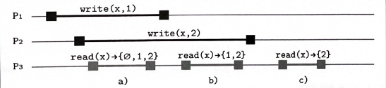
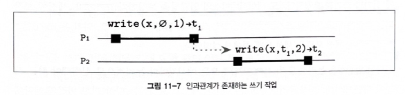
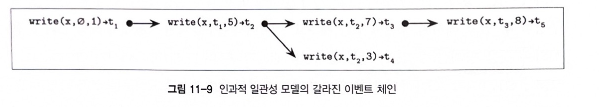

# 11장 복제와 일관성

- 합의 알고리즘과 원자적 커밋 알고리즘
  - 이들을 심층적으로 이해하려면 `일관성 모델 consistency model`에 대해 알아야 한다.
  - 여러 개의 데이터 복제본을 유지하는 일관성 모델은 시스템의 상태와 작동 방식을 정의하는 중요한 개념
- `내결함성 fault tolerance`: 장애가 발생해도 정상적으로 작동할 수 있는 시스템을 나타내는 속성
  - 1차적 목표. `단일 장애점 single point of failure`을 제거하고 필수 컴포넌트를 이중화
  - 일반적으로 이중화는 사용자에게 완전히 투명
- 시스템에 여러 개의 데이터 복제본을 저장하면 일부 서버에 장애가 발생해도 다른 서버가 `장애 조치 failover`를 수행해 시스템이 정상적으로 작동 가능
  - `진실 공급원 source of truth`이 하나인 시스템(예를 들어 primary-replication 노드 구조의 데이터베이스)은 `복제 서버 replica`를 새로운 마스터로 승격시켜 장애를 직접 처리
  - 그에 반해 다른 구조의 시스템은 직접적으로 구조를 변경 X, 대신 읽기와 쓰기 요청 시 여러 노드의 응답을 수집해 데이터의 일관성 유지
- `replication`에서 여러 복제본을 원자적으로 업데이트하는 작업은 합의 알고리즘과 유사. 모든 요청마다 수행하기엔 비용이 높다.
  - 따라서 노드 간에 어느 정도 상태 차이는 허용하면서 사용자에게 최대한 일관된 데이터를 제공할 수 있는 비용 효율적이고 유연한 알고리즘 필요
- 멀티 데이터센터 배포 구조에서 데이터 복제는 더 중요.
  - `지리적 이중화 geo-replication`를 통해 데이터 가용성을 높이고 데이터센터 장애를 대응
  - 복제본을 사용자와 물리적으로 가까운 곳에 저장해 전송 레이턴시를 줄일 수 있다.
- 데이터 레코드 수정 -> 복제본 업데이트
  - 가장 중요한 작업은 3가지. (1) 쓰기 (2) `복제본 갱신 replica update` (3) 읽기
  - 클라이언트가 이러한 작업을 요청하면 일련의 이벤트가 발동. 복제본 갱신은 클라이언트 관점에서 쓰기가 완료된 후 수행되기도 한다.
  - 하지만 갱신 시기와 상관없이 클라이언트가 의도한 순서대로 작업이 수행돼야 한다.

---

## 고가용성 high-availability

- 간헐적 장애가 가용성에 영향을 주지 않아야 한다.
  - 사용자 관점에서 시스템은 아무 문제도 발생하지 않은 것처럼 계속 작동해야 한다.
- 시스템 가용성은 매우 중요한 속성.
  - 소프트웨어 공학에서는 항상 가용성을 높이고 다운타임을 최소화하려고 애쓴다.
  - 시스템 업타임은 엔지니어링 팀의 큰 자랑거리
- 낮은 가용성 => 고객 이탈 또는 매출 하락
- 고가용 시스템은 일부 노드의 장애 및 오류를 단계적으로 대응할 수 있어야 한다.
  - 이중화와 복제를 통해 해결
  - 이중화 => 여러 복제본 동기화 문제. 복구 메커니즘 추가 필요

---

## CAP 이론

- 시스템이 모든 요청에 대해 성공적으로 응답할 수 있는 능력을 나타내는 속성.
  - 가용성 = 이론적으로 `결과적 응답 eventual response`을 의미하지만 현실적으로 응답이 지나치게 오래 걸리는 서비스는 바람직하지 않다.
- 이상적으로 모든 작업은 일관성을 유지해야 한다.
  - 일관성이란 원자적 또는 `선형화할 수 있는 linearizable` 일관성을 의미
  - 선형화 가능한 이력(히스토리)이란 원래의 실행 순서가 보존되는 일련의 짧은 작업들로 나타낼 수 있다.
  - 선형화 가능성은 시스템 상태에 대한 추론을 단순화하고 분산 시스템이 단일 서버에서 실행되는 것처럼 보이게 한다.
- 네트워크 파티션이 발생해도 일관성과 가용성을 모두 충족하는 시스템을 구축하는 방법이 필요하다.
  - 네트워크는 여러 부분으로 분할될 수 있고 이로 인해 프로세스는 서로 통신이 불가능할 수 있다.
  - 이 경우 파티션된 노드 사이의 메시지는 제대로 전달되지 않는다.
- 가용성은 모든 정상 노드는 결과를 반환한다는 것을 의미하고 일관성은 모든 결과는 선형화할 수 있다는 것을 의미한다.
  - 에릭 브루어가 공식화한 CAP 이론은 `일관성 Consistency`과 `가용성 Availability`, `분할 내성 Partition tolerance` 사이의 트레이드-오프를 설명
- 비동기 시스템에서는 가용성을 보장 X
  - 나아가 네트워크 파티션이 발생했을 때 가용성과 일관성을 동시에 보장하는 시스템은 구현이 불가능
  - 대신 최선의 가용성과 높은 일관성 vs 최선의 일관성과 높은 가용성을 보장하는 시스템

> #### 높은 일관성과 분할 허용 CP
> - 요청을 정상적으로 처리하는 것보다 일관된 데이터를 제공하는 것을 더 중요시
> - 파티션이 발생하면 요청을 실패시킨다는 의미다.

> #### 가용성 보장 및 파티션 허용 AP
> - AP 시스템은 일관성을 일부 포기하고 일관되지 않은 데이터를 제공

- CP 시스템
  - ex) 과반수 노드가 동의해야 하는 합의 알고리즘: 데이터의 일관성 보장 but, 파티션 발생 시 정상 작동하지 않을 수 있다.
- AP 시스템
  - 단 하나의 복제 서버라도 살아 있다면 모든 쓰기와 읽기를 허용
  - 이 경우 데이터가 손실되거나 일관되지 않을 수 있다.
- `PACELEC 정리`는 CAP 이론을 확장한 개념으로 네트워크 파티션 발생 시 가용성과 일관성 중 하나를 선택해야 하고, 나아가 시스템이 정상적으로 작동하더라도 레이턴시와 일관성 중 하나를 선택해야 한다고 주장한다.

### CAP 이론의 특성

- CAP는 노드 충돌 또는 다른 종류의 장애보다 네트워크 파티션만을 다룬다.
  - 클러스터에서 분할된 노드는 일관되지 않은 요청을 처리할 수 있지만 장애가 발생한 노드는 응답조차 하지 않는다.
  - 일관성 문제는 노드에 장애가 발생했을 때만 생기는 것이 아니라는 의미이기도 하다.
  - 실제 운영 중에는 다양한 종류의 장애 시나리오가 존재한다. (일부는 네트워크 파티션으로 인한 장애)
- CAP 이론에 의하면 모든 노드가 정상적으로 가동 중이어도 노드 간에 연결 문제가 있으면 일관성 문제가 발생할 수 있다.
  - 장애가 발생한 노드 수와 무관하게 모든 정상 노드는 올바로 응답할 것이라고 예상하기 때문이다.

> #### cf) CAP 이론의 일관성과 ACID의 일관성은 의미가 상당히 다르다.
> - ACID의 일관성은 트랜잭션의 일관성을 의미한다. 트랜잭션은 데이터베이스의 제약 조건(고유성 제약 조건, 참조 무결성 등)을 위반하지 않고 상태를 유효한 상태에서 또 다른 유효한 상태로 변경한다.
> - 그에 반해 CAP의 일관성은 연산의 원자성(작업 전체가 성공하거나 실패한다)과 일관성(어떤 작업도 데이터를 일관되지 않은 상태로 방치하지 않는다)을 의미한다.

- CAP 이론의 가용성도 앞에서 설명한 고가용성과 같지 않다.
  - CAP 이론은 레이턴시를 제한하지 않는다.
  - 나아가 CAP와는 다르게 일반적인 의미의 데이터베이스 가용성은 모든 정상 노드가 모든 요청에 응답할 것이라고 가정하지 않는다.
- CAP는 모든 경우를 설명하지는 않는다. (CAP는 이분법적이라는 생각이 든다.)

### 수확률과 산출률

- CAP 이론은 일관성과 가용성을 가장 엄격한 맥락에서 선형화 가능성과 시스템이 모든 요청에 결국 응답하는 능력으로만 보고 논의한다.
  - 이 때문에 두 속성 사이에서 어려운 선택을 해야 한다.
  - 하지만 두 속성을 더 완화하는 편이 더 나은 애플리케이션도 있기 때문에 이러한 성질들을 좀 더 약한 형태로도 생각해볼 만하다.
- 일관성과 가용성 중 하나를 선택하기보다는 일부 제약 조건을 완화할 수도 있다.
  - 똑같은 결과가 보장되는 두 가지 조정 가능한 수치인 `수확률 harvest`과 `산출률 yield`을 사용한다.

> #### 수확률
> - 쿼리 결과의 완전성
> - ex) 실제 쿼리 결과의 로우 수 100개, 일부 노드의 장애로 인해 99개만 반환되더라도 쿼리가 실패하고 아무것도 반환되지 않는 것보다는 더 나을 수 있다.

> #### 산출률
> - 전체 요청 중 성공적으로 완료된 요청 수를 나타낸다.
> - 산출률과 업타임은 같지 않다. 부하가 높은 노드는 살아 있더라도 일부 요청에 응답하지 못할 수 있다.

- 이러한 척도를 도입하면 두 속성 사이의 트레이드-오프를 따지는 관전이 절대 비교에서 상대 비교로 바뀐다.
  - 수확률보다 산출률이 더 높은 경우 더 많은 요청 처리 가능. but, 반환된 데이터가 불완전할 수 있음.
  - 사용 가능한 파티션에서만 쿼리 결과를 반환하면 산출률을 높일 수 있다.
  - ex) 일부 사용자 정보가 저장된 노드가 중단돼도 그 외의 사용자에 대한 요청은 계속해서 처리할 수 있다. 
  - ex2) 또는 애플리케이션 내 중요한 데이터는 반드시 완전한 형태로 반환해야 하지만 그 외의 데이터는 어느 정도의 불일치를 허용할 수 있다.

---

## 공유 메모리

- 클라이언트에게는 데이터를 저장하고 있는 분산 시스템이 공유 스토리지인 것처럼 작동한다.
- 읽기와 쓰기 작업이 접근하는 스토리지의 가장 작은 단위의 영역을 일반적으로 `레지스터 register`라고 한다.
  - 따라서 분산 시스템의 공유 메모리는 레지스터의 배열이라고 볼 수 있다.
- 모든 연산은 `호출 invocation`과 `완료 completion` 이벤트로 구성된다.
  - 연산을 호출한 프로세스가 완료 전에 충돌하면 해당 연산은 실패한 것으로 간주한다.
  - 특정 연산의 호출과 완료 이벤트가 또 다른 연산이 호출되기 전에 발생하면 해당 연산은 다른 연산보다 앞에 있고 두 연산은 `순차적 sequential`이라고 표현한다.
  - 반대의 경우 `동시적 concurrent`이라고 표현한다.
- 여러 reader와 writer는 동시에 레지스터에 접근할 수 있다.
  - 레지스터 읽기와 쓰기는 즉각적이지 않고 일정 시간 뒤에 수행된다.
  - 서로 다른 프로세스가 동시에 수행하는 읽기/쓰기 작업은 순차적이지 않다.
  - 레지스터가 동시 수행 연산을 처리하는 방식에 따라 수행 순서와 결과는 달라질 수 있다.
- 레지스터는 3가지 유형으로 분류할 수 있다.

#### 1. safe register

- 쓰기 중인 세이프 레지스터를 동시에 읽으면 레지스터에 저장된 값의 범위 내에서 임의의 값을 반환할 수 있다.
- 이진수 값이 저장된 세이프 레지스터를 읽고 쓰면 값이 깜빡임 현상이 나타날 수 있따.

#### 2. 일반 레지스터

- 기준이 더 엄격하다.
  - 항상 가장 최신의 값 또는 동시 수행 중인 쓰기 작업이 쓴 값을 반환한다.
  - 따라서 시스템에는 순서가 존재하고 모든 리더가 동시에 같은 값을 읽을 수 없다.
- 실제 예시: 아래의 과정에서 3~4번에 주목. 해당 값에 정합성 문제 발생 가능성.
1. 쓰기 요청: 사용자가 'A'라는 데이터를 'B'로 변경해달라고 요청. 이 요청은 마스터 노드로 간다.
2. 마스터 노드 변경: 마스터 노드가 자신의 데이터베이스에 있는 'A'를 'B'로 변경
3. `복제 Replication`: 마스터 노드가 데이터의 변경 기록을 워커 노드에게 전파
4. 워커 노드 변경: 변경 기록을 받은 워커 노드들이 각자 자신의 데이터베이스에 있는 'A'를 'B'로 변경

#### 3. 원자적 레지스터

- 선형화 가능성을 보장한다.
- 모든 쓰기 연산에는 다른 읽기 작업이 이전 값을 반환하고 이후에는 새로운 값을 반환하는 특정 시점이 존재한다.
- 원자성은 시스템의 상태에 대한 추론을 단순화할 수 있는 중요한 속성이다.

---

## 순서화

- 일반적으로 일련의 이벤트는 특정 수행 순서를 따른다고 가정한다.
  - 하지만 분산 시스템은 정확히 언제 특정 이벤트가 발생하고 클러스터 전체에서 새로운 정보에 접근할 수 있는지 알 수 없기 때문에 순서를 보장할 수 없다.
- 프로세스가 공유 레지스에 `read(register)` & `write(register, value)` 연산을 수행할 수 있는 시스템
  - 각 프로세스는 개별적으로 여러 연산을 순차적으로 실행한다.

| 프로세스1       | 프로세스2   |
|:------------|:--------|
| write(x, 1) | read(x) |
|             | read(x) |

- 위와 같은 상황에서 `read(x)`의 결과값을 추론하기는 쉽지 않다. 가능한 시나리오는 아래와 같다.
  - 읽기를 수행하기 전에 쓰기가 완료된다.
  - 쓰기와 읽기가 교차 수행된다. 읽기 사이에는 쓰기가 수행된다.
  - 모든 읽기가 쓰기 전에 완료된다.
- 데이터를 이중화하는 시스템인 경우 더 다양한 상태가 존재할 수 있다. 심지어 여러 프로세스가 동시에 데이터를 쓴다면 문제는 더 복잡해질 수 있다.
- 모든 연산을 한 개의 프로세스가 수행한다면 특정 수행 순서를 강제할 수 있다. 하지만 프로세스가 많아질수록 어려워진다. 발생할 수 있는 문제는 다음과 같이 두 가지로 분류할 수 있다.
  - 연산이 겹칠 수 있다.
  - 겹치지 않는 연산의 효과가 즉시 나타나지 않을 수 있다.
- 수행 순서를 이해하고 결과를 정확하게 추론하기 위해서는 일관성 모델을 정의해야 한다.
  - 분산 시스템의 동시성은 공유 메모리와 동시 시스템 측명에서 설명한다. 일관성에 대한 의미아 제약이 거의 같기 때문이다.
  - 동시 시스템과 분산 시스템은 많은 용어를 공유하지만 통신 패턴과 성능, 신뢰성의 차이 때문에 같은 동시성 제어 알고리즘을 사용할 수는 없다.

---

## 일관성 모델

- 공유 메모리 레지스터에 대한 연산은 겹칠 수 있기 때문에 여러 클라이언트가 동시에 또는 단기간 내에 다른 복제본을 읽거나 수정했을 때 어떻게 처리할지 여부를 명확하게 정의해야 한다.
  - 애플리케이션에 따라 처리 방식이 다르기 때문에 정답은 없지만 일관성 모델을 정의하는 데 매우 중요한 부분이다.
- 여러 일관성 모델은 서로 시맨틱과 보장하는 속성이 다르다.
  - 시맨틱을 충족하기 위해 복제 노드가 어떻게 작동해야 하고 읽기와 쓰기 작업을 요청한 사용자에게 어떤 값을 반환해도 되는지 정의한다.
- 일관성을 상태 관점에서 생각하면, 일관성이란 허용되는 상태를 규정하고 같은 데이터 복제본 사이에 허용되는 관계를 정의하는 속성이다.
  - 연산 관점에서 보면 일관성은 데이터 스토어를 외부에서 바라보고 연산의 수행 순서를 지정한다.
- 글로벌 클럭을 사용하지 않고 분산 작업 사이에 정확하고 확실한 실행 순서를 지정하기가 어렵다.
  - 모든 참가자가 상태와 시간을 각자의 관점으로 바라보는 `특수 상대성 이론 Special Relativity Theory` 때문이다.
- 이론적으로 시스템이 상태를 변경할 때마다 시스템 레벨의 잠금을 획득하면 되지만, 매우 비효율적인 방법이다.
  - 따라서 그 대신 규칙과 정의, 제약 조건을 기반으로 가능한 이력과 겨로가의 수를 제한한다.
- 일관성 모델은 'CAP 이론' 절에서 설명한 이론에 또 다른 속성을 추가한다.
  - 일관성과 가용성뿐만 아니라 동기화 비용 측면에서도 일관성을 고려해야 한다.
  - 동기화 비용은 레이턴시와 추가적인 연산 수행으로 인한 CPU 사용, 복구 관련 정보를 영구 저장하기 위해 필요한 디스크 I/O, 대기 시간, 네트워크 I/O, 동기화를 피함으로써 없어지는 모든 비용을 포함한다.
- 연산 결과의 가시성과 전파 과정
  - 동시 읽기와 쓰기는 서로 의존적인 쓰기 연산을 순차적으로 수행하고 새로운 값이 전파되는 시점을 지정하면 가능한 연산의 조합 수를 줄일 수 있다.

### 엄격한 일관성 모델

- 프로세스가 새로 쓴 값은 이후 모든 프로세스에서 즉시 사용할 수 있어야 한다.
  - 글로벌 클럭의 개념 -> `t1` 시점에 `write(x, 1)`을 수행하면 `t2` > `t1` 시점에 수행되는 모든 `read(x)`는 새로운 값 1을 반환해야 한다.
- 안타깝게도 이 모델은 이론적으로만 존재. 현실적으로 구현 불가
  - 물리 법칙과 분산 시스템 구조상 모든 작업의 수행 속도에는 한계가 있기 때문.

#### 선형화 가능성

- 단일 객체와 단일 연산에 대한 가장 엄격한 일관성 모델
- 모든 쓰기 작업의 결과를 해당 작업의 호출과 완료 이벤트 사이의 특정 시점에 모든 다른 리더에서 접근할 수 있어야 한다.
  - 어떤 클라이언트도 "상태 전환 과정", "중간 결과", "불완전한 결과"를 볼 수 없다는 말.
- 2개 이상의 수행 순서가 존재할 수 없기 때문에 선형화 가능성에는 불확정성이 존재
- 수행 시간이 겹치는 연산은 어떤 순서로든 수행될 수 있다.
  - 쓰기 작업 뒤에 수행되는 모든 읽기 작업은 새로운 값을 읽는다.
- 동시 수행 연산의 수행 순서에는 어느 정도의 유연성이 존재 but, 아무렇게나 재배치할 수 없다.
  - 연산을 수행하기도 전에 수행 결과를 효력이 있게 하지 못한다는 말이다.
  - 그리고 연산을 완료하기 전에 수행 결과가 효력을 가져야 한다.
  - 그렇지 않으면 `선형화 지점 linearization point`를 정의할 수가 없다.
- 선형화 가능성 모델은 프로세스의 로컬 작업 순서와 병렬로 수행되는 다른 작업과의 상대적 순서까지 모두 고려해서 수행 순서를 정의한다.
  - 이 순서는 일관되어야 한다.
  - 선형화 가능한 쓰기 작업은 상호 배제를 의미하기도 한다. 여러 동시 쓰기 작업 중 하나만이 먼저 수행될 수 있다.
- 연산이 동시에 수행되고 중복되더라도 연산의 효과는 순차적으로 나타난다.
  - 어떤 연산도 즉시 수행되지 않지만 모두 원자적인 연산처럼 수행된다.

| 프로세스1       | 프로세스2         | 프로세스3     |
|:------------|:--------------|:----------|
| `write(x, 1)` | `write(x, 2)` | `read(x)` |
|             |               | `read(x)` |
|             |               | `read(x)` |

- 위에서 세 번째 프로세스의 읽기 작업이 반환할 수 있는 `x`의 값은 다음과 같다.
1. 첫 번째 읽기 작업은 `1`, `2` 또는 `∅`(쓰기 작업을 수행하기 전의 초깃값)을 반환할 수 있다. 두 쓰기 작업이 모두 진행 중이기 때문이다. 첫 번째 읽기 작업이 두 쓰기 작업 이전에 수행될 수도 있고, 두 쓰기 작업 사이 또는 두 쓰기 작업 이후에 수행될 수도 있다.
2. 두 번째 읽기 작업은 `1` 또는 `2`만 반환할 수 있다. 첫 번째 쓰기는 완료됐고 두 번째 쓰기는 아직 진행 중이기 때문이다.
3. 세 번째 읽기 작업은 `2`만 반환할 수 있다. 두 번째 쓰기는 첫 번째 쓰기보다 뒤에 수행되기 때문이다.

#### 선형화 지점

- 선형화의 가장 중요한 특성은 `가시성 visibility`이다.
  - 작업이 완료되면 모두가 결과를 볼 수 있어야 하고, 시스템은 수정 사항을 다시 되돌리거나 일부 참가자로부터 숨길 수 없다.
  - 선형화는 `스테일 읽기 stale read`를 방지하고 `단조 읽기 monotonic read`만을 허용한다.
- 일관성 모델은 원자적 연산의 관점에서 보는 것이 가장 이해가 쉽다.
  - 연산은 즉각적이지 않아도 되지만 어느 순간에는 효과가 나타나 즉각적인 연산처럼 보이게 해야 한다.
  - 효과가 나타나는 시점을 선형화 지점이라고 한다.
- 쓰기 작업의 선형화 지점 이후에는 모든 프로세스가 새로운 값을 읽을 수 있어야 한다.
  - 만약 또 다른 쓰기 작업이 수행된다면 가장 최신 값을 읽을 수 있어야 한다.
  - 현재 접근 가능한 값은 또 다른 새로운 값이 접근 가능해질 때까지 이 상태를 유지해야 한다.
  - 레지스터의 값이 불안정하게 계속 바뀌지 않아야 한다.
- 선형화 지점 이후에는 연산의 결과를 모든 참가자가 볼 수 있다.
  - 이 방식은 임계 영역을 보호하는 잠금과 원자적 읽기/쓰기 또는 읽기-수정-쓰기 연산을 사용해 구현할 수 있다.

> - 대부분의 최신 프로그래밍 언어는 원자적 write 연산과 `CAS(Compare-And-Swap)` 연산을 지원한다.
> - 원자적 write 연산에서는 현재 레지스터 값이 무엇인지가 중요하지 않은 반면, CAS 연산은 이전 값이 변경되지 않은 경우에만 값을 변경한다.
>   - CAS에서 다른 작업과 동시에 쓰기 작업이 수행되는 문제를 ABA 문제라고 한다.
>   - 레지스터 값이 현재 A라고 해서 마지막 읽기 이후 해당 값이 변경되지 않았다고 확신할 수 없다.

#### 선형화 비용

- 많은 최신 시스템들은 선형화를 구현하지 않는다.
  - 심지어 CPU도 메인 메모리 접근의 선형화를 기본적으로 지원하지 않는다.
  - 동기화 작업은 비용이 높고 느리며 노드 사이에 CPU 트래픽이 발생하고 캐시를 무효화해야 하기 때문이다.
  - 하지만 로우 레벨 명령어를 사용해 선형화를 구현할 수 있다.
- 동시성 프로그래밍에서 선형화는 CAS 연산을 사용해 구현할 수 있다.
  - 많은 알고리즘이 결괏값을 미리 준비해두고 CAS 방식으로 포인터를 스왑하고 게시한다.
  - ex) 동시 큐 -> 링크드 리스트 끝에 원자적으로 노드를 추가하는 방식으로 구현
- 분산 시스템에서 선형화는 조정과 순서화가 필요하다.
  - 이는 합의 모듈을 사용해 구현할 수 있다.
  - 클라이언트는 복제 노드와 메시지를 교환해 통신하고 합의 모듈은 적용된 연산의 결과가 클러스터 전체에서 일관되고 동일한지 확인한다.
  - 각 쓰기 연산의 효과는 호출과 완료 이벤트 사이의 특정 시점에 한 번에 나타난다.
- 흥미롭게도 선형화는 원래 지역적 속성으로 독립적으로 구현 및 검증된 요소들의 조합을 의미했다.
  - 선형화 가능한 이력을 병합한 이력도 선형화할 수 있다.
  - 따라서 모든 객체를 선형화할 수 있다면 시스템도 선형화가 가능하다.
  - 매우 유용한 속성이지만 범위가 단일 객체로 제한되며, 독립적인 두 객체에 대한 연산을 선형화할 수 있더라도 두 객체를 모두 사용하는 연산은 추가적으로 동기화가 필요하다.

> #### 선형화 가능성을 위한 재사용 가능한 인프라
> - 선형화 가능성을 위한 재사용 가능한 인프라(RIFL, Reusable Infrastructure For Linearizability)는 선형화 가능성이 보장되는 원격 프로시저 호출(RPC, Remote Procedure Call)을 구현하는 메커니즘이다.
> - RIFL의 모든 메시지는 클라이언트 ID와 클라이언트별로 단조 증가하는 번호로 식별할 수 있다.
> - 클라이언트 ID는 시스템 레벨의 서비스로부터 `리스 lease`하는 값이다. 
>   - 이 값은 고유 식별자로서 메시지의 고유성을 보장하고 시퀀스 번호가 같은 문제를 해결한다.
>   - 만약 클라이언트가 만료된 리스를 사용해 연산을 수행하면 해당 연산은 커밋될 수 없다. 따라서 재대여 후 다시 시도해야 한다.
> - 쓰기가 완료됐다고 알리기 전에 서버에 장애가 발생하면 클라이언트는 이미 적용됐다는 사실을 모르고 쓰기를 재시도한다.
>   - 문제를 방지하기 위해 시스템은 반복적인 재시도를 막아야 한다. 
>   - RIFL은 클라이언트가 작업을 재시도하면 새로운 값을 쓰지 않고 작업이 이미 적용됐음을 의미하는 `완료 completion` 객체와 결과를 반환한다.
> - 완료 객체는 실제 데이터 레코드와 같이 스토리지에 저장된다. 하지만 이들의 수명은 같지 않다.
>   - 완료 객체는 클라이언트가 재시도하지 않다고 약속할 때까지 유지하거나 클라이언트에 장애가 발생하면 해당 클라이언트와 관련된 완료 객체를 모두 안전하게 제거할 수 있다.
>   - 완료 객체 생성은 실제 데이터 레코드 변경 작업과 함께 원자적으로 수행돼야 한다.
> - 클라이언트는 주기적으로 리스를 갱신해 자신의 상태를 공유한다.
>   - 갱신하지 않으면 클라이언트에는 충돌이 발생한 것으로 간주하고 해당 클라이언트와 관련된 데이터를 모두 정리한다.
>   - 중단된 프로세스가 수행한 작업이 로그에 계속해서 남아 있지 않도록 리스는 일정 시간이 지나면 만료된다.
>   - 중단된 클라이언트가 만료된 리스를 사용해 수행한 작업의 결과는 커밋되지 않고 클라이언트는 처음부터 다시 수행해야 한다.
> - RIFL의 장점은 RPC가 한 번만 실행되도록 보장하고 연산의 결과가 원자적으로 적용되도록 해 연산을 선형화할 수 있다는 점이다.
>   - 나아가 RIFL은 기반 스토리지 시스템과 독립적으로 구현할 수 있다.

### 순차 일관성 모델

- 선형화는 비용이 매우 높기 때문에 조건을 완화하는 동시에 높은 일관성을 보장할 수 있는 모델이 필요하다.
- `순차 일관성 sequential consistency` 모델은 각 프로세스가 실제로 연산을 수행한 순서를 그대로 유지하면서 모든 연산이 어떤 순차적인 차례로 실행된 것처럼 보이도록 한다.
- 프로세스 사이에는 공통된 시간의 기준이 없기 때문에 이들 사이의 정확한 수행 순서는 알 수 없다.
- 같은 메모리 셀에 대한 요청은 큐에 순서대로 저장하지만 다른 메모리 셀에 대한 동시 스기 작업의 수행 순서는 중요하지 않으며, 모든 읽기 작업은 메모리 셀 또는 큐가 비어 있지 않다면 큐에 저장된 가장 최신 값을 읽는다.
  - 분산 시스템의 맥락: 다양한 순서로 실행될 수 있지만 모든 프로세스 관점에서 수행 순서는 같아야 함을 의미.
- 각 프로세스는 프로그램이 지정한 순서대로 읽기와 쓰기 작업을 요청
  - 모든 싱글 스레드 프로그램은 연산을 순차적으로 수행한다.
  - 쓰기 연산의 결과는 프로세스가 수행한 순서대로 효과가 나타난다.
  - 여러 다른 소스에서 요청되는 연산들은 임의의 순서로 수행될 수 있다. 하지만 리더의 관점에서 수행 순서는 일관돼야 한다.

> #### 순차 일관성과 선형화 가능성은 다른 개념이다.
> - 순차 일관성 모델과 선형화 가능성 모델은 모두 연산의 글로벌 수행 순서를 정의하지만, 선형화 가능성 모델에서는 각 프로세스의 로컬 순서와 글로벌 순서가 일치해야 한다.
> - 반면에 순차 일관성 모델은 같은 오리진의 쓰기 작업의 순서만 중요하다.
> - 또 다른 차이점은 `합성 composition`이다. 선형화할 수 있는 이력을 합쳐도 여전히 선형화할 수 있다. 반면 순차적으로 일관된 이력은 합성할 수 없다. 

### 인과적 일관성 모델

> 변하지 않는 것은, 이 세상에, 단 하나의 진실이지. '인과관계'. 작용과 반작용. 원인과 결과.
> - 매트릭스 리로디드

- 일반적으로 전역 순서가 필요하지 않은 경우가 더 많지만 일부 연산 간에는 순서가 중요할 수 있다.
- `인과적 일관성 causal consistency` 모델에서 인과관계가 성립하는 연산의 순서는 모든 프로세스에서 동일하게 나타나야 한다.
  - 아무런 인과관계가 없는 동시 쓰기 연산 사이의 순서는 프로세스마다 다르게 보일 수 있다.
- 왜 인과관계가 중요하고, 인과관계가 없는 연산의 결과가 어떻게 전파될 수 있을까?

- 두 작업 사이에는 인과 순서가 존재한다.
  - P2의 쓰기 작업이 첫 번째 작업보다 먼저 전파되더라도 모든 이전 순서의 작업이 전파될 때가지 해당 값은 읽을 수 없다.
  - 작업의 순서는 논리적 시간을 기반으로 재구성할 수 있다.
  - 즉, 작업 간의 순서는 물리적 클럭을 사용하지 않고 논리적으로 정의하며 모든 프로세스에서 결과가 동일한 순서로 나타나야 한다.
- 인과적 일관성이 보장되는 시스템은 `세션 session`이 상태가 일관되지 않을 수 있는 여러 서버에 읽기와 쓰기를 요청하더라도 데이터베이스의 일관성을 보장한다.
  - 세션에 보장되는 속성은 `단조 읽기`, `쓰기 후 읽기 read-your-writes`, `읽기 후 쓰기 writes-follow-reads`다.
- 인과적 일관성은 논리적 클럭과 모든 메시지마다 논리적으로 선행돼야 하는 작업에 대한 메타데이터를 추가해 구현할 수 있다.
  - 새로운 요청에는 항상 최신 버전의 메타데이터가 포함돼 있다.
  - 모든 연산은 이전 연산의 결과가 적용된 후에 수행될 수 있다.
  - 메타데이터에 명시된 순서와 어긋나는 요청은 아직 수행될 수 없기 때문에 서버에 임시 저장한다.
- `순서 보존 서버 클러스터 (COPS, Clusters of Order-Preserving Servers)`와 `아이거 Eiger`는 인과적 일관성을 구현한 대표적인 프로젝트다.
  - 두 프로젝트의 일관성을 보장하기 위해 라이브러리를 사용해 인과관계를 정의하고 종속성을 확인한다.
  - `COPS`는 키 버전을 기반으로 의존관계를 파악하는 데 반해 아이거는 수행 순서를 미리 지정한다.
  - 두 프로젝트 모두 결과적 일관성 모델 기반의 시스템과는 다르게 `맞는 않는 순서 out-of-order`로 작업을 요청하지 않는다.
  - 반면 `아이거 Eiger`는 `마지막으로 쓴 값을 채택하는 방식 last-write-wins`으로 충돌을 해결한다.

#### 벡터 클럭

- 인과 순서를 정의하면 시스템은 메시지가 순서에 맞지 않게 전달되더라도 수행 순서를 재구성할 수 있고 메시지 사이의 갭을 채우고 일부 메시지가 누락된 상황에서 작업 결과가 전파되는 것을 방지할 수 있다.
- ex) 인과관계가 존재하는 세 개의 메시지가 순서를 지키지 않고 전파됐다면 프로세스는 모든 선행 작업이 도착할 때까지 메시지를 버퍼에 임시 저장하고 인과 순서를 재구성해야 한다.
- `다이나모 Dynamo`와 `리악 Riak` 등의 데이터베이스는 `벡터 클럭 Vector clock`을 사용해 인과 순서를 유지한다.
- 벡터 클럭은 이벤트 간의 `부분 순서 partial order`를 정의하고 여러 부분 순서 사이의 불일치를 해결하는 데 사용된다.
  - `공유 시간 common time`과 전역 상태를 구현할 수 있고, 비동기 이벤트를 동기 이벤트로 나타낼 수 있다.
  - 각 프로세스별로 논리적 클럭이 존재하고 이들을 벡터에 저장한다. 클럭은 초깃값에서 시작하고 새로운 이벤트가 발생할 때마다 증가한다.
  - 프로세스는 다른 프로세스로부터 전달받은 클럭 벡터에서 프로세스별로 가장 높은 값을 자신의 벡터에 갱신한다.
- 데이터를 쓰기 전에 해당 키에 대한 값이 이미 프로세스에 존재하는지 확인하고 이미 존재한다면 해당 클럭을 증가시키고 두 쓰기 작업 사이에 인과관계를 설정한다.
  - 키가 존재하지 않는다면 새로운 이벤트 체인을 시작하고 신규 버전의 값을 초기화한다.

- 가용성과 성능을 모두 충족하는 일관성 모델은 스테일 읽기뿐만 아니라 충돌이 발생할 수 있는 쓰기 작업도 허용하기 때문에 모든 복제본이 완전히 일치하지 않을 수 있다.
  - 따라서 시스템에는 두 개의 독립된 이벤트 체인이 만들어질 수 있다.

> - 인과적 일관성을 구현하기 위해서는 인과 순서를 저장하고 가비지 컬렉션 단계를 추가해야 한다.
> - 또한 충돌 발생 시 사용자에게 해결을 요청해야 한다. 벡터 클럭은 충돌 발생 여부는 알려줄 수 있지만 해결 방식은 애플리케이션마다 다르기 때문에 정확한 해결책은 제시하지 않는다.
> - 이 때문에 아파치 카산드라와 같은 결과적 일관성 기반의 데이터베이스는 인과 순서 대신 마지막 쓰기 채택 방식으로 충돌을 해결한다.

---

## 세션 모델

- 값 전파 측면에서 일관성을 따지는 편이 데이터베이스 개발자에게는 유용하다. 데이터에 대한 제약 조건을 이해하고 유지하기가 쉽기 때문이다.
  - 하지만 클라이언트 관점에서 볼 때 더 이해하고 설명하기 쉬운 것들도 있다.
  - 분산 시스템을 다중 클라이언트가 아닌 단일 클라이너트 관점에서 살펴볼 수 있다.
- `세션 모델 session model` (클라이언트 중심, 일관성 모델이라고 부르기도 한다.): 클라이언트 관점에서 분산 시스템의 상태를 설명. 읽기 및 쓰기를 요청하는 클라이언트가 볼 수 있어야 하는 시스템의 상태를 규정
- 지금까지 설명한 다른 일관성 모델은 다중 클라이언트 환경에서의 연산 수행 순서에 초점을 맞춘다.
  - 그에 반해 클라이언트 중심 일관성 모델은 하나의 클라이언트가 시스템과 어떻게 상호작용하는지에 초점을 둔다.
  - 여전히 각 클라이언트가 순차적이라고 가정한다.
  - 선행 연산이 완료된 후에 다음 연산을 시작할 수 있다.
  - 연산이 완료되기 전에 클라이언트에 장애가 발생하거나 연결이 끊겨 연산이 불완전한 경우는 고려하지 않는다.
- 분산 시스템에서 클라이언트는 여러 복제 노드 중 하나와 연결한다.
  - 따라서 최신 변경 사항이 일부 복제 노드로 전파되지 않은 경우 클라이언트는 해당 값의 존재를 모를 수 있다.

#### `자신이 쓴 읽기 Read-own-writes` 일관성 모델

- 클라이언트는 자신이 쓴 값을 당연히 읽을 수 있어야 한다.
- `자신이 쓴 읽기 Read-own-writes` 일관성 모델에서 쓰기 다음에 수행되는 같거나 다른 복제본에 대한 모든 읽기는 업데이트된 값을 읽어야 한다.
- ex) `write(x, V)` 다음의 `read(x)`는 `V`를 반환해야 한다.

#### 단조 읽기 모델

- 단조 읽기 모델은 같은 클라이언트가 쓴 값을 순서대로 나타난다고 가정한다.
- 클라이언트 세션이 `write(x, V1)`, `write(x, V2)` 순서로 연산을 수행했다면 모든 프로세스에서 수행한 순서로 나타나야 한다.
- 순서가 보장되지 않은면 예전 값이 되살아나 데이터가 손실될 수 있다.

#### `읽기 후 쓰기 write-follows-reads` 모델

- 새로운 쓰기 작업을 이전 읽기가 반환한 값의 쓰기 작업 이후에 배치한다.
- ex) `write(x, V2)`가 `V1`를 반환한 `read(x)` 이후에 수행된다면 `write(x, V1)`이 `write(x, V2)`보다 먼저 수행돼야 한다.

> #### 참고
> 세션 모델은 다른 프로세스(클라이언트) 또는 다른 논리적 세션이 수행하는 연산에 대한 가정은 포함하지 않는다.
> 세션 모델은 단일 프로세스 관점에서의 수행 순서를 정의한다.
> 시스템의 모든 프로세스별로 동일한 규칙이 적용돼야 한다.
> 예를 들어 `P1`이 자신이 쓴 값을 읽을 수 있다면 `P2`도 마찬가지로 자신이 쓴 값을 읽을 수 있어야 한다.

#### `파이프라인 기반 RAM(PRAM)` 일관성 혹은 FIFO 일관성

- 단조 읽기와 단조 쓰기, 읽기 후 쓰기 모델을 합친 모델
- PRAM 일관성은 특정 프로세스에서 수행된 쓰기 작업이 해당 수행 순서대로 다른 프로세스에 전파되는 것을 보장한다.
- 다른 프로세스의 쓰기 작업의 순서가 실제 순서와 일치하지 않을 수 있는 순차 일관성과는 다르다.

> #### 개념 찾아보기
> - `단조 읽기 Monotonic Read`: 한번 최신 데이터를 읽었다면, 그 이후의 읽기에서는 절대로 그보다 더 오래된 데이터를 읽지 않는 것을 보장.
>   - 여기서 `monotonic`은 계속해서 한 방향으로만 나아간다는 의미다.
>   - 즉, 단조 읽기가 보장되는 시스템은 데이터 버전이 시간을 거슬러 올라가는 현상이 발생하지 않는다.
>   - 사용자의 데이터 조회 경험이 항상 시간 순서대로 진행되는 것처럼 느껴지게 만든다. 강력한 일관성 보장.
> - `스테일 읽기 Stale Read`: 최신 버전이 아닌 오래된 데이터를 읽는 것. 
>   - 한 서버의 데이터가 변경되었다고 다른 모든 서버에 즉시 반영되지 않을 수 있다. 이때 스테일 읽기가 발생한다.

