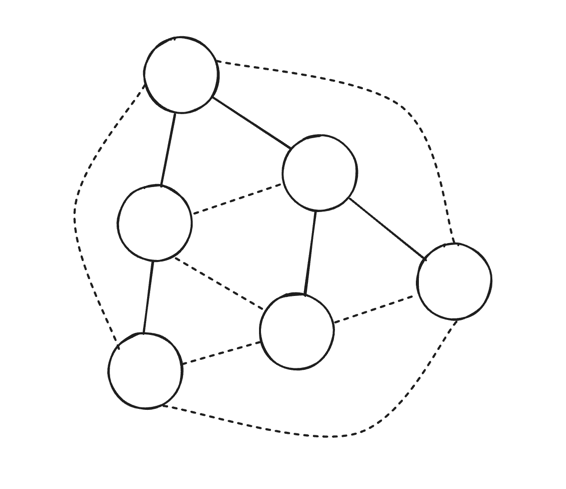

# 12장 안티-엔트로피와 배포

- 단일 노드의 성능이 처리율을 결정
- 클러스터의 구성(노드의 추가 및 삭제 여부)과 상태, 장애 발생 여부, 스키마 변경 등을 담고 있는 클러스터 관련 메타데이터는 데이터 레코드보다 더 빠르고 안정적으로 전달돼야 한다.
  - 메타데이터를 포함하는 메시지는 크기가 작고 자주 전송되지는 않지만 빠르고 안정적으로 전파돼야 한다.
- 메시지는 다음 3가지 방식으로 클러스터의 모든 노드로 전파될 수 있다.
1. 하나의 프로세스가 모든 노드에 메시지를 브로드캐스트한다.
2. P2P 방식으로 주기적으로 정보를 교환한다. 노드는 쌍으로 연결해 메시지를 교환한다.
3. 모든 수신자가 협력해 메시지를 브로드캐스트한다. 더 빠르고 안정적으로 전파할 수 있다.

- 클러스터에 노드가 많지 않다면 모든 프로세스에 브로드캐스트하는 방식이 가장 간단하다.
  - 노드가 많다면 통신 비용 증가, 단일 프로세스 의존성 증가로 인해 안정성이 줄어든다.
- 일부 업데이트 내역은 전파되지 않을 수 있다고 가정.
  - 코디네이터는 최대한 많은 노드에 메시지를 전달
  - 장애 발생 시 `안티-엔트로피 anti-entropy` 메커니즘이 노드를 최신 상태로 유지
- 엔트로피는 시스템의 `무질서 disorder`를 나타내는 속성
  - 분산 시스템에서는 노드 사이의 불일치 정도를 나타낸다. => 최소화해야 함.
- 안티-엔트로피 메커니즘은 기본 전송이 실패했을 때 노드를 최신 상태로 동기화
  - 코디네이터에 장애가 발생해도 다른 정상 노드가 계속해서 정보를 전파하기 때문에 시스템은 문제없이 작동할 수 있다.
  - 일관된 시스템의 동기화 시간을 단축
  - 누락 및 충돌이 발생한 레코드를 비교 & 조정 => 포그라운드 또는 백그라운드 프로세스로 실행 
- 백그라운드 프로세스: 머클 트리 등의 보조 자료 구조 활용해 로그를 업데이트하고 내용을 비교
- 포그라운드 프로세스: `힌트 핸드오프 hinted handoff`와 `읽기 복구 read repair` 등의 `피기백 piggyback` 방식의 메커니즘을 사용해 읽기와 쓰기 요청을 처리
- 데이터를 이중화하는 시스템에서 복제본의 상태가 일치하지 않는 경우 데이터를 동기화해 일관성을 보장하려면 레코드를 쌍으로 비교해 누락된 레코드를 복구해야 한다.
  - 데이터가 많으면 비용이 높다.
  - 두 노드의 데이터를 모두 읽고 비교해 전파되지 않은 최신 변경 사항을 다른 노드에 알려줘야 한다.

## `읽기 복구 read repair`

- 복제본의 차이는 읽는 동안 감지하는 편이 가장 쉽다.
  - 모든 복제 노드에 같은 데이터를 요청하고 결과가 같은지 확인
  - 성능을 위해 클라이언트가 요청한 레코드만 요청
- 코디네이터는 낙관적으로 모든 복제본이 동기화된 상태라고 가정하고 분산 데이터를 읽는다.
  - 일치하지 않는 경우 누락된 변경 사항을 해당 복제 노드로 전송
- `다이나모 Dynamo` 방식의 일부 데이터베이스는 모든 복제 노드에 질의하지 않고 시스템의 일관성 수준을 조정
  - 필요한 수의 노드에만 질의 => 일부 노드의 데이터는 최신 상태가 아닐 수 있다.
- Blocking: 클라이언트는 코디네이터가 복제본을 모두 복구할 때까지 기다려야 한다.
  - 단조 읽기 보장 (쿼럼 사용) -> 시스템의 가용성이 낮아진다.
- Non-Blocking: 사용자에게 결과를 반환한 뒤에 복구 작업 수행
- 일부 데이터베이스(ex. 카산드라)는 특수한 반복자와 `병합 리스너 merge listener`를 사용해 복제본 사이에 정확히 어떤 레코드가 누락됐는지 파악
  - 코디네이터는 병합한 데이터와 각 인풋을 비교해 누락된 내용을 복제 노드로 보낸다.

## 다이제스트 읽기 

- 전체 스냅샷 대신 해당 데이터의 해시 값을 반환
- 모든 다이제스트가 일치하면 모든 복제 노드는 동기화된 상태라고 확신
  - 다이제스트가 불일치하면 어떤 노드가 최신 상태인지 알 수 없다. => 읽기를 요청하고 데이터를 비교한 뒤 누락된 부분을 전송

## `힌트 핸드오프 hinted handoff`

- 쓰기 중 상태를 복구하는 안티-앤트로피 메커니즘을 뜻한다.
- 대상 노드가 쓰기 요청에 응답하지 않으면 코디네이터 또는 복제 노드 중 하나에 특수 힌트 레코드를 저장한다.
  - 노드가 복구되면 힌트 레코드를 참조해 쓰기를 재시도
- 카산드라는 일관성 레벨을 `ANY`로 설정하지 않은 경우 힌트 레코드는 복제 팩터에 포함되지 않는다.
  - 힌트 레코느느 읽을 수 없고 뒤처진 노드를 최신 상태로 업데이트하는 용도로만 사용되기 때문
- `리악 Riak`과 같은 데이터베이스는 `슬로피 쿼럼 sloppy quorum`과 힌트 핸드오프 방식을 사용
  - 일부 복제 노드에 장애가 발생 -> 전체 노드 목록에서 다른 정상 노드를 선택해 읽기를 수행
  - 반드시 연산 대상 노드를 선택하지 않아도 된다.
  - 선택된 정상 노드의 메타데이터에 힌트 레코드를 저장해놓고, 장애가 발생한 노드가 복구되면 힌트를 전달한다. 힌트를 수행하면 힌트 레코드를 삭제한다.
- 슬로피 쿼럼은 고가용성을 위해 일관성을 포기하는 방식이다.

## 머클 트리

- 자주 요청되지 않는 데이터의 불일치 감지와 복구
- 쌍으로 교환하고 비교하는 방식은 실용성이 낮고 비용도 높다.
- 이 비용을 줄이기 위해 많은 데이터베이스가 `머클 트리 Merkle Trees`를 사용한다.
- 머클 트리는 데이터를 컴팩트한 해시 형태로 변환해 로컬에 저장하는 자료 구조이다.
  - 데이터 레코드가 저장된 테이블을 스캔하고 데이터 범위를 해시 값으로 트리의 최하위 레벨에 저장한다.
  - 계층적인 구조. 트리 노드의 포인터를 따라 레벨을 내려갈수록 비교 범위가 줄어든다. 혹은 트리 전체나 레벨 단위로 서브트리를 교환해 비교할 수 있다.
- 두 복제본의 일치 여부는 머클 트리 루트의 해시 값만 비교해도 알 수 있다.
  - 루트에서부터 최하위 레벨가지 해시 값 쌍을 비교하면 데이터가 일치하지 않는 범위를 찾을 수 있다.
- 최하위 레벨부터 상향식으로 해시를 계산 => 데이터가 변경되면 해당 서브트리를 다시 계산해야 한다.
  - 트리의 크기(교환되는 메시지 크기)와 정확도(레코드의 범위) 사이의 trade-off도 존재.

## `비트맵 버전 벡터 bitmap version vector`

- `최근성 recency`을 기반으로 데이터 사이의 불일치를 해결
- 각 노드는 로컬에서 수행한 작업과 다른 노드에서 복제한 데이터에 대한 로그를 저장한다.
  - 안티-엔트로피 단계에서 두 노드의 로그를 비교하고 누락된 데이터를 해당 노드에 복제한다.
- 각각의 쓰기 연산은 한 노드가 코디네이션을 맡게 되며, 이를 `dot(i, n)`으로 표현
  - 노드 `n`이 코디네이션을 맡은 일련번호가 `i`인 이벤트라는 의미
  - 일련번호는 노드마다 따로 붙이면 1로 시작해서 해당 노드가 쓰기 연산을 수행할 때마다 순차적으로 증가
- 노드 복제본 상태는 노드별 논리적 클럭을 사용해 추적할 수 있다.
  - 각 클럭은 직접 쓰기 연산과 간접 쓰기 연산을 나타내는 `dot`들의 집합
- 다른 노드에서 변경 사항이 복제되지 않은 경우 클럭에 간격이 발생
  - 노드끼리 논리적 클럭을 교환해 닷이 비어 있는 간격을 파악한 다음 서로의 간격에 해당되는 데이터 레코드를 복제
  - 닷이 참조하는 데이터 레코드들을 재생성 => 닷을 해당 키의 인과 정보와 매핑하는 `DCC(Dotted Causal Container)`라는 곳에 저장. 인과관계를 파악해 충돌을 해결.

## 가십 전파

> 집단은 심리적 전염병의 온상이다.
> - 칼 융

- 브로드캐스트의 전파력과 안티-엔트로피의 신뢰성을 모두 갖춘 `가십 gossip` 프로토콜을 사용하면 변경 사항을 모든 노드에 전파할 수 있다.
- 하나의 프로세스에서 클러스터 전체로 정보를 협동해서 전파. 자발성을 기반으로 목적을 달성.
- 레코드가 전파된 프로세스는 `감염 infective` 상태라고 한다.
- 아직 데이터가 전파되지 않은 프로세스는 `감염 대상 susceptible` 상태라고 한다. => default
- 데이터를 전파하는 감염 프로세스가 전파를 중단하는 경우 `회복 removed` 상태가 된다.
- 토폴로지에 포함되지 않는 동질적 탈중앙 시스템에서 비동기적 메시지를 전달할 때 사용할 수 있다.  
- 코디네이션이 불필요. => 노드가 자유롭게 추가 및 제거되는 시스템 또는 `메시 mesh` 네트워크에서 유용

### 가십 메커니즘

- 주기적으로 `f`개 임의의 노드를 선택(`f`는 팬아웃을 뜻하는 설정 가능한 값)하고 최신 데이터를 교환
  - 선택된 노드에서 새로운 정보를 전달받은 노드는 이 정보를 다른 노드에 전파한다.
  - 확률적으로 선택하기 때문에 같은 노드가 여러 차례 선택될 수도, 같은 메시지가 반복적으로 여러 노드 사이에 전파되는 상황이 발생할 수 있다.
- 메시지 `중복성 redundancy`은 같은 메시지를 반복적으로 전달해 발생하는 오버헤드 (중복성은 가십의 원리에서 중요)
- 시스템이 수렴에 도달하는 데 걸리는 시간을 `레이턴시 Latency`
  - 수렴과 모든 노드에 메시지를 전달하는 것은 같지 않다. 모든 노드에 메시지를 전달했지만 가십은 짧은 시간 동안 계속해서 전파될 수 있다.
  - 대규모 시스템에서 레이턴시를 적정선으로 유지하기 위해 팬아웃을 높게 설정하지 않으면 레이턴시가 증가한다.
- 반복적으로 전달된 메시지는 중요성이 감소. 결국 노드는 해당 메시지를 더 이상 전파하지 않는다.
  - 전파 여부는 확률적으로 계산(각 단계마다 프로세스의 전파 중단 확률을 계산)하거나 임계값(중복 메시지의 수가 일정 수를 넘으면 전파 중단)을 기반으로 결정
  - 두 방법 모두 클러스터 크기와 팬아웃 고려

### 오버레이 네트워크

- 가십 프로토콜은 중요하고 유용하지만 적용 가능한 문제가 다양하지 않다.
- `비유행성 non-epidemic` 프로토콜을 사용하면 메시지 중복성을 낮추고 비확률적이고 일반적으로 좀 더 최적의 방법으로 메시지를 전파할 수 있다.
- 가십 알고리즘 장점: 확장성 높음, `logN` 번의 라운드 내에 메시지 전파
- 하지만 전파 단계에서 생성되는 중복 메시지의 수를 반드시 고려
  - 가십 기반 프로토콜에서 신뢰성을 보장하기 위해 메시지 중복은 불가피
- 임의로 노드를 선택하면 시스템의 `강건성 robustness`을 대폭 높일 수 있다.
  - 네트워크 파티션이 발생해도 프로세스 사이의 간접적인 링크를 통해 메시지는 결국 전달된다.
  - 하지만 강건성을 위해 노드 사이에 불필요한 연결을 유지하고 메시지를 중복 전송해야 한다.
- 임의의 노드를 선택하는 대신 가십 시스템 내에 임시로 고정된 토폴로지를 정의하는 방법도 있다.
  - 주변 노드를 샘플링하고 근접성을 기반으로 최적의 노드를 선택해 `오버레이 네트워크 overlay network`를 구성한다.
- 시스템의 토폴로지는 `스패닝 트리 spanning tree`를 사용해 표현할 수 있다.
  - 스패닝 트리는 비방향성 간선으로 구성된 루프가 존재하지 않는 그래프.
  - 네트워크 구성을 표현할 수 있는 자료 구조.

1. 모든 간선을 사용하지 않고 모든 노드를 연결할 수 있다.
2. 하나의 링크만 끊어져도 서브트리와의 연결이 끊길 수 있다.

- 단점: 서로에 대한 선호도가 높은 여러 노드로 구성된 집단이 형성

### 혼합형 가십 프로토콜

- `플럼트리 Plumtree, Puash/lazy-push multicast tree`는 가십 기반 전파 방식과 트리 기반 브로드캐스트 방식을 모두 사용하는 혼합형 가십 프로토콜
  - 스패닝 트리 오버레이를 구성하고 최소한의 오버헤드로 노드에 메시지를 전파
  - 노드는 `피어 샘플링 서비스 peer sampling service`가 지정한 소규모 노드 집단에 메시지를 전달
- 노드는 집단의 구성원에 메시지를 전송하고 집단에 포함되지 않은 나머지 노드에는 `게으르게 lazily` 메시지 ID를 전달한다.
  - 새로운 메시지 ID를 전달받은 노드는 주변 노드에 질의해 해당 메시지를 가져온다. 이 단계를 `레이지-푸시 lazy-push`라고 하며 이를 통해 높은 신뢰성을 보장하고 신속하게 브로드캐스트 트리를 복구할 수 있다.
  - 플럼트리는 장애 발생 시 레이지-푸시 방식의 가십 전파 방식을 사용해 메시지를 브로드캐스트하고 오버레이를 재구성한다.

- 점선은 레이지 가십 네트워크, 실선은 브로드캐스트 트리

### 부분 뷰

- 모든 노드에 메시지를 브로드캐스트하고 전체 클러스터의 상태를 계속해서 파악하는 것은 비효율적.
  - 특히 노드의 `이탈률 churn`이 높다면 더 그렇다.
  - 이 문제를 해결하기 위해 피어 샘플링 서비스 사용. `부분 뷰 partial view` 가십을 통해 주기적으로 갱신 및 유지
- `혼합형 부분 뷰 HyParView(Hybrid Partial View)` 프로토콜은 각 노드별로 클러스터의 작은 액티브 뷰와 큰 패시브 뷰를 유지한다.
  - 액티브 뷰: 메시지 전파를 위한 오버레이 구성
  - 패시브 뷰: 액티브 뷰에서 장애가 발생한 노드를 대체할 노드의 목록으로 사용
- 노드들은 주기적으로 액티브와 패시브 뷰를 교환하는 셔플 작업 수행
  - 이 과정에서 각 노드는 자신의 패시브 뷰에 전달받은 액티브 뷰와 패시브 뷰의 노드를 추가
  - 목록의 크기를 제한하기 위해 목록에서 오래된 노드는 제거
- 액티브 뷰는 구성 노드의 상태와 주변 노드의 요청에 따라 업데이트
  - 액티뷰 뷰가 가득찬 경우 상태에 따라 연결을 거부할 수 있다.

