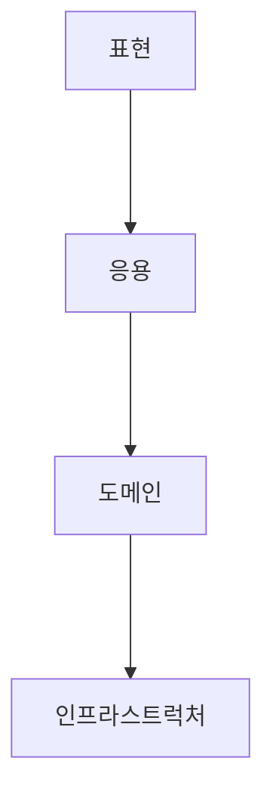
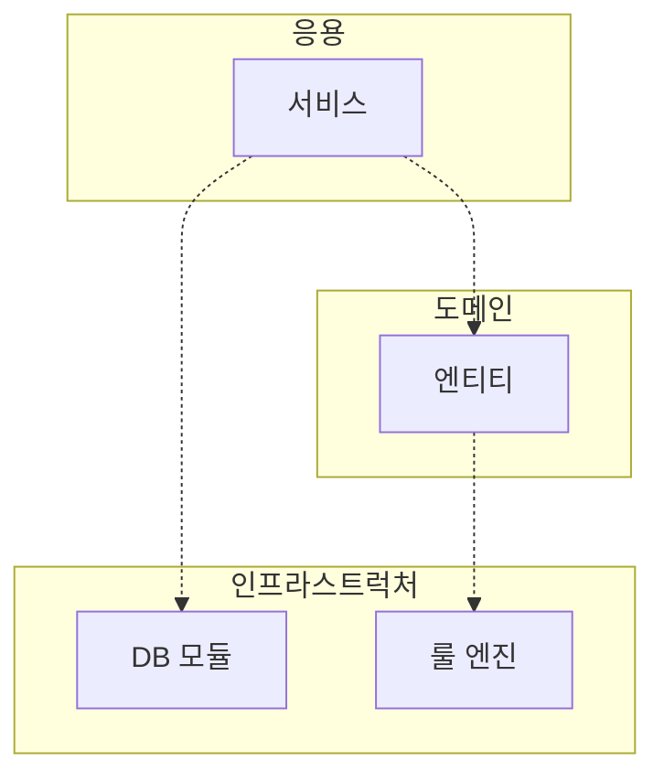
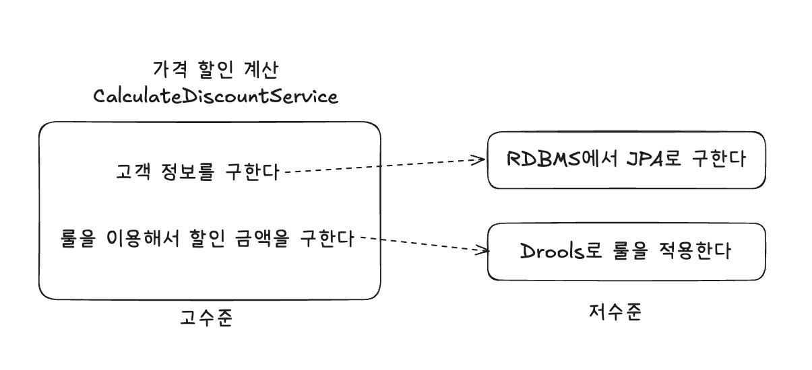
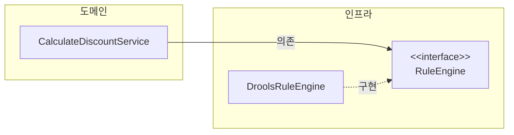
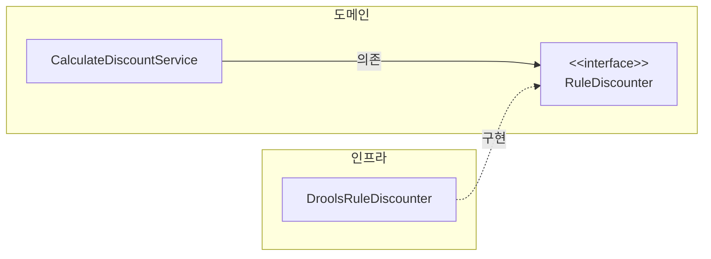
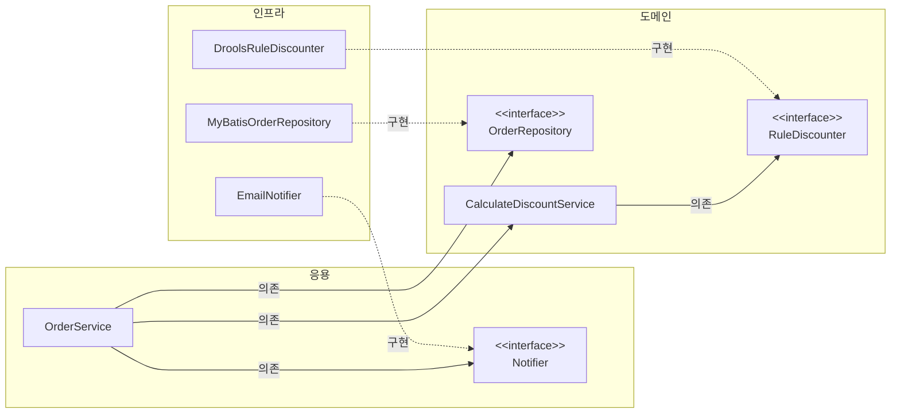
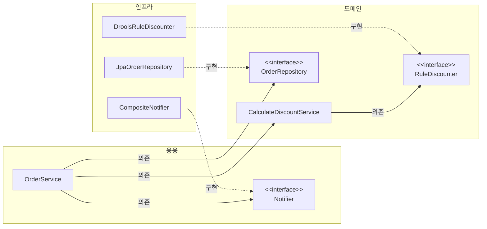
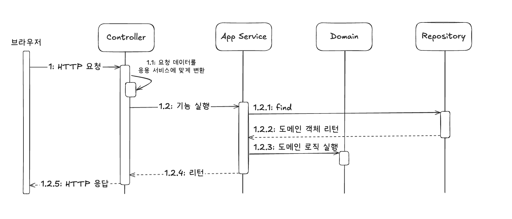

# 02 아키텍처 개요

## 1. 네 개의 영역

- 표현, 응용, 도메인, 인프라스트럭처
- 스프링 MVC 프레임워크
  - 표현: 컨트롤러
  - 응용: 서비스
  - 도메인: 엔티티, 밸류
  - 인프라스트럭처: SQL, NOSQL, 이벤트 큐, 외부 API

----

## 2. 계층 구조 아키텍처

- 계층 구조의 아키텍처 구성

- 전형적인 계층 구조상 의존 관계

- 응용과 도메인은 DB나 외부 시스템 연동을 위해 인프라스트럭처의 기능을 사용하므로 이런 계층 구조를 사용하는 것은 직관적으로 이해하기 쉽다.
  - 하지만 짚고 넘어가야 할 것이 있다.
  - 바로 표현, 응용, 도메인 계층이 상세한 구현 기술을 다루는 인프라스트럭처 게층에 종속된다는 점이다.
- 이 문제를 해소하려면? DIP를 사용하면 된다.

----

## 3. DIP

- 고수준 모듈은 의미 있는 단일 기능을 제공하는 모듈
- 여기서 `CalculateDiscountService`는 '가격 할인 계산'이라는 기능을 구현하는 고수준 모듈.
- 고수준 모듈의 기능을 구현하려면 여러 하위 기능이 필요하다.
  - 저수준 모듈은 하위 기능을 실제로 구현한 것이다.
- 그런데 고수준 모듈이 저수준 모듈을 사용하면 두 가지 문제가 발생한다.
1. 구현 변경이 어렵다.
2. 테스트가 어렵다.

- DIP는 이 문제를 해결하기 위해 저수준 모듈이 고수준 모듈에 의존하도록 바꾼다.
  - DIP를 적용하면 앞의 다른 영역이 인프라스트럭처 영역에 의존할 때 발생했던 두 가지 문제인 구현 교체가 어렵다는 것과 테스트가 어려운 문제를 해소할 수 있다.
  - 스프링과 같은 의존성 주입을 지원하는 프레임워크를 사용하면 설정 코드를 수정해서 쉽게 구현체를 변경하는 것도 가능하다.
  - 또한 테스트를 할 때는 인터페이스를 활용해 테스트 대역을 만들어 사용할 수 있으므로 testability가 향상된다.

### 3-1. DIP 주의사항

- DIP를 잘못 생각하면 단순히 인터페이스와 구현 클래스를 분리하는 정도로 받아들일 수 있다.
  - DIP의 핵심은 고수준 모듈이 저수준 모듈에 의존하지 않도록 하기 위함인데, DIP를 적용한 결과 구조만 보고 아래와 같이 저수준 모듈에서 인터페이스를 추출하는 경우가 있다.

- 잘못된 구조이다.
- 도메인 영역이 구현 기술을 다루는 인프라스트럭처 영역에 의존하고 있다.
  - 여전히 고수준 모듈이 저수준 모듈에 의존하고 있는 것이다.

- DIP를 적용할 때 하위 기능을 추상화한 인터페이스는 고수준 모듈 관점에서 도출한다.
- `CalculateDiscountService` 입장에서 할인 금액을 구하기 위해 룰 엔진을 사용하는지 직접 연산하는지는 중요하지 않다.
  - 단지 규칙에 따라 할인 금액을 계산한다는 것이 중요할 뿐이다.
  - 따라서 '할인 금액 계산'을 추상화한 인터페이스는 저수준 모듈이 아닌 고수준 모듈에 위치한다.

### 3-2. DIP와 아키텍처

- 인프라스트럭처 영역은 구현 기술을 다루는 저수준 모듈이고, 응용과 도메인은 고수준 모듈이다.
- DIP를 적용한 구조를 살펴보자.

- 만약 Notifier에 SMS를 추가하고, Repository를 JPA로 바꾸고 싶다면 아래와 같이 인프라스트럭처에 구현체를 추가하기만 하면 된다.

- 응용 영역과 도메인 영역에 영향을 최소화하면서 구현체를 변경하거나 추가할 수 있다!

----

## 4. 도메인 영역의 주요 구성요소

- 도메인 영역의 주요 구성요소

| 요소             | 설명                                                                                                                                              |
|:---------------|:------------------------------------------------------------------------------------------------------------------------------------------------|
| Entity         | 고유 식별자를 갖는 객체로 자신의 라이프 사이클을 갖는다. 도메인의 고유한 개념을 표현한다. 도메인 모델의 데이터를 포함하며 해당 데이터와 관련된 기능을 함께 제공한다.  ex) `주문 Order`, `회원 Member`, `상품 Product` 등 |
| Value          | 고유의 식별자를 갖지 않는 객체로 주로 개념적으로 하나인 값을 표현할 때 사용된다. 엔티티의 속성으로 사용할 뿐만 아니라 다른 Value 타입의 속성으로도 사용할 수 있다.  ex) `주소 Address`, `금액 Money`              |
| Aggregate      | 연관된 Entity와 Value 객체를 개념적으로 하나로 묶은 것. ex) `Order`, `OrderLine`, `Orderer`를 주문 애그리거트로 묶을 수 있다.                                               |
| Repository     | 도메인 모델의 영속성을 처리한다. 예를 들어 DBMS 테이블에서 Entity 객체를 로딩하거나 저장하는 기능을 제공한다.                                                                             |
| Domain Service | 특정 Entity에 속하지 않는 도메인 로직을 제공한다. 도메인 로직이 여러 Entity와 Value를 필요로 하면 도메인 서비스에서 로직을 구현한다.                                                            |

### 4-1. Entity와 Value

- 도메인 모델의 Entity와 DB 관계형 모델의 Entity는 같은 것이 아니다.
- 차이점
  - Entity는 데이터와 함께 도메인 기능을 함께 제공한다. 도메인 관점에서 기능을 구현하고 기능 구현을 캡슐화해서 데이터가 임의로 변경되는 것을 막는다.
  - 또한 두 개 이상의 데이터가 개념적으로 하나인 경우 Value 타입을 이용해 표현할 수 있다. RDBMS와 같은 관계형 데이터베이스는 Value 타입을 제대로 표현하기 어렵다.

### 4-2. 애그리거트

- 규모가 커질수록 도메인 모델의 구성요소는 복잡해진다.
- 상위 수준에서 모델을 볼 수 있어야 전체 모델의 관계와 개별 모델을 이해하는 데 도움이 된다.
  - 도메인 모델에서 전체 구조를 이해하는 데 도움이 되는 것이 바로 `애그리거트 Aggregate`다.
- 애그리거트를 사용하면 개별 객체가 아닌 관련 객체를 묶어서 객체 군집 단위로 모델을 바라볼 수 있게 된다.
  - 개별 객체 간의 관계가 아닌 애그리거트 간의 관계로 도메인 모델을 이해하고 구현하게 되며, 이를 통해 큰 틀에서 도메인 모델을 관리할 수 있다.
- 애그리거트는 군집에 속한 객체를 관리하는 Root Entity를 갖는다.
  - Root Entity는 애그리거트에 속해 있는 Entity와 Value 객체를 이용해서 애그리거트가 구현해야 할 기능을 제공한다.
  - 애그리거트를 사용하는 코드는 애그리거트 루트가 제공하는 기능을 실행하고 애그리거트 루트를 통해서 간접적으로 애그리거트 내의 다른 Entity나 Value 객체에 접근한다.
  - 이것은 애그리거트의 내부 구현을 숨겨서 애그리거트 단위로 구현을 캡슐화할 수 있도록 돕는다.
- 애그리거트를 구현할 때는 고려할 것이 많다. 
  - 애그리거트를 어떻게 구성했느냐에 따라 구현이 복잡해지기도 하고, 트랜잭션의 범위가 달라지기도 한다.
  - 또한 선택한 구현 기술에 따라 애그리거트 구현에 제약이 생기기도 한다.

### 4-3. 리포지터리

- 도메인 객체를 지속적으로 사용하기 위한 물리적인 저장소. Repository.
  - Entity나 Value가 요구사항에서 도출되는 도메인 모델이라면 Repository는 구현을 위한 도메인 모델이다.
- Repository는 애그리거트 단위로 도메인 객체를 저장하고 조회하는 기능을 정의한다.
  - Root Entity는 애그리거트에 속한 모든 객체를 포함하고 있으므로 결과적으로 애그리거트 단위로 저장하고 조회한다.
- 도메인 모델을 사용해야 하는 코드는 Repository를 통해서 도메인 객체를 구한 뒤에 도메인 객체의 기능을 실행한다.
  - 도메인 모델 관점에서 Repository는 도메인 객체를 영속화하는 데 필요한 기능을 추상화한 것으로 고수준 모듈에 속한다.
  - 반면 이를 구현한 클래스는 저수준 모듈로 인프라스트럭처 영역에 속한다.
- 응용 서비스와 Repository는 밀접한 연관이 있다.
  - 응용 서비스는 필요한 도메인 객체를 구하거나 저장할 때 Repository를 사용한다.
  - 응용 서비스는 트랜잭션을 관리하는데, 트랜잭션 처리는 Repository 구현 기술의 영향을 받는다.
- Repository는 사용하는 주체가 응용 서비스이기 때문에 Repository는 응용 서비스가 필요로 하는 메소드를 제공한다. 다음 두 메소드가 기본이 된다.
  - 애그리거트를 저장하는 메소드
  - 애그리거트 루트 식별자로 애그리거트를 조회하는 메소드

----

## 5. 요청 처리 흐름

----

## 6. 인프라스트럭처 개요

- `인프라스트럭처 infrastructure`는 표현 영역, 응용 영역, 도메인 영역을 지원한다.
- 도메인 객체의 영속성 처리, 트랜잭션, SMTP 클라이언트, REST 클라이언ㅌ으 등 다른 영역에서 필요로 하는 프레임워크, 구현 기술, 보조 기능을 지원한다.
- DIP를 활용해 인터페이스를 정의하고 인프라스트럭처 영역에서 구현하는 것이 시스템을 유연하고 테스트하기 쉽게 만들어준다.
  - 그러나 무조건 인프라스트럭처에 대한 의존을 없앨 필요는 없다.
  - ex) 스프링의 `@Transactional`, `@Entity`, `@Table` 등
- 구현의 편리함은 DIP가 주는 장점만큼 중요하기 때문에 DIP의 장점을 해치지 않는 범위에서 응용 영역과 도메인 영역에서 구현 기술에 대한 의존성을 가져가는 것이 나쁘지 않다.
  - 응용 영역과 도메인 영역에서 인프라스트럭처에 대한 의존을 완전히 갖지 않도록 시도하는 것은 자칫 구현을 더 복잡하고 어렵게 만들 수 있다.

----

## 7. 모듈 구성

- 패키지 구성 규칙에 정답이 존재하는 것은 아니다.
- 도메인이 크면 하위 도메인으로 나누고 각 하위 도메인마다 별도 패키지를 구성한다.
- 도메인 모듈은 도메인이 속한 애그리거트를 기준으로 다시 패키지를 구성한다.
- 모듈 구조를 얼마나 세분화해야 하는지에 대해 정해진 규칙은 없다. 한 패키지에 너무 많은 타입이 몰려서 코드를 찾을 때 불편한 정도만 아니면 된다.
  - ex) 한 패키지에 10~15개 미만으로 타입 개수 유지

----

# 참고자료

- 도메인 주도 개발 시작하기, 최범균 지음
