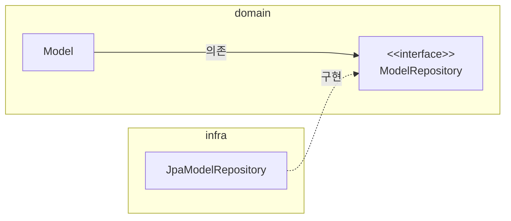
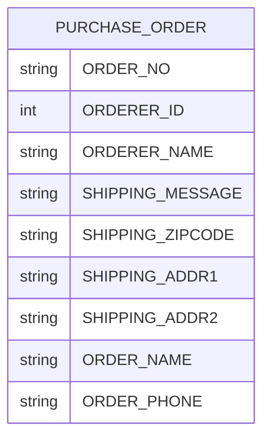
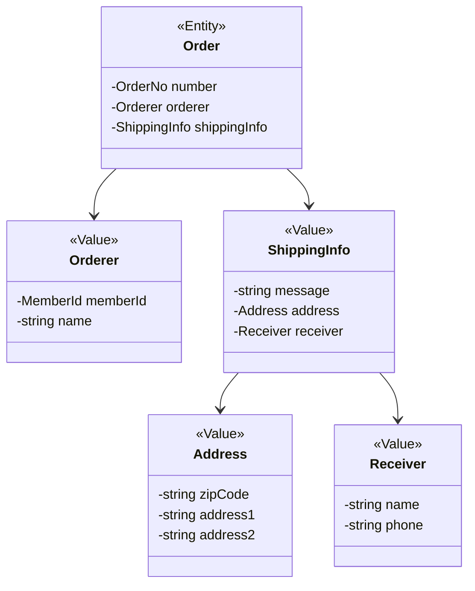
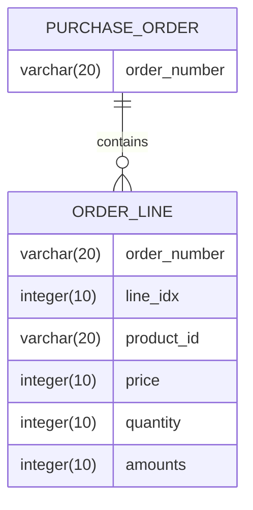
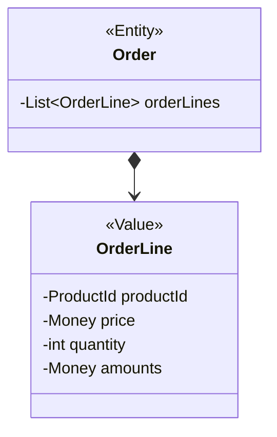
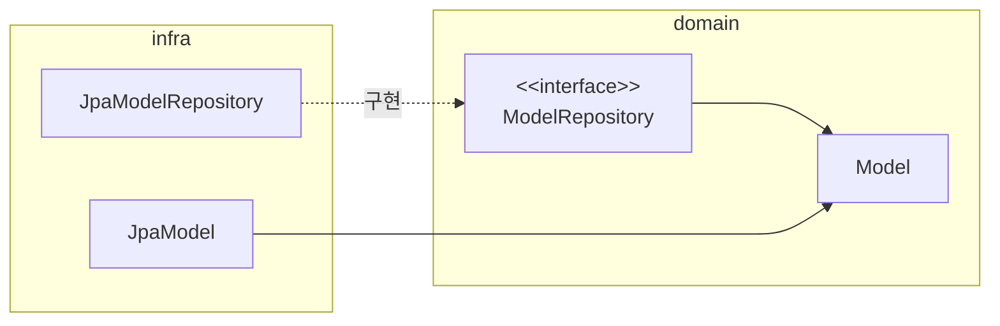

# 04 리포지터리와 모델 구현

## 1. 개요

- 애그리거트를 어떤 저장소에 저장하느냐에 따라 리포지터리를 구현하는 방법이 다르다.
  - 도메인 모델과 리포지터리를 구현할 때 선호하는 기술은 역시 JPA.
  - 데이터 보관소로 RDBMS를 사용할 때, 객체 기반의 도메인 모델과 관계형 데이터 모델 간의 매핑을 처리하는 기술로 ORM 만한 것이 없다.

### 1-1. 모듈 위치



- 가능하면 Repository 구현 클래스를 인프라스트럭처 영역에 위치시켜서 인프라스트럭처에 대한 의존을 낮춰야 한다.

### 1-2. 리포지터리 기본 구현

- Repository가 제공하는 기본 기능은 다음 두 가지다.
1. ID로 애그리거트 조회하기
2. 애그리거트 저장하기

- 인터페이스는 애그리거트 루트를 기준으로 작성한다.
- 조회 네이밍 => `findBy프로퍼티이름`


----

## 2. 스프링 데이터 JPA를 이용한 리포지터리 구현

- 생략

----

## 3. 매핑 구현

### 3-1. Entity와 Value 기본 매핑 구현

- 애그리거트와 JPA 매핑을 위한 기본 규칙은 다음과 같다.
  - 애그리거트 루트는 Entity이므로 `@Entity`로 매핑 설정한다.
- 한 테이블에 Entity와 Value 데이터가 같이 있다면
  - Value는 `@Embeddeable`로 매핑한다.
  - Value 타입 프로퍼티는 `@Embedded`로 매핑 설정한다.
- 아래와 같이 하나의 테이블은 여러 객체로 매핑되어 사용될 때가 많다.



- 여러 객체로 매핑했을 때!



### 3-2. 기본 생성자

- JPA에서 `@Entity`와 `@Embeddable`로 클래스를 매핑하려면 기본 생성자를 제공해야 한다.
  - DB에서 데이터를 읽어와 매핑된 객체를 생성할 때 기본 생성자를 사용해서 객체를 생성하기 때문이다.
  - 불변 타입의 필드에 `final`을 사용할 수가 없다.
- 기본 생성자는 JPA 프로바이더가 객체를 생성할 때만 사용하도록 해야하므로 밖에서 사용하지 못하게 생성자의 접근 제한자를 `protected`로 하는  것이 좋다.

### 3-3. 필드 접근 방식 사용

- 불필요한 get/set을 사용하지 말자.
- 의미가 드러나는 메소드명을 사용하자.

### 3-4. `AttributeConverter`를 이용한 밸류 매핑 처리

- 두 개 이상의 프로퍼티를 가진 밸류 타입을 한 개 칼럼에 매핑하려면 `@Embeddable` 어노테이션으로 처리할 수 없다.
  - 이럴 때 사용하는 것이 `AttributeConverter`이다.

### 3-5. 밸류 컬렉션: 별도 테이블 매핑

- 예를 들어 `Order` Entity는 한 개 이상의 `OrderLine`을 가질 수 있다.
  - `OrderLine`에 순서가 있다면 다음과 같이 `List` 타입을 이용해서 컬렉션을 프로퍼티로 지정할 수 있다.

```java
public class Order {
  private List<OrderLine> orderLines;
}
```

- `Order`와 `OrderLine`을 저장하기 위한 테이블을 아래와 같이 매핑 가능하다.





- Value Collection을 별도 테이블로 매핑할 때는 `@ElementCollection`과 `@CollectionTable`을 함께 사용한다.

```java
@Entity
@Table(name = "purchase_order")
public class Order {
  @EmbeddedId
  private OrderNo number;
  
  @ElementCollection(fetch = FetchType.EAGER)
  @CollectionTable(
      name = "order_line",
      joinColumns = @JoinColumn(name = "order_number"))
  @OrderColumn(name = "line_idx")
  private List<OrderLine> orderLines;
}

@Embeddable
public class OrderLine {
  @Embedded
  private ProductId productId;
  
  @Column(name = "price")
  private Money price;
  
  @Column(name = "quantity")
  private int quantity;
  
  @Column(name = "amounts")
  private Money amounts;
}
```

- `OrderLine`의 매핑을 함께 표시했는데 `OrderLine`에는 `List`의 인덱스 값을 저장하기 위한 프로퍼티가 존재하지 않는다.
  - 그 이유는 `List` 타입 자체가 인덱스를 갖고 있기 때문이다.
  - JPA는 `@OrderColumn` 어노테이션을 이용해서 지정한 칼럼에 리스트의 인덱스 값을 저장한다.
- `@CollectionTable`은 Value를 저장할 때 테이블을 지정한다.

### 3-6. 밸류 컬렉션: 한 개 칼럼 매핑

- 밸류 컬렉션을 별도 테이블이 아닌 한 개 칼럼에 저장해야 할 때가 있다.
  - ex) 한 개의 칼럼에 쉼표를 구분자로 이메일 주소 목록을 가지고 있을 때.
  - 이때 `AttributeConverter`를 사용하면 밸류 컬렉션을 한 개 칼럼에 쉽게 매핑할 수 있다.

```java
public class EmailSet {
  private Set<Email> emails = new HashSet();
  
  public EmailSet(Set<Email> emails) {
    this.emails.addAll(emails);
  }
  
  public Set<Email> getEmails() {
    return Collections.unmodifialbeSet(emails);
  }
}
```

```java
public class EmailConverter implements AttributeConverter<EmailSet, String> {
  @Override
  public String convertToDatabaseColumn(EmailSet attribute) {
    if (attribute == null) return null;
    return attribute.getEmails().stream()
            .map(email -> email.getAddress())
            .collect(Collectors.joining(","));
  }
  
  @Override
  public EmailSet convertToEntityAttribute(String dbData) {
    if (dbData == null) return null;
    String[] emails = dbData.split(",");
    Set<Email> emailSet = Arrays.stream(emails)
            .map(value -> new Email(value))
            .collect(toSet());
    return new EmailSet(emailSet);
  }
}
```

- 이제 `Converter`를 활용해 매핑해보자.

```java
@Column(name = "emails")
@Convert(converter = EmailSetConverter.class)
private EmailSet emailSet;
```

### 3-7. 밸류를 이용한 ID 매핑

- 식별자라는 의미를 부각시키기 위해 식별자 자체를 밸류 타입으로 만들 수도 있다.
  - `@Id` 대신 `@EmbeddedId` 어노테이션을 사용한다.
- JPA에서 식별자 타입은 `Serializable` 타입이어야 하므로 사용할 Value 타입은 `Serializable` 인터페이스를 상속받아야 한다.
- 식별자를 Value 타입으로 만들었을 때의 장점은 식별자에 기능을 추가할 수 있다는 점이다.
- JPA는 내부적으로 Entity를 비교할 목적으로 `equals()` 메소드와 `hashcode()` 값을 사용하므로 식별자로 사용할 Value 타입은 이 두 메소드를 알맞게 구현해야 한다.

### 3-8. 별도 테이블에 저장하는 Value 매핑

- 애그리거트에서 Root Entity를 뺀 나머지 구성요소는 대부분 Value이다.
  - Root Entity 외에 다른 Entity가 있다면 진짜 Entity인지 의심해 봐야 한다.
  - 단지 별도 테이블에 데이터를 저장한다고 해서 Entity인 것은 아니다.
  - 주문 애그리거트에서도 `OrderLine`을 별도 테이블에 저장하지만 `OrderLine` 자체는 Entity가 아니라 Value다.
- Value가 아니라 Entity가 확실하다면 해당 엔티티가 다른 애그리거트는 아닌지 확인해야 한다.
  - 특히 자신만의 독자적인 라이프 사이클을 갖는다면 구분되는 애그리거트일 가능성이 높다.
- 애그리거트에 속한 객체가 Value인지 엔티티인지 구분하는 방법은 고유 식별자를 갖는지를 확인하는 것이다.
  - 하지만 식별자를 찾을 때 매핑되는 테이블의 식별자를 애그리거트 구성요소의 식별자와 동일한 것으로 착각하면 안 된다.
  - 별도의 테이블에 저장하고 테이블에 PK가 있다고 해서 테이블과 매핑되는 애그리거트 구성요소가 항상 고유 식별자를 갖는 것은 아니기 때문이다.
- Value를 매핑 한 테이블을 지정하기 위해 `@SecondaryTable`과 `@AttributeOverride`를 사용할 수 있다.

```java
@Entity
@Table(name = "article")
@SecondaryTable(
    name = "article_content",
    pkJoinColumns = @PrimaryKeyJoinColumn(name = "id")
)
public class Article {
  //...
  
  @AttributeOverrides({
      @AttributeOverride(
          name = "content",
          column = @Column(table = "article_content", name = "content")),
      @AttributeOverride(
          name = "contentType",
          column = @Column(table = "article_content", name = "content_type")),
  })
  @Embedded
  private ArticleContent content;
}
```

### 3-9. Value Collection을 `@Entity`로 매핑하기

- 개념적으로 Value인데 구현 기술의 한계나 팀 표준 때문에 `@Entity`를 사용해야 할 때도 있다.
- 이때는 상속 매핑을 사용하면 된다.
  - `@Inheritance`와 `@DiscriminatorColumn` 등을 사용.

> #### 라이프 사이클
> - 라이프 사이클에 따라 
> - 만약 `@Entity`로 나눠져 있더라도 하나의 객체가 루트에 완전히 의존하여 라이프 사이클을 같이 한다면 함께 생성하고 삭제해야 한다. 
>   - hard delete: `orphanRemoval`을 true로 둔다.
>   - soft delete: 루트 deleted_at 체크 시, 함께 체크하는 로직 포함.

- Entity 컬렉션 객체의 `clear()`를 호출하면 삭제 로직이 실행되지만 N+1 문제가 발생한다. (식별자 조건문으로 하나씩 delete 쿼리를 실행하기 때문이다. )
- 하이버네이트는 `@Embeddable` 타입에 대한 컬렉션의 `clear()` 메소드를 호출하면 컬렉션에 속한 객체를 로딩하지 않고 한 번의 `delete` 쿼리로 삭제 처리를 수행해준다.
  - 따라서 애그리거트의 특성을 유지하면서 이 문제를 해소하려면 상속을 포기하고 `@Embeddable`로 매핑된 단일 클래스로 구현해야 할 수도 있다. => `if-else`문 사용.
  - 다형성 vs 성능

### 3-10. ID 참조와 조인 테이블을 이용한 단방향 M-N 매핑

- 애그리거트 간 연관관계는 피해야 하지만, 그럼에도 불구하고 요구사항을 구현하는 데 집합 연관을 사용하는 것이 유리하다면 ID 참조를 이용한 단방향 집합 연관을 적용해 볼 수 있다.

```java
@Entity
@Table(name = "product")
public class Product {
  @EmbeddedId
  private ProductId productId;
  
  @ElementCollection
  @CollectionTable(
      name = "product_category",
      joinColumns = @JoinColumn(name = "product_id"))
  private Set<CategoryId> categoryIds;
}
```

----

## 4. 애그리거트 로딩 전략

- JPA 매핑을 설정할 때 항상 기억해야 할 점은 애그리거트에 속한 객체가 모두 모여야 완전한 하나가 된다는 것이다.
- 조회 시점에 애그리거트를 완전한 상태가 되도록 하려면 애그리거트 루트에서 연관 매핑의 조회 방식을 즉시 로딩으로 설정하면 된다.
  - 하지만 이것이 항상 좋은 것은 아니다.
  - ex) 카테시안 곱의 문제 => 하이버네이트가 중복된 데이터를 알맞게 제거해주기는 하지만, DB에서는 엄청나게 많은 양의 row를 리턴하게 될 수 있다. => 속도 느려짐.
  - 또한 `@Entity`나 `@Embeddable`에 대해 다르게 동작하고, JPA 프로바이더에 따라 구현 방식이 다를 수도 있다.
- 일반적인 애플리케이션은 상태 변경 기능을 실행하는 빈도보다 조회 기능을 실행하는 빈도가 훨씬 높다.
  - 그러므로 애그리거트 내의 모든 연관을 즉시 로딩으로 설정할 필요는 없다.
- 애그리거트에 알맞는 로딩을 고르자!

----

## 5. 애그리거트의 영속성 전파

- 애그리거트가 완전한 상태여야 한다는 것은 애그리거트 루트를 조회할 때뿐만 아니라 저장하고 삭제할 때도 하나로 처리해야 함을 의미한다.
- `@Embeddable` 매핑 타입은 함께 저장되고 삭제되므로 `cascade` 속성을 추가로 설정하지 않아도 된다.
- 반면 `@Entity` 타입에 대한 매핑은 `cascade` 속성ㅇ을 사용해서 저장과 삭제 시에 함께 처리되도록 설정해야 한다.

----

## 6. 식별자 생성 기능

- 식별자는 크게 3가지 방식 중 하나로 생성
1. 사용자가 직접 생성
2. 도메인 로직으로 생성
3. DB를 이용한 일련번호 사용

- 식별자 생성 규칙이 있다면 Entity를 생성할 때 식별자를 Entity가 별도 서비스로 식별자 생성 기능을 분리해야 한다.
  - 식별자 생성 규칙은 도메인 규착 => 도메인 영역에 위치시켜야 한다. 
  - ex) 도메인 서비스를 도메인 영역에 위치시킬 수 있다.

```java
public class ProductIdService {
  public ProductId nextId() {
    //...
  }
}
```

- 식별자 생성 규칙을 구현하기에 적합한 도 다른 장소는 Repository다.
  - 해당 페이지 최상단에 서술한 패키지 구조를 보면 Repository 인터페이스는 Domain 영역에 있다.

----

## 7. 도메인 구현과 DIP

- 이 장에서 구현한 Repository는 DIP를 완전히 어기고 있다.
- Entity가 구현 기술인 JPA에 특화된 어노테이션을 사용하고 있다.
- Repository 인터페이스도 마찬가지. Data JPA라는 인프라에 의존.
- 의존을 아예 제거하고 싶다면 `JpaModelRepository` & `JpaModel`을 분리하면 된다.



- DIP를 완벽하게 지키면 좋겠지만 개발 편의성과 실용성을 가져가면서 구조적인 유연함을 유지하는 것을 선택할 수 있다.
- 복잡도를 높이지 않으면서 기술에 따른 제약이 낮다면 합리적인 선택이 될 수 있다.

----

# 참고자료

- 도메인 주도 개발 시작하기, 최범균 지음
