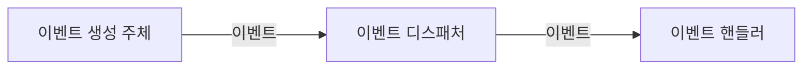
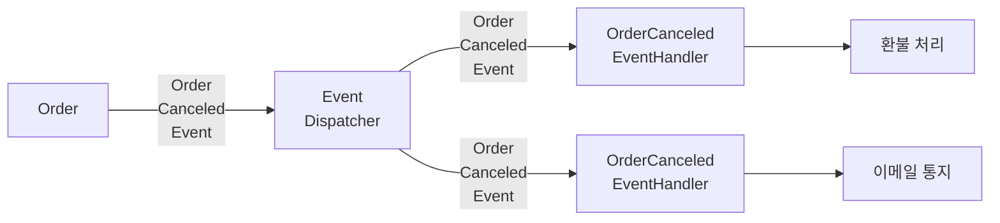
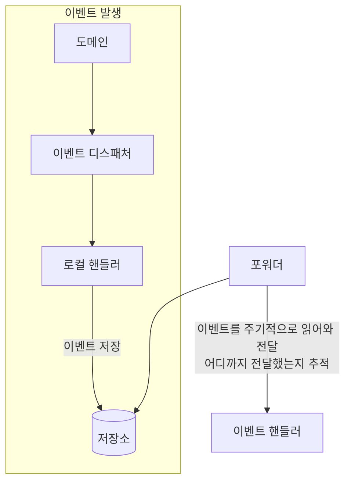
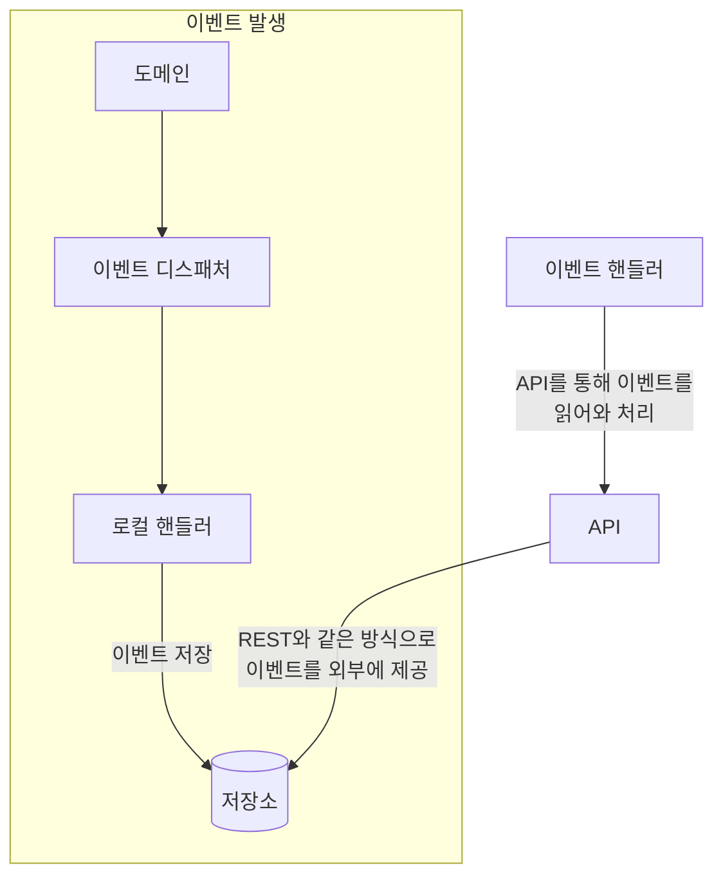
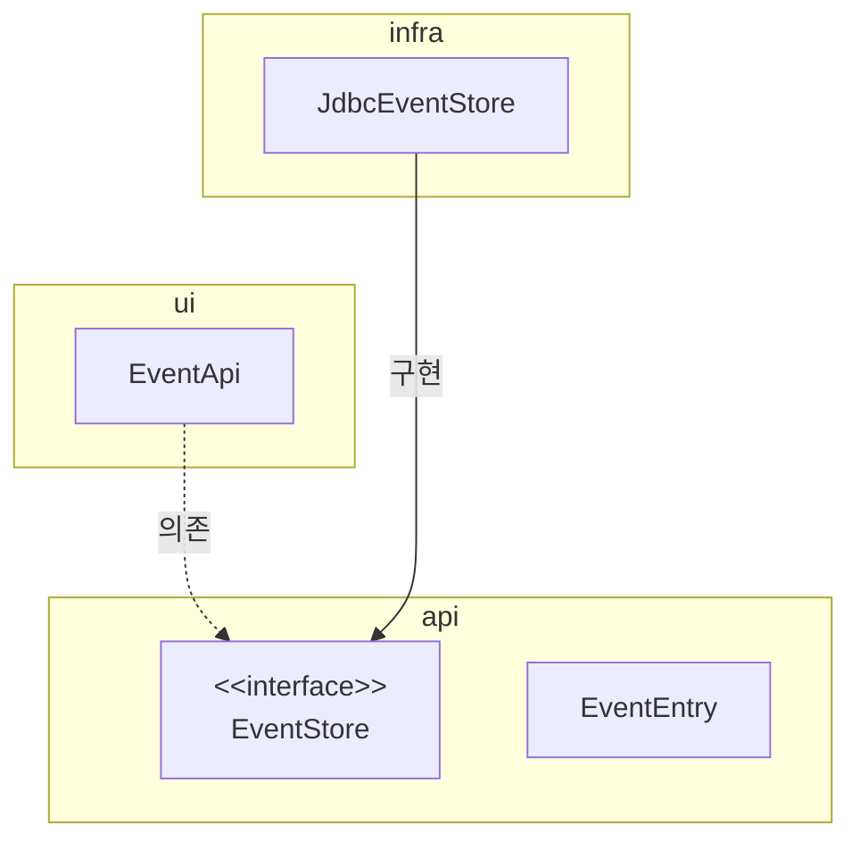

# 10 이벤트

## 1. 시스템 간 강결합 문제

- 쇼핑몰에서 구매를 취소하여 환불을 처리하는 예시
  - 환불 기능을 실행하는 주체 = 주문 도메인 엔티티
- 결제 시스템은 외부에 존재하므로 `Service`를 따로 만들어 호출하게 될 것이다. 이때 2가지 문제가 발생
1. 외부 서비스가 정상이 아닌 경우 트랜잭션 처리를 어떻게 해야 할지 애매. 에러가 발생하면 트랜잭션을 롤백할지 아니면 커밋할지.
    - 환불에 실패하면 롤백하는 게 맞다고 볼 수도 있지만, 반드시 그렇진 않다. 주문은 취소 상태로 변경하고, 환불만 나중에 다시 시도하는 방식으로 처리할 수도 있다.
2. 성능 문제. 환불을 처리하는 외부 시스템의 응답이 길어지면 그만큼 대기 시간도 길어진다. (외부 시스템에 의존적이기 때문)
3. 그 외에도 도메인 객체에 서비스를 전달함으로써 발생하는 추가적인 설계 문제 발생.
    - 주문 도메인의 주문 취소와 결제 도메인의 환불 로직과 뒤섞이게 된다. => 환불이 변경되면 주문도 영향을 받는다는 의미.

- 이는 모두 바운디드 컨텍스트 간의 `강결합 high coupling` 때문이다.
- 이벤트를 사용하면 강한 결합을 없앨 수 있다.

------

## 2. 이벤트 개요

- `이벤트 event`라는 용어는 '과거에 벌어진 어떤 것'을 의미한다.
- 이벤트가 발생한다는 것은 상태가 변경됐다는 것을 의미한다. 이벤트는 발생한 것으로 끝나지 않고, 그 이벤트에 반응하여 원하는 동작을 수행하는 기능을 구현한다.
  - ex) javascript의 이벤트 핸들러
  - 도메인 모델도 유사하게 도메인의 상태 변경을 이벤트로 표현할 수 있다.

### 2-1. 이벤트 관련 구성요소

- 4가지 구성요소
1. 이벤트
2. 이벤트 생성 주체
3. 이벤트 디스패처(퍼블리셔)
4. 이벤트 핸들러



### 2-2. 이벤트의 구성

- 이벤트에 담는 정보는 아래와 같다.
  - 이벤트 종류: 클래스 이름으로 이벤트 종류를 표현
  - 이벤트 발생 시간
  - 추가 데이터: 주문번호, 신규 배송지 정보 등 이벤트와 관련된 정보
- 아래는 이벤트 클래스 예시

```java
public class ShippingInfoChangedEvent {...}
```

- 여기서 포인트! `Changed`라는 과거 시제를 사용.

### 2-3. 이벤트 용도

1. `트리거 Trigger`: 도메인 상태가 바뀔 때 다른 후처리가 필요하면 이 후처리를 실행하기 위한 트리거로 사용
2. 서로 다른 시스템 간의 데이터 동기화: 배송지를 변경하면 외부 배송 서비스에 바뀐 배송지 정보를 전송해야 한다.

### 2-4. 이벤트 장점

- 서로 다른 도메인 로직이 섞이는 것을 방지
- 이벤트 핸들러를 사용하면 기능 확장도 용이.



-------

## 3. 이벤트, 핸들러, 디스패처 구현

- 이벤트 클래스: 이벤트를 표현
- 디스패처: 스프링이 제공하는 `ApplicationEventPublisher`를 사용
- `Events`: 이벤트를 발행. 발행을 위해 `ApplicationEventPublisher`를 사용
- 이벤트 핸들러: 이벤트를 수신하여 처리. 스프링이 제공하는 기능 사용.

### 3-1. 이벤트 클래스

- 이벤트 클래스는 이벤트를 처리하는 데 필요한 최소한의 데이터를 포함해야 한다.
  - ex) 만약 핸들러에서 주문 정보가 필요하다면, 주문 번호만 전달함.
- 모든 이벤트가 공통으로 갖는 프로퍼티가 존재한다면 관련 상위 클래스를 만들 수도 있다.

### 3-2. Events 클래스와 ApplicationEventPublisher

```java
public class Events {
  private static ApplicationEventPublisher publisher;
  
  static void setPublisher(ApplicationEventPublisher publisher) {
    Events.publisher = publisher;
  }
  
  public static void raise(Object event) {
    if (publisher != null) {
      publisher.publishEvent(event);
    }
  }
}
```

```java
@Configuration
public class EventsConfiguration {
  @Autowired
  private ApplicationContext applicationContext;
  
  @Bean
  public InitializingBean eventsInitializer() {
    return () -> {
      Events.setPublisher(applicationContext);
    };
  }
}
```

- `eventsInitializer()` 메소드는 `InitializingBean` 타입 객체를 빈으로 설정.
  - 이 타입은 스프링 빈 객체를 초기화할 때 사용하는 인터페이스로, 이 기능을 사용해서 `Events` 클래스를 초기화.

### 3-3. 이벤트 발생과 이벤트 핸들러

- 이벤트를 발생시킬 코드는 `Events.raise()` 메소드를 사용.

```java
public class Order {
  public void cancel() {
    // ... 주문 취소 로직
    // ... 주문 취소 로직
    Events.raise(new OrderCanceledEvent(number.getNumber()));
  }
}
```

- 이벤트를 처리할 핸들러는 스프링이 제공하는 `@EventListener` 애노테이션을 사용하여 구현한다.

```java
@Service
public class OrderCanceledEventHandler {
  
  @EventListener(OrderCanceledEvent.class)
  public void handle(OrderCanceledEvent event) {
    // ... 주문 취소 후처리 로직
  }
}
```

----

## 4. 동기 이벤트 처리 문제

- 외부 서비스에 영향을 받는 문제는 어떻게 해결해야할까?
- 생각해 볼 만한 것. 외부 환불 서비스 실행에 실패했다고 해서 반드시 트랜잭션을 롤백해야 하는지에 대한 문제.
  - 일단 구매 취소 자체는 처리하고 환불만 재처리하거나 수동으로 처리할 수도 있다.
- 외부 시스템과의 연동을 동기로 처리할 때 발생하는 성능과 트랜잭션 범위 문제를 해소하는 방법은 `이벤트를 비동기로 처리`하거나 `이벤트와 트랜잭션을 연계`하는 것이다.

----

## 5. 비동기 이벤트 처리

- 일정 시간 안에만 후속 조치를 처리하면 되는 경우가 적지 않다.
  - 일정 간격으로 재시도 하거나 수동 처리를 해도 상관 없는 경우도 있다.
- 이벤트를 비동기로 구현할 수 있는 방법은 다양. 다음 네 가지 방식을 알아봄.
1. 로컬 핸들러로 비동기 실행
2. 메시지 큐 사용
3. 이벤트 저장소와 이벤트 포워더 사용
4. 이벤트 저장소와 이벤트 제공 API 사용

### 5-1. 로컬 핸들러 비동기 실행

- `@Async` 애노테이션을 사용하여 비동기로 처리. 이를 위해 두 가지만 하면 된다.
1. `@EnableAsync` 애노테이션을 사용하여 비동기 처리를 활성화
2. 이벤트 핸들러 메소드에 `@Async` 애노테이션을 붙인다.

### 5-2. 메시징 시스템을 이용한 비동기 구현

- 카프카나 래빗앰큐와 같은 메시징 시스템을 사용.
- 필요하다면 이벤트를 발생시키는 도메인 기능과 메시지 큐에 이벤트를 저장하는 절차를 한 트랜잭션으로 묶어야 한다. (글로벌 트랜잭션)
- 글로벌 트랜잭션을 사용하면 안전하게 이벤트를 메시지 큐에 전달할 수 있는 장점이 있지만, 반대로 전체 성능이 떨어지는 단점도 있다. 
  - 지원하지 않는 메시지 큐도 있다.
- 이벤트 발생 JVM과 처리 JVM이 다를 수 있다.

### 5-3. 이벤트 저장소를 이용한 비동기 처리



- 도메인의 상태 저장소와 이벤트 저장소로 동일한 DB 사용. => 로컬 트랜잭션으로 묶인다.
- API를 활용하는 방식은 아래와 같다.



- 패키지 구조는 아래와 같다.



- 각 구성요소
  - `EventEntry`: 이벤트 저장소에 보관할 데이터.
  - `EventStore`: 이벤트 저장소 인터페이스.
  - `JdbcEventStore`: 이벤트 저장소 구현체.
  - `EventApi`: REST API를 이용해 이벤트 목록을 제공하는 컨트롤러.
- API를 사용하는 클라이언트는 일정 간격으로 다음 과정을 실행한다.
1. 가장 마지막에 처리한 데이터의 `offset`인 `lastOffset`을 구한다. 없으면 `0`을 사용
2. 마지막에 처리한 `lastOffset`을 `offset`으로 하여 API를 실행
3. API 결과로 받은 데이터를 처리
4. `offset` + 데이터 개수를 `lastOffset`으로 저장

----

## 6. 이벤트 적용 시 추가 고려 사항

1. 이벤트 소스를 `EventEntry`에 추가할지 여부.
2. 포워더에서 전송 실패를 얼마나 허용할 것인지.
   - 실패한 이벤트를 생략하지 않고 별도 실패용 DB나 메시지 큐에 저장하기도 한다. => 실패 이유 분석이나 후처리에 도움
3. 이벤트 손실.
   - 로컬 핸들러를 사용하면 발생할 수 있다.
4. 이벤트 순서
   - 이벤트 순서대로 외부 시스템에 전달해야 할 경우, 이벤트 저장소를 사용하는 것이 좋다.
5. 이벤트 재처리
    - 동일한 이벤트를 다시 처리해야 할 때 이벤트를 어떻게 할지 결정.
    - 가장 쉬운 방법은 마지막으로 처리한 이벤트의 순번을 기억해 뒀다가 이미 처리한 순번의 이벤트가 도착하면 처리하지 않고 무시한다.
    - 멱등석으로 처리하는 방법도 있다.

### 6-1. 이벤트 처리와 DB 트랜잭션 고려.

- 이벤트 처리를 동기로 하든 비동기로 하든 이벤트 처리 실패와 트랜잭션 실패를 함께 고려해야 한다.
  - 트랜잭션 실패와 이벤트 처리 실패를 모두 고려하면 복잡해지므로 경우의 수를 줄이면 도움이 된다.
  - 경우의 수를 줄이는 방법은 트랜잭션이 성공할 때만 이벤트 핸들러를 실행하는 것. 
- `@TransactionalEventListenver(phase = TransactionPhase.AFTER_COMMIT)` 애노테이션을 사용하면 트랜잭션이 성공한 후에만 이벤트 핸들러가 실행하도록 설정.
- 이벤트 저장소로 DB를 사용해도 동일한 효과를 볼 수 있다.
  - 트랜잭션이 실패하면 이벤트가 저장되지 않으므로 핸들러도 실행되지 않기 때문이다.

----

# 참고자료

- 도메인 주도 개발 시작하기, 최범균 지음
