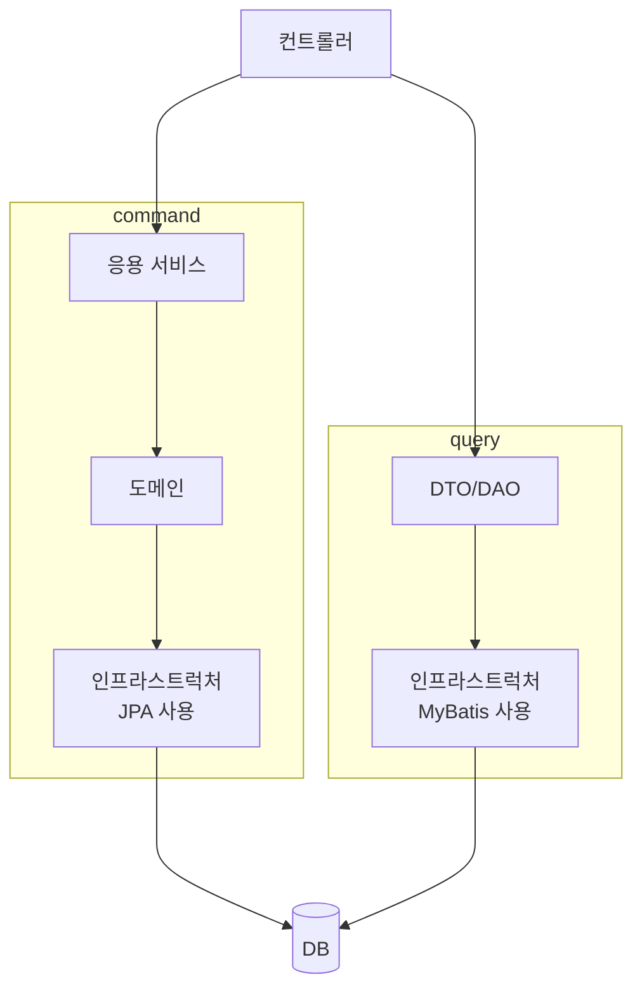

# 11 CQRS

## 1. 단일 보델의 단점

- 객체 지향으로 도메인 모델을 구현할 때 주로 사용하는 ORM 기법은 도메인 상태 변경을 구현하는 데는 적합
- but, 주문 상세 조회처럼 여러 애그리거트에서 데이터를 가져와 출력하는 기능을 구현하기에는 고려할 게 많아서 구현을 복잡하게 만든다.
- 이때 사용할 수 있는 방법이 상태 변경을 위한 모델과 조회를 위한 모델을 분리하는 것이다.

----

## 2. CQRS

- CQRS는 Command Query Responsibility Segregation의 약자로, 명령과 조회를 분리하는 패턴이다.
- 복잡한 도메인에 적합하다.
  - 복잡할수록 명령 기능과 조회 기능이 다루는 데이터 범위에 차이가 난다.
  - ex) 쇼핑몰에서 주문/판매 통계 조회.

- 명령 모델과 조회 모델이 같은 구현 기술을 사용할 수도 있다.
  - ex) JPA에서 JPQL을 활용한 동적 인스턴스 생성과 하이버네이트의 `@Subselect` 기능 등을 활용해 볼 수 있다.
- 혹은 서로 다른 데이터 저장소를 사용하는 것도 가능하다.
- 조회 모델은 단순히 데이터를 조회하는 기능만 구현하면 된다.
  - 명령 모델은 트랜잭션을 지원하는 RDBMS를 사용하고, 조회 모델은 조회 성능이 좋은 메모리 기반 NoSQL을 사용.

### 2-1. 웹과 CQRS

- 일반적으로 상태 변경 요청보다 상태 조회 요청이 많다.
  - 조회 성능 개선을 위한 다양한 기법을 활용해야 한다. 쿼리 최적화, 메모리 캐싱, 조회 전용 저장소 활용 등

### 2-2. CQRS 장단점

- 장점
  - 구분되어 있기 때문에 명령 모델 구현할 때 도메인 자체에 집중 가능
  - 복잡도 낮아짐.
  - 조회 성능 향상시키는 데 유리.
  - 도메인이 복잡하거나 대규모 트래픽이 발생하는 서비스라면 조회 전용 모델을 만드는 것이 향후 유지 보수에 유리
- 단점
  - 구현해야 할 코드가 더 많다.
  - 더 많은 구현 기술이 필요. 서로 다른 기술 혹은 서로 다른 저장소, 데이터 동기화를 위해 메시징 시스템 도입 등 

----

# 참고자료

- 도메인 주도 개발 시작하기, 최범균 지음
