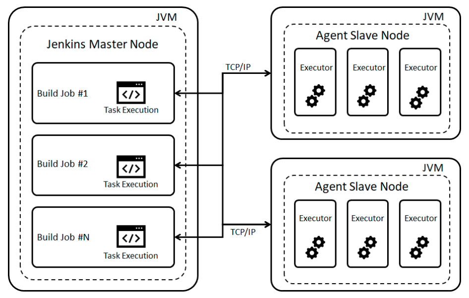
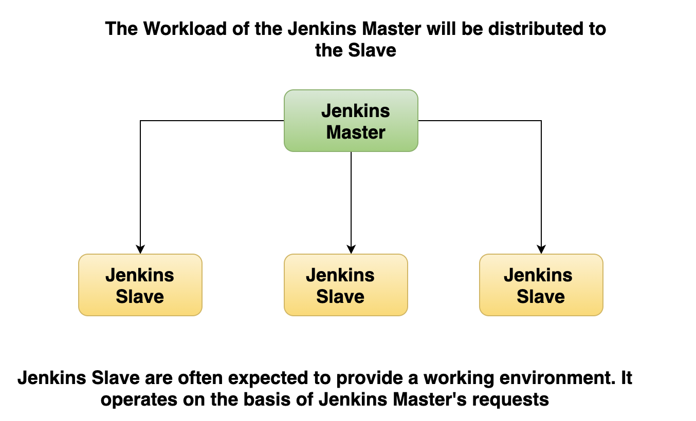
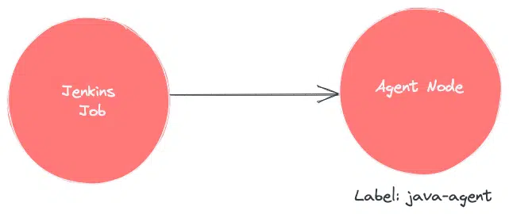
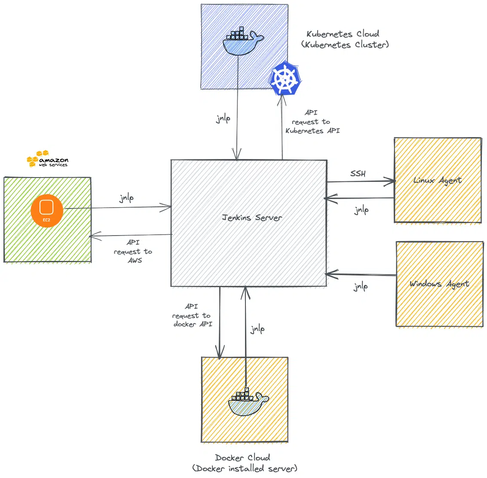
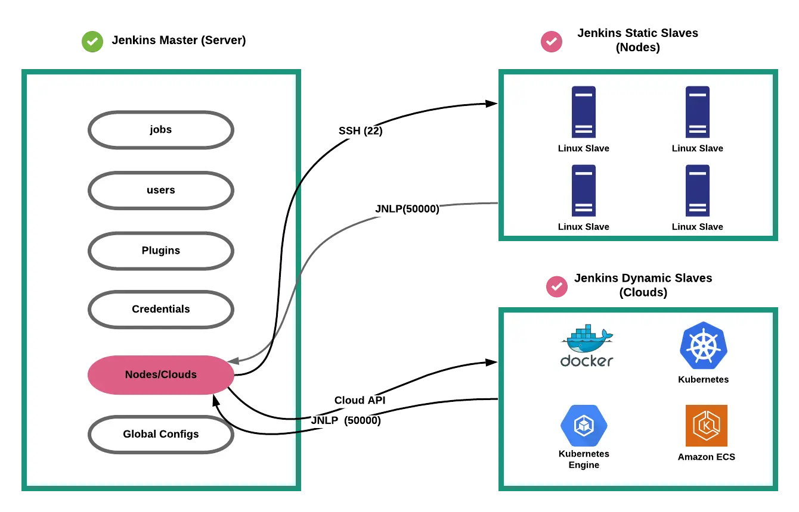
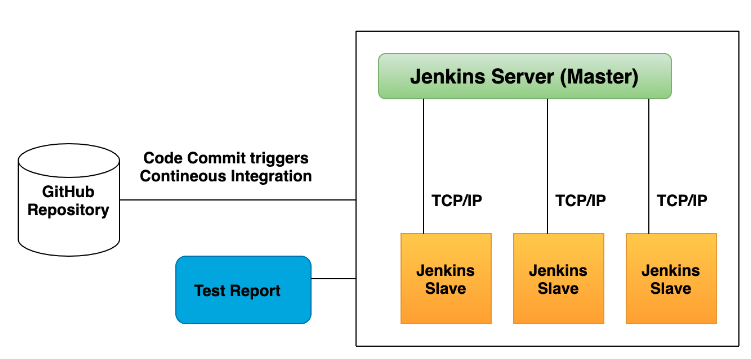
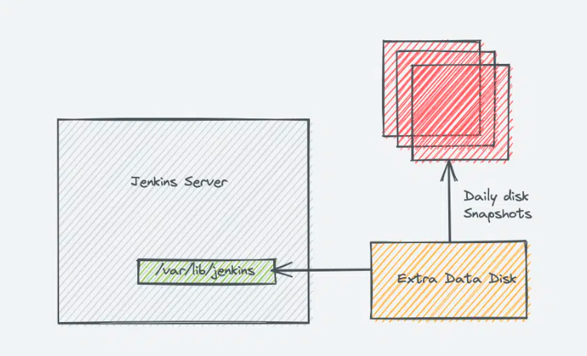
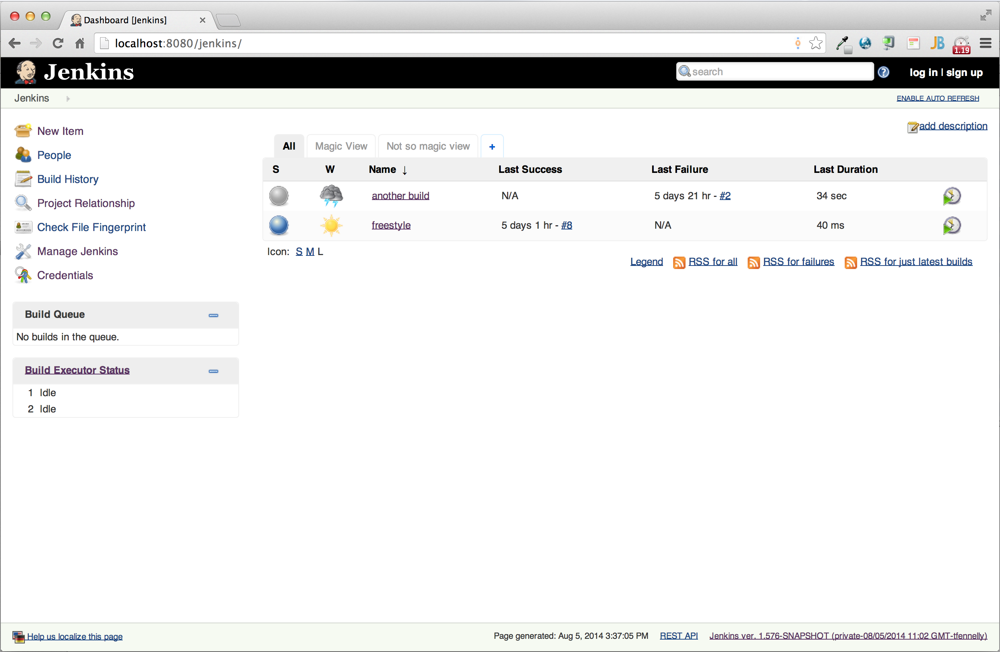

# What is Jenkins

## Jenkins란?

- Jenkins는 흔히 CI 툴로 많이 사용되었지만 점점 CD 영역으로 확대되면서 CI/CD의 전반적인 흐름을 관장하는 툴로 성장했다.
- 기본적인 언어는 Java 베이스로 Spring 서버를 만들고 연동하기에 좋은 툴이다.
- Jenkins는 "나이틀리 빌드(Nightly Build)를 망가뜨리지 말라!"는 소프트웨어 개발 조직의 기본규칙에서 나왔다.
- Jenkins가 나오기 전에는 코드를 커밋하기 전에 로컬 머신 상에서 조심스럽고 성공적으로 빌드해 테스트하는 것으로 나이틀리 빌드를 망가뜨리지 않았다.
- 개발 작업 에서 빌드를 계속 깨지 않고 해야했기 때문에 제한 요소가 많았지만 Jenkins는 이러한 제한을 깨뜨리고 지끔까지도 잘 사용되고있다.

> Nightly Build
>
> > 매일 밤 이루어지는 빌드  
> > 일단위로 자동 빌드된 버전  
> > 소스코드 수정사항을 일단위 반영한 버전  
> > 정식 배포와는 달리 안정성을 보장하지 않음  
> > 커뮤니티 확인 결과, 개발자 버전이라는 의미를 가지고 있는 것 같다.

 

## Jenkins는 언제 사용할까?

- 어플리케이션 및 인프라의 지속적 통합(CI)
- Jenkins 파이프라인을 통해 서로 다른 환경에서 어플리케이션을 배포하도록 지속적으로 전달(CD)
- Jenkins 작업 운용 뱅치
- 백업, 정리, 실행과 같은 운영

 

## Jenkins로 얻을 수 있는 이점은?

- 프로젝트 표준 컴파일 환경에서의 컴파일 오류 검출
- 자동화 테스트 수행
- 정적 코드 분석에 의한 코딩 규약 준수여부 체크
- 프로파일링 툴을 이용한 소스 변경에 따른 성능 변화 감시
- 결합 테스트 환경에 대한 배포 작업
- 500 가지가 넘는 플러그인을 온라인으로 간단히 설치할 수 있는 기능을 제공

 

## Jenkins의 구조

- 젠킨스는 2가지 요소로 구성된다.
  1. Jenkins Server (과거 Master Node)
  2. Agent Nodes/Clouds(과거 Jenkins Slave)

### Jenkins Server (Master)

- Jenkins 서버(Master Node)는 Jenkins Pipeline으로 정의된 모든 흐름을 관장하는 컨트롤 서버이다.
- Jenkins Agent에게 할 일을 분배한다.

### Jenkins Agent

- Jenkins Agent는 Jenkins Server가 작업을 시켰을 때 일을 하는 Node이다.
- Jenkins Server에서 작업을 발생시키면 실제 작업이 Agent Node위에서 작동되지만 Agent 없이 Jenkins Server 만으로도 작업을 진행할 수 있다. 그러나 이 경우 작업들이 서로 겹치며 충돌이 발생할 수 있다.

- Jenkins Agent는 2가지 종류이다.
  1. Agent Nodes: 윈도우/리눅스와 같은 서버로 개별 Script를 작성해 서버 위에서 Jenkins 실행과 정지를 조절한다.
  2. Agent Clouds: Dynamic Agent라고 불리며 우리가 작업하고 컨테이너로 배포하고 완성하는 작업에 사용되고 인프라에 따라 사용량이 지불되기에 돈을 아낄 수 있다는 장점이 있다.

- Agent와 Server가 연결되는 방법은 2가지이다.
  1. SSH: SSH 프로토콜을 이용해 Agent에 연결하는 방식으로 Server에서 연결이 시작된다. 22번 포트를 사용해 연결한다. (대체로 SSH를 사용할 때 22번를 사용한다.)
  2. JNPL: Java Network Launch Protocol의 약자로 50000번 포트를 사용해 Agent로부터 연결하는 작업으로 Jenkins Server의 방화벽이 열려있어야 가능한 방법이다.

 

## Jenkins는 어떤 원리로 작동하는가?

### Jenkins Job

1. Git에서 푸시된 자료를 Git Hook을 통해 정기적으로 Jenkins가 확인
2. Jenkins 테스트 과정을 다양한 Jenkins Agent에서 실행시키면서 독자적인 테스트 환경 구성
3. Jenkins Agent를 통해 얻은 결과물을 Jenkins Server가 받아 테스트를 브리핑

### Jenkins Data

- Jenkins의 default home directory는 `/var/lib/jenkins`이다. 물론 workspace는 변경할 수 있다.
- 해당 디렉토리에 작업 및 플러그인 config 파일, 보안, 노드 정보를 저장해둔다.

 

## 기타 유용한 기능들

### Plugins

- 다른 개발 툴과 연동할 때 사용하는 기능이다.
- 예를 들어, S3 버킷과 같은 AWS 서비스와 연동할 수 있는 플러그인이 존재한다.

### Web Interface

- Web 페이지로 만들어진 인터페이스를 제공한다! 아주 간편하게 Jenkins를 사용할 수 있도록 도와준다.

 

## 참고자료

- [Jenkins 따라잡기 (1)](https://velog.io/@guri_coding/Jenkins-%EB%94%B0%EB%9D%BC%EC%9E%A1%EA%B8%B0-1-Jenkins%EB%9E%80s)

- [젠킨스란?](https://narup.tistory.com/179)

- [젠킨스란 무엇인가?](https://ict-nroo.tistory.com/31)
