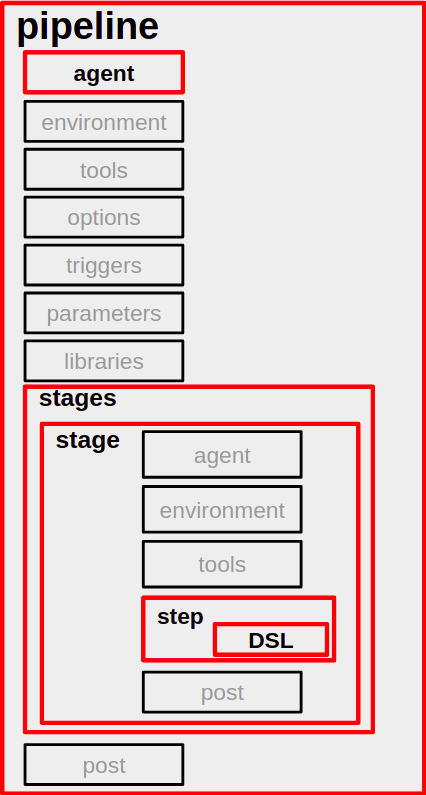

# Pipeline Syntax

- Pipeline이란 파이프라인을 이어붙인 것과 같이 Step By Step 형식으로 실행되는 것을 의미한다.

## 정의 방식

1. Jenkins Webadmin: 관리자 페이지에서 파이프라인을 생성해 Shell Script를 직접 입력해주는 방식. 일반적이다.
2. Git SCM: Git Repository에 JenkinsFile을 작성하는 방식
3. Blue Ocean: 파이프라인을 시각화하여 손쉽게 구성해 빌드하는 방식

## 문법



### pipeline

- 파이프라인을 정의하기 위해 최상위 레벨에 적어줘야한다.
- 아래에 해당하는 구문만 작성할 수 있다. 
  - Section(agent, post, steps, stages) 
  - Directive(environment, options, parameters, triggers, tools, input) 
  

```shell
pipeline {
  
}
```

### Section

- 아래는 예시

```shell
pipeline {
  agent any
  
  stages {
    stage("build") {
      steps {
        {build shell script}
      }
    }
    
    stage("deploy") {
      steps {
        {deploy shell script}
      }
    }
  }
  
  post {
    success {
      echo 'success'
    }
  }
}
```

1. agent
    - any, none, label, node, docker, dockerfile, kubernetes를 파라미터로 넘길 수 있다.
    - pipeline 레벨 안에서 최상위에 포함되어야 한다.
    - agent none으로 작성하면 stage를 무조건 작성해줘야한다.
2. stages
    - stage의 묶음으로 하나 이상의 stage를 포함해야 한다.
3. steps
    - stage 내부에서 실행되는 단계를 정의한다.
4. post
    - always, changed, fixed, regression, aborted, failure, success, unstable, unsuccessful, cleanup 등의 상태를 정의한다.
    - 일반적으로 pipeline 끝에 배치한다.

### Directive

- Directive는 파이프라인에서 값을 정의하고 행동을 설정하고 수행될 작업을 명시하는 문장이나 코드 블록을 뜻한다.

1. environment
   - 환경변수를 작성
   - 작성한 레벨에서 환경변수를 적용
2. options
   - 파이프라인에서 단 한 번만 적용할 수 있다.
   - Jenkins 자체적으로 여러 기능을 제공한다. (필요하면 찾아보자!)
3. parameters
    - 사용자가 제공해야할 변수를 선언할 수 있다.
    - 관리자 페이지에서는 스크립트가 아닌 설정을 통해 지정할 수 있다.
4. triggers
   - cron, pollSCM, upstream 등의 방식으로 트리거를 만들 수 있다.
   - 트리거를 통해 파이프라인을 자동화할 때 쓴다.
5. tools
    - maven, jdk, gradle 등의 설치 도구를 지정한다.
6. input
    - 입력 메시지를 받을 때 사용한다.

## 병렬 실행

- Jenkins는 기본적으로 순차 실행이다.
- parallel을 사용하면 병렬 실행도 가능하다.

```shell
pipeline {
    
    ...
    
    stages {
        stage('Parallel Stage') {
            
            parallel {
                stage('first') {
                    ...
                }
                stage('second') {
                    ...
                }
                stage('third') {
                    ...
                }
            }
        }
    }
}
```
   

# 참고자료

- [velog-젠킨스문법](https://velog.io/@bbkyoo/Jenkins-Pipeline-%EB%AC%B8%EB%B2%95-%EC%A0%95%EB%A6%AC-u825sfpf)
- [velog-선언적파이프라인](https://velog.io/@seunghyeon/Jenkins-%EC%84%A0%EC%96%B8%EC%A0%81Declarative-%ED%8C%8C%EC%9D%B4%ED%94%84%EB%9D%BC%EC%9D%B8)