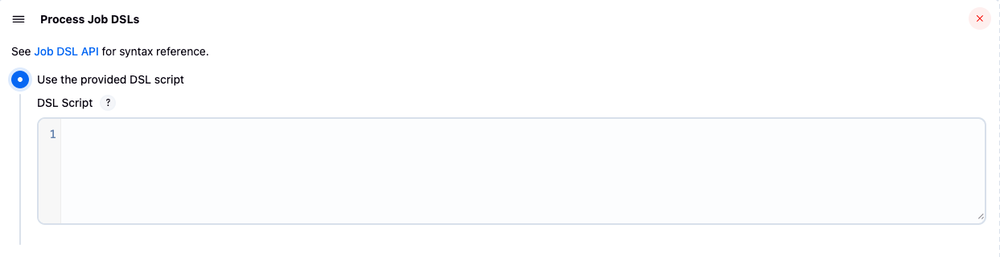

# Jenkins DSL

- Jenkins UI에서 직접 스크립트를 변경하면 스크립트를 잘못 변경했을 때 문제점을 찾기 어렵다.
- 물론 따로 Git Repository를 만들어 형상 관리를 하면서 Jenkins의 스크립트를 업데이트하는 방법도 있을 것이다.
- 그런데 Git Repository에서 작성한 스크립트를 Jenkins에 그대로 갖다 붙일 수 있다면 더 좋지 않을까?
- Jenkins의 IaC(Infrastructure as Code)를 가능하게 하는 것이 Job DSL 플러그인이다.


## Git 레포지토리와 Jenkins 연동

- Freestyle Project를 하나 만든다.
  - 프로젝트를 만들면서 Git Repository 연결을 진행해준다.


- Build Steps에서 `Process Job DSLs`를 선택해준다.


- DSL script를 추가해주면 된다.



- 아래는 공식 문서에 있는 샘플 코드이다.
  - 본인 프로젝트에 맞는 스크립트를 넣고 실행만 하면 Git Repository에 있는 Jenkinsfile이 자동 생성된다.

```groovy
pipelineJob('job-dsl-plugin') {
  definition {
    cpsScm {
      scm {
        git {
          remote {
            url('https://github.com/jenkinsci/job-dsl-plugin.git')
          }
          branch('*/master')
        }
      }
      lightweight()
    }
  }
}
```

- 위와 같은 파이프라인을 생성하고 실행하면 

## Jenkins 파이프라인 설정 자동화

- Generator로 파이프라인을 생성해서 사용하려면 Jenkins 파이프라인뿐만 아니라 파이프라인의 Setting 또한 스크립트로 작성해줘야 완벽한 자동화가 가능하다.
- 아래와 같이 properties에 설정 값들을 넣을 수 있다.

```groovy
properties([
        parameters([
                string(name: 'SOURCE_BRANCH', defaultValue: 'build', description: ''),
        ]),
        pipelineTriggers([
                gitlab(
                        triggerOnMergeRequest: true,
                        triggerOpenMergeRequestOnPush: 'source',
                        triggerOnlyIfNewCommitsPushed: true,
                        triggerOnNoteRequest: false,
                        noteRegex: "Jenkins please retry a build",
                        secretToken: "aaaa",
                ),
        ])
])
```

- 위 스크립트를 Jenkins에서 실행시키면 자동으로 Setting이 들어간다.
- 위의 스크립트는 GitLab 플러그인과 함께 사용되었다. (특히 `pipelineTriggers` 부분)
  - GitLab Hook에 의해 트리거를 하기 위해서. 
  - [GitLab Plugin](https://plugins.jenkins.io/gitlab-plugin/)


- `parameters`: 빌드 매개변수 설정
  - `BRANCH`라는 이름의 매개변수가 들어간 것을 확인할 수 있다.


- `pipelineTriggers`: 파이프라인을 트리거하는 내용 첨가
    - `triggerOpenMergeRequestOnPush`: 'never', 'source', 'both' 중 택일


- 고급 설정을 살펴보자.
  - `secretToken`으로 설정한 `aaaa` 값이 들어간 것을 확인할 수 있다.


# 참고 자료

- [Job DSL](https://plugins.jenkins.io/job-dsl/)
