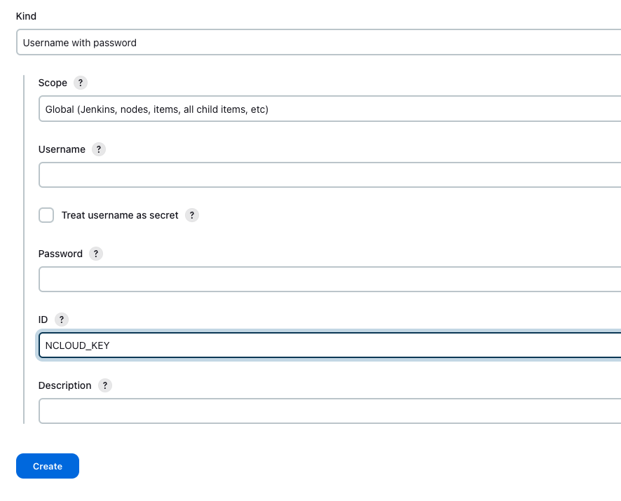

## Pipeline: AWS Steps 플러그인 설치

- plugin docs

[Pipeline: AWS Steps](https://plugins.jenkins.io/pipeline-aws/)

- plugin 설치


## Jenkins Secret 넣기

- S3 업로드를 위한 비밀 키를 입력해줘야 한다.
- Jenkins 관리 > Security > Credentials 카테고리 선택


- Stores scoped to Jenkins의 System을 클릭


- Global credentials 클릭


- Add Credentials 버튼 클릭


- Username with password를 선택해준다.


- username에 access_ket을 넣고 password에 secret_key를 넣어준다.
- ID값은 임의의 값을 입력해주면 된다. (NCLOUD_KEY라고 입력해줬다.)



## 스크립트

- 이제 스크립트를 만들어보자.
- 아래 예시는 Swagger 문서 만드는 작업을 자동화한 openapi3라는 gradle 명령어를 실행하여Object Storage에 올리는 작업이다.
- 예시는 `Git`으로부터 코드베이스를 가져온다.
- NCloud의 Object Storage를 활용하고 있다.
  - `swagger` bucket의 `openapi`라는 디렉토리에 접근

```bash
pipeline {
    agent any

    environment {
        TARGET_FILE_PATH = '/build/resources/main/static/docs/openapi3.yaml'
        WORK_SPACE = pwd();
    }

    stages {
        stage('Upload') {
            steps {
                script {
                    SCM_VARS = git branch: '${SOURCE_BRANCH}', credentialsId: 'GIT', url: 'git_url'
                    env.GIT_COMMIT = SCM_VARS.GIT_COMMIT
                }
                
                sh './gradlew clean :${PROJECT_NAME}:openapi3'
                
                withAWS(region: 'kr-standard', endpointUrl: 'https://kr.object.ncloudstorage.com', credentials: 'NCLOUD_KEY') {
                    s3Upload(
                        bucket: 'swagger', 
                        file: PROJECT_NAME + TARGET_FILE_PATH,
                        path: 'openapi/')
                }
            }
        }
}
```