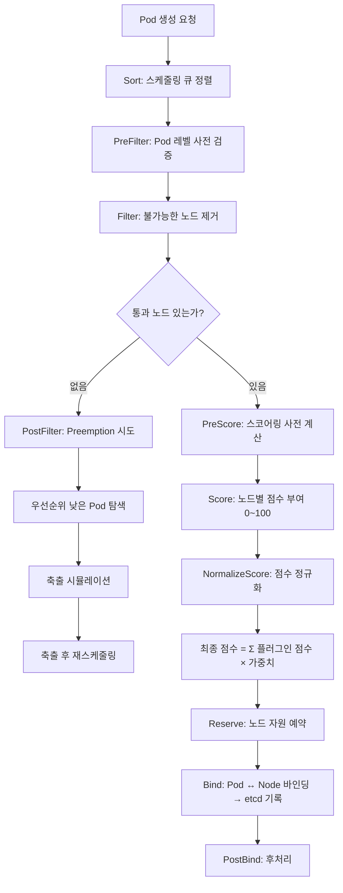

# Control Plane

- Kubernetes 클러스터의 **두뇌** 역할을 하는 컴포넌트 모음이다.
- 클러스터 전체의 상태를 관리하고, 의사결정을 수행한다.
- 실제 컨테이너 실행은 Worker Node의 kubelet이 담당하며, Control Plane은 "무엇을 해야 하는지"를 결정한다.

## 아키텍처 구조

```
[K8s Cluster]
  │
  ├─ Control Plane (마스터)
  │     ├─ API Server           ← 모든 통신의 중심
  │     ├─ etcd                 ← 클러스터 상태 저장소
  │     ├─ Scheduler            ← Pod 배치 결정
  │     └─ Controller Manager   ← 상태 유지 루프
  │
  ├─ Worker Node 1
  │     ├─ kubelet
  │     ├─ kube-proxy
  │     └─ container runtime (containerd)
  │
  └─ Worker Node 2
        ├─ kubelet
        ├─ kube-proxy
        └─ container runtime (containerd)
```

---

## 1. API Server (`kube-apiserver`)

- 클러스터의 **프론트 데스크**. 모든 컴포넌트가 API Server를 통해서만 통신한다.
- REST API를 제공하며, `kubectl`이 호출하는 대상이 바로 이 API Server이다.
- 인증(Authentication) / 인가(Authorization) / 어드미션 컨트롤(Admission Control)을 처리한다.
- etcd와 직접 통신하는 **유일한** 컴포넌트이다.

```
kubectl apply ──→ API Server ──→ etcd (저장)
                      │
kubelet ←─────────────┤ (PodSpec 전달)
Scheduler ←───────────┤ (스케줄링 요청)
Controller ←──────────┘ (상태 변경 감지)
```

## 2. etcd

- 클러스터의 **기억 장치**. 분산 Key-Value 저장소이다.
- 모든 클러스터 상태(리소스, 설정, 시크릿 등)가 여기에 저장된다.
- 고가용성을 위해 보통 3~5대로 클러스터링한다. (Raft 합의 알고리즘)
- API Server만 직접 접근 가능하며, 다른 컴포넌트는 직접 접근할 수 없다.
- 클러스터가 날아가도 etcd 백업이 있으면 복구할 수 있다.

### 저장하는 것들

| 대상 | 예시 |
|------|------|
| 리소스 정의 | Deployment, Service, Pod, ConfigMap |
| 클러스터 설정 | RBAC, Namespace |
| 시크릿 | Secret 리소스 |
| 상태 정보 | 현재 상태(current state) vs 원하는 상태(desired state) |

### 저장 구조

etcd는 **메모리 + 디스크 양쪽 모두** 사용한다.

```
etcd
 ├─ 메모리 (B+Tree 인덱스)    ← 빠른 읽기/조회용
 └─ 디스크
      ├─ WAL (Write-Ahead Log) ← 쓰기 내구성 보장
      └─ Snapshot (DB 파일)     ← bbolt(BoltDB) 기반 KV 저장소
```

- **쓰기**: 클라이언트 요청 → WAL에 먼저 기록 → Raft 합의 완료 → 메모리 인덱스 + bbolt DB 반영
- **읽기**: 메모리 B+Tree 인덱스로 키 조회 → bbolt에서 값 반환 (자주 접근하는 데이터는 OS 페이지 캐시에서 읽힘)

### 왜 bbolt(BoltDB)인가?

SQLite 같은 관계형 DB가 아닌, Go로 작성된 임베디드 Key-Value 저장소를 사용한다.

| | bbolt (etcd가 사용) | SQLite |
|---|---|---|
| **자료구조** | B+Tree | B-Tree |
| **데이터 모델** | Key-Value only | 관계형 (SQL) |
| **동시성** | 단일 writer + 다중 reader | WAL 모드로 동시 읽기/쓰기 |

```
# etcd에 저장되는 데이터 예시
/registry/pods/default/nginx-abc123  →  { PodSpec JSON }
/registry/services/default/my-svc    →  { ServiceSpec JSON }
/registry/secrets/default/my-secret  →  { encrypted data }
```

bbolt를 선택한 이유:
- **단순함** — KV 연산만 필요하므로 SQL 파서/옵티마이저가 불필요
- **B+Tree** — 리프 노드가 순서대로 연결되어 range scan이 빠름 (Watch, MVCC 리비전 추적에 유리)
- **단일 파일, mmap** — 운영이 단순하고 스냅샷/백업이 쉬움
- **Pure Go** — CGO 의존 없이 빌드 가능 (SQLite는 C 라이브러리)

### 운영 시 주의사항

| 항목 | 설명 |
|------|------|
| 디스크 성능 | WAL 쓰기가 느리면 전체 클러스터 성능 저하. **SSD 필수** |
| 메모리 사용량 | 전체 데이터를 인덱싱하므로 데이터 증가 시 메모리도 비례 증가 |
| 저장 한도 | `--quota-backend-bytes` 기본 2GB (최대 8GB 권장) |
| 데이터 압축 | 오래된 리비전을 주기적으로 compaction해야 디스크 절약 |

## 3. Scheduler (`kube-scheduler`)

- 새 Pod이 생성되면 **어떤 노드에 배치할지 결정**한다.
- Pod을 직접 실행하지는 않는다. 결정만 하고, 실행은 해당 노드의 kubelet이 한다.

### Scheduling Framework

단일 알고리즘이 아닌 **플러그인 파이프라인**으로 동작한다.



### Filter 플러그인

"이 노드에 배치 가능한가?" — 하나라도 실패하면 해당 노드 제외

| 플러그인 | 기준 |
|----------|------|
| **NodeResourcesFit** | CPU/메모리 요청량이 노드 잔여 자원에 맞는가 |
| **NodeAffinity** | `nodeSelector`, `nodeAffinity` 조건 충족하는가 |
| **TaintToleration** | 노드의 taint를 Pod이 tolerate하는가 |
| **PodTopologySpread** | 토폴로지 분산 제약 충족하는가 |
| **InterPodAffinity** | Pod 간 affinity/anti-affinity 조건 |
| **NodeUnschedulable** | 노드가 `cordon` 상태가 아닌가 |
| **NodePorts** | 요청한 hostPort가 충돌하지 않는가 |

### Score 플러그인

"남은 노드 중 어디가 최적인가?" — 각 플러그인이 0~100점 부여 후 가중합산

| 플러그인 | 전략 |
|----------|------|
| **LeastAllocated** | 자원 여유가 많은 노드에 높은 점수 (기본값, 분산 배치) |
| **MostAllocated** | 자원 사용률이 높은 노드에 높은 점수 (빈 패킹, 노드 수 절약) |
| **BalancedAllocation** | CPU/메모리 사용 비율이 균등한 노드에 높은 점수 |
| **TaintToleration** | toleration이 정확히 일치할수록 가산점 |
| **NodeAffinity** | preferred affinity 조건에 맞을수록 가산점 |
| **PodTopologySpread** | Pod이 더 고르게 분산되는 노드에 가산점 |
| **ImageLocality** | 컨테이너 이미지가 이미 캐시된 노드에 가산점 |

### 실전 예시

```yaml
# nodeSelector와 tolerations로 특정 노드그룹에만 배치
spec:
  tolerations:
    - key: "team"
      operator: "Equal"
      value: "backend"
      effect: "NoSchedule"
  nodeSelector:
    team: "backend"
```

- `nodeSelector`: `team=backend` 라벨이 있는 노드에만 배치한다.
- `tolerations`: `team=backend` taint가 걸린 노드에 배치를 허용한다.
- 두 설정을 함께 사용하면 **전용 노드그룹**에만 Pod을 격리 배치할 수 있다.

## 4. Controller Manager (`kube-controller-manager`)

- **"원하는 상태(desired state) = 실제 상태(current state)"를 유지하는 루프**를 실행한다.
- 내부에 여러 컨트롤러가 동작하며, 각각 특정 리소스를 감시한다.

### Reconciliation Loop

```
원하는 상태: replicas: 2  (etcd에 저장됨)
실제 상태:  Pod 1개만 Running

→ Controller: "1개 부족하네" → API Server에 Pod 생성 요청
→ Scheduler: 노드 선택 → kubelet: 컨테이너 생성
→ 실제 상태: Pod 2개 Running ✓
```

### 주요 컨트롤러

| 컨트롤러 | 역할 |
|----------|------|
| Deployment Controller | replicas 수 유지, rolling update 관리 |
| ReplicaSet Controller | 지정된 수의 Pod 유지 |
| Node Controller | 노드 상태 감시, 응답 없는 노드의 Pod 축출 |
| Endpoint Controller | Service ↔ Pod 매핑 관리 |
| ServiceAccount Controller | 네임스페이스별 기본 ServiceAccount 생성 |

---

## 배포 시 전체 동작 흐름

```
1. kubectl apply -f base.yaml
       │
2. API Server: 인증 → 인가 → 어드미션 컨트롤 → etcd에 저장
       │
3. Controller Manager: "Deployment 변경 감지"
   → ReplicaSet 생성 → Pod N개 필요
       │
4. Scheduler: "Pod을 어디에 배치할까?"
   → nodeSelector, tolerations 필터링
   → 리소스(cpu, memory) 충족하는 노드 선택
       │
5. API Server → 선택된 노드의 kubelet에 PodSpec 전달
       │
6. kubelet: 컨테이너 생성 → health probe 시작 → Ready 보고
       │
7. Endpoint Controller: Service 엔드포인트 업데이트
   → kube-proxy가 트래픽 라우팅 시작
```

## Worker Node 컴포넌트와의 비교

| 컴포넌트 | 위치 | 역할 |
|----------|------|------|
| API Server | Control Plane | 클러스터 전체의 중앙 통신 허브 |
| etcd | Control Plane | 모든 상태를 저장하는 분산 저장소 |
| Scheduler | Control Plane | Pod을 어떤 노드에 배치할지 결정 |
| Controller Manager | Control Plane | 원하는 상태를 유지하는 루프 실행 |
| kubelet | Worker Node | 컨테이너 관리, probe 실행, 상태 보고 |
| kube-proxy | Worker Node | 네트워크 규칙(iptables), Service → Pod 라우팅 |

> Control Plane은 **"무엇을 해야 하는지"를 결정**하고, Worker Node는 **"실제로 실행"**한다.
