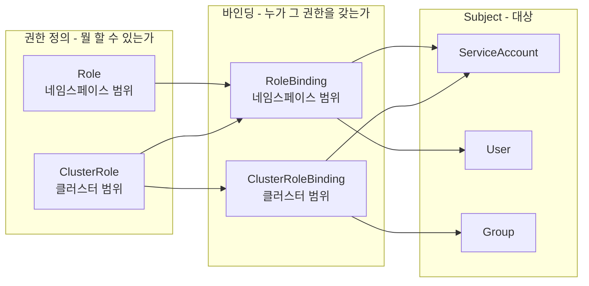
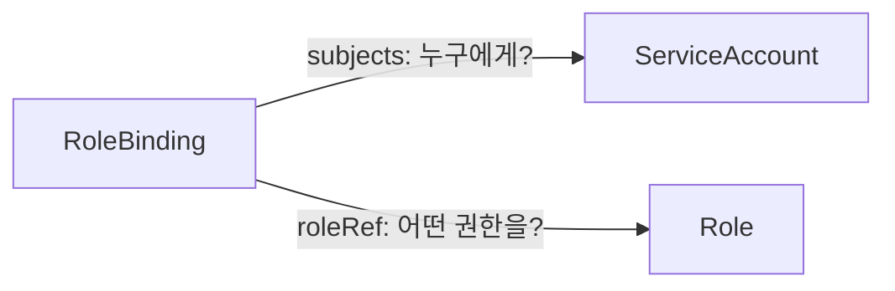
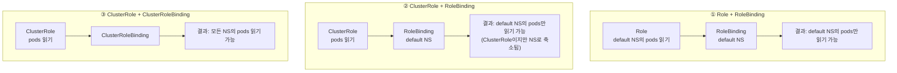
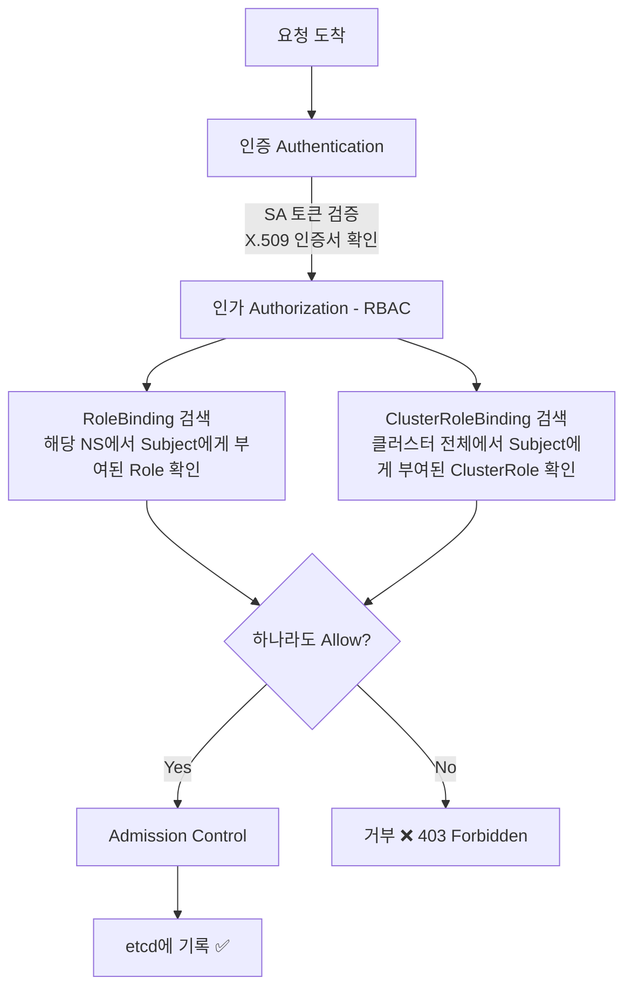

# RBAC — Role, ClusterRole, Binding

- RBAC(Role-Based Access Control)는 K8s API에 대한 접근을 **역할(Role) 기반으로 제어**하는 메커니즘이다.
- **허용 목록(allowlist) 방식**이다. 명시적으로 허용하지 않으면 기본 거부(deny)된다.
- deny 규칙은 존재하지 않는다. 권한을 줄이려면 바인딩을 제거해야 한다.

> ServiceAccount에 대한 내용은 [rbac-serviceaccount.md](./rbac-serviceaccount.md)를 참고한다.

---

## 1. 핵심 개념 4가지



| 리소스 | 범위 | 설명 |
|--------|------|------|
| **Role** | 네임스페이스 | 특정 네임스페이스 내의 권한 정의 |
| **ClusterRole** | 클러스터 전체 | 클러스터 전체 또는 비 네임스페이스 리소스(Node, PV 등) 권한 정의 |
| **RoleBinding** | 네임스페이스 | Subject에게 Role (또는 ClusterRole)을 부여 |
| **ClusterRoleBinding** | 클러스터 전체 | Subject에게 ClusterRole을 클러스터 전체에 부여 |

3개의 리소스가 독립적으로 존재하며, Binding이 **참조(reference)**로 연결한다. 소유(ownership) 관계가 아니다.



---

## 2. Role vs ClusterRole

**범위(scope)의 차이**다.

```yaml
# Role — 특정 네임스페이스 안에서만 유효
apiVersion: rbac.authorization.k8s.io/v1
kind: Role
metadata:
  name: pod-reader-role
  namespace: default          # 네임스페이스 필수
rules:
  - apiGroups: [""]
    resources: ["pods"]
    verbs: ["get", "list", "watch"]
```

```yaml
# ClusterRole — 네임스페이스 없음, 클러스터 전체
apiVersion: rbac.authorization.k8s.io/v1
kind: ClusterRole
metadata:
  name: pod-reader-cluster    # namespace 필드 없음
rules:
  - apiGroups: [""]
    resources: ["pods"]
    verbs: ["get", "list", "watch"]
```

ClusterRole만 할 수 있는 것:
- **비 네임스페이스 리소스** 접근 (nodes, persistentvolumes, namespaces 등)
- **여러 네임스페이스에서 재사용** (RoleBinding으로 네임스페이스별 축소 적용)

---

## 3. RoleBinding vs ClusterRoleBinding

**권한이 적용되는 범위의 차이**다.



### 바인딩 조합표

| | RoleBinding (네임스페이스 내) | ClusterRoleBinding (클러스터 전체) |
|---|---|---|
| **Role** (네임스페이스) | ✅ NS 내 권한 부여 | ❌ 불가 |
| **ClusterRole** (클러스터) | ✅ NS 내로 축소 적용 | ✅ 전체 권한 부여 |

> **ClusterRole + RoleBinding** 조합이 실전에서 가장 자주 쓰인다.
> 공통 권한을 ClusterRole로 한 번 정의하고, 각 네임스페이스에서 RoleBinding으로 부여하면 중복 Role을 만들지 않아도 된다.

### 바인딩 예시

```yaml
# RoleBinding — default NS에서만 권한 부여
apiVersion: rbac.authorization.k8s.io/v1
kind: RoleBinding
metadata:
  name: pod-reader-binding
  namespace: default              # 이 NS에서만 유효
subjects:
  - kind: ServiceAccount
    name: pod-reader
    namespace: default
roleRef:
  kind: Role                      # Role 또는 ClusterRole
  name: pod-reader-role
  apiGroup: rbac.authorization.k8s.io
```

```yaml
# ClusterRoleBinding — 클러스터 전체에 권한 부여
apiVersion: rbac.authorization.k8s.io/v1
kind: ClusterRoleBinding
metadata:
  name: monitoring-binding        # namespace 없음
subjects:
  - kind: ServiceAccount
    name: monitoring-agent
    namespace: monitoring
roleRef:
  kind: ClusterRole
  name: monitoring-reader
  apiGroup: rbac.authorization.k8s.io
```

---

## 4. rules 필드 해부

Role/ClusterRole의 핵심은 `rules`다.

```yaml
rules:
  - apiGroups: [""]                    # "" = core (pods, services, configmaps)
    resources: ["pods", "pods/log"]    # 리소스 + 서브리소스
    verbs: ["get", "list", "watch"]    # 허용할 동작

  - apiGroups: ["apps"]               # apps group (deployments, statefulsets)
    resources: ["deployments"]
    verbs: ["get", "list", "create", "update", "delete"]
```

### verbs

| verb | 설명 | kubectl 대응 |
|------|------|-------------|
| `get` | 단건 조회 | `kubectl get pod <name>` |
| `list` | 목록 조회 | `kubectl get pods` |
| `watch` | 변경 감지 (스트리밍) | `kubectl get pods -w` |
| `create` | 생성 | `kubectl create`, `kubectl apply` (신규) |
| `update` | 수정 | `kubectl apply` (수정), `kubectl edit` |
| `patch` | 부분 수정 | `kubectl patch` |
| `delete` | 삭제 | `kubectl delete` |

### 주요 apiGroups

| apiGroup | 리소스 | 비고 |
|----------|--------|------|
| `""` (core) | pods, services, configmaps, secrets, namespaces, nodes | 가장 기본 |
| `apps` | deployments, statefulsets, daemonsets, replicasets | 워크로드 |
| `batch` | jobs, cronjobs | 배치 작업 |
| `rbac.authorization.k8s.io` | roles, clusterroles, rolebindings | RBAC 자체 |
| `networking.k8s.io` | ingresses, networkpolicies | 네트워크 |
| `autoscaling` | horizontalpodautoscalers | HPA |

### resourceNames로 특정 리소스만 허용

```yaml
rules:
  - apiGroups: [""]
    resources: ["configmaps"]
    resourceNames: ["app-config", "feature-flags"]   # 이 두 개만!
    verbs: ["get"]
```

---

## 5. 내장 ClusterRole

K8s가 기본으로 제공하는 ClusterRole들이 있다. `system:` 접두사가 붙은 것은 K8s 내부용이다.

```bash
$ kubectl get clusterrole | grep -v system:
```

| ClusterRole | 권한 | 용도 |
|------------|------|------|
| **cluster-admin** | 모든 리소스에 대한 모든 권한 | 클러스터 관리자 전용 |
| **admin** | 네임스페이스 내 대부분의 리소스 CRUD | 팀/프로젝트 관리자 |
| **edit** | 대부분의 리소스 CRUD, Role/RoleBinding 제외 | 개발자 |
| **view** | 대부분의 리소스 읽기 전용, Secret 제외 | 읽기 전용 사용자 |

- **edit**가 RBAC를 못 건드리는 이유: 자기 자신에게 더 높은 권한을 부여하는 **권한 상승(privilege escalation)**을 방지하기 위해서다.
- **view**가 Secret을 제외하는 이유: Secret에 DB 비밀번호, API 키 같은 민감정보가 들어있기 때문이다.

```yaml
# 내장 ClusterRole을 RoleBinding으로 재사용
apiVersion: rbac.authorization.k8s.io/v1
kind: RoleBinding
metadata:
  name: developer-edit
  namespace: dev
subjects:
  - kind: ServiceAccount
    name: developer
    namespace: dev
roleRef:
  kind: ClusterRole       # ClusterRole을 RoleBinding으로 네임스페이스에 축소 적용
  name: edit
  apiGroup: rbac.authorization.k8s.io
```

---

## 6. 실전 패턴

### 패턴 1: CI/CD 파이프라인 — 네임스페이스 제한 배포

```yaml
apiVersion: rbac.authorization.k8s.io/v1
kind: Role
metadata:
  name: deployer-role
  namespace: production
rules:
  - apiGroups: ["apps"]
    resources: ["deployments"]
    verbs: ["get", "list", "create", "update", "patch"]
  - apiGroups: [""]
    resources: ["services", "configmaps"]
    verbs: ["get", "list", "create", "update", "patch"]

---

apiVersion: rbac.authorization.k8s.io/v1
kind: RoleBinding
metadata:
  name: ci-deployer-binding
  namespace: production
subjects:
  - kind: ServiceAccount
    name: ci-deployer
    namespace: production
roleRef:
  kind: Role
  name: deployer-role
  apiGroup: rbac.authorization.k8s.io
```

### 패턴 2: 모니터링 에이전트 — 클러스터 전체 읽기

```yaml
apiVersion: rbac.authorization.k8s.io/v1
kind: ClusterRole
metadata:
  name: monitoring-reader
rules:
  - apiGroups: [""]
    resources: ["pods", "nodes", "services", "endpoints"]
    verbs: ["get", "list", "watch"]
  - apiGroups: ["apps"]
    resources: ["deployments", "statefulsets", "daemonsets"]
    verbs: ["get", "list", "watch"]

---

apiVersion: rbac.authorization.k8s.io/v1
kind: ClusterRoleBinding
metadata:
  name: monitoring-agent-binding
subjects:
  - kind: ServiceAccount
    name: monitoring-agent
    namespace: monitoring
roleRef:
  kind: ClusterRole
  name: monitoring-reader
  apiGroup: rbac.authorization.k8s.io
```

### 패턴 3: ClusterRole 재사용 — 여러 네임스페이스에 동일 권한

```yaml
# ClusterRole 한 번 정의
apiVersion: rbac.authorization.k8s.io/v1
kind: ClusterRole
metadata:
  name: app-common-role
rules:
  - apiGroups: [""]
    resources: ["configmaps", "secrets"]
    verbs: ["get", "list"]

---

# dev 네임스페이스에 적용
apiVersion: rbac.authorization.k8s.io/v1
kind: RoleBinding
metadata:
  name: app-common-dev
  namespace: dev
subjects:
  - kind: ServiceAccount
    name: my-app
    namespace: dev
roleRef:
  kind: ClusterRole
  name: app-common-role
  apiGroup: rbac.authorization.k8s.io

---

# staging 네임스페이스에도 같은 ClusterRole 재사용
apiVersion: rbac.authorization.k8s.io/v1
kind: RoleBinding
metadata:
  name: app-common-staging
  namespace: staging
subjects:
  - kind: ServiceAccount
    name: my-app
    namespace: staging
roleRef:
  kind: ClusterRole
  name: app-common-role
  apiGroup: rbac.authorization.k8s.io
```

---

## 7. 최소 권한 원칙 (Principle of Least Privilege)

```
❌ 안티패턴
  - cluster-admin을 RoleBinding으로 배포
  - 와일드카드(*) 남발: resources: ["*"], verbs: ["*"]
  - 불필요한 write 권한 부여

✅ 모범 사례
  - 필요한 리소스 + verb만 명시
  - resourceNames로 특정 리소스만 접근 허용
  - 읽기만 필요하면 get, list, watch만 부여
  - 정기적으로 사용하지 않는 바인딩 정리
```

> ref: [Kubernetes 공식 문서 - RBAC Good Practices](https://kubernetes.io/docs/concepts/security/rbac-good-practices/)

---

## 8. API Server 인가 흐름



---

## 9. 디버깅 명령어

```bash
# 현재 사용자가 특정 동작을 할 수 있는지 확인
kubectl auth can-i create deployments --namespace=production
# yes / no

# 특정 ServiceAccount의 권한 확인
kubectl auth can-i list pods \
  --as=system:serviceaccount:default:pod-reader \
  --namespace=default

# SA에 바인딩된 Role 확인
kubectl get rolebinding,clusterrolebinding --all-namespaces \
  -o jsonpath='{range .items[?(@.subjects[0].name=="pod-reader")]}{.metadata.name}{"\t"}{.roleRef.name}{"\n"}{end}'

# 특정 ClusterRole의 권한 상세 조회
kubectl describe clusterrole edit

# 모든 ClusterRole 중 사용자 정의만 조회
kubectl get clusterrole | grep -v system:
```
