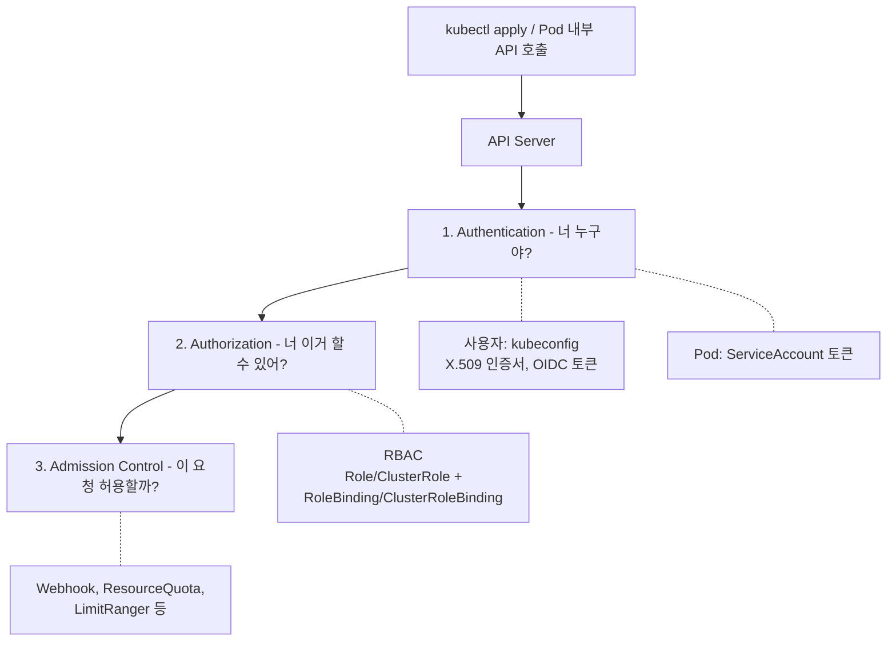
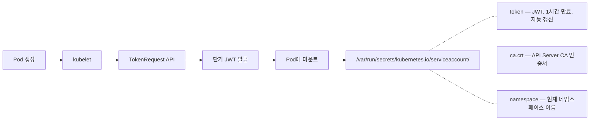
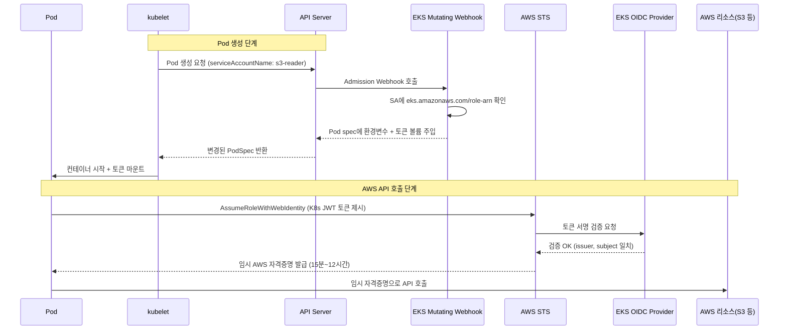

# RBAC & ServiceAccount

- Kubernetes에서 "누가 무엇을 할 수 있는가"를 제어하는 메커니즘이다.
- RBAC(Role-Based Access Control)는 역할 기반으로 API 접근을 제한한다.
- ServiceAccount는 **Pod(애플리케이션)가 API Server에 인증할 때 사용하는 ID**이다.

## 전체 구조



> 인증(Authentication)을 통과해도, 인가(Authorization)에서 막힐 수 있다.

---

## 1. ServiceAccount

### 사용자 vs ServiceAccount

| 구분 | User Account | ServiceAccount |
|------|-------------|----------------|
| 대상 | 사람 (개발자, 운영자) | 프로세스 (Pod, Controller) |
| 생성 방식 | 외부 IdP, 인증서로 관리 | `kubectl create sa`로 K8s 리소스로 관리 |
| 범위 | 클러스터 전체 | **네임스페이스 단위** |
| 인증 수단 | kubeconfig (인증서, OIDC) | 자동 마운트되는 JWT 토큰 |

- K8s는 User Account를 직접 관리하지 않는다. 외부 IdP(OIDC, LDAP 등)에 위임한다.
- ServiceAccount는 K8s가 직접 관리하는 **네임스페이스 스코프 리소스**이다.

### 기본 동작

모든 네임스페이스에는 `default` ServiceAccount가 자동 생성된다.

```bash
$ kubectl get sa -n default
NAME      SECRETS   AGE
default   0         30d
```

Pod을 생성할 때 별도 지정이 없으면 `default` SA가 자동 할당된다.

```yaml
# Pod spec에 명시하지 않아도 내부적으로 이렇게 설정됨
spec:
  serviceAccountName: default
```

### ServiceAccount 토큰

K8s 1.24+부터 토큰 관리 방식이 크게 바뀌었다.

| 버전 | 방식 | 특징 |
|------|------|------|
| ~1.23 | Secret 기반 (영구 토큰) | SA 생성 시 자동으로 Secret 생성, 만료 없음 |
| 1.24+ | **TokenRequest API (단기 토큰)** | kubelet이 Pod 시작 시 동적으로 발급, 1시간 기본 만료 |



### 토큰 자동 마운트 비활성화

`default` SA는 RBAC 권한이 거의 없지만, 토큰이 탈취되면 최소한의 API 접근이 가능하다.
API를 호출할 필요 없는 Pod에서는 토큰 마운트를 꺼두는 것이 보안 모범 사례이다.

```yaml
# ServiceAccount 레벨에서 비활성화 (해당 SA를 쓰는 모든 Pod에 적용)
apiVersion: v1
kind: ServiceAccount
metadata:
  name: no-api-access
automountServiceAccountToken: false

---

# Pod 레벨에서 비활성화 (이 Pod만 적용)
apiVersion: v1
kind: Pod
metadata:
  name: my-app
spec:
  serviceAccountName: no-api-access
  automountServiceAccountToken: false
  containers:
    - name: app
      image: my-app:latest
```

---

## 2. RBAC

Role, ClusterRole, RoleBinding, ClusterRoleBinding에 대한 상세 내용은 [rbac-role.md](./rbac-role.md)를 참고한다.

SA와 RBAC의 관계 요약:
- SA 자체는 **권한을 갖지 않는다** (신분증일 뿐)
- **RoleBinding**이 SA와 Role을 연결해야 비로소 권한이 생긴다
- RBAC는 **허용 목록(allowlist)** 방식이다. 명시적으로 허용하지 않으면 기본 거부(deny)된다

---

## 7. EKS에서의 ServiceAccount — IRSA

Pod이 AWS 리소스(S3, DynamoDB, SQS 등)에 접근하려면 AWS 자격증명이 필요하다.

```
❌ Pod에 AWS_ACCESS_KEY 환경변수 — 탈취 위험, 키 관리 지옥
❌ EC2 Instance Profile 공유 — 노드의 모든 Pod이 같은 권한
✅ IRSA — Pod(ServiceAccount) 단위로 IAM Role 부여
```

### IRSA (IAM Roles for Service Accounts) 동작 흐름



### 설정

```yaml
# 1. ServiceAccount에 IAM Role 연결
apiVersion: v1
kind: ServiceAccount
metadata:
  name: s3-reader
  namespace: default
  annotations:
    eks.amazonaws.com/role-arn: arn:aws:iam::123456789012:role/S3ReaderRole
```

```json
// 2. IAM Role의 Trust Policy — 이 SA만 이 Role을 assume할 수 있게
{
  "Effect": "Allow",
  "Principal": {
    "Federated": "arn:aws:iam::123456789012:oidc-provider/oidc.eks.ap-northeast-2.amazonaws.com/id/ABCDE12345"
  },
  "Action": "sts:AssumeRoleWithWebIdentity",
  "Condition": {
    "StringEquals": {
      "oidc.eks....:sub": "system:serviceaccount:default:s3-reader"
    }
  }
}
```

```yaml
# 3. Pod에서 사용 — AWS SDK가 자동으로 토큰을 감지해서 STS로 교환
spec:
  serviceAccountName: s3-reader
  containers:
    - name: app
      image: my-app
```

EKS Mutating Webhook이 Pod에 자동 주입하는 것들:

```
AWS_ROLE_ARN=arn:aws:iam::123456789012:role/S3ReaderRole
AWS_WEB_IDENTITY_TOKEN_FILE=/var/run/secrets/eks.amazonaws.com/serviceaccount/token
```

### EKS Pod Identity (IRSA 후속, 2023~)

IRSA를 더 간소화한 방식이다. OIDC Provider 설정 없이 CLI 한 줄로 연결 가능하다.

```bash
aws eks create-pod-identity-association \
  --cluster-name my-cluster \
  --namespace default \
  --service-account s3-reader \
  --role-arn arn:aws:iam::123456789012:role/S3ReaderRole
```

| | IRSA | Pod Identity |
|---|---|---|
| OIDC Provider 설정 | 필요 | **불필요** |
| Trust Policy 수정 | Role마다 직접 | **자동 관리** |
| SA annotation | 필요 | **불필요** |
| 크로스 계정 | 복잡 | 더 간단 |
