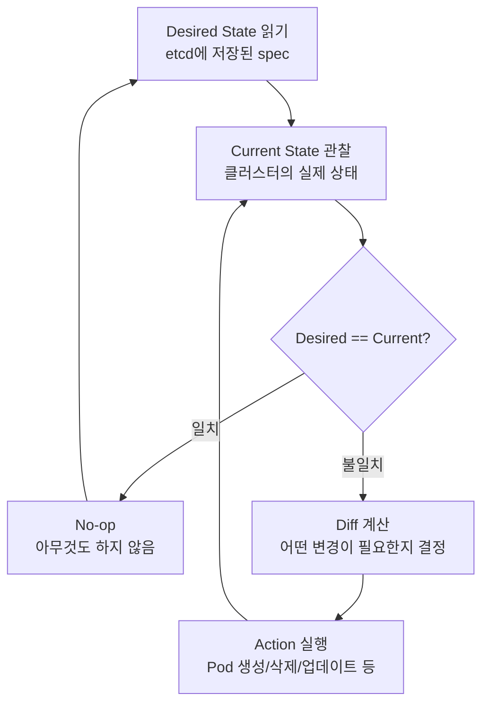
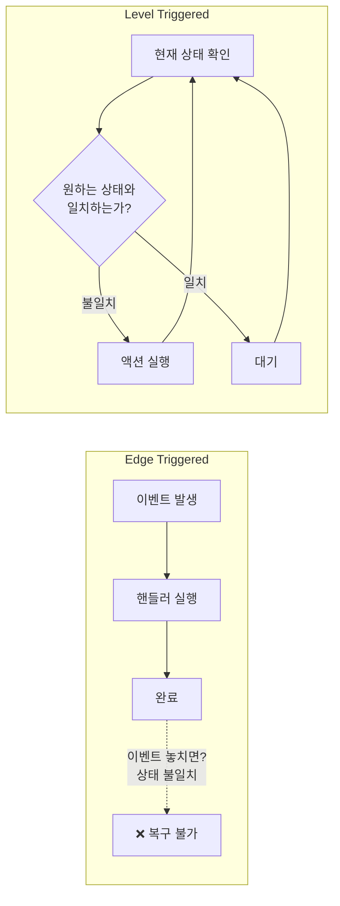
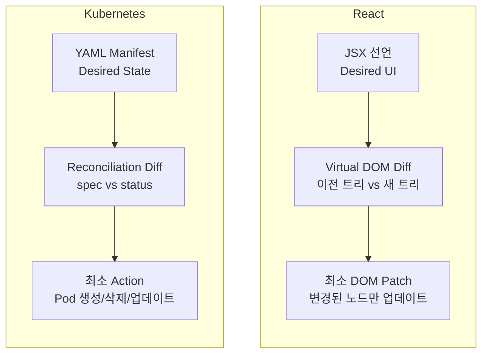
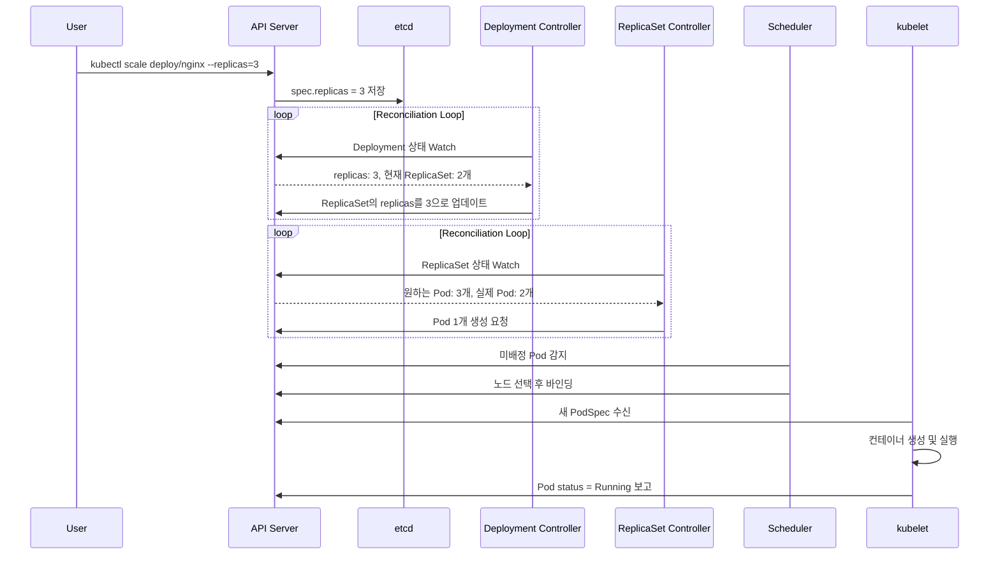
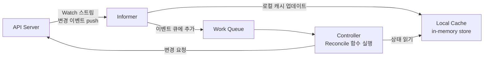
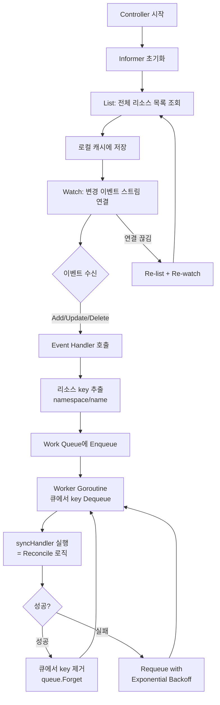
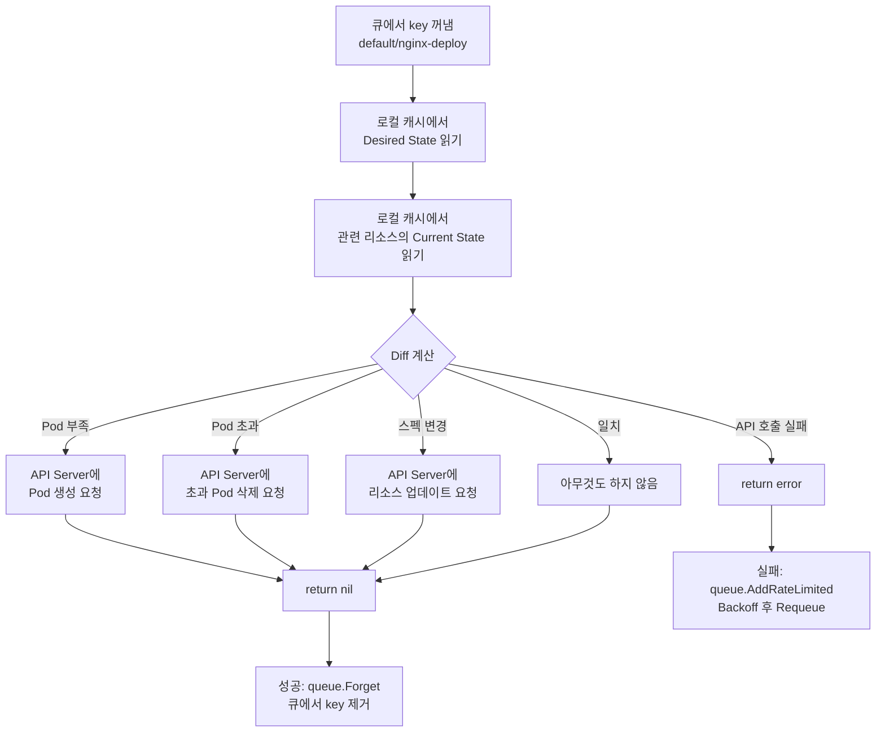
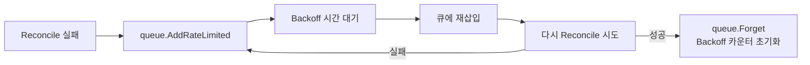
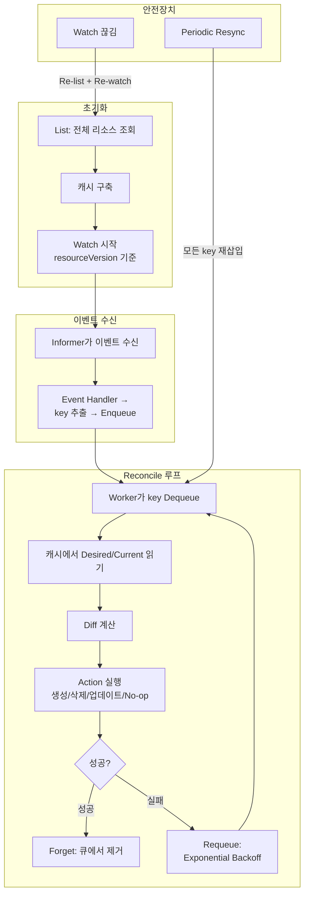

# Reconciliation Loop

- Kubernetes의 **핵심 동작 원리**이다.
- "원하는 상태(Desired State)와 현재 상태(Current State)를 비교하고, 차이가 있으면 현재 상태를 원하는 상태로 수렴시키는 무한 루프"
- Controller Manager 내부의 각 Controller가 이 루프를 독립적으로 실행한다.

---

## 동작 원리



### 단계별 설명

| 단계 | 설명 |
|------|------|
| **1. Observe** | API Server를 통해 현재 상태(status)를 관찰한다 |
| **2. Diff** | etcd에 저장된 원하는 상태(spec)와 비교한다 |
| **3. Act** | 차이가 있으면 원하는 상태로 맞추기 위한 액션을 수행한다 |

이 3단계가 **무한히 반복**된다. 이것이 Reconciliation Loop의 전부다.

---

## Level Triggered vs Edge Triggered

Reconciliation Loop를 이해하는 데 가장 중요한 개념이다.



| | Edge Triggered | Level Triggered |
|---|---|---|
| **트리거** | "이벤트가 발생했을 때" 반응 | "상태가 다를 때" 반응 |
| **예시** | "Pod이 죽었다" 이벤트 수신 → 재생성 | "Pod이 2개여야 하는데 1개다" → 재생성 |
| **이벤트 유실** | 이벤트를 놓치면 상태 불일치 발생 | 상태 자체를 보므로 유실 개념이 없음 |
| **멱등성** | 보장하기 어려움 | 자연스럽게 보장 |

Kubernetes는 **Level Triggered** 방식이다.

- "Pod 삭제 이벤트가 발생했으니 새로 만든다" (X)
- "replicas가 3이어야 하는데 현재 2개다. 1개 만든다" (O)

이벤트를 놓쳐도, 컨트롤러가 재시작되어도, 다음 루프에서 **현재 상태**를 보고 판단하므로 항상 올바른 결과에 수렴한다.

---

## Virtual DOM과의 비교

Reconciliation Loop는 React의 Virtual DOM과 **동일한 패턴**을 따른다.



| | React Virtual DOM | K8s Reconciliation Loop |
|---|---|---|
| **Desired State** | JSX로 선언한 UI 트리 | YAML manifest의 spec |
| **Current State** | 브라우저의 실제 DOM | 클러스터에서 실행 중인 리소스 |
| **Diff** | Virtual DOM 트리 비교 | etcd의 spec vs 실제 status 비교 |
| **Patch** | 변경된 DOM 노드만 업데이트 | Pod 생성/삭제/재시작 등 최소 조작 |
| **선언적** | "UI가 이렇게 보여야 한다" | "클러스터가 이 상태여야 한다" |
| **멱등성** | 같은 state → 같은 UI | 같은 spec → 같은 클러스터 상태 |

핵심 공통점: **"어떻게(how)" 변경할지 명령하지 않고, "무엇(what)"이 되어야 하는지 선언하면 시스템이 diff → patch를 수행한다.**

---

## 실제 동작 예시: Deployment replicas 변경



여러 Controller가 **각자의 Reconciliation Loop**를 독립적으로 실행한다:
- **Deployment Controller**: Deployment spec → ReplicaSet 관리
- **ReplicaSet Controller**: ReplicaSet spec → Pod 수 관리
- **Scheduler**: 미배정 Pod → 노드 배정
- **kubelet**: PodSpec → 컨테이너 실행

각 Controller는 자기 책임 범위만 관리하고, 다른 Controller의 동작에 의존하지 않는다.

---

## Controller의 Watch 메커니즘

Reconciliation Loop가 매번 전체 상태를 폴링하면 비효율적이다. Kubernetes는 **Watch + 로컬 캐시** 방식으로 이를 최적화한다.



| 컴포넌트 | 역할 |
|----------|------|
| **Informer** | API Server에 Watch 연결을 유지하고, 변경 이벤트를 수신한다 |
| **Local Cache** | 리소스의 최신 상태를 메모리에 캐싱한다. Controller는 API Server 대신 캐시를 읽는다 |
| **Work Queue** | 변경된 리소스의 key를 큐에 넣어 순서대로 처리한다. 중복 제거(dedup) 내장 |
| **Reconcile** | 큐에서 key를 꺼내 실제 reconciliation 로직을 실행한다 |

Watch 연결이 끊어지면 **List**로 전체 상태를 다시 가져온 뒤 Watch를 재개한다. Level Triggered이므로 이벤트 유실에도 안전하다.

---

## Reconcile 알고리즘 상세

### 전체 흐름



### 1단계: Informer 초기화 — List & Watch

Controller가 시작되면 가장 먼저 **Informer**를 생성한다.

```
1) List 호출  →  API Server에서 해당 리소스의 전체 목록을 가져온다
                  예: GET /api/v1/namespaces/default/pods
                  응답에 포함된 resourceVersion을 기록한다

2) 로컬 캐시 구축  →  List 결과를 in-memory store(Indexer)에 저장한다
                      key: namespace/name
                      value: 리소스 오브젝트 전체

3) Watch 시작  →  기록한 resourceVersion부터 변경 스트림을 수신한다
                  GET /api/v1/namespaces/default/pods?watch=true&resourceVersion=12345
                  서버가 변경 이벤트를 chunked response로 push한다
```

**resourceVersion**은 etcd의 리비전 번호에 대응한다. Watch를 시작할 때 이 값을 전달하면, 해당 시점 이후의 변경만 수신할 수 있다. 이미 알고 있는 상태를 다시 받지 않는다.

### 2단계: Event Handler → Work Queue

Informer가 이벤트(ADDED, MODIFIED, DELETED)를 수신하면 등록된 Event Handler가 호출된다.

```
Event Handler의 역할: 이벤트에서 key(namespace/name)를 추출하여 Work Queue에 넣는다

OnAdd(obj)    → queue.Add("default/nginx-abc123")
OnUpdate(old, new) → queue.Add("default/nginx-abc123")
OnDelete(obj) → queue.Add("default/nginx-abc123")
```

Work Queue의 특성:

| 특성 | 설명 |
|------|------|
| **중복 제거(Dedup)** | 같은 key가 이미 큐에 있으면 추가하지 않는다. 짧은 시간에 같은 리소스가 여러 번 변경되어도 Reconcile은 한 번만 실행된다 |
| **순서 보장 안 함** | 이벤트 순서가 아닌 "현재 상태"를 기준으로 판단하므로 순서가 중요하지 않다 (Level Triggered) |
| **Rate Limiting** | 동일 key의 재처리 빈도를 제한한다. 기본적으로 Exponential Backoff을 사용한다 |

> 중복 제거가 핵심이다. 1초 안에 같은 Pod이 10번 변경되어도 Reconcile은 **마지막 상태를 기준으로 1번**만 실행된다. 이것이 Level Triggered의 실질적 구현이다.

### 3단계: Worker — Reconcile 함수 실행

Worker goroutine이 큐에서 key를 꺼내 **syncHandler**(= Reconcile 함수)를 실행한다.



#### Reconcile 함수의 의사코드 (ReplicaSet Controller 기준)

```
func syncHandler(key string):
    1. 로컬 캐시에서 ReplicaSet 조회
       rs = cache.Get(key)
       if rs == nil:
           return nil  // 이미 삭제됨, 할 일 없음

    2. 현재 상태 파악
       allPods = cache.ListPods(rs.namespace)
       ownedPods = filter(allPods, pod.ownerRef == rs.uid)
       activePods = filter(ownedPods, pod.status != Failed/Succeeded)

    3. Diff 계산
       diff = rs.spec.replicas - len(activePods)

    4. Action 실행
       if diff > 0:
           // Pod이 부족 → 생성
           for i in range(diff):
               apiServer.Create(newPod(rs.spec.template))

       else if diff < 0:
           // Pod이 초과 → 삭제 (가장 최근에 생성된 것부터)
           podsToDelete = selectPodsToDelete(activePods, abs(diff))
           for pod in podsToDelete:
               apiServer.Delete(pod)

       else:
           // 일치 → 아무것도 하지 않음
           return nil

    5. Status 업데이트
       rs.status.replicas = len(activePods)
       rs.status.readyReplicas = count(activePods, isReady)
       apiServer.UpdateStatus(rs)
```

### 4단계: 실패 처리 — Exponential Backoff

Reconcile이 실패하면(API Server 일시 장애, 리소스 충돌 등) 즉시 재시도하지 않는다.

```
재시도 간격: 5ms → 10ms → 20ms → 40ms → ... → 최대 1000s (약 16분)

시도  대기시간
1     5ms
2     10ms
3     20ms
4     40ms
5     80ms
...
N     min(5ms × 2^N, 1000s)
```



- **queue.AddRateLimited(key)**: Backoff 시간을 계산하여 지연 후 큐에 재삽입한다
- **queue.Forget(key)**: 성공 시 해당 key의 Backoff 카운터를 0으로 초기화한다
- **queue.NumRequeues(key)**: 현재 재시도 횟수를 확인할 수 있다

### 5단계: Periodic Resync

Watch만으로는 캐시와 실제 상태가 미세하게 어긋날 수 있다 (네트워크 문제, 버그 등). 이를 보완하기 위해 Informer는 **주기적으로 전체 리소스를 다시 큐에 넣는다**.

```
Resync (기본 30초~12시간, Controller마다 다름)

1. 로컬 캐시의 모든 리소스 key를 Work Queue에 다시 Enqueue
2. 각 key에 대해 Reconcile이 다시 실행됨
3. Desired == Current이면 No-op (멱등성)
4. 차이가 있으면 수정
```

이것은 "혹시 놓친 변경이 있을 수 있으니 한 번 더 확인하자"는 안전장치다. Level Triggered이므로 불필요한 Resync은 No-op으로 끝나 비용이 낮다.

---

## 전체 알고리즘 요약



| 단계 | 핵심 동작 | 보장하는 속성 |
|------|-----------|--------------|
| List & Watch | 초기 상태 동기화 + 실시간 변경 수신 | 캐시 정확성 |
| Dedup Queue | 동일 key 중복 제거 | 불필요한 처리 방지 |
| Reconcile | Desired vs Current diff → 최소 Action | 수렴(Convergence) |
| Backoff Retry | 실패 시 지수적 재시도 | 장애 내성 |
| Periodic Resync | 전체 key 재처리 | 누락 방지 (최종 안전망) |
| Re-list | Watch 끊김 시 전체 재동기화 | 연결 장애 복구 |

---

## 설계 원칙 정리

| 원칙 | 설명 |
|------|------|
| **선언적(Declarative)** | "어떻게" 가 아니라 "무엇을" 원하는지 기술한다 |
| **Level Triggered** | 이벤트가 아닌 현재 상태를 기준으로 판단한다 |
| **멱등성(Idempotent)** | 같은 desired state를 몇 번 적용해도 결과가 동일하다 |
| **수렴(Convergence)** | 어떤 장애가 발생해도 결국 desired state로 수렴한다 |
| **단일 책임** | 각 Controller는 하나의 리소스 타입만 관리한다 |
| **느슨한 결합** | Controller 간 직접 통신 없이 API Server를 통해서만 상호작용한다 |